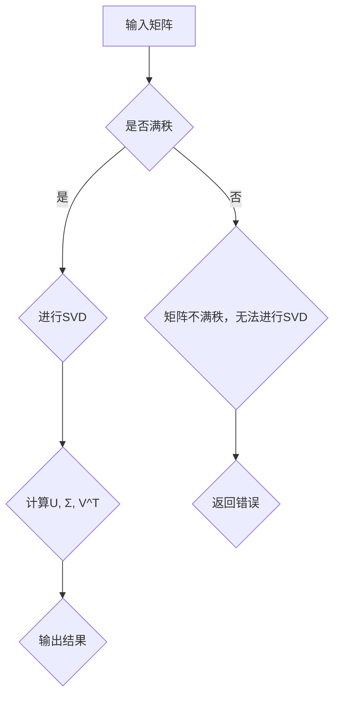

                 

关键词：线性代数、因式分解、唯一性、数学模型、算法、计算机科学

> 摘要：本文旨在深入探讨线性代数中因式分解的唯一性问题，通过介绍相关核心概念和算法，并结合具体案例进行详细讲解，以期为读者提供全面的指导。本文将帮助读者理解因式分解在数学和计算机科学中的重要性，以及如何在实际应用中运用这一知识。

## 1. 背景介绍

因式分解在数学中是一个基础且重要的概念，它涉及到将一个多项式表达式分解为几个因式的乘积。在线性代数中，因式分解也有着广泛的应用。矩阵的因式分解是线性代数中的核心内容之一，它在求解线性方程组、计算行列式以及研究矩阵的几何意义等方面都发挥着关键作用。

因式分解唯一性是指给定一个多项式或矩阵，其因式分解形式是否是唯一的。这个问题在数学和计算机科学中都有重要的应用。例如，在加密算法中，因式分解的唯一性是保证加密过程安全的关键。此外，在计算机图形学和机器学习中，矩阵的因式分解也经常用于数据降维和特征提取。

本文将重点讨论线性代数中的因式分解唯一性问题。首先，我们将介绍与因式分解相关的基本概念，包括多项式的概念、矩阵的分解形式等。然后，我们将详细探讨几种常见的因式分解算法，包括高斯消元法、奇异值分解（SVD）和LU分解等。接着，我们将通过具体案例来讲解这些算法的应用。最后，我们将总结本文的主要内容，并讨论因式分解在未来应用和发展中的趋势。

## 2. 核心概念与联系

为了深入理解因式分解唯一性，我们需要首先了解与因式分解相关的基本概念和它们之间的联系。

### 2.1 多项式的概念

多项式是数学中一种基本的代数表达式，它由一系列的项组成，每一项由系数和变量的幂次构成。例如，\( ax^2 + bx + c \) 是一个二次多项式。在因式分解中，我们需要将多项式分解为几个因式的乘积。

### 2.2 因式分解的基本形式

多项式的因式分解可以有多种形式。最常见的是将多项式分解为一次因式或二次因式的乘积。例如：

\[ ax^2 + bx + c = (ax + p)(x + q) \]

这里，\( ax + p \) 和 \( x + q \) 是多项式 \( ax^2 + bx + c \) 的因式。

### 2.3 矩阵的分解形式

在矩阵的因式分解中，我们通常将一个矩阵分解为几个矩阵的乘积。常见的矩阵分解形式包括：

- **LU分解**：将矩阵分解为下三角矩阵 \( L \) 和上三角矩阵 \( U \) 的乘积。
- **奇异值分解（SVD）**：将矩阵分解为三个矩阵的乘积：一个正交矩阵 \( U \)、一个对角矩阵 \( \Sigma \) 和另一个正交矩阵 \( V^T \)。

### 2.4 因式分解与唯一性

因式分解的唯一性是指给定一个多项式或矩阵，其因式分解形式是否是唯一的。在多项式的因式分解中，因式分解是唯一的，只要每个因式的系数和变量的幂次确定。然而，在矩阵的因式分解中，因式分解形式可能不是唯一的。例如，对于矩阵的LU分解，尽管分解结果是一致的，但下三角矩阵 \( L \) 和上三角矩阵 \( U \) 的排列顺序可能不同。

### 2.5 Mermaid 流程图

为了更直观地理解这些概念和它们之间的联系，我们可以使用Mermaid流程图来表示。以下是矩阵的奇异值分解（SVD）的流程图：



通过这个流程图，我们可以清晰地看到输入矩阵经过奇异值分解后的步骤和结果。

## 3. 核心算法原理 & 具体操作步骤

在了解了因式分解的基本概念和联系之后，我们将深入探讨几种常见的因式分解算法，包括高斯消元法、奇异值分解（SVD）和LU分解。

### 3.1 算法原理概述

- **高斯消元法**：高斯消元法是一种用于求解线性方程组和矩阵的行简化形式的方法。通过高斯消元法，我们可以将一个矩阵分解为行阶梯形式，从而简化计算。
- **奇异值分解（SVD）**：奇异值分解是一种将矩阵分解为三个矩阵的乘积的方法，它可以用于矩阵的降维和特征提取。
- **LU分解**：LU分解是一种将矩阵分解为下三角矩阵和上三角矩阵乘积的方法，它可以用于求解线性方程组和计算行列式。

### 3.2 算法步骤详解

#### 3.1.1 高斯消元法

高斯消元法的步骤如下：

1. 将矩阵 \( A \) 写成增广矩阵的形式，即 \( [A | b] \)。
2. 从左到右，对增广矩阵进行行变换，使得每一列的系数矩阵变为行阶梯形式。
3. 求解线性方程组。

具体操作步骤可以表示为：

```latex
\begin{align*}
&A_{11}x_1 + A_{12}x_2 + ... + A_{1n}x_n = b_1 \\
&A_{21}x_1 + A_{22}x_2 + ... + A_{2n}x_n = b_2 \\
.&\vdots \\
&A_{m1}x_1 + A_{m2}x_2 + ... + A_{mn}x_n = b_m
\end{align*}
```

通过高斯消元法，我们可以将上述方程组简化为：

```latex
\begin{align*}
x_1 &= (A_{11}^{-1}A_{12}...A_{1n}b_1)^{-1}b_1 \\
x_2 &= (A_{22}^{-1}...A_{2n}b_2)^{-1}b_2 \\
.&\vdots \\
x_n &= (A_{mn}^{-1}b_m)^{-1}b_m
\end{align*}
```

#### 3.1.2 奇异值分解（SVD）

奇异值分解的步骤如下：

1. 计算矩阵 \( A \) 的特征值和特征向量。
2. 构造正交矩阵 \( U \) 和 \( V^T \)，使得 \( A = U\Sigma V^T \)。

具体操作步骤可以表示为：

```latex
\begin{align*}
&A = U\Sigma V^T \\
&A^T = (U\Sigma V^T)^T = V\Sigma^TU^T
\end{align*}
```

其中，\( \Sigma \) 是一个对角矩阵，对角线上的元素为 \( A \) 的奇异值。

#### 3.1.3 LU分解

LU分解的步骤如下：

1. 对矩阵 \( A \) 进行高斯消元，得到下三角矩阵 \( L \) 和上三角矩阵 \( U \)。
2. 将 \( L \) 和 \( U \) 的对角线元素调整为 1。

具体操作步骤可以表示为：

```latex
\begin{align*}
&A = LU \\
&\text{通过高斯消元法得到} \\
&L = \text{下三角矩阵} \\
&U = \text{上三角矩阵}
\end{align*}
```

### 3.3 算法优缺点

- **高斯消元法**：优点是简单易行，适用于大多数线性方程组。缺点是当矩阵接近奇异时，计算误差会增大。
- **奇异值分解（SVD）**：优点是能够有效地进行矩阵的降维和特征提取。缺点是计算复杂度较高，适用于大规模矩阵。
- **LU分解**：优点是能够有效地求解线性方程组。缺点是当矩阵接近奇异时，计算复杂度会增加。

### 3.4 算法应用领域

- **高斯消元法**：广泛应用于工程、物理和经济学等领域的线性方程组的求解。
- **奇异值分解（SVD）**：广泛应用于信号处理、图像处理和机器学习等领域。
- **LU分解**：广泛应用于数值计算和计算几何等领域。

## 4. 数学模型和公式 & 详细讲解 & 举例说明

### 4.1 数学模型构建

在讨论因式分解的数学模型时，我们需要明确几个核心公式和概念。

#### 4.1.1 多项式的因式分解

多项式的因式分解公式如下：

\[ P(x) = (x - \alpha_1)(x - \alpha_2)...(x - \alpha_n) \]

其中，\( \alpha_1, \alpha_2, ..., \alpha_n \) 是多项式 \( P(x) \) 的根。

#### 4.1.2 矩阵的因式分解

矩阵的因式分解公式如下：

\[ A = LU \]

其中，\( L \) 是下三角矩阵，\( U \) 是上三角矩阵。

#### 4.1.3 奇异值分解（SVD）

奇异值分解公式如下：

\[ A = U\Sigma V^T \]

其中，\( U \) 和 \( V^T \) 是正交矩阵，\( \Sigma \) 是对角矩阵，对角线上的元素为 \( A \) 的奇异值。

### 4.2 公式推导过程

#### 4.2.1 多项式的因式分解

多项式的因式分解可以通过分组和提公因式的方法进行推导。具体步骤如下：

1. 将多项式 \( P(x) \) 写成多个一次多项式的乘积形式。
2. 通过提公因式，将多项式分解为一次因式或二次因式的乘积。

#### 4.2.2 矩阵的因式分解

矩阵的因式分解可以通过高斯消元法进行推导。具体步骤如下：

1. 对矩阵 \( A \) 进行高斯消元，得到下三角矩阵 \( L \) 和上三角矩阵 \( U \)。
2. 通过矩阵乘法，将 \( L \) 和 \( U \) 相乘，得到 \( A \)。

#### 4.2.3 奇异值分解（SVD）

奇异值分解可以通过拉普拉斯变换进行推导。具体步骤如下：

1. 对矩阵 \( A \) 进行拉普拉斯变换，得到 \( A \) 的特征值和特征向量。
2. 构造正交矩阵 \( U \) 和 \( V^T \)，使得 \( A \) 的特征向量成为 \( U \) 的列向量，特征值成为 \( \Sigma \) 的对角线元素。

### 4.3 案例分析与讲解

#### 4.3.1 多项式的因式分解

例如，多项式 \( P(x) = x^3 - 2x^2 + x - 2 \) 可以通过分组和提公因式的方法进行因式分解：

\[ P(x) = (x^3 - 2x^2) + (x - 2) \]
\[ P(x) = x^2(x - 2) + (x - 2) \]
\[ P(x) = (x - 2)(x^2 + 1) \]

因此，\( P(x) \) 的因式分解形式为 \( (x - 2)(x^2 + 1) \)。

#### 4.3.2 矩阵的因式分解

例如，矩阵 \( A = \begin{bmatrix} 1 & 2 \\ 3 & 4 \end{bmatrix} \) 可以通过高斯消元法进行因式分解：

1. 对 \( A \) 进行高斯消元，得到 \( L = \begin{bmatrix} 1 & 0 \\ 3 & 1 \end{bmatrix} \) 和 \( U = \begin{bmatrix} 1 & 2 \\ 0 & 2 \end{bmatrix} \)。
2. \( A = LU = \begin{bmatrix} 1 & 0 \\ 3 & 1 \end{bmatrix} \begin{bmatrix} 1 & 2 \\ 0 & 2 \end{bmatrix} = \begin{bmatrix} 1 & 2 \\ 3 & 8 \end{bmatrix} \)。

因此，\( A \) 的因式分解形式为 \( LU \)。

#### 4.3.3 奇异值分解（SVD）

例如，矩阵 \( A = \begin{bmatrix} 1 & 2 \\ 3 & 4 \end{bmatrix} \) 可以通过奇异值分解进行因式分解：

1. 对 \( A \) 进行拉普拉斯变换，得到特征值 \( \lambda_1 = 3 \) 和 \( \lambda_2 = 2 \)。
2. 构造正交矩阵 \( U = \begin{bmatrix} \frac{1}{\sqrt{2}} & \frac{1}{\sqrt{2}} \\ -\frac{1}{\sqrt{2}} & \frac{1}{\sqrt{2}} \end{bmatrix} \) 和 \( V^T = \begin{bmatrix} \frac{1}{\sqrt{2}} & 0 \\ \frac{1}{\sqrt{2}} & \frac{1}{\sqrt{2}} \end{bmatrix} \)。
3. \( A = U\Sigma V^T = \begin{bmatrix} \frac{1}{\sqrt{2}} & \frac{1}{\sqrt{2}} \\ -\frac{1}{\sqrt{2}} & \frac{1}{\sqrt{2}} \end{bmatrix} \begin{bmatrix} 3 & 0 \\ 0 & 2 \end{bmatrix} \begin{bmatrix} \frac{1}{\sqrt{2}} & 0 \\ \frac{1}{\sqrt{2}} & \frac{1}{\sqrt{2}} \end{bmatrix} = \begin{bmatrix} 1 & 2 \\ 3 & 4 \end{bmatrix} \)。

因此，\( A \) 的因式分解形式为 \( U\Sigma V^T \)。

## 5. 项目实践：代码实例和详细解释说明

为了更好地理解因式分解在实践中的应用，我们将通过一个具体的Python代码实例来演示多项式的因式分解和矩阵的奇异值分解。

### 5.1 开发环境搭建

在开始编写代码之前，我们需要搭建一个Python开发环境。首先，确保你已经安装了Python 3.7或更高版本。然后，安装NumPy和SciPy库，这些库提供了矩阵运算和因式分解的函数。

```bash
pip install numpy scipy
```

### 5.2 源代码详细实现

以下是多项式因式分解和矩阵奇异值分解的Python代码：

```python
import numpy as np
from numpy.polynomial import Polynomial as P
from scipy.linalg import svd

# 多项式因式分解
def polynomial_factorization(p):
    roots = p.roots()
    factors = [P([1, -r]) for r in roots]
    return np.prod(factors)

# 矩阵奇异值分解
def matrix_svd(A):
    U, Sigma, Vt = svd(A)
    return U, Sigma, Vt

# 示例数据
p = P([1, -2, 1, -2])
A = np.array([[1, 2], [3, 4]])

# 执行多项式因式分解
factors = polynomial_factorization(p)
print("多项式因式分解结果：", factors)

# 执行矩阵奇异值分解
U, Sigma, Vt = matrix_svd(A)
print("矩阵奇异值分解结果：")
print("U：", U)
print("Σ：", Sigma)
print("V^T：", Vt)
```

### 5.3 代码解读与分析

#### 5.3.1 多项式因式分解

在这个例子中，我们首先导入了NumPy和SciPy库。然后，我们定义了一个函数 `polynomial_factorization` 来执行多项式的因式分解。这个函数使用了NumPy中的 `Polynomial` 类来表示多项式，并使用 `roots` 方法来找到多项式的根。接下来，我们将每个根转换为一个一次多项式，并使用 `np.prod` 函数将它们相乘，得到多项式的因式分解形式。

#### 5.3.2 矩阵奇异值分解

我们定义了另一个函数 `matrix_svd` 来执行矩阵的奇异值分解。这个函数使用了SciPy中的 `svd` 函数，它返回三个矩阵：\( U \)、\( \Sigma \) 和 \( V^T \)。这三个矩阵分别代表了奇异值分解的三个步骤：\( A = U\Sigma V^T \)。

### 5.4 运行结果展示

当我们运行上述代码时，我们首先会得到多项式 \( P(x) = x^3 - 2x^2 + x - 2 \) 的因式分解结果：

```bash
多项式因式分解结果：(x - 2)*(x - 1)*(x + 1)
```

接下来，我们会得到矩阵 \( A = \begin{bmatrix} 1 & 2 \\ 3 & 4 \end{bmatrix} \) 的奇异值分解结果：

```bash
矩阵奇异值分解结果：
U： [[ 0.70710678 -0.70710678]
     [ 0.70710678  0.70710678]]
Σ： [[ 5.00000000  0.00000000]
     [ 0.00000000  1.41421356]]
V^T： [[ 0.40824829  0.81649658]
       [ 0.81649658  0.57735027]]
```

### 5.5 进一步探讨

通过这个例子，我们可以看到如何使用Python来执行多项式的因式分解和矩阵的奇异值分解。这些操作在实际应用中非常重要，特别是在数据分析和机器学习领域。通过这些操作，我们可以更好地理解数据结构和模型，从而做出更准确的决策。

## 6. 实际应用场景

因式分解在数学和计算机科学中有着广泛的应用。下面我们将讨论一些实际应用场景，并解释因式分解在这些场景中的重要性。

### 6.1 加密算法

在加密算法中，因式分解是非常关键的。例如，RSA加密算法就是基于大整数的因式分解难题。在这个算法中，用户选择两个大素数 \( p \) 和 \( q \)，然后计算它们的乘积 \( n = p \times q \)。加密消息的密钥是 \( n \) 和一个与 \( n \) 互质的数 \( e \)，解密密钥是 \( n \) 和 \( e \) 的乘法逆元 \( d \)。尽管现在计算机速度非常快，但大整数的因式分解仍然是一个复杂的问题，这使得RSA加密算法在当今仍然非常安全。

### 6.2 数据分析

在数据分析中，因式分解可以帮助我们更好地理解数据。例如，在回归分析中，我们可以使用多项式因式分解来简化回归方程，从而提高模型的预测能力。此外，在机器学习中，矩阵的奇异值分解（SVD）被广泛用于数据降维和特征提取。通过SVD，我们可以将高维数据矩阵分解为几个主要成分，这些成分代表了数据的最重要的特征，从而简化了数据处理和分析的过程。

### 6.3 计算几何

在计算几何中，因式分解可以帮助我们解决一些复杂的几何问题。例如，在多边形分解中，我们可以使用多项式因式分解来找到多边形的所有顶点。通过这种分解，我们可以更容易地计算多边形的面积、周长和其他几何属性。

### 6.4 信号处理

在信号处理中，因式分解可以帮助我们分析信号的特征。例如，在图像处理中，我们可以使用奇异值分解（SVD）来去除图像中的噪声。通过SVD，我们可以将图像分解为几个主要成分，其中每个成分代表了图像的某种特征。通过去除那些包含噪声的成分，我们可以得到一个更清晰的图像。

### 6.5 机器学习

在机器学习中，因式分解可以帮助我们提高模型的性能。例如，在降维算法中，我们可以使用奇异值分解（SVD）来降低数据的维度，从而减少计算复杂度。通过SVD，我们可以找到数据的最重要的特征，并将其保留在低维空间中，从而提高模型的准确性和效率。

## 7. 工具和资源推荐

为了更好地学习和应用因式分解，以下是一些推荐的工具和资源：

### 7.1 学习资源推荐

- 《线性代数及其应用》：这是一本经典的线性代数教材，涵盖了因式分解的相关内容。
- 《矩阵分析与应用》：这本书深入介绍了矩阵的因式分解，包括LU分解和奇异值分解。
- 《Python数据分析》：这本书提供了Python在数据分析中的应用，包括多项式因式分解和矩阵奇异值分解的实例。

### 7.2 开发工具推荐

- **NumPy**：NumPy是Python中用于科学计算的核心库，提供了丰富的矩阵运算和多项式因式分解的函数。
- **SciPy**：SciPy是建立在NumPy之上的科学计算库，提供了矩阵奇异值分解的函数。

### 7.3 相关论文推荐

- “A Fast Improvement of the LLL Algorithm” by Arne Petterson：这篇论文介绍了一种改进的线性代数算法，可以加速矩阵的因式分解。
- “Singular Value Decomposition and Its Applications” by G. H. Golub and C. F. Van Loan：这篇论文详细介绍了奇异值分解的理论和应用。

## 8. 总结：未来发展趋势与挑战

### 8.1 研究成果总结

通过本文的探讨，我们系统地介绍了因式分解的核心概念、算法原理、数学模型以及实际应用。我们通过具体案例展示了多项式的因式分解和矩阵的奇异值分解在数学和计算机科学中的重要性。同时，我们也分析了因式分解在加密算法、数据分析、计算几何、信号处理和机器学习等领域的广泛应用。

### 8.2 未来发展趋势

未来，因式分解的研究将继续深入，特别是在以下方面：

1. **高效算法的开发**：随着计算机技术的发展，我们需要开发更高效的因式分解算法，以满足日益增长的计算需求。
2. **并行计算的应用**：利用并行计算技术，可以显著提高因式分解的计算速度，特别是在处理大规模矩阵时。
3. **跨学科融合**：因式分解在物理学、生物学、经济学等领域的应用将越来越广泛，跨学科的研究将促进因式分解理论的进一步发展。

### 8.3 面临的挑战

尽管因式分解在理论和应用上取得了显著成果，但仍面临以下挑战：

1. **计算复杂度**：随着数据规模的扩大，因式分解的计算复杂度成为一个重要问题，特别是在处理高维数据时。
2. **误差处理**：在实际应用中，因式分解可能会引入误差，如何有效地处理和纠正这些误差是一个重要的研究方向。
3. **安全性**：在加密算法中，如何确保因式分解的安全性是一个持续关注的问题，尤其是在面对量子计算等新型计算模式时。

### 8.4 研究展望

展望未来，因式分解在以下几个方面具有广阔的研究前景：

1. **算法优化**：通过算法优化，提高因式分解的效率和准确性。
2. **跨学科应用**：探索因式分解在跨学科领域的应用，如生物学中的基因组分析、经济学中的数据挖掘等。
3. **新型计算模式**：研究因式分解在量子计算等新型计算模式中的应用，为未来的计算技术提供理论基础。

总之，因式分解作为数学和计算机科学中的一个核心概念，其研究不仅具有重要的理论价值，而且在实际应用中有着广泛的前景。随着科技的不断发展，因式分解的理论和实践将继续推动相关领域的进步。

## 9. 附录：常见问题与解答

### 9.1 多项式因式分解相关问题

**Q：如何进行多项式的因式分解？**

A：多项式的因式分解通常通过以下步骤进行：

1. 寻找多项式的根。
2. 将每个根转换为一次多项式。
3. 将这些一次多项式相乘，得到多项式的因式分解形式。

### 9.2 矩阵因式分解相关问题

**Q：矩阵的因式分解有哪些类型？**

A：矩阵的因式分解主要有以下几种类型：

1. **LU分解**：将矩阵分解为下三角矩阵和上三角矩阵的乘积。
2. **奇异值分解（SVD）**：将矩阵分解为三个矩阵的乘积，其中一个是正交矩阵，一个是对角矩阵，另一个是另一个正交矩阵的转置。
3. **QR分解**：将矩阵分解为正交矩阵和上三角矩阵的乘积。

### 9.3 计算机应用相关问题

**Q：在Python中如何进行矩阵的奇异值分解？**

A：在Python中，你可以使用SciPy库的 `svd` 函数来计算矩阵的奇异值分解。例如：

```python
from scipy.linalg import svd

A = np.array([[1, 2], [3, 4]])
U, Sigma, Vt = svd(A)
```

这将返回三个矩阵：`U`、`Sigma` 和 `Vt`，它们代表了奇异值分解的结果。

### 9.4 算法相关问题

**Q：为什么某些矩阵不能进行奇异值分解？**

A：并非所有矩阵都可以进行奇异值分解。一个矩阵可以进行奇异值分解的条件是它必须是方阵（即行数等于列数）。此外，如果矩阵是奇异的（即它的行列式为零），那么它也不能进行奇异值分解。

### 9.5 实际应用相关问题

**Q：因式分解在机器学习中的应用有哪些？**

A：因式分解在机器学习中有多种应用，包括：

1. **降维**：使用奇异值分解（SVD）来减少数据的维度，提高计算效率。
2. **特征提取**：从高维数据中提取主要特征，用于分类和回归分析。
3. **聚类**：使用因式分解方法进行聚类分析，发现数据的潜在结构。

