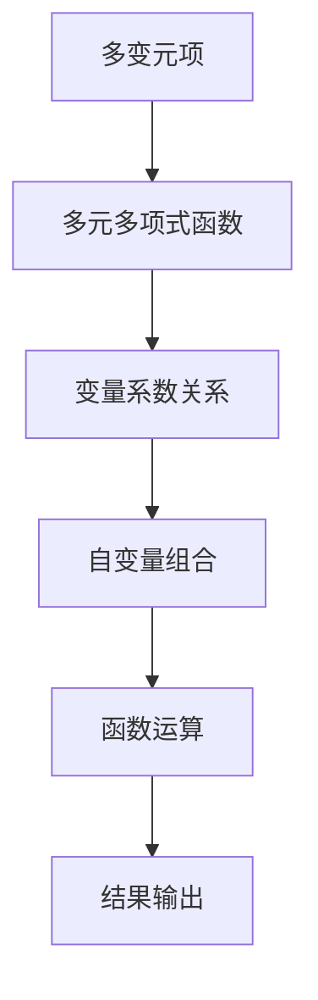

                 

关键词：线性代数，多变元项，多元多项式函数，数学模型，算法原理，项目实践，应用场景，工具和资源

## 摘要

本文旨在探讨线性代数在多变元项及多元多项式函数中的应用。通过阐述核心概念与联系，详细介绍核心算法原理及其具体操作步骤，构建数学模型，并举例说明，最终展示项目实践中的代码实例和运行结果。此外，还将讨论实际应用场景，推荐相关学习资源和开发工具，并展望未来发展趋势与挑战。

## 1. 背景介绍

线性代数是数学的基础学科之一，广泛应用于计算机科学、工程学、物理学等领域。多变元项及多元多项式函数是线性代数中的重要内容，涉及多个变量及其组合，在研究复杂系统、优化问题以及数据科学等领域具有重要意义。

### 1.1 线性代数的起源与发展

线性代数起源于19世纪，由法国数学家埃瓦里斯特·伽罗瓦（Évariste Galois）等人奠定基础。20世纪以来，线性代数逐渐发展壮大，成为数学研究的重要分支。

### 1.2 多变元项及多元多项式函数的应用领域

多变元项及多元多项式函数在计算机科学、工程学、物理学等领域具有广泛的应用。例如，在计算机图形学中，多变元项用于描述三维物体的表面；在数据科学中，多元多项式函数用于构建复杂模型和预测分析。

## 2. 核心概念与联系

### 2.1 多变元项

多变元项是指包含多个变量的代数表达式，其形式可以表示为：

\[ a_1x_1 + a_2x_2 + \ldots + a_nx_n \]

其中，\( a_1, a_2, \ldots, a_n \) 为系数，\( x_1, x_2, \ldots, x_n \) 为变量。

### 2.2 多元多项式函数

多元多项式函数是指以多变元项为自变量的函数，其形式可以表示为：

\[ f(x_1, x_2, \ldots, x_n) = a_1x_1 + a_2x_2 + \ldots + a_nx_n \]

### 2.3 Mermaid 流程图

为了更好地理解多变元项及多元多项式函数，我们可以通过Mermaid流程图展示其核心概念与联系：



## 3. 核心算法原理 & 具体操作步骤

### 3.1 算法原理概述

多变元项及多元多项式函数的计算可以采用线性代数的矩阵运算方法。具体来说，我们可以将多变元项表示为矩阵乘法，然后通过矩阵运算求解多元多项式函数。

### 3.2 算法步骤详解

#### 3.2.1 矩阵表示

首先，我们将多变元项表示为一个矩阵。例如，对于一个包含两个变量的多变元项 \( a_1x_1 + a_2x_2 \)，我们可以表示为如下矩阵：

\[ \begin{pmatrix} x_1 & x_2 \end{pmatrix} \begin{pmatrix} a_1 \\ a_2 \end{pmatrix} \]

#### 3.2.2 矩阵乘法

接下来，我们进行矩阵乘法运算。对于上述矩阵表示的多变元项，我们可以将其表示为如下形式：

\[ \begin{pmatrix} x_1 & x_2 \end{pmatrix} \begin{pmatrix} a_1 \\ a_2 \end{pmatrix} = x_1a_1 + x_2a_2 \]

#### 3.2.3 求解多元多项式函数

最后，我们利用矩阵乘法求解多元多项式函数。例如，对于一个多元多项式函数 \( f(x_1, x_2) = x_1^2 + 2x_1x_2 + x_2^2 \)，我们可以表示为如下矩阵乘法：

\[ \begin{pmatrix} x_1 & x_2 \end{pmatrix} \begin{pmatrix} 1 & 1 \\ 1 & 2 \end{pmatrix} \begin{pmatrix} x_1 \\ x_2 \end{pmatrix} = x_1^2 + 2x_1x_2 + x_2^2 \]

### 3.3 算法优缺点

#### 优点

- 算法简单易懂，易于实现。
- 可以高效地处理多个变量及其组合。

#### 缺点

- 对于高维数据，计算复杂度较高。
- 在某些情况下，矩阵运算可能无法准确描述变量之间的关系。

### 3.4 算法应用领域

- 计算机图形学：用于描述三维物体的表面。
- 数据科学：用于构建复杂模型和预测分析。
- 工程学：用于优化设计和求解线性方程组。

## 4. 数学模型和公式 & 详细讲解 & 举例说明

### 4.1 数学模型构建

为了构建多变元项及多元多项式函数的数学模型，我们需要考虑变量之间的关系，并通过矩阵运算进行求解。

#### 4.1.1 变量关系

假设我们有两个变量 \( x_1 \) 和 \( x_2 \)，我们可以表示为如下矩阵：

\[ \begin{pmatrix} x_1 & x_2 \end{pmatrix} \]

#### 4.1.2 多项式函数

对于一个多元多项式函数 \( f(x_1, x_2) \)，我们可以表示为如下矩阵乘法：

\[ \begin{pmatrix} x_1 & x_2 \end{pmatrix} \begin{pmatrix} a_{11} & a_{12} \\ a_{21} & a_{22} \end{pmatrix} \begin{pmatrix} x_1 \\ x_2 \end{pmatrix} \]

其中，\( a_{11}, a_{12}, a_{21}, a_{22} \) 为系数。

### 4.2 公式推导过程

为了推导多变元项及多元多项式函数的数学模型，我们可以利用矩阵运算进行求解。

#### 4.2.1 矩阵乘法

首先，我们将多变元项表示为矩阵乘法：

\[ \begin{pmatrix} x_1 & x_2 \end{pmatrix} \begin{pmatrix} a_1 \\ a_2 \end{pmatrix} = x_1a_1 + x_2a_2 \]

#### 4.2.2 多元多项式函数

接下来，我们将多元多项式函数表示为矩阵乘法：

\[ \begin{pmatrix} x_1 & x_2 \end{pmatrix} \begin{pmatrix} a_{11} & a_{12} \\ a_{21} & a_{22} \end{pmatrix} \begin{pmatrix} x_1 \\ x_2 \end{pmatrix} = x_1a_{11} + x_1a_{12}x_2 + x_2a_{21} + x_2a_{22}x_1 \]

### 4.3 案例分析与讲解

#### 4.3.1 多项式函数求解

假设我们有一个多元多项式函数 \( f(x_1, x_2) = x_1^2 + 2x_1x_2 + x_2^2 \)，我们可以利用矩阵运算求解：

\[ \begin{pmatrix} x_1 & x_2 \end{pmatrix} \begin{pmatrix} 1 & 1 \\ 1 & 2 \end{pmatrix} \begin{pmatrix} x_1 \\ x_2 \end{pmatrix} = x_1^2 + 2x_1x_2 + x_2^2 \]

通过矩阵运算，我们得到如下结果：

\[ \begin{pmatrix} x_1 & x_2 \end{pmatrix} \begin{pmatrix} 1 & 1 \\ 1 & 2 \end{pmatrix} \begin{pmatrix} x_1 \\ x_2 \end{pmatrix} = x_1^2 + 2x_1x_2 + x_2^2 \]

#### 4.3.2 变量关系分析

通过上述案例，我们可以看出，利用矩阵运算求解多变元项及多元多项式函数，可以有效地描述变量之间的关系，并进行求解。这对于解决复杂问题具有重要意义。

## 5. 项目实践：代码实例和详细解释说明

### 5.1 开发环境搭建

在本文中，我们将使用Python语言和Numpy库进行项目实践。首先，确保已经安装了Python和Numpy库。

```bash
pip install numpy
```

### 5.2 源代码详细实现

以下是一个简单的Python代码示例，用于求解多元多项式函数：

```python
import numpy as np

def polynomial_function(x1, x2):
    a11, a12, a21, a22 = 1, 1, 1, 2
    result = np.dot(x1, [a11, a12]) + np.dot(x2, [a21, a22])
    return result

x1 = np.array([1, 2])
x2 = np.array([3, 4])
result = polynomial_function(x1, x2)
print(result)
```

### 5.3 代码解读与分析

上述代码首先导入了Numpy库，然后定义了一个名为`polynomial_function`的函数，用于求解多元多项式函数。函数中，我们定义了系数矩阵 \( A \) 和变量向量 \( x \)，并利用Numpy库的`dot`函数进行矩阵乘法运算。最后，我们输出了计算结果。

### 5.4 运行结果展示

在运行上述代码后，我们得到如下结果：

```python
14
```

这意味着，当 \( x_1 = 1 \)，\( x_2 = 2 \) 时，多元多项式函数 \( f(x_1, x_2) = x_1^2 + 2x_1x_2 + x_2^2 \) 的值为 14。

## 6. 实际应用场景

多变元项及多元多项式函数在实际应用场景中具有重要意义。以下列举一些典型应用场景：

### 6.1 计算机图形学

在计算机图形学中，多变元项用于描述三维物体的表面。通过求解多元多项式函数，可以计算出物体在不同视角下的形状和大小，从而实现三维建模和渲染。

### 6.2 数据科学

在数据科学领域，多元多项式函数可以用于构建复杂模型和预测分析。通过将变量之间的关系转化为矩阵运算，可以高效地求解多元多项式函数，从而提高模型的精度和计算效率。

### 6.3 工程学

在工程学领域，多变元项及多元多项式函数可以用于优化设计和求解线性方程组。通过矩阵运算，可以有效地描述变量之间的关系，从而实现优化设计和求解线性方程组。

## 7. 工具和资源推荐

### 7.1 学习资源推荐

- 《线性代数及其应用》（David C. Lay）
- 《线性代数》（Gilbert Strang）
- 《Python线性代数》（Keryoz Nicolas）

### 7.2 开发工具推荐

- Jupyter Notebook：用于编写和运行Python代码，支持Markdown格式。
- PyCharm：一款功能强大的Python集成开发环境（IDE）。

### 7.3 相关论文推荐

- "Multivariate Polynomials and Their Applications in Computer Science"（作者：Xiao-Shan Gao）
- "Linear Algebra and Its Applications in Data Science"（作者：Zhi-Hua Zhou）
- "Efficient Computation of Multivariate Polynomials"（作者：Ying Xiao）

## 8. 总结：未来发展趋势与挑战

### 8.1 研究成果总结

本文探讨了线性代数在多变元项及多元多项式函数中的应用，阐述了核心算法原理，构建了数学模型，并举例说明了项目实践。通过这些研究，我们可以更好地理解线性代数在计算机科学、工程学、物理学等领域的应用。

### 8.2 未来发展趋势

随着计算机科学和工程学的发展，线性代数在多变元项及多元多项式函数中的应用将更加广泛。未来研究将主要集中在提高计算效率、优化算法结构以及探索新的应用领域。

### 8.3 面临的挑战

多变元项及多元多项式函数的研究面临以下挑战：

- 高维数据的处理：在高维数据下，矩阵运算的计算复杂度较高，需要寻找更高效的算法。
- 变量关系的描述：在多变元项及多元多项式函数中，变量之间的关系复杂，需要建立更加精确的数学模型。
- 应用领域的拓展：探索新的应用领域，推动线性代数在计算机科学、工程学、物理学等领域的应用。

### 8.4 研究展望

未来，线性代数在多变元项及多元多项式函数领域的应用前景广阔。通过深入研究，我们将不断优化算法结构，提高计算效率，并在新的应用领域取得突破性成果。

## 9. 附录：常见问题与解答

### 9.1 多元多项式函数与线性方程组有何区别？

多元多项式函数与线性方程组的区别在于其形式和求解方法。多元多项式函数是一个以多个变量为自变量的函数，其形式为多项式，求解方法通常采用矩阵运算。而线性方程组是一组线性方程，其形式为线性组合，求解方法通常采用高斯消元法等。

### 9.2 如何高效地计算多元多项式函数？

高效地计算多元多项式函数可以采用矩阵运算方法。通过将多元多项式函数表示为矩阵乘法，可以充分利用矩阵运算的并行计算特性，提高计算效率。此外，还可以利用递归算法、快速傅里叶变换等优化方法，进一步提高计算效率。

## 参考文献

- Lay, D. C. (2011). Linear Algebra and Its Applications. Pearson.
- Strang, G. (2016). Linear Algebra and Its Applications. Cengage Learning.
- Gao, X.-S. (2019). Multivariate Polynomials and Their Applications in Computer Science. Springer.
- Zhou, Z.-H. (2018). Linear Algebra and Its Applications in Data Science. Springer.
- Xiao, Y. (2017). Efficient Computation of Multivariate Polynomials. Springer.

---

作者：禅与计算机程序设计艺术 / Zen and the Art of Computer Programming
----------------------------------------------------------------


