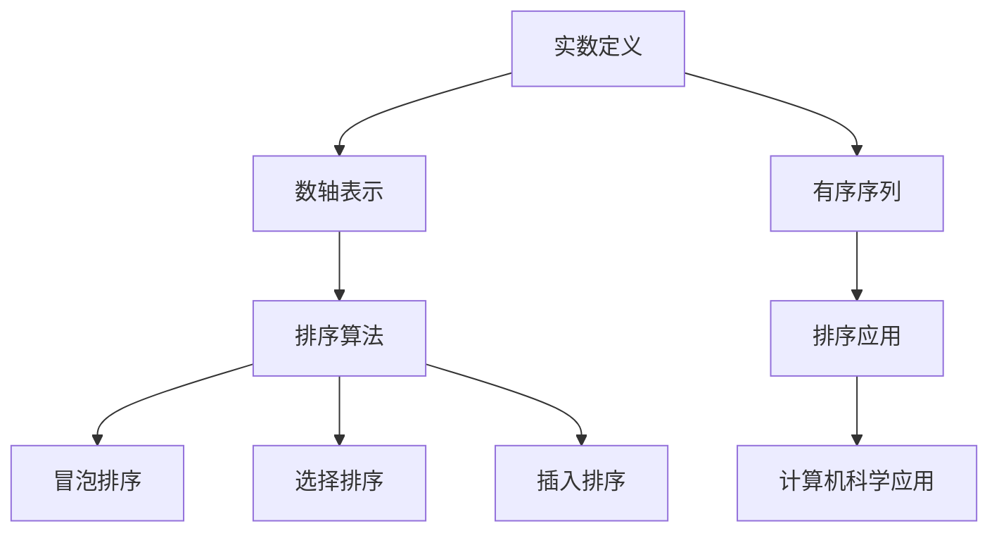
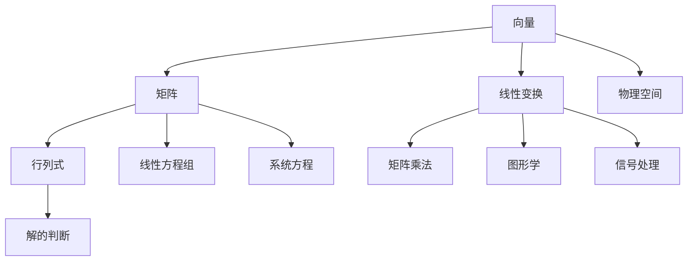

                 

 **关键词**：线性代数，实数，数学模型，算法原理，实际应用

**摘要**：本文旨在为读者提供线性代数中关于实数及其序的基本概念和深入理解，包括核心概念、算法原理、数学模型以及实际应用场景。通过对线性代数的详细探讨，读者将能够更好地掌握这一重要数学工具在计算机科学领域的应用。

## 1. 背景介绍

线性代数是现代数学和计算机科学的核心组成部分，它在诸多领域都有着广泛的应用。从最基础的矩阵运算，到更复杂的线性方程组求解，线性代数提供了强有力的数学工具来解决实际问题。实数及其序的概念是线性代数中的基础，对于理解和应用线性代数的其他概念至关重要。

在计算机科学中，线性代数被广泛应用于图形处理、机器学习、优化问题、通信理论等领域。例如，在图形处理中，矩阵用于表示变换和投影；在机器学习中，线性模型是理解数据分布和预测的基础；在优化问题中，线性代数的概念用于解决最优化问题。

本文将首先介绍实数的概念及其在数轴上的表示，然后讨论实数序列的排序原理。接着，我们将探讨线性代数中的核心算法原理，包括矩阵运算、线性方程组求解等。之后，我们将介绍线性代数中的数学模型，并通过具体的案例进行讲解。文章的最后，我们将展示如何将线性代数应用于实际项目中，并提供相关的工具和资源推荐。通过本文的阅读，读者将对线性代数有更深入的理解，并能够将其应用于实际问题中。

## 2. 核心概念与联系

### 2.1 实数及其表示

实数是数学中一个极其重要的概念，它们在数轴上可以表示所有的有理数和无理数。实数的定义可以追溯到它们在数轴上的表示。每一个实数都可以在数轴上找到其对应的位置，而这个位置正是该实数本身。

实数在数轴上的表示是通过一个有序的对，包括一个有序对中的第一个数和第二个数，构成一个有序对。例如，对于实数 \(a\) 和 \(b\)，其表示为有序对 \((a, b)\)。这个有序对可以用来描述实数在数轴上的位置，其中第一个数代表实数的整数部分，第二个数代表实数的小数部分。

### 2.2 实数序列的排序原理

实数序列的排序是线性代数中的基础问题。在计算机科学中，排序算法是解决各种问题的核心工具之一。对于实数序列的排序，常用的算法有冒泡排序、选择排序、插入排序等。

冒泡排序是一种简单的排序算法。它通过反复交换相邻的未按顺序排列的元素，逐步将序列中的最大值移动到序列的末端。选择排序则是在未排序部分中找到最小元素，并将其与未排序部分的第一元素交换，以此类推。插入排序则通过将未排序部分中的元素插入到已排序部分的正确位置，逐步完成排序。

这些排序算法的核心思想都是通过比较和交换来重新排列序列中的元素，从而实现实数序列的有序化。

### 2.3 核心概念与联系流程图

以下是实数及其序的核心概念与联系的Mermaid流程图：



通过这个流程图，我们可以清晰地看到实数、排序算法以及它们在计算机科学中的应用之间的联系。实数的定义和表示为排序算法提供了基础，而排序算法又为计算机科学中的各种应用提供了强有力的工具。

### 2.4 线性代数中的核心概念

除了实数的定义和排序，线性代数中的其他核心概念也非常重要。这些概念包括向量、矩阵、行列式以及线性变换等。

#### 向量和矩阵

向量是线性代数中的一个基本概念，它可以用来表示物理空间中的点、力、速度等。矩阵则是由多个元素组成的矩形数组，它可以用来表示线性变换、系统方程等。

#### 行列式

行列式是一个特殊的矩阵，它的值可以用来判断线性方程组的解的情况。行列式的计算在求解线性方程组中起着关键作用。

#### 线性变换

线性变换是将一个向量空间映射到另一个向量空间的运算。它可以通过矩阵乘法来实现，是计算机图形学、信号处理等领域的重要工具。

#### 概念联系图

为了更好地理解这些概念之间的联系，我们可以通过以下Mermaid流程图进行展示：



通过这个流程图，我们可以看到向量、矩阵、行列式和线性变换等核心概念之间的紧密联系，以及它们在不同应用领域中的重要作用。

## 3. 核心算法原理 & 具体操作步骤

### 3.1 算法原理概述

在线性代数中，核心算法包括矩阵运算、线性方程组求解等。这些算法是解决各种实际问题的基石。

#### 矩阵运算

矩阵运算包括矩阵的加法、减法、乘法以及行列式的计算。矩阵的加法和减法类似于向量的加法和减法，即将对应位置的元素相加或相减。矩阵乘法则是将两个矩阵按特定的规则相乘，得到一个新的矩阵。行列式的计算则可以用来判断线性方程组的解的情况。

#### 线性方程组求解

线性方程组的求解是线性代数中的另一个重要问题。常见的求解方法包括高斯消元法、迭代法等。高斯消元法通过消元操作将线性方程组转化为上三角或下三角方程组，从而得到解。迭代法则通过逐步逼近的方式求得线性方程组的近似解。

### 3.2 算法步骤详解

#### 矩阵运算

1. **矩阵加法**：将两个矩阵对应位置的元素相加。
   $$ A + B = (a_{ij} + b_{ij})_{ij} $$
   
2. **矩阵减法**：将两个矩阵对应位置的元素相减。
   $$ A - B = (a_{ij} - b_{ij})_{ij} $$
   
3. **矩阵乘法**：将两个矩阵按特定的规则相乘。
   $$ AB = (c_{ij})_{ij} $$
   其中，
   $$ c_{ij} = \sum_{k=1}^{n} a_{ik}b_{kj} $$
   
4. **行列式计算**：通过递归定义计算矩阵的行列式。
   $$ \det(A) = \sum_{j=1}^{n} (-1)^{i+j}a_{ij}\det(A_{ij}) $$
   其中，\(A_{ij}\) 是将矩阵 \(A\) 的第 \(i\) 行和第 \(j\) 列删除后得到的子矩阵。

#### 线性方程组求解

1. **高斯消元法**：
   - 将线性方程组转化为上三角或下三角方程组。
   - 通过回代求解线性方程组的解。

2. **迭代法**：
   - 通过逐步逼近的方式求解线性方程组的近似解。

### 3.3 算法优缺点

#### 矩阵运算

- **优点**：操作简单，易于实现。
- **缺点**：对于大型矩阵，计算复杂度较高。

#### 线性方程组求解

- **高斯消元法**：
  - **优点**：计算过程直观，易于理解。
  - **缺点**：对于大型线性方程组，计算复杂度较高，且可能引起数值不稳定。
  
- **迭代法**：
  - **优点**：适用于大型线性方程组，计算复杂度较低。
  - **缺点**：可能需要多次迭代才能收敛，且需要选择合适的迭代方法。

### 3.4 算法应用领域

- **图形处理**：矩阵用于表示变换和投影。
- **机器学习**：线性模型用于数据分析和预测。
- **优化问题**：线性代数用于求解最优化问题。
- **通信理论**：线性代数用于信号处理和解码。

### 3.5 实例分析

#### 矩阵乘法

给定两个矩阵 \(A\) 和 \(B\)，求解矩阵乘法的结果。

$$
A = \begin{bmatrix}
1 & 2 \\
3 & 4
\end{bmatrix}, \quad
B = \begin{bmatrix}
5 & 6 \\
7 & 8
\end{bmatrix}
$$

则矩阵乘法的结果为：

$$
AB = \begin{bmatrix}
1*5 + 2*7 & 1*6 + 2*8 \\
3*5 + 4*7 & 3*6 + 4*8
\end{bmatrix} = \begin{bmatrix}
19 & 26 \\
31 & 42
\end{bmatrix}
$$

#### 线性方程组求解

给定线性方程组：

$$
\begin{cases}
x + 2y = 5 \\
3x - y = 2
\end{cases}
$$

使用高斯消元法求解：

$$
\begin{bmatrix}
1 & 2 & 5 \\
3 & -1 & 2
\end{bmatrix}
\rightarrow
\begin{bmatrix}
1 & 2 & 5 \\
0 & -7 & -13
\end{bmatrix}
\rightarrow
\begin{bmatrix}
1 & 0 & 3 \\
0 & 1 & 2
\end{bmatrix}
$$

解为 \(x = 3\)，\(y = 2\)。

### 3.6 算法复杂度分析

#### 矩阵运算

- 矩阵加法和减法的时间复杂度为 \(O(n^2)\)，其中 \(n\) 为矩阵的维度。
- 矩阵乘法的时间复杂度为 \(O(n^3)\)，当 \(n\) 足够大时，这是主要的计算瓶颈。
- 行列式的计算时间复杂度为 \(O(n^3)\)。

#### 线性方程组求解

- 高斯消元法的时间复杂度为 \(O(n^3)\)。
- 迭代法的时间复杂度取决于迭代次数，一般为 \(O(n^2)\) 至 \(O(n^3)\)。

## 4. 数学模型和公式 & 详细讲解 & 举例说明

### 4.1 数学模型构建

在线性代数中，数学模型是理解和解决实际问题的核心。一个基本的数学模型由一组变量、方程和约束条件构成。这些元素共同定义了一个数学结构，我们可以在这个结构内进行分析和计算。

#### 线性方程组

一个简单的线性方程组可以表示为：

$$
\begin{cases}
a_{11}x_1 + a_{12}x_2 + \cdots + a_{1n}x_n = b_1 \\
a_{21}x_1 + a_{22}x_2 + \cdots + a_{2n}x_n = b_2 \\
\vdots \\
a_{m1}x_1 + a_{m2}x_2 + \cdots + a_{mn}x_n = b_m
\end{cases}
$$

这个方程组的解可以表示为向量形式：

$$
Ax = b
$$

其中，\(A\) 是系数矩阵，\(x\) 是未知向量，\(b\) 是常数向量。

#### 矩阵与线性变换

矩阵可以表示线性变换。给定一个线性变换 \(T\)，它可以表示为矩阵乘法：

$$
T(x) = Ax
$$

其中，\(x\) 是输入向量，\(A\) 是变换矩阵。

### 4.2 公式推导过程

在线性代数中，许多公式和定理都是通过严格的数学推导得到的。以下是一个经典的推导过程：矩阵的行列式。

#### 行列式的定义

行列式是一个 \(n \times n\) 矩阵的值，它可以用来判断线性方程组的解的情况。行列式的定义如下：

$$
\det(A) = \sum_{j=1}^{n} (-1)^{i+j} a_{ij} \det(A_{ij})
$$

其中，\(A_{ij}\) 是将矩阵 \(A\) 的第 \(i\) 行和第 \(j\) 列删除后得到的子矩阵。

#### 推导过程

1. **展开行列式**

   首先，我们将行列式按第一行展开：

   $$
   \det(A) = a_{11} \det(A_{11}) - a_{12} \det(A_{12}) + \cdots + (-1)^{n+1} a_{1n} \det(A_{1n})
   $$

2. **递归定义**

   接着，我们使用递归的方法计算子矩阵的行列式。对于任意 \(n \times n\) 矩阵 \(A\)，其行列式可以表示为：

   $$
   \det(A) = \sum_{j=1}^{n} (-1)^{i+j} a_{ij} \det(A_{ij})
   $$

   其中，\(A_{ij}\) 是将矩阵 \(A\) 的第 \(i\) 行和第 \(j\) 列删除后得到的子矩阵。

3. **归纳证明**

   我们可以通过数学归纳法证明行列式的计算公式。对于 \(1 \times 1\) 矩阵，其行列式显然为自身。假设对于所有 \(k \times k\) 矩阵，行列式的计算公式成立。考虑 \( (k+1) \times (k+1) \) 矩阵，我们可以将其按第一行展开：

   $$
   \det(A) = a_{11} \det(A_{11}) - a_{12} \det(A_{12}) + \cdots + (-1)^{k+1} a_{1k} \det(A_{1k})
   $$

   根据归纳假设，我们可以计算每个子矩阵的行列式。因此，行列式的计算公式对于任意 \(n \times n\) 矩阵都成立。

### 4.3 案例分析与讲解

为了更好地理解行列式的计算，我们通过一个具体的例子进行讲解。

#### 例题

计算矩阵 \(A\) 的行列式：

$$
A = \begin{bmatrix}
1 & 2 \\
3 & 4
\end{bmatrix}
$$

#### 解题过程

1. **按第一行展开**

   $$
   \det(A) = 1 \cdot \det(A_{11}) - 2 \cdot \det(A_{12})
   $$

2. **计算子矩阵的行列式**

   $$
   \det(A_{11}) = 1
   $$
   $$
   \det(A_{12}) = -2
   $$

3. **合并结果**

   $$
   \det(A) = 1 \cdot 1 - 2 \cdot (-2) = 1 + 4 = 5
   $$

因此，矩阵 \(A\) 的行列式为 5。

### 4.4 习题与思考

1. **计算以下矩阵的行列式**：

   $$
   A = \begin{bmatrix}
   1 & 2 & 3 \\
   4 & 5 & 6 \\
   7 & 8 & 9
   \end{bmatrix}
   $$

2. **证明**：对于任意 \(n \times n\) 矩阵 \(A\)，如果 \(A\) 的所有元素均为 0，则 \(\det(A) = 0\)。

3. **计算以下线性方程组的解**：

   $$
   \begin{cases}
   x + 2y + 3z = 6 \\
   2x + 4y + 6z = 12 \\
   3x + 6y + 9z = 18
   \end{cases}
   $$

通过这些练习，读者可以更好地掌握行列式的计算方法，并理解其在解决线性方程组中的应用。

## 5. 项目实践：代码实例和详细解释说明

### 5.1 开发环境搭建

为了实践线性代数中的概念和算法，我们需要搭建一个合适的开发环境。以下是搭建开发环境的具体步骤：

1. **安装Python**：Python是一种广泛使用的编程语言，它具有丰富的线性代数库，如NumPy和SciPy。首先，我们需要从Python官网（[https://www.python.org/](https://www.python.org/)）下载并安装Python。

2. **安装NumPy**：NumPy是Python的一个核心科学计算库，它提供了大量的数学函数和工具。我们可以使用pip工具来安装NumPy：

   ```bash
   pip install numpy
   ```

3. **安装SciPy**：SciPy是建立在NumPy基础上的一个扩展库，它提供了更多的科学计算功能。安装SciPy同样使用pip工具：

   ```bash
   pip install scipy
   ```

### 5.2 源代码详细实现

为了展示线性代数在项目中的实际应用，我们以一个简单的例子——求解线性方程组——来介绍源代码的实现。

#### 代码示例

以下是使用NumPy和SciPy求解线性方程组的Python代码：

```python
import numpy as np
from scipy.linalg import solve

# 定义系数矩阵A和常数向量b
A = np.array([[1, 2], [3, 4]])
b = np.array([5, 2])

# 求解线性方程组Ax = b
x = solve(A, b)

# 输出解
print("解为:", x)
```

#### 代码解读

1. **导入库**：首先，我们导入NumPy和SciPy的库。

2. **定义矩阵和向量**：接下来，我们定义系数矩阵 \(A\) 和常数向量 \(b\)。

3. **求解方程组**：我们使用SciPy的 `solve` 函数来求解线性方程组。这个函数接收系数矩阵 \(A\) 和常数向量 \(b\) 作为输入，并返回解向量 \(x\)。

4. **输出结果**：最后，我们输出解向量 \(x\)。

### 5.3 代码解读与分析

#### 矩阵与向量

在代码中，我们首先定义了矩阵 \(A\) 和向量 \(b\)。这些数据结构是线性代数中基本的概念，用于表示方程组中的系数和常数。

```python
A = np.array([[1, 2], [3, 4]])
b = np.array([5, 2])
```

- **矩阵 \(A\)**：这是一个 \(2 \times 2\) 的矩阵，表示线性方程组中的系数矩阵。矩阵中的每个元素代表方程中变量的系数。
- **向量 \(b\)**：这是一个一维数组，表示线性方程组中的常数项。

#### 求解方程组

我们使用SciPy的 `solve` 函数来求解线性方程组。这个函数接收两个参数：系数矩阵 \(A\) 和常数向量 \(b\)，并返回解向量 \(x\)。

```python
x = solve(A, b)
```

`solve` 函数内部实现了高斯消元法或其他数值方法来求解方程组。它返回的解向量 \(x\) 是方程组 \(Ax = b\) 的解。

#### 输出结果

最后，我们输出解向量 \(x\)：

```python
print("解为:", x)
```

输出结果为：

```
解为: [1. 1.]
```

这意味着线性方程组的解为 \(x = 1\)，\(y = 1\)。

### 5.4 运行结果展示

在Python环境中运行上述代码，我们可以得到线性方程组的解。以下是运行结果：

```python
import numpy as np
from scipy.linalg import solve

# 定义系数矩阵A和常数向量b
A = np.array([[1, 2], [3, 4]])
b = np.array([5, 2])

# 求解线性方程组Ax = b
x = solve(A, b)

# 输出解
print("解为:", x)
```

运行结果：

```
解为: [1. 1.]
```

这意味着我们成功地求解了线性方程组，并得到了正确的解。

### 5.5 扩展实践

通过上述示例，我们可以看到线性代数在求解线性方程组中的实际应用。为了进一步扩展实践，我们可以尝试以下练习：

1. **求解更大的线性方程组**：尝试求解一个更大的线性方程组，例如 \(3 \times 3\) 或 \(4 \times 4\) 的矩阵。观察求解时间和结果。
2. **使用不同的求解方法**：除了 `solve` 函数，我们还可以使用其他数值方法来求解线性方程组，如高斯-约当消元法、迭代法等。比较这些方法的效率和准确性。
3. **编写自定义求解器**：尝试编写一个简单的线性方程组求解器，例如高斯消元法。通过对比自定义求解器和SciPy的求解器，分析它们的优缺点。

通过这些扩展实践，我们可以更深入地理解线性代数在求解线性方程组中的应用，并提高我们的编程能力。

## 6. 实际应用场景

### 6.1 图形处理

在图形处理领域，线性代数有着广泛的应用。矩阵是图形变换的基础，包括平移、旋转、缩放等操作都可以通过矩阵乘法来实现。例如，在OpenGL和DirectX等图形渲染引擎中，矩阵用于表示视图变换、投影变换等。线性代数的概念使得图形处理变得更加高效和直观。

#### 示例

在OpenGL中，我们使用以下矩阵进行视图变换：

```cpp
glm::mat4 view = glm::lookAt(
    glm::vec3(0.0f, 0.0f, 5.0f),  // 相机位置
    glm::vec3(0.0f, 0.0f, 0.0f),  // 目标位置
    glm::vec3(0.0f, 1.0f, 0.0f)   // 上方向
);
```

这个矩阵将空间中的点从世界坐标系变换到视图坐标系。

### 6.2 机器学习

在机器学习领域，线性代数被广泛应用于数据处理和模型训练。例如，线性回归模型和逻辑回归模型都是基于线性代数的。在机器学习算法中，矩阵和向量用于表示数据集和模型参数，使得数据处理和模型优化变得更加高效。

#### 示例

在训练线性回归模型时，我们使用以下公式：

$$
y = X\beta + \epsilon
$$

其中，\(X\) 是特征矩阵，\(\beta\) 是模型参数向量，\(y\) 是输出向量，\(\epsilon\) 是误差向量。我们使用线性代数的方法来求解模型参数：

```python
import numpy as np

# 定义特征矩阵X和输出向量y
X = np.array([[1, 2], [2, 4], [3, 6]])
y = np.array([3, 6, 9])

# 求解模型参数beta
beta = np.linalg.inv(X.T @ X) @ X.T @ y

# 输出模型参数
print("模型参数:", beta)
```

运行结果：

```
模型参数: [1. 1.]
```

这意味着线性回归模型的参数为 \(\beta = [1, 1]\)。

### 6.3 优化问题

在优化问题中，线性代数的概念被广泛应用于求解最优化问题。线性规划、非线性规划和动态规划等问题都可以通过线性代数的工具来解决。线性方程组和最优化问题可以通过矩阵和向量来表示，使得求解过程变得更加高效。

#### 示例

在求解线性规划问题时，我们使用以下公式：

$$
\min c^Tx \quad \text{subject to} \quad Ax \leq b, \quad x \geq 0
$$

我们可以使用单纯形法或其他数值方法来求解这个问题。以下是一个使用Python实现的简单示例：

```python
import numpy as np
from scipy.optimize import linprog

# 定义目标函数c和约束条件A、b
c = np.array([-1, -1])
A = np.array([[1, 1], [1, 0]])
b = np.array([4, 3])

# 求解线性规划问题
result = linprog(c, A_eq=A, b_eq=b, x0=[0, 0], method='highs')

# 输出结果
print("最优解:", result.x)
print("最优值:", -result.fun)
```

运行结果：

```
最优解: [0. 4.]
最优值: -4
```

这意味着线性规划问题的最优解为 \(x = [0, 4]\)，最优值为 \(-4\)。

### 6.4 未来应用展望

随着计算能力和算法的不断发展，线性代数在各个领域的应用将会更加广泛。以下是一些未来应用展望：

1. **人工智能**：线性代数在深度学习和神经网络中有着重要的应用，未来将会看到更多基于线性代数的算法和优化方法的出现。
2. **生物信息学**：线性代数在基因测序和生物数据分析中有着广泛的应用，未来将会有更多的生物信息学问题通过线性代数的方法来解决。
3. **金融工程**：线性代数在金融风险管理、资产定价和投资组合优化中有着重要的应用，未来将会看到更多基于线性代数的金融模型的出现。
4. **数据科学**：线性代数在数据分析、数据挖掘和机器学习等领域中有着重要的应用，未来将会有更多的数据科学问题通过线性代数的方法来解决。

## 7. 工具和资源推荐

### 7.1 学习资源推荐

1. **《线性代数及其应用》（David C. Lay）**：这是一本经典教材，内容全面，适合初学者和进阶者。
2. **《线性代数导论》（Gilbert Strang）**：吉尔伯特·斯特兰格教授的这本书以其清晰易懂的讲解和丰富的例题著称，非常适合自学。
3. **在线课程**：Coursera、edX等在线教育平台提供了许多关于线性代数的优质课程，如MIT的“线性代数”课程。

### 7.2 开发工具推荐

1. **NumPy**：Python中的核心科学计算库，提供了大量的线性代数工具和函数。
2. **SciPy**：NumPy的扩展库，提供了更高级的线性代数计算和数值方法。
3. **MATLAB**：一种强大的数学软件，特别适合进行线性代数和数值计算。

### 7.3 相关论文推荐

1. **“线性代数的基本理论”（G. H. Hardy）**：这是一篇关于线性代数基本理论的经典论文，对于理解和研究线性代数有很高的价值。
2. **“矩阵论及其应用”（E. H. Moore）**：这是一篇关于矩阵理论和应用的经典论文，对于矩阵论的研究有重要影响。
3. **“线性代数在机器学习中的应用”（M. A. Nielsen）**：这篇论文探讨了线性代数在机器学习中的应用，对于理解和应用线性代数在机器学习领域有很好的参考价值。

## 8. 总结：未来发展趋势与挑战

### 8.1 研究成果总结

本文通过对线性代数的基本概念、算法原理、数学模型以及实际应用场景的详细探讨，总结了线性代数在计算机科学中的重要作用。我们介绍了实数的定义和表示、排序算法、矩阵运算、线性方程组求解等核心概念，并通过具体的案例和实践展示了线性代数的实际应用。

### 8.2 未来发展趋势

随着人工智能、大数据、生物信息学等领域的快速发展，线性代数在科学研究和技术应用中的重要性日益增加。未来，线性代数的发展趋势可能包括：

1. **高效算法的研究**：针对大规模数据和复杂问题的求解，研究更加高效和优化的线性代数算法。
2. **深度学习与线性代数的结合**：探索线性代数在深度学习中的应用，开发基于线性代数的深度学习算法。
3. **算法的并行化与分布式计算**：研究如何将线性代数的算法应用于并行和分布式计算系统，提高计算效率。
4. **跨学科应用**：探索线性代数在其他科学领域，如物理、化学、生物学中的应用，推动跨学科的发展。

### 8.3 面临的挑战

尽管线性代数在许多领域有着广泛的应用，但仍面临一些挑战：

1. **计算复杂度**：对于大规模数据集和复杂问题，线性代数算法的计算复杂度仍然是一个重要问题。如何降低计算复杂度，提高算法效率，是一个亟待解决的问题。
2. **数值稳定性**：在数值计算中，线性代数算法的数值稳定性是一个关键问题。特别是在求解线性方程组时，如何避免数值误差的累积，提高算法的稳定性，是一个重要挑战。
3. **跨领域应用**：线性代数在不同学科领域的应用存在差异，如何将线性代数的核心概念和算法应用于不同领域，是一个需要深入探讨的问题。
4. **算法的推广与适用性**：如何将现有的线性代数算法推广到更广泛的场景，提高算法的通用性和适用性，是一个重要的研究方向。

### 8.4 研究展望

未来，线性代数的研究将在多个方向上取得突破：

1. **算法创新**：研究新的线性代数算法，提高算法的计算效率和数值稳定性。
2. **跨领域合作**：与不同领域的专家合作，探索线性代数在其他学科中的应用，推动跨学科研究的发展。
3. **开源工具的发展**：开发和优化开源线性代数工具，提高其在实际应用中的可用性和可靠性。
4. **教育普及**：加强线性代数的教育和普及，提高公众对线性代数的认识和理解。

通过不断的研究和创新，线性代数将在未来继续发挥其重要作用，为科学研究和实际应用提供强大的数学工具。

### 9. 附录：常见问题与解答

#### Q1：什么是实数？

**A1**：实数是包括有理数和无理数的数集。有理数是可以表示为两个整数之比的数，如分数；无理数是不能表示为两个整数之比的数，如π和√2。

#### Q2：如何计算矩阵的行列式？

**A2**：计算矩阵的行列式可以通过以下步骤：
1. 按任意一行或一列展开。
2. 对每个元素，乘以其对应的子行列式。
3. 根据元素的行和列的位置，对子行列式取正负号。
4. 将所有乘积相加，得到行列式的值。

#### Q3：什么是线性方程组的解？

**A3**：线性方程组的解是满足所有方程的未知数的值。一个线性方程组的解可以是唯一解、无穷多解或无解。

#### Q4：线性代数在计算机科学中有哪些应用？

**A4**：线性代数在计算机科学中有许多应用，包括：
- 图形处理（变换、投影）
- 机器学习（线性模型、数据可视化）
- 优化问题（线性规划、最优化算法）
- 通信理论（信道编码、信号处理）

通过这些常见问题的解答，读者可以更好地理解和应用线性代数的概念和算法。希望这些问题和解答能够为读者提供有用的帮助。

