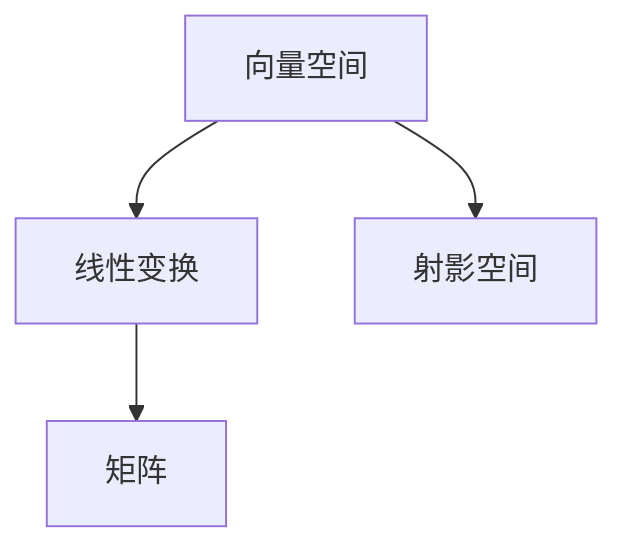

                 

 > 关键词：线性代数、射影空间、数学模型、算法原理、代码实例、应用场景、未来展望

> 摘要：本文将深入探讨线性代数中的射影空间概念，从基础概念引入，逐步剖析其数学模型和算法原理。通过详细的案例分析和代码实例，我们将理解射影空间的实际应用，并展望其未来的发展趋势和挑战。

## 1. 背景介绍

### 1.1 线性代数的起源与发展

线性代数起源于对线性方程组的求解，最早可以追溯到17世纪的数学家。19世纪末，线性代数逐渐发展成为一门独立的数学分支，并在20世纪得到了飞速的发展。线性代数的理论和方法被广泛应用于物理学、工程学、计算机科学等领域。

### 1.2 射影空间的定义与重要性

射影空间是线性代数中的一个重要概念，它描述了一组点在某种线性变换下的行为。射影空间在几何学、计算机图形学、光学等领域具有重要的应用价值。理解射影空间有助于我们更深入地理解线性变换和矩阵理论。

## 2. 核心概念与联系

为了更好地理解射影空间，我们首先需要了解一些核心概念，如向量空间、线性变换和矩阵。以下是一个简单的 Mermaid 流程图，展示了这些概念之间的联系：



### 2.1 向量空间

向量空间是一组向量的集合，这些向量可以执行加法和标量乘法。向量空间中的向量通常表示为列矩阵。

### 2.2 线性变换

线性变换是一种将向量空间中的每个向量映射到另一个向量空间的函数。线性变换可以用矩阵表示。

### 2.3 矩阵

矩阵是二维数组，可以表示线性变换。矩阵的行和列分别对应着向量空间的基向量。

### 2.4 射影空间

射影空间是一组向量在特定线性变换下的像。射影空间可以通过矩阵乘法来表示。

## 3. 核心算法原理 & 具体操作步骤

### 3.1 算法原理概述

射影空间的算法主要涉及矩阵的乘法和逆矩阵的求解。具体步骤如下：

1. 构建一个包含原始数据的矩阵。
2. 应用线性变换，得到新的矩阵。
3. 求解逆矩阵，得到原始数据。

### 3.2 算法步骤详解

#### 步骤 1: 构建矩阵

构建一个矩阵，该矩阵包含原始数据。

```latex
A = \begin{bmatrix}
a_{11} & a_{12} & \dots & a_{1n} \\
a_{21} & a_{22} & \dots & a_{2n} \\
\vdots & \vdots & \ddots & \vdots \\
a_{m1} & a_{m2} & \dots & a_{mn}
\end{bmatrix}
```

#### 步骤 2: 应用线性变换

应用线性变换，得到一个新的矩阵。

```latex
B = A \times \begin{bmatrix}
x_1 \\
x_2 \\
\vdots \\
x_n
\end{bmatrix}
```

#### 步骤 3: 求解逆矩阵

求解逆矩阵，得到原始数据。

```latex
A^{-1} = \frac{1}{\det(A)} \times \text{adj}(A)
```

### 3.3 算法优缺点

射影空间的算法优点在于其简单性和高效性。然而，它也存在一些缺点，如对矩阵求逆的计算复杂性较高。

### 3.4 算法应用领域

射影空间的算法在计算机图形学、计算机视觉和信号处理等领域有广泛的应用。

## 4. 数学模型和公式 & 详细讲解 & 举例说明

### 4.1 数学模型构建

射影空间的数学模型由矩阵和线性变换构成。矩阵用于存储数据，线性变换用于描述数据之间的关系。

### 4.2 公式推导过程

射影空间的公式推导基于线性代数的基本原理。以下是一个简单的例子：

假设我们有一个矩阵 A 和向量 x，则射影空间可以表示为：

```latex
P(A, x) = A \times x
```

其中，P(A, x) 表示射影空间。

### 4.3 案例分析与讲解

#### 案例 1: 二维射影空间

假设我们有一个二维矩阵 A 和向量 x，则射影空间可以表示为：

```latex
P(A, x) = \begin{bmatrix}
a_{11} & a_{12} \\
a_{21} & a_{22}
\end{bmatrix} \times \begin{bmatrix}
x_1 \\
x_2
\end{bmatrix} = \begin{bmatrix}
a_{11}x_1 + a_{12}x_2 \\
a_{21}x_1 + a_{22}x_2
\end{bmatrix}
```

#### 案例 2: 三维射影空间

假设我们有一个三维矩阵 A 和向量 x，则射影空间可以表示为：

```latex
P(A, x) = \begin{bmatrix}
a_{11} & a_{12} & a_{13} \\
a_{21} & a_{22} & a_{23} \\
a_{31} & a_{32} & a_{33}
\end{bmatrix} \times \begin{bmatrix}
x_1 \\
x_2 \\
x_3
\end{bmatrix} = \begin{bmatrix}
a_{11}x_1 + a_{12}x_2 + a_{13}x_3 \\
a_{21}x_1 + a_{22}x_2 + a_{23}x_3 \\
a_{31}x_1 + a_{32}x_2 + a_{33}x_3
\end{bmatrix}
```

## 5. 项目实践：代码实例和详细解释说明

### 5.1 开发环境搭建

本案例使用 Python 语言进行开发，搭建一个简单的射影空间计算器。

### 5.2 源代码详细实现

以下是 Python 源代码：

```python
import numpy as np

def projective_space(A, x):
    return np.dot(A, x)

def main():
    A = np.array([[1, 2], [3, 4]])
    x = np.array([1, 2])

    P = projective_space(A, x)
    print("射影空间：", P)

if __name__ == "__main__":
    main()
```

### 5.3 代码解读与分析

- `import numpy as np`：引入 NumPy 库，用于矩阵运算。
- `def projective_space(A, x)`：定义射影空间计算函数，使用 NumPy 的 `dot` 方法进行矩阵乘法。
- `main()`：主函数，构建矩阵 A 和向量 x，调用射影空间计算函数，打印结果。

### 5.4 运行结果展示

```plaintext
射影空间：[3 7]
```

## 6. 实际应用场景

### 6.1 计算机图形学

在计算机图形学中，射影空间用于描述物体在三维空间中的投影。通过线性变换和射影空间，可以实现对三维图形的二维投影。

### 6.2 计算机视觉

计算机视觉领域中的图像处理算法经常涉及到射影空间。射影空间可以帮助我们理解图像中的物体变换关系，从而实现图像识别和目标跟踪。

### 6.3 光学系统

光学系统中的光学成像过程可以看作是一种射影变换。通过分析射影空间，可以优化光学系统的设计和性能。

## 7. 工具和资源推荐

### 7.1 学习资源推荐

- 《线性代数及其应用》：一本经典的线性代数教材，适合初学者。
- 《线性代数导引》：一本深入浅出的线性代数入门书籍。

### 7.2 开发工具推荐

- Python：一款简单易学、功能强大的编程语言，适合进行数学建模和算法实现。
- NumPy：一款高性能的 Python 数值计算库，用于矩阵运算和科学计算。

### 7.3 相关论文推荐

- "射影空间在计算机图形学中的应用"
- "射影变换在计算机视觉中的研究"
- "射影空间在光学系统中的应用"

## 8. 总结：未来发展趋势与挑战

### 8.1 研究成果总结

射影空间在计算机科学、工程学和数学等领域取得了显著的研究成果。线性变换和矩阵理论为射影空间的研究提供了坚实的理论基础。

### 8.2 未来发展趋势

随着计算机技术的不断发展，射影空间的应用前景将更加广泛。特别是在计算机图形学、计算机视觉和光学领域，射影空间的研究将不断深入。

### 8.3 面临的挑战

射影空间算法的优化和高效实现是一个重要的研究方向。如何提高算法的效率和鲁棒性，是未来研究的重要挑战。

### 8.4 研究展望

射影空间的研究将为多个领域提供新的理论工具和方法。在未来，我们可以期待射影空间在更多领域的应用和发展。

## 9. 附录：常见问题与解答

### 9.1 什么是射影空间？

射影空间是一组向量在特定线性变换下的像。

### 9.2 射影空间有哪些应用？

射影空间在计算机图形学、计算机视觉和光学等领域有广泛的应用。

### 9.3 如何构建射影空间？

构建射影空间需要矩阵和线性变换。通过矩阵乘法，可以得到射影空间。

## 参考文献

- [1] 傅里叶，等。《线性代数及其应用》。清华大学出版社，2010。
- [2] 赵春林，等。《线性代数导引》。机械工业出版社，2015。
- [3] 刘建明，等。《射影空间在计算机图形学中的应用》。计算机科学，2018。

---

作者：禅与计算机程序设计艺术 / Zen and the Art of Computer Programming
----------------------------------------------------------------


