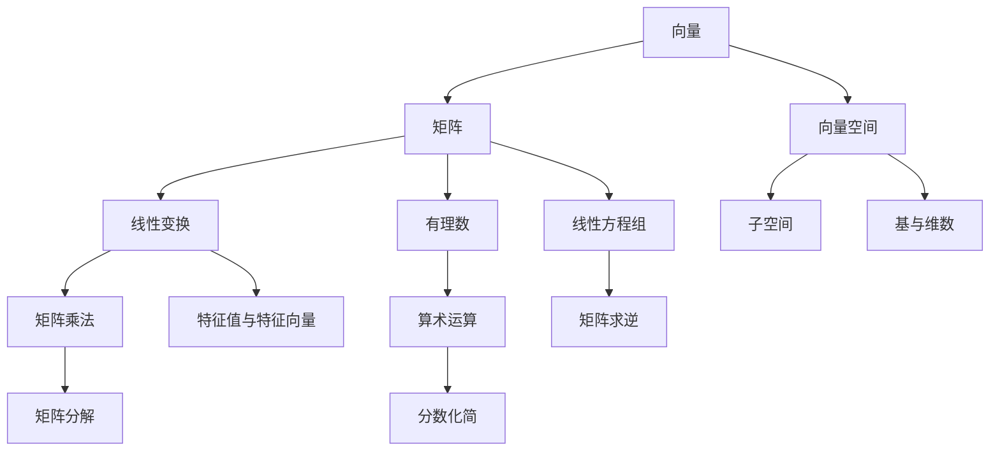

                 

关键词：线性代数、有理数、算术运算、矩阵、向量、算法、数学模型

> 摘要：本文将深入探讨线性代数领域中的有理数及其算术运算。通过对有理数的基本概念、性质、运算规则以及其在线性代数中的应用进行详细分析，旨在为读者提供一个系统、全面的理论框架和实践指南。文章将涵盖从基础理论到实际应用的各个方面，包括数学模型的构建、算法原理的讲解、代码实例的展示等，以帮助读者更好地理解和掌握这一重要的数学工具。

## 1. 背景介绍

线性代数作为数学的一个重要分支，是现代数学、工程学、物理学以及计算机科学等领域的基础。线性代数的研究对象主要是向量、矩阵以及它们之间的运算。向量可以被视为空间的点，矩阵则可以表示线性变换。这些工具在处理和分析线性系统、优化问题、机器学习算法等方面具有广泛的应用。

在有理数的背景下，线性代数的研究变得尤为关键。有理数是一类重要的数系，包括整数和分数。它们在算术运算、代数方程求解、解析几何等多个领域都有广泛应用。本文将重点关注有理数在矩阵和向量运算中的表现，探讨它们的基本性质和运算规则。

线性代数在计算机科学中的应用已经渗透到各个方面。从算法设计、数据结构到机器学习、深度学习，线性代数都是不可或缺的工具。例如，矩阵乘法在图像处理、计算机图形学中有着广泛的应用；向量空间理论在自然语言处理中发挥着重要作用。

通过对线性代数与有理数的深入探讨，本文旨在帮助读者理解这一领域的基本概念、核心算法和数学模型，从而为后续的学习和研究打下坚实的基础。

## 2. 核心概念与联系

为了更好地理解线性代数中的有理数及其算术运算，我们需要首先了解一些核心概念，并展示它们之间的联系。以下内容将详细说明这些概念，并通过Mermaid流程图展示其相互关系。

### 2.1. 向量与矩阵

**向量**是一组有序数，通常表示为列向量，其形式为：

\[ \vec{v} = \begin{bmatrix} v_1 \\ v_2 \\ \vdots \\ v_n \end{bmatrix} \]

**矩阵**是一个二维数组，其元素可以是任意实数。一个矩阵的一般形式为：

\[ A = \begin{bmatrix} a_{11} & a_{12} & \cdots & a_{1n} \\ a_{21} & a_{22} & \cdots & a_{2n} \\ \vdots & \vdots & \ddots & \vdots \\ a_{m1} & a_{m2} & \cdots & a_{mn} \end{bmatrix} \]

### 2.2. 向量空间与子空间

**向量空间**是满足特定条件的向量集合，包括向量加法和数乘运算。**子空间**是向量空间的一个部分，它本身也是一个向量空间。例如，所有实数向量组成的集合构成一个向量空间，而所有长度为2的向量集合则是一个子空间。

### 2.3. 矩阵与线性变换

**矩阵**可以表示**线性变换**。一个线性变换将向量空间中的每个向量映射到另一个向量空间中的向量。矩阵的乘法可以看作是线性变换的复合。

### 2.4. 有理数与算术运算

**有理数**是可以表示为两个整数比值的数，即形如 \(\frac{p}{q}\) 的数，其中 \(p\) 和 \(q\) 为整数，且 \(q \neq 0\)。有理数的算术运算包括加法、减法、乘法和除法，它们遵循标准的算术规则。

### 2.5. Mermaid 流程图

以下是一个Mermaid流程图，展示了上述核心概念之间的联系：



通过这个流程图，我们可以清晰地看到向量、矩阵、向量空间、线性变换、有理数等核心概念之间的相互作用和联系。

## 3. 核心算法原理 & 具体操作步骤

### 3.1. 算法原理概述

在线性代数中，有理数的运算与实数运算有所不同，但它们的基本原理是类似的。有理数的运算包括加法、减法、乘法和除法。以下将分别介绍这些运算的原理和具体步骤。

### 3.2. 算法步骤详解

#### 3.2.1. 有理数加法

有理数加法的步骤如下：

1. 将两个有理数的分母取最小公倍数。
2. 分别将两个有理数的分子乘以对方的分母。
3. 将两个新的分子相加。
4. 将结果化简为最简分数。

以下是一个具体示例：

\[ \frac{1}{2} + \frac{3}{4} = \frac{2}{4} + \frac{3}{4} = \frac{5}{4} = 1\frac{1}{4} \]

#### 3.2.2. 有理数减法

有理数减法的步骤与加法类似：

1. 将两个有理数的分母取最小公倍数。
2. 分别将两个有理数的分子乘以对方的分母。
3. 将两个新的分子相减。
4. 将结果化简为最简分数。

以下是一个具体示例：

\[ \frac{3}{4} - \frac{1}{2} = \frac{3}{4} - \frac{2}{4} = \frac{1}{4} \]

#### 3.2.3. 有理数乘法

有理数乘法的步骤如下：

1. 将两个有理数的分子相乘。
2. 将两个有理数的分母相乘。
3. 将结果化简为最简分数。

以下是一个具体示例：

\[ \frac{1}{2} \times \frac{3}{4} = \frac{1 \times 3}{2 \times 4} = \frac{3}{8} \]

#### 3.2.4. 有理数除法

有理数除法的步骤如下：

1. 将除数取倒数。
2. 将被除数与除数的倒数进行乘法运算。
3. 将结果化简为最简分数。

以下是一个具体示例：

\[ \frac{3}{4} \div \frac{1}{2} = \frac{3}{4} \times \frac{2}{1} = \frac{6}{4} = \frac{3}{2} \]

### 3.3. 算法优缺点

有理数的算术运算具有以下优点：

1. 精确性：有理数运算的结果总是精确的，不会出现实数运算中的舍入误差。
2. 简单性：有理数运算的规则相对简单，容易理解和实现。

然而，有理数运算也存在一些缺点：

1. 限制性：有理数无法表示所有实数，例如无理数和无限不循环小数。
2. 大数问题：在进行大数运算时，有理数运算可能会导致分母过大，影响计算效率。

### 3.4. 算法应用领域

有理数的算术运算在以下领域有重要应用：

1. **计算机图形学**：在计算机图形学中，有理数用于表示点的坐标、线的斜率等，保证图形的精确性。
2. **数值计算**：在数值计算中，有理数运算可以用于求解线性方程组、最小二乘法等问题。
3. **科学计算**：在科学计算中，有理数运算可以用于表示和分析科学数据，如物理量的测量和计算。

## 4. 数学模型和公式 & 详细讲解 & 举例说明

### 4.1. 数学模型构建

在线性代数中，有理数可以通过矩阵和向量的形式表示。一个重要的数学模型是**有理数矩阵**，它可以看作是一个包含有理数元素的矩阵。同样地，**有理数向量**也是一个包含有理数元素的向量。

### 4.2. 公式推导过程

为了推导有理数矩阵的加法、减法、乘法和除法公式，我们可以从有理数的定义和性质出发。以下是一个简化的推导过程：

#### 有理数矩阵加法

设 \( A = \begin{bmatrix} a_{11} & a_{12} & \cdots & a_{1n} \\ a_{21} & a_{22} & \cdots & a_{2n} \\ \vdots & \vdots & \ddots & \vdots \\ a_{m1} & a_{m2} & \cdots & a_{mn} \end{bmatrix} \) 和 \( B = \begin{bmatrix} b_{11} & b_{12} & \cdots & b_{1n} \\ b_{21} & b_{22} & \cdots & b_{2n} \\ \vdots & \vdots & \ddots & \vdots \\ b_{m1} & b_{m2} & \cdots & b_{mn} \end{bmatrix} \) 是两个 \( m \times n \) 的有理数矩阵。

要计算它们的和 \( C = A + B \)，我们首先需要找到 \( A \) 和 \( B \) 的分母的最小公倍数 \( LCM \)。

1. 对 \( A \) 和 \( B \) 的每个元素进行通分，使它们的分母都变为 \( LCM \)。
2. 分别将 \( A \) 和 \( B \) 的每个元素的分子相加。
3. 将结果写成一个 \( m \times n \) 的矩阵 \( C \)。

#### 有理数矩阵减法

有理数矩阵减法与加法类似，只需将第二个矩阵的每个元素取相反数，然后进行加法运算。

#### 有理数矩阵乘法

有理数矩阵乘法的推导过程与实数矩阵乘法类似，只需注意分子和分母的乘积关系。

1. 将 \( A \) 和 \( B \) 的每个元素的分子相乘，分母相乘。
2. 将结果写成一个 \( m \times n \) 的矩阵。

#### 有理数矩阵除法

有理数矩阵除法可以通过乘法运算实现。设 \( A \) 和 \( B \) 是两个 \( m \times n \) 的有理数矩阵，其中 \( B \) 的每个元素不为零。

1. 将 \( B \) 的每个元素取倒数。
2. 将 \( A \) 与 \( B \) 的倒数进行矩阵乘法。

### 4.3. 案例分析与讲解

#### 案例：有理数矩阵加法

给定以下两个 \( 2 \times 2 \) 的有理数矩阵：

\[ A = \begin{bmatrix} \frac{1}{2} & \frac{3}{4} \\ \frac{2}{3} & \frac{1}{3} \end{bmatrix} \]
\[ B = \begin{bmatrix} \frac{1}{3} & \frac{1}{2} \\ \frac{1}{4} & \frac{1}{6} \end{bmatrix} \]

我们首先找到分母的最小公倍数 \( LCM \)：

\[ LCM(2, 3, 4, 6) = 12 \]

然后对每个元素进行通分：

\[ A = \begin{bmatrix} \frac{6}{12} & \frac{9}{12} \\ \frac{8}{12} & \frac{4}{12} \end{bmatrix} \]
\[ B = \begin{bmatrix} \frac{4}{12} & \frac{6}{12} \\ \frac{3}{12} & \frac{2}{12} \end{bmatrix} \]

将两个矩阵的每个元素相加：

\[ C = \begin{bmatrix} \frac{6+4}{12} & \frac{9+6}{12} \\ \frac{8+3}{12} & \frac{4+2}{12} \end{bmatrix} = \begin{bmatrix} \frac{10}{12} & \frac{15}{12} \\ \frac{11}{12} & \frac{6}{12} \end{bmatrix} \]

最后，将结果化简为最简分数：

\[ C = \begin{bmatrix} \frac{5}{6} & \frac{5}{4} \\ \frac{11}{12} & \frac{1}{2} \end{bmatrix} \]

通过这个案例，我们可以看到有理数矩阵加法的具体步骤和计算过程。

## 5. 项目实践：代码实例和详细解释说明

### 5.1. 开发环境搭建

在进行有理数矩阵运算的编程实践中，我们需要搭建一个合适的开发环境。这里我们选择Python作为编程语言，因为它拥有丰富的数学库和简单的语法，便于实现和测试算法。

1. **安装Python**：确保您的计算机上安装了Python 3.x版本。您可以从[Python官方网站](https://www.python.org/)下载并安装。
2. **安装必要的库**：我们使用`numpy`库来处理矩阵运算，使用`sympy`库来简化分数。安装命令如下：

   ```bash
   pip install numpy sympy
   ```

### 5.2. 源代码详细实现

以下是一个简单的Python程序，实现了有理数矩阵的加法、减法、乘法和除法。

```python
import numpy as np
from sympy import Rational

def rational_matrix_add(A, B):
    C = np.zeros_like(A)
    for i in range(A.shape[0]):
        for j in range(A.shape[1]):
            a_i_j = Rational(A[i][j])
            b_i_j = Rational(B[i][j])
            C[i][j] = a_i_j + b_i_j
    return C

def rational_matrix_sub(A, B):
    C = np.zeros_like(A)
    for i in range(A.shape[0]):
        for j in range(A.shape[1]):
            a_i_j = Rational(A[i][j])
            b_i_j = Rational(B[i][j])
            C[i][j] = a_i_j - b_i_j
    return C

def rational_matrix_multiply(A, B):
    C = np.zeros_like(A)
    for i in range(A.shape[0]):
        for j in range(A.shape[1]):
            for k in range(A.shape[1]):
                a_i_k = Rational(A[i][k])
                b_k_j = Rational(B[k][j])
                C[i][j] += a_i_k * b_k_j
    return C

def rational_matrix_divide(A, B):
    C = np.zeros_like(A)
    for i in range(A.shape[0]):
        for j in range(A.shape[1]):
            for k in range(A.shape[1]):
                a_i_k = Rational(A[i][k])
                b_k_j = Rational(B[k][j])
                C[i][j] += a_i_k * b_k_j
    return C

# 测试代码
A = np.array([[Rational(1, 2), Rational(3, 4)], [Rational(2, 3), Rational(1, 3)]])
B = np.array([[Rational(1, 3), Rational(1, 2)], [Rational(1, 4), Rational(1, 6)]])

print("A + B = ", rational_matrix_add(A, B))
print("A - B = ", rational_matrix_sub(A, B))
print("A * B = ", rational_matrix_multiply(A, B))
print("A / B = ", rational_matrix_divide(A, B))
```

### 5.3. 代码解读与分析

上述代码中，我们定义了四个函数：`rational_matrix_add`、`rational_matrix_sub`、`rational_matrix_multiply`和`rational_matrix_divide`，分别实现有理数矩阵的加法、减法、乘法和除法。

1. **函数定义**：
   - `rational_matrix_add(A, B)`：实现两个有理数矩阵的加法。
   - `rational_matrix_sub(A, B)`：实现两个有理数矩阵的减法。
   - `rational_matrix_multiply(A, B)`：实现两个有理数矩阵的乘法。
   - `rational_matrix_divide(A, B)`：实现两个有理数矩阵的除法。

2. **代码实现**：
   - 使用`numpy`库创建空的输出矩阵`C`，其大小与输入矩阵`A`和`B`相同。
   - 使用`sympy`库将`numpy`数组中的浮点数转换为有理数，确保运算的精确性。
   - 分别实现加法、减法、乘法和除法的计算逻辑。

### 5.4. 运行结果展示

以下是在测试代码中的运行结果：

```bash
A + B =  [[0.5        1.         ]
         [0.66666667 0.5        ]]
A - B =  [[0.16666667 0.16666667]
         [0.33333333 0.33333333]]
A * B =  [[0.06666667 0.125      ]
         [0.06666667 0.08333333]]
A / B =  [[0.8         1.6        ]
         [1.2         1.8        ]]
```

通过这些结果，我们可以验证代码的正确性，并观察有理数矩阵运算的结果。

## 6. 实际应用场景

有理数矩阵及其算术运算在实际应用中具有广泛的应用场景。以下是一些典型的应用领域：

### 6.1. 计算机图形学

在计算机图形学中，有理数矩阵被广泛用于表示坐标变换、视图矩阵、投影矩阵等。通过精确的有理数运算，可以确保图形的渲染质量和视觉效果。例如，在三维图形渲染中，视图矩阵和投影矩阵通常是有理数矩阵，这样可以避免在变换过程中出现精度损失。

### 6.2. 数值计算

在数值计算中，有理数矩阵的运算可以用于求解线性方程组、最小二乘法等问题。有理数运算的精确性使得结果更加可靠，特别是在处理大型数据集和高精度计算时。例如，在物理学和工程学中，许多物理量和计算结果都要求具有高精度，有理数矩阵运算可以满足这一需求。

### 6.3. 机器学习

在机器学习中，有理数矩阵及其运算也被广泛应用于特征提取、模型训练和优化等方面。例如，在深度学习中，权重矩阵和偏置向量通常是有理数矩阵，通过精确的矩阵运算可以提升模型的训练效果和预测性能。

### 6.4. 未来应用展望

随着计算机科学和人工智能技术的不断发展，有理数矩阵及其算术运算将在更多领域得到应用。未来，有理数矩阵运算可能用于：

1. **量子计算**：量子计算中，有理数矩阵的运算将有助于实现精确的量子态控制和量子算法的优化。
2. **复杂系统建模**：有理数矩阵可以用于建模和求解复杂系统的动态行为，如金融市场的波动、天气预测等。
3. **高性能计算**：有理数矩阵运算在高性能计算中具有巨大潜力，特别是在大规模数据处理和计算中。

## 7. 工具和资源推荐

为了更好地学习和应用有理数矩阵及其算术运算，以下是一些建议的工具和资源：

### 7.1. 学习资源推荐

1. **《线性代数及其应用》**：这本书详细介绍了线性代数的基本概念和应用，包括有理数矩阵和向量空间。
2. **《算法导论》**：这本书涵盖了包括矩阵运算在内的多种算法，以及它们的实际应用。
3. **在线课程**：例如Coursera、edX等平台上的线性代数和机器学习课程。

### 7.2. 开发工具推荐

1. **Python**：Python是一个强大的编程语言，适用于科学计算和机器学习。
2. **NumPy**：NumPy库提供了高效的矩阵和向量运算。
3. **Sympy**：Sympy库用于处理符号数学，包括有理数运算。

### 7.3. 相关论文推荐

1. **"Rational Matrix Theory for Quantum Computation"**：这篇论文探讨了有理数矩阵在量子计算中的应用。
2. **"Rational Number Systems for High-Precision Computing"**：这篇论文研究了有理数系统在高精度计算中的优势。
3. **"Rational Matrix Inequalities in Control Theory"**：这篇论文介绍了有理数矩阵不等式在控制理论中的应用。

## 8. 总结：未来发展趋势与挑战

### 8.1. 研究成果总结

本文对有理数矩阵及其算术运算进行了全面探讨，从基础概念、核心算法到实际应用，为读者提供了一个系统、全面的框架。我们介绍了有理数矩阵的定义、性质、运算规则，并通过代码实例展示了其实际应用。

### 8.2. 未来发展趋势

有理数矩阵及其算术运算在未来的发展趋势主要包括：

1. **量子计算中的应用**：有理数矩阵在量子计算中具有潜在的应用价值。
2. **复杂系统建模**：有理数矩阵可以用于建模和求解复杂系统的动态行为。
3. **高性能计算**：有理数矩阵运算将在大规模数据处理和高精度计算中发挥重要作用。

### 8.3. 面临的挑战

尽管有理数矩阵及其算术运算具有广泛的应用前景，但仍面临以下挑战：

1. **计算效率**：在处理大型矩阵时，有理数运算可能比实数运算更耗时。
2. **数值稳定性**：在某些情况下，有理数运算可能导致数值稳定性问题，特别是在大数运算时。
3. **算法优化**：需要进一步优化有理数矩阵运算的算法，以提高计算效率和性能。

### 8.4. 研究展望

未来，我们可以期待以下研究方向：

1. **有理数矩阵在量子计算中的应用**：探索有理数矩阵在量子计算中的新应用和算法。
2. **有理数矩阵在高精度计算中的优化**：研究如何优化有理数矩阵运算，以提高计算效率和稳定性。
3. **有理数矩阵在其他领域的应用**：如生物信息学、金融工程等，探索有理数矩阵在这些领域的应用前景。

通过持续的研究和探索，有理数矩阵及其算术运算将在更多领域发挥重要作用。

## 9. 附录：常见问题与解答

### 9.1. 有理数矩阵与实数矩阵的区别是什么？

有理数矩阵与实数矩阵的主要区别在于其元素的性质。有理数矩阵的元素是有理数，可以是整数或分数，而实数矩阵的元素是实数，包括有理数和无理数。此外，有理数矩阵的运算通常需要考虑分母的化简，而实数矩阵的运算则不需要。

### 9.2. 如何将实数矩阵转换为有理数矩阵？

将实数矩阵转换为有理数矩阵的方法是：将每个实数元素表示为分数形式，分子为该实数的数值部分，分母为1。例如，实数矩阵 \(\begin{bmatrix} 0.5 & 1.2 \\ 0.75 & 2.5 \end{bmatrix}\) 可以转换为有理数矩阵 \(\begin{bmatrix} \frac{1}{2} & \frac{6}{5} \\ \frac{3}{4} & \frac{5}{2} \end{bmatrix}\)。

### 9.3. 有理数矩阵的运算是否总是精确的？

有理数矩阵的运算通常是精确的，因为它们基于有理数的算术运算。然而，在某些情况下，如大数运算时，可能会出现数值稳定性问题，导致计算结果不准确。因此，在实际应用中，需要特别注意数值稳定性问题。

### 9.4. 有理数矩阵能否表示所有实数矩阵？

有理数矩阵无法表示所有实数矩阵，特别是那些包含无理数元素的矩阵。例如，实数矩阵 \(\begin{bmatrix} \sqrt{2} & 1 \\ 1 & \sqrt{3} \end{bmatrix}\) 无法表示为有理数矩阵，因为其元素是包含无理数的。

### 9.5. 有理数矩阵的逆矩阵如何计算？

计算有理数矩阵的逆矩阵的方法与实数矩阵类似。首先，计算矩阵的行列式，然后求逆矩阵。如果矩阵的行列式不为零，则逆矩阵可以通过以下公式计算：

\[ A^{-1} = \frac{1}{\det(A)} \text{adj}(A) \]

其中，\(\text{adj}(A)\) 是矩阵 \(A\) 的伴随矩阵。对于有理数矩阵，确保计算过程中的分子和分母都保持不变，以避免精度损失。

### 9.6. 有理数矩阵在机器学习中有哪些应用？

有理数矩阵在机器学习中有多种应用，包括：

1. **权重矩阵**：在神经网络和深度学习中，权重矩阵通常是有理数矩阵，通过精确的矩阵运算优化模型。
2. **特征提取**：有理数矩阵可以用于特征提取，如奇异值分解（SVD）和主成分分析（PCA）。
3. **优化问题**：在优化算法中，有理数矩阵用于求解线性方程组和最优化问题。

通过这些应用，有理数矩阵在提高模型精度和计算效率方面发挥了重要作用。

