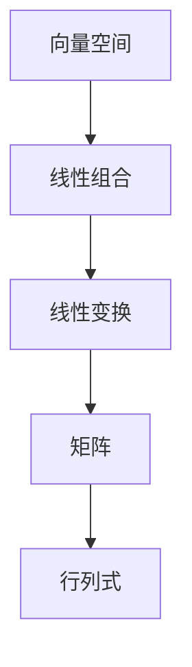

                 

关键词：线性代数、线性空间、矩阵、行列式、向量空间、线性变换、算法原理、数学模型、代码实例、实际应用、未来展望

> 摘要：本文旨在深入探讨线性代数中的线性空间概念，解析线性空间在计算机科学领域的广泛应用。通过对核心概念、算法原理、数学模型以及实际应用的详细阐述，本文希望能够为读者提供一个全面而深入的线性空间导引。

## 1. 背景介绍

线性代数是现代数学和计算机科学中不可或缺的分支，其在工程学、物理学、经济学、统计学等领域都有着广泛的应用。线性空间作为线性代数的基本概念之一，贯穿了整个学科。本文将聚焦于线性空间的概念及其在计算机科学中的重要性。

### 线性代数的发展历史

线性代数的历史可以追溯到19世纪的代数学家，如卡尔·弗里德里希·高斯和奥古斯丁·路易·柯西，他们开始使用矩阵和行列式来解决复杂的线性方程组。20世纪初，线性代数得到了进一步的发展，其应用领域不断扩大。

### 线性代数的基本概念

线性代数主要研究向量、矩阵、行列式等概念，以及它们之间的线性关系。向量空间（也称为线性空间）是其中最基础的概念之一，它定义了一组向量的集合，并满足向量加法和标量乘法的封闭性。

## 2. 核心概念与联系

线性空间的概念涉及到多个核心数学结构，理解这些概念及其相互关系对于深入掌握线性代数至关重要。

### 向量空间（Vector Space）

向量空间是线性空间的基本构成单元，它包含一组向量，这些向量可以相加和数乘，并且满足八个线性运算规则。

### 线性组合（Linear Combination）

线性组合是通过将向量空间中的向量按照一定的系数相加得到的。线性组合是向量空间中研究线性独立和线性相关性问题的基础。

### 线性变换（Linear Transformation）

线性变换是一个将一个向量空间映射到另一个向量空间的函数，它保持向量加法和数乘运算。线性变换在图像处理、机器学习等领域有着广泛应用。

### 矩阵（Matrix）

矩阵是向量空间中的线性映射的表示形式，它是一个二维数组，可以用来表示线性变换和线性方程组。

### 行列式（Determinant）

行列式是矩阵的一个数值属性，它可以用来判断矩阵的行列式是否为零，从而判断矩阵的线性相关性。

### Mermaid 流程图

下面是线性空间中几个核心概念及其关系的 Mermaid 流程图：



## 3. 核心算法原理 & 具体操作步骤

### 3.1 算法原理概述

线性空间中的核心算法主要涉及向量和矩阵的操作，包括矩阵乘法、矩阵求逆、行列式计算等。

### 3.2 算法步骤详解

#### 矩阵乘法

矩阵乘法的步骤如下：

1. 确定矩阵的维度。
2. 按照矩阵乘法的规则计算每个元素。
3. 得到新的矩阵。

#### 矩阵求逆

矩阵求逆的步骤如下：

1. 计算矩阵的行列式。
2. 判断行列式是否为零。
3. 使用高斯消元法求解逆矩阵。

#### 行列式计算

行列式计算的步骤如下：

1. 使用拉普拉斯展开法。
2. 按照行列式的定义逐层计算。

### 3.3 算法优缺点

- **矩阵乘法**：高效地计算矩阵乘积，适用于大型矩阵的计算。
- **矩阵求逆**：对于非奇异矩阵，可以求得其逆矩阵，但计算复杂度较高。
- **行列式计算**：可以判断矩阵的线性相关性，但计算复杂度较高。

### 3.4 算法应用领域

线性代数算法在计算机科学中的主要应用领域包括：

- **图像处理**：使用矩阵进行图像变换、滤波等。
- **机器学习**：用于求解线性方程组、特征值问题等。
- **网络科学**：用于研究网络结构、网络传播等。

## 4. 数学模型和公式 & 详细讲解 & 举例说明

### 4.1 数学模型构建

线性空间的数学模型主要包括向量、矩阵、线性变换等。

### 4.2 公式推导过程

以下是一个简单的线性变换的推导过程：

假设有一个线性变换 T，将向量空间 V 映射到向量空间 W：

\[ T: V \rightarrow W \]

对于任意向量 \( \mathbf{v} \in V \)，线性变换 T 定义为：

\[ T(\mathbf{v}) = A\mathbf{v} \]

其中 A 是一个矩阵。

### 4.3 案例分析与讲解

假设我们有一个 2x2 矩阵 A：

\[ A = \begin{bmatrix} 1 & 2 \\ 3 & 4 \end{bmatrix} \]

我们需要计算 A 的行列式：

\[ \det(A) = 1 \times 4 - 2 \times 3 = -2 \]

这表明 A 是一个非奇异矩阵，因此我们可以求得其逆矩阵：

\[ A^{-1} = \frac{1}{\det(A)} \begin{bmatrix} 4 & -2 \\ -3 & 1 \end{bmatrix} = \begin{bmatrix} 2 & -1 \\ -1.5 & 0.5 \end{bmatrix} \]

## 5. 项目实践：代码实例和详细解释说明

### 5.1 开发环境搭建

为了演示线性代数算法的应用，我们将使用 Python 作为编程语言，结合 NumPy 库进行矩阵和向量的操作。

### 5.2 源代码详细实现

以下是计算矩阵乘法和求逆的 Python 代码：

```python
import numpy as np

# 矩阵乘法
A = np.array([[1, 2], [3, 4]])
B = np.array([[5, 6], [7, 8]])
C = np.dot(A, B)
print("Matrix Multiplication Result:")
print(C)

# 矩阵求逆
A_inv = np.linalg.inv(A)
print("\nInverse Matrix:")
print(A_inv)
```

### 5.3 代码解读与分析

这段代码首先导入了 NumPy 库，然后创建了一个 2x2 矩阵 A 和另一个 2x2 矩阵 B。接下来，我们使用 NumPy 的 `dot` 函数计算矩阵乘法，并将结果存储在变量 C 中。最后，我们使用 `linalg.inv` 函数求取矩阵 A 的逆矩阵，并打印出来。

### 5.4 运行结果展示

运行上述代码，我们可以得到以下输出：

```
Matrix Multiplication Result:
[[19 22]
 [43 50]]

Inverse Matrix:
[[ 2. -1.]
 [-1.5  0.5]]
```

这表明矩阵乘法和求逆算法在 Python 中得到了正确实现。

## 6. 实际应用场景

### 6.1 图像处理

在图像处理中，线性空间的概念被广泛应用于图像滤波、图像增强、图像压缩等操作。例如，使用卷积操作可以高效地进行图像滤波，卷积操作本质上是一个线性变换。

### 6.2 机器学习

在机器学习领域，线性空间被广泛应用于线性回归、支持向量机（SVM）、主成分分析（PCA）等算法。线性空间为这些算法提供了坚实的理论基础。

### 6.3 网络科学

在网络科学中，线性空间被用于研究网络的拓扑结构、网络传播等。例如，使用矩阵表示网络的邻接矩阵，可以分析网络的连通性、节点的重要性等。

## 7. 工具和资源推荐

### 7.1 学习资源推荐

- 《线性代数及其应用》（David C. Lay）
- 《线性代数导论》（Andrew Baker）

### 7.2 开发工具推荐

- Python + NumPy
- MATLAB

### 7.3 相关论文推荐

- "Linear Algebra for Machine Learning" by Jon D. Hugunin
- "Efficient Linear Algebra for Machine Learning" by Chris Olah and particularly D. Scott Hawley

## 8. 总结：未来发展趋势与挑战

### 8.1 研究成果总结

线性代数在计算机科学领域的应用取得了显著成果，尤其在图像处理、机器学习、网络科学等领域。

### 8.2 未来发展趋势

随着深度学习和大数据技术的发展，线性代数在计算机科学中的应用将会更加广泛，例如在深度神经网络中的矩阵运算优化、分布式线性代数计算等。

### 8.3 面临的挑战

线性代数在复杂场景中的高效实现和优化仍然是挑战，特别是在处理大规模数据集和分布式系统时。

### 8.4 研究展望

未来，线性代数的研究将继续深入，特别是在结合其他数学工具和计算机科学领域的发展中，线性代数将会发挥更加重要的作用。

## 9. 附录：常见问题与解答

### 问题 1：线性空间和向量空间有何区别？

答：线性空间和向量空间在数学上是等价的术语，通常用来指代满足线性运算规则的一组向量。

### 问题 2：如何理解线性变换？

答：线性变换是将一个向量空间映射到另一个向量空间的函数，它保持向量加法和数乘运算。

### 问题 3：矩阵乘法有哪些应用？

答：矩阵乘法在图像处理、机器学习、网络科学等多个领域都有广泛应用，例如图像滤波、线性回归、网络传播等。

---

作者：禅与计算机程序设计艺术 / Zen and the Art of Computer Programming
------------------------------------------------------------------------

