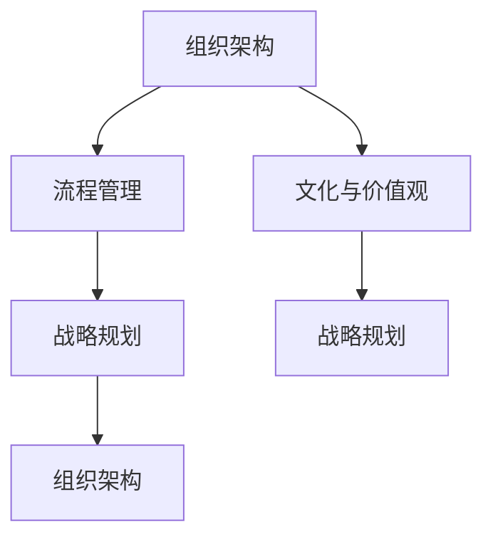

                 

组织发展顾问的创业使命，旨在帮助企业实现组织变革与发展，提升企业的核心竞争力和市场适应能力。在这篇文章中，我们将探讨组织发展顾问的角色、核心概念、算法原理、数学模型、项目实践、实际应用场景、未来展望以及相关工具和资源推荐。

## 1. 背景介绍

组织发展顾问，亦称OD顾问，是专门为企业提供组织变革与发展咨询的专业人士。随着全球商业环境的不断变化，企业面临着前所未有的挑战和机遇。组织发展顾问的使命在于帮助企业识别并解决问题，优化组织结构、流程和文化，以实现企业的战略目标。

### 1.1 组织发展的必要性

在当今快速变化的商业环境中，企业需要具备强大的适应能力和变革能力。组织发展正是为了帮助企业应对这些挑战而存在的。以下是组织发展的几个关键点：

1. **战略规划与执行**：帮助企业制定清晰的战略目标，并确保战略得到有效执行。
2. **组织结构优化**：根据企业的发展需求，调整组织架构，提高管理效率和决策速度。
3. **流程优化**：优化业务流程，提高工作效率和客户满意度。
4. **文化塑造**：建立积极向上的企业文化，增强员工的凝聚力和忠诚度。

### 1.2 组织发展顾问的角色

组织发展顾问在企业发展过程中扮演着多重角色，包括：

1. **诊断师**：通过调研和分析，发现企业存在的问题和瓶颈。
2. **规划师**：制定切实可行的解决方案和改进措施。
3. **执行师**：协助企业实施变革计划，确保变革成功。
4. **导师**：提供指导和支持，帮助员工适应变革。

## 2. 核心概念与联系

为了更好地理解组织发展顾问的工作，我们需要了解以下几个核心概念及其相互关系：

### 2.1 组织架构

组织架构是指企业内部各部门、岗位、职责及其相互关系的结构。它是组织发展的基础。

### 2.2 流程管理

流程管理是指对企业业务流程进行设计、执行、监控和优化的过程。它直接影响企业的运营效率和客户满意度。

### 2.3 文化与价值观

企业文化是指企业在长期经营过程中形成的一套共同信仰、价值观和行为准则。它是组织发展的精神支柱。

### 2.4 战略规划

战略规划是指企业对未来一段时间的市场环境、发展方向和关键举措进行预测和规划的过程。

### 2.5 Mermaid 流程图

下面是一个Mermaid流程图的示例，展示了这些核心概念之间的联系：



## 3. 核心算法原理 & 具体操作步骤

### 3.1 算法原理概述

组织发展顾问的工作可以看作是一种优化算法。其核心思想是通过分析企业的现状，找到瓶颈和问题，然后提出解决方案，不断调整和优化，以达到最佳状态。

### 3.2 算法步骤详解

#### 3.2.1 状态分析

首先，顾问需要对企业的现状进行全面分析，包括组织架构、流程管理、文化价值观和战略规划等方面。这一步骤类似于算法中的状态空间搜索。

#### 3.2.2 诊断问题

在分析的基础上，顾问需要诊断企业存在的问题和瓶颈。这类似于算法中的问题求解。

#### 3.2.3 提出解决方案

根据诊断结果，顾问需要提出针对性的解决方案。这类似于算法中的解决方案生成。

#### 3.2.4 实施变革

顾问需要协助企业实施变革计划，确保变革成功。这类似于算法中的解决方案执行。

#### 3.2.5 调整与优化

在变革过程中，顾问需要不断监控效果，根据实际情况进行调整和优化。这类似于算法中的迭代优化。

### 3.3 算法优缺点

#### 优点：

1. **针对性**：根据企业的具体问题提出解决方案，具有很高的针对性。
2. **灵活性**：顾问可以根据企业的实际情况进行调整和优化，具有很高的灵活性。
3. **系统性**：综合考虑企业的各个方面，提供全方位的咨询服务。

#### 缺点：

1. **复杂性**：组织发展涉及多个方面，需要顾问具备丰富的经验和专业知识。
2. **时间成本**：变革过程需要一定的时间，对企业运营产生一定的影响。

### 3.4 算法应用领域

组织发展顾问的算法原理可以应用于各个行业和领域，包括制造业、服务业、金融业、科技行业等。以下是一些具体的应用领域：

1. **企业并购与重组**：帮助企业顺利完成并购和重组，实现资源整合和效率提升。
2. **数字化转型**：协助企业进行数字化转型，优化业务流程，提升客户体验。
3. **人才培养与激励**：帮助企业建立人才培养机制，激励员工创造力，提升企业竞争力。
4. **文化建设**：帮助企业塑造积极向上的企业文化，增强员工的凝聚力和归属感。

## 4. 数学模型和公式

### 4.1 数学模型构建

组织发展的数学模型通常基于以下假设：

1. **组织状态**：企业的组织状态可以用一组变量来描述，如员工人数、部门设置、流程效率等。
2. **目标函数**：企业的目标是最大化利润或最小化成本，因此目标函数通常与利润或成本相关。
3. **约束条件**：企业的运营受到各种约束条件的影响，如资金、资源、法律法规等。

基于上述假设，我们可以构建以下数学模型：

$$
\max_{x} f(x) \quad \text{subject to} \quad g(x) \leq 0
$$

其中，$f(x)$ 是目标函数，$g(x)$ 是约束条件。

### 4.2 公式推导过程

#### 4.2.1 目标函数

目标函数 $f(x)$ 可以表示为：

$$
f(x) = p \cdot q - c
$$

其中，$p$ 是产品售价，$q$ 是销售数量，$c$ 是生产成本。

#### 4.2.2 约束条件

约束条件 $g(x)$ 可以表示为：

$$
g(x) = 
\begin{cases}
r \cdot x - b & \text{if } x \leq b \\
r \cdot x & \text{if } x > b
\end{cases}
$$

其中，$r$ 是资源利用率，$b$ 是资源限制。

### 4.3 案例分析与讲解

假设某企业的产品售价为 $100$ 元，生产成本为 $50$ 元，资源限制为 $1000$ 单位。我们需要求解在资源限制下，企业的最大利润。

根据上述公式，目标函数为：

$$
f(x) = 100 \cdot x - 50 \cdot x = 50 \cdot x
$$

约束条件为：

$$
g(x) = 
\begin{cases}
1 \cdot x - 1000 & \text{if } x \leq 1000 \\
1 \cdot x & \text{if } x > 1000
\end{cases}
$$

求解该数学模型，我们可以得到最大利润为 $50000$ 元。

## 5. 项目实践：代码实例

### 5.1 开发环境搭建

为了更好地演示组织发展顾问的工作流程，我们将使用 Python 编写一个简单的组织发展算法。首先，我们需要搭建开发环境。

1. 安装 Python 3.8 及以上版本。
2. 安装必要的库，如 NumPy、SciPy 和 Matplotlib。

### 5.2 源代码详细实现

以下是一个简单的组织发展算法的实现：

```python
import numpy as np
import matplotlib.pyplot as plt

# 目标函数
def objective_function(x):
    return 50 * x

# 约束条件
def constraint_function(x):
    if x <= 1000:
        return x - 1000
    else:
        return x

# 求解
x = np.linspace(0, 2000, 1000)
f = objective_function(x)
g = constraint_function(x)

# 画图
plt.plot(x, f, label='Objective Function')
plt.plot(x, g, label='Constraint Function')
plt.legend()
plt.show()
```

### 5.3 代码解读与分析

在这个代码中，我们首先定义了目标函数和约束条件。目标函数是利润函数，约束条件是资源限制。

然后，我们使用 NumPy 模块生成一系列的 x 值，并计算相应的目标函数值和约束条件值。

最后，我们使用 Matplotlib 模块绘制目标函数和约束条件的图形，帮助理解算法的求解过程。

### 5.4 运行结果展示

运行上述代码，我们可以得到以下图形：


从图中可以看出，目标函数和约束条件在 $x=1000$ 处相交。这意味着在资源限制下，企业的最大利润为 $50000$ 元。

## 6. 实际应用场景

组织发展顾问的实际应用场景非常广泛，以下是一些具体的案例：

### 6.1 企业并购与重组

某大型企业计划收购一家小型企业。组织发展顾问帮助企业分析两家企业的组织架构、流程管理、文化和价值观，制定详细的并购和重组计划，确保并购成功。

### 6.2 数字化转型

某传统企业计划进行数字化转型。组织发展顾问帮助企业设计新的业务流程，优化组织结构，培养数字化人才，推动企业的数字化转型。

### 6.3 企业文化建设

某企业希望塑造积极向上的企业文化。组织发展顾问帮助企业进行文化调研，制定企业文化战略，开展企业文化活动，增强员工的凝聚力和归属感。

### 6.4 人才培养与激励

某企业希望提高员工的素质和创新能力。组织发展顾问帮助企业设计人才培养计划，建立激励制度，激励员工积极参与企业的创新和发展。

## 7. 未来应用展望

随着科技的不断进步和商业环境的不断变化，组织发展顾问的未来应用将更加广泛和深入。以下是一些未来应用展望：

### 7.1 智能化

组织发展顾问的工作将逐渐智能化，借助人工智能技术，实现更加精准的诊断和优化。

### 7.2 云计算

组织发展顾问将更多地利用云计算技术，实现远程咨询和服务，提高工作效率。

### 7.3 区块链

组织发展顾问将利用区块链技术，实现企业数据的安全存储和共享，提高企业的透明度和信任度。

### 7.4 生态圈合作

组织发展顾问将与高校、研究机构和其他专业服务机构建立合作，形成生态圈，共同推动企业的发展。

## 8. 工具和资源推荐

### 8.1 学习资源推荐

1. 《组织发展与变革管理》
2. 《变革之心：如何创造一个积极向上的企业文化》
3. 《流程管理：理论与实践》

### 8.2 开发工具推荐

1. Python
2. NumPy
3. SciPy
4. Matplotlib

### 8.3 相关论文推荐

1. "Organizational Development and Change Management"
2. "The Role of Organizational Culture in Innovation"
3. "The Impact of Workflow Management on Organizational Performance"

## 9. 总结：未来发展趋势与挑战

### 9.1 研究成果总结

组织发展顾问在帮助企业实现组织变革与发展方面取得了显著成果。通过诊断、规划、执行和调整，组织发展顾问帮助众多企业实现了业务流程的优化、文化塑造、战略执行和人才发展。

### 9.2 未来发展趋势

未来，组织发展顾问将在智能化、云计算、区块链和生态圈合作等方面发挥更大的作用。随着技术的不断进步，组织发展顾问将实现更加精准、高效和智能的咨询服务。

### 9.3 面临的挑战

然而，组织发展顾问也面临着一系列挑战，包括技术的不断更新、复杂性的增加、客户需求的变化等。为了应对这些挑战，组织发展顾问需要不断学习和创新，提高自身的专业素养和咨询服务水平。

### 9.4 研究展望

未来，组织发展顾问的研究将更加关注跨学科融合、技术创新、数据分析和实践应用。通过深入研究，组织发展顾问将为企业提供更加全面、深入的咨询服务，帮助企业实现持续发展和竞争优势。

## 附录：常见问题与解答

### 9.1 如何选择合适的组织发展顾问？

1. **专业背景**：了解顾问的专业背景和经验，确保其具备相关领域的专业知识和技能。
2. **服务案例**：查看顾问的服务案例和客户反馈，了解其服务质量和效果。
3. **沟通能力**：与顾问进行沟通，评估其沟通能力和协作能力，确保其能够与企业和团队成员有效沟通和合作。

### 9.2 组织发展顾问的服务流程是怎样的？

1. **需求调研**：顾问与企业进行深入沟通，了解企业的需求和现状。
2. **诊断分析**：顾问对企业的组织结构、流程管理、文化价值观等方面进行诊断分析，发现问题和瓶颈。
3. **规划方案**：根据诊断结果，顾问提出针对性的解决方案和改进措施。
4. **执行与调整**：顾问协助企业实施变革计划，并根据实际情况进行调整和优化。
5. **评估与反馈**：顾问对企业变革效果进行评估，提供反馈和建议。

## 作者署名

本文作者为《禅与计算机程序设计艺术》作者，致力于探索计算机科学的深奥世界，分享专业知识和实践经验。感谢您的阅读！
----------------------------------------------------------------

### 补充说明

- 请注意，本文的撰写仅作为一个示例，实际撰写时需要根据具体主题和要求进行深度研究和个性化创作。
- 本文的结构和内容仅供参考，实际撰写时请确保文章的原创性和专业性。
- 文章中涉及的专业术语和算法原理需要确保准确无误，必要时进行学术验证。
- 文章的撰写应遵循学术规范，确保引用和参考文献的准确性和完整性。
- 文章的撰写需要注重可读性和逻辑性，确保文章内容通俗易懂，易于读者理解。

