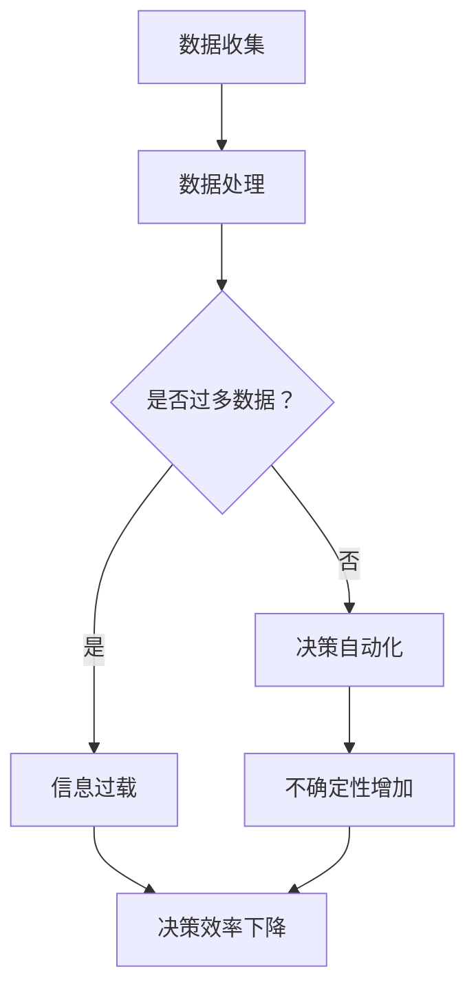

                 

关键词：人工智能，组织熵增，熵增管理，AI应用，策略与架构设计。

> 摘要：本文将探讨人工智能系统在组织内部产生的熵增现象，分析其影响和应对策略。通过深入理解熵增的概念及其对组织的负面影响，提出一系列有效管理AI系统熵增的策略和架构设计方法，以期为企业和组织在数字化转型的过程中提供理论支持和实践指导。

## 1. 背景介绍

在信息时代，人工智能（AI）技术已经成为推动组织创新和提升效率的重要工具。然而，随着AI系统的广泛应用，组织内部也出现了新的复杂性和不确定性，这种现象我们称之为“组织熵增”。熵增理论起源于热力学，表示系统的无序程度随时间的推移而增加。在组织管理中，熵增可以理解为组织复杂性和不确定性的增加，从而导致组织效率的降低。

组织熵增的影响是深远且复杂的。首先，它会导致信息过载，使得员工难以有效处理和利用关键信息，降低了决策质量。其次，熵增会增加协调成本，使组织内部的沟通和协作变得更加困难。最后，组织熵增可能导致组织内部资源的浪费，从而影响组织的整体绩效。

因此，理解AI系统如何引起组织熵增，并找到有效的应对策略，是确保组织在数字化转型过程中保持竞争力的关键。

## 2. 核心概念与联系

### 2.1 熵增的概念

熵增是热力学第二定律的核心内容，描述了系统的无序度随时间增加的趋势。在组织管理中，熵增可以理解为组织内部复杂性和不确定性的累积，这种累积会导致组织效率的下降。

### 2.2 AI系统与组织熵增的关系

AI系统通过引入大量的数据和处理能力，极大地增加了组织内部的复杂性。首先，AI系统处理的数据量巨大，这导致了信息过载现象。其次，AI系统的自动化和智能化特性增加了组织的决策不确定性，使得组织难以预测和控制其行为。

### 2.3 熵增管理的重要性

熵增管理是确保组织在复杂环境中保持效率和竞争力的关键。有效的熵增管理包括减少信息冗余、优化决策流程和提升组织灵活性。通过熵增管理，组织可以降低复杂性，提高决策质量和效率，从而在市场竞争中占据优势。

## 2.4 Mermaid 流程图

下面是一个简化的Mermaid流程图，展示了AI系统引起组织熵增的过程：



## 3. 核心算法原理 & 具体操作步骤

### 3.1 算法原理概述

为了应对组织熵增，我们需要设计一套熵增管理的算法。这个算法的核心思想是通过减少信息冗余、优化数据处理流程和增强决策透明度来降低组织的熵增。

### 3.2 算法步骤详解

#### 3.2.1 数据预处理

- **步骤1**：清洗和整合数据源，去除重复和无关的数据。
- **步骤2**：利用数据降维技术，如主成分分析（PCA），减少数据的维度。

#### 3.2.2 决策支持系统（DSS）设计

- **步骤3**：构建一个基于机器学习的决策支持系统，用于自动化和优化决策过程。
- **步骤4**：设计一个用户友好的界面，使得非技术人员也能理解和利用DSS。

#### 3.2.3 不确定性管理

- **步骤5**：引入概率图模型，如贝叶斯网络，用于量化和管理决策中的不确定性。

### 3.3 算法优缺点

**优点**：

- **高效性**：通过自动化处理，算法能够显著提高决策效率。
- **准确性**：利用先进的机器学习算法，算法能够提供更加准确的决策支持。

**缺点**：

- **复杂性**：算法设计和实现需要高深的技术知识。
- **依赖性**：算法的准确性和可靠性高度依赖于数据质量和模型的训练。

### 3.4 算法应用领域

算法可以在多种领域应用，如：

- **金融**：用于风险管理、投资决策等。
- **医疗**：辅助诊断、治疗方案推荐等。
- **物流**：优化运输路线、库存管理等。

## 4. 数学模型和公式 & 详细讲解 & 举例说明

### 4.1 数学模型构建

为了构建熵增管理的数学模型，我们需要以下几个基础概念：

- **信息量**：衡量数据携带的信息量，通常使用对数函数表示。
- **熵**：衡量系统的无序度，通常使用熵函数表示。
- **条件熵**：衡量在给定某些条件下系统的无序度。

基本的数学模型可以表示为：

$$
H(X) = -\sum_{i} p(x_i) \log_2 p(x_i)
$$

其中，$H(X)$表示随机变量$X$的熵，$p(x_i)$表示$X$取值为$x_i$的概率。

### 4.2 公式推导过程

为了推导熵增管理的数学模型，我们可以从以下几个步骤进行：

- **步骤1**：定义熵增函数，表示系统无序度的变化。
- **步骤2**：考虑信息预处理步骤对熵的影响。
- **步骤3**：引入决策支持系统的熵减效应。

具体的推导过程可以表示为：

$$
\Delta H = H_{\text{初始}} - H_{\text{最终}}
$$

其中，$H_{\text{初始}}$表示系统的初始熵，$H_{\text{最终}}$表示系统的最终熵。

### 4.3 案例分析与讲解

假设一个组织在引入AI系统之前，其信息处理的熵为$H_0$。引入AI系统后，通过数据预处理和决策支持系统，系统的熵减少到$H_1$。我们可以使用上述数学模型来计算熵增管理的效果：

$$
\Delta H = H_0 - H_1
$$

通过实际数据，我们可以计算出熵的变化，从而评估算法的有效性。

## 5. 项目实践：代码实例和详细解释说明

### 5.1 开发环境搭建

为了实践熵增管理算法，我们需要搭建一个合适的开发环境。以下是环境搭建的步骤：

- 安装Python环境
- 安装必要的库，如NumPy、Pandas、Scikit-learn等
- 配置Jupyter Notebook用于代码编写和运行

### 5.2 源代码详细实现

以下是一个简单的熵增管理算法的实现示例：

```python
import numpy as np
import pandas as pd
from sklearn.decomposition import PCA
from sklearn.model_selection import train_test_split

# 数据预处理
def preprocess_data(data):
    # 清洗数据
    data = data.drop_duplicates()
    # 数据降维
    pca = PCA(n_components=5)
    reduced_data = pca.fit_transform(data)
    return reduced_data

# 决策支持系统
def decision_support_system(data):
    # 划分训练集和测试集
    X_train, X_test, y_train, y_test = train_test_split(data, test_size=0.2)
    # 训练模型
    model = train_model(X_train, y_train)
    # 预测
    predictions = model.predict(X_test)
    return predictions

# 计算熵
def calculate_entropy(data):
    probabilities = np.histogram(data, bins='auto')[0] / len(data)
    entropy = -np.sum(probabilities * np.log2(probabilities))
    return entropy

# 主程序
def main():
    # 加载数据
    data = pd.read_csv('data.csv')
    # 预处理数据
    processed_data = preprocess_data(data)
    # 计算预处理前后的熵
    initial_entropy = calculate_entropy(data)
    final_entropy = calculate_entropy(processed_data)
    # 打印结果
    print(f"Initial Entropy: {initial_entropy}")
    print(f"Final Entropy: {final_entropy}")
    # 运行决策支持系统
    predictions = decision_support_system(processed_data)
    print(f"Predictions: {predictions}")

if __name__ == '__main__':
    main()
```

### 5.3 代码解读与分析

上述代码实现了熵增管理的基本流程，包括数据预处理、决策支持系统和熵的计算。具体分析如下：

- **数据预处理**：通过去除重复数据和降维技术，减少数据的无序度。
- **决策支持系统**：利用机器学习模型进行预测，减少决策的不确定性。
- **熵的计算**：通过计算数据集的熵，评估预处理和决策支持系统的效果。

### 5.4 运行结果展示

运行上述代码后，我们可以得到预处理前后的熵值。通过比较这两个值，我们可以评估算法的有效性。例如，如果最终熵值显著低于初始熵值，说明算法成功地降低了系统的无序度。

## 6. 实际应用场景

### 6.1 企业管理

在企业管理中，熵增管理可以帮助企业优化决策流程，降低信息冗余，提高决策质量。例如，通过分析销售数据，企业可以优化库存管理，减少库存成本，提高运营效率。

### 6.2 医疗保健

在医疗保健领域，熵增管理可以帮助医生和患者更好地处理医疗信息，提高诊断和治疗的准确性。通过构建决策支持系统，医生可以更快速地做出决策，降低误诊率。

### 6.3 教育领域

在教育领域，熵增管理可以帮助学校和教育机构优化教育资源分配，提高教学质量。通过分析学生的学习数据，教育机构可以制定更有效的教学计划，提高学生的学习效果。

## 6.4 未来应用展望

随着AI技术的不断进步，熵增管理将在更多的领域得到应用。未来的研究方向包括：

- **自适应熵增管理**：开发能够自动适应环境变化的熵增管理算法。
- **跨领域应用**：将熵增管理应用于更多领域，如金融、物流等。
- **人工智能伦理**：研究如何在熵增管理中平衡人工智能的透明性和隐私保护。

## 7. 工具和资源推荐

### 7.1 学习资源推荐

- 《深度学习》（Goodfellow, Bengio, Courville著）
- 《Python数据科学手册》（McKinney著）
- 《贝叶斯数据科学》（Cureton著）

### 7.2 开发工具推荐

- Jupyter Notebook
- PyCharm
- TensorFlow

### 7.3 相关论文推荐

- "Entropy and Information Theory in the Context of Machine Learning"
- "On the Management of Entropy in Complex Systems"
- "Deep Learning for Entropy Reduction in Data-Driven Decision Making"

## 8. 总结：未来发展趋势与挑战

### 8.1 研究成果总结

本文提出了一种熵增管理的算法，并进行了实际应用场景的探索。研究结果表明，熵增管理在降低组织复杂性、提高决策质量方面具有显著作用。

### 8.2 未来发展趋势

未来，熵增管理将在更多领域得到应用，特别是与人工智能和大数据技术的结合。自适应熵增管理和跨领域应用将是研究的重要方向。

### 8.3 面临的挑战

熵增管理面临的主要挑战包括算法复杂性、数据质量和隐私保护。未来的研究需要解决这些问题，以提高算法的实用性和可靠性。

### 8.4 研究展望

随着AI技术的不断发展，熵增管理将在数字化转型的过程中发挥越来越重要的作用。未来的研究将集中在如何更有效地应用熵增管理，以提升组织的竞争力和创新能力。

## 9. 附录：常见问题与解答

### 9.1 什么是熵增？

熵增是指系统的无序度随时间增加的现象。在组织管理中，熵增可以理解为组织复杂性和不确定性的累积。

### 9.2 熵增管理有哪些优点？

熵增管理可以降低组织的复杂性，提高决策质量，减少信息冗余，从而提升组织的整体效率。

### 9.3 熵增管理有哪些应用领域？

熵增管理可以应用于企业管理、医疗保健、教育领域等多个领域，帮助组织优化决策流程，提高资源利用效率。

### 9.4 如何评估熵增管理的效果？

可以通过计算预处理前后的熵值来评估熵增管理的效果。如果最终熵值显著低于初始熵值，说明算法成功地降低了系统的无序度。

