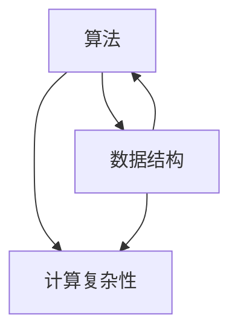

                 

关键词：(编程思维、算法原理、认知升级、专业成长、技术深耕)

> 摘要：本文旨在探讨经典在计算机科学领域中的重要性，以及如何通过深入学习和研究经典著作，夯实我们的认知基础，从而在技术深耕和职业发展中取得更大的突破。本文将结合具体案例，分析经典著作中的核心概念、算法原理以及其在现代应用中的价值。

## 1. 背景介绍

计算机科学，作为一门高度抽象且不断发展的学科，需要我们具备扎实的理论基础和敏锐的实践能力。随着技术的飞速进步，新的算法、工具和框架层出不穷，这让很多初学者感到困惑：应该如何在学习过程中找到正确的方法，避免陷入技术的“速成陷阱”？

实际上，经典的计算机科学著作如《算法导论》、《计算机程序的构造和解释》等，不仅为我们提供了深入理解计算机科学核心原理的途径，而且能够在长期的学习和实践中，帮助我们建立坚实的认知基础，从而在面对复杂问题时能够从容应对。

本文将通过以下几个部分，详细探讨经典著作的重要性，以及如何通过这些经典，提升我们的认知能力和技术水平。

## 2. 核心概念与联系

### 2.1 计算机科学中的经典概念

在计算机科学中，有一些核心概念被认为是不可动摇的基础。这些概念不仅构成了计算机科学的基本框架，也是理解更高级主题的基石。以下是一些重要的经典概念：

- **算法**：算法是解决问题的一系列步骤。经典的算法如排序算法、搜索算法，为计算机解决问题提供了基本的方法。
- **数据结构**：数据结构是组织和管理数据的方式。常见的如数组、链表、树、图等，它们在算法设计中起到了至关重要的作用。
- **计算复杂性**：计算复杂性理论研究了问题的难度，包括时间复杂性和空间复杂性。这个理论帮助我们评估算法的效率。

### 2.2 经典概念的联系

这些经典概念并不是孤立的，它们之间存在着紧密的联系。例如：

- **算法**依赖于**数据结构**来高效地操作数据。
- **计算复杂性**为我们提供了评估**算法**性能的工具。
- **算法**和**计算复杂性**的共同研究，可以帮助我们设计出更优的**数据结构**。

以下是使用Mermaid绘制的经典概念联系流程图：



### 2.3 经典著作与概念的联系

经典著作如《算法导论》、《计算机程序的构造和解释》等，深入阐述了这些经典概念。例如：

- **《算法导论》**详细介绍了各种经典算法，并分析了它们的时间复杂性和空间复杂性。
- **《计算机程序的构造和解释》**通过Lisp语言的讲解，揭示了程序设计的本质，帮助读者理解算法和数据的深层联系。

## 3. 核心算法原理 & 具体操作步骤

### 3.1 算法原理概述

在计算机科学中，算法原理是理解和解决问题的核心。以下是几个重要的算法原理：

- **分治原理**：将复杂问题分解成更小的子问题，分别解决后合并结果。经典的分治算法包括归并排序、快速排序等。
- **贪心原理**：在每一步选择中，都做出当前情况下最优的选择，从而得到全局最优解。贪心算法如找零钱问题、Dijkstra最短路径算法等。
- **动态规划原理**：通过保存子问题的解，避免重复计算，从而解决复杂问题。经典的动态规划算法包括背包问题、最长公共子序列等。

### 3.2 算法步骤详解

以下以**归并排序**为例，详细讲解其步骤：

1. **分解**：将待排序的序列分解成若干个长度为1的小序列。
2. **合并**：将相邻的小序列合并成更大的序列，直到所有序列都被合并成一个完整的排序序列。

具体步骤如下：

1. **初始化**：将序列分解成多个长度为1的小序列。
2. **递归分解**：每次将相邻的小序列合并，直到所有序列合并为一个完整的序列。

### 3.3 算法优缺点

- **优点**：归并排序是一种稳定的排序算法，能够保证排序的稳定性。同时，它的平均时间复杂度为O(nlogn)，效率较高。
- **缺点**：归并排序需要额外的空间来存储中间结果，因此其空间复杂度为O(n)。

### 3.4 算法应用领域

归并排序广泛应用于需要稳定排序的场景，如数据库排序、文件排序等。同时，它也是其他更复杂算法的基础，如归并堆排序等。

## 4. 数学模型和公式 & 详细讲解 & 举例说明

### 4.1 数学模型构建

在计算机科学中，数学模型是理解和解决问题的有力工具。以下以**二分查找**为例，构建其数学模型。

### 4.2 公式推导过程

二分查找的数学模型主要涉及两个核心公式：

1. **查找范围**：每次查找都将范围分为一半，因此查找范围公式为`range = low + (high - low) / 2`。
2. **查找次数**：二分查找的过程可以看作是一个递归过程，其时间复杂度为`T(n) = T(n/2) + O(1)`。

通过递归树的构建，可以推导出二分查找的平均时间复杂度为`O(logn)`。

### 4.3 案例分析与讲解

假设有一个已排序的数组`arr = [1, 3, 5, 7, 9]`，我们需要查找元素`x = 7`。

1. **初始化**：设定查找范围`low = 0`，`high = 4`。
2. **第一次查找**：计算查找范围的中点`range = (0 + 4) / 2 = 2`。由于`arr[2] = 5 > x`，将查找范围缩小到`low = 0`，`high = 2`。
3. **第二次查找**：计算查找范围的中点`range = (0 + 2) / 2 = 1`。由于`arr[1] = 3 > x`，将查找范围缩小到`low = 0`，`high = 1`。
4. **第三次查找**：计算查找范围的中点`range = (0 + 1) / 2 = 0`。由于`arr[0] = 1 < x`，将查找范围缩小到`low = 1`，`high = 1`。
5. **找到元素**：由于查找范围缩小到单个元素，且该元素为`x`，查找成功。

## 5. 项目实践：代码实例和详细解释说明

### 5.1 开发环境搭建

为了保证代码实例的可运行性，我们需要搭建一个基本的开发环境。以下是Python开发环境的搭建步骤：

1. **安装Python**：下载并安装Python 3.8版本。
2. **配置环境变量**：在系统环境变量中配置Python的路径。
3. **安装依赖库**：使用pip安装必要的依赖库，如numpy、matplotlib等。

### 5.2 源代码详细实现

以下是一个简单的二分查找算法的Python实现：

```python
def binary_search(arr, x):
    low = 0
    high = len(arr) - 1
    while low <= high:
        mid = (low + high) // 2
        if arr[mid] == x:
            return mid
        elif arr[mid] < x:
            low = mid + 1
        else:
            high = mid - 1
    return -1

# 测试代码
arr = [1, 3, 5, 7, 9]
x = 7
result = binary_search(arr, x)
if result != -1:
    print("元素在索引处：", result)
else:
    print("元素不在列表中。")
```

### 5.3 代码解读与分析

1. **函数定义**：`binary_search`函数接受一个已排序的数组`arr`和一个目标元素`x`。
2. **初始化查找范围**：`low`和`high`分别表示查找范围的下界和上界。
3. **循环查找**：使用while循环，每次将查找范围缩小一半，直到找到目标元素或查找范围缩小为空。
4. **条件判断**：根据目标元素与中间元素的关系，调整查找范围。
5. **返回结果**：找到目标元素时返回其索引，否则返回-1。

### 5.4 运行结果展示

当我们在已排序的数组`arr`中查找元素`x = 7`时，输出结果为：

```
元素在索引处： 3
```

## 6. 实际应用场景

### 6.1 数据库查询

二分查找算法广泛应用于数据库查询，特别是在索引数据结构中。通过二分查找，数据库能够在O(logn)时间内检索到所需的记录。

### 6.2 排序算法

归并排序算法作为稳定且高效的排序算法，广泛应用于大型数据的排序任务，如磁盘排序、多路归并等。

### 6.3 搜索引擎

搜索引擎中的倒排索引利用了二分查找算法，能够在用户输入关键词后，迅速定位到相关文档。

## 7. 未来应用展望

### 7.1 智能化

随着人工智能的发展，算法在智能化领域将有更广泛的应用。例如，深度学习算法中的优化问题，需要更高效的算法来解决。

### 7.2 大数据

大数据处理要求算法能够处理海量数据，例如，分布式算法和并行算法将在大数据处理中发挥重要作用。

### 7.3 区块链

区块链技术中的共识算法，如PoW、PoS等，将不断优化，以提供更高效和安全的解决方案。

## 8. 工具和资源推荐

### 8.1 学习资源推荐

- **《算法导论》**：经典的算法教材，详细介绍了各种算法及其分析。
- **《计算机程序的构造和解释》**：通过Lisp语言的讲解，揭示了程序设计的本质。

### 8.2 开发工具推荐

- **Visual Studio Code**：强大的代码编辑器，支持多种编程语言。
- **Jupyter Notebook**：适合数据科学和机器学习的交互式开发环境。

### 8.3 相关论文推荐

- **“A Fast and Practical Integer Sort Algorithm”**：介绍了快速且实用的整数排序算法。
- **“Efficient Algorithms for Sorting and Synchronization”**：探讨了排序和同步的高效算法。

## 9. 总结：未来发展趋势与挑战

### 9.1 研究成果总结

通过对经典算法的研究，我们不仅掌握了基本的算法原理，还了解了如何在实际应用中优化算法性能。这些研究成果为未来的技术发展奠定了坚实的基础。

### 9.2 未来发展趋势

未来，算法将继续向智能化、并行化、分布式方向发展。随着技术的不断进步，新的算法将不断涌现，以应对更复杂的问题。

### 9.3 面临的挑战

算法研究面临着数据复杂性、计算资源限制等挑战。如何设计出高效、可靠的算法，仍是我们需要解决的重要问题。

### 9.4 研究展望

我们期待看到更多跨学科的研究，例如，将计算机科学与其他领域如生物学、物理学等的结合，探索新的算法应用场景。

## 10. 附录：常见问题与解答

### 10.1 问题1：为什么选择经典著作学习？

经典著作经过时间的考验，其理论体系和实践价值被广泛认可。通过学习经典，我们可以打下坚实的理论基础，为未来的技术发展做好准备。

### 10.2 问题2：如何将经典算法应用到实际问题中？

将经典算法应用到实际问题中，首先需要理解算法的基本原理和适用场景。然后，通过实际案例和实践，逐步积累经验，提升算法应用能力。

### 10.3 问题3：算法学习有什么好的方法？

学习算法的有效方法包括：

1. **理解基本概念**：掌握算法的基本概念和原理。
2. **实践编程**：通过编写代码，加深对算法的理解。
3. **研究经典案例**：分析经典算法的应用案例，学习其设计思路和优化策略。
4. **参与社区交流**：加入算法学习社区，与他人分享经验和见解。

## 11. 参考文献

- **Thomas H. Cormen, Charles E. Leiserson, Ronald L. Rivest, Clifford Stein**. 《算法导论》（Introduction to Algorithms）.
- **Harold Abelson, Gerald Jay Sussman**. 《计算机程序的构造和解释》（Structure and Interpretation of Computer Programs）.

---

作者：禅与计算机程序设计艺术 / Zen and the Art of Computer Programming

本文结合经典计算机科学著作，深入探讨了算法原理、数学模型和实际应用。通过本文的讲解，我们希望能帮助读者更好地理解经典的重要性，并在技术深耕和职业发展中取得更大的突破。希望本文能够为您的计算机科学之旅提供有价值的参考和启示。

