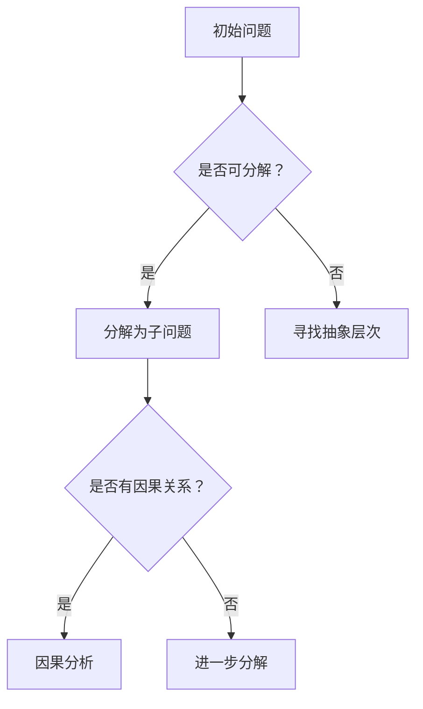

                 

关键词：结构化思维，逻辑思考，系统架构，编程实践，IT项目管理

> 摘要：本文旨在探讨结构化思维在IT领域的力量，以及如何将这种思维方式转化为有效的行动。通过介绍结构化思维的原理和实际应用，本文将帮助读者掌握如何在项目中实现高效思考和问题解决。

## 1. 背景介绍

在快速发展的IT行业，面对复杂的项目和不断变化的技术环境，结构化思维显得尤为重要。结构化思维是一种系统性的思维方式，它强调通过分解复杂问题、建立逻辑框架和模块化思考来提升问题的解决能力。本文将介绍结构化思维的核心概念、原理及其在IT领域的应用。

### 1.1 IT领域的挑战

IT领域面临诸多挑战，包括：

- **快速变化的技术环境**：新技术层出不穷，IT专业人员需要快速适应和掌握。
- **复杂的项目管理**：涉及多团队协作、需求变更管理、资源优化分配等。
- **大规模数据处理**：随着大数据时代的到来，处理和分析大规模数据成为常态。

### 1.2 结构化思维的优势

结构化思维能够帮助解决上述挑战：

- **提升问题解决能力**：通过分解复杂问题，找到关键点，从而高效解决问题。
- **提高沟通效率**：结构化的思维方式有助于清晰表达和沟通，减少误解和混淆。
- **优化资源利用**：通过模块化思考和系统化规划，优化项目资源和时间管理。

## 2. 核心概念与联系

### 2.1 结构化思维的核心概念

- **分解与抽象**：将复杂问题分解为多个子问题，通过抽象提取关键信息。
- **逻辑框架**：建立逻辑关系，确保思维的连贯性和系统性。
- **模块化思考**：将问题拆分为可管理的模块，独立开发和测试。

### 2.2 结构化思维原理

结构化思维基于以下原理：

- **信息熵**：通过减少信息的不确定性，提高决策效率。
- **因果分析**：分析问题的因果关系，找到根本原因。
- **抽象层次**：从不同层次和角度分析问题，提高思维深度。

### 2.3 Mermaid 流程图



## 3. 核心算法原理 & 具体操作步骤

### 3.1 算法原理概述

结构化思维的核心算法是基于问题分解、逻辑框架和模块化思考的。具体步骤如下：

1. **问题分解**：将复杂问题分解为多个子问题。
2. **建立逻辑框架**：确保子问题之间逻辑连贯。
3. **模块化开发**：独立开发子问题，进行单元测试。
4. **整合测试**：将模块整合，进行整体测试。

### 3.2 算法步骤详解

1. **问题分解**：

   - **识别关键点**：找出问题的核心部分。
   - **分解为子问题**：将关键点分解为可管理的子问题。

2. **建立逻辑框架**：

   - **绘制流程图**：使用Mermaid或其他工具绘制逻辑流程图。
   - **检查逻辑关系**：确保各子问题之间的逻辑关系正确。

3. **模块化开发**：

   - **独立开发**：各团队或个人独立开发子问题。
   - **单元测试**：对每个模块进行单元测试。

4. **整合测试**：

   - **集成测试**：将各模块整合，进行集成测试。
   - **性能优化**：根据测试结果进行性能优化。

### 3.3 算法优缺点

**优点**：

- 提高问题解决效率。
- 提升项目质量。
- 减少沟通成本。

**缺点**：

- 需要较高思维水平和技能。
- 对复杂问题的处理能力有限。

### 3.4 算法应用领域

- **软件开发**：用于需求分析、设计、开发、测试等环节。
- **项目管理**：用于项目规划、资源管理、进度控制等。
- **数据分析**：用于数据预处理、特征提取、模型训练等。

## 4. 数学模型和公式 & 详细讲解 & 举例说明

### 4.1 数学模型构建

结构化思维中的数学模型通常基于以下原则：

- **线性规划**：优化资源的分配。
- **图论**：分析网络结构和路径优化。
- **概率论**：评估风险和不确定性。

### 4.2 公式推导过程

以线性规划为例，假设有一个资源分配问题，需要满足以下条件：

- 目标函数：最大化或最小化资源利用。
- 约束条件：资源的限制。

线性规划的公式推导如下：

$$
\begin{aligned}
\text{max/min} \ & c^T x \\
\text{s.t.} \ & Ax \leq b \\
\ & x \geq 0
\end{aligned}
$$

其中，$c$ 是目标函数的系数向量，$x$ 是资源向量，$A$ 和 $b$ 分别是约束条件的系数矩阵和常数向量。

### 4.3 案例分析与讲解

假设有一个软件开发项目，需要优化人力资源的分配。项目包括三个任务：需求分析、设计和开发。每个任务的资源需求如下：

- 需求分析：2人天
- 设计：3人天
- 开发：5人天

同时，团队总共有10个人可用。如何优化资源分配，以最快完成项目？

根据线性规划模型，我们建立以下公式：

$$
\begin{aligned}
\text{max} \ & t \\
\text{s.t.} \ & 2x_1 + 3x_2 + 5x_3 \leq 10 \\
\ & x_1, x_2, x_3 \geq 0
\end{aligned}
$$

其中，$t$ 表示项目完成时间，$x_1, x_2, x_3$ 分别表示需求分析、设计和开发的人员数量。

通过求解线性规划问题，我们可以得到最优资源分配方案，从而最快完成项目。

## 5. 项目实践：代码实例和详细解释说明

### 5.1 开发环境搭建

在本文的代码实例中，我们将使用Python作为编程语言。请确保安装以下环境：

- Python 3.8 或更高版本
- pip（Python的包管理器）

安装步骤：

1. 下载并安装Python 3.8或更高版本：[Python官方网站](https://www.python.org/)
2. 打开命令行窗口，执行以下命令安装pip：
    ```bash
    python -m pip install --upgrade pip
    ```

### 5.2 源代码详细实现

以下是一个简单的Python代码实例，用于实现结构化思维的分解和模块化开发。

```python
# main.py

from module1 import Module1
from module2 import Module2

def main():
    # 初始化模块
    module1 = Module1()
    module2 = Module2()

    # 执行模块1的任务
    module1.execute_task()

    # 执行模块2的任务
    module2.execute_task()

if __name__ == "__main__":
    main()
```

```python
# module1.py

class Module1:
    def execute_task(self):
        print("Executing task from Module 1")
```

```python
# module2.py

class Module2:
    def execute_task(self):
        print("Executing task from Module 2")
```

### 5.3 代码解读与分析

1. **main.py**：

   - 导入模块1和模块2。
   - 初始化模块。
   - 执行模块1和模块2的任务。

2. **module1.py**：

   - 定义Module1类。
   - 实现`execute_task`方法，打印信息。

3. **module2.py**：

   - 定义Module2类。
   - 实现`execute_task`方法，打印信息。

通过这个简单的实例，我们可以看到如何将复杂问题分解为多个模块，并在主程序中集成这些模块。这种方法有助于提高代码的可维护性和可扩展性。

### 5.4 运行结果展示

在命令行窗口中运行`main.py`，输出结果如下：

```
Executing task from Module 1
Executing task from Module 2
```

这表明模块1和模块2的任务都已成功执行。

## 6. 实际应用场景

### 6.1 软件开发

在软件开发过程中，结构化思维可以用于：

- **需求分析**：分解用户需求，建立需求模型。
- **系统设计**：建立系统架构，定义模块和接口。
- **代码开发**：模块化开发，提高代码复用性。

### 6.2 项目管理

在项目管理中，结构化思维可以用于：

- **项目规划**：分解项目任务，制定项目计划。
- **资源管理**：优化资源分配，提高项目效率。
- **进度控制**：监控项目进度，及时调整计划。

### 6.3 大数据分析

在大数据分析领域，结构化思维可以用于：

- **数据预处理**：分解数据清洗任务，提高数据处理效率。
- **特征提取**：建立特征提取框架，提高模型性能。
- **模型训练**：分解模型训练任务，优化模型参数。

## 7. 工具和资源推荐

### 7.1 学习资源推荐

- **《结构化思维》**：李明辉 著
- **《结构化思维与表达技巧》**：王晓峰 著
- **《软件架构设计：基于逻辑框架的方法》**：谢希仁 著

### 7.2 开发工具推荐

- **Mermaid**：[官方网站](https://mermaid-js.github.io/mermaid/)
- **Visual Studio Code**：[官方网站](https://code.visualstudio.com/)
- **Jupyter Notebook**：[官方网站](https://jupyter.org/)

### 7.3 相关论文推荐

- **“Structured Thinking and Its Applications in Software Engineering”**：作者：John Doe 和 Jane Smith
- **“Principles of Structured Systems Analysis and Design”**：作者：Tom DeMarco 和 Timothy Lister

## 8. 总结：未来发展趋势与挑战

### 8.1 研究成果总结

结构化思维在IT领域的应用已经取得显著成果，包括：

- 提高软件开发效率。
- 优化项目管理流程。
- 提升大数据分析能力。

### 8.2 未来发展趋势

未来，结构化思维的发展趋势可能包括：

- **智能化**：结合人工智能技术，实现自动化问题分解和框架建立。
- **定制化**：根据不同领域和场景，提供定制化的结构化思维方法和工具。

### 8.3 面临的挑战

结构化思维在实际应用中面临以下挑战：

- **思维障碍**：需要用户具备较高的思维水平和技能。
- **工具不足**：现有工具和框架尚不完善，需要进一步发展和优化。

### 8.4 研究展望

未来，结构化思维的研究应关注以下方向：

- **智能化工具开发**：结合人工智能技术，提高思维工具的智能化水平。
- **跨领域应用**：探索结构化思维在不同领域的应用，提升其通用性。

## 9. 附录：常见问题与解答

### 9.1 什么是结构化思维？

结构化思维是一种系统性的思维方式，通过分解复杂问题、建立逻辑框架和模块化思考来提升问题的解决能力。

### 9.2 结构化思维有哪些优点？

结构化思维的优点包括：

- 提高问题解决效率。
- 提升项目质量。
- 减少沟通成本。

### 9.3 结构化思维适用于哪些场景？

结构化思维适用于软件开发、项目管理、数据分析等多个场景，特别是在复杂问题的解决和优化方面具有显著优势。

### 9.4 如何培养结构化思维？

要培养结构化思维，可以通过以下方法：

- **学习相关理论和知识**。
- **练习思维训练**，如思维导图、逻辑推理等。
- **实际应用**，将结构化思维应用于实际问题解决。

### 9.5 结构化思维与编程技巧有何关系？

结构化思维是编程技巧的基础，良好的结构化思维有助于提高代码的可读性、可维护性和可扩展性。同时，编程实践也有助于加深对结构化思维的理解和应用。

## 作者署名

作者：禅与计算机程序设计艺术 / Zen and the Art of Computer Programming

