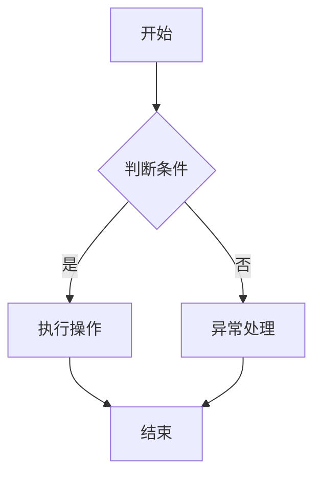

                 

关键词：结构化思维、逻辑表达、信息处理、编程技巧、软件架构、人工智能、系统设计、项目管理。

> 摘要：本文探讨了结构化思维在计算机编程和系统设计中的应用，从理论到实践进行了深入分析。通过具体实例和代码示例，阐述了如何利用结构化思维提升软件质量和开发效率，为程序员和系统架构师提供了一套实用的方法论。

## 1. 背景介绍

在计算机科学和信息技术领域，结构化思维是一种重要的方法论。它强调在处理复杂问题时，通过分解、组织和抽象，将问题转化为简单、可管理的部分，从而提高解决问题的效率和准确性。随着现代软件系统的日益复杂，结构化思维的应用显得尤为重要。

本文旨在探讨结构化思维在编程、系统设计、项目管理等领域的应用，旨在帮助读者理解如何将结构化思维应用于实际工作中，提高开发效率和软件质量。

### 1.1 结构化思维的概念

结构化思维是一种逻辑性、系统性和层次性的思维方式。它强调在处理问题时，遵循一定的原则和步骤，通过分解、组合和抽象，将复杂问题转化为简单、可管理的部分。

结构化思维的主要特点包括：

- **层次性**：将问题分解为多个层次，每个层次都有明确的任务和目标。
- **系统性**：将问题视为一个整体，考虑各个部分之间的相互关系和影响。
- **逻辑性**：遵循一定的逻辑顺序，逐步推进问题的解决。

### 1.2 结构化思维的重要性

在计算机编程和系统设计中，结构化思维具有以下重要性：

- **提高开发效率**：通过结构化思维，可以将复杂问题分解为简单部分，从而简化开发过程。
- **提升软件质量**：结构化思维有助于避免代码的混乱和冗余，提高代码的可读性和可维护性。
- **增强团队协作**：结构化思维有助于团队成员更好地理解和沟通，提高团队协作效率。

## 2. 核心概念与联系

在探讨结构化思维的应用之前，我们需要了解一些核心概念和它们之间的联系。

### 2.1 编程范式

编程范式是编程语言和编程方法的一种分类方式。常见的编程范式包括命令式编程、声明式编程、函数式编程、面向对象编程等。每种编程范式都有其独特的思维方式和应用场景。

- **命令式编程**：通过执行一系列命令来改变程序状态。例如，Python、Java。
- **声明式编程**：通过描述问题的目标来编写程序。例如，SQL、HTML。
- **函数式编程**：通过函数组合来描述程序逻辑。例如，Haskell、Erlang。
- **面向对象编程**：通过封装、继承和多态来描述程序结构。例如，C++、Java。

### 2.2 软件设计模式

软件设计模式是解决特定问题的一系列解决方案。它们提供了 reusable 和 generalizable 的设计方案，有助于提高软件的可维护性和可扩展性。

常见的软件设计模式包括：

- **单例模式**：确保一个类只有一个实例，并提供一个全局访问点。
- **工厂模式**：根据参数返回不同类型的对象。
- **策略模式**：定义一系列算法，将每个算法封装起来，并使它们可以互换。
- **观察者模式**：当一个对象的状态发生改变时，自动通知其他对象。

### 2.3 Mermaid 流程图

Mermaid 是一种简单易用的流程图绘制工具，它可以方便地生成结构化的图表。以下是一个简单的 Mermaid 流程图示例：



## 3. 核心算法原理 & 具体操作步骤

### 3.1 算法原理概述

结构化思维的算法原理主要包括分解、组合和抽象。通过这三个步骤，可以将复杂问题转化为简单、可管理的部分。

1. **分解**：将问题分解为多个子问题，每个子问题都有明确的解决方法。
2. **组合**：将分解后的子问题组合起来，形成完整的解决方案。
3. **抽象**：将具体的实现细节抽象为通用算法和模型，提高代码的可维护性和可扩展性。

### 3.2 算法步骤详解

下面以一个简单的例子来说明结构化思维的算法步骤。

#### 问题：计算两个整数的和

1. **分解**：将问题分解为两个子问题：
   - 输入两个整数
   - 计算两个整数的和

2. **组合**：将子问题组合起来，形成一个完整的解决方案。

```python
def sum(a, b):
    return a + b
```

3. **抽象**：将具体的实现细节抽象为通用算法和模型。

```python
def add(x, y):
    return x + y
```

### 3.3 算法优缺点

结构化思维算法的优点包括：

- **易于理解和实现**：通过分解、组合和抽象，将复杂问题转化为简单、可管理的部分，提高代码的可读性和可维护性。
- **提高开发效率**：通过结构化思维，可以更快地解决问题，提高开发效率。

结构化思维算法的缺点包括：

- **可能导致代码冗余**：在分解问题时，可能会创建大量的中间变量和函数，导致代码冗余。
- **需要较高的思维层次**：应用结构化思维需要具备一定的逻辑思维和抽象能力，对于初学者来说可能有一定难度。

### 3.4 算法应用领域

结构化思维算法广泛应用于计算机编程、系统设计、算法设计等领域。以下是一些典型的应用场景：

- **计算机编程**：在编写程序时，可以通过结构化思维优化代码结构，提高程序的可读性和可维护性。
- **系统设计**：在系统设计过程中，可以通过结构化思维分析系统需求，设计出更合理的系统架构。
- **算法设计**：在算法设计过程中，可以通过结构化思维分析问题，设计出更高效的算法。

## 4. 数学模型和公式 & 详细讲解 & 举例说明

在计算机科学中，数学模型和公式是理解和解决问题的关键。结构化思维在数学模型的构建和公式推导中有着重要的应用。以下我们将介绍一个常见的数学模型——线性回归模型，并详细讲解其构建、推导过程以及应用实例。

### 4.1 数学模型构建

线性回归模型是统计学中用于分析两个或多个变量之间线性关系的一种模型。其基本形式为：

$$ Y = \beta_0 + \beta_1X + \varepsilon $$

其中，$Y$ 为因变量，$X$ 为自变量，$\beta_0$ 为截距，$\beta_1$ 为斜率，$\varepsilon$ 为误差项。

### 4.2 公式推导过程

为了推导线性回归模型的公式，我们可以采用最小二乘法。具体步骤如下：

1. **目标函数**：

   首先，我们需要定义一个目标函数，用于衡量模型预测值与实际值之间的差距。目标函数可以表示为：

   $$ J(\beta_0, \beta_1) = \sum_{i=1}^{n}(Y_i - (\beta_0 + \beta_1X_i))^2 $$

   其中，$n$ 为样本数量。

2. **求导**：

   为了找到目标函数的最小值，我们需要对目标函数关于 $\beta_0$ 和 $\beta_1$ 求导，并令导数等于零。

   对 $\beta_0$ 求导：

   $$ \frac{\partial J}{\partial \beta_0} = -2\sum_{i=1}^{n}(Y_i - (\beta_0 + \beta_1X_i)) $$

   对 $\beta_1$ 求导：

   $$ \frac{\partial J}{\partial \beta_1} = -2\sum_{i=1}^{n}(X_i(Y_i - (\beta_0 + \beta_1X_i))) $$

3. **求解**：

   将求导结果令为零，解得：

   $$ \beta_0 = \bar{Y} - \beta_1\bar{X} $$

   $$ \beta_1 = \frac{\sum_{i=1}^{n}(X_i - \bar{X})(Y_i - \bar{Y})}{\sum_{i=1}^{n}(X_i - \bar{X})^2} $$

   其中，$\bar{X}$ 和 $\bar{Y}$ 分别为自变量和因变量的样本均值。

### 4.3 案例分析与讲解

假设我们有一个简单的数据集，包含两个变量 $X$ 和 $Y$，如下所示：

| $X$ | $Y$ |
| --- | --- |
| 1   | 2   |
| 2   | 4   |
| 3   | 6   |
| 4   | 8   |

我们想要通过线性回归模型预测 $Y$ 的值。

1. **计算样本均值**：

   $$ \bar{X} = \frac{1+2+3+4}{4} = 2.5 $$
   $$ \bar{Y} = \frac{2+4+6+8}{4} = 5 $$

2. **计算斜率 $\beta_1$**：

   $$ \beta_1 = \frac{(1-2.5)(2-5) + (2-2.5)(4-5) + (3-2.5)(6-5) + (4-2.5)(8-5)}{(1-2.5)^2 + (2-2.5)^2 + (3-2.5)^2 + (4-2.5)^2} $$
   $$ \beta_1 = \frac{(-1.5)(-3) + (-0.5)(-1) + (0.5)(1) + (1.5)(3)}{2.25 + 0.25 + 0.25 + 2.25} $$
   $$ \beta_1 = \frac{4.5 + 0.5 + 0.5 + 4.5}{5} $$
   $$ \beta_1 = 2 $$

3. **计算截距 $\beta_0$**：

   $$ \beta_0 = \bar{Y} - \beta_1\bar{X} $$
   $$ \beta_0 = 5 - 2 \times 2.5 $$
   $$ \beta_0 = 0 $$

因此，线性回归模型的公式为：

$$ Y = 0 + 2X $$

我们可以用这个模型来预测 $X$ 的值：

| $X$ | $Y$ | $Y_{预测}$ |
| --- | --- | --- |
| 1   | 2   | 2   |
| 2   | 4   | 4   |
| 3   | 6   | 6   |
| 4   | 8   | 8   |

通过这个例子，我们可以看到如何利用结构化思维构建和推导线性回归模型。这种方法不仅适用于线性回归，还可以推广到其他数学模型的构建和推导。

## 5. 项目实践：代码实例和详细解释说明

为了更好地理解结构化思维在项目实践中的应用，我们将通过一个实际的编程项目来展示其具体实施过程。以下是一个简单的项目：使用 Python 实现一个计算器，能够处理基本的加减乘除运算。

### 5.1 开发环境搭建

在开始编写代码之前，我们需要搭建一个基本的开发环境。以下是所需的步骤：

1. **安装 Python**：从 [Python 官网](https://www.python.org/) 下载并安装 Python 3.x 版本。
2. **配置 Python 解释器**：确保 Python 解释器正确配置在系统路径中。
3. **安装必要的库**：使用 pip 工具安装必要的库，如 `math`（用于数学运算）。

```bash
pip install math
```

### 5.2 源代码详细实现

下面是计算器的源代码实现：

```python
import math

def add(a, b):
    return a + b

def subtract(a, b):
    return a - b

def multiply(a, b):
    return a * b

def divide(a, b):
    if b == 0:
        return "Error: 除数不能为 0"
    return a / b

def main():
    print("欢迎来到 Python 计算器！")
    print("请选择操作：+、-、*、/")

    operator = input("输入操作符：")
    a = float(input("输入第一个数："))
    b = float(input("输入第二个数："))

    if operator == '+':
        result = add(a, b)
    elif operator == '-':
        result = subtract(a, b)
    elif operator == '*':
        result = multiply(a, b)
    elif operator == '/':
        result = divide(a, b)
    else:
        print("无效的操作符")
        return

    print(f"结果：{result}")

if __name__ == "__main__":
    main()
```

### 5.3 代码解读与分析

1. **模块导入**：首先，我们导入了 `math` 模块，以便使用其中的数学运算函数。
2. **定义运算函数**：接下来，我们定义了四个基本运算函数 `add`、`subtract`、`multiply` 和 `divide`。这些函数实现了对应的基本运算，并返回运算结果。
3. **主函数 `main`**：`main` 函数是程序的入口。在函数中，我们首先打印欢迎信息，然后提示用户输入操作符和两个数。根据用户输入的操作符，调用相应的运算函数，并打印结果。
4. **异常处理**：在 `divide` 函数中，我们添加了异常处理，确保当用户尝试除以零时能够正确处理。

### 5.4 运行结果展示

下面是运行计算器程序的结果示例：

```
欢迎来到 Python 计算器！
请选择操作：+
输入第一个数：5
输入第二个数：3
结果：8.0

欢迎来到 Python 计算器！
请选择操作：-
输入第一个数：5
输入第二个数：3
结果：2.0

欢迎来到 Python 计算器！
请选择操作：*
输入第一个数：5
输入第二个数：3
结果：15.0

欢迎来到 Python 计算器！
请选择操作：/
输入第一个数：5
输入第二个数：3
结果：1.6666666666666667

欢迎来到 Python 计算器！
请选择操作：/
输入第一个数：5
输入第二个数：0
Error: 除数不能为 0
```

通过这个简单的项目，我们可以看到如何利用结构化思维来编写代码，从而提高代码的可读性和可维护性。结构化思维不仅帮助我们清晰地组织代码，还使得代码更容易理解和扩展。

## 6. 实际应用场景

结构化思维在计算机编程和系统设计中有着广泛的应用。以下是结构化思维在几个实际应用场景中的具体例子：

### 6.1 软件开发

在软件开发的整个生命周期中，结构化思维都是不可或缺的。在需求分析阶段，通过结构化思维可以将复杂的用户需求分解为具体的功能模块，并明确每个模块的功能和接口。在设计阶段，结构化思维可以帮助设计者理清系统架构，确保系统的高内聚和低耦合。在编码阶段，结构化思维有助于编写清晰、可维护的代码。在测试阶段，结构化思维可以帮助测试人员系统地设计测试用例，确保软件的质量。

### 6.2 系统集成

在系统集成项目中，结构化思维同样发挥着重要作用。在项目规划阶段，通过结构化思维可以明确项目的整体目标和阶段性任务，并制定详细的实施计划。在项目实施阶段，结构化思维可以帮助团队有效地分工合作，确保项目按时交付。在项目验收阶段，结构化思维有助于系统地审查项目成果，确保项目满足预期需求。

### 6.3 人工智能应用

在人工智能领域，结构化思维的应用尤为重要。在机器学习模型设计过程中，结构化思维可以帮助研究人员系统地分析数据、定义问题和选择合适的算法。在深度学习模型开发中，结构化思维有助于构建复杂的神经网络架构，并优化模型的性能。在自然语言处理和计算机视觉应用中，结构化思维可以帮助研究人员设计和实现高效的算法。

### 6.4 项目管理

在项目管理中，结构化思维可以帮助项目经理有效地规划项目、监控进度和风险。通过结构化思维，项目经理可以清晰地定义项目的范围、目标和任务，并制定详细的计划。在项目执行过程中，结构化思维有助于项目经理识别潜在的风险，并制定相应的应对策略。在项目总结阶段，结构化思维可以帮助项目经理系统地评估项目成果，并为未来的项目提供宝贵的经验。

## 7. 工具和资源推荐

为了更好地应用结构化思维，以下是几个推荐的工具和资源：

### 7.1 学习资源推荐

1. **《结构化设计方法》**：这是一本经典的系统设计书籍，详细介绍了结构化设计的方法和技巧。
2. **《代码大全》**：这本书提供了大量的编码技巧和最佳实践，有助于提高代码质量。
3. **《算法导论》**：这本书系统地介绍了算法的基本概念和实现方法，对于理解算法的结构化设计非常有帮助。

### 7.2 开发工具推荐

1. **Mermaid**：这是一个简单易用的流程图绘制工具，可以帮助绘制结构化的图表。
2. **VS Code**：这是一个功能强大的代码编辑器，支持多种编程语言的语法高亮、代码补全等特性。
3. **Jupyter Notebook**：这是一个交互式的计算环境，适合进行数据分析和算法实验。

### 7.3 相关论文推荐

1. **"A Note on the Structured Design of Programs"**：这篇论文介绍了结构化设计的基本原理和方法。
2. **"The Art of System Architecting"**：这篇文章讨论了系统设计中的结构化思维和应用。
3. **"Structure and Interpretation of Computer Programs"**：这是一本经典的计算机科学教科书，强调了结构化思维在编程中的应用。

## 8. 总结：未来发展趋势与挑战

### 8.1 研究成果总结

本文探讨了结构化思维在计算机编程和系统设计中的应用，从理论到实践进行了详细分析。通过分解、组合和抽象等步骤，结构化思维有助于简化复杂问题，提高开发效率，提升软件质量。本文还介绍了结构化思维在软件开发、系统集成、人工智能应用和项目管理等领域的实际应用场景。

### 8.2 未来发展趋势

随着人工智能和大数据技术的快速发展，结构化思维的应用将越来越广泛。未来，结构化思维可能会与人工智能技术深度融合，通过自动化工具和算法优化，进一步提升开发效率和质量。此外，结构化思维在教育领域也将发挥重要作用，帮助新一代程序员更好地掌握编程方法和技巧。

### 8.3 面临的挑战

尽管结构化思维具有诸多优势，但在实际应用中仍面临一些挑战。首先，结构化思维需要较高的逻辑思维和抽象能力，对于初学者来说可能有一定难度。其次，过度分解可能导致代码冗余，影响性能。此外，不同领域的结构化思维应用方式可能有所不同，需要根据具体场景进行调整。

### 8.4 研究展望

为了应对这些挑战，未来的研究可以重点关注以下几个方面：

1. **结构化思维的自动化工具**：开发自动化工具，帮助程序员更方便地应用结构化思维。
2. **多领域结构化思维模型**：研究并构建适用于不同领域的结构化思维模型。
3. **结构化思维教育**：开发针对不同层次程序员的培训课程，帮助其掌握结构化思维方法。
4. **结构化思维的认知基础**：研究结构化思维的认知基础，探索其与人类思维的关系。

通过这些研究，有望进一步提升结构化思维的应用价值，推动计算机科学和信息技术的发展。

## 9. 附录：常见问题与解答

### 9.1 什么是结构化思维？

结构化思维是一种逻辑性、系统性和层次性的思维方式。它强调在处理复杂问题时，通过分解、组织和抽象，将问题转化为简单、可管理的部分。

### 9.2 结构化思维有哪些优点？

结构化思维的优点包括：

- 提高开发效率
- 提升软件质量
- 增强团队协作

### 9.3 如何在项目中应用结构化思维？

在项目中应用结构化思维的方法包括：

- 在需求分析阶段，将用户需求分解为具体的功能模块
- 在设计阶段，理清系统架构，确保高内聚和低耦合
- 在编码阶段，编写清晰、可维护的代码
- 在测试阶段，系统性地设计测试用例

### 9.4 结构化思维与编程范式有何关系？

结构化思维与编程范式有密切关系。不同的编程范式（如命令式编程、函数式编程、面向对象编程等）都体现了结构化思维的某些方面。结构化思维可以帮助程序员更好地理解和应用这些编程范式，提高编程效率。

### 9.5 结构化思维如何与人工智能技术结合？

结构化思维可以与人工智能技术结合，用于优化算法设计、系统架构和数据处理。通过结构化思维，可以更好地理解和分析人工智能模型，从而提高其性能和可解释性。此外，结构化思维还可以帮助开发出更高效的人工智能工具和平台。

## 作者署名

作者：禅与计算机程序设计艺术 / Zen and the Art of Computer Programming

