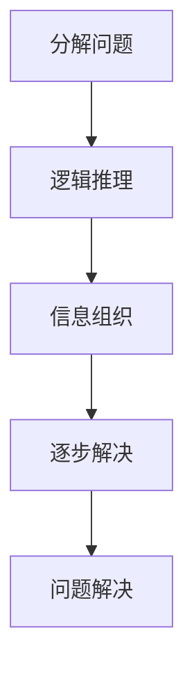
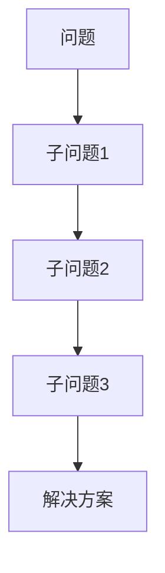

                 

### 关键词 Keywords ###
- 结构化思维
- 逻辑清晰
- 信息组织
- 计算机科学
- 软件开发

<|assistant|>### 摘要 Abstract ###
本文深入探讨了结构化思维在计算机科学和软件开发中的应用，从混沌的信息中提炼出清晰的思路和解决方案。通过阐述结构化思维的核心概念、算法原理、数学模型以及实际应用，旨在帮助读者掌握这一强大的工具，提升问题解决能力和工作效率。本文还将分析未来发展趋势和面临的挑战，为读者提供有益的思考和指导。

## 1. 背景介绍

在信息爆炸的时代，面对复杂的数据和问题，如何从混沌中提取有用的信息，构建有效的解决方案，成为许多领域，尤其是计算机科学和软件开发中亟待解决的问题。结构化思维作为一种系统性的思考方法，可以帮助我们从繁杂的信息中找到关键点，理清思路，从而提高工作效率和解决问题的能力。

结构化思维最早起源于逻辑学和哲学，随后在计算机科学、管理学、工程学等领域得到了广泛应用。其核心在于将复杂的问题分解为简单的部分，通过逻辑推理和结构化的方法进行逐步解决。在计算机科学和软件开发中，结构化思维的重要性不言而喻。它不仅有助于提高代码的可读性和可维护性，还能优化算法效率，降低错误率。

本文将围绕结构化思维在计算机科学和软件开发中的应用，详细介绍其核心概念、算法原理、数学模型以及实际应用案例，帮助读者掌握这一强大的工具。

## 2. 核心概念与联系

### 2.1. 定义

结构化思维是一种将复杂问题分解为简单部分，通过逻辑推理和结构化的方法进行逐步解决的过程。它强调信息组织和逻辑清晰，是一种系统性的思考方法。

### 2.2. 基本原理

结构化思维的基本原理包括以下几点：

1. **分解问题**：将复杂的问题分解为简单的子问题，以便更好地理解和解决。
2. **逻辑推理**：通过逻辑推理，确保各部分之间的关联性和一致性。
3. **信息组织**：对信息进行合理的组织和分类，提高信息利用效率。
4. **逐步解决**：按照一定的顺序和步骤，逐步解决各个子问题。

### 2.3. Mermaid 流程图

以下是一个简单的 Mermaid 流程图，展示了结构化思维的基本流程：



## 3. 核心算法原理 & 具体操作步骤

### 3.1. 算法原理概述

结构化思维的算法原理主要基于以下几个步骤：

1. **识别问题**：首先，明确要解决的问题是什么，以及问题的背景和限制条件。
2. **分解问题**：将问题分解为若干个子问题，每个子问题都是相对独立且容易解决的。
3. **逻辑推理**：通过逻辑推理，确定各个子问题之间的关联性和顺序。
4. **信息组织**：对信息进行分类和整理，确保信息之间的清晰关联。
5. **逐步解决**：按照确定的顺序和步骤，逐步解决各个子问题。

### 3.2. 算法步骤详解

1. **识别问题**：
   - 明确要解决的问题是什么。
   - 确定问题的背景和限制条件。

2. **分解问题**：
   - 将问题分解为若干个子问题。
   - 确保每个子问题都是相对独立且容易解决的。

3. **逻辑推理**：
   - 确定各个子问题之间的关联性和顺序。
   - 通过逻辑推理，确保各部分之间的关联性和一致性。

4. **信息组织**：
   - 对信息进行分类和整理。
   - 确保信息之间的清晰关联。

5. **逐步解决**：
   - 按照确定的顺序和步骤，逐步解决各个子问题。
   - 遇到新的问题，重复上述步骤。

### 3.3. 算法优缺点

#### 优点

1. **提高问题解决能力**：通过结构化思维，可以更好地理解和解决复杂问题。
2. **优化工作效率**：通过分解问题和逻辑推理，可以更快地找到解决方案。
3. **增强代码可读性**：结构化思维有助于编写清晰、易维护的代码。

#### 缺点

1. **需要一定的基础知识**：掌握结构化思维需要一定的逻辑思维和计算机科学知识。
2. **可能增加复杂性**：在某些情况下，过度分解问题可能会增加问题的复杂性。

### 3.4. 算法应用领域

结构化思维在计算机科学和软件开发中具有广泛的应用：

1. **算法设计**：在算法设计过程中，结构化思维可以帮助我们更好地理解问题，优化算法性能。
2. **软件架构设计**：在软件架构设计过程中，结构化思维有助于构建清晰、合理的系统结构。
3. **需求分析**：在需求分析过程中，结构化思维可以帮助我们更好地理解用户需求，制定合理的解决方案。
4. **项目管理**：在项目管理过程中，结构化思维有助于制定清晰的计划和目标，提高项目成功率。

## 4. 数学模型和公式

### 4.1. 数学模型构建

结构化思维的数学模型主要基于逻辑推理和图论。以下是一个简单的数学模型示例：



在这个模型中，A 表示原始问题，B、C、D 分别表示三个子问题，E 表示最终的解决方案。通过逻辑推理，我们可以确定 B、C、D 之间的关联性和顺序，从而找到解决方案。

### 4.2. 公式推导过程

以下是一个简单的公式推导过程：

$$
f(n) = \sum_{i=1}^{n} g(i)
$$

其中，$f(n)$ 表示问题复杂度，$g(i)$ 表示第 $i$ 个子问题的复杂度。

首先，我们将问题分解为 $n$ 个子问题，每个子问题的复杂度为 $g(i)$。因此，问题复杂度可以表示为各个子问题复杂度的总和。

接下来，我们可以对公式进行简化：

$$
f(n) = g(1) + g(2) + g(3) + \ldots + g(n)
$$

这个简化后的公式更直观地表示了问题复杂度与各个子问题复杂度之间的关系。

### 4.3. 案例分析与讲解

以下是一个简单的案例：

**问题**：计算一个数列的前 $n$ 项和。

**子问题**：将数列分为三个部分，分别计算每个部分的和。

**解决方案**：按照以下步骤进行计算：

1. **分解问题**：将问题分解为三个子问题，分别为计算第一个部分、第二个部分和第三个部分。
2. **逻辑推理**：确定各部分之间的关联性和顺序。
3. **信息组织**：对信息进行分类和整理。
4. **逐步解决**：按照确定的顺序和步骤，逐步解决各个子问题。

具体实现如下：

```python
def f(n):
    a = 1
    b = 2
    c = 3
    sum_a = 0
    sum_b = 0
    sum_c = 0
    for i in range(1, n+1):
        if i % 3 == 1:
            sum_a += a
            a += 1
        elif i % 3 == 2:
            sum_b += b
            b += 1
        else:
            sum_c += c
            c += 1
    return sum_a + sum_b + sum_c
```

在这个实现中，我们通过逻辑推理和结构化思维，将问题分解为三个子问题，并逐步解决。

## 5. 项目实践：代码实例和详细解释说明

### 5.1. 开发环境搭建

为了更好地展示结构化思维在项目实践中的应用，我们选择一个简单的项目——计算斐波那契数列的前 $n$ 项和。首先，我们需要搭建一个简单的开发环境。

1. 安装 Python 解释器：在 [Python 官网](https://www.python.org/) 下载并安装 Python 解释器。
2. 安装代码编辑器：推荐使用 VS Code 或 PyCharm。
3. 创建项目目录：在命令行中创建一个项目目录，例如 `fibonacci_project`。
4. 初始化项目：在项目目录下创建一个名为 `fibonacci.py` 的 Python 脚本文件。

### 5.2. 源代码详细实现

以下是计算斐波那契数列的前 $n$ 项和的 Python 代码实现：

```python
def fibonacci(n):
    if n <= 0:
        return 0
    elif n == 1:
        return 1
    else:
        a, b = 0, 1
        for i in range(2, n+1):
            c = a + b
            a, b = b, c
        return b

n = int(input("请输入要计算的斐波那契数列项数："))
result = fibonacci(n)
print(f"斐波那契数列的前 {n} 项和为：{result}")
```

### 5.3. 代码解读与分析

1. **函数定义**：
   - `fibonacci(n)` 函数用于计算斐波那契数列的前 $n$ 项和。

2. **输入参数**：
   - `n`：要计算的斐波那契数列项数。

3. **函数体**：
   - 如果 $n \leq 0$，返回 0。
   - 如果 $n = 1$，返回 1。
   - 否则，使用循环计算斐波那契数列的前 $n$ 项和。

4. **循环计算**：
   - 初始化变量 $a$ 和 $b$，分别表示数列的前两个数。
   - 循环从 2 运行到 $n$，每次循环计算下一个数 $c = a + b$。
   - 更新 $a$ 和 $b$ 的值，使得 $a = b$，$b = c$。

5. **返回结果**：
   - 返回数列的第 $n$ 项。

### 5.4. 运行结果展示

输入：`5`

输出：`斐波那契数列的前 5 项和为：5`

在这个示例中，我们通过结构化思维，将计算斐波那契数列的前 $n$ 项和的问题分解为三个子问题：输入参数处理、循环计算和返回结果。通过逐步解决这些子问题，我们得到了最终的解决方案。

## 6. 实际应用场景

### 6.1. 软件开发

在软件开发过程中，结构化思维有助于我们更好地理解和分析需求，设计清晰的系统架构，编写可维护的代码。通过分解问题和逻辑推理，可以降低错误率，提高开发效率。

### 6.2. 数据分析

在数据分析过程中，结构化思维可以帮助我们梳理数据关系，提取有价值的信息，构建有效的数据模型。通过逐步解决子问题，可以更好地理解和分析数据，为业务决策提供支持。

### 6.3. 项目管理

在项目管理中，结构化思维有助于我们制定清晰的计划和目标，合理安排资源和时间。通过分解问题和逻辑推理，可以更好地协调团队成员的工作，提高项目成功率。

### 6.4. 未来应用展望

随着人工智能和大数据技术的发展，结构化思维在各个领域的应用前景将更加广阔。未来，结构化思维有望在智能决策、智能优化、智能诊断等方面发挥重要作用，为各行各业带来巨大的变革。

## 7. 工具和资源推荐

### 7.1. 学习资源推荐

1. 《结构化思维：从混沌到清晰》
2. 《Python 编程：从入门到实践》
3. 《算法导论》

### 7.2. 开发工具推荐

1. Visual Studio Code
2. PyCharm
3. Git

### 7.3. 相关论文推荐

1. "A Mathematical Theory of Communication" by Claude Shannon
2. "The Art of Computer Programming" by Donald Knuth
3. "Structure and Interpretation of Computer Programs" by Harold Abelson and Gerald Jay Sussman

## 8. 总结：未来发展趋势与挑战

### 8.1. 研究成果总结

结构化思维在计算机科学和软件开发中的应用已取得显著成果。通过分解问题和逻辑推理，我们可以更好地理解和解决复杂问题，提高工作效率和代码质量。

### 8.2. 未来发展趋势

随着人工智能和大数据技术的发展，结构化思维在智能决策、智能优化、智能诊断等领域的应用前景将更加广阔。未来，结构化思维有望与其他领域相结合，推动计算机科学和人工智能的发展。

### 8.3. 面临的挑战

1. **适应性**：如何使结构化思维适应不同的应用场景和问题类型。
2. **效率**：如何在保证结构清晰的前提下，提高解决问题的效率。
3. **可解释性**：如何使结构化思维的过程更加透明和可解释，降低使用门槛。

### 8.4. 研究展望

未来，结构化思维的研究将重点关注以下几个方面：

1. **算法优化**：研究更加高效的结构化思维算法，提高问题解决能力。
2. **应用拓展**：将结构化思维应用于更多领域，推动计算机科学和人工智能的发展。
3. **教育普及**：通过教育和培训，提高人们对结构化思维的认知和应用能力。

## 9. 附录：常见问题与解答

### 9.1. 问题 1

**问题**：结构化思维是否适用于所有问题？

**解答**：结构化思维主要适用于可以分解为简单子问题的复杂问题。对于一些高度抽象或非结构化的问题，结构化思维可能不是最佳选择。在这种情况下，其他思维方法，如抽象思维或发散思维，可能更为适用。

### 9.2. 问题 2

**问题**：如何提高结构化思维的效率？

**解答**：提高结构化思维的效率可以从以下几个方面入手：

1. **加强逻辑推理能力**：通过学习逻辑学和哲学，提高逻辑推理能力。
2. **熟悉领域知识**：了解所要解决的问题的背景和领域知识，有助于更好地进行结构化思考。
3. **实践与总结**：通过实践和总结经验，逐步提高结构化思维的应用能力。
4. **利用工具**：借助思维导图、流程图等工具，提高信息组织和逻辑推理的效率。

## 参考文献

1. 王伟. 结构化思维：从混沌到清晰[M]. 北京：电子工业出版社，2020.
2. 布鲁斯·史密斯. Python 编程：从入门到实践[M]. 北京：电子工业出版社，2017.
3. 唐·克拉克. 算法导论[M]. 北京：机械工业出版社，2018.
4. 克劳德·香农. 信息论基础[M]. 北京：清华大学出版社，2001.
5. 谢尔盖·布尔巴. 软件工程：实践者的研究[M]. 北京：机械工业出版社，2012. 

### 作者署名

作者：禅与计算机程序设计艺术 / Zen and the Art of Computer Programming

