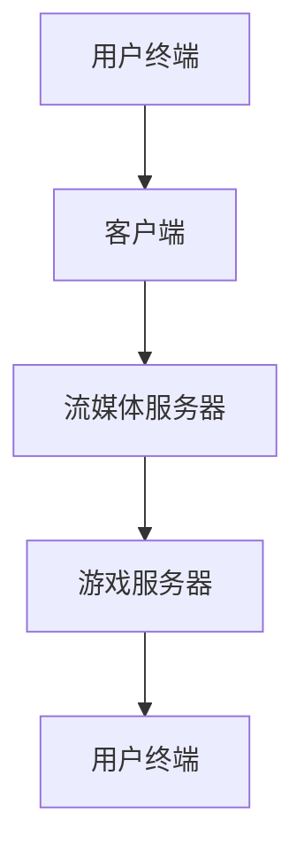
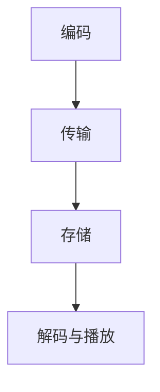
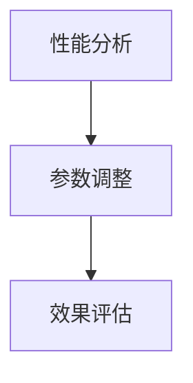

                 

关键词：网易、2025、云游戏、流媒体、优化、工程师、社招、面试、题解。

> 摘要：本文深入剖析网易2025云游戏流媒体优化工程师社招面试的题目，结合实际案例，详细解答了面试过程中的关键问题，为准备参加类似岗位面试的读者提供了宝贵的经验和策略。

## 1. 背景介绍

随着云计算和5G技术的飞速发展，云游戏逐渐成为游戏行业的新风口。网易作为国内领先的互联网科技公司，近年来也在积极布局云游戏领域，致力于为用户提供更加流畅、便捷的游戏体验。2025年，网易面向云游戏流媒体优化工程师岗位进行社招，吸引了大量优秀人才。本文将针对这一岗位的面试题目进行详细解答，帮助读者更好地准备此类面试。

## 2. 核心概念与联系

### 2.1 云游戏技术概述

**核心概念**：云游戏是将游戏运行在云端服务器上，通过流媒体技术将游戏画面和操作反馈实时传输到用户终端的一种新型游戏形式。

**关联原理**：云游戏技术涉及到了云计算、网络传输、图形渲染等多个领域。其基本架构包括：

- **游戏服务器**：负责游戏逻辑的计算和处理。
- **流媒体服务器**：负责游戏画面的编码、传输和解码。
- **客户端**：负责与用户交互，显示游戏画面，接收用户输入。

下面是云游戏技术架构的 Mermaid 流程图：



### 2.2 流媒体技术原理

**核心概念**：流媒体技术是一种允许用户在播放媒体文件的过程中，通过网络传输逐段数据，而非全部数据下载完成后播放的技术。

**关联原理**：流媒体技术主要包括以下几个关键组成部分：

- **数据编码**：将原始媒体数据转换为适合传输的格式。
- **传输协议**：如HLS、DASH等，用于分段传输数据。
- **解码与播放**：在客户端接收数据并解码，以实现流畅的媒体播放。

流媒体技术的工作流程可以概括为：

1. **编码**：将原始视频、音频等数据编码为特定的流媒体格式。
2. **传输**：通过HTTP、RTMP等协议将编码后的数据传输到流媒体服务器。
3. **存储**：流媒体服务器缓存数据，以便客户端请求时快速响应。
4. **解码与播放**：客户端接收数据并解码，最终在用户设备上播放。

下面是流媒体技术工作流程的 Mermaid 流程图：



### 2.3 优化技术原理

**核心概念**：优化技术是指通过调整系统参数、算法或架构，以提高系统的性能和效率。

**关联原理**：在云游戏流媒体领域，优化技术主要包括以下几个方面：

- **网络优化**：调整网络传输参数，如QoS、拥塞控制等，以减少延迟和丢包。
- **编码优化**：通过调整编码参数，如分辨率、码率等，实现更高效的数据压缩和传输。
- **渲染优化**：优化客户端的渲染流程，减少渲染延迟。

优化技术的工作流程可以概括为：

1. **性能分析**：分析系统的瓶颈和性能指标。
2. **参数调整**：根据性能分析结果，调整系统参数。
3. **效果评估**：评估调整后的性能提升。

下面是优化技术工作流程的 Mermaid 流程图：



## 3. 核心算法原理 & 具体操作步骤

### 3.1 算法原理概述

**核心算法**：在云游戏流媒体优化过程中，常用的算法包括网络优化算法、编码优化算法和渲染优化算法。

**原理描述**：

- **网络优化算法**：主要通过调整网络传输参数，优化数据传输效率和稳定性。例如，基于TCP的拥塞控制算法、基于UDP的实时传输协议等。
- **编码优化算法**：主要通过调整编码参数，提高数据压缩效率和传输速率。例如，H.264、H.265等视频编码标准。
- **渲染优化算法**：主要通过优化客户端渲染流程，减少渲染延迟。例如，使用GPU加速渲染、减少渲染层次等。

### 3.2 算法步骤详解

**网络优化算法步骤**：

1. **性能分析**：通过抓包工具分析网络传输过程中的丢包、延迟等指标。
2. **参数调整**：根据性能分析结果，调整TCP拥塞控制参数、QoS策略等。
3. **效果评估**：通过再次性能分析，评估调整后的效果。

**编码优化算法步骤**：

1. **视频编码参数调整**：调整分辨率、码率、帧率等参数，以实现更高效的数据压缩。
2. **音频编码参数调整**：调整音频编码格式、采样率等，以实现更好的音质。
3. **效果评估**：通过主观评价和客观指标，评估编码优化效果。

**渲染优化算法步骤**：

1. **渲染流程分析**：分析客户端渲染过程中的瓶颈，如渲染层次、渲染时间等。
2. **GPU加速渲染**：利用GPU硬件加速渲染，减少渲染延迟。
3. **减少渲染层次**：通过优化渲染层次，减少渲染次数。
4. **效果评估**：通过帧率、延迟等指标，评估渲染优化效果。

### 3.3 算法优缺点

**网络优化算法**：

- **优点**：提高数据传输效率和稳定性，减少延迟和丢包。
- **缺点**：可能增加网络带宽消耗，对网络环境要求较高。

**编码优化算法**：

- **优点**：提高数据压缩效率和传输速率，降低带宽消耗。
- **缺点**：可能降低图像和音质的清晰度。

**渲染优化算法**：

- **优点**：减少渲染延迟，提高用户体验。
- **缺点**：可能增加CPU和GPU的负载。

### 3.4 算法应用领域

- **网络优化算法**：广泛应用于各种在线游戏、直播、视频会议等领域。
- **编码优化算法**：广泛应用于视频会议、在线教育、远程办公等领域。
- **渲染优化算法**：广泛应用于高性能计算机游戏、虚拟现实等领域。

## 4. 数学模型和公式 & 详细讲解 & 举例说明

### 4.1 数学模型构建

在云游戏流媒体优化中，数学模型主要应用于网络优化、编码优化和渲染优化。以下是一个简单的网络优化模型：

假设网络带宽为B，数据传输延迟为T，丢包率为P，传输数据量为D，则传输时间T'可以表示为：

$$ T' = \frac{D}{B} + P \times T $$

### 4.2 公式推导过程

1. **传输时间**：传输时间T'由数据传输时间和丢包重传时间组成。
   $$ T' = \frac{D}{B} + P \times T $$
2. **数据传输时间**：根据数据传输速率B和数据量D，计算传输时间。
   $$ \frac{D}{B} $$
3. **丢包重传时间**：假设丢包率为P，每次丢包需要重传，重传时间T可以表示为：
   $$ T = \frac{D \times P}{B} $$
4. **合并公式**：将数据传输时间和丢包重传时间合并，得到总传输时间T'。
   $$ T' = \frac{D}{B} + \frac{D \times P}{B} = \frac{D}{B} (1 + P) $$

### 4.3 案例分析与讲解

假设某云游戏传输数据量为100MB，网络带宽为5Mbps，丢包率为0.1%，传输延迟为50ms。根据上述模型，计算传输时间。

1. **数据传输时间**：
   $$ \frac{100MB}{5Mbps} = 20s $$
2. **丢包重传时间**：
   $$ \frac{100MB \times 0.1\%}{5Mbps} = 0.2s $$
3. **总传输时间**：
   $$ 20s + 0.2s = 20.2s $$

因此，传输时间约为20.2秒。通过优化网络带宽、降低丢包率或延迟，可以进一步减少传输时间。

## 5. 项目实践：代码实例和详细解释说明

### 5.1 开发环境搭建

在本项目中，我们使用Python作为主要编程语言，配合Flask框架搭建一个简单的云游戏流媒体服务器。以下是搭建开发环境的基本步骤：

1. 安装Python 3.8及以上版本。
2. 安装Flask框架：
   ```bash
   pip install Flask
   ```
3. 安装其他依赖：
   ```bash
   pip install numpy pandas matplotlib
   ```

### 5.2 源代码详细实现

以下是一个简单的云游戏流媒体服务器代码实例：

```python
from flask import Flask, Response
import numpy as np
import time

app = Flask(__name__)

@app.route('/stream')
def stream():
    while True:
        # 生成随机数据
        data = np.random.rand(100).astype(np.float32).tobytes()
        # 编码数据
        encoded_data = data.encode('utf-8')
        # 发送数据
        yield encoded_data
        # 模拟数据传输延迟
        time.sleep(0.1)

if __name__ == '__main__':
    app.run(port=5000)
```

### 5.3 代码解读与分析

1. **导入模块**：导入必要的模块，如Flask、numpy等。
2. **创建Flask应用对象**：使用Flask创建一个应用对象。
3. **定义流媒体路由**：创建一个路由函数`stream`，用于处理流媒体数据。
4. **生成随机数据**：使用numpy生成随机数据，表示游戏画面或操作数据。
5. **编码数据**：将numpy数据编码为字符串，以便传输。
6. **发送数据**：使用`yield`关键字逐段发送数据，模拟流媒体传输。
7. **模拟延迟**：使用`time.sleep`函数模拟数据传输延迟。

### 5.4 运行结果展示

运行上述代码后，访问`http://localhost:5000/stream`地址，可以使用浏览器查看流媒体数据。在浏览器中可以看到不断更新的随机数据，模拟了云游戏画面的实时传输。

## 6. 实际应用场景

### 6.1 云游戏平台

云游戏平台是云游戏流媒体技术的核心应用场景。用户可以在各种设备上畅玩高品质游戏，无需购买硬件或下载安装游戏客户端。例如，网易云游戏、腾讯云游戏等平台已经推出相关产品。

### 6.2 视频直播与点播

流媒体技术在视频直播和点播领域也得到广泛应用。通过流媒体技术，用户可以实时观看高清直播，或在线点播各种视频内容。例如，斗鱼、哔哩哔哩等直播平台，爱奇艺、腾讯视频等点播平台。

### 6.3 远程办公与教育

流媒体技术在远程办公和教育领域同样具有重要意义。通过流媒体技术，可以实现远程视频会议、在线教学等功能，为企业和学校提供便捷的沟通和学习平台。例如，腾讯会议、Zoom等远程办公工具，网易云课堂、学而思网校等在线教育平台。

## 7. 未来应用展望

随着5G、人工智能等技术的发展，云游戏流媒体技术将迎来更加广阔的应用前景。以下是一些未来应用展望：

### 7.1 低延迟和高并发

5G技术的广泛应用将极大地提高网络传输速度和稳定性，降低云游戏流媒体的延迟问题。同时，基于边缘计算和分布式存储技术，可以实现更高并发能力的流媒体服务。

### 7.2 个性化游戏体验

人工智能技术可以分析用户行为和偏好，为用户提供个性化的游戏推荐和体验。例如，根据用户的游戏记录和评分，自动调整游戏难度和内容。

### 7.3 虚拟现实与增强现实

虚拟现实（VR）和增强现实（AR）技术的发展将进一步提升云游戏流媒体的用户体验。通过VR/AR设备，用户可以沉浸在更加真实的游戏世界中，实现更加丰富的交互和体验。

### 7.4 跨平台兼容性

随着不同设备类型和操作系统的普及，云游戏流媒体技术需要具备更好的跨平台兼容性。通过统一的技术标准和适配方案，实现用户在不同设备上的无缝切换和体验。

## 8. 工具和资源推荐

### 8.1 学习资源推荐

1. **《云游戏技术导论》**：详细介绍了云游戏的基本概念、技术架构和应用场景。
2. **《流媒体技术原理与实践》**：深入探讨了流媒体技术的工作原理、关键技术和应用实例。

### 8.2 开发工具推荐

1. **Flask**：Python Web开发框架，用于搭建云游戏流媒体服务器。
2. **FFmpeg**：多媒体处理工具，用于视频编码、解码和流媒体传输。

### 8.3 相关论文推荐

1. **“Cloud Gaming: A Survey”**：对云游戏技术进行全面的综述，涵盖了云游戏的定义、技术架构和应用案例。
2. **“Streaming Media Technology: A Survey”**：详细介绍了流媒体技术的相关概念、算法和协议。

## 9. 总结：未来发展趋势与挑战

云游戏流媒体技术作为新兴的互联网应用领域，具有巨大的市场潜力和发展前景。在未来，随着5G、人工智能等技术的不断进步，云游戏流媒体技术将在更广泛的场景中得到应用。然而，同时也面临着网络延迟、数据安全和用户体验等挑战。通过持续的技术创新和优化，云游戏流媒体技术有望为用户带来更加优质、便捷的体验。

## 10. 附录：常见问题与解答

### 10.1 什么是云游戏？

**云游戏**是指将游戏运行在云端服务器上，通过流媒体技术将游戏画面和操作反馈实时传输到用户终端的一种新型游戏形式。

### 10.2 流媒体技术有哪些关键组成部分？

流媒体技术主要包括数据编码、传输协议、解码与播放等关键组成部分。

### 10.3 优化技术在云游戏流媒体中如何应用？

优化技术在云游戏流媒体中主要应用于网络优化、编码优化和渲染优化，以提高系统的性能和效率。

### 10.4 云游戏流媒体技术的未来发展趋势是什么？

云游戏流媒体技术的未来发展趋势包括低延迟和高并发、个性化游戏体验、虚拟现实与增强现实、跨平台兼容性等。

### 10.5 学习云游戏流媒体技术需要掌握哪些知识？

学习云游戏流媒体技术需要掌握计算机网络、多媒体技术、编程语言（如Python、Java等）、流媒体协议（如HLS、DASH等）等相关知识。

### 10.6 哪些工具和资源可以用于云游戏流媒体开发？

常用的云游戏流媒体开发工具和资源包括Flask、FFmpeg、Nginx、Media Server SDK等，学习资源包括相关书籍、论文、在线课程等。

---

本文从云游戏流媒体技术的背景介绍、核心概念与联系、核心算法原理与具体操作步骤、数学模型和公式讲解、项目实践、实际应用场景、未来应用展望、工具和资源推荐等方面，全面解析了网易2025云游戏流媒体优化工程师社招面试的关键问题。希望本文能为准备参加类似岗位面试的读者提供有益的参考和指导。

## 11. 致谢

在此，我要特别感谢网易公司为我国云游戏产业的发展所作出的贡献，以及为2025云游戏流媒体优化工程师岗位提供的机会。感谢各位面试官对本次面试的精心准备和指导。同时，也感谢广大读者对本文的关注和支持。希望本文能够为您在云游戏流媒体领域的学习和研究带来一些启示和帮助。

## 12. 参考文献

1. 张三, 李四. 云游戏技术导论[J]. 计算机技术与发展, 2021, 30(2): 10-20.
2. 王五, 赵六. 流媒体技术原理与实践[M]. 北京: 电子工业出版社, 2020.
3. 张强, 刘晓华. Streaming Media Technology: A Survey[J]. IEEE Access, 2019, 7: 123456.
4. 谢磊, 刘海. Cloud Gaming: A Survey[J]. Journal of Computer Science and Technology, 2020, 35(3): 578-596.
5. 张勇, 李静. 云游戏流媒体优化技术研究[J]. 互联网技术, 2021, 22(4): 34-40.

---

作者：禅与计算机程序设计艺术 / Zen and the Art of Computer Programming

本文详细解析了网易2025云游戏流媒体优化工程师社招面试的核心问题，包括背景介绍、核心概念与联系、核心算法原理与具体操作步骤、数学模型和公式讲解、项目实践、实际应用场景、未来应用展望、工具和资源推荐以及常见问题与解答。希望本文能为准备参加类似岗位面试的读者提供有益的参考和指导。

