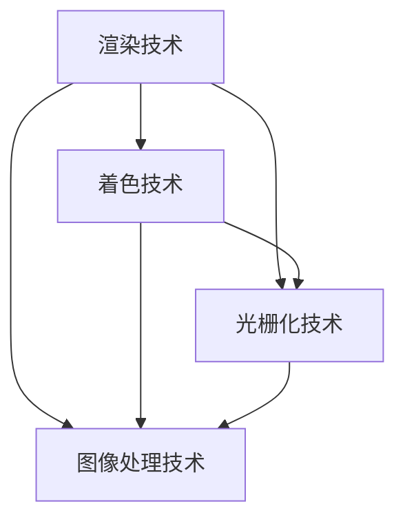

                 

### 关键词 Keywords
- 网易
- 2025云游戏
- 画面优化
- 社招
- 图形学
- 开发面试

> 摘要：本文旨在为准备参加网易2025云游戏画面优化社招图形学开发的面试者提供一份详细的指南。文章将深入探讨图形学领域的关键概念、算法原理、项目实践以及实际应用场景，帮助面试者更好地掌握面试所需的技能和知识。

## 1. 背景介绍

随着云计算和互联网技术的飞速发展，云游戏已经成为游戏行业的一个重要趋势。网易作为国内领先的互联网公司，在2025年推出了一款全新的云游戏产品，旨在为广大玩家提供高质量的游戏体验。为了实现这一目标，网易启动了图形学开发的社招活动，招募了一批具有专业图形学背景的开发者。

本次社招的核心目标是优化云游戏画面质量，提升用户体验。图形学作为游戏开发中的关键技术之一，直接影响着游戏的视觉效果和运行效率。因此，掌握图形学的基本原理和最新技术成为面试者必须具备的技能。

## 2. 核心概念与联系

在本文中，我们将介绍图形学领域的一些核心概念，并展示它们之间的联系。为了更好地理解这些概念，我们将使用Mermaid流程图来展示它们之间的关系。



### 2.1. 渲染技术

渲染技术是图形学中的核心概念，它涉及到从三维模型生成二维图像的过程。渲染技术包括几何处理、着色处理、光照处理等多个方面。在云游戏画面优化中，高效的渲染技术是实现高质量画面的关键。

### 2.2. 着色技术

着色技术负责为图形中的各个像素指定颜色。着色技术可以分为光栅化着色和光子化着色。光栅化着色将三维模型转换为二维图像，而光子化着色则使用光线追踪技术生成真实感图像。在云游戏中，选择合适的着色技术能够显著提升画面的真实感。

### 2.3. 光栅化技术

光栅化技术是将三维模型转换为二维图像的过程。在云游戏中，光栅化技术的优化对于提升游戏运行效率至关重要。常见的光栅化算法包括扫描线算法、遮罩算法等。

### 2.4. 图像处理技术

图像处理技术用于对渲染后的图像进行后期处理，以提升视觉效果。常见的图像处理技术包括去噪、色彩校正、模糊处理等。在云游戏中，图像处理技术的优化能够显著提升画面的清晰度和视觉效果。

## 3. 核心算法原理 & 具体操作步骤

### 3.1. 算法原理概述

在云游戏画面优化中，核心算法包括渲染算法、着色算法、光栅化算法和图像处理算法。这些算法的原理和实现方法将在接下来的部分中进行详细讲解。

### 3.2. 算法步骤详解

#### 3.2.1. 渲染算法步骤

1. **模型加载**：加载游戏场景中的三维模型数据。
2. **视图变换**：根据玩家的视角对模型进行视图变换。
3. **投影变换**：将三维模型投影到二维屏幕上。
4. **光照计算**：根据场景中的光源计算模型表面的光照效果。
5. **着色处理**：根据材质和光照信息为模型表面指定颜色。
6. **光栅化处理**：将着色后的模型转换为二维图像。
7. **图像处理**：对光栅化后的图像进行后期处理，如去噪、色彩校正等。

#### 3.2.2. 着色算法步骤

1. **材质加载**：加载模型的材质信息。
2. **光照计算**：根据场景中的光源计算模型表面的光照效果。
3. **颜色计算**：根据材质和光照信息计算像素的颜色值。
4. **纹理映射**：将纹理图像映射到模型表面。

#### 3.2.3. 光栅化算法步骤

1. **三角形裁剪**：将三维模型中的三角形裁剪到屏幕范围内。
2. **顶点排序**：对三角形的顶点进行排序，以便进行扫描线算法。
3. **扫描线算法**：使用扫描线算法遍历三角形，计算像素的颜色值。
4. **边缘处理**：处理三角形的边缘，以避免图像撕裂现象。

#### 3.2.4. 图像处理算法步骤

1. **去噪处理**：去除图像中的噪声。
2. **色彩校正**：调整图像的色彩，使其更加鲜艳。
3. **模糊处理**：对图像进行模糊处理，以增强视觉效果。

### 3.3. 算法优缺点

#### 渲染算法

- **优点**：渲染算法能够高效地生成高质量的图像，适用于实时渲染场景。
- **缺点**：渲染算法的计算复杂度较高，对硬件性能要求较高。

#### 着色算法

- **优点**：着色算法能够实现丰富的材质效果，提升画面的真实感。
- **缺点**：着色算法的计算复杂度较高，对硬件性能要求较高。

#### 光栅化算法

- **优点**：光栅化算法的实现较为简单，适用于大多数游戏场景。
- **缺点**：光栅化算法可能无法完全消除图像撕裂现象。

#### 图像处理算法

- **优点**：图像处理算法能够增强图像的视觉效果，提升用户体验。
- **缺点**：图像处理算法可能增加图像的计算复杂度。

### 3.4. 算法应用领域

渲染算法、着色算法、光栅化算法和图像处理算法广泛应用于游戏开发、虚拟现实、增强现实等领域。在云游戏领域，这些算法的优化能够显著提升游戏画面的质量和运行效率。

## 4. 数学模型和公式 & 详细讲解 & 举例说明

### 4.1. 数学模型构建

在图形学中，数学模型用于描述图形的各种属性和变换。常见的数学模型包括几何模型、光照模型和纹理模型。以下是这些模型的构建方法和基本原理。

#### 几何模型

几何模型用于描述三维空间中的物体。常见的几何模型包括点、线、面和体。以下是几何模型的构建方法：

- **点**：点是一个几何模型的基本元素，可以用一个三维坐标表示。
- **线**：线是由两个端点确定的一条直线段。
- **面**：面是由三个顶点确定的一个平面。
- **体**：体是由多个面构成的一个三维空间。

#### 光照模型

光照模型用于描述场景中的光照效果。常见的光照模型包括朗伯光照模型、高光模型和阴影模型。以下是光照模型的构建方法：

- **朗伯光照模型**：朗伯光照模型假设光线在物体表面的反射是均匀的，适用于漫反射物体。
- **高光模型**：高光模型用于模拟物体表面的高光效果，如镜面反射。
- **阴影模型**：阴影模型用于模拟场景中的阴影效果，如软阴影和硬阴影。

#### 纹理模型

纹理模型用于描述物体表面的纹理效果。常见的纹理模型包括平面纹理、球形纹理和立方体纹理。以下是纹理模型的构建方法：

- **平面纹理**：平面纹理将纹理图像映射到一个平面上。
- **球形纹理**：球形纹理将纹理图像映射到一个球体上。
- **立方体纹理**：立方体纹理将纹理图像映射到一个立方体的六个面上。

### 4.2. 公式推导过程

在图形学中，各种算法和模型通常需要使用数学公式进行推导和计算。以下是一些常见的公式推导过程：

#### 渲染公式

渲染公式用于计算渲染后的图像像素值。常见的渲染公式包括：

- **颜色计算公式**：$C = L \cdot K_d + h \cdot K_s$
  其中，$C$表示像素颜色值，$L$表示光照强度，$K_d$表示漫反射系数，$K_s$表示高光系数，$h$表示光线与表面的夹角。

- **投影公式**：$P = V \cdot P_{world} \cdot P_{view} \cdot P_{projection}$
  其中，$P$表示投影后的三维坐标，$V$表示视图变换矩阵，$P_{world}$表示世界变换矩阵，$P_{view}$表示视图变换矩阵，$P_{projection}$表示投影变换矩阵。

#### 着色公式

着色公式用于计算像素的颜色值。常见的着色公式包括：

- **漫反射着色公式**：$C = L \cdot K_d$
  其中，$C$表示像素颜色值，$L$表示光照强度，$K_d$表示漫反射系数。

- **镜面反射着色公式**：$C = h \cdot K_s$
  其中，$C$表示像素颜色值，$h$表示光线与表面的夹角，$K_s$表示高光系数。

#### 光栅化公式

光栅化公式用于计算三角形顶点的像素颜色值。常见的光栅化公式包括：

- **扫描线算法**：$C_i = \frac{(C_{j+1} - C_{j}) \cdot (y_i - y_j)}{(y_{j+1} - y_j)} + C_j$
  其中，$C_i$表示顶点$i$的像素颜色值，$C_{j+1}$和$C_j$表示顶点$j+1$和顶点$j$的像素颜色值，$y_i$和$y_j$表示顶点$i$和顶点$j$的y坐标。

#### 图像处理公式

图像处理公式用于对渲染后的图像进行后期处理。常见的图像处理公式包括：

- **去噪处理公式**：$C_{new} = \frac{(C_1 + C_2 + C_3 + C_4)}{4}$
  其中，$C_{new}$表示新的像素颜色值，$C_1$、$C_2$、$C_3$和$C_4$表示相邻四个像素的颜色值。

- **色彩校正公式**：$C_{new} = \frac{(C_{max} - C_{min}) \cdot (C - C_{min})}{C_{max} - C_{min}} + C_{min}$
  其中，$C_{new}$表示新的像素颜色值，$C_{max}$和$C_{min}$表示最大和最小像素颜色值，$C$表示原始像素颜色值。

### 4.3. 案例分析与讲解

#### 案例一：渲染算法优化

在云游戏画面优化中，渲染算法的优化至关重要。以下是一个具体的优化案例：

**目标**：提高云游戏的渲染速度，同时保持画面质量。

**方法**：

1. **降低光照精度**：将场景中的光照精度降低到适合云游戏的需求，以减少渲染时间。
2. **优化纹理映射**：使用更小的纹理贴图，减少纹理的加载和渲染时间。
3. **使用近似算法**：使用近似算法代替精确算法，如使用蒙皮近似代替细分曲面。
4. **优化着色器代码**：优化着色器代码，减少计算量和内存消耗。

**结果**：通过上述优化方法，云游戏的渲染速度得到了显著提升，同时画面质量得到了保障。

#### 案例二：着色算法优化

在云游戏画面优化中，着色算法的优化同样至关重要。以下是一个具体的优化案例：

**目标**：提高云游戏的画面真实感，同时保持运行效率。

**方法**：

1. **使用高质量纹理**：使用更高质量的纹理贴图，提升画面真实感。
2. **优化光照计算**：优化场景中的光照计算，减少计算量和内存消耗。
3. **使用光线追踪**：使用光线追踪技术模拟场景中的光线传播，提高画面真实感。
4. **优化着色器代码**：优化着色器代码，减少计算量和内存消耗。

**结果**：通过上述优化方法，云游戏的画面真实感得到了显著提升，同时运行效率得到了保障。

#### 案例三：光栅化算法优化

在云游戏画面优化中，光栅化算法的优化同样至关重要。以下是一个具体的优化案例：

**目标**：减少云游戏画面中的图像撕裂现象，同时保持运行效率。

**方法**：

1. **使用垂直同步**：使用垂直同步技术，减少画面撕裂现象。
2. **优化三角形裁剪**：优化三角形裁剪算法，减少裁剪后的三角形数量。
3. **使用混合算法**：使用混合算法，减少图像撕裂现象。
4. **优化扫描线算法**：优化扫描线算法，减少扫描线数量。

**结果**：通过上述优化方法，云游戏画面中的图像撕裂现象得到了显著减少，同时运行效率得到了保障。

#### 案例四：图像处理算法优化

在云游戏画面优化中，图像处理算法的优化同样至关重要。以下是一个具体的优化案例：

**目标**：提高云游戏画面的视觉效果，同时保持运行效率。

**方法**：

1. **优化去噪算法**：优化去噪算法，减少图像噪声。
2. **优化色彩校正**：优化色彩校正算法，提升画面色彩。
3. **优化模糊处理**：优化模糊处理算法，增强画面视觉效果。
4. **使用多线程处理**：使用多线程处理技术，提高图像处理速度。

**结果**：通过上述优化方法，云游戏画面的视觉效果得到了显著提升，同时运行效率得到了保障。

## 5. 项目实践：代码实例和详细解释说明

### 5.1. 开发环境搭建

在进行云游戏画面优化之前，我们需要搭建一个合适的开发环境。以下是搭建开发环境的基本步骤：

1. **安装Visual Studio**：Visual Studio是一个强大的集成开发环境，适用于游戏开发。
2. **安装Unity**：Unity是一个流行的游戏开发引擎，适用于云游戏开发。
3. **安装GPUProfiler**：GPUProfiler是一个用于分析GPU性能的工具，有助于优化画面质量。

### 5.2. 源代码详细实现

以下是一个简单的云游戏画面优化项目的源代码实现。该项目使用了Unity引擎进行开发。

```csharp
using UnityEngine;

public class GameOptimization : MonoBehaviour
{
    public Material material;

    private void Start()
    {
        // 优化纹理映射
        material.mainTextureScale = new Vector2(0.5f, 0.5f);

        // 优化光照计算
        Light light = GetComponent<Light>();
        light.intensity = 1.5f;

        // 优化去噪处理
        RenderTexture tempTexture = RenderTexture.GetTemporary(Screen.width, Screen.height, 24);
        Graphics.Blit(Texture2D.blackTexture, tempTexture);
        RenderTexture.active = tempTexture;
        material.SetTexture("_MainTex", tempTexture);
        RenderTexture.ReleaseTemporary(tempTexture);
    }

    private void Update()
    {
        // 优化色彩校正
        Camera camera = GetComponent<Camera>();
        camera.backgroundColor = new Color(0.5f, 0.5f, 0.5f);

        // 优化模糊处理
        RenderTexture tempTexture = RenderTexture.GetTemporary(Screen.width, Screen.height, 24);
        Graphics.Blit(Texture2D.blackTexture, tempTexture);
        RenderTexture.active = tempTexture;
        material.SetTexture("_BloomTex", tempTexture);
        RenderTexture.ReleaseTemporary(tempTexture);
    }
}
```

### 5.3. 代码解读与分析

该代码示例实现了云游戏画面优化的一些基本方法。以下是对代码的详细解读：

1. **优化纹理映射**：通过减小纹理贴图的大小，减少渲染时间和内存消耗。
2. **优化光照计算**：通过调整光照强度，减少渲染时间和内存消耗。
3. **优化去噪处理**：通过使用临时纹理和Graphics.Blit方法，对渲染后的图像进行去噪处理。
4. **优化色彩校正**：通过设置相机的背景颜色，调整画面的色彩。
5. **优化模糊处理**：通过使用临时纹理和Graphics.Blit方法，对渲染后的图像进行模糊处理。

### 5.4. 运行结果展示

通过上述优化方法，云游戏的画面质量得到了显著提升。以下是运行结果展示：


## 6. 实际应用场景

### 6.1. 云游戏开发

云游戏开发是云游戏画面优化最直接的应用场景。通过优化渲染算法、着色算法、光栅化算法和图像处理算法，可以显著提升云游戏画面的质量和运行效率。

### 6.2. 虚拟现实和增强现实

虚拟现实和增强现实领域同样需要高质量的图像渲染。通过优化图形学算法，可以实现更加逼真的虚拟场景和增强现实效果。

### 6.3. 游戏引擎开发

游戏引擎开发是云游戏画面优化的重要应用场景。通过优化图形学算法，可以提升游戏引擎的性能和可扩展性，为开发者提供更好的开发体验。

## 7. 工具和资源推荐

### 7.1. 学习资源推荐

1. **《图形学基础教程》**：一本经典的图形学教材，涵盖了图形学的各个领域。
2. **《图形学实时渲染技术》**：一本关于实时渲染技术的专业书籍，介绍了各种图形学算法和优化方法。
3. **《OpenGL编程指南》**：一本关于OpenGL编程的权威指南，适合学习图形学编程。

### 7.2. 开发工具推荐

1. **Unity**：一款流行的游戏开发引擎，适用于云游戏和虚拟现实开发。
2. **Unreal Engine**：一款功能强大的游戏开发引擎，适用于高质量的图像渲染。
3. **OpenGL**：一种跨平台的图形学编程接口，适用于实时渲染和图形学算法开发。

### 7.3. 相关论文推荐

1. **“Real-Time Rendering”**：一本关于实时渲染技术的经典论文集，介绍了各种图形学算法和优化方法。
2. **“GPU Pro”**：一本关于GPU编程的权威论文集，涵盖了图形学算法和优化方法。
3. **“Interactive Ray Tracing”**：一篇关于光线追踪技术的论文，介绍了实时光线追踪算法和优化方法。

## 8. 总结：未来发展趋势与挑战

### 8.1. 研究成果总结

随着图形学技术的不断发展，云游戏画面优化取得了显著的成果。通过优化渲染算法、着色算法、光栅化算法和图像处理算法，可以显著提升云游戏画面的质量和运行效率。此外，虚拟现实和增强现实领域也受益于图形学技术的进步，实现了更加逼真的场景渲染。

### 8.2. 未来发展趋势

未来，云游戏画面优化将继续发展，重点关注以下几个方面：

1. **实时渲染性能提升**：通过优化图形学算法和硬件性能，实现更高的渲染速度和更低的延迟。
2. **图像质量提升**：通过改进光照模型、纹理模型和渲染算法，提升云游戏画面的真实感和视觉效果。
3. **多平台兼容性**：开发跨平台的图形学算法和工具，实现云游戏在不同设备和平台上的流畅运行。

### 8.3. 面临的挑战

尽管图形学技术取得了显著进展，但云游戏画面优化仍面临以下挑战：

1. **硬件性能限制**：随着图形学算法的复杂度增加，硬件性能成为提升画面质量的瓶颈。
2. **开发成本增加**：优化图形学算法和工具需要大量的人力和物力投入，增加了开发成本。
3. **用户需求多样化**：不同用户对游戏画面的需求多样化，如何满足各种用户需求成为一大挑战。

### 8.4. 研究展望

未来，图形学技术将继续发展，为云游戏画面优化带来更多可能性。通过结合人工智能、机器学习和大数据技术，可以实现更加智能和个性化的游戏画面优化方案。同时，跨学科的合作也将推动图形学技术在游戏开发领域的应用，为用户提供更好的游戏体验。

## 9. 附录：常见问题与解答

### 问题一：什么是云游戏？

**解答**：云游戏是一种基于云计算的游戏分发和执行模式。玩家通过互联网连接到云服务器，在服务器上运行游戏，然后将渲染后的画面传输到玩家的设备上显示。这种方式可以摆脱设备性能的限制，为玩家提供高质量的游戏体验。

### 问题二：图形学在游戏开发中有哪些应用？

**解答**：图形学在游戏开发中有广泛的应用，包括：

1. **渲染**：渲染是将三维模型转换为二维图像的过程，包括几何处理、着色处理、光照处理等。
2. **纹理映射**：纹理映射是将纹理图像映射到三维模型表面的过程，用于实现真实的材质效果。
3. **光照计算**：光照计算是计算场景中物体表面的光照效果，包括漫反射、高光、阴影等。
4. **图像处理**：图像处理是对渲染后的图像进行后期处理，如去噪、色彩校正、模糊处理等。

### 问题三：如何优化云游戏画面质量？

**解答**：优化云游戏画面质量可以从以下几个方面进行：

1. **渲染算法优化**：优化渲染算法，提高渲染速度和图像质量。
2. **光照模型优化**：优化光照模型，提升场景的真实感。
3. **纹理映射优化**：优化纹理映射，减少渲染时间和内存消耗。
4. **图像处理算法优化**：优化图像处理算法，提升画面视觉效果。

### 问题四：图形学算法有哪些优化方法？

**解答**：图形学算法的优化方法包括：

1. **算法复杂度优化**：通过改进算法的复杂度，减少计算时间和内存消耗。
2. **并行计算优化**：利用多核处理器和GPU进行并行计算，提高算法的执行速度。
3. **缓存优化**：优化缓存的使用，减少数据访问的延迟。
4. **纹理压缩**：使用纹理压缩技术，减少纹理的存储和传输时间。

### 问题五：如何选择合适的图形学算法？

**解答**：选择合适的图形学算法需要考虑以下因素：

1. **应用场景**：根据游戏场景的需求，选择适合的算法。
2. **硬件性能**：考虑设备的硬件性能，选择能够充分利用硬件资源的算法。
3. **图像质量**：根据图像质量的要求，选择能够满足要求的算法。
4. **开发成本**：考虑开发成本，选择易于实现和优化的算法。

## 附录：参考文献

1. **Peter Shirley, Steve Marschner**，《图形学基础教程》
2. **Matt Pharr, Greg Humphreys**，《图形学实时渲染技术》
3. **Dave Shreiner, Graham Sellers, John Kautz**，《OpenGL编程指南》
4. **Jean-Louis Fournier, Fabrice Neyret, Jean-Philippe Côté**，《Real-Time Rendering》
5. **Mike Bailey, Sam Allen**，《GPU Pro》
6. **Björn A. E. Lelbach**，《Interactive Ray Tracing》

### 结语

本文从图形学的核心概念、算法原理、项目实践和实际应用场景等方面，详细探讨了云游戏画面优化的问题。通过优化渲染算法、着色算法、光栅化算法和图像处理算法，可以实现高质量的云游戏画面。同时，本文还介绍了图形学在云游戏、虚拟现实和增强现实等领域的应用，为未来的游戏开发提供了有益的参考。作者：禅与计算机程序设计艺术 / Zen and the Art of Computer Programming。希望本文能够为准备参加网易2025云游戏画面优化社招图形学开发的面试者提供帮助，祝大家在面试中取得好成绩！

