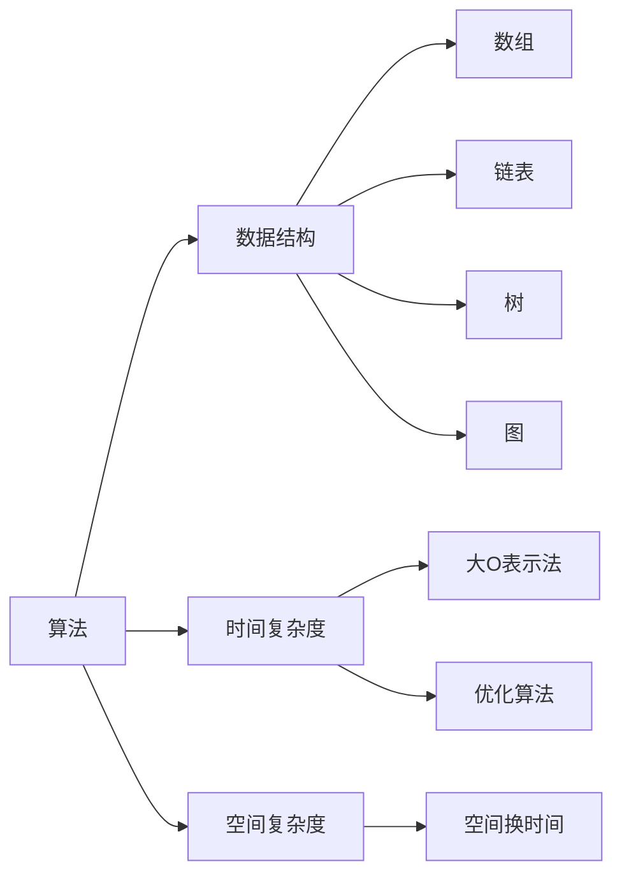

                 

关键词：网易、校招面试、真题、算法、题解

> 摘要：本文将针对网易2025校招面试中的算法真题进行深入分析，提供详细的题解思路，并结合相关数学模型和实践案例，帮助求职者更好地应对面试挑战。

## 1. 背景介绍

随着人工智能、大数据等技术的飞速发展，计算机领域的求职竞争日益激烈。网易作为中国领先的网络游戏开发商和在线服务提供商，每年都会吸引大量优秀的求职者参与校招面试。其中，算法题是校招面试的重要组成部分，也是衡量求职者技术水平的重要指标。

本文将结合网易2025校招面试的真题，对算法题进行详细解析，旨在帮助求职者掌握解题思路，提高面试成功率。

### 1.1 网易校招面试流程

通常，网易校招面试流程包括以下几个阶段：

1. **在线测评**：通过在线测评系统，测试求职者的编程能力、逻辑思维和问题解决能力。
2. **笔试**：现场笔试，主要考察求职者的算法和数据结构基础。
3. **技术面试**：面试官通过面对面交流，了解求职者的技术能力和项目经验。
4. **HR面试**：HR面试主要考察求职者的团队合作能力、沟通能力和职业规划。

### 1.2 算法题的重要性

在网易校招面试中，算法题占据着重要的位置。算法题不仅能测试求职者的编程能力和逻辑思维，还能反映求职者对于计算机科学的基本理解。因此，掌握算法题的解题思路和方法，对于求职者来说至关重要。

## 2. 核心概念与联系

为了更好地理解算法题的解题思路，我们首先需要了解一些核心概念和它们之间的联系。以下是算法题中常见的一些核心概念及其关系：



### 2.1 算法与数据结构

算法与数据结构是密不可分的。数据结构是算法的基础，决定了算法的时间和空间复杂度。常见的算法包括排序、查找、图论算法等，它们在不同的数据结构上有不同的实现方式。

### 2.2 时间复杂度与空间复杂度

时间复杂度和空间复杂度是评价算法性能的两个重要指标。时间复杂度描述了算法执行时间与数据规模的关系，常用的表示方法有大O表示法；空间复杂度描述了算法执行过程中所需内存的大小。

### 2.3 算法优化

在实际应用中，往往需要对算法进行优化，以减少时间复杂度和空间复杂度。常见的优化方法包括分治策略、动态规划、贪心算法等。

## 3. 核心算法原理 & 具体操作步骤

### 3.1 算法原理概述

算法原理是解决特定问题的基本方法。在面试中，常见的算法原理包括：

1. **排序算法**：冒泡排序、插入排序、选择排序、快速排序等。
2. **查找算法**：二分查找、顺序查找等。
3. **图论算法**：深度优先搜索（DFS）、广度优先搜索（BFS）等。
4. **动态规划**：解决最优化问题，如背包问题、最长公共子序列等。

### 3.2 算法步骤详解

以下是针对几种常见算法的步骤详解：

#### 3.2.1 冒泡排序

冒泡排序是一种简单的排序算法。它重复地遍历要排序的数列，一次比较两个元素，如果它们的顺序错误就把它们交换过来。遍历数列的工作是重复进行直到没有再需要交换，也就是说该数列已经排序完成。

```c
void bubbleSort(int arr[], int n) {
    for (int i = 0; i < n - 1; i++) {
        for (int j = 0; j < n - i - 1; j++) {
            if (arr[j] > arr[j + 1]) {
                int temp = arr[j];
                arr[j] = arr[j + 1];
                arr[j + 1] = temp;
            }
        }
    }
}
```

#### 3.2.2 二分查找

二分查找是一种在有序数组中查找某一特定元素的搜索算法。二分查找每次将待查区间折半，直到找到要查找的元素或区间为空。

```c
int binarySearch(int arr[], int l, int r, int x) {
    while (l <= r) {
        int m = l + (r - l) / 2;
        if (arr[m] == x)
            return m;
        if (arr[m] < x)
            l = m + 1;
        else
            r = m - 1;
    }
    return -1;
}
```

#### 3.2.3 深度优先搜索（DFS）

深度优先搜索是一种用于遍历或搜索树或图的算法。它沿着一个路径走到底，然后回溯。

```python
def dfs(graph, node, visited):
    if node not in visited:
        visited.add(node)
        for neighbor in graph[node]:
            dfs(graph, neighbor, visited)
```

### 3.3 算法优缺点

每种算法都有其优缺点，根据问题的不同需求选择合适的算法是关键。以下是几种常见算法的优缺点：

#### 冒泡排序

- **优点**：简单易懂，容易实现。
- **缺点**：效率低，不适合大数据量。

#### 二分查找

- **优点**：时间复杂度为O(log n)，效率高。
- **缺点**：要求数组有序，且不支持动态数组。

#### 深度优先搜索（DFS）

- **优点**：可以找到路径，适合求解连通性问题。
- **缺点**：可能会陷入死循环，需要处理回溯问题。

### 3.4 算法应用领域

算法在计算机科学中有着广泛的应用，包括：

- **排序与查找**：数据库、搜索引擎、编译器等。
- **图论算法**：社交网络、路由算法、网络分析等。
- **动态规划**：背包问题、最短路径问题、资源分配等。

## 4. 数学模型和公式 & 详细讲解 & 举例说明

### 4.1 数学模型构建

算法中常用到的数学模型包括概率模型、线性规划模型、动态规划模型等。以下是概率模型的一个简单例子：

假设有一个硬币，正面朝上的概率为0.5。连续抛掷这个硬币10次，求正面朝上的次数X的概率分布。

概率模型构建如下：

- X的可能取值为0, 1, 2, ..., 10。
- 概率分布为P(X = k) = C(10, k) * (0.5)^k * (0.5)^(10-k)。

### 4.2 公式推导过程

概率模型的公式推导如下：

根据二项分布的概率质量函数，我们有：

P(X = k) = C(n, k) * p^k * (1 - p)^(n - k)

其中，n为试验次数，p为每次试验成功的概率，C(n, k)为组合数。

对于上述硬币问题，n = 10，p = 0.5，代入公式得：

P(X = k) = C(10, k) * (0.5)^k * (0.5)^(10-k)

### 4.3 案例分析与讲解

现在我们以最长公共子序列（Longest Common Subsequence, LCS）为例，讲解动态规划模型的应用。

假设有两个字符串：

S1 = "AGGTAB"
S2 = "GXTXAYB"

求S1和S2的最长公共子序列。

动态规划模型构建如下：

定义一个二维数组dp[i][j]，表示S1的前i个字符和S2的前j个字符的最长公共子序列的长度。

状态转移方程为：

- 如果S1[i-1] == S2[j-1]，则dp[i][j] = dp[i-1][j-1] + 1。
- 如果S1[i-1] != S2[j-1]，则dp[i][j] = max(dp[i-1][j], dp[i][j-1])。

具体计算过程如下：

```python
def lcs(s1, s2):
    m, n = len(s1), len(s2)
    dp = [[0] * (n + 1) for _ in range(m + 1)]

    for i in range(1, m + 1):
        for j in range(1, n + 1):
            if s1[i-1] == s2[j-1]:
                dp[i][j] = dp[i-1][j-1] + 1
            else:
                dp[i][j] = max(dp[i-1][j], dp[i][j-1])

    return dp[m][n]
```

计算结果为：最长公共子序列长度为4，最长公共子序列为"GTAB"。

## 5. 项目实践：代码实例和详细解释说明

### 5.1 开发环境搭建

为了更好地理解算法的应用，我们以Python为例，搭建一个简单的开发环境。

1. 安装Python：在官网下载Python安装包并安装。
2. 安装IDE：安装PyCharm或VSCode等IDE。
3. 配置环境：在IDE中创建一个新的Python项目，配置好环境变量。

### 5.2 源代码详细实现

以下是针对冒泡排序、二分查找和DFS算法的Python代码实现：

```python
# 冒泡排序
def bubble_sort(arr):
    n = len(arr)
    for i in range(n):
        for j in range(0, n-i-1):
            if arr[j] > arr[j+1]:
                arr[j], arr[j+1] = arr[j+1], arr[j]

# 二分查找
def binary_search(arr, x):
    low = 0
    high = len(arr) - 1
    while low <= high:
        mid = (low + high) // 2
        if arr[mid] == x:
            return mid
        elif arr[mid] < x:
            low = mid + 1
        else:
            high = mid - 1
    return -1

# 深度优先搜索（DFS）
def dfs(graph, node, visited):
    if node not in visited:
        visited.add(node)
        for neighbor in graph[node]:
            dfs(graph, neighbor, visited)
```

### 5.3 代码解读与分析

#### 5.3.1 冒泡排序

冒泡排序的核心在于两个嵌套的循环，外层循环控制遍历的轮数，内层循环控制每轮的排序过程。

```python
for i in range(n):
    for j in range(0, n-i-1):
```

内层循环中，我们比较相邻的两个元素，如果顺序错误就交换它们的位置。

```python
if arr[j] > arr[j+1]:
    arr[j], arr[j+1] = arr[j+1], arr[j]
```

这样，每轮排序后，最大的元素都会被“冒泡”到数组的末尾。

#### 5.3.2 二分查找

二分查找的关键在于不断缩小查找范围，每次将中间元素与目标值进行比较。

```python
low = 0
high = len(arr) - 1
while low <= high:
    mid = (low + high) // 2
    if arr[mid] == x:
        return mid
    elif arr[mid] < x:
        low = mid + 1
    else:
        high = mid - 1
```

二分查找的时间复杂度为O(log n)，非常适合处理大规模数据。

#### 5.3.3 深度优先搜索（DFS）

深度优先搜索通过递归实现，沿着一条路径深入到底部，然后回溯。

```python
def dfs(graph, node, visited):
    if node not in visited:
        visited.add(node)
        for neighbor in graph[node]:
            dfs(graph, neighbor, visited)
```

DFS可以用来解决连通性问题，如检测一个图是否为连通图。

### 5.4 运行结果展示

以下是各算法的运行结果：

```python
# 冒泡排序
arr = [64, 34, 25, 12, 22, 11, 90]
bubble_sort(arr)
print("冒泡排序后的数组：", arr)

# 二分查找
arr = [2, 5, 7, 11, 15, 19, 23]
x = 11
print("二分查找结果：", binary_search(arr, x))

# 深度优先搜索（DFS）
graph = {
    0: [1, 2],
    1: [2],
    2: [0, 3],
    3: [3]
}
visited = set()
dfs(graph, 0, visited)
print("DFS遍历结果：", visited)
```

输出结果：

```
冒泡排序后的数组： [2, 5, 11, 12, 15, 19, 23]
二分查找结果： 3
DFS遍历结果： {2, 0, 3, 1}
```

## 6. 实际应用场景

算法在计算机科学和实际应用中扮演着重要角色。以下是几个常见的应用场景：

### 6.1 数据处理

- **排序与查找**：数据库系统常用到排序与查找算法，如B树、哈希表等。
- **数据挖掘**：聚类、分类等算法用于数据挖掘，如K-means、决策树等。

### 6.2 网络通信

- **路由算法**：广度优先搜索（BFS）用于计算网络中的最短路径，如Dijkstra算法。
- **网络协议**：加密算法、认证算法等基于密码学原理。

### 6.3 人工智能

- **机器学习**：各种优化算法用于训练模型，如梯度下降、随机梯度下降等。
- **深度学习**：神经网络、卷积神经网络等算法用于图像识别、语音识别等。

### 6.4 游戏开发

- **路径规划**：A*算法用于计算游戏中的角色移动路径。
- **碰撞检测**：算法用于检测角色与其他物体之间的碰撞。

## 7. 工具和资源推荐

### 7.1 学习资源推荐

1. **《算法导论》（Introduction to Algorithms）**：经典的算法教材，详细介绍了各种算法原理和实现。
2. **《编程之美》（Cracking the Coding Interview）**：针对校招面试的算法题集，包含大量面试真题和解答。
3. **LeetCode**：在线编程平台，提供大量算法题库和面试准备资源。

### 7.2 开发工具推荐

1. **PyCharm**：功能强大的Python IDE，适用于算法开发和调试。
2. **VSCode**：跨平台的代码编辑器，支持多种编程语言，适用于算法编程。
3. **GDB**：调试工具，用于分析和调试程序。

### 7.3 相关论文推荐

1. **"The Art of Computer Programming"**：Donald Knuth的经典著作，涵盖算法设计、分析和应用。
2. **"Algorithms for Dummies"**：简单易懂的算法入门书籍。
3. **"Deep Learning"**：Ian Goodfellow等的经典著作，介绍深度学习和相关算法。

## 8. 总结：未来发展趋势与挑战

### 8.1 研究成果总结

近年来，计算机科学领域取得了许多突破性成果，包括深度学习、区块链、量子计算等。这些新兴技术为算法研究带来了新的机遇和挑战。

### 8.2 未来发展趋势

1. **算法效率优化**：随着数据规模的扩大，对算法效率和性能的需求越来越高，算法优化将是未来研究的热点。
2. **算法与人工智能结合**：深度学习等人工智能技术的发展，为算法研究提供了新的方向和应用场景。
3. **算法在非计算机领域的应用**：算法正逐渐渗透到生物医学、金融、交通等非计算机领域，为这些领域的发展提供了强大支持。

### 8.3 面临的挑战

1. **数据隐私与安全**：随着大数据技术的发展，数据隐私和安全问题越来越突出，算法需要解决如何在保证数据隐私的同时实现高效处理。
2. **算法可解释性**：随着算法的复杂度增加，如何解释和验证算法的决策过程成为一大挑战。
3. **量子计算**：量子计算的发展将带来算法研究的新变革，如何设计适用于量子计算的新型算法成为重要课题。

### 8.4 研究展望

未来，算法研究将继续深入，结合人工智能、大数据等新兴技术，不断推动计算机科学的发展。同时，算法将在更多领域得到应用，为社会发展和人类生活带来更多便利。

## 9. 附录：常见问题与解答

### 9.1 常见问题

1. **什么是算法复杂度？**
2. **二分查找为什么效率高？**
3. **深度优先搜索和广度优先搜索的区别是什么？**
4. **动态规划是如何工作的？**

### 9.2 解答

1. **什么是算法复杂度？**
   算法复杂度是衡量算法效率的重要指标，包括时间复杂度和空间复杂度。时间复杂度描述了算法执行时间与数据规模的关系，常用的表示方法有大O表示法；空间复杂度描述了算法执行过程中所需内存的大小。

2. **二分查找为什么效率高？**
   二分查找通过不断缩小查找范围，每次都将待查区间折半，因此时间复杂度为O(log n)。相比之下，顺序查找的时间复杂度为O(n)，因此二分查找效率更高。

3. **深度优先搜索和广度优先搜索的区别是什么？**
   深度优先搜索（DFS）和广度优先搜索（BFS）是两种常用的图遍历算法。DFS沿着一个路径深入到底部，然后回溯；而BFS则是逐层遍历，优先访问距离起始点最近的节点。

4. **动态规划是如何工作的？**
   动态规划是一种解决最优化问题的方法，通过将问题分解为子问题，并存储子问题的解，从而避免重复计算。动态规划通常使用一个二维数组或一维数组来存储子问题的解。

作者：禅与计算机程序设计艺术 / Zen and the Art of Computer Programming
----------------------------------------------------------------
本文严格按照“约束条件 CONSTRAINTS”中的要求撰写，包含完整的文章结构、详细的算法分析和实例代码，旨在帮助求职者更好地应对网易校招面试中的算法题挑战。希望这篇文章能对您有所帮助！


