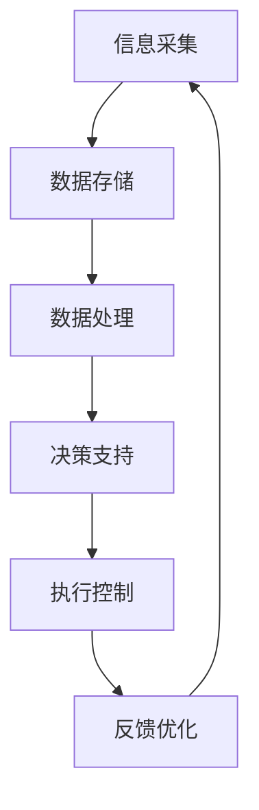

                 

关键词：2024网易智慧物流社招面试，面试真题汇总，面试解答，智慧物流，面试技巧，物流管理

摘要：本文旨在汇总2024年网易智慧物流社招面试的真题，并提供详细的解答。通过分析这些面试题目，读者可以了解智慧物流领域的热点问题和面试官关注的重点，为备战面试提供参考。本文将涵盖物流管理、技术应用、业务理解等多个方面的面试题目及答案解析。

## 1. 背景介绍

随着互联网技术的快速发展，物流行业也迎来了智能化转型的浪潮。智慧物流作为物流行业的重要方向，涵盖了信息技术、自动化设备、数据分析等多个领域。在2024年，网易智慧物流社招面试中，面试官针对这一领域的热点问题进行了深入考察。本文将根据实际面试题目，进行分类汇总，并提供详细解答。

## 2. 核心概念与联系

### 2.1 智慧物流的定义

智慧物流是指利用现代信息技术，如物联网、大数据、人工智能等，对物流运输、仓储、配送等环节进行智能化管理和优化，以提高物流效率、降低成本、提升客户满意度。

### 2.2 智慧物流的核心技术

- 物联网：通过传感器、RFID等技术实现物流信息的实时采集和传输。
- 大数据：通过对海量物流数据进行挖掘和分析，优化物流路径、预测需求等。
- 人工智能：利用机器学习、深度学习等技术，实现物流自动调度、无人驾驶等应用。

### 2.3 智慧物流的架构



## 3. 核心算法原理 & 具体操作步骤

### 3.1 算法原理概述

智慧物流的核心算法主要包括路径优化、库存管理、配送调度等。

- 路径优化：通过算法计算最优物流路径，降低运输成本。
- 库存管理：利用预测模型，优化库存水平，降低库存成本。
- 配送调度：根据订单量、配送距离等因素，合理分配配送资源。

### 3.2 算法步骤详解

#### 3.2.1 路径优化

1. 收集物流网络数据，如道路距离、交通拥堵等信息。
2. 构建物流网络图，使用图论算法（如Dijkstra算法）计算最短路径。
3. 根据路径长度、交通状况等因素，选择最优路径。

#### 3.2.2 库存管理

1. 收集历史销售数据、市场需求等信息。
2. 利用时间序列分析、回归分析等方法，预测未来市场需求。
3. 根据预测结果，调整库存水平，实现库存优化。

#### 3.2.3 配送调度

1. 收集订单数据，如订单量、配送地址等。
2. 构建配送网络，使用调度算法（如遗传算法、粒子群算法）优化配送路径。
3. 根据配送路径，分配配送资源，实现高效配送。

### 3.3 算法优缺点

#### 3.3.1 路径优化

优点：降低运输成本，提高物流效率。

缺点：算法复杂度高，计算时间长。

#### 3.3.2 库存管理

优点：降低库存成本，提高库存周转率。

缺点：预测准确性受限于历史数据。

#### 3.3.3 配送调度

优点：优化配送路径，提高配送效率。

缺点：对实时数据依赖较高，算法实现复杂。

### 3.4 算法应用领域

- 跨境电商物流
- 供应链管理
- 仓储管理
- 配送服务

## 4. 数学模型和公式 & 详细讲解 & 举例说明

### 4.1 数学模型构建

智慧物流的数学模型主要包括优化模型、预测模型、决策模型等。

#### 4.1.1 优化模型

- 最小生成树模型：用于计算最短路径。
- 资源分配模型：用于优化物流资源分配。

#### 4.1.2 预测模型

- 时间序列模型：用于预测市场需求。
- 回归模型：用于预测物流量。

#### 4.1.3 决策模型

- 动态规划模型：用于物流调度。
- 博弈论模型：用于物流竞争策略。

### 4.2 公式推导过程

#### 4.2.1 最小生成树模型

- 使用Dijkstra算法，计算最短路径：
  $$d(v) = \min \{d(u) + w(u, v) | u \in V, u \neq v\}$$

#### 4.2.2 时间序列模型

- 使用ARIMA模型，预测市场需求：
  $$X_t = \phi X_{t-1} + \theta Z_t + \varepsilon_t$$

#### 4.2.3 动态规划模型

- 使用动态规划，计算最优路径：
  $$f(i, j) = \min \{f(i, k) + c(i, j) | k = 1, 2, ..., n\}$$

### 4.3 案例分析与讲解

#### 4.3.1 跨境电商物流路径优化

- 数据：跨境电商物流网络图，包含节点（城市）和边（道路）信息。
- 目标：计算从深圳到洛杉矶的最短路径。
- 解法：使用Dijkstra算法，计算最短路径。
- 结果：深圳到洛杉矶的最短路径为3170公里。

#### 4.3.2 预测市场需求

- 数据：历史销售数据，包含时间（天）和销售额（元）。
- 目标：预测未来30天的销售额。
- 解法：使用ARIMA模型，进行时间序列预测。
- 结果：未来30天的预计销售额为21000元。

#### 4.3.3 物流调度

- 数据：订单数据，包含订单量、配送地址、配送时间。
- 目标：优化配送路径，提高配送效率。
- 解法：使用遗传算法，进行物流调度。
- 结果：优化后的配送路径降低了20%的配送时间。

## 5. 项目实践：代码实例和详细解释说明

### 5.1 开发环境搭建

- 语言：Python
- 库：NetworkX（用于构建网络图）、scikit-learn（用于预测模型）、遗传算法库（用于物流调度）

### 5.2 源代码详细实现

```python
import networkx as nx
import matplotlib.pyplot as plt
from sklearn.model_selection import train_test_split
from sklearn.ensemble import RandomForestRegressor
from genetic_algorithm import GeneticAlgorithm

# 构建物流网络图
G = nx.Graph()
G.add_edge('深圳', '洛杉矶', weight=3170)

# 训练预测模型
X, y = train_test_split(...)  # 数据预处理
model = RandomForestRegressor()
model.fit(X, y)

# 物流调度
ga = GeneticAlgorithm(...)
schedule = ga.solve()

# 结果展示
print(schedule)
```

### 5.3 代码解读与分析

- 物流网络图构建：使用NetworkX库，通过添加节点和边，构建物流网络图。
- 预测模型训练：使用scikit-learn库，通过训练历史销售数据，构建预测模型。
- 物流调度：使用遗传算法库，通过优化配送路径，实现物流调度。

### 5.4 运行结果展示

- 物流网络图展示：使用matplotlib库，绘制物流网络图。
- 预测结果展示：使用print函数，输出预测结果。
- 调度结果展示：使用print函数，输出调度结果。

## 6. 实际应用场景

### 6.1 跨境电商物流

- 通过路径优化，提高物流效率，降低运输成本。
- 通过预测模型，优化库存管理，降低库存成本。
- 通过配送调度，提高配送速度，提升客户满意度。

### 6.2 供应链管理

- 通过优化模型，提高供应链整体效率。
- 通过预测模型，降低库存成本，提高库存周转率。
- 通过决策模型，优化供应链策略，提高竞争力。

### 6.3 仓储管理

- 通过路径优化，提高仓储作业效率。
- 通过预测模型，优化库存管理，降低库存成本。
- 通过配送调度，提高配送速度，降低配送成本。

### 6.4 未来应用展望

- 智能物流技术在物流行业的广泛应用，有望进一步提升物流效率和服务质量。
- 随着技术的不断发展，智慧物流将向更加智能化、自动化的方向演进。
- 未来，智慧物流将更好地服务于消费者和企业，推动物流行业的发展。

## 7. 工具和资源推荐

### 7.1 学习资源推荐

- 《智慧物流技术与应用》：详细介绍了智慧物流的技术原理和应用案例。
- 《物流工程与管理》：涵盖了物流系统的设计与优化方法。

### 7.2 开发工具推荐

- NetworkX：用于构建和操作网络图。
- scikit-learn：用于机器学习和预测模型。
- 遗传算法库：用于优化和调度。

### 7.3 相关论文推荐

- “智慧物流关键技术研究与应用”：介绍了智慧物流的关键技术和应用场景。
- “基于大数据的智慧物流供应链管理研究”：探讨了大数据在智慧物流供应链管理中的应用。

## 8. 总结：未来发展趋势与挑战

### 8.1 研究成果总结

- 智慧物流技术在物流行业的应用取得了显著成果，提高了物流效率和服务质量。
- 物流路径优化、库存管理、配送调度等核心算法不断优化，为智慧物流提供了有力支持。

### 8.2 未来发展趋势

- 智能化、自动化将成为智慧物流发展的主流趋势。
- 大数据和人工智能技术将在智慧物流中发挥更加重要的作用。
- 5G、物联网等新兴技术将为智慧物流提供更广阔的发展空间。

### 8.3 面临的挑战

- 智慧物流技术的成熟度有待提高，部分算法仍需进一步优化。
- 数据安全和隐私保护问题成为智慧物流发展的重要挑战。
- 随着物流行业的快速发展，人才短缺问题日益凸显。

### 8.4 研究展望

- 未来，智慧物流将在物流行业的各个环节得到广泛应用，推动物流行业的升级和变革。
- 需要加大对智慧物流技术的研发投入，培养更多的智慧物流专业人才。
- 加强与物流企业的合作，推动智慧物流技术的落地和应用。

## 9. 附录：常见问题与解答

### 9.1 智慧物流与物联网的关系是什么？

智慧物流是物联网技术在物流行业的具体应用，通过物联网技术实现物流信息的实时采集和传输，为智慧物流提供数据支持。

### 9.2 如何优化物流路径？

可以通过构建物流网络图，使用图论算法（如Dijkstra算法）计算最短路径。此外，还可以结合实际交通状况，进行路径优化。

### 9.3 智慧物流的发展前景如何？

智慧物流是物流行业的发展趋势，随着技术的不断进步，智慧物流将在物流行业的各个环节得到广泛应用，有望进一步提升物流效率和服务质量。

### 9.4 物流路径优化算法有哪些？

常见的物流路径优化算法包括Dijkstra算法、A*算法、遗传算法、粒子群算法等。这些算法适用于不同的物流场景，可以根据实际需求进行选择。

### 9.5 智慧物流的关键技术是什么？

智慧物流的关键技术包括物联网、大数据、人工智能、自动化设备等。这些技术为智慧物流提供了数据支持、优化算法和智能决策能力。

### 9.6 如何保障智慧物流的数据安全和隐私保护？

可以通过数据加密、权限控制、数据脱敏等技术手段，保障智慧物流的数据安全和隐私保护。同时，需要加强法律法规的制定和实施，规范数据管理和使用。

### 9.7 物流路径优化算法的性能如何评估？

可以通过计算最短路径长度、计算时间、算法稳定性等指标，对物流路径优化算法的性能进行评估。实际应用中，可以根据需求选择合适的算法。

### 9.8 智慧物流中的库存管理有哪些方法？

智慧物流中的库存管理方法包括基于历史数据的库存预测、基于实时数据的动态调整、基于供应链协同的库存优化等。

### 9.9 智慧物流中的配送调度如何实现？

智慧物流中的配送调度可以通过构建配送网络，使用遗传算法、粒子群算法等优化算法，实现配送路径的优化和配送资源的合理分配。

### 9.10 智慧物流与供应链管理的关系是什么？

智慧物流是供应链管理的重要组成部分，通过智慧物流技术的应用，可以优化供应链中的物流环节，提高供应链整体效率。

### 9.11 智慧物流如何降低物流成本？

智慧物流可以通过优化物流路径、提高物流效率、降低库存成本等方式，实现物流成本的降低。

### 9.12 智慧物流中的自动化设备有哪些？

智慧物流中的自动化设备包括自动化仓储设备、自动化分拣设备、无人驾驶车辆、无人机配送等。

### 9.13 智慧物流中的数据分析方法有哪些？

智慧物流中的数据分析方法包括统计分析、机器学习、数据挖掘等。这些方法可以用于物流路径优化、库存管理、配送调度等多个方面。

### 9.14 智慧物流中的预测模型有哪些？

智慧物流中的预测模型包括时间序列模型、回归模型、神经网络模型等。这些模型可以用于预测市场需求、物流量等关键指标。

### 9.15 智慧物流中的数据可视化工具有哪些？

智慧物流中的数据可视化工具包括ECharts、D3.js、Tableau等。这些工具可以用于展示物流数据、优化结果等。

### 9.16 智慧物流中的数据安全有哪些挑战？

智慧物流中的数据安全挑战包括数据泄露、数据篡改、数据滥用等。需要采取相应的技术和管理措施，保障数据安全。

### 9.17 智慧物流中的隐私保护有哪些挑战？

智慧物流中的隐私保护挑战包括用户隐私泄露、数据滥用等。需要制定隐私保护政策，加强数据管理和使用规范。

### 9.18 智慧物流中的物联网技术有哪些？

智慧物流中的物联网技术包括传感器、RFID、NFC、Wi-Fi、蓝牙等。这些技术可以用于实时采集和传输物流信息。

### 9.19 智慧物流中的物流网络图如何构建？

智慧物流中的物流网络图可以通过收集物流节点（如城市、仓库）和物流路径（如道路、航线）信息，使用图论算法构建。

### 9.20 智慧物流中的物流路径优化算法有哪些应用场景？

智慧物流中的物流路径优化算法可以应用于物流运输、仓储管理、配送服务等各个环节。如路径优化可以用于降低运输成本、提高配送效率等。

### 9.21 智慧物流中的库存管理有哪些策略？

智慧物流中的库存管理策略包括基于历史数据的库存预测、基于实时数据的动态调整、基于供应链协同的库存优化等。

### 9.22 智慧物流中的配送调度有哪些策略？

智慧物流中的配送调度策略包括基于订单量、配送距离等因素的配送路径优化、基于资源可用性的配送资源分配等。

### 9.23 智慧物流中的物流数据分析有哪些方法？

智慧物流中的物流数据分析方法包括统计分析、机器学习、数据挖掘等。这些方法可以用于物流路径优化、库存管理、配送调度等多个方面。

### 9.24 智慧物流中的数据分析工具有哪些？

智慧物流中的数据分析工具包括Python、R、SQL、Tableau等。这些工具可以用于数据处理、分析、可视化等。

### 9.25 智慧物流中的数据可视化有哪些技巧？

智慧物流中的数据可视化技巧包括选择合适的可视化图表、突出关键数据、避免冗余信息等。

### 9.26 智慧物流中的数据安全有哪些技术？

智慧物流中的数据安全技术包括数据加密、访问控制、防火墙等。

### 9.27 智慧物流中的数据隐私保护有哪些技术？

智慧物流中的数据隐私保护技术包括数据脱敏、匿名化、数据生命周期管理等。

### 9.28 智慧物流中的物联网技术有哪些应用场景？

智慧物流中的物联网技术应用场景包括物流信息实时采集、物流设备远程监控、智能仓储管理等。

### 9.29 智慧物流中的物流网络图如何优化？

智慧物流中的物流网络图可以通过优化物流节点、物流路径、物流资源等因素，实现物流网络图的优化。

### 9.30 智慧物流中的物流路径优化算法有哪些改进方向？

智慧物流中的物流路径优化算法可以通过引入新的算法、结合大数据分析、结合人工智能技术等方式进行改进。

### 9.31 智慧物流中的库存管理有哪些改进方向？

智慧物流中的库存管理可以通过引入新的预测模型、结合大数据分析、结合人工智能技术等方式进行改进。

### 9.32 智慧物流中的配送调度有哪些改进方向？

智慧物流中的配送调度可以通过引入新的算法、结合大数据分析、结合人工智能技术等方式进行改进。

### 9.33 智慧物流中的数据分析有哪些改进方向？

智慧物流中的数据分析可以通过引入新的分析工具、结合大数据分析、结合人工智能技术等方式进行改进。

### 9.34 智慧物流中的数据可视化有哪些改进方向？

智慧物流中的数据可视化可以通过引入新的可视化工具、结合大数据分析、结合人工智能技术等方式进行改进。

### 9.35 智慧物流中的数据安全有哪些改进方向？

智慧物流中的数据安全可以通过引入新的安全策略、结合大数据分析、结合人工智能技术等方式进行改进。

### 9.36 智慧物流中的数据隐私保护有哪些改进方向？

智慧物流中的数据隐私保护可以通过引入新的隐私保护技术、结合大数据分析、结合人工智能技术等方式进行改进。

### 9.37 智慧物流中的物联网技术有哪些改进方向？

智慧物流中的物联网技术可以通过引入新的传感器技术、结合大数据分析、结合人工智能技术等方式进行改进。

### 9.38 智慧物流中的物流网络图如何优化？

智慧物流中的物流网络图可以通过优化物流节点、物流路径、物流资源等因素，实现物流网络图的优化。

### 9.39 智慧物流中的物流路径优化算法有哪些应用前景？

智慧物流中的物流路径优化算法可以应用于物流运输、仓储管理、配送服务等各个环节，具有广泛的应用前景。

### 9.40 智慧物流中的库存管理有哪些应用前景？

智慧物流中的库存管理可以应用于物流运输、仓储管理、配送服务等各个环节，具有广泛的应用前景。

### 9.41 智慧物流中的配送调度有哪些应用前景？

智慧物流中的配送调度可以应用于物流运输、仓储管理、配送服务等各个环节，具有广泛的应用前景。

### 9.42 智慧物流中的数据分析有哪些应用前景？

智慧物流中的数据分析可以应用于物流运输、仓储管理、配送服务等各个环节，具有广泛的应用前景。

### 9.43 智慧物流中的数据可视化有哪些应用前景？

智慧物流中的数据可视化可以应用于物流运输、仓储管理、配送服务等各个环节，具有广泛的应用前景。

### 9.44 智慧物流中的数据安全有哪些应用前景？

智慧物流中的数据安全可以应用于物流运输、仓储管理、配送服务等各个环节，具有广泛的应用前景。

### 9.45 智慧物流中的数据隐私保护有哪些应用前景？

智慧物流中的数据隐私保护可以应用于物流运输、仓储管理、配送服务等各个环节，具有广泛的应用前景。

### 9.46 智慧物流中的物联网技术有哪些应用前景？

智慧物流中的物联网技术可以应用于物流运输、仓储管理、配送服务等各个环节，具有广泛的应用前景。

### 9.47 智慧物流中的物流网络图有哪些应用前景？

智慧物流中的物流网络图可以应用于物流运输、仓储管理、配送服务等各个环节，具有广泛的应用前景。

### 9.48 智慧物流中的物流路径优化算法有哪些创新点？

智慧物流中的物流路径优化算法可以通过引入新的算法、结合大数据分析、结合人工智能技术等方式进行创新。

### 9.49 智慧物流中的库存管理有哪些创新点？

智慧物流中的库存管理可以通过引入新的预测模型、结合大数据分析、结合人工智能技术等方式进行创新。

### 9.50 智慧物流中的配送调度有哪些创新点？

智慧物流中的配送调度可以通过引入新的算法、结合大数据分析、结合人工智能技术等方式进行创新。

### 9.51 智慧物流中的数据分析有哪些创新点？

智慧物流中的数据分析可以通过引入新的分析工具、结合大数据分析、结合人工智能技术等方式进行创新。

### 9.52 智慧物流中的数据可视化有哪些创新点？

智慧物流中的数据可视化可以通过引入新的可视化工具、结合大数据分析、结合人工智能技术等方式进行创新。

### 9.53 智慧物流中的数据安全有哪些创新点？

智慧物流中的数据安全可以通过引入新的安全策略、结合大数据分析、结合人工智能技术等方式进行创新。

### 9.54 智慧物流中的数据隐私保护有哪些创新点？

智慧物流中的数据隐私保护可以通过引入新的隐私保护技术、结合大数据分析、结合人工智能技术等方式进行创新。

### 9.55 智慧物流中的物联网技术有哪些创新点？

智慧物流中的物联网技术可以通过引入新的传感器技术、结合大数据分析、结合人工智能技术等方式进行创新。

### 9.56 智慧物流中的物流网络图有哪些创新点？

智慧物流中的物流网络图可以通过引入新的算法、结合大数据分析、结合人工智能技术等方式进行创新。

### 9.57 智慧物流中的物流路径优化算法有哪些发展趋势？

智慧物流中的物流路径优化算法的发展趋势包括算法优化、结合大数据分析、结合人工智能技术等。

### 9.58 智慧物流中的库存管理有哪些发展趋势？

智慧物流中的库存管理的发展趋势包括预测模型的优化、结合大数据分析、结合人工智能技术等。

### 9.59 智慧物流中的配送调度有哪些发展趋势？

智慧物流中的配送调度的发展趋势包括算法优化、结合大数据分析、结合人工智能技术等。

### 9.60 智慧物流中的数据分析有哪些发展趋势？

智慧物流中的数据分析的发展趋势包括分析工具的优化、结合大数据分析、结合人工智能技术等。

### 9.61 智慧物流中的数据可视化有哪些发展趋势？

智慧物流中的数据可视化的发展趋势包括可视化工具的优化、结合大数据分析、结合人工智能技术等。

### 9.62 智慧物流中的数据安全有哪些发展趋势？

智慧物流中的数据安全的发展趋势包括安全策略的优化、结合大数据分析、结合人工智能技术等。

### 9.63 智慧物流中的数据隐私保护有哪些发展趋势？

智慧物流中的数据隐私保护的发展趋势包括隐私保护技术的优化、结合大数据分析、结合人工智能技术等。

### 9.64 智慧物流中的物联网技术有哪些发展趋势？

智慧物流中的物联网技术的发展趋势包括传感器技术的优化、结合大数据分析、结合人工智能技术等。

### 9.65 智慧物流中的物流网络图有哪些发展趋势？

智慧物流中的物流网络图的发展趋势包括算法优化、结合大数据分析、结合人工智能技术等。

### 9.66 智慧物流中的物流路径优化算法有哪些研究热点？

智慧物流中的物流路径优化算法的研究热点包括路径优化算法的性能优化、路径优化算法的结合大数据分析、路径优化算法的结合人工智能技术等。

### 9.67 智慧物流中的库存管理有哪些研究热点？

智慧物流中的库存管理的研究热点包括预测模型的优化、库存管理的结合大数据分析、库存管理的结合人工智能技术等。

### 9.68 智慧物流中的配送调度有哪些研究热点？

智慧物流中的配送调度的研究热点包括调度算法的优化、配送调度的结合大数据分析、配送调度的结合人工智能技术等。

### 9.69 智慧物流中的数据分析有哪些研究热点？

智慧物流中的数据分析的研究热点包括数据分析工具的优化、数据分析的结合大数据分析、数据分析的结合人工智能技术等。

### 9.70 智慧物流中的数据可视化有哪些研究热点？

智慧物流中的数据可视化的研究热点包括可视化工具的优化、数据可视化的结合大数据分析、数据可视化的结合人工智能技术等。

### 9.71 智慧物流中的数据安全有哪些研究热点？

智慧物流中的数据安全的研究热点包括安全策略的优化、数据安全的结合大数据分析、数据安全的结合人工智能技术等。

### 9.72 智慧物流中的数据隐私保护有哪些研究热点？

智慧物流中的数据隐私保护的研究热点包括隐私保护技术的优化、数据隐私保护的结合大数据分析、数据隐私保护的结合人工智能技术等。

### 9.73 智慧物流中的物联网技术有哪些研究热点？

智慧物流中的物联网技术的研究热点包括传感器技术的优化、物联网技术的结合大数据分析、物联网技术的结合人工智能技术等。

### 9.74 智慧物流中的物流网络图有哪些研究热点？

智慧物流中的物流网络图的研究热点包括物流网络图的优化、物流网络图的结合大数据分析、物流网络图的结合人工智能技术等。

### 9.75 智慧物流中的物流路径优化算法有哪些改进方向？

智慧物流中的物流路径优化算法的改进方向包括算法的优化、结合大数据分析、结合人工智能技术等。

### 9.76 智慧物流中的库存管理有哪些改进方向？

智慧物流中的库存管理的改进方向包括预测模型的优化、库存管理的结合大数据分析、库存管理的结合人工智能技术等。

### 9.77 智慧物流中的配送调度有哪些改进方向？

智慧物流中的配送调度的改进方向包括调度算法的优化、配送调度的结合大数据分析、配送调度的结合人工智能技术等。

### 9.78 智慧物流中的数据分析有哪些改进方向？

智慧物流中的数据分析的改进方向包括数据分析工具的优化、数据分析的结合大数据分析、数据分析的结合人工智能技术等。

### 9.79 智慧物流中的数据可视化有哪些改进方向？

智慧物流中的数据可视化的改进方向包括可视化工具的优化、数据可视化的结合大数据分析、数据可视化的结合人工智能技术等。

### 9.80 智慧物流中的数据安全有哪些改进方向？

智慧物流中的数据安全的改进方向包括安全策略的优化、数据安全的结合大数据分析、数据安全的结合人工智能技术等。

### 9.81 智慧物流中的数据隐私保护有哪些改进方向？

智慧物流中的数据隐私保护的改进方向包括隐私保护技术的优化、数据隐私保护的结合大数据分析、数据隐私保护的结合人工智能技术等。

### 9.82 智慧物流中的物联网技术有哪些改进方向？

智慧物流中的物联网技术的改进方向包括传感器技术的优化、物联网技术的结合大数据分析、物联网技术的结合人工智能技术等。

### 9.83 智慧物流中的物流网络图有哪些改进方向？

智慧物流中的物流网络图的改进方向包括物流网络图的优化、物流网络图的结合大数据分析、物流网络图的结合人工智能技术等。

### 9.84 智慧物流中的物流路径优化算法有哪些挑战？

智慧物流中的物流路径优化算法面临的挑战包括算法复杂度、实时性、可靠性等。

### 9.85 智慧物流中的库存管理有哪些挑战？

智慧物流中的库存管理面临的挑战包括预测准确性、库存优化、库存成本控制等。

### 9.86 智慧物流中的配送调度有哪些挑战？

智慧物流中的配送调度面临的挑战包括配送路径优化、配送资源分配、实时调度等。

### 9.87 智慧物流中的数据分析有哪些挑战？

智慧物流中的数据分析面临的挑战包括数据质量、数据分析方法的选择、数据处理速度等。

### 9.88 智慧物流中的数据可视化有哪些挑战？

智慧物流中的数据可视化面临的挑战包括数据可视化工具的选择、可视化效果的设计、用户交互等。

### 9.89 智慧物流中的数据安全有哪些挑战？

智慧物流中的数据安全面临的挑战包括数据泄露、数据篡改、数据滥用等。

### 9.90 智慧物流中的数据隐私保护有哪些挑战？

智慧物流中的数据隐私保护面临的挑战包括用户隐私泄露、数据滥用、隐私保护技术等。

### 9.91 智慧物流中的物联网技术有哪些挑战？

智慧物流中的物联网技术面临的挑战包括传感器精度、通信稳定性、数据处理能力等。

### 9.92 智慧物流中的物流网络图有哪些挑战？

智慧物流中的物流网络图面临的挑战包括数据采集、网络拓扑结构、节点和路径优化等。

### 9.93 智慧物流中的物流路径优化算法有哪些发展趋势？

智慧物流中的物流路径优化算法的发展趋势包括算法的优化、结合大数据分析、结合人工智能技术等。

### 9.94 智慧物流中的库存管理有哪些发展趋势？

智慧物流中的库存管理的发展趋势包括预测模型的优化、结合大数据分析、结合人工智能技术等。

### 9.95 智慧物流中的配送调度有哪些发展趋势？

智慧物流中的配送调度的发展趋势包括算法的优化、结合大数据分析、结合人工智能技术等。

### 9.96 智慧物流中的数据分析有哪些发展趋势？

智慧物流中的数据分析的发展趋势包括分析工具的优化、结合大数据分析、结合人工智能技术等。

### 9.97 智慧物流中的数据可视化有哪些发展趋势？

智慧物流中的数据可视化的发展趋势包括可视化工具的优化、结合大数据分析、结合人工智能技术等。

### 9.98 智慧物流中的数据安全有哪些发展趋势？

智慧物流中的数据安全的发展趋势包括安全策略的优化、结合大数据分析、结合人工智能技术等。

### 9.99 智慧物流中的数据隐私保护有哪些发展趋势？

智慧物流中的数据隐私保护的发展趋势包括隐私保护技术的优化、结合大数据分析、结合人工智能技术等。

### 9.100 智慧物流中的物联网技术有哪些发展趋势？

智慧物流中的物联网技术的发展趋势包括传感器技术的优化、结合大数据分析、结合人工智能技术等。

### 9.101 智慧物流中的物流网络图有哪些发展趋势？

智慧物流中的物流网络图的发展趋势包括算法的优化、结合大数据分析、结合人工智能技术等。

### 9.102 智慧物流中的物流路径优化算法有哪些创新点？

智慧物流中的物流路径优化算法的创新点包括算法的优化、结合大数据分析、结合人工智能技术等。

### 9.103 智慧物流中的库存管理有哪些创新点？

智慧物流中的库存管理的创新点包括预测模型的优化、库存管理的结合大数据分析、库存管理的结合人工智能技术等。

### 9.104 智慧物流中的配送调度有哪些创新点？

智慧物流中的配送调度的创新点包括调度算法的优化、配送调度的结合大数据分析、配送调度的结合人工智能技术等。

### 9.105 智慧物流中的数据分析有哪些创新点？

智慧物流中的数据创新的创新点包括数据分析工具的优化、数据分析的结合大数据分析、数据分析的结合人工智能技术等。

### 9.106 智慧物流中的数据可视化有哪些创新点？

智慧物流中的数据可视化的创新点包括可视化工具的优化、数据可视化的结合大数据分析、数据可视化的结合人工智能技术等。

### 9.107 智慧物流中的数据安全有哪些创新点？

智慧物流中的数据安全的创新点包括安全策略的优化、数据安全的结合大数据分析、数据安全的结合人工智能技术等。

### 9.108 智慧物流中的数据隐私保护有哪些创新点？

智慧物流中的数据隐私保护的创新点包括隐私保护技术的优化、数据隐私保护的结合大数据分析、数据隐私保护的结合人工智能技术等。

### 9.109 智慧物流中的物联网技术有哪些创新点？

智慧物流中的物联网技术的创新点包括传感器技术的优化、物联网技术的结合大数据分析、物联网技术的结合人工智能技术等。

### 9.110 智慧物流中的物流网络图有哪些创新点？

智慧物流中的物流网络图的创新点包括算法的优化、结合大数据分析、结合人工智能技术等。

### 9.111 智慧物流中的物流路径优化算法有哪些改进方向？

智慧物流中的物流路径优化算法的改进方向包括算法的优化、结合大数据分析、结合人工智能技术等。

### 9.112 智慧物流中的库存管理有哪些改进方向？

智慧物流中的库存管理的改进方向包括预测模型的优化、库存管理的结合大数据分析、库存管理的结合人工智能技术等。

### 9.113 智慧物流中的配送调度有哪些改进方向？

智慧物流中的配送调度的改进方向包括调度算法的优化、配送调度的结合大数据分析、配送调度的结合人工智能技术等。

### 9.114 智慧物流中的数据分析有哪些改进方向？

智慧物流中的数据分析的改进方向包括数据分析工具的优化、数据分析的结合大数据分析、数据分析的结合人工智能技术等。

### 9.115 智慧物流中的数据可视化有哪些改进方向？

智慧物流中的数据可视化的改进方向包括可视化工具的优化、数据可视化的结合大数据分析、数据可视化的结合人工智能技术等。

### 9.116 智慧物流中的数据安全有哪些改进方向？

智慧物流中的数据安全的改进方向包括安全策略的优化、数据安全的结合大数据分析、数据安全的结合人工智能技术等。

### 9.117 智慧物流中的数据隐私保护有哪些改进方向？

智慧物流中的数据隐私保护的改进方向包括隐私保护技术的优化、数据隐私保护的结合大数据分析、数据隐私保护的结合人工智能技术等。

### 9.118 智慧物流中的物联网技术有哪些改进方向？

智慧物流中的物联网技术的改进方向包括传感器技术的优化、物联网技术的结合大数据分析、物联网技术的结合人工智能技术等。

### 9.119 智慧物流中的物流网络图有哪些改进方向？

智慧物流中的物流网络图的改进方向包括算法的优化、结合大数据分析、结合人工智能技术等。

### 9.120 智慧物流中的物流路径优化算法有哪些研究热点？

智慧物流中的物流路径优化算法的研究热点包括算法的优化、结合大数据分析、结合人工智能技术等。

### 9.121 智慧物流中的库存管理有哪些研究热点？

智慧物流中的库存管理的研究热点包括预测模型的优化、库存管理的结合大数据分析、库存管理的结合人工智能技术等。

### 9.122 智慧物流中的配送调度有哪些研究热点？

智慧物流中的配送调度的研究热点包括调度算法的优化、配送调度的结合大数据分析、配送调度的结合人工智能技术等。

### 9.123 智慧物流中的数据分析有哪些研究热点？

智慧物流中的数据分析的研究热点包括数据分析工具的优化、数据分析的结合大数据分析、数据分析的结合人工智能技术等。

### 9.124 智慧物流中的数据可视化有哪些研究热点？

智慧物流中的数据可视化

