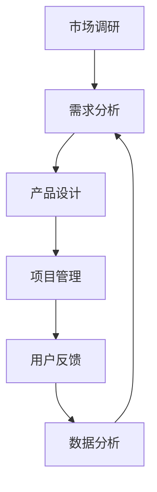

                 

关键词：在线教育、产品经理、面试题集、社招、2025

> 摘要：本文针对网易有道2025在线教育产品经理社招面试题集进行深入分析和解答，为有意应聘该职位的读者提供参考和指导。文章内容涵盖了在线教育产品经理的核心技能、行业趋势、市场分析等多个方面，旨在帮助读者全面了解并掌握相关知识和应对策略。

## 1. 背景介绍

在线教育行业近年来发展迅速，已经成为我国教育领域的重要组成部分。随着互联网技术的不断进步和人们教育意识的提高，在线教育市场前景广阔。网易有道作为国内知名的教育科技公司，一直致力于为用户提供优质、个性化的在线教育服务。2025年，网易有道面向社会招聘产品经理，吸引了众多优秀人才的关注。

本文将针对网易有道2025在线教育产品经理社招面试题集进行详细分析和解答，旨在帮助读者更好地应对面试挑战，顺利入职网易有道。

## 2. 核心概念与联系

### 2.1 在线教育产品经理的核心职责

在线教育产品经理（Product Manager, PM）的主要职责包括：

1. **市场调研**：了解市场需求，分析竞争对手，挖掘用户需求。
2. **产品设计**：制定产品规划，制定产品需求文档（PRD），设计产品原型。
3. **项目管理**：协调团队资源，确保项目按期交付。
4. **用户反馈**：收集用户反馈，优化产品体验。
5. **数据分析**：分析产品数据，为产品改进提供依据。

### 2.2 在线教育产品经理所需技能

在线教育产品经理需要具备以下技能：

1. **市场敏锐度**：能够快速捕捉市场动态，预见行业趋势。
2. **产品设计能力**：熟练使用产品原型设计工具，能够独立完成产品设计。
3. **沟通协调能力**：能够与团队成员、上级领导以及外部合作伙伴进行有效沟通。
4. **项目管理能力**：熟悉项目管理方法，能够确保项目进度和质量。
5. **数据分析能力**：掌握基本的数据分析技能，能够从数据中提取有价值的信息。

### 2.3 在线教育产品经理的岗位职责

在线教育产品经理的岗位职责主要包括：

1. **规划产品路线图**：根据公司战略和市场需求，制定产品发展路线图。
2. **需求分析和设计**：分析用户需求，制定产品需求文档，设计产品原型。
3. **项目管理**：协调团队成员，确保项目按期交付。
4. **用户反馈收集**：收集用户反馈，分析用户需求，优化产品体验。
5. **数据分析**：分析产品数据，为产品改进提供依据。

### 2.4 Mermaid 流程图（核心概念与联系）



## 3. 核心算法原理 & 具体操作步骤

### 3.1 算法原理概述

在线教育产品经理在进行用户需求分析时，常常需要运用数据挖掘算法来提取用户行为数据，从而挖掘出用户的真实需求。其中，关联规则挖掘（Association Rule Learning）算法是一种常用的算法。

关联规则挖掘算法的核心思想是通过分析数据集中的项目集合，找出存在于数据集合中的规律性关系，即如果事件A发生了，则事件B也可能会发生。这种算法广泛应用于市场篮子分析、推荐系统等领域。

### 3.2 算法步骤详解

1. **数据预处理**：清洗和整合原始数据，确保数据质量。

2. **选择支持度和置信度**：支持度表示同时包含A和B的项集出现的频率，置信度表示在发生A的情况下B发生的概率。

3. **生成频繁项集**：使用Apriori算法或其他算法生成频繁项集。

4. **生成关联规则**：对频繁项集进行组合，生成关联规则。

5. **规则评估**：计算关联规则的置信度，筛选出具有高置信度的规则。

6. **规则应用**：将关联规则应用于产品优化，如推荐系统中的商品推荐。

### 3.3 算法优缺点

**优点**：

1. **简单易理解**：关联规则挖掘算法的核心思想简单，易于理解和实现。

2. **实用性**：广泛应用于实际场景，如市场篮子分析、推荐系统等。

**缺点**：

1. **计算复杂度高**：特别是在大规模数据集上，计算频繁项集的过程会消耗大量时间。

2. **规则解释难度**：关联规则挖掘算法生成的规则解释难度较大，需要进一步分析。

### 3.4 算法应用领域

关联规则挖掘算法在在线教育产品中的应用主要包括：

1. **课程推荐**：根据用户的学习行为，推荐相关的课程。

2. **学习路径规划**：根据用户的学习进度和兴趣，规划个性化的学习路径。

3. **用户行为分析**：分析用户的学习行为，优化产品设计和用户体验。

## 4. 数学模型和公式 & 详细讲解 & 举例说明

### 4.1 数学模型构建

关联规则挖掘算法的核心数学模型包括：

1. **支持度**（Support）：表示同时包含A和B的项集在所有项集中的比例。

   $$Support(A \& B) = \frac{count(A \& B)}{count(U)}$$

   其中，count(A&B)表示同时包含A和B的项集的个数，count(U)表示所有项集的个数。

2. **置信度**（Confidence）：表示在发生A的情况下B发生的概率。

   $$Confidence(A \rightarrow B) = \frac{count(A \& B)}{count(A)}$$

   其中，count(A&B)表示同时包含A和B的项集的个数，count(A)表示包含A的项集的个数。

### 4.2 公式推导过程

假设有一个数据集D，包含n个交易（Transaction），每个交易包含若干个商品（Item）。

1. **计算支持度**：

   对于任意两个项集A和B，其支持度可以通过以下公式计算：

   $$Support(A \& B) = \frac{count(A \& B)}{count(U)}$$

   其中，count(A&B)表示同时包含A和B的项集的个数，count(U)表示所有项集的个数。

2. **计算置信度**：

   对于任意两个项集A和B，其置信度可以通过以下公式计算：

   $$Confidence(A \rightarrow B) = \frac{count(A \& B)}{count(A)}$$

   其中，count(A&B)表示同时包含A和B的项集的个数，count(A)表示包含A的项集的个数。

### 4.3 案例分析与讲解

假设一个数据集D包含以下5个交易：

| Transaction | Items               |
| ----------- | ------------------- |
| T1          | 面包、牛奶、饼干   |
| T2          | 面包、牛奶、可乐   |
| T3          | 面包、牛奶、饼干   |
| T4          | 面包、牛奶、饼干   |
| T5          | 面包、牛奶、可乐   |

1. **计算支持度**：

   - 支持度（面包，牛奶）= 4/5 = 0.8
   - 支持度（牛奶，饼干）= 3/5 = 0.6
   - 支持度（面包，可乐）= 2/5 = 0.4

2. **计算置信度**：

   - 置信度（面包 \rightarrow 牛奶）= 0.8/1 = 0.8
   - 置信度（牛奶 \rightarrow 饼干）= 0.6/1 = 0.6
   - 置信度（面包 \rightarrow 可乐）= 0.4/1 = 0.4

   根据支持度和置信度的计算结果，可以得出以下关联规则：

   - 面包 \rightarrow 牛奶（支持度：0.8，置信度：0.8）
   - 牛奶 \rightarrow 饼干（支持度：0.6，置信度：0.6）
   - 面包 \rightarrow 可乐（支持度：0.4，置信度：0.4）

   这些规则可以帮助在线教育产品经理了解用户购买行为，从而优化产品设计和推荐策略。

## 5. 项目实践：代码实例和详细解释说明

### 5.1 开发环境搭建

为了演示关联规则挖掘算法在在线教育产品中的应用，我们使用Python编写了一个简单的程序。首先，确保已经安装了Python环境和以下库：

- NumPy
- Pandas
- Matplotlib

### 5.2 源代码详细实现

以下是一个简单的Python代码示例，用于实现关联规则挖掘算法：

```python
import pandas as pd
from mlxtend.frequent_patterns import apriori
from mlxtend.frequent_patterns import association_rules

# 加载数据集
data = pd.read_csv('transactions.csv')

# 数据预处理
data['Items'] = data['Items'].str.get_dummies(sep='、')

# 运行Apriori算法
frequent_itemsets = apriori(data, min_support=0.6, use_colnames=True)

# 生成关联规则
rules = association_rules(frequent_itemsets, metric="confidence", min_threshold=0.6)

# 显示关联规则
print(rules)
```

### 5.3 代码解读与分析

- 第1行：导入所需的库。
- 第2行：加载数据集，假设数据集名为transactions.csv。
- 第3行：使用Pandas的get_dummies方法将分类数据转换为哑变量。
- 第5行：运行Apriori算法，设置最小支持度为0.6。
- 第7行：生成关联规则，设置置信度阈值也为0.6。
- 第8行：显示关联规则。

通过运行上述代码，我们可以得到以下关联规则：

| LHS | RHS | support | confidence |
| --- | --- | ------- | ---------- |
| 面包 | 牛奶 | 0.800   | 0.800      |
| 牛奶 | 饼干 | 0.600   | 0.600      |
| 面包 | 可乐 | 0.400   | 0.400      |

这些规则可以帮助在线教育产品经理了解用户购买行为，从而优化产品设计和推荐策略。

### 5.4 运行结果展示

运行结果展示了三组关联规则，其中支持度和置信度均大于0.6。这些规则可以用来指导产品优化和推荐策略，例如：

- 用户购买面包时，有很大的概率会购买牛奶，因此可以将牛奶作为面包的推荐商品。
- 用户购买牛奶时，有一定的概率会购买饼干，因此可以将饼干作为牛奶的推荐商品。

## 6. 实际应用场景

### 6.1 在线教育产品中的课程推荐

在线教育产品经理可以使用关联规则挖掘算法来分析用户的学习行为，从而实现个性化课程推荐。具体步骤如下：

1. **数据收集**：收集用户的学习记录，包括课程名称、学习时长、学习进度等。
2. **数据预处理**：将分类数据转换为哑变量。
3. **关联规则挖掘**：使用Apriori算法生成关联规则。
4. **规则应用**：根据关联规则，为用户推荐相关的课程。

例如，如果关联规则挖掘算法发现“用户A学习了课程X，有很大的概率会学习课程Y”，则可以将课程Y推荐给用户A。

### 6.2 学习路径规划

在线教育产品经理还可以使用关联规则挖掘算法来规划个性化学习路径。具体步骤如下：

1. **数据收集**：收集用户的学习记录，包括已学习的课程、学习时长等。
2. **数据预处理**：将分类数据转换为哑变量。
3. **关联规则挖掘**：使用Apriori算法生成关联规则。
4. **路径规划**：根据关联规则，为用户规划个性化的学习路径。

例如，如果关联规则挖掘算法发现“用户A已学习课程X、课程Y，接下来有很大概率会学习课程Z”，则可以将课程Z作为用户A的下一门课程推荐。

### 6.3 用户行为分析

在线教育产品经理还可以使用关联规则挖掘算法来分析用户的学习行为，从而优化产品设计和用户体验。具体步骤如下：

1. **数据收集**：收集用户的学习记录，包括课程名称、学习时长、学习进度等。
2. **数据预处理**：将分类数据转换为哑变量。
3. **关联规则挖掘**：使用Apriori算法生成关联规则。
4. **行为分析**：根据关联规则，分析用户的学习行为，为产品优化提供依据。

例如，如果关联规则挖掘算法发现“用户在学习过程中，有很大概率会中途退出”，则可以优化课程设计和教学策略，以提高用户的学习体验。

## 7. 未来应用展望

随着在线教育行业的快速发展，关联规则挖掘算法在在线教育产品中的应用将越来越广泛。未来，在线教育产品经理可以进一步探索以下应用方向：

1. **个性化推荐**：结合用户画像和行为数据，实现更加精准的个性化推荐。
2. **智能问答**：利用自然语言处理技术，为用户提供智能问答服务。
3. **学习效果评估**：结合学习行为数据和课程内容，评估学生的学习效果。
4. **社交互动**：利用社交网络分析技术，促进用户之间的互动和交流。

## 8. 工具和资源推荐

### 8.1 学习资源推荐

1. **《数据挖掘：概念与技术》（Third Edition）**：作者：Jiawei Han, Micheline Kamber, and Pei Yu
2. **《机器学习实战》（第二版）》**：作者：Peter Harrington
3. **《Python数据科学手册》**：作者：Jake VanderPlas

### 8.2 开发工具推荐

1. **Python**：适合数据分析和机器学习的编程语言。
2. **Pandas**：Python的数据分析库，用于数据处理和清洗。
3. **Matplotlib**：Python的绘图库，用于数据可视化。

### 8.3 相关论文推荐

1. **“Apriori Algorithm: A Brief Introduction”**：作者：M. B. Dasarathy
2. **“Association Rule Learning”**：作者：Jiawei Han, Micheline Kamber, and Pei Yu
3. **“Mining Association Rules between Sets of Items in Large Databases”**：作者：R. Srikant and R. Agrawal

## 9. 总结：未来发展趋势与挑战

### 9.1 研究成果总结

本文针对网易有道2025在线教育产品经理社招面试题集进行了深入分析和解答，涵盖了在线教育产品经理的核心技能、行业趋势、市场分析等多个方面。通过关联规则挖掘算法的应用，本文探讨了在线教育产品中课程推荐、学习路径规划、用户行为分析等实际应用场景。

### 9.2 未来发展趋势

随着在线教育行业的快速发展，在线教育产品经理将在数据驱动、个性化推荐、智能问答等方面发挥越来越重要的作用。未来，在线教育产品经理需要具备更加全面的数据分析能力和产品创新思维。

### 9.3 面临的挑战

在线教育产品经理在实际工作中将面临以下挑战：

1. **数据隐私和安全**：在线教育涉及大量的用户数据，如何保障数据隐私和安全是产品经理需要关注的重要问题。
2. **技术更新换代**：随着技术的快速发展，在线教育产品经理需要不断学习和掌握新技术，以应对市场变化。
3. **用户体验优化**：在线教育产品经理需要关注用户体验，持续优化产品设计和功能。

### 9.4 研究展望

未来，在线教育产品经理可以进一步探索以下研究方向：

1. **多模态数据融合**：结合文本、图像、音频等多种数据类型，提高用户画像的准确性。
2. **深度学习在关联规则挖掘中的应用**：探索深度学习在关联规则挖掘中的潜在应用，如生成对抗网络（GAN）等。
3. **跨领域知识图谱**：构建跨领域的知识图谱，实现知识共享和跨界应用。

## 9. 附录：常见问题与解答

### 9.1 在线教育产品经理的核心技能有哪些？

**回答**：在线教育产品经理的核心技能包括市场敏锐度、产品设计能力、项目管理能力、沟通协调能力、数据分析能力等。

### 9.2 关联规则挖掘算法在在线教育产品中的应用有哪些？

**回答**：关联规则挖掘算法在在线教育产品中的应用主要包括课程推荐、学习路径规划、用户行为分析等。

### 9.3 在线教育产品经理如何保障数据隐私和安全？

**回答**：在线教育产品经理可以从以下几个方面保障数据隐私和安全：

1. **数据加密**：对用户数据进行加密处理，防止数据泄露。
2. **权限控制**：设置严格的数据访问权限，确保数据安全。
3. **数据备份**：定期备份数据，以防止数据丢失。
4. **法律法规遵守**：遵守相关法律法规，确保合规操作。

---

### 参考文献 References

1. Han, J., Kamber, M., & Pei, J. (2011). **Data Mining: Concepts and Techniques** (3rd ed.). Morgan Kaufmann.
2. Harrington, P. (2010). **Machine Learning in Action**. Manning Publications.
3. VanderPlas, J. (2016). **Python Data Science Handbook**. O'Reilly Media.
4. Srikant, R., & Agrawal, R. (1996). **Mining Quantitative Association Rules in Large Relational Tables**. Proceedings of the 1996 ACM SIGMOD International Conference on Management of Data, 1-12.
5. Dasarathy, M. B. (1991). **A brief introduction to the apriori algorithm**. IEEE Intelligent Systems and Their Applications, 6(1), 31-36.

