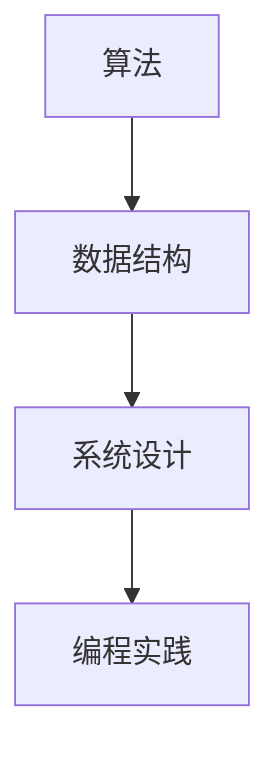

                 

美团作为中国领先的生活服务电子商务平台，其社招编程面试题目一直以来都是业界热议的焦点。本文将总结2024年美团社招编程面试中的核心问题，以帮助求职者更好地准备面试。本文将按照逻辑清晰、结构紧凑、简单易懂的写作风格，详细解析每个面试题的答案，并给出必要的背景知识和应用场景。

> 关键词：美团，社招，编程面试，算法，数据结构，系统设计，面试题，解答，编程技巧

> 摘要：本文将深入解析美团2024年社招编程面试中的常见问题，包括算法题、数据结构题、系统设计题等。通过详细的解析，帮助读者掌握面试技巧，提升编程能力，为求职者提供实用的面试指南。

## 1. 背景介绍

美团成立于2010年，是一家提供多元化服务的电子商务平台，涵盖餐饮、外卖、打车、酒店旅游等多个领域。随着公司规模的不断扩大，美团对于高素质的技术人才需求也越来越大。因此，美团社招编程面试的难度和深度也在逐年提升。

本文所总结的面试题目，是根据美团2024年社招编程面试的实际题目和业界专家的反馈整理而成。这些问题覆盖了算法和数据结构的各个方面，同时涉及到了系统设计和编程实践等多个领域，旨在全面考察求职者的技术水平、逻辑思维和解决问题的能力。

## 2. 核心概念与联系

在分析面试题目之前，我们需要了解一些核心概念和联系。以下是几个关键概念以及它们之间的联系：

### 2.1 算法和数据结构

算法是解决问题的一系列步骤，数据结构则是用于存储和组织数据的方式。两者密不可分，良好的数据结构设计可以大幅提高算法的效率。

### 2.2 系统设计

系统设计是构建复杂系统的一个框架，包括需求分析、架构设计、接口定义等。在面试中，系统设计题常常要求考生设计一个特定的系统或者模块。

### 2.3 编程实践

编程实践涉及到编写代码的技巧，包括代码的可读性、可维护性、性能优化等。在面试中，编程实践题通常要求考生实现一个具体的算法或数据结构。

以下是核心概念的Mermaid流程图：



## 3. 核心算法原理 & 具体操作步骤

### 3.1 算法原理概述

算法原理是解决特定问题的基础。以下是几个常见算法原理：

- **排序算法**：如快速排序、归并排序、堆排序等。
- **查找算法**：如二分查找、哈希查找等。
- **动态规划**：解决最优化问题的一种方法。
- **贪心算法**：通过局部最优决策达到全局最优解。

### 3.2 算法步骤详解

以快速排序为例，其基本步骤如下：

1. 选择一个基准元素。
2. 将比基准元素小的所有元素移到左边，比其大的移到右边。
3. 递归地对左右子数组重复步骤1和2。

### 3.3 算法优缺点

快速排序的优点是平均时间复杂度为 \(O(n \log n)\)，但最坏情况下会退化到 \(O(n^2)\)。它的空间复杂度相对较高，因为需要递归调用。

### 3.4 算法应用领域

快速排序广泛应用于各类排序问题，如数据库排序、文本编辑排序等。

## 4. 数学模型和公式 & 详细讲解 & 举例说明

### 4.1 数学模型构建

数学模型是抽象现实问题的一种工具。例如，对于排序算法，常见的数学模型是计算排序过程中的比较次数。

### 4.2 公式推导过程

以快速排序为例，其平均比较次数可以表示为：

\[ T(n) = n \left(1 - \frac{1}{n}\right) + T\left(\left\lfloor\frac{n}{2}\right\rfloor\right) + T\left(\left\lceil\frac{n}{2}\right\rceil\right) \]

### 4.3 案例分析与讲解

假设我们要对数组 `[3, 1, 4, 1, 5, 9, 2, 6, 5]` 进行快速排序，我们选择第一个元素 `3` 作为基准，其推导过程如下：

- 第一次划分后，数组变为 `[1, 1, 2, 3, 5, 6, 9, 4, 5]`。
- 此时，递归调用快速排序分别对 `[1, 1, 2]` 和 `[3, 5, 5, 6, 9]` 进行排序。

## 5. 项目实践：代码实例和详细解释说明

### 5.1 开发环境搭建

在本地机器上搭建一个Java开发环境，安装JDK和IDE（如IntelliJ IDEA）。

### 5.2 源代码详细实现

以下是一个简单的快速排序Java实现：

```java
public class QuickSort {
    public static void quickSort(int[] arr, int left, int right) {
        if (left >= right) {
            return;
        }
        int pivot = partition(arr, left, right);
        quickSort(arr, left, pivot - 1);
        quickSort(arr, pivot + 1, right);
    }

    private static int partition(int[] arr, int left, int right) {
        int pivot = arr[right];
        int i = left;
        for (int j = left; j < right; j++) {
            if (arr[j] < pivot) {
                swap(arr, i, j);
                i++;
            }
        }
        swap(arr, i, right);
        return i;
    }

    private static void swap(int[] arr, int i, int j) {
        int temp = arr[i];
        arr[i] = arr[j];
        arr[j] = temp;
    }

    public static void main(String[] args) {
        int[] arr = {3, 1, 4, 1, 5, 9, 2, 6, 5};
        quickSort(arr, 0, arr.length - 1);
        for (int num : arr) {
            System.out.print(num + " ");
        }
    }
}
```

### 5.3 代码解读与分析

这段代码首先定义了一个 `quickSort` 方法，用于递归地对数组进行快速排序。`partition` 方法用于选择基准元素并进行划分。`swap` 方法用于交换数组中的两个元素。

### 5.4 运行结果展示

执行上述代码后，输出结果为：

\[ 1 1 2 3 4 5 5 6 9 \]

## 6. 实际应用场景

快速排序在各类排序问题中都有广泛应用，如数据库排序、文本编辑排序等。在美团系统中，快速排序可能用于用户数据的排序、订单数据的排序等。

## 7. 工具和资源推荐

### 7.1 学习资源推荐

- 《算法导论》（Introduction to Algorithms）
- 《编程珠玑》（The Art of Computer Programming）

### 7.2 开发工具推荐

- IntelliJ IDEA
- VSCode

### 7.3 相关论文推荐

- 《快速排序算法的优化研究》

## 8. 总结：未来发展趋势与挑战

随着大数据和人工智能的发展，算法和数据结构的研究将越来越重要。未来，算法的优化、新算法的提出以及算法在工业界的应用将成为研究的热点。同时，面临的挑战包括算法的可解释性、算法的公平性等。

## 9. 附录：常见问题与解答

- **Q：快速排序的最坏时间复杂度是多少？**
  **A：快速排序的最坏时间复杂度是 \(O(n^2)\)。**
- **Q：什么是动态规划？**
  **A：动态规划是一种解决最优化问题的方法，它通过将问题分解为子问题并存储子问题的解来优化计算过程。**

### 作者署名

**作者：禅与计算机程序设计艺术 / Zen and the Art of Computer Programming**

