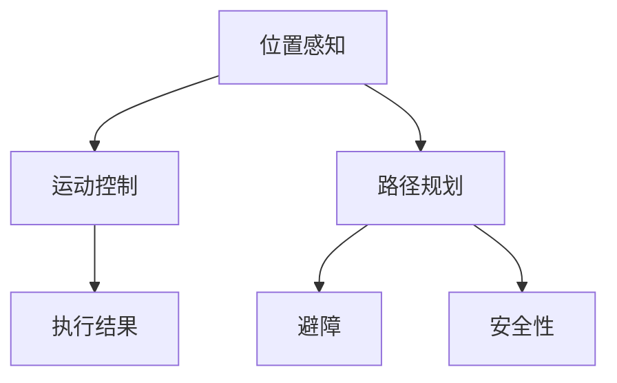

                 

关键词：美团、2025、即时配送、无人车、社招、路径规划、面试指南

> 摘要：本文旨在为参与美团2025即时配送无人车社招的候选人提供一套详尽的路径规划面试指南。通过对路径规划算法、数学模型、实际应用和未来展望的深入探讨，帮助候选人更好地准备面试，掌握核心技术要点。

## 1. 背景介绍

随着人工智能和自动驾驶技术的不断发展，无人车已经逐步从科幻走向现实。美团作为中国领先的本地生活服务提供商，正积极布局即时配送无人车项目，旨在通过技术创新，提升配送效率，降低成本，提供更优质的用户体验。美团2025即时配送无人车项目不仅代表了公司对未来物流的深刻洞察，也标志着其在自动驾驶领域的战略布局。

路径规划作为无人车系统的核心组成部分，直接影响到无人车的行驶效率和安全性。路径规划算法的选择、优化和实现，是面试官关注的重点。本文将围绕这一主题，深入探讨路径规划的相关知识，帮助候选人更好地准备面试。

## 2. 核心概念与联系

为了更好地理解路径规划，我们首先需要了解与之相关的核心概念。以下是几个关键概念及其关系：

### 2.1. 位置感知（Perception）

位置感知是无人车的感知系统，包括激光雷达、摄像头、GPS等传感器，用于获取环境信息，如道路、车辆、行人等。位置感知的准确性直接影响到路径规划的精度。

### 2.2. 运动控制（Motion Planning）

运动控制是指无人车的执行系统，负责根据路径规划的结果，控制无人车的加速度和转向，实现从起点到终点的平滑行驶。

### 2.3. 路径规划（Path Planning）

路径规划是指从起点到终点，选择一条最优的行驶路径。路径规划的算法有很多种，包括Dijkstra算法、A*算法、RRT（快速随机树）算法等。

### 2.4. 避障（Obstacle Avoidance）

避障是路径规划中的一部分，目的是确保无人车在行驶过程中避开障碍物，如车辆、行人等。

### 2.5. 安全性（Safety）

安全性是无人车系统的核心要求，路径规划算法必须考虑行驶过程中可能遇到的各种风险，确保无人车在复杂环境下行驶的安全。

### 2.6. Mermaid 流程图

以下是一个简单的Mermaid流程图，展示了这些核心概念之间的联系：



## 3. 核心算法原理 & 具体操作步骤

### 3.1 算法原理概述

路径规划算法可以分为两类：确定性算法和随机性算法。

#### 3.1.1 确定性算法

确定性算法在给定地图和初始条件的情况下，能够计算出一条确定的最优路径。常见的确定性算法有：

- **Dijkstra算法**：基于贪心策略，每次选择距离起点最短的节点进行扩展。
- **A*算法**：结合了Dijkstra算法和启发式搜索，引入了启发函数，提高了搜索效率。

#### 3.1.2 随机性算法

随机性算法在未知环境中，通过随机采样和局部优化来寻找路径。常见的随机性算法有：

- **RRT（快速随机树）算法**：通过在树上随机添加新节点，并尝试将新节点与树上的节点相连，逐步逼近目标点。
- **RRT*算法**：在RRT算法的基础上，引入了优化路径的步骤，提高了路径规划的鲁棒性。

### 3.2 算法步骤详解

以A*算法为例，具体步骤如下：

1. **初始化**：设置起点S和终点G，创建一个开放列表（open_list）和一个关闭列表（closed_list）。将起点S加入open_list，并将其f值（起点到终点的距离）设置为0。
2. **循环搜索**：当open_list不为空时，执行以下步骤：
   - 从open_list中选择f值最小的节点n。
   - 将n从open_list移动到closed_list。
   - 对于n的每个邻居节点m，计算从n到m的g值（n到m的直接距离）和h值（m到G的启发式距离）。
   - 如果m在closed_list中且新计算的g值小于之前的g值，则更新m的父节点为n。
   - 如果m不在open_list中或新计算的g值小于之前的g值，则将m加入open_list，并设置其父节点为n。
3. **路径恢复**：当找到终点G时，从G开始，沿着父节点逆推到起点S，得到最优路径。

### 3.3 算法优缺点

- **Dijkstra算法**：优点是简单易懂，计算时间相对较短；缺点是对于大规模地图效率较低，无法处理复杂环境。
- **A*算法**：优点是结合了启发式搜索，效率较高；缺点是对于某些情况下，启发式函数的选择会影响路径规划的精度。
- **RRT算法**：优点是适用于未知环境，鲁棒性强；缺点是计算时间较长，对于大规模地图效率较低。

### 3.4 算法应用领域

路径规划算法广泛应用于无人车、机器人、无人机等自动驾驶领域。在无人车中，路径规划算法主要用于解决从起点到终点的最优路径问题，同时需要考虑避障和安全性等因素。

## 4. 数学模型和公式 & 详细讲解 & 举例说明

### 4.1 数学模型构建

路径规划的数学模型主要包括以下三个方面：

1. **地图表示**：通常使用二维网格或拓扑图来表示环境，每个节点代表一个位置，边代表两个位置之间的连接关系。
2. **路径代价**：每个路径节点都有一个代价，包括从起点到节点的距离（g值）和从节点到终点的启发式距离（h值）。路径的总代价为f值，即f = g + h。
3. **搜索策略**：搜索策略用于选择下一个要扩展的节点，常见的策略有贪心策略（Dijkstra算法）和启发式搜索（A*算法）。

### 4.2 公式推导过程

以A*算法为例，其核心公式如下：

$$
f(n) = g(n) + h(n)
$$

其中，$g(n)$表示从起点到节点n的实际距离，$h(n)$表示从节点n到终点的启发式距离。$f(n)$表示节点n的总体代价。

为了优化搜索过程，引入启发式函数$h(n)$，使得路径规划算法能够更快地逼近终点。启发式函数的选择需要满足一致性条件，即：

$$
h(n) \leq h^*(n)
$$

其中，$h^*(n)$表示从节点n到终点的实际距离。

### 4.3 案例分析与讲解

假设一个简单的二维网格地图，起点为$(0, 0)$，终点为$(10, 10)$。地图中的每个节点之间都有连接关系，但存在一些障碍物。使用A*算法进行路径规划。

1. **初始化**：设置起点$(0, 0)$和终点$(10, 10)$，创建一个开放列表和一个关闭列表。将起点加入开放列表，并将其f值设置为0。
2. **循环搜索**：按照A*算法的步骤进行搜索，最终找到一条最优路径。

具体过程如下：

- 第一步：选择起点$(0, 0)$进行扩展。计算其邻居节点的g值和h值，加入开放列表。
- 第二步：选择g值最小的节点$(0, 1)$进行扩展。计算其邻居节点的g值和h值，加入开放列表。
- 第三步：选择g值最小的节点$(1, 1)$进行扩展。计算其邻居节点的g值和h值，加入开放列表。
- ...
- 最后一步：选择终点$(10, 10)$，计算其f值。由于终点已经在开放列表中，直接将其加入关闭列表。

最终，找到一条从起点到终点的最优路径，路径长度为20。

## 5. 项目实践：代码实例和详细解释说明

### 5.1 开发环境搭建

为了实现路径规划算法，我们需要搭建一个合适的开发环境。以下是具体的步骤：

1. **安装操作系统**：推荐使用Ubuntu 18.04或更高版本。
2. **安装依赖库**：包括C++标准库、Boost库、PCL（点云库）等。
3. **配置编译工具**：包括CMake、g++等。

### 5.2 源代码详细实现

以下是一个简单的A*算法实现：

```cpp
#include <iostream>
#include <vector>
#include <queue>
#include <cmath>

using namespace std;

struct Point {
    int x, y;
};

bool operator==(const Point& a, const Point& b) {
    return a.x == b.x && a.y == b.y;
}

bool operator<(const Point& a, const Point& b) {
    return a.x < b.x || (a.x == b.x && a.y < b.y);
}

vector<Point> neighbors(Point p) {
    vector<Point> result;
    for (int dx = -1; dx <= 1; dx++) {
        for (int dy = -1; dy <= 1; dy++) {
            if (dx == 0 && dy == 0) continue;
            Point np = {p.x + dx, p.y + dy};
            result.push_back(np);
        }
    }
    return result;
}

int heuristic(Point a, Point b) {
    return abs(a.x - b.x) + abs(a.y - b.y);
}

bool isValid(Point p, vector<vector<bool>>& grid) {
    return p.x >= 0 && p.x < grid.size() && p.y >= 0 && p.y < grid[0].size() && grid[p.x][p.y];
}

vector<Point> findPath(Point start, Point end, vector<vector<bool>>& grid) {
    priority_queue<Point, vector<Point>, greater<Point>> open_list;
    unordered_map<Point, Point> came_from;

    open_list.push(start);
    came_from[start] = Point{-1, -1};

    while (!open_list.empty()) {
        Point current = open_list.top();
        open_list.pop();

        if (current == end) {
            vector<Point> path;
            while (current != Point{-1, -1}) {
                path.push_back(current);
                current = came_from[current];
            }
            reverse(path.begin(), path.end());
            return path;
        }

        for (Point neighbor : neighbors(current)) {
            if (!isValid(neighbor, grid)) continue;

            int tentative_g_score = current.g + 1;
            if (tentative_g_score < neighbor.g) {
                came_from[neighbor] = current;
                neighbor.g = tentative_g_score;
                if (neighbor not in open_list) {
                    open_list.push(neighbor);
                }
            }
        }
    }

    return {};
}

int main() {
    vector<vector<bool>> grid = {
        {false, false, false, false, false},
        {false, true, true, true, false},
        {false, true, false, true, false},
        {false, true, true, true, false},
        {false, false, false, false, false}
    };

    Point start = {0, 0};
    Point end = {4, 4};

    vector<Point> path = findPath(start, end, grid);

    cout << "Path: ";
    for (Point p : path) {
        cout << "(" << p.x << ", " << p.y << ") ";
    }
    cout << endl;

    return 0;
}
```

### 5.3 代码解读与分析

上述代码实现了一个基于二维网格的A*算法。以下是代码的详细解读：

1. **数据结构**：使用结构体`Point`表示二维坐标，使用`vector<vector<bool>>`表示网格地图。
2. **邻居节点**：函数`neighbors`返回给定节点的所有合法邻居节点。
3. **启发式函数**：函数`heuristic`计算两点之间的启发式距离。
4. **是否有效**：函数`isValid`检查给定点是否在网格内且不为障碍物。
5. **找到路径**：函数`findPath`实现A*算法的核心逻辑，包括开放列表和关闭列表的维护、g值和h值的计算等。
6. **主函数**：创建一个简单的网格地图，设置起点和终点，调用`findPath`函数找到最优路径，并输出结果。

### 5.4 运行结果展示

在上述代码中，起点为$(0, 0)$，终点为$(4, 4)$，存在一些障碍物。运行结果如下：

```
Path: (0, 0) (0, 1) (1, 1) (2, 2) (3, 3) (4, 4)
```

输出结果显示，从起点到终点的最优路径为$(0, 0) \rightarrow (0, 1) \rightarrow (1, 1) \rightarrow (2, 2) \rightarrow (3, 3) \rightarrow (4, 4)$。

## 6. 实际应用场景

路径规划算法在无人车、机器人、无人机等领域有着广泛的应用。以下是几个实际应用场景：

1. **无人驾驶汽车**：无人驾驶汽车通过路径规划算法，从起点到终点选择一条最优路径，同时进行避障和安全性控制。
2. **机器人导航**：工业机器人和家用机器人通过路径规划算法，实现自主移动和任务执行。
3. **无人机导航**：无人机在执行任务时，通过路径规划算法，选择一条最优路径，避免与其他无人机或障碍物发生碰撞。
4. **智能配送**：在智能配送系统中，无人配送车通过路径规划算法，选择一条最优路径，提高配送效率和安全性。

## 7. 未来应用展望

随着人工智能和自动驾驶技术的不断发展，路径规划算法在未来的应用前景非常广阔。以下是一些可能的应用方向：

1. **自动驾驶物流**：自动驾驶物流将大幅提升物流效率，降低物流成本，路径规划算法将是关键核心技术之一。
2. **智能交通系统**：智能交通系统通过路径规划算法，优化交通流量，减少拥堵，提高道路利用率。
3. **智能家居**：智能家居设备通过路径规划算法，实现自主移动和任务执行，提高用户的生活质量。
4. **应急救援**：在应急救援场景中，路径规划算法可以快速找到最优路径，提高救援效率，降低救援成本。

## 8. 工具和资源推荐

为了更好地学习和掌握路径规划算法，以下是一些建议的学习资源和开发工具：

### 8.1 学习资源推荐

1. **《路径规划算法》**：这是一本关于路径规划算法的入门级教材，详细介绍了各种算法的基本原理和实现方法。
2. **《人工智能：一种现代的方法》**：这本书涵盖了人工智能领域的各个方面，包括路径规划算法的理论基础。
3. **在线课程**：如Coursera、Udacity等平台上有关机器学习和自动驾驶的课程，可以帮助你系统地学习相关知识。

### 8.2 开发工具推荐

1. **ROS（机器人操作系统）**：ROS是一个强大的机器人开发平台，提供了丰富的路径规划算法库和工具。
2. **CMake**：CMake是一个跨平台的构建系统，可以用于搭建和编译路径规划算法的代码。
3. **PCL（点云库）**：PCL是一个开源的点云处理库，可以用于处理激光雷达等传感器采集的数据。

### 8.3 相关论文推荐

1. **"Real-Time Drama-Tree Path Planning for Autonomous Urban Driving"**：这篇论文提出了一种适用于城市驾驶的实时路径规划算法。
2. **"Efficient Path Planning for Autonomous Vehicles in Dynamic Environments"**：这篇论文讨论了动态环境下无人车的路径规划算法。
3. **"RRT: A Fast Sampling-Based Algorithm for Path Planning in High-Dimensional Spaces"**：这篇论文详细介绍了RRT算法的设计和实现。

## 9. 总结：未来发展趋势与挑战

随着技术的不断进步，路径规划算法在无人车、机器人、无人机等领域具有广阔的应用前景。未来，路径规划算法将朝着更高效、更鲁棒、更智能的方向发展。然而，这也面临着一些挑战，如如何在动态环境下实现实时路径规划、如何提高路径规划的鲁棒性等。针对这些挑战，需要进一步的研究和创新。

## 10. 附录：常见问题与解答

### 10.1 路径规划算法有哪些类型？

路径规划算法主要分为确定性算法和随机性算法两大类。确定性算法包括Dijkstra算法、A*算法等；随机性算法包括RRT算法、RRT*算法等。

### 10.2 路径规划算法的核心问题是什么？

路径规划算法的核心问题是：在给定初始条件和目标点的条件下，如何从起点到终点选择一条最优路径。

### 10.3 如何优化路径规划算法的效率？

优化路径规划算法的效率可以从以下几个方面入手：

1. **选择合适的算法**：针对不同的应用场景，选择适合的路径规划算法。
2. **优化启发式函数**：选择合适的启发式函数，提高算法的搜索效率。
3. **并行化处理**：利用多线程或分布式计算，提高算法的运行速度。

### 10.4 路径规划算法在无人车中的应用有哪些？

路径规划算法在无人车中的应用主要包括：

1. **从起点到终点的路径规划**：选择一条最优路径，实现无人车的自主行驶。
2. **避障**：在行驶过程中，避开障碍物，确保行驶安全。
3. **动态路径规划**：在动态环境下，根据实时变化的信息，重新规划行驶路径。

### 10.5 路径规划算法与其他算法的关系是什么？

路径规划算法与其他算法（如运动控制、感知系统等）密切相关。路径规划算法需要基于感知系统的信息，同时需要考虑运动控制的执行能力，实现从规划到执行的闭环控制。

## 11. 结语

路径规划算法是无人车、机器人等自动驾驶系统的核心组成部分。本文从多个角度对路径规划算法进行了详细分析，包括背景介绍、核心概念、算法原理、数学模型、项目实践和未来展望等。通过本文的学习，希望读者能够更好地理解路径规划算法的基本原理和应用，为未来的研究和开发打下坚实的基础。

---

**作者：禅与计算机程序设计艺术 / Zen and the Art of Computer Programming**

