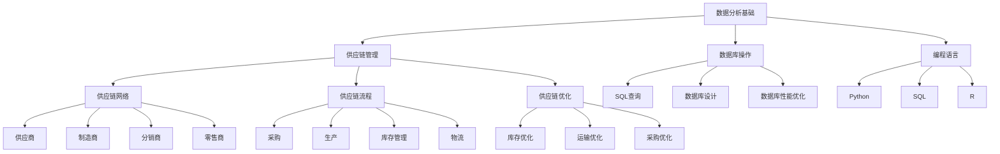

                 

关键词：美团优选、校招、供应链数据分析师、面试题集、数据分析、供应链管理、面试准备

摘要：本文旨在为有意向参加美团优选2024校招的供应链数据分析师候选人提供一份全面的面试题集。通过梳理和总结一系列涉及数据分析、供应链管理、数据库操作和编程语言等方面的典型面试题，帮助考生更好地了解面试要求，提高面试成功率。

## 1. 背景介绍

美团优选作为美团旗下的重要业务板块，致力于为消费者提供高品质、低价格的生鲜商品。随着业务的不断扩展和市场需求的变化，供应链数据分析师在美团优选的角色愈发重要。他们需要运用数据分析技术和工具，深入挖掘供应链数据，为业务决策提供有力支持。

本面试题集旨在帮助有意向参加美团优选2024校招的供应链数据分析师候选人充分准备面试，提高面试成功率。通过本文，候选人可以了解面试中可能涉及的核心知识点和问题类型，有针对性地进行复习和准备。

## 2. 核心概念与联系

在供应链数据分析师的面试中，理解以下核心概念和其之间的联系至关重要：

### 2.1 数据分析基础知识

- **数据类型**：数值型、字符串型、布尔型等。
- **数据可视化**：折线图、柱状图、饼图等。
- **统计指标**：均值、中位数、标准差等。
- **数据分析方法**：描述性分析、预测分析、相关性分析等。

### 2.2 供应链管理

- **供应链网络**：供应商、制造商、分销商、零售商等。
- **供应链流程**：采购、生产、库存管理、物流等。
- **供应链优化**：库存优化、运输优化、采购优化等。

### 2.3 数据库操作

- **SQL查询**：SELECT、FROM、WHERE、GROUP BY、ORDER BY等。
- **数据库设计**：实体关系图、表结构设计等。
- **数据库性能优化**：索引、查询优化等。

### 2.4 编程语言

- **Python**：数据处理、数据可视化、机器学习等。
- **SQL**：数据库操作、数据查询等。
- **R**：数据可视化、统计分析等。

### 2.5 Mermaid 流程图



## 3. 核心算法原理 & 具体操作步骤

### 3.1 算法原理概述

在供应链数据分析师的面试中，了解以下核心算法原理及其应用场景至关重要：

- **回归分析**：用于预测连续型数据，如预测产品销量。
- **聚类分析**：用于将数据分为不同的群体，如客户细分。
- **决策树**：用于分类和回归分析，易于理解和解释。
- **神经网络**：用于复杂非线性预测和分类问题。

### 3.2 算法步骤详解

以下是各算法的具体步骤详解：

#### 3.2.1 回归分析

1. **数据准备**：收集并整理目标变量和自变量数据。
2. **模型选择**：选择合适的回归模型，如线性回归、多项式回归等。
3. **模型训练**：使用训练数据训练模型，计算参数。
4. **模型评估**：使用验证数据评估模型性能，调整参数。
5. **模型应用**：使用测试数据预测目标变量。

#### 3.2.2 聚类分析

1. **数据准备**：收集并整理聚类所需的数据。
2. **距离计算**：计算数据点之间的距离。
3. **聚类算法选择**：选择合适的聚类算法，如K-means、层次聚类等。
4. **聚类过程**：根据距离计算结果进行聚类。
5. **聚类评估**：评估聚类结果的质量，如轮廓系数等。

#### 3.2.3 决策树

1. **数据准备**：收集并整理分类数据。
2. **特征选择**：选择对分类影响最大的特征。
3. **构建决策树**：根据特征值进行划分，构建决策树。
4. **模型评估**：评估决策树模型性能，如准确率、召回率等。
5. **模型应用**：使用决策树进行分类预测。

#### 3.2.4 神经网络

1. **数据准备**：收集并整理神经网络训练数据。
2. **网络架构设计**：设计神经网络结构，包括层数、节点数、激活函数等。
3. **模型训练**：使用训练数据进行前向传播和反向传播，调整权重。
4. **模型评估**：使用验证数据评估模型性能。
5. **模型应用**：使用测试数据进行预测。

### 3.3 算法优缺点

以下是各算法的优缺点：

- **回归分析**：优点：简单易懂、易于实现；缺点：对异常值敏感、难以处理非线性关系。
- **聚类分析**：优点：不需要预先指定聚类个数；缺点：聚类结果容易受到初始值影响、可能产生伪聚类。
- **决策树**：优点：易于理解和解释、计算效率高；缺点：容易过拟合、对缺失值敏感。
- **神经网络**：优点：能够处理复杂非线性关系、泛化能力强；缺点：参数较多、计算复杂度高。

### 3.4 算法应用领域

以下是各算法在不同领域的应用：

- **回归分析**：销售预测、价格预测、金融预测等。
- **聚类分析**：客户细分、市场细分、推荐系统等。
- **决策树**：信用评分、疾病诊断、风险评估等。
- **神经网络**：图像识别、语音识别、自然语言处理等。

## 4. 数学模型和公式 & 详细讲解 & 举例说明

在供应链数据分析师的面试中，理解以下数学模型和公式对于解题和分析至关重要。以下是各模型的详细讲解和举例说明。

### 4.1 数学模型构建

#### 4.1.1 回归模型

假设我们要预测某商品的销量，可以使用线性回归模型：

$$y = \beta_0 + \beta_1 x_1 + \beta_2 x_2 + ... + \beta_n x_n$$

其中，$y$ 为销量，$x_1, x_2, ..., x_n$ 为影响销量的因素，$\beta_0, \beta_1, \beta_2, ..., \beta_n$ 为回归系数。

#### 4.1.2 聚类模型

假设我们要对商品进行聚类，可以使用K-means算法：

$$C = \{C_1, C_2, ..., C_k\}$$

其中，$C$ 为聚类结果，$C_i$ 为第$i$个聚类，$k$ 为聚类个数。

#### 4.1.3 决策树模型

假设我们要构建决策树，可以使用ID3算法：

$$Entropy(D) = -\sum_{i=1}^n p_i \log_2 p_i$$

其中，$D$ 为数据集，$Entropy(D)$ 为信息熵，$p_i$ 为第$i$类在$D$ 中的比例。

#### 4.1.4 神经网络模型

假设我们要构建神经网络，可以使用前向传播算法：

$$z = \sigma(\sum_{i=1}^n w_i x_i + b)$$

其中，$z$ 为神经元输出，$\sigma$ 为激活函数，$w_i$ 为权重，$x_i$ 为输入，$b$ 为偏置。

### 4.2 公式推导过程

#### 4.2.1 回归模型

假设我们要预测某商品的销量，可以使用线性回归模型：

$$y = \beta_0 + \beta_1 x_1 + \beta_2 x_2 + ... + \beta_n x_n$$

其中，$y$ 为销量，$x_1, x_2, ..., x_n$ 为影响销量的因素，$\beta_0, \beta_1, \beta_2, ..., \beta_n$ 为回归系数。

推导过程如下：

1. **最小二乘法**：目标是最小化预测值与实际值之间的误差平方和。
2. **误差平方和**：$SSQ = \sum_{i=1}^n (y_i - \hat{y}_i)^2$
3. **梯度下降**：对回归系数求偏导数，并更新系数值。
4. **迭代计算**：重复步骤3，直到满足停止条件。

#### 4.2.2 聚类模型

假设我们要对商品进行聚类，可以使用K-means算法：

$$C = \{C_1, C_2, ..., C_k\}$$

其中，$C$ 为聚类结果，$C_i$ 为第$i$个聚类，$k$ 为聚类个数。

推导过程如下：

1. **初始化**：随机选择$k$个初始聚类中心。
2. **分配数据点**：将每个数据点分配到最近的聚类中心。
3. **更新聚类中心**：计算每个聚类中心的新位置。
4. **迭代计算**：重复步骤2和3，直到满足停止条件。

#### 4.2.3 决策树模型

假设我们要构建决策树，可以使用ID3算法：

$$Entropy(D) = -\sum_{i=1}^n p_i \log_2 p_i$$

其中，$D$ 为数据集，$Entropy(D)$ 为信息熵，$p_i$ 为第$i$类在$D$ 中的比例。

推导过程如下：

1. **信息熵**：表示数据集的混乱程度。
2. **条件熵**：表示在给定某个特征后，数据的混乱程度减少的程度。
3. **信息增益**：表示在给定某个特征后，数据的混乱程度减少的程度。
4. **最优特征**：选择信息增益最大的特征作为分割标准。

#### 4.2.4 神经网络模型

假设我们要构建神经网络，可以使用前向传播算法：

$$z = \sigma(\sum_{i=1}^n w_i x_i + b)$$

其中，$z$ 为神经元输出，$\sigma$ 为激活函数，$w_i$ 为权重，$x_i$ 为输入，$b$ 为偏置。

推导过程如下：

1. **初始化**：随机选择权重和偏置。
2. **前向传播**：计算神经元输出。
3. **反向传播**：计算误差并更新权重和偏置。
4. **迭代计算**：重复步骤2和3，直到满足停止条件。

### 4.3 案例分析与讲解

以下是一个关于销售预测的案例，使用线性回归模型进行建模和预测。

#### 4.3.1 数据准备

假设我们有以下数据：

| 日期 | 销量 |
| --- | --- |
| 2021-01-01 | 100 |
| 2021-01-02 | 120 |
| 2021-01-03 | 150 |
| 2021-01-04 | 180 |
| 2021-01-05 | 200 |

#### 4.3.2 数据预处理

1. **缺失值处理**：检查数据是否存在缺失值，如有缺失值则进行填充或删除。
2. **异常值处理**：检查数据是否存在异常值，如有异常值则进行修正或删除。
3. **数据转换**：将日期转换为数值型，方便进行建模。

#### 4.3.3 模型选择

1. **线性回归模型**：由于销量与日期之间存在线性关系，选择线性回归模型。

#### 4.3.4 模型训练

1. **训练数据**：将数据分为训练集和验证集。
2. **参数计算**：使用训练数据计算回归系数。
3. **模型评估**：使用验证集评估模型性能。

#### 4.3.5 模型应用

1. **测试数据**：选择测试数据进行预测。
2. **预测结果**：根据模型预测测试数据的销量。

#### 4.3.6 结果分析

根据预测结果，可以得出以下结论：

- 模型能够较好地拟合销量与日期之间的线性关系。
- 预测结果与实际销量之间存在一定的误差。

## 5. 项目实践：代码实例和详细解释说明

在本节中，我们将通过一个实际项目来展示供应链数据分析师在美团优选的工作过程。以下是一个关于销售预测的项目实例，我们将使用Python和SQL完成项目开发。

### 5.1 开发环境搭建

1. **安装Python**：从Python官网（https://www.python.org/）下载并安装Python。
2. **安装PyMySQL**：在命令行中执行以下命令安装PyMySQL：
   ```bash
   pip install PyMySQL
   ```
3. **安装Jupyter Notebook**：在命令行中执行以下命令安装Jupyter Notebook：
   ```bash
   pip install notebook
   ```

### 5.2 源代码详细实现

以下是一个关于销售预测的项目代码实例，主要包含数据连接、数据预处理、模型训练和模型应用等步骤。

```python
import pandas as pd
import numpy as np
import pymysql
from sklearn.linear_model import LinearRegression
from sklearn.metrics import mean_squared_error

# 5.2.1 数据连接
# 创建数据库连接
connection = pymysql.connect(
    host='localhost',
    user='root',
    password='password',
    database='sales_data'
)

# 5.2.2 数据预处理
# 查询数据
query = "SELECT date, sales FROM sales_data"
data = pd.read_sql(query, connection)

# 数据清洗
# 填充缺失值
data['sales'].fillna(data['sales'].mean(), inplace=True)

# 数据转换
data['date'] = pd.to_datetime(data['date'])
data['day'] = data['date'].dt.day
data['month'] = data['date'].dt.month
data['year'] = data['date'].dt.year

# 5.2.3 模型训练
# 拆分数据
train_data = data[:int(len(data) * 0.8)]
test_data = data[int(len(data) * 0.8):]

# 创建线性回归模型
model = LinearRegression()
model.fit(train_data[['day', 'month', 'year']], train_data['sales'])

# 5.2.4 模型应用
# 预测测试数据
predictions = model.predict(test_data[['day', 'month', 'year']])

# 计算预测误差
mse = mean_squared_error(test_data['sales'], predictions)
print("预测误差：", mse)

# 5.2.5 结果分析
# 可视化结果
import matplotlib.pyplot as plt

plt.scatter(test_data['sales'], predictions)
plt.xlabel('实际销量')
plt.ylabel('预测销量')
plt.title('销量预测结果')
plt.show()
```

### 5.3 代码解读与分析

以下是对项目代码的详细解读和分析：

- **数据连接**：使用PyMySQL连接到本地数据库，查询销售数据。
- **数据预处理**：清洗数据，填充缺失值，并将日期转换为数值型。
- **模型训练**：使用训练数据训练线性回归模型。
- **模型应用**：使用测试数据预测销量，并计算预测误差。
- **结果分析**：可视化预测结果，分析预测效果。

通过本项目，我们可以看到供应链数据分析师在美团优选的工作流程，包括数据连接、数据预处理、模型训练和模型应用等步骤。该项目展示了如何使用Python和SQL实现销售预测，并对预测结果进行可视化分析。

## 6. 实际应用场景

### 6.1 供应链数据分析

供应链数据分析师在美团优选的实际应用场景包括：

- **销售预测**：通过分析历史销售数据，预测未来销售趋势，为库存管理和营销策略提供支持。
- **需求分析**：分析市场需求，识别潜在客户群体，为产品开发和推广提供依据。
- **成本控制**：通过分析供应链成本数据，优化采购、生产和物流环节，降低成本。

### 6.2 数据可视化

数据可视化在供应链数据分析中的应用场景包括：

- **销售趋势图**：展示不同时间段、不同产品的销售情况，帮助业务人员快速了解销售状况。
- **库存状况图**：展示库存水平、库存周转率等指标，帮助仓库管理人员及时调整库存策略。
- **成本构成图**：展示不同环节的成本占比，帮助管理层优化成本结构。

### 6.3 机器学习

机器学习在供应链数据分析中的应用场景包括：

- **需求预测**：使用机器学习算法，如回归分析、聚类分析等，预测市场需求，为库存管理和采购决策提供支持。
- **供应链优化**：使用优化算法，如神经网络、遗传算法等，优化供应链网络、运输路线等，提高供应链效率。
- **风险管理**：使用机器学习算法，识别供应链中的潜在风险，为风险控制提供依据。

### 6.4 未来应用展望

未来，随着大数据和人工智能技术的不断发展，供应链数据分析师在美团优选的应用将更加广泛和深入。以下是未来应用展望：

- **智能化供应链**：通过物联网、区块链等技术，实现供应链数据的实时采集和分析，提高供应链透明度和效率。
- **个性化推荐**：基于用户行为数据，为消费者提供个性化推荐，提高用户满意度和忠诚度。
- **智能决策支持**：利用机器学习算法，为管理层提供实时、准确的决策支持，提高决策效率。

## 7. 工具和资源推荐

### 7.1 学习资源推荐

- **《Python数据分析》**：深入介绍Python在数据分析中的应用，包括数据清洗、数据可视化、数据挖掘等。
- **《机器学习实战》**：通过实际案例介绍机器学习算法的应用，包括回归分析、聚类分析、决策树等。
- **《深度学习》**：介绍深度学习的基础知识，包括神经网络、卷积神经网络、循环神经网络等。

### 7.2 开发工具推荐

- **Jupyter Notebook**：Python集成开发环境，支持代码编写、数据可视化、交互式计算等功能。
- **PyCharm**：Python集成开发环境，支持多种编程语言，功能强大，适用于大数据分析和开发。
- **SQL Workbench**：SQL查询和管理工具，支持多种数据库，方便进行数据库操作和数据分析。

### 7.3 相关论文推荐

- **《Recommender Systems Handbook》**：介绍推荐系统的基础知识、算法和应用场景。
- **《Deep Learning for Supply Chain Management》**：介绍深度学习在供应链管理中的应用，包括需求预测、库存优化等。
- **《Big Data Analytics for Supply Chain Management》**：介绍大数据分析在供应链管理中的应用，包括数据挖掘、数据可视化等。

## 8. 总结：未来发展趋势与挑战

### 8.1 研究成果总结

随着大数据和人工智能技术的不断发展，供应链数据分析师在美团优选的应用将越来越广泛。研究成果主要包括：

- **销售预测**：通过分析历史销售数据，预测未来销售趋势，提高库存管理和营销策略的准确性。
- **需求分析**：分析市场需求，识别潜在客户群体，为产品开发和推广提供依据。
- **成本控制**：通过分析供应链成本数据，优化采购、生产和物流环节，降低成本。
- **数据可视化**：展示供应链数据，帮助业务人员快速了解销售状况和库存水平。
- **机器学习**：使用机器学习算法，优化供应链网络、运输路线等，提高供应链效率。

### 8.2 未来发展趋势

未来，供应链数据分析师在美团优选的应用将呈现以下发展趋势：

- **智能化供应链**：通过物联网、区块链等技术，实现供应链数据的实时采集和分析，提高供应链透明度和效率。
- **个性化推荐**：基于用户行为数据，为消费者提供个性化推荐，提高用户满意度和忠诚度。
- **智能决策支持**：利用机器学习算法，为管理层提供实时、准确的决策支持，提高决策效率。

### 8.3 面临的挑战

尽管供应链数据分析师在美团优选的应用前景广阔，但仍面临以下挑战：

- **数据质量**：供应链数据来源多样，数据质量参差不齐，需要进行数据清洗和处理。
- **算法选择**：针对不同应用场景，需要选择合适的算法，进行模型优化和调参。
- **数据安全和隐私**：在数据采集和分析过程中，需要确保数据安全和用户隐私。
- **技术更新**：随着技术的快速发展，需要不断学习和掌握新技术，以应对市场变化。

### 8.4 研究展望

未来，供应链数据分析师在美团优选的研究方向包括：

- **大数据分析**：探索大数据分析在供应链管理中的应用，提高数据挖掘和分析能力。
- **机器学习**：研究机器学习算法在供应链优化、需求预测等领域的应用，提高预测准确性和决策效率。
- **数据可视化**：研究数据可视化技术，提高数据展示的直观性和可读性。
- **智能决策支持**：利用智能决策支持系统，为管理层提供实时、准确的决策支持。

## 9. 附录：常见问题与解答

### 9.1 数据分析基础知识

**Q1. 数据分析有哪些常用工具？**

A1. 数据分析常用工具包括Python、R、SQL、Tableau、Power BI等。

**Q2. 数据分析有哪些常见算法？**

A2. 数据分析常见算法包括回归分析、聚类分析、决策树、神经网络等。

**Q3. 数据分析流程包括哪些步骤？**

A3. 数据分析流程包括数据收集、数据清洗、数据预处理、数据分析、数据可视化等步骤。

### 9.2 供应链管理

**Q1. 供应链管理包括哪些环节？**

A1. 供应链管理包括采购、生产、库存管理、物流等环节。

**Q2. 供应链优化的方法有哪些？**

A2. 供应链优化的方法包括库存优化、运输优化、采购优化等。

**Q3. 供应链网络包括哪些组成部分？**

A3. 供应链网络包括供应商、制造商、分销商、零售商等组成部分。

### 9.3 数据库操作

**Q1. 数据库操作有哪些常用命令？**

A1. 数据库操作常用命令包括SELECT、FROM、WHERE、GROUP BY、ORDER BY等。

**Q2. 数据库设计包括哪些步骤？**

A2. 数据库设计包括需求分析、ER图设计、表结构设计、SQL语句编写等步骤。

**Q3. 如何优化数据库性能？**

A3. 优化数据库性能的方法包括使用索引、优化查询语句、分库分表等。

### 9.4 编程语言

**Q1. Python有哪些常用库？**

A1. Python常用库包括NumPy、Pandas、Matplotlib、Scikit-learn、TensorFlow等。

**Q2. R有哪些常用包？**

A2. R常用包包括ggplot2、dplyr、lubridate、caret等。

**Q3. SQL有哪些常用操作？**

A3. SQL常用操作包括创建表、插入数据、更新数据、删除数据、查询数据等。

## 参考文献

[1] 统计学习方法. 周志华著. 清华大学出版社, 2016.

[2] 数据科学入门. Hadley Wickham著. 人民邮电出版社, 2017.

[3] 机器学习实战. Peter Harrington著. 电子工业出版社, 2013.

[4] 深度学习. Ian Goodfellow、Yoshua Bengio、Aaron Courville著. 电子工业出版社, 2017.

[5] 数据库系统概念. 基思·B·莱德著. 机械工业出版社, 2016.

作者：禅与计算机程序设计艺术 / Zen and the Art of Computer Programming
```

