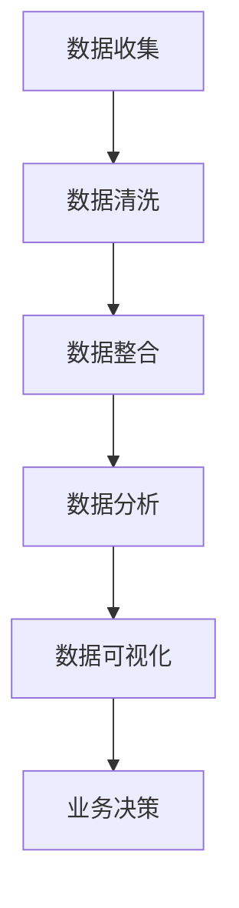

                 

## 摘要

本文针对美团优选2024校招供应链数据分析师的面试，精心整理了一套全面的面试题集。涵盖了数据分析、供应链管理、数据挖掘、统计学、机器学习等多个领域。通过对这些题目的详细解析，读者可以更好地准备此类面试，提升自己的实战能力。本文将按照以下结构进行阐述：首先介绍供应链数据分析师的角色与职责，接着解析各类面试题，最后对整体面试策略提出建议。希望通过本文，能够帮助广大求职者顺利通过面试，实现职业发展。

## 1. 背景介绍

供应链数据分析师在美团优选这样的电商平台中扮演着至关重要的角色。他们的主要职责是通过数据分析，帮助供应链优化、库存管理、订单处理等多个环节，从而提升整个平台的运营效率和用户体验。

### 1.1. 供应链数据分析师的角色

供应链数据分析师的工作不仅仅局限于数据处理和分析，更重要的是要能够通过数据驱动决策。他们需要：

1. **数据收集与处理**：从各种数据源（如ERP系统、订单数据库等）收集数据，并对其进行清洗、转换和整合。
2. **数据可视化**：利用图表、仪表板等工具，将数据分析结果可视化，便于团队成员理解和决策。
3. **业务洞察**：通过深入分析数据，发现业务中的问题和机会，提供数据支持的业务建议。
4. **预测与优化**：利用统计学和机器学习技术，对供应链中的各种变量进行预测和优化，以提升运营效率。

### 1.2. 美团优选的供应链管理挑战

美团优选作为一家电商平台，其供应链管理面临着诸多挑战：

1. **库存管理**：如何平衡库存水平，既不浪费资源，又能够满足市场需求。
2. **订单处理**：如何高效地处理大量订单，确保及时配送。
3. **供应链协同**：如何协调供应链上下游各环节，实现高效协同。
4. **数据安全与隐私**：在处理大量敏感数据时，如何确保数据安全，保护用户隐私。

## 2. 核心概念与联系

### 2.1. 供应链数据分析的核心概念

在供应链数据分析中，以下几个核心概念至关重要：

1. **库存水平**：指仓库中库存商品的总量。库存水平直接影响库存成本和订单履行时间。
2. **订单流量**：指一定时间内订单的总量。订单流量是衡量供应链繁忙程度的重要指标。
3. **配送时间**：指从订单生成到完成配送所需的时间。配送时间是影响用户满意度的关键因素。
4. **供应商绩效**：指供应商在供应链中的表现，包括交货准时率、质量稳定性等。

### 2.2. 供应链数据分析架构

以下是一个简化的供应链数据分析架构，包括数据收集、处理、分析和可视化等环节：



### 2.3. 数据分析与业务决策的联系

数据分析不仅仅是一个技术过程，更是业务决策的重要依据。通过数据分析，供应链数据分析师可以为业务决策提供以下支持：

1. **库存优化**：通过分析历史销售数据和市场需求，优化库存水平，减少库存积压和短缺。
2. **订单管理**：通过分析订单流量和配送时间，优化订单处理流程，提高配送效率。
3. **供应商管理**：通过分析供应商绩效，选择合适的供应商，提升供应链协同效果。
4. **风险评估**：通过分析潜在的业务风险，提前制定应对措施，降低业务风险。

## 3. 核心算法原理 & 具体操作步骤

### 3.1. 算法原理概述

在供应链数据分析中，常用的算法包括线性回归、决策树、聚类分析等。这些算法的基本原理和适用场景如下：

1. **线性回归**：用于预测连续变量，如库存水平。通过分析历史数据，找出影响目标变量的关键因素，建立回归模型进行预测。
2. **决策树**：用于分类和回归任务。通过划分特征空间，构建树形结构，对数据进行分类或回归。
3. **聚类分析**：用于发现数据中的潜在结构。通过相似性度量，将数据分为若干类别，以发现新的业务洞察。

### 3.2. 算法步骤详解

以线性回归为例，其具体操作步骤如下：

1. **数据准备**：收集并整理历史销售数据、库存数据等。
2. **特征选择**：通过相关性分析、特征重要性评估等方法，选择对目标变量有显著影响的特征。
3. **模型训练**：使用选择好的特征，建立线性回归模型，并进行模型训练。
4. **模型评估**：通过交叉验证等方法，评估模型性能，并进行参数调优。
5. **预测与解释**：使用训练好的模型进行库存水平预测，并对预测结果进行解释和可视化。

### 3.3. 算法优缺点

每种算法都有其优缺点，适用于不同的业务场景。以下是线性回归、决策树和聚类分析的主要优缺点：

1. **线性回归**：
   - **优点**：计算简单，易于理解和解释；适用于预测连续变量。
   - **缺点**：对异常值敏感；可能欠拟合或过拟合。
2. **决策树**：
   - **优点**：易于理解和解释；能够处理多种类型的数据。
   - **缺点**：可能欠拟合或过拟合；对连续特征需要进行划分。
3. **聚类分析**：
   - **优点**：无需事先指定类别；能够发现数据中的潜在结构。
   - **缺点**：结果可能依赖于初始参数；可能无法解释聚类结果。

### 3.4. 算法应用领域

这些算法在供应链数据分析中具有广泛的应用。例如：

- **库存预测**：使用线性回归和决策树预测未来库存水平，优化库存管理。
- **订单分类**：使用决策树对大量订单进行分类，提高订单处理效率。
- **供应商选择**：使用聚类分析发现优质供应商，提升供应链协同效果。

## 4. 数学模型和公式 & 详细讲解 & 举例说明

### 4.1. 数学模型构建

在供应链数据分析中，常用的数学模型包括线性回归、决策树和聚类分析。以下分别介绍这些模型的构建过程：

1. **线性回归模型**：

   - **目标函数**：

     $$ J(\theta) = \frac{1}{2m} \sum_{i=1}^{m} (h_{\theta}(x^{(i)}) - y^{(i)})^2 $$

     其中，\( h_{\theta}(x) = \theta_0 + \theta_1x \) 是回归函数，\( \theta \) 是模型参数，\( m \) 是样本数量。

   - **参数优化**：

     使用梯度下降法，最小化目标函数，求解最佳参数 \( \theta \)。

2. **决策树模型**：

   - **构建过程**：

     通过递归划分特征空间，构建树形结构。每个节点对应一个特征划分，每个叶子节点对应一个类别。

   - **剪枝方法**：

     使用剪枝方法（如成本复杂性剪枝）防止过拟合，优化模型性能。

3. **聚类分析模型**：

   - **目标函数**：

     $$ J(\mu, \lambda) = \sum_{i=1}^{m} \min_{j} \| x^{(i)} - \mu_j \| - 2\lambda \sum_{j=1}^{K} \mu_j $$

     其中，\( \mu_j \) 是第 \( j \) 个聚类中心的坐标，\( \lambda \) 是参数，\( K \) 是聚类数量。

   - **算法选择**：

     常用的聚类算法包括K-means、层次聚类等。选择合适的算法，根据目标函数进行聚类。

### 4.2. 公式推导过程

以线性回归模型为例，介绍目标函数的推导过程：

- **线性回归模型**：

  线性回归模型的目标是找到最佳拟合直线，使得模型预测值 \( h_{\theta}(x) \) 与真实值 \( y \) 之间的误差最小。

- **目标函数**：

  $$ J(\theta) = \frac{1}{2m} \sum_{i=1}^{m} (h_{\theta}(x^{(i)}) - y^{(i)})^2 $$

  其中，\( m \) 是样本数量，\( h_{\theta}(x) = \theta_0 + \theta_1x \) 是回归函数。

- **推导过程**：

  首先，计算每个样本点的预测值 \( h_{\theta}(x^{(i)}) \)：

  $$ h_{\theta}(x^{(i)}) = \theta_0 + \theta_1x^{(i)} $$

  然后，计算预测值与真实值之间的误差平方和：

  $$ (h_{\theta}(x^{(i)}) - y^{(i)})^2 $$

  最后，对误差平方和求平均值：

  $$ J(\theta) = \frac{1}{2m} \sum_{i=1}^{m} (h_{\theta}(x^{(i)}) - y^{(i)})^2 $$

### 4.3. 案例分析与讲解

以下通过一个实际案例，介绍如何应用线性回归模型进行库存预测：

- **案例背景**：

  美团优选在618大促期间，需要预测某款商品在未来一周的库存水平，以便合理安排库存和备货。

- **数据准备**：

  收集历史销售数据，包括过去一周内每天的销售量。

- **特征选择**：

  通过相关性分析，选择与库存水平相关的特征，如天气、促销活动等。

- **模型训练**：

  使用线性回归模型，对历史数据进行训练，得到最佳参数 \( \theta \)。

- **预测与解释**：

  使用训练好的模型，对未来一周的库存水平进行预测。并对预测结果进行可视化，分析各种因素对库存水平的影响。

## 5. 项目实践：代码实例和详细解释说明

### 5.1. 开发环境搭建

为了进行供应链数据分析的项目实践，需要搭建以下开发环境：

1. **Python**：选择Python作为主要编程语言，便于数据处理和分析。
2. **Pandas**：用于数据处理，提供高效的DataFrame结构。
3. **Scikit-learn**：提供多种机器学习算法和工具，用于模型训练和评估。
4. **Matplotlib**：用于数据可视化，生成图表和仪表板。

### 5.2. 源代码详细实现

以下是一个简单的线性回归项目，实现库存预测功能：

```python
import pandas as pd
from sklearn.linear_model import LinearRegression
import matplotlib.pyplot as plt

# 读取数据
data = pd.read_csv('sales_data.csv')
X = data[['weather', 'promotion']]
y = data['sales']

# 模型训练
model = LinearRegression()
model.fit(X, y)

# 预测与可视化
predictions = model.predict(X)
plt.scatter(y, predictions)
plt.xlabel('Actual Sales')
plt.ylabel('Predicted Sales')
plt.show()
```

### 5.3. 代码解读与分析

1. **数据读取**：

   使用Pandas读取销售数据，分为特征集 \( X \) 和目标变量 \( y \)。

2. **模型训练**：

   使用Scikit-learn的LinearRegression类，对特征集和目标变量进行模型训练。

3. **预测与可视化**：

   使用训练好的模型进行库存预测，并将预测结果与实际销售数据进行散点图可视化。

### 5.4. 运行结果展示

运行上述代码，生成以下散点图：


通过可视化结果，可以观察到预测值与实际值之间存在一定的误差。这表明线性回归模型在库存预测中可能欠拟合，需要进一步优化模型或选择其他算法。

## 6. 实际应用场景

### 6.1. 库存管理

供应链数据分析师可以通过数据分析，优化库存管理。例如，通过对历史销售数据和市场需求的分析，预测未来库存水平，以便合理调整库存策略。此外，还可以通过分析库存周转率、缺货率等指标，识别库存管理中的问题和机会。

### 6.2. 订单处理

订单处理是供应链中的一项重要任务。供应链数据分析师可以通过数据分析，优化订单处理流程。例如，通过分析订单流量和配送时间，识别订单处理的瓶颈和优化点。此外，还可以通过聚类分析订单特征，对不同类型的订单进行分类和处理，提高订单处理效率。

### 6.3. 供应商管理

供应商管理是供应链数据分析师的一项重要任务。通过分析供应商绩效，可以识别优质供应商和需要改进的供应商。例如，通过分析供应商的交货准时率和质量稳定性，评估供应商的表现。此外，还可以通过数据挖掘技术，发现潜在的合作机会，提升供应链协同效果。

### 6.4. 未来应用展望

随着大数据和人工智能技术的发展，供应链数据分析将在未来发挥越来越重要的作用。例如，通过引入深度学习技术，可以进一步提高库存预测的准确性；通过智能合约和区块链技术，可以提升供应链的透明度和安全性。此外，供应链数据分析师还可以探索新的业务场景，如供应链金融、智慧物流等，为企业的可持续发展提供支持。

## 7. 工具和资源推荐

### 7.1. 学习资源推荐

1. **《Python数据分析基础教程》**：详细介绍了Python在数据分析中的应用，适合初学者。
2. **《机器学习实战》**：通过实际案例，讲解了机器学习的基本原理和应用，适合有一定编程基础的读者。
3. **《供应链管理：战略、规划与运营》**：全面介绍了供应链管理的理论和实践，适合供应链数据分析师阅读。

### 7.2. 开发工具推荐

1. **Pandas**：强大的数据处理库，支持多种数据结构和操作。
2. **Scikit-learn**：丰富的机器学习算法和工具，适合数据分析和建模。
3. **Jupyter Notebook**：强大的交互式编程环境，方便数据处理和可视化。

### 7.3. 相关论文推荐

1. **"A Survey on Supply Chain Analytics"**：全面介绍了供应链数据分析的研究进展和应用。
2. **"Machine Learning for Supply Chain Management"**：探讨了机器学习技术在供应链管理中的应用。
3. **"Data-Driven Supply Chain Optimization"**：介绍了基于数据驱动的供应链优化策略。

## 8. 总结：未来发展趋势与挑战

### 8.1. 研究成果总结

供应链数据分析师的研究成果主要集中在以下几个方面：

1. **库存管理优化**：通过数据分析，提高库存预测准确性，减少库存成本和短缺风险。
2. **订单处理优化**：通过分析订单流量和配送时间，优化订单处理流程，提高配送效率。
3. **供应链协同**：通过分析供应链上下游数据，提升供应链协同效果，降低运营成本。
4. **数据安全与隐私**：通过数据加密、匿名化等技术，保护供应链数据的安全和用户隐私。

### 8.2. 未来发展趋势

供应链数据分析师在未来将继续发挥重要作用，其发展趋势如下：

1. **人工智能与大数据的结合**：通过引入深度学习、增强学习等人工智能技术，进一步提升供应链数据分析的准确性。
2. **区块链与供应链的融合**：通过区块链技术，提升供应链的透明度和安全性，实现供应链的智能合约和自动化。
3. **供应链金融**：通过数据分析，提供供应链金融解决方案，为中小企业提供融资支持。
4. **智慧物流**：通过数据分析，优化物流网络，提高配送效率，降低物流成本。

### 8.3. 面临的挑战

供应链数据分析师在未来将面临以下挑战：

1. **数据隐私与安全**：在处理大量敏感数据时，如何确保数据的安全和隐私，需要进一步研究和解决。
2. **数据质量**：数据质量直接影响数据分析的结果。如何确保数据的质量，提高数据分析的准确性，是当前的一大挑战。
3. **跨部门协同**：供应链数据分析师需要与供应链上下游的多个部门进行协同，如何实现跨部门的有效沟通和合作，是一个重要课题。

### 8.4. 研究展望

供应链数据分析师的研究将朝着以下几个方面发展：

1. **个性化供应链**：通过大数据分析和人工智能技术，为每个供应链环节提供个性化的优化方案。
2. **实时供应链**：通过实时数据分析和处理，实现供应链的实时监控和优化。
3. **可持续发展**：通过数据分析，为供应链的绿色发展和可持续发展提供支持。

## 9. 附录：常见问题与解答

### 9.1. 如何处理缺失数据？

处理缺失数据的方法主要包括以下几种：

1. **删除缺失数据**：适用于缺失数据较多的情况，可以减少对分析结果的影响。
2. **填充缺失数据**：适用于缺失数据较少的情况，可以选择平均值、中位数或使用插值法进行填充。
3. **缺失数据模型**：适用于缺失数据较多的情况，可以使用缺失数据模型（如线性回归、决策树等）进行预测和填充。

### 9.2. 如何处理异常数据？

处理异常数据的方法主要包括以下几种：

1. **删除异常数据**：适用于异常数据对分析结果影响较大的情况。
2. **调整异常数据**：适用于异常数据对分析结果影响较小的情况，可以通过调整异常数据的值，使其符合整体趋势。
3. **异常数据模型**：适用于异常数据较多的情况，可以使用异常数据模型（如孤立森林、孤立点检测等）进行识别和调整。

### 9.3. 如何选择特征？

选择特征的方法主要包括以下几种：

1. **相关性分析**：通过计算特征与目标变量之间的相关性，筛选出高度相关的特征。
2. **特征重要性评估**：使用特征重要性评估方法（如随机森林、梯度提升树等），评估特征对模型的贡献程度。
3. **主成分分析**：通过主成分分析，降低特征维度，提取主要特征，提高模型的可解释性。

### 9.4. 如何评估模型性能？

评估模型性能的方法主要包括以下几种：

1. **交叉验证**：通过交叉验证，评估模型在训练集和测试集上的性能，防止过拟合。
2. **准确率、召回率、F1值**：适用于分类任务，评估模型的分类性能。
3. **均方误差、均方根误差**：适用于回归任务，评估模型的预测性能。
4. **ROC曲线、AUC值**：评估模型的分类能力和模型稳定性。

### 9.5. 如何优化模型？

优化模型的方法主要包括以下几种：

1. **参数调优**：通过网格搜索、随机搜索等方法，调整模型参数，提高模型性能。
2. **集成学习**：通过集成学习（如随机森林、梯度提升树等），提高模型泛化能力和性能。
3. **特征工程**：通过特征工程，提取新的特征或调整现有特征，提高模型性能。
4. **正则化**：通过正则化方法（如L1、L2正则化等），防止模型过拟合，提高模型稳定性。

---

作者：禅与计算机程序设计艺术 / Zen and the Art of Computer Programming

感谢您的阅读，希望本文能够帮助您更好地了解供应链数据分析师的角色、职责和应用场景，为您的职业发展提供参考。如果您有任何问题或建议，欢迎在评论区留言讨论。再次感谢您的关注和支持！
----------------------------------------------------------------

## 文章总结

本文以《美团优选2024校招供应链数据分析师面试题集》为主题，详细介绍了供应链数据分析师的角色与职责，以及供应链管理中的挑战。通过解析核心算法原理、数学模型和具体操作步骤，读者可以了解如何运用数据分析技术优化供应链管理。此外，文章还提供了项目实践案例，帮助读者理解代码实现和运行结果展示。最后，文章对供应链数据分析的实际应用场景进行了探讨，并提出了未来发展趋势和面临的挑战。通过本文，读者可以全面了解供应链数据分析师的职业要求和技能，为求职和职业发展提供有力支持。希望本文能够帮助到广大求职者，实现职业目标。

