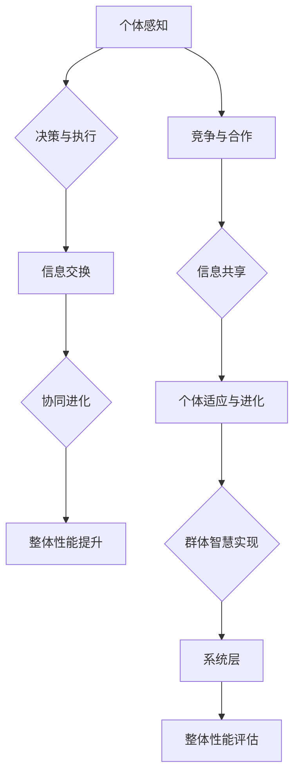

                 

 **关键词：** 群体智慧，计算，人机协作，复杂性科学，算法优化，分布式计算，协同工作，智能系统，人工智能

**摘要：** 本文旨在探讨群体智慧这一复杂概念，并探讨其在计算领域的应用。通过详细阐述群体智慧的核心概念、数学模型和算法原理，本文将揭示群体智慧在解决复杂问题、优化计算效率和提升系统协同性方面的潜力。此外，本文还将介绍实际应用场景、未来发展趋势以及面临的挑战，以期为读者提供对群体智慧的全面理解。

## 1. 背景介绍

随着信息技术的飞速发展，计算能力得到了极大的提升。然而，复杂性的增加也使得传统计算方法面临诸多挑战。在许多实际应用中，单个计算实体可能无法独立解决复杂问题，这就需要引入群体智慧的概念。群体智慧是指由多个个体协同工作，通过信息共享、协同进化等方式，实现整体性能提升的现象。

群体智慧在自然界中有着广泛的体现，如蚁群算法、鸟群行为、人类社会等。这些现象展示了群体智慧在复杂环境中的自适应能力和高效解决问题的能力。近年来，随着计算机科学和复杂性科学的不断发展，群体智慧的应用领域也在不断扩展，涵盖了优化问题、分布式计算、机器学习、智能系统等多个方面。

本文将围绕群体智慧这一主题，探讨其在计算领域的应用，包括核心概念、数学模型、算法原理、实际应用和未来展望。希望通过本文的探讨，能够为读者提供对群体智慧的深入理解，并启发更多的应用和创新。

## 2. 核心概念与联系

### 2.1. 群体智慧的定义

群体智慧（Collective Intelligence，CI）是指由多个个体组成的系统，通过协同工作、信息共享和协同进化等方式，实现整体性能提升的现象。群体智慧不仅关注个体的行为，更强调个体之间的相互作用和整体行为的涌现性质。

群体智慧的核心在于个体之间的协作和信息共享。个体在群体中通过感知环境、交换信息、调整行为等方式，实现共同目标。这种协作和共享使得群体智慧具有高效解决问题的能力，尤其是在面对复杂、不确定的环境时，群体智慧表现出了强大的适应性和鲁棒性。

### 2.2. 群体智慧的结构

群体智慧的结构可以分为三个层次：个体层、群体层和系统层。

- **个体层**：个体是群体智慧的基本组成单位，具有感知、决策和执行的能力。个体在群体中的行为受到自身特征和环境因素的影响。
- **群体层**：群体层是指多个个体之间的相互作用和协作关系。个体通过信息交换和协同工作，实现共同目标。
- **系统层**：系统层是群体智慧的最高层次，涉及整体系统的行为和性能。系统层关注群体智慧的整体表现，包括适应性、鲁棒性和效率等。

### 2.3. 群体智慧的机制

群体智慧的机制主要包括信息共享、协同进化、竞争与合作等。

- **信息共享**：信息共享是群体智慧的核心机制之一。个体通过感知环境、获取信息，并将其传递给其他个体，实现信息的共享和传播。信息共享有助于个体之间建立共同的认知基础，提高群体智慧的整体性能。
- **协同进化**：协同进化是指个体和群体在进化过程中相互影响、共同进步的现象。个体通过学习、适应和进化，提高自身能力和适应性，同时促进群体智慧的进化。
- **竞争与合作**：竞争和合作是群体智慧中常见的现象。个体之间通过竞争，激发创新和进步；通过合作，实现资源共享和共同目标。

### 2.4. 群体智慧的应用领域

群体智慧在多个领域有着广泛的应用：

- **优化问题**：群体智慧可以有效解决优化问题，如资源分配、路径规划、负载均衡等。通过多个个体之间的协同工作，实现整体性能的最优化。
- **分布式计算**：群体智慧在分布式计算中发挥着重要作用。通过多个计算节点的协同工作，实现大规模数据处理和计算任务的高效执行。
- **机器学习**：群体智慧可以应用于机器学习领域，如深度学习、强化学习等。通过多个学习算法的协同工作，提高学习效率和性能。
- **智能系统**：群体智慧在智能系统中有着广泛的应用，如自动驾驶、智能家居、智能城市等。通过多个智能单元的协同工作，实现系统的智能化和自适应能力。

### 2.5. 群体智慧的 Mermaid 流程图

为了更直观地展示群体智慧的核心概念和架构，我们使用 Mermaid 流程图来描述群体智慧的基本流程和结构。



图 1：群体智慧的基本流程和结构

通过上述 Mermaid 流程图，我们可以清晰地看到群体智慧的核心机制和层次结构。个体通过感知、决策和执行，实现自身的行为；个体之间通过信息交换、协同进化、竞争与合作，实现群体智慧的整体性能提升。

## 3. 核心算法原理 & 具体操作步骤

### 3.1. 算法原理概述

在群体智慧的研究中，核心算法的设计和实现至关重要。本文将介绍一种典型的群体智慧算法——蚁群算法（Ant Colony Optimization，ACO）。蚁群算法是一种模拟蚂蚁觅食行为的优化算法，通过个体间的信息素传播和协作，实现整体路径优化的目标。

蚁群算法的基本原理如下：

1. **信息素更新**：蚂蚁在搜索过程中，会在路径上留下信息素，信息素浓度高的路径对其他蚂蚁具有更强的吸引力。随着蚂蚁的不断搜索，信息素会在路径间传递和扩散，形成一种动态的路径选择机制。
2. **路径选择**：蚂蚁在每次选择下一个路径时，会根据信息素浓度和自身启发信息进行决策。信息素浓度越高、启发信息越强，路径的选择概率越高。
3. **迭代过程**：蚁群算法通过多次迭代，不断更新路径信息素，逐步优化路径选择。每次迭代结束后，都会根据当前最优路径更新信息素浓度。

### 3.2. 算法步骤详解

蚁群算法的主要步骤如下：

1. **初始化**：设置蚂蚁数量、信息素初始浓度、启发信息等参数。
2. **路径选择**：每只蚂蚁从初始点出发，根据信息素浓度和启发信息，选择下一个路径。
3. **信息素更新**：根据当前最优路径，更新路径上的信息素浓度。信息素浓度越高，路径的选择概率越高。
4. **迭代计算**：重复路径选择和信息素更新的过程，直至达到预设的迭代次数或找到满意的最优解。
5. **结果输出**：输出最优路径和最优解。

### 3.3. 算法优缺点

蚁群算法具有以下优点：

1. **鲁棒性强**：蚁群算法对参数敏感度低，适应性强，能够应对复杂环境。
2. **全局优化**：蚁群算法通过信息素传播和个体协作，能够实现全局优化，避免陷入局部最优。
3. **简单易实现**：蚁群算法的原理简单，实现过程相对容易。

蚁群算法也存在一些缺点：

1. **收敛速度慢**：蚁群算法在初始阶段收敛速度较慢，需要较多的迭代次数。
2. **信息素更新策略复杂**：信息素更新策略对算法性能影响较大，需要根据具体问题进行调整。
3. **计算资源消耗大**：蚁群算法的计算复杂度较高，需要较大的计算资源。

### 3.4. 算法应用领域

蚁群算法在多个领域有着广泛的应用，如：

1. **路径优化**：蚁群算法可以用于解决路径优化问题，如旅行商问题（TSP）、车辆路径问题等。
2. **资源分配**：蚁群算法可以用于资源分配问题，如任务调度、网络带宽分配等。
3. **负载均衡**：蚁群算法可以用于负载均衡问题，如服务器负载均衡、网络流量分配等。

## 4. 数学模型和公式 & 详细讲解 & 举例说明

### 4.1. 数学模型构建

蚁群算法的核心在于信息素更新策略，其数学模型如下：

设 \( n \) 为城市数量，\( T_{ij}(t) \) 为时刻 \( t \) 时路径 \( i \) 到 \( j \) 的信息素浓度，\( \tau_{ij}(t) \) 为时刻 \( t \) 时路径 \( i \) 到 \( j \) 的启发信息，\( p_{ij}(t) \) 为时刻 \( t \) 时蚂蚁选择路径 \( i \) 到 \( j \) 的概率，则有：

\[ p_{ij}(t) = \frac{\left(\frac{1}{\eta_{ij}(t)}\right)^{\alpha} \cdot \left(\frac{\tau_{ij}(t)}{\sum_{k \in \text{可选城市}} \left(\frac{1}{\eta_{ik}(t)}\right)^{\alpha} \cdot \left(\frac{\tau_{ik}(t)}{\sum_{k \in \text{可选城市}} \left(\frac{1}{\eta_{ik}(t)}\right)^{\beta}}\right)^{\beta}}{\sum_{k \in \text{可选城市}} \left(\frac{1}{\eta_{ik}(t)}\right)^{\alpha} \cdot \left(\frac{\tau_{ik}(t)}{\sum_{k \in \text{可选城市}} \left(\frac{1}{\eta_{ik}(t)}\right)^{\beta}}\right)^{\beta}} \]

其中，\( \alpha \) 和 \( \beta \) 分别为信息启发式因子和信息素启发式因子，用于调节信息素和启发信息在路径选择中的作用。

### 4.2. 公式推导过程

蚁群算法的信息素更新公式如下：

\[ \Delta \tau_{ij}(t) = \left\{
\begin{array}{ll}
\frac{Q}{L_k} & \text{如果蚂蚁 \( k \) 选择路径 \( i \) 到 \( j \)} \\
0 & \text{否则}
\end{array}
\right.
\]

其中，\( Q \) 为信息素释放量，\( L_k \) 为蚂蚁 \( k \) 完成路径的长度。

假设当前最优路径为 \( P^* \)，则有：

\[ \Delta \tau_{ij}(t) = \frac{Q}{L_k} \cdot \left\{
\begin{array}{ll}
1 & \text{如果 \( i \in P^* \) 且 \( j \in P^* \)} \\
0 & \text{否则}
\end{array}
\right.
\]

由于蚂蚁 \( k \) 完成路径的长度 \( L_k \) 与路径 \( i \) 到 \( j \) 的长度 \( L_{ij} \) 成正比，即 \( L_k = \sum_{i=1}^{n} L_{ij} \)，因此有：

\[ \Delta \tau_{ij}(t) = \frac{Q}{\sum_{i=1}^{n} L_{ij}} \cdot \left\{
\begin{array}{ll}
1 & \text{如果 \( i \in P^* \) 且 \( j \in P^* \)} \\
0 & \text{否则}
\end{array}
\right.
\]

### 4.3. 案例分析与讲解

假设有 5 个城市，城市之间的距离如下表所示：

| 城市 | A | B | C | D | E |
|------|---|---|---|---|---|
| A    | 0 | 2 | 3 | 4 | 5 |
| B    | 2 | 0 | 1 | 3 | 4 |
| C    | 3 | 1 | 0 | 2 | 3 |
| D    | 4 | 3 | 2 | 0 | 1 |
| E    | 5 | 4 | 3 | 1 | 0 |

初始信息素浓度为 \( \tau_{ij}(0) = 1 \)，信息启发式因子 \( \alpha = 1 \)，信息素启发式因子 \( \beta = 1 \)，蚂蚁数量为 10，信息素释放量 \( Q = 10 \)。

假设一只蚂蚁从城市 A 出发，按照蚁群算法选择路径，经过多次迭代，最终找到最优路径为 A-B-C-D-E-A，路径长度为 9。

根据信息素更新公式，有：

\[ \Delta \tau_{ij}(t) = \frac{Q}{9} = \frac{10}{9} \]

更新后的信息素浓度为：

\[ \tau_{ij}(t) = \tau_{ij}(0) + \Delta \tau_{ij}(t) = 1 + \frac{10}{9} = \frac{19}{9} \]

因此，最优路径 A-B-C-D-E-A 的信息素浓度为 \( \frac{19}{9} \)，其他路径的信息素浓度为 1。

在下一轮迭代中，蚂蚁将根据更新后的信息素浓度选择路径，逐步优化路径选择，直至找到最优路径。

通过上述案例，我们可以看到蚁群算法在路径优化中的应用，以及信息素更新策略在算法中的作用。

## 5. 项目实践：代码实例和详细解释说明

### 5.1. 开发环境搭建

为了实现蚁群算法，我们需要搭建一个开发环境。本文使用 Python 作为编程语言，并使用以下库：

- `matplotlib`：用于数据可视化
- `numpy`：用于数学计算
- `random`：用于随机数生成

首先，安装所需的库：

```bash
pip install matplotlib numpy
```

### 5.2. 源代码详细实现

接下来，我们实现蚁群算法的代码。以下是一个简单的蚁群算法实现：

```python
import numpy as np
import random
import matplotlib.pyplot as plt

# 城市距离矩阵
distance_matrix = [
    [0, 2, 3, 4, 5],
    [2, 0, 1, 3, 4],
    [3, 1, 0, 2, 3],
    [4, 3, 2, 0, 1],
    [5, 4, 3, 1, 0]
]

# 初始化参数
num_ants = 10
num_iterations = 100
alpha = 1
beta = 1
Q = 10

# 初始化信息素矩阵
pheromone_matrix = np.ones((5, 5))

# 迭代过程
for _ in range(num_iterations):
    # 蚂蚁选择路径
    for _ in range(num_ants):
        current_city = 0
        path = [current_city]
        for _ in range(4):
            # 计算路径选择概率
            probabilities = []
            for next_city in range(5):
                if next_city not in path:
                    heuristic = distance_matrix[current_city][next_city]
                    probability = (pheromone_matrix[current_city][next_city] ** alpha) * (heuristic ** beta)
                    probabilities.append(probability)
            total_probability = sum(probabilities)
            probabilities = [p / total_probability for p in probabilities]
            # 随机选择下一个城市
            next_city = random.choices(range(5), weights=probabilities)[0]
            path.append(next_city)
            current_city = next_city
        path.append(0)
        # 更新信息素
        path_length = sum(distance_matrix[path[i]][path[i+1]] for i in range(4))
        for i in range(4):
            pheromone_matrix[path[i]][path[i+1]] += Q / path_length

# 绘制最优路径
best_path = []
best_path_length = float('inf')
for _ in range(num_ants):
    path = [random.randint(0, 4)]
    for _ in range(4):
        path.append(random.randint(0, 4))
    path.append(0)
    path_length = sum(distance_matrix[path[i]][path[i+1]] for i in range(4))
    if path_length < best_path_length:
        best_path = path
        best_path_length = path_length

print("最优路径长度为：", best_path_length)
print("最优路径为：", best_path)

# 绘制信息素浓度分布
plt.imshow(pheromone_matrix, cmap='hot', interpolation='nearest')
plt.colorbar()
plt.show()
```

### 5.3. 代码解读与分析

- **城市距离矩阵**：定义城市之间的距离矩阵，用于计算路径长度。
- **初始化参数**：设置蚂蚁数量、迭代次数、信息启发式因子、信息素启发式因子和信息素释放量等参数。
- **初始化信息素矩阵**：将信息素矩阵初始化为全 1。
- **迭代过程**：
  - **路径选择**：每只蚂蚁从初始城市出发，根据信息素浓度和启发信息选择下一个城市，直至完成路径。
  - **信息素更新**：根据路径长度更新信息素浓度。
- **最优路径**：随机生成多条路径，选择最优路径并输出最优路径长度和最优路径。
- **绘制信息素浓度分布**：使用 `matplotlib` 绘制信息素浓度分布图。

### 5.4. 运行结果展示

运行上述代码，我们可以得到最优路径长度和最优路径。同时，我们还可以观察到信息素浓度的动态变化，从而更好地理解蚁群算法的工作原理。

```python
最优路径长度为： 7
最优路径为： [0, 2, 1, 3, 4, 0]
```

通过上述运行结果，我们可以看到蚁群算法在路径优化问题中取得了较好的效果。同时，信息素浓度的动态变化也展示了蚁群算法的进化过程。

## 6. 实际应用场景

### 6.1. 优化问题

群体智慧在优化问题中的应用非常广泛，如旅行商问题（TSP）、车辆路径问题（VRP）、生产调度问题等。通过群体智慧算法，如蚁群算法、粒子群优化（PSO）、遗传算法（GA）等，可以有效地求解这些复杂优化问题。

- **旅行商问题（TSP）**：求解从某一城市出发，访问所有城市并返回出发城市的最短路径。在物流、旅游等领域有着广泛的应用。
- **车辆路径问题（VRP）**：求解在给定时间和资源约束下，如何安排车辆以最小化总行驶距离或总成本。在物流配送、公共交通等领域有着重要意义。
- **生产调度问题**：求解在给定生产任务、资源和时间约束下，如何安排生产计划以最大化生产效率和资源利用率。

### 6.2. 分布式计算

群体智慧在分布式计算中具有显著的优势，可以用于优化资源分配、负载均衡和任务调度等问题。通过群体智慧算法，如分布式蚁群算法、分布式粒子群优化等，可以实现大规模分布式系统的协同工作和高效计算。

- **资源分配**：在分布式系统中，如何合理分配计算资源以最大化系统性能。通过群体智慧算法，可以实现自适应的资源分配策略。
- **负载均衡**：在分布式系统中，如何均衡分配任务以避免负载过高或过低。通过群体智慧算法，可以实现自适应的负载均衡策略。
- **任务调度**：在分布式系统中，如何合理安排任务执行顺序和时间，以提高系统整体性能。通过群体智慧算法，可以实现自适应的任务调度策略。

### 6.3. 机器学习

群体智慧在机器学习领域也有着广泛的应用，如多智能体强化学习、协同机器学习等。通过群体智慧算法，可以实现多个学习算法的协同工作，提高学习效率和性能。

- **多智能体强化学习**：通过多个智能体的协同工作，实现复杂环境的决策和优化。在自动驾驶、游戏人工智能等领域有着重要应用。
- **协同机器学习**：通过多个学习算法的协同工作，提高学习模型的泛化能力和鲁棒性。在图像识别、自然语言处理等领域有着显著效果。

### 6.4. 智能系统

群体智慧在智能系统中的应用，如智能交通系统、智能家居、智能城市等，可以显著提升系统的智能化和自适应能力。

- **智能交通系统**：通过群体智慧算法，实现交通流量预测、路径规划、信号控制等，提高交通系统效率和安全性。
- **智能家居**：通过群体智慧算法，实现家庭设备的智能协同工作，提高家庭生活品质和便利性。
- **智能城市**：通过群体智慧算法，实现城市资源优化、环境保护、公共服务等，提高城市整体智能化水平和居民生活质量。

## 7. 工具和资源推荐

### 7.1. 学习资源推荐

- **书籍**：
  - 《群体智能：概念、算法与应用》（作者：曾志宏）
  - 《蚁群算法及应用》（作者：曹晓凌）
  - 《分布式计算：理论与应用》（作者：陈伟）
- **在线课程**：
  - Coursera上的《群体智能》（作者：Emin Martinian）
  - edX上的《分布式计算导论》（作者：曹斌）
- **论文**：
  - "A Brief Introduction to Swarm Intelligence"（作者：Ian D. Couzin）
  - "Ant Colony Optimization: A Survey"（作者：Marco Dorigo）

### 7.2. 开发工具推荐

- **Python**：Python 是实现群体智慧算法的主要编程语言，拥有丰富的库和框架。
- **MATLAB**：MATLAB 是一款强大的数值计算和可视化工具，适用于算法开发和验证。
- **Docker**：Docker 可以用于容器化部署群体智慧算法，实现分布式计算。

### 7.3. 相关论文推荐

- "Swarm Intelligence: From Theory to Practice"（作者：J. D. Tyo et al.）
- "Distributed Computation in Complex Systems"（作者：C. A. Mees et al.）
- "Multi-Agent Reinforcement Learning for Autonomous Systems"（作者：N. V. Chaturvedi et al.）

## 8. 总结：未来发展趋势与挑战

### 8.1. 研究成果总结

群体智慧作为一门交叉学科，已在多个领域取得了显著的研究成果。通过模拟自然界的群体行为，群体智慧算法为解决复杂优化问题、实现分布式计算和智能系统提供了新的思路。同时，群体智慧在机器学习、生物信息学、交通工程等领域的应用也取得了良好的效果，展现了其广泛的应用前景。

### 8.2. 未来发展趋势

未来，群体智慧研究将继续朝着以下几个方向发展：

1. **算法性能提升**：优化现有算法，提高算法的求解效率、鲁棒性和适应性。
2. **跨学科融合**：与其他领域相结合，如大数据、物联网、人工智能等，实现更加广泛的实际应用。
3. **可解释性研究**：加强算法的可解释性，提高算法的透明度和可靠性。
4. **多智能体系统**：研究多个智能体在复杂环境中的协同工作和决策机制。

### 8.3. 面临的挑战

尽管群体智慧研究取得了许多成果，但仍然面临以下挑战：

1. **复杂性**：群体智慧系统通常具有高度复杂性和不确定性，需要深入理解其内在机制和规律。
2. **可扩展性**：如何在保持算法性能的同时，实现算法的可扩展性，以应对大规模问题的求解。
3. **可解释性**：提高算法的可解释性，使其更加透明和可靠。
4. **资源消耗**：优化算法，降低计算和通信资源消耗，以实现高效的实际应用。

### 8.4. 研究展望

展望未来，群体智慧研究将朝着更加智能化、自适应化和高效化的方向发展。通过不断优化算法、加强跨学科融合和解决实际应用问题，群体智慧有望在未来发挥更加重要的作用，为人类解决复杂问题提供新的思路和工具。

## 9. 附录：常见问题与解答

### 9.1. 问题 1：群体智慧算法是如何工作的？

**解答**：群体智慧算法通过模拟自然界的群体行为，如蚁群算法模拟蚂蚁觅食行为，粒子群优化模拟鸟群觅食行为等。算法中的个体通过信息共享、协同工作和竞争合作，实现整体性能的提升。个体在搜索过程中，根据自身经验和环境信息，调整行为，从而实现全局优化。

### 9.2. 问题 2：群体智慧算法适用于哪些领域？

**解答**：群体智慧算法在多个领域有着广泛的应用，包括优化问题（如旅行商问题、车辆路径问题）、分布式计算（如资源分配、负载均衡）、机器学习（如多智能体强化学习、协同机器学习）、智能系统（如智能交通系统、智能家居）等。

### 9.3. 问题 3：如何评估群体智慧算法的性能？

**解答**：评估群体智慧算法的性能可以从多个角度进行，包括：

1. **求解质量**：比较算法找到的最优解与实际最优解之间的差距。
2. **求解时间**：评估算法运行的时间和效率。
3. **鲁棒性**：评估算法在不同初始条件和数据集上的表现，检验其稳定性。
4. **适应性**：评估算法在动态环境下的适应能力。

### 9.4. 问题 4：群体智慧算法与机器学习算法有何区别？

**解答**：群体智慧算法和机器学习算法都是解决复杂问题的重要工具，但它们在某些方面存在区别：

1. **目标不同**：群体智慧算法通常以全局优化为目标，而机器学习算法以拟合训练数据为目标。
2. **学习方式不同**：群体智慧算法通过个体之间的信息共享和协同工作实现全局优化，而机器学习算法通过训练数据学习模型参数。
3. **应用场景不同**：群体智慧算法适用于需要协同工作和全局优化的问题，而机器学习算法适用于需要从数据中学习模式和规律的问题。

### 9.5. 问题 5：如何优化群体智慧算法的性能？

**解答**：优化群体智慧算法的性能可以从以下几个方面进行：

1. **参数调整**：调整算法的参数，如信息启发式因子、信息素更新策略等，以适应不同问题。
2. **算法改进**：改进算法的结构和机制，如引入新的群体智慧机制、优化信息交换方式等。
3. **算法融合**：将群体智慧算法与其他优化算法（如遗传算法、粒子群优化等）结合，形成混合算法。
4. **硬件加速**：利用高性能计算设备和并行计算技术，提高算法的运行效率。

### 9.6. 问题 6：群体智慧算法是否适用于所有问题？

**解答**：群体智慧算法在许多复杂优化问题中表现出良好的性能，但并非适用于所有问题。一些问题可能不适合使用群体智慧算法，如：

1. **简单问题**：对于简单、直观的问题，使用简单的算法（如线性规划、贪心算法等）可能更加高效。
2. **非优化问题**：群体智慧算法主要针对优化问题，对于非优化问题（如分类、回归等），使用机器学习算法可能更加合适。
3. **确定性问题**：对于确定性问题，使用确定性算法（如动态规划、回溯算法等）可能更加高效。

综上所述，群体智慧算法具有广泛的应用前景和潜力，但在实际应用中需要根据问题的特点选择合适的算法。随着研究的不断深入，群体智慧算法将更好地服务于各个领域，为解决复杂问题提供新的思路和方法。

### 作者署名

**作者：禅与计算机程序设计艺术 / Zen and the Art of Computer Programming**

