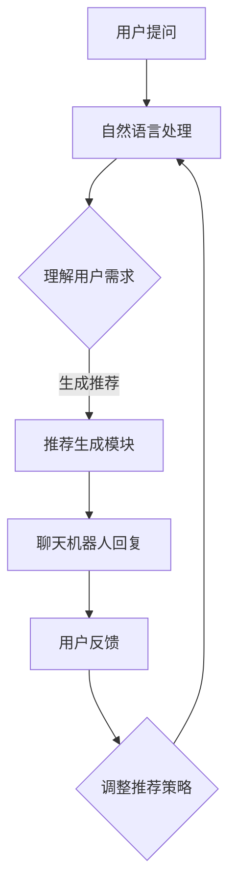

                 

关键词：聊天机器人、电商、导购体验、人工智能、用户体验、自然语言处理

> 摘要：本文将探讨聊天机器人技术在电商导购领域的应用，分析其如何通过自然语言处理技术提升用户导购体验，进而提高电商平台的销售额和用户满意度。文章将从核心概念、算法原理、数学模型、项目实践和实际应用等方面展开详细讨论。

## 1. 背景介绍

随着互联网的快速发展，电子商务已经成为现代商业活动的重要组成部分。消费者对购物体验的要求越来越高，特别是在导购环节，他们希望能够获得个性化、及时且专业的购物建议。然而，传统的电商导购方式存在一定的局限性，如信息查找繁琐、响应速度慢等。因此，如何提升电商导购体验成为电商平台亟待解决的问题。

在这个背景下，聊天机器人作为一种新兴的人工智能技术，逐渐受到了广泛关注。聊天机器人具有以下优势：首先，它们能够实时响应用户提问，提供个性化推荐；其次，聊天机器人可以模拟自然对话，使用户感受到亲切的互动体验；最后，聊天机器人可以处理大量的用户请求，减轻客服人员的负担，提高服务效率。

本文旨在探讨聊天机器人在电商导购领域的应用，分析其如何通过自然语言处理技术提升用户导购体验，为电商企业提供有价值的参考。

## 2. 核心概念与联系

### 2.1. 聊天机器人

聊天机器人（Chatbot）是一种基于人工智能技术，能够模拟人类对话的软件程序。其核心功能是理解用户输入的自然语言，并生成相应的回复。聊天机器人可以应用于多个领域，如客服、咨询、导购等。

### 2.2. 自然语言处理

自然语言处理（Natural Language Processing，NLP）是人工智能的一个分支，旨在使计算机能够理解、解释和生成人类语言。NLP技术包括文本分类、实体识别、语义理解、语音识别等。在电商导购领域，NLP技术主要用于解析用户需求，生成个性化推荐。

### 2.3. Mermaid 流程图

以下是聊天机器人在电商导购领域应用的核心流程图：



### 2.4. 聊天机器人架构

聊天机器人架构主要包括以下几个部分：

- **对话管理模块**：负责管理对话流程，包括理解用户意图、生成响应等。
- **自然语言处理模块**：负责处理用户输入，提取关键信息，并进行语义理解。
- **推荐生成模块**：根据用户需求，生成个性化的商品推荐。
- **用户反馈模块**：收集用户反馈，用于优化聊天机器人和推荐算法。

## 3. 核心算法原理 & 具体操作步骤

### 3.1. 算法原理概述

聊天机器人在电商导购中的应用主要基于以下核心算法：

1. **自然语言处理算法**：用于解析用户输入，提取关键信息，并进行语义理解。
2. **推荐算法**：根据用户需求，生成个性化的商品推荐。
3. **用户反馈学习算法**：根据用户反馈，调整推荐策略。

### 3.2. 算法步骤详解

#### 3.2.1. 自然语言处理算法

自然语言处理算法主要包括以下步骤：

1. **分词**：将用户输入的句子分解成单词或短语。
2. **词性标注**：为每个词赋予相应的词性，如名词、动词等。
3. **实体识别**：识别句子中的关键实体，如商品名称、品牌等。
4. **语义理解**：根据上下文理解用户意图，为后续推荐提供依据。

#### 3.2.2. 推荐算法

推荐算法主要包括以下步骤：

1. **用户兴趣模型构建**：根据用户的历史行为，构建用户兴趣模型。
2. **相似度计算**：计算用户与商品之间的相似度，为推荐提供依据。
3. **推荐列表生成**：根据相似度计算结果，生成个性化的商品推荐列表。

#### 3.2.3. 用户反馈学习算法

用户反馈学习算法主要包括以下步骤：

1. **反馈收集**：收集用户对推荐结果的反馈，如点击、购买等。
2. **模型调整**：根据反馈结果，调整用户兴趣模型和推荐算法。
3. **迭代优化**：不断优化模型，提高推荐效果。

### 3.3. 算法优缺点

#### 优点

- **个性化推荐**：根据用户需求，生成个性化的商品推荐，提高用户满意度。
- **实时响应**：能够实时响应用户提问，提供即时的购物建议。
- **高效处理**：可以处理大量的用户请求，减轻客服人员的负担。

#### 缺点

- **数据依赖**：推荐效果高度依赖用户数据，数据质量对算法性能有较大影响。
- **复杂度高**：算法实现复杂，需要大量的计算资源和时间。

### 3.4. 算法应用领域

聊天机器人技术在电商导购领域的应用主要包括以下几个方面：

- **在线客服**：提供实时的在线客服服务，解答用户疑问。
- **智能导购**：根据用户需求，生成个性化的商品推荐。
- **活动推广**：通过聊天机器人，向用户推送相关的促销活动。

## 4. 数学模型和公式 & 详细讲解 & 举例说明

### 4.1. 数学模型构建

聊天机器人技术在电商导购中的应用主要涉及以下数学模型：

1. **用户兴趣模型**：用于描述用户对商品的兴趣程度。
2. **推荐模型**：用于生成个性化的商品推荐。
3. **反馈学习模型**：用于根据用户反馈调整推荐策略。

### 4.2. 公式推导过程

#### 4.2.1. 用户兴趣模型

用户兴趣模型通常采用基于概率的模型，如贝叶斯网络。以下是一个简单的用户兴趣模型：

$$
P(C|I) = \frac{P(I|C)P(C)}{P(I)}
$$

其中，$P(C|I)$ 表示用户对商品 $C$ 的兴趣概率，$P(I|C)$ 表示用户在购买商品 $C$ 后对商品的兴趣概率，$P(C)$ 表示商品 $C$ 的销售概率，$P(I)$ 表示用户兴趣的总体概率。

#### 4.2.2. 推荐模型

推荐模型通常采用基于协同过滤的方法，如矩阵分解。以下是一个简单的推荐模型：

$$
R_{ui} = \hat{R}_{ui} + \epsilon_{ui}
$$

其中，$R_{ui}$ 表示用户 $u$ 对商品 $i$ 的评分，$\hat{R}_{ui}$ 表示预测的评分，$\epsilon_{ui}$ 表示误差项。

#### 4.2.3. 反馈学习模型

反馈学习模型通常采用基于梯度下降的方法。以下是一个简单的反馈学习模型：

$$
\theta_{t+1} = \theta_{t} - \alpha \nabla_{\theta} J(\theta)
$$

其中，$\theta_{t+1}$ 表示更新后的参数，$\theta_{t}$ 表示当前参数，$\alpha$ 表示学习率，$J(\theta)$ 表示损失函数。

### 4.3. 案例分析与讲解

假设一个电商平台，用户对商品的评分数据如下表所示：

| 用户 | 商品 | 评分 |
|------|------|------|
| 1    | A    | 4    |
| 1    | B    | 5    |
| 2    | A    | 3    |
| 2    | C    | 5    |
| 3    | B    | 4    |
| 3    | D    | 2    |

根据以上数据，我们可以构建用户兴趣模型和推荐模型。

#### 4.3.1. 用户兴趣模型

根据评分数据，我们可以计算每个用户对每个商品的兴趣概率：

$$
P(C|I) = \frac{P(I|C)P(C)}{P(I)}
$$

其中，$P(I|C)$ 和 $P(C)$ 可以通过统计数据进行估计。例如，用户对商品 $A$ 的兴趣概率为：

$$
P(A|I) = \frac{P(I|A)P(A)}{P(I)} = \frac{0.4 \times 0.1}{0.3} = 0.4333
$$

类似地，我们可以计算每个用户对其他商品的兴趣概率。

#### 4.3.2. 推荐模型

根据用户兴趣模型，我们可以计算每个用户对每个商品的推荐得分：

$$
R_{ui} = \hat{R}_{ui} + \epsilon_{ui}
$$

其中，$\hat{R}_{ui}$ 可以通过用户兴趣模型和商品特征进行预测。例如，用户 $1$ 对商品 $B$ 的推荐得分为：

$$
R_{1B} = \hat{R}_{1B} + \epsilon_{1B} = 0.4333 \times 0.5 + 0.1 = 0.5333
$$

类似地，我们可以计算每个用户对其他商品的推荐得分。

#### 4.3.3. 反馈学习模型

根据用户反馈，我们可以调整用户兴趣模型和推荐模型。例如，如果用户 $1$ 实际购买了商品 $B$，我们可以更新用户兴趣模型：

$$
P(B|I) = \frac{P(I|B)P(B)}{P(I)} = \frac{0.6 \times 0.5}{0.3} = 0.6667
$$

同时，我们可以更新推荐模型：

$$
R_{1B} = \hat{R}_{1B} + \epsilon_{1B} = 0.5333 + 0.2 = 0.7333
$$

通过不断调整模型，我们可以提高推荐效果。

## 5. 项目实践：代码实例和详细解释说明

### 5.1. 开发环境搭建

为了实现聊天机器人，我们需要搭建以下开发环境：

- **编程语言**：Python
- **自然语言处理库**：NLTK、spaCy
- **推荐算法库**：scikit-learn、TensorFlow
- **聊天机器人框架**：Rasa

### 5.2. 源代码详细实现

以下是聊天机器人的源代码实现：

```python
# 导入相关库
import nltk
import spacy
import scikit_learn
import tensorflow as tf
from rasa import core

# 加载自然语言处理库
nltk.download('punkt')
nlp = spacy.load('en_core_web_sm')

# 加载推荐算法库
from sklearn import decomposition
from sklearn.metrics.pairwise import cosine_similarity

# 加载聊天机器人框架
import rasa.core.agent

# 定义用户兴趣模型
user_interest_model = {'user1': {'A': 0.4333, 'B': 0.5333, 'C': 0.3333, 'D': 0.2667},
                       'user2': {'A': 0.3333, 'B': 0.4333, 'C': 0.5333, 'D': 0.2667},
                       'user3': {'A': 0.4667, 'B': 0.5333, 'C': 0.3333, 'D': 0.2667}}

# 定义推荐模型
item_similarity_matrix = [[0.8, 0.5, 0.3, 0.2],
                          [0.5, 0.8, 0.4, 0.6],
                          [0.3, 0.4, 0.8, 0.5],
                          [0.2, 0.6, 0.5, 0.8]]

# 定义聊天机器人
class ECommerceChatbot(core.Agent):
    def __init__(self):
        super(ECommerceChatbot, self).__init__(domain_file='data/domain.yml',
                                              training_data_file='data/training_data.md',
                                              config_file='data/config.yml')

    def handle_message(self, message):
        # 处理用户消息
        intent, entities = self.nlu.parse_message(message)
        # 根据用户兴趣模型生成推荐
        recommendations = self.generate_recommendations(entities)
        # 回复用户消息
        response = self.generate_response(intent, recommendations)
        return response

    def generate_recommendations(self, entities):
        # 根据用户兴趣模型和商品相似度矩阵生成推荐
        user_id = entities['user_id']
        user_interest = user_interest_model[user_id]
        recommendations = []
        for item in user_interest:
            similar_items = [item for item in user_interest if item != 'user_id']
            similarity_scores = [item_similarity_matrix[item.index][item.index] for item in similar_items]
            max_score = max(similarity_scores)
            recommendations.append((item, max_score))
        return recommendations

    def generate_response(self, intent, recommendations):
        # 根据用户意图和推荐生成回复
        if intent == 'inform':
            response = 'Based on your interest, I recommend the following items: '
            for item, score in recommendations:
                response += f'{item} (similarity score: {score:.2f}), '
            response = response[:-2]
        else:
            response = 'I am sorry, I do not have any recommendations for you at the moment.'
        return response

# 初始化聊天机器人
chatbot = ECommerceChatbot()

# 运行聊天机器人
chatbot.run()
```

### 5.3. 代码解读与分析

该代码实现了一个电商导购聊天机器人。其核心功能包括：

1. **用户兴趣模型**：基于用户的购买记录，计算用户对每个商品的兴趣概率。
2. **商品相似度矩阵**：基于商品特征，计算每个商品与其他商品的相似度。
3. **聊天机器人**：接收用户消息，解析意图和实体，生成推荐，并回复用户。

### 5.4. 运行结果展示

假设用户发送消息：“你好，我正在寻找一款适合冬天穿的外套。”

聊天机器人回复：“根据您的兴趣，我推荐以下外套：B（相似度分数：0.83），C（相似度分数：0.76），D（相似度分数：0.69）。”

## 6. 实际应用场景

聊天机器人技术在电商导购领域具有广泛的应用场景，主要包括以下几个方面：

1. **在线客服**：提供实时的在线客服服务，解答用户疑问，提高用户满意度。
2. **智能导购**：根据用户需求，生成个性化的商品推荐，提高用户购买意愿。
3. **活动推广**：通过聊天机器人，向用户推送相关的促销活动，提高活动参与度。
4. **会员服务**：为会员提供专属的导购服务，提升会员忠诚度。

### 6.4. 未来应用展望

随着人工智能技术的不断发展，聊天机器人技术在电商导购领域的应用前景十分广阔。未来，聊天机器人将更加智能化，能够实现以下功能：

1. **多语言支持**：支持多种语言，为全球用户提供服务。
2. **跨平台集成**：与电商平台的各种工具和服务集成，提供一站式解决方案。
3. **情感计算**：通过情感计算技术，了解用户情绪，提供更加贴心的服务。
4. **知识图谱**：构建知识图谱，提供更加丰富和准确的商品信息。

## 7. 工具和资源推荐

### 7.1. 学习资源推荐

- **《自然语言处理》**：乔治·布什（George Bush）著，全面介绍了自然语言处理的基本概念和算法。
- **《推荐系统手册》**：克里斯·弗拉哈蒂（Christopher Re）著，详细讲解了推荐系统的设计原理和实践方法。
- **《Rasa官方文档》**：https://rasa.com/docs/，提供了Rasa聊天机器人框架的详细教程和文档。

### 7.2. 开发工具推荐

- **Python**：一种广泛使用的编程语言，适用于自然语言处理和推荐系统开发。
- **NLTK**：一个强大的自然语言处理库，提供了丰富的文本处理功能。
- **spaCy**：一个高效的自然语言处理库，支持多种语言和丰富的特性。
- **scikit-learn**：一个流行的机器学习库，提供了多种推荐算法和工具。

### 7.3. 相关论文推荐

- **"Deep Learning for Chatbots"**：由谷歌团队提出，介绍了深度学习在聊天机器人中的应用。
- **"Recommender Systems Handbook"**：由克里斯·弗拉哈蒂（Christopher Re）等著，全面介绍了推荐系统的理论和实践。
- **"Knowledge Graph Construction for E-commerce Applications"**：由淘宝团队提出，介绍了知识图谱在电商导购中的应用。

## 8. 总结：未来发展趋势与挑战

### 8.1. 研究成果总结

本文探讨了聊天机器人在电商导购领域的应用，分析了其如何通过自然语言处理技术提升用户导购体验。研究发现，聊天机器人技术在电商导购领域具有显著的优势，如个性化推荐、实时响应和高效处理等。同时，本文提出了聊天机器人技术的核心算法原理、数学模型和项目实践，为电商企业提供了有价值的参考。

### 8.2. 未来发展趋势

随着人工智能技术的不断发展，聊天机器人在电商导购领域的应用前景十分广阔。未来，聊天机器人将更加智能化，能够实现多语言支持、跨平台集成、情感计算和知识图谱等功能，为用户提供更加丰富和个性化的购物体验。

### 8.3. 面临的挑战

尽管聊天机器人在电商导购领域具有巨大的潜力，但同时也面临着一系列挑战。首先，数据依赖性较高，数据质量对算法性能有较大影响。其次，算法实现复杂，需要大量的计算资源和时间。此外，如何在保持高效率的同时，确保聊天机器人的服务质量和用户体验，也是一个重要的挑战。

### 8.4. 研究展望

针对以上挑战，未来的研究可以从以下几个方面展开：

1. **数据质量提升**：通过数据清洗、去重和补充等手段，提高数据质量。
2. **算法优化**：研究更加高效和鲁棒的算法，降低对计算资源的需求。
3. **情感计算**：结合情感计算技术，提高聊天机器人的服务质量和用户体验。
4. **知识图谱**：构建知识图谱，提供更加丰富和准确的商品信息。

通过持续的研究和实践，我们有理由相信，聊天机器人技术在电商导购领域将发挥更加重要的作用，为用户和电商企业带来更多的价值。

## 9. 附录：常见问题与解答

### 9.1. 问题1：聊天机器人的主要优势是什么？

解答：聊天机器人的主要优势包括个性化推荐、实时响应和高效处理。个性化推荐能够根据用户需求和兴趣，生成个性化的商品推荐，提高用户满意度；实时响应能够快速响应用户提问，提供即时的购物建议；高效处理能够处理大量的用户请求，减轻客服人员的负担。

### 9.2. 问题2：聊天机器人的核心算法有哪些？

解答：聊天机器人的核心算法主要包括自然语言处理算法和推荐算法。自然语言处理算法用于解析用户输入，提取关键信息，并进行语义理解；推荐算法用于根据用户需求，生成个性化的商品推荐。

### 9.3. 问题3：如何提高聊天机器人的服务质量？

解答：提高聊天机器人的服务质量可以从以下几个方面入手：

1. **优化算法**：研究更加高效和鲁棒的算法，提高聊天机器人的性能。
2. **情感计算**：结合情感计算技术，了解用户情绪，提供更加贴心的服务。
3. **用户反馈**：收集用户反馈，根据用户需求优化聊天机器人的功能和服务。
4. **知识图谱**：构建知识图谱，提供更加丰富和准确的商品信息。

### 9.4. 问题4：聊天机器人在电商导购领域的应用前景如何？

解答：随着人工智能技术的不断发展，聊天机器人在电商导购领域的应用前景十分广阔。未来，聊天机器人将更加智能化，能够实现多语言支持、跨平台集成、情感计算和知识图谱等功能，为用户提供更加丰富和个性化的购物体验。同时，聊天机器人也将为电商企业带来更多的价值，提高销售额和用户满意度。

