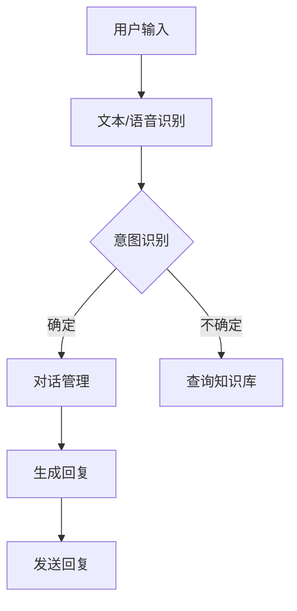

                 

关键词：聊天机器人、AI、用户疑问、购物体验、算法原理、数学模型、代码实例、应用场景、未来展望

> 摘要：本文探讨了聊天机器人技术在提升用户购物体验中的关键作用。通过对聊天机器人的核心概念、算法原理、数学模型、代码实例以及实际应用场景的深入分析，本文揭示了AI如何通过智能问答和个性化推荐，有效解决用户疑问，从而提升购物体验。

## 1. 背景介绍

在数字化时代，购物体验已经成为电商平台竞争的核心要素。随着消费者需求的日益多样化和个性化，传统的客户服务模式已无法满足现代电商的需求。聊天机器人作为一种基于人工智能技术的创新服务手段，逐渐成为电商平台提升用户体验的重要工具。聊天机器人通过智能对话系统，能够实时解答用户疑问，提供个性化推荐，显著提升购物体验。

### 聊天机器人的历史与发展

聊天机器人最早起源于20世纪50年代，艾伦·图灵提出的图灵测试为聊天机器人的概念奠定了基础。随着计算机技术和人工智能的发展，聊天机器人在20世纪90年代开始进入实际应用阶段。特别是在移动互联网普及和大数据技术的推动下，聊天机器人得到了迅速发展。

### 当前市场现状

目前，全球范围内各大电商平台纷纷布局聊天机器人技术。例如，阿里巴巴的天猫精灵、亚马逊的Alexa、京东的京东小智等，都已经成为用户购物体验中的重要组成部分。根据市场研究数据，预计到2025年，全球聊天机器人市场规模将达到120亿美元。

## 2. 核心概念与联系

### 聊天机器人的核心概念

聊天机器人（Chatbot）是一种通过自然语言处理（NLP）和机器学习技术，模拟人类对话的计算机程序。其主要功能包括：

- **文本和语音识别**：将用户的语音或文本输入转换为机器可理解的数据。
- **自然语言理解**：理解用户意图，提取关键信息。
- **对话生成**：根据用户输入生成合适的回复。

### 架构与工作原理

聊天机器人的架构通常包括以下几个部分：

- **前端界面**：用户与聊天机器人交互的界面。
- **自然语言处理（NLP）引擎**：负责文本或语音的识别和理解。
- **对话管理**：根据用户输入和机器学习模型，生成合适的回复。
- **知识库**：存储聊天机器人的知识和信息，以便在对话中提供相关建议。

#### Mermaid 流程图



### 核心技术与联系

- **自然语言处理（NLP）**：聊天机器人最核心的技术之一，负责理解和生成自然语言文本。
- **机器学习**：通过大量的对话数据训练模型，提高聊天机器人的对话能力。
- **对话系统**：设计和管理对话流程，确保聊天机器人的回答连贯和自然。
- **知识图谱**：构建知识库，为聊天机器人提供丰富的信息来源。

## 3. 核心算法原理 & 具体操作步骤

### 3.1 算法原理概述

聊天机器人的核心算法主要涉及以下几个方面：

- **意图识别**：理解用户输入的意图，例如购买、查询、咨询等。
- **实体提取**：从用户输入中提取关键信息，如产品名称、价格、数量等。
- **对话管理**：根据用户意图和上下文信息，生成合适的回复。
- **上下文理解**：理解用户对话的上下文，以生成连贯的回复。

### 3.2 算法步骤详解

1. **用户输入**：用户通过文本或语音与聊天机器人交互。
2. **文本/语音识别**：将用户输入转换为文本形式。
3. **分词与词性标注**：对文本进行分词和词性标注，以提取关键信息。
4. **意图识别**：通过预训练的模型，识别用户输入的意图。
5. **实体提取**：从用户输入中提取关键实体信息。
6. **对话管理**：根据意图和上下文信息，选择合适的对话策略。
7. **回复生成**：生成自然语言回复。
8. **发送回复**：将回复发送给用户。

### 3.3 算法优缺点

**优点**：

- **高效率**：聊天机器人可以同时处理大量用户请求，提高服务效率。
- **低成本**：相较于人工客服，聊天机器人可以显著降低企业运营成本。
- **个性化**：通过机器学习和用户数据，聊天机器人可以提供个性化的服务。

**缺点**：

- **理解能力有限**：目前的聊天机器人还无法完全理解复杂的人类语言。
- **用户隐私**：聊天机器人在处理用户数据时，可能涉及用户隐私问题。
- **用户满意度**：一些用户可能对与机器人互动感到不满足。

### 3.4 算法应用领域

- **电商平台**：提供用户咨询、产品推荐等服务，提升购物体验。
- **客户服务**：处理用户投诉、售后咨询等，提高客户满意度。
- **在线教育**：提供个性化教学服务，辅助学生学习。

## 4. 数学模型和公式 & 详细讲解 & 举例说明

### 4.1 数学模型构建

聊天机器人的核心算法通常涉及以下数学模型：

- **意图识别模型**：通常采用朴素贝叶斯、支持向量机（SVM）等分类模型。
- **实体提取模型**：使用循环神经网络（RNN）或长短期记忆网络（LSTM）进行序列标注。
- **对话生成模型**：采用生成式模型，如变换器（Transformer）或生成对抗网络（GAN）。

### 4.2 公式推导过程

以朴素贝叶斯分类器为例，其公式推导如下：

$$
P(C_k|X) = \frac{P(X|C_k)P(C_k)}{P(X)}
$$

其中，$C_k$表示第$k$类意图，$X$表示用户输入的文本。

- **$P(X|C_k)$**：表示在意图为$C_k$的条件下，用户输入文本的概率。
- **$P(C_k)$**：表示意图为$C_k$的先验概率。
- **$P(X)$**：表示用户输入文本的总概率。

### 4.3 案例分析与讲解

假设用户输入：“请问这款手机有什么优惠？”

1. **意图识别**：通过朴素贝叶斯分类器，识别出用户意图为“查询优惠”。
2. **实体提取**：从用户输入中提取出关键实体“手机”。
3. **对话管理**：根据意图和实体，选择合适的回复模板，如“手机优惠信息如下：...”。
4. **回复生成**：生成回复：“手机优惠信息如下：限时优惠，立减100元！”

## 5. 项目实践：代码实例和详细解释说明

### 5.1 开发环境搭建

开发聊天机器人需要以下环境：

- **编程语言**：Python
- **自然语言处理库**：NLTK、spaCy
- **机器学习库**：scikit-learn、TensorFlow、PyTorch

### 5.2 源代码详细实现

以下是一个简单的聊天机器人示例代码：

```python
import nltk
from nltk.classify import NaiveBayesClassifier
from nltk.tokenize import word_tokenize

# 训练数据
train_data = [
    ("请问这款手机有什么优惠？", "查询优惠"),
    ("我想买一款新手机", "购买咨询"),
    # 更多数据
]

# 分词与词性标注
def preprocess(text):
    tokens = word_tokenize(text)
    return ['_'.join(token.lower() for token in tokens if token.isalpha())

# 构建特征集合
def extract_features(text):
    return dict([(token, True) for token in preprocess(text)])

# 训练朴素贝叶斯分类器
classifier = NaiveBayesClassifier.train(train_data)
classifier.show_most_informative_features()

# 用户输入
user_input = input("请输入您的疑问：")

# 实体提取
def extract_entities(text):
    tokens = word_tokenize(text)
    entities = []
    for token in tokens:
        if token.startswith("_"):
            entities.append(token[1:])
    return entities

# 对话管理
def generate_reply(intent, entities):
    if intent == "查询优惠":
        return "优惠信息如下：限时优惠，立减100元！"
    elif intent == "购买咨询":
        return "欢迎选购，请问您需要了解哪款手机？"
    else:
        return "很抱歉，我无法理解您的疑问。"

# 生成回复
reply = generate_reply(classifier.classify(preprocess(user_input)), extract_entities(user_input))
print(reply)
```

### 5.3 代码解读与分析

- **分词与词性标注**：使用NLTK库对用户输入进行分词和词性标注，提取关键信息。
- **特征提取**：将分词后的文本转换为特征集合，用于训练朴素贝叶斯分类器。
- **分类器训练**：使用训练数据训练朴素贝叶斯分类器，用于意图识别。
- **实体提取**：从用户输入中提取关键实体，用于对话管理。
- **对话管理**：根据意图和实体，选择合适的回复模板，生成回复。

### 5.4 运行结果展示

当用户输入“请问这款手机有什么优惠？”时，聊天机器人会生成回复：“优惠信息如下：限时优惠，立减100元！”

## 6. 实际应用场景

### 6.1 电商平台

在电商平台，聊天机器人可以提供以下功能：

- **用户咨询**：实时解答用户关于产品、价格、配送等问题。
- **订单跟踪**：提供订单状态查询、物流信息更新等服务。
- **优惠活动推荐**：根据用户偏好和历史记录，推荐合适的优惠活动。

### 6.2 客户服务

在客户服务领域，聊天机器人可以：

- **投诉处理**：快速响应用户投诉，提高问题解决效率。
- **售后咨询**：提供产品使用说明、维修服务查询等服务。
- **客户满意度调查**：通过聊天机器人进行满意度调查，收集用户反馈。

### 6.3 在线教育

在线教育领域，聊天机器人可以：

- **学习辅导**：解答学生在学习过程中遇到的问题。
- **课程推荐**：根据学生的学习进度和兴趣，推荐合适的学习资源。
- **作业批改**：提供自动批改服务，帮助学生纠正错误。

## 7. 工具和资源推荐

### 7.1 学习资源推荐

- **《自然语言处理与聊天机器人》**：一本全面介绍自然语言处理和聊天机器人技术的教材。
- **《深度学习与聊天机器人》**：介绍深度学习在聊天机器人中的应用和实践。
- **《对话系统设计与实践》**：讲解对话系统的设计原则和实践方法。

### 7.2 开发工具推荐

- **TensorFlow**：用于构建和训练聊天机器人模型。
- **spaCy**：用于文本处理和实体提取。
- **NLTK**：用于分词、词性标注等基础自然语言处理任务。

### 7.3 相关论文推荐

- **《深度学习在聊天机器人中的应用》**
- **《对话系统中的上下文理解》**
- **《基于知识图谱的聊天机器人构建方法》**

## 8. 总结：未来发展趋势与挑战

### 8.1 研究成果总结

过去几年，聊天机器人技术在意图识别、实体提取、对话生成等方面取得了显著进展。通过机器学习和深度学习算法，聊天机器人的性能不断提高，能够更好地理解用户意图和提供个性化服务。

### 8.2 未来发展趋势

- **更智能的对话管理**：未来的聊天机器人将更加注重上下文理解和多轮对话，提供更自然的交互体验。
- **跨模态交互**：结合语音、图像等多模态数据，实现更丰富的交互方式。
- **个性化服务**：通过用户数据的积累和分析，提供更加个性化的服务。

### 8.3 面临的挑战

- **理解能力**：当前的聊天机器人在理解复杂人类语言方面仍存在局限，需要进一步提高。
- **用户隐私**：在处理用户数据时，需要确保用户隐私得到保护。
- **个性化推荐**：如何在保证个性化的同时，避免信息过载和推荐效果下降。

### 8.4 研究展望

随着人工智能技术的不断发展，聊天机器人在未来将会有更广泛的应用。研究者应继续关注以下方面：

- **多模态交互**：结合多种传感器和数据来源，提供更丰富的交互体验。
- **跨领域应用**：将聊天机器人技术应用于更多领域，如医疗、金融等。
- **伦理与隐私**：在发展人工智能的同时，关注伦理和隐私问题，确保技术安全。

## 9. 附录：常见问题与解答

### Q：聊天机器人的核心技术是什么？

A：聊天机器人的核心技术包括自然语言处理（NLP）、机器学习、对话系统等。通过这些技术，聊天机器人能够理解用户输入、生成回复并维护对话上下文。

### Q：如何评估聊天机器人的性能？

A：评估聊天机器人的性能可以从多个维度进行，如意图识别准确率、实体提取准确率、对话连贯性等。常用的评估指标包括准确率（Accuracy）、精确率（Precision）和召回率（Recall）。

### Q：聊天机器人如何处理用户隐私？

A：聊天机器人需要遵循相关法律法规，保护用户隐私。在处理用户数据时，应确保数据加密存储、匿名处理和用户同意等安全措施。

### Q：聊天机器人是否可以完全替代人工客服？

A：聊天机器人可以在特定场景下替代人工客服，但无法完全取代。对于简单、重复性的任务，聊天机器人效率更高；对于复杂、情感化的任务，人工客服仍有优势。

---

作者：禅与计算机程序设计艺术 / Zen and the Art of Computer Programming


