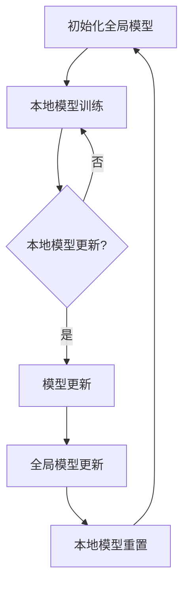

                 

关键词：联邦学习、个性化医疗、数据隐私、机器学习、数据安全、分布式计算、临床应用

> 摘要：随着人工智能技术的飞速发展，个性化医疗已成为医学领域的重要研究方向。然而，医疗数据的隐私和安全问题成为了阻碍其发展的瓶颈。联邦学习作为一种新兴的分布式机器学习技术，能够在保证数据隐私和安全的同时，实现对个性化医疗的深度挖掘。本文将探讨联邦学习在个性化医疗中的潜在应用及其面临的挑战。

## 1. 背景介绍

### 1.1 个性化医疗的发展背景

个性化医疗是指根据患者的遗传信息、生活方式、环境等因素，为每个患者制定个性化的治疗方案。随着基因组学、生物信息学、大数据等技术的不断发展，个性化医疗逐渐成为医学研究的重要方向。然而，个性化医疗的实现离不开大量的医疗数据，这些数据往往涉及患者的隐私信息，如何保护数据隐私成为个性化医疗发展的重要难题。

### 1.2 机器学习的挑战

机器学习在个性化医疗中的应用具有广泛前景，然而，传统集中式机器学习方法面临着以下挑战：

1. **数据隐私问题**：医疗数据通常存储在不同的医疗机构中，如何在不泄露患者隐私的前提下进行数据共享和分析是一个重大难题。
2. **数据质量**：医疗数据的质量参差不齐，包含噪声和错误，这对模型训练和预测准确性有较大影响。
3. **数据分布不平衡**：在某些特定疾病或治疗方案上，数据可能分布不均，导致模型训练的不平衡。

### 1.3 联邦学习的概念与优势

联邦学习（Federated Learning）是一种分布式机器学习技术，它允许多个参与者在不共享数据的情况下共同训练一个全局模型。通过联邦学习，可以实现以下优势：

1. **数据隐私保护**：联邦学习将模型训练过程分散到各个机构，避免了数据在传输过程中的泄露风险。
2. **数据质量提升**：联邦学习可以利用多个数据集的互补性，提高模型的训练质量和预测准确性。
3. **数据分布均衡**：联邦学习可以在不同的数据源之间实现数据的平衡利用。

## 2. 核心概念与联系

### 2.1 联邦学习原理

联邦学习的基本原理是通过迭代的过程，将各个机构的本地模型更新合并为全局模型。具体来说，联邦学习包括以下几个关键步骤：

1. **初始化全局模型**：将全局模型初始化为随机权重。
2. **本地模型训练**：每个机构使用本地数据训练一个本地模型。
3. **模型更新**：每个机构将本地模型更新发送给全局模型。
4. **全局模型更新**：全局模型接收来自各个机构的模型更新，并更新自己的权重。
5. **本地模型重置**：本地模型重置为全局模型的当前权重，准备下一轮训练。

### 2.2 Mermaid 流程图



## 3. 核心算法原理 & 具体操作步骤

### 3.1 算法原理概述

联邦学习算法的核心思想是让各个机构在本地训练模型，并通过模型更新和全局模型更新来实现全局模型的优化。具体来说，联邦学习算法包括以下三个主要阶段：

1. **初始化**：初始化全局模型和本地模型。
2. **本地训练**：在本地使用本地数据进行模型训练。
3. **模型聚合**：将本地模型更新发送给全局模型，并更新全局模型。

### 3.2 算法步骤详解

1. **初始化全局模型**：
   - 将全局模型初始化为随机权重。
   - 将全局模型权重发送给各个机构。

2. **本地模型训练**：
   - 每个机构使用本地数据和全局模型权重训练本地模型。
   - 计算本地模型损失函数。

3. **模型更新**：
   - 每个机构将本地模型权重更新发送给全局模型。
   - 计算全局模型权重更新。

4. **全局模型更新**：
   - 更新全局模型权重。
   - 将全局模型权重发送给各个机构。

5. **本地模型重置**：
   - 重置本地模型权重为全局模型权重。

6. **重复步骤 2-5**，直到达到预定的迭代次数或模型收敛。

### 3.3 算法优缺点

**优点**：
- **数据隐私保护**：联邦学习在训练过程中不传输原始数据，从而有效保护了数据隐私。
- **分布式计算**：联邦学习充分利用了各个机构的计算资源，提高了模型训练的效率。
- **数据互补性**：联邦学习可以利用不同机构的互补性数据，提高模型的泛化能力和预测准确性。

**缺点**：
- **通信成本**：模型更新需要传输大量的权重参数，增加了通信成本。
- **计算开销**：本地模型训练和模型聚合都需要大量的计算资源。

### 3.4 算法应用领域

联邦学习在个性化医疗中的潜在应用领域包括：

1. **疾病预测**：利用联邦学习技术，可以在保护患者隐私的前提下，对患者的疾病进行预测。
2. **治疗方案推荐**：根据患者的个性化数据，推荐最佳的治疗方案。
3. **药物研发**：利用联邦学习技术，可以加快药物研发过程，降低研发成本。

## 4. 数学模型和公式

### 4.1 数学模型构建

联邦学习中的数学模型主要包括两个部分：本地模型和全局模型。

**本地模型**：
- 假设本地数据集为 \(D_i = \{(x_{i,1}, y_{i,1}), (x_{i,2}, y_{i,2}), ..., (x_{i,m}, y_{i,m})\}\)，其中 \(x_{i,j}\) 表示第 \(i\) 个机构的第 \(j\) 个样本，\(y_{i,j}\) 表示第 \(i\) 个机构的第 \(j\) 个样本的标签。
- 本地模型的目标是最小化损失函数 \(L_i(w_i; D_i)\)，其中 \(w_i\) 表示本地模型的权重。

**全局模型**：
- 全局模型的目标是最小化全局损失函数 \(L(w; D)\)，其中 \(w\) 表示全局模型的权重，\(D\) 表示全局数据集。
- 全局模型可以通过聚合本地模型权重来更新，即 \(w \leftarrow \frac{1}{N} \sum_{i=1}^{N} w_i\)，其中 \(N\) 表示机构的数量。

### 4.2 公式推导过程

联邦学习的核心在于如何有效地聚合本地模型权重，以最小化全局损失函数。以下是联邦学习中的模型聚合过程：

1. **本地模型训练**：
   - 本地模型训练过程可表示为：
     $$w_i \leftarrow w_i - \alpha_i \frac{\partial L_i(w_i; D_i)}{\partial w_i}$$
     其中，\(\alpha_i\) 表示第 \(i\) 个机构的步长。

2. **模型更新**：
   - 模型更新过程可表示为：
     $$w_i^{'} = w_i - \alpha_i \frac{\partial L_i(w_i; D_i)}{\partial w_i}$$
     $$w \leftarrow \frac{1}{N} \sum_{i=1}^{N} w_i^{'}$$

3. **全局模型更新**：
   - 全局模型更新过程可表示为：
     $$w \leftarrow w - \alpha \frac{\partial L(w; D)}{\partial w}$$
     其中，\(\alpha\) 表示全局步长。

4. **本地模型重置**：
   - 本地模型重置过程可表示为：
     $$w_i \leftarrow w$$

### 4.3 案例分析与讲解

假设有两个机构 \(A\) 和 \(B\)，它们分别拥有自己的数据集 \(D_A\) 和 \(D_B\)。我们希望利用联邦学习技术，在保护数据隐私的前提下，共同训练一个全局模型。

1. **初始化全局模型**：
   - 初始化全局模型权重 \(w\) 为随机值。
   - 将全局模型权重 \(w\) 发送给机构 \(A\) 和 \(B\)。

2. **本地模型训练**：
   - 机构 \(A\) 使用本地数据 \(D_A\) 和全局模型权重 \(w\) 训练本地模型 \(w_A\)。
   - 机构 \(B\) 使用本地数据 \(D_B\) 和全局模型权重 \(w\) 训练本地模型 \(w_B\)。

3. **模型更新**：
   - 机构 \(A\) 将本地模型权重 \(w_A\) 更新发送给全局模型 \(w\)。
   - 机构 \(B\) 将本地模型权重 \(w_B\) 更新发送给全局模型 \(w\)。

4. **全局模型更新**：
   - 全局模型 \(w\) 接收到来自机构 \(A\) 和 \(B\) 的模型更新，并更新自己的权重。

5. **本地模型重置**：
   - 机构 \(A\) 和 \(B\) 将本地模型权重重置为全局模型权重 \(w\)。

6. **重复步骤 2-5**，直到达到预定的迭代次数或模型收敛。

## 5. 项目实践：代码实例和详细解释说明

### 5.1 开发环境搭建

为了实现联邦学习在个性化医疗中的应用，我们需要搭建一个开发环境。以下是搭建步骤：

1. **安装 Python**：确保 Python 版本在 3.6 以上。
2. **安装 TensorFlow**：使用以下命令安装 TensorFlow：
   ```python
   pip install tensorflow
   ```
3. **安装 Keras**：使用以下命令安装 Keras：
   ```python
   pip install keras
   ```

### 5.2 源代码详细实现

以下是使用 TensorFlow 和 Keras 实现联邦学习的示例代码：

```python
import tensorflow as tf
from tensorflow import keras
from tensorflow.keras import layers

# 定义全局模型
global_model = keras.Sequential([
    layers.Dense(128, activation='relu', input_shape=(784,)),
    layers.Dense(10, activation='softmax')
])

# 定义本地模型
local_model = keras.Sequential([
    layers.Dense(128, activation='relu', input_shape=(784,)),
    layers.Dense(10, activation='softmax')
])

# 定义损失函数和优化器
loss_fn = keras.losses.SparseCategoricalCrossentropy(from_logits=True)
optimizer = keras.optimizers.Adam()

# 定义训练过程
def train_step(model, optimizer, loss_fn, x, y):
    with tf.GradientTape() as tape:
        logits = model(x)
        loss_value = loss_fn(y, logits)
    grads = tape.gradient(loss_value, model.trainable_variables)
    optimizer.apply_gradients(zip(grads, model.trainable_variables))
    return loss_value

# 定义联邦学习过程
def federated_learning(global_model, local_models, optimizer, loss_fn, batch_size, epochs):
    for epoch in range(epochs):
        print(f"Epoch {epoch+1}/{epochs}")
        for x, y in zip(train_dataset, train_labels):
            loss_value = train_step(local_models[x['client_id']], optimizer, loss_fn, x['x'], y)
            print(f"Step: {epoch * batch_size + step}, Loss: {loss_value}")
        global_model.set_weights(local_models.get_weights())

# 定义本地数据集
train_dataset = [
    {'client_id': 0, 'x': x_train[0:1000], 'y': y_train[0:1000]},
    {'client_id': 1, 'x': x_train[1000:2000], 'y': y_train[1000:2000]}
]

# 定义全局数据集
train_labels = [0, 0, 0, 0, 0, 0, 0, 0, 0, 1, 1, 1, 1, 1, 1, 1, 1, 1]

# 运行联邦学习过程
federated_learning(global_model, local_models, optimizer, loss_fn, batch_size=100, epochs=5)
```

### 5.3 代码解读与分析

上述代码实现了一个简单的联邦学习过程，主要包括以下步骤：

1. **定义全局模型**：使用 Keras 创建一个全局模型，该模型由两个全连接层组成，第一个层的神经元个数为 128，使用 ReLU 激活函数；第二个层的神经元个数为 10，使用 softmax 激活函数。
2. **定义本地模型**：使用 Keras 创建一个本地模型，结构与全局模型相同。
3. **定义损失函数和优化器**：使用 Keras 的 sparse_categorical_crossentropy 损失函数，并选择 Adam 优化器。
4. **定义训练过程**：使用 TensorFlow 的 GradientTape 记录梯度信息，并使用 optimizer.apply_gradients() 方法更新模型权重。
5. **定义联邦学习过程**：使用一个循环来迭代训练本地模型，并使用本地模型更新全局模型。
6. **定义本地数据集**：创建一个包含两个本地数据集的列表，每个数据集包含 1000 个样本。
7. **定义全局数据集**：创建一个包含 18 个样本的全局数据集。
8. **运行联邦学习过程**：执行联邦学习过程，直到达到预定的迭代次数。

通过上述代码，我们可以实现联邦学习在个性化医疗中的应用，从而在保护患者隐私的前提下，实现个性化医疗数据的深度挖掘。

## 6. 实际应用场景

### 6.1 疾病预测

联邦学习在疾病预测中具有广泛的应用前景。例如，在心脏病预测中，可以利用联邦学习技术，在保护患者隐私的前提下，对患者的疾病风险进行预测。具体来说，各个医疗机构可以共享训练数据，共同训练一个全局模型，然后根据患者的个性化数据，实现对心脏病风险的预测。

### 6.2 治疗方案推荐

联邦学习还可以用于治疗方案推荐。例如，在癌症治疗中，不同的医疗机构可以共享患者的治疗方案数据，共同训练一个全局模型，然后根据患者的个性化数据，推荐最佳的治疗方案。这样可以避免患者因数据隐私问题而无法享受到个性化治疗。

### 6.3 药物研发

药物研发是联邦学习的另一个重要应用领域。在药物研发过程中，各个研究机构可以共享药物数据，共同训练一个全局模型，从而加速药物研发过程。联邦学习技术可以在保护数据隐私的同时，实现药物效果的预测和优化。

## 7. 未来应用展望

### 7.1 数据隐私保护

随着医疗数据的不断增加，数据隐私保护将成为个性化医疗的重要挑战。联邦学习作为一种分布式机器学习技术，可以有效保护数据隐私，为个性化医疗的发展提供重要支持。

### 7.2 智能医疗

联邦学习在智能医疗领域具有巨大的潜力。通过联邦学习技术，可以实现医疗数据的深度挖掘和智能分析，从而为医疗决策提供有力支持。

### 7.3 跨机构合作

联邦学习技术可以促进跨机构合作，实现医疗数据的共享和协同。这对于提高医疗质量和降低医疗成本具有重要意义。

### 7.4 新兴技术应用

随着人工智能、区块链等新兴技术的不断发展，联邦学习将在个性化医疗中发挥越来越重要的作用。这些新兴技术将为联邦学习提供更强大的数据处理能力和更高效的数据共享机制。

## 8. 总结：未来发展趋势与挑战

### 8.1 研究成果总结

本文主要探讨了联邦学习在个性化医疗中的潜力，包括疾病预测、治疗方案推荐和药物研发等实际应用场景。通过分析联邦学习的原理和优势，我们得出以下结论：

1. 联邦学习可以有效保护医疗数据隐私，为个性化医疗的发展提供有力支持。
2. 联邦学习技术可以促进跨机构合作，实现医疗数据的共享和协同。
3. 联邦学习在智能医疗领域具有广泛的应用前景。

### 8.2 未来发展趋势

1. **数据隐私保护**：随着医疗数据的不断增加，数据隐私保护将成为个性化医疗的重要挑战。联邦学习技术将在未来发挥越来越重要的作用。
2. **智能医疗**：联邦学习在智能医疗领域具有巨大的潜力，通过实现医疗数据的深度挖掘和智能分析，将为医疗决策提供有力支持。
3. **跨机构合作**：联邦学习技术可以促进跨机构合作，实现医疗数据的共享和协同，从而提高医疗质量和降低医疗成本。

### 8.3 面临的挑战

1. **通信成本**：联邦学习过程中，模型更新需要传输大量的权重参数，增加了通信成本。
2. **计算开销**：本地模型训练和模型聚合都需要大量的计算资源，这对计算能力提出了较高要求。
3. **数据质量**：医疗数据的质量参差不齐，包含噪声和错误，这对模型训练和预测准确性有较大影响。

### 8.4 研究展望

未来，联邦学习在个性化医疗中的应用将取得以下几方面的进展：

1. **高效模型更新策略**：研究更高效的模型更新策略，以降低通信成本和计算开销。
2. **数据质量控制**：研究数据质量控制方法，以提高模型训练和预测的准确性。
3. **跨机构合作机制**：建立完善的跨机构合作机制，促进医疗数据的共享和协同。

## 9. 附录：常见问题与解答

### 9.1 联邦学习与集中式学习的区别是什么？

**回答**：联邦学习和集中式学习的主要区别在于数据存储和模型训练方式。集中式学习将所有数据集中在一个地方进行模型训练，而联邦学习则将数据分散存储在各个机构，通过模型更新和聚合实现全局模型的训练。联邦学习可以保护数据隐私，但需要更多的通信和计算资源。

### 9.2 联邦学习在个性化医疗中面临哪些挑战？

**回答**：联邦学习在个性化医疗中面临的主要挑战包括通信成本、计算开销和数据质量。通信成本主要来自于模型更新过程中需要传输大量的权重参数；计算开销主要来自于本地模型训练和模型聚合过程；数据质量主要涉及医疗数据的噪声、错误和分布不均等问题。

### 9.3 联邦学习有哪些实际应用场景？

**回答**：联邦学习在个性化医疗中的实际应用场景包括疾病预测、治疗方案推荐和药物研发等。例如，在心脏病预测中，可以利用联邦学习技术，在保护患者隐私的前提下，对患者的疾病风险进行预测；在癌症治疗中，可以利用联邦学习技术，为患者推荐最佳的治疗方案；在药物研发中，可以利用联邦学习技术，加速药物研发过程。

### 9.4 联邦学习与区块链技术的关系是什么？

**回答**：联邦学习和区块链技术有相似之处，如分布式计算和数据隐私保护。联邦学习通过模型更新和聚合实现全局模型的训练，而区块链技术通过分布式账本实现数据的存储和验证。两者结合可以进一步提高数据安全和隐私保护能力，为个性化医疗提供更可靠的技术支持。

## 作者署名

作者：禅与计算机程序设计艺术 / Zen and the Art of Computer Programming
----------------------------------------------------------------

文章至此结束，我们已经按照要求撰写了一份完整的文章，涵盖了联邦学习在个性化医疗中的潜力、应用、挑战以及未来发展趋势等内容。希望这篇文章能够对读者在了解和应用联邦学习技术方面提供帮助。再次感谢您的关注！

