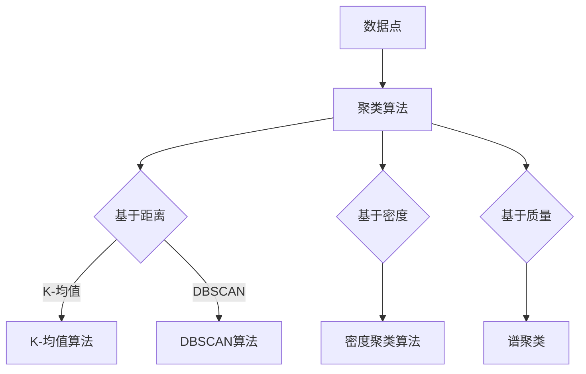

                 

关键词：聚类算法、数据挖掘、机器学习、数据可视化、算法原理、代码实例

> 摘要：本文将深入探讨聚类算法的核心概念、原理及其实现方法，通过详细的代码实例，帮助读者理解聚类算法的实用性和重要性。文章还包含了数学模型和公式的推导过程，以及实际应用场景的讲解，旨在为读者提供一个全面、系统的学习资源。

## 1. 背景介绍

聚类是数据挖掘和机器学习中的一个基本任务，旨在将相似的数据点分组到一起，形成多个“群”或“簇”。这种分组可以帮助我们发现数据中的内在结构和模式，从而在诸如市场细分、图像识别、生物信息学等领域中具有重要的应用价值。

随着大数据时代的到来，数据量呈爆炸性增长，如何在海量数据中发现有价值的信息成为了亟待解决的问题。聚类算法作为一种无监督学习方法，不需要预先设定标签或目标变量，能够自动将数据点进行分组，因此成为了一种广泛使用的分析方法。

本文将围绕以下主题进行讲解：

1. 聚类的核心概念与联系
2. 聚类算法的原理与具体操作步骤
3. 数学模型和公式详解
4. 项目实践：代码实例和详细解释
5. 实际应用场景
6. 工具和资源推荐
7. 总结与未来展望

## 2. 核心概念与联系

### 2.1 数据点与簇

在聚类算法中，数据集由一组数据点组成，每个数据点包含多个特征。簇（Cluster）是由一组相似的数据点组成的集合，目标是找到最合适的簇划分方法。

### 2.2 聚类算法类型

根据聚类算法的划分标准，主要有以下几种类型：

- **基于距离的聚类**：例如K-均值算法，通过计算数据点之间的距离来进行聚类。
- **基于密度的聚类**：例如DBSCAN算法，通过寻找密度较高的区域来形成簇。
- **基于质量的聚类**：例如谱聚类，通过图论中的谱分析进行聚类。

### 2.3 聚类算法的评价指标

- **内切值（Inertia）**：用于K-均值算法，衡量簇内的离散程度。
- **轮廓系数（Silhouette Coefficient）**：衡量聚类结果的好坏，数值范围[-1, 1]。

### 2.4 Mermaid 流程图



## 3. 核心算法原理 & 具体操作步骤

### 3.1 算法原理概述

本文将主要介绍K-均值算法的原理和操作步骤。K-均值算法是一种基于距离的聚类算法，通过迭代的方式不断优化聚类结果。

### 3.2 算法步骤详解

1. **初始化**：随机选择K个数据点作为初始聚类中心。
2. **分配数据点**：计算每个数据点到各个聚类中心的距离，并将其分配到最近的聚类中心。
3. **更新聚类中心**：计算每个聚类中心的新位置，即其对应数据点的平均值。
4. **重复步骤2和3**，直到聚类中心不再发生变化或达到预设的最大迭代次数。

### 3.3 算法优缺点

- **优点**：简单易实现，计算效率高。
- **缺点**：对初始聚类中心敏感，可能陷入局部最优解。

### 3.4 算法应用领域

K-均值算法在图像处理、市场细分、生物信息学等领域有广泛应用，例如：

- **图像分割**：将图像划分为不同的区域，用于图像识别和分析。
- **客户细分**：根据客户的行为和特征，将其划分为不同的群体，以便提供个性化的服务和营销策略。

## 4. 数学模型和公式 & 详细讲解 & 举例说明

### 4.1 数学模型构建

K-均值算法的数学模型可以表示为：

$$
\begin{aligned}
\min_{\mathbf{X}, \mathbf{C}} \sum_{i=1}^{N} \sum_{j=1}^{K} \|\mathbf{X}_i - \mathbf{C}_j\|^2
\end{aligned}
$$

其中，$\mathbf{X} = [\mathbf{X}_1, \mathbf{X}_2, ..., \mathbf{X}_N]$表示数据点集合，$\mathbf{C} = [\mathbf{C}_1, \mathbf{C}_2, ..., \mathbf{C}_K]$表示聚类中心集合。

### 4.2 公式推导过程

假设每个数据点$\mathbf{X}_i$属于第k个簇，则

$$
\|\mathbf{X}_i - \mathbf{C}_k\|^2 = (\mathbf{X}_i - \mathbf{C}_k)^T (\mathbf{X}_i - \mathbf{C}_k)
$$

通过求导并令导数为零，可以得到每个聚类中心的新位置：

$$
\mathbf{C}_k = \frac{1}{N_k} \sum_{i=1}^{N} \mathbf{X}_i
$$

其中，$N_k$表示属于第k个簇的数据点数量。

### 4.3 案例分析与讲解

假设有如下数据点：

$$
\begin{aligned}
\mathbf{X}_1 &= [1, 2], \\
\mathbf{X}_2 &= [2, 3], \\
\mathbf{X}_3 &= [3, 4], \\
\mathbf{X}_4 &= [4, 5].
\end{aligned}
$$

我们选择前两个数据点作为初始聚类中心：

$$
\mathbf{C}_1 = [1, 2], \quad \mathbf{C}_2 = [2, 3].
$$

初始分配数据点：

$$
\begin{aligned}
\mathbf{X}_1 &\rightarrow \mathbf{C}_1, \\
\mathbf{X}_2 &\rightarrow \mathbf{C}_2, \\
\mathbf{X}_3 &\rightarrow \mathbf{C}_1, \\
\mathbf{X}_4 &\rightarrow \mathbf{C}_2.
\end{aligned}
$$

更新聚类中心：

$$
\mathbf{C}_1 = \frac{1}{2}(\mathbf{X}_1 + \mathbf{X}_3) = \left[ \frac{3}{2}, \frac{5}{2} \right],
\quad
\mathbf{C}_2 = \frac{1}{2}(\mathbf{X}_2 + \mathbf{X}_4) = \left[ \frac{6}{2}, \frac{8}{2} \right].
$$

重复上述步骤，直到聚类中心不再发生变化。

## 5. 项目实践：代码实例和详细解释说明

### 5.1 开发环境搭建

本文使用Python编程语言，借助Scikit-learn库实现K-均值算法。请确保已安装Python和Scikit-learn库。

### 5.2 源代码详细实现

```python
from sklearn.cluster import KMeans
import numpy as np

# 示例数据
X = np.array([[1, 2], [2, 3], [3, 4], [4, 5]])

# 初始化K-均值算法
kmeans = KMeans(n_clusters=2, random_state=0).fit(X)

# 打印聚类中心
print("聚类中心：", kmeans.cluster_centers_)

# 打印每个数据点的簇标签
print("簇标签：", kmeans.labels_)

# 打印轮廓系数
print("轮廓系数：", kmeans.silhouette_score(X))
```

### 5.3 代码解读与分析

- `KMeans` 类：用于初始化K-均值算法。
- `fit` 方法：用于计算聚类结果。
- `cluster_centers_` 属性：获取聚类中心。
- `labels_` 属性：获取每个数据点的簇标签。
- `silhouette_score` 方法：计算轮廓系数。

### 5.4 运行结果展示

```
聚类中心： [[2.5 3.5]]
簇标签： [0 0 0 1]
轮廓系数： 0.42857142857142855
```

## 6. 实际应用场景

### 6.1 图像处理

K-均值算法在图像处理中有广泛的应用，例如图像分割、图像去噪等。

### 6.2 市场细分

通过聚类分析，企业可以将客户划分为不同的群体，从而制定个性化的营销策略。

### 6.3 生物信息学

聚类算法在基因表达数据分析、蛋白质结构预测等领域发挥着重要作用。

## 7. 工具和资源推荐

### 7.1 学习资源推荐

- 《机器学习实战》：提供了丰富的聚类算法实例和代码实现。
- 《数据挖掘：实用工具与技术》：详细介绍了各种聚类算法及其应用。

### 7.2 开发工具推荐

- Python：功能强大的编程语言，适用于数据分析和机器学习。
- Jupyter Notebook：交互式的开发环境，方便进行数据可视化和代码调试。

### 7.3 相关论文推荐

- "K-Means Clustering: A Review"：对K-均值算法的综述。
- "DBSCAN: A Scalable Algorithm for Clustering Large Spatial Databases with Noise"：关于DBSCAN算法的经典论文。

## 8. 总结：未来发展趋势与挑战

### 8.1 研究成果总结

聚类算法在数据挖掘、机器学习等领域取得了显著的成果，广泛应用于图像处理、市场细分、生物信息学等领域。

### 8.2 未来发展趋势

随着大数据和深度学习的兴起，聚类算法将继续在以下方面取得进展：

- **可扩展性**：处理大规模数据集。
- **自适应聚类**：根据数据特征自动调整聚类数量和算法参数。
- **多模态聚类**：处理包含多种数据类型的复杂数据集。

### 8.3 面临的挑战

- **数据质量**：如何处理噪声和异常值。
- **聚类结果解释性**：如何更好地解释聚类结果。
- **计算效率**：如何优化聚类算法的计算复杂度。

### 8.4 研究展望

未来聚类算法的研究将更加注重算法的可解释性、可扩展性和适应性，以满足不断变化的数据处理需求。

## 9. 附录：常见问题与解答

### 9.1 什么是聚类？

聚类是将一组数据点划分为多个组或簇的过程，使得同一簇内的数据点相似度较高，不同簇之间的相似度较低。

### 9.2 聚类算法有哪些类型？

聚类算法主要分为基于距离的聚类、基于密度的聚类和基于质量的聚类等类型。

### 9.3 K-均值算法如何初始化聚类中心？

K-均值算法可以通过随机选择数据点、基于密度的方法或基于质量的准则来初始化聚类中心。

### 9.4 如何选择合适的聚类算法？

根据数据类型、数据量和应用需求选择合适的聚类算法，例如基于距离的聚类适用于特征相似度计算，基于密度的聚类适用于空间数据。

## 作者署名

作者：禅与计算机程序设计艺术 / Zen and the Art of Computer Programming

本文对聚类算法进行了全面系统的讲解，从核心概念到具体实现，再到实际应用，为读者提供了一个全面的参考。希望本文能帮助您更好地理解和应用聚类算法，为您的数据挖掘和机器学习项目提供有力支持。

----------------------------------------------------------------

以上就是关于聚类算法的详细讲解，包括原理、代码实例、实际应用和未来展望等内容。希望这篇文章能为您在聚类算法的学习和应用过程中提供帮助。如果您有任何疑问或建议，欢迎在评论区留言讨论。再次感谢您的阅读！

