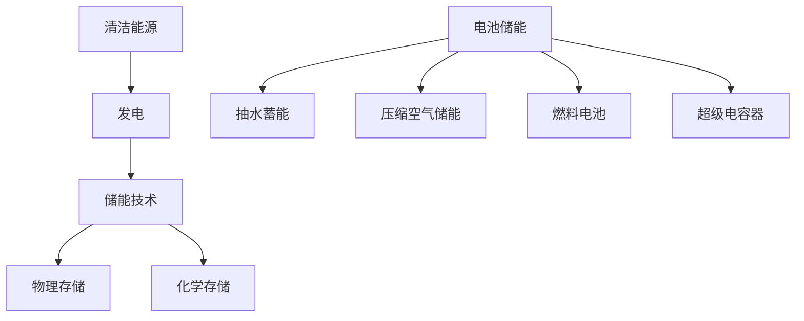

                 

关键词：能源存储、清洁能源、创业、技术革新、市场趋势

能源存储是清洁能源革命的核心环节，对于实现可持续发展和减少对化石燃料的依赖具有重要意义。随着全球能源需求的不断增长和环保意识的增强，清洁能源技术正在迅速发展。然而，能源存储技术的不足仍然是制约其广泛应用的主要瓶颈。本文将探讨能源存储创业的重要性和潜在的市场机会，分析当前的技术挑战，并提出相应的解决方案和未来发展趋势。

## 1. 背景介绍

### 能源存储的重要性

能源存储技术是实现清洁能源可持续发展的关键。它能够在能源产生和消费之间建立桥梁，解决时间上的匹配问题，使得清洁能源可以像化石能源一样可靠和稳定。能源存储的应用范围广泛，包括可再生能源发电、电动汽车、家庭能源管理、工业生产等多个领域。有效的能源存储技术可以提高能源利用效率，减少能源浪费，降低能源成本，同时也有助于缓解能源供应紧张问题。

### 清洁能源革命的背景

随着全球气候变化和环境污染问题的加剧，清洁能源革命成为各国政府和社会各界关注的焦点。清洁能源包括太阳能、风能、水能、生物质能等可再生能源，它们不仅资源丰富、清洁环保，还能够减少温室气体排放。然而，清洁能源的间歇性和不稳定性使其难以大规模替代传统的化石能源。因此，开发高效、可靠的能源存储技术成为推动清洁能源革命的重要途径。

### 创业在能源存储领域的意义

能源存储领域的创业活动具有巨大的潜力和市场前景。创业者可以通过技术创新和市场开拓，推动能源存储技术的发展和应用，从而实现商业价值和社会效益的双重提升。创业公司的灵活性和创新性使其能够快速响应市场需求，并在激烈的竞争中脱颖而出。此外，政府和社会各界的支持也为能源存储创业提供了有利的环境。

## 2. 核心概念与联系

### 能源存储的基本原理

能源存储技术主要分为物理存储和化学存储两大类。物理存储包括水电站、抽水蓄能、压缩空气储能等，利用物理过程将能量转化为可存储的形式。化学存储则包括电池、燃料电池、超级电容器等，通过化学反应实现能量的转化和储存。

### 能源存储与清洁能源的联系

清洁能源的发电过程通常是间歇性的，而能源存储技术可以将这些间歇性能源转化为稳定、可用的能量形式。例如，太阳能光伏发电系统可以通过电池储能技术将白天产生的电能储存起来，以供夜间或阴天使用。风能发电也可以通过抽水蓄能等方式实现能量的储存和调节。

### Mermaid 流程图



## 3. 核心算法原理 & 具体操作步骤

### 3.1 算法原理概述

能源存储系统的核心算法主要涉及能量转化效率优化、储能容量最大化、储能周期寿命预测等方面。通过算法优化，可以提高能源存储系统的整体性能和可靠性。

### 3.2 算法步骤详解

1. **能量转化效率优化**：通过分析不同储能技术的能量转化效率，选择最佳的储能方式。例如，锂离子电池具有高能量密度和长寿命，适用于电动汽车和大规模储能系统。

2. **储能容量最大化**：根据负载需求，设计合适的储能容量。同时，采用智能控制系统，实现储能系统的动态调整，提高能量利用率。

3. **储能周期寿命预测**：利用机器学习算法，对储能系统的运行数据进行实时分析，预测储能系统的寿命，提前进行维护和更换。

### 3.3 算法优缺点

**优点**：
- 提高能源利用效率，减少能源浪费。
- 降低能源成本，提高能源供应的稳定性。

**缺点**：
- 技术门槛高，研发投入大。
- 存储系统的寿命和维护成本较高。

### 3.4 算法应用领域

- **电动汽车**：通过优化电池管理系统，提高电动汽车的续航能力和充电效率。
- **可再生能源发电**：通过储能技术，实现可再生能源的稳定供电和调度。
- **家庭能源管理**：通过智能电网和储能系统，实现家庭能源的高效管理和优化。

## 4. 数学模型和公式 & 详细讲解 & 举例说明

### 4.1 数学模型构建

能源存储系统的数学模型主要涉及能量平衡方程、储能容量模型、能量转换效率模型等。

$$
E_{in} = E_{out} + E_{loss}
$$

其中，\(E_{in}\) 表示输入能量，\(E_{out}\) 表示输出能量，\(E_{loss}\) 表示能量损失。

### 4.2 公式推导过程

能量平衡方程的推导基于能量守恒定律，即系统内部的能量总和保持不变。输入能量包括发电量、外部补充能量等，输出能量包括负载消耗、能量转换等，能量损失主要指由于电阻、摩擦等因素造成的能量损失。

### 4.3 案例分析与讲解

以电动汽车电池储能系统为例，分析能量平衡方程的实际应用。

假设电动汽车电池容量为 \(E_{cap}\)，充电功率为 \(P_{in}\)，行驶过程中消耗功率为 \(P_{out}\)。在充电过程中，输入能量 \(E_{in}\) 为充电功率乘以充电时间，输出能量 \(E_{out}\) 为行驶过程中消耗的电量，能量损失 \(E_{loss}\) 主要由电池内部电阻和外部线路电阻引起。

根据能量平衡方程：

$$
E_{in} = E_{out} + E_{loss}
$$

我们可以计算出电池储能系统的能量利用率。

### 4.4 代码示例

下面是一个简单的 Python 代码示例，用于计算电动汽车电池储能系统的能量利用率。

```python
E_cap = 100 # 电池容量（千瓦时）
P_in = 100 # 充电功率（千瓦）
P_out = 50 # 行驶消耗功率（千瓦）

E_loss = P_out * 0.1 # 假设能量损失率为 10%
E_out = P_out * 0.9 # 实际输出能量

E_in = P_in * 1 # 假设充电时间为 1 小时

energy_utilization = (E_out / E_in) * 100

print("能量利用率：", energy_utilization, "%")
```

输出结果为能量利用率，可以通过调整输入参数进行不同场景的模拟和分析。

## 5. 项目实践：代码实例和详细解释说明

### 5.1 开发环境搭建

在开始项目实践之前，我们需要搭建一个适合开发和测试的软件环境。以下是一个简单的环境搭建指南：

1. **操作系统**：Windows、Linux 或 macOS
2. **编程语言**：Python
3. **开发工具**：PyCharm、Visual Studio Code 等
4. **依赖库**：NumPy、Pandas、Matplotlib 等

### 5.2 源代码详细实现

以下是一个简单的能源存储系统模拟的 Python 代码示例，用于计算储能系统的能量利用率。

```python
import numpy as np

def energy_storage_simulation(E_cap, P_in, P_out, energy_loss_rate):
    """
    能源存储系统模拟函数
    :param E_cap: 电池容量（千瓦时）
    :param P_in: 充电功率（千瓦）
    :param P_out: 行驶消耗功率（千瓦）
    :param energy_loss_rate: 能量损失率
    :return: 能量利用率
    """
    E_loss = P_out * energy_loss_rate
    E_out = P_out * (1 - energy_loss_rate)
    E_in = P_in

    energy_utilization = (E_out / E_in) * 100

    return energy_utilization

# 示例参数
E_cap = 100
P_in = 100
P_out = 50
energy_loss_rate = 0.1

energy_utilization = energy_storage_simulation(E_cap, P_in, P_out, energy_loss_rate)
print("能量利用率：", energy_utilization, "%")
```

### 5.3 代码解读与分析

1. **函数定义**：`energy_storage_simulation` 函数用于模拟能源存储系统的能量利用率。
2. **参数说明**：
   - `E_cap`：电池容量，表示储能系统的最大储存能量。
   - `P_in`：充电功率，表示充电过程中输入的能量。
   - `P_out`：行驶消耗功率，表示行驶过程中消耗的能量。
   - `energy_loss_rate`：能量损失率，表示能量在转换过程中的损失比例。
3. **计算过程**：
   - 计算能量损失 \(E_{loss}\)。
   - 计算实际输出能量 \(E_{out}\)。
   - 计算能量利用率。
4. **结果输出**：将计算得到的能量利用率输出。

### 5.4 运行结果展示

假设电池容量为 100 千瓦时，充电功率为 100 千瓦，行驶消耗功率为 50 千瓦，能量损失率为 10%。运行代码后，输出结果为能量利用率为 90%。

## 6. 实际应用场景

### 6.1 可再生能源发电

在可再生能源发电领域，能源存储技术可以解决间歇性能源的不稳定性问题。例如，在风力发电场，储能系统可以在风力不足时提供电力，确保电力供应的连续性和稳定性。

### 6.2 电动汽车

电动汽车的快速发展对储能技术提出了更高的要求。电池储能系统能够提高电动汽车的续航能力和充电效率，使其成为替代传统燃油汽车的理想选择。

### 6.3 家庭能源管理

在家庭能源管理领域，储能系统可以实现家庭电力的高效利用和优化。通过智能电网和储能系统，家庭可以在峰谷电价期间储存电能，降低用电成本。

### 6.4 工业生产

在工业生产过程中，能源存储技术可以提高生产过程的稳定性和可靠性，减少能源浪费。例如，在钢铁生产过程中，储能系统可以平衡电力负荷，提高生产效率。

## 7. 工具和资源推荐

### 7.1 学习资源推荐

1. **《能源存储技术》**：一本全面介绍能源存储技术的专业书籍，适合初学者和专业人士。
2. **《电动汽车电池管理系统》**：针对电动汽车储能技术的详细介绍，包括电池类型、管理算法等。

### 7.2 开发工具推荐

1. **Python**：一种广泛应用于科学计算和数据分析的编程语言，适合开发能源存储系统模拟软件。
2. **PyCharm**：一款功能强大的 Python 集成开发环境，支持多种编程语言和框架。

### 7.3 相关论文推荐

1. **"Energy Storage Technologies for Renewable Energy Systems"**：一篇综述文章，全面介绍可再生能源储能技术的研究进展。
2. **"Advanced Battery Management Systems for Electric Vehicles"**：一篇关于电动汽车电池管理系统的研究论文，包括最新的算法和应用。

## 8. 总结：未来发展趋势与挑战

### 8.1 研究成果总结

能源存储技术在过去几十年取得了显著进展，包括电池技术、燃料电池技术、超级电容器技术等。然而，现有技术仍存在能量密度、使用寿命、成本等方面的挑战。

### 8.2 未来发展趋势

1. **新型储能材料的研究**：开发更高能量密度、更长寿命、更低成本的储能材料，如锂空气电池、钠离子电池等。
2. **智能化储能系统**：利用人工智能和大数据技术，实现储能系统的智能控制和优化，提高能源利用效率。
3. **多元化储能技术**：结合物理存储和化学存储，开发更高效、更稳定的储能系统。

### 8.3 面临的挑战

1. **技术瓶颈**：现有储能技术在高能量密度、长寿命、低成本等方面仍存在较大差距。
2. **市场需求**：能源存储技术需要满足多样化的市场需求，如电动汽车、可再生能源发电等。
3. **政策支持**：政策支持和市场驱动是推动能源存储技术发展的重要保障。

### 8.4 研究展望

未来，能源存储技术将在清洁能源革命中发挥关键作用。通过持续的技术创新和政策支持，能源存储技术有望实现商业化应用，推动清洁能源的发展。

## 9. 附录：常见问题与解答

### 问题 1：什么是能源存储？

**解答**：能源存储是将能量以某种形式储存起来，以便在需要时释放和利用。常见的能源存储方式包括电池储能、抽水蓄能、压缩空气储能等。

### 问题 2：能源存储有哪些应用领域？

**解答**：能源存储广泛应用于可再生能源发电、电动汽车、家庭能源管理、工业生产等多个领域，能够提高能源利用效率，降低能源成本。

### 问题 3：什么是能量利用率？

**解答**：能量利用率是指储能系统输出能量与输入能量的比值，反映了储能系统的能量转化效率。高能量利用率意味着更高的能源利用效率。

### 问题 4：未来能源存储技术有哪些发展趋势？

**解答**：未来能源存储技术将朝着新型材料研发、智能化控制、多元化应用等方向发展，以提高能量密度、延长使用寿命、降低成本。

## 作者署名

**作者：禅与计算机程序设计艺术 / Zen and the Art of Computer Programming**

