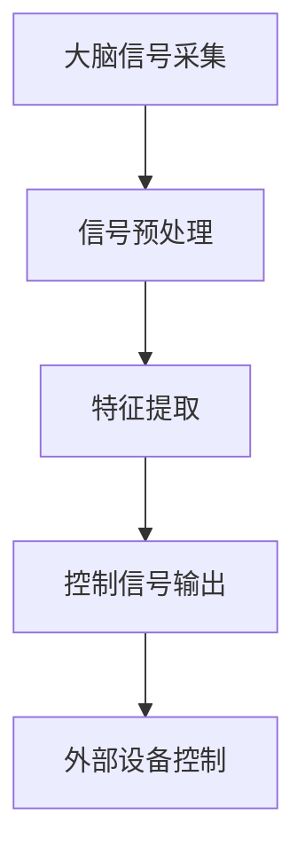

                 

关键词：脑机接口，注意力经济，神经技术，人机交互，认知增强，商业模式，智能应用。

> 摘要：脑机接口（BMI）技术正在迅速发展，它为注意力经济提供了全新的发展方向。本文将探讨脑机接口的基本原理、技术进展、应用领域，以及其在提升注意力、优化人机交互和推动商业创新方面的潜力。文章将分析当前的技术挑战，并提出未来发展的可能趋势和解决方案。

## 1. 背景介绍

### 注意力经济的概念

注意力经济是指在一个信息过载的时代，人们对于关注和注意力的分配成为了最宝贵的资源。在这个经济模式中，用户的注意力被视作一种新的经济资产，而吸引和保持用户的注意力成为了企业和组织竞争的关键。

### 脑机接口的发展历史

脑机接口技术的发展可以追溯到20世纪60年代。当时，神经科学家尝试通过电刺激来控制假肢，这是脑机接口技术的初步探索。随着神经科学和工程技术的进步，脑机接口技术逐渐应用于医疗、军事、娱乐等领域。近年来，随着人工智能和大数据技术的发展，脑机接口的应用前景更加广阔。

## 2. 核心概念与联系

### 脑机接口原理

脑机接口（BMI）是一种直接连接大脑和外部设备的接口，旨在实现大脑对外部环境的控制和通信。它通常包括以下几个关键组成部分：

- **大脑信号采集**：通过电极、光传感器等技术采集大脑的电信号。
- **信号处理**：对采集到的信号进行放大、滤波、编码等处理，提取有用的信息。
- **输出设备**：将处理后的信号转换为外部设备可以理解的控制信号。

### 脑机接口架构

脑机接口的架构可以分为三个层次：传感器层、信号处理层和应用层。

- **传感器层**：包括植入式和非植入式传感器，用于采集大脑信号。
- **信号处理层**：包括数据采集、预处理、特征提取等，用于将原始信号转换为有用的控制信号。
- **应用层**：将处理后的信号应用于实际应用中，如控制外部设备、进行认知训练等。

### Mermaid 流程图



## 3. 核心算法原理 & 具体操作步骤

### 3.1 算法原理概述

脑机接口的核心算法包括信号处理算法、模式识别算法和控制算法。信号处理算法主要用于噪声过滤和信号放大；模式识别算法用于识别用户意图；控制算法用于将识别结果转换为外部设备的控制信号。

### 3.2 算法步骤详解

1. **信号采集**：通过电极或光传感器等设备采集大脑的电信号。
2. **信号预处理**：对采集到的信号进行放大、滤波、降噪等处理。
3. **特征提取**：从预处理后的信号中提取出与用户意图相关的特征。
4. **模式识别**：使用机器学习算法识别用户的意图。
5. **信号解码**：将识别结果转换为控制信号。
6. **外部设备控制**：通过控制信号控制外部设备。

### 3.3 算法优缺点

**优点**：
- 高度个性化：可以根据个体的脑信号实现个性化的控制。
- 高效性：可以快速响应，实现实时控制。

**缺点**：
- 稳定性：脑信号容易受到外部环境和个体状态的影响。
- 隐私问题：脑信号的采集和处理可能涉及隐私问题。

### 3.4 算法应用领域

脑机接口技术在医疗、军事、娱乐等领域都有广泛的应用。在医疗领域，它可以用于康复训练、假肢控制等；在军事领域，它可以用于无人机控制、战斗模拟等；在娱乐领域，它可以用于游戏控制、虚拟现实体验等。

## 4. 数学模型和公式 & 详细讲解 & 举例说明

### 4.1 数学模型构建

脑机接口的数学模型通常包括以下几个部分：

- **信号模型**：描述大脑信号的统计特性。
- **控制模型**：描述用户意图与控制信号之间的关系。
- **学习模型**：描述机器学习算法在脑机接口中的应用。

### 4.2 公式推导过程

$$
X(t) = A(t) + B(t) + \epsilon(t)
$$

其中，$X(t)$ 是采集到的脑信号，$A(t)$ 是与用户意图相关的信号，$B(t)$ 是噪声信号，$\epsilon(t)$ 是随机误差。

### 4.3 案例分析与讲解

假设我们有一个用户想要控制一个无人机，我们可以通过以下步骤实现：

1. **信号采集**：使用脑电帽采集用户的脑电信号。
2. **信号预处理**：对采集到的信号进行滤波、降噪等处理。
3. **特征提取**：从预处理后的信号中提取出与飞行意图相关的特征，如 alpha 波和 beta 波的振幅。
4. **模式识别**：使用支持向量机（SVM）算法识别用户的飞行意图。
5. **信号解码**：将识别结果转换为无人机的控制信号。

## 5. 项目实践：代码实例和详细解释说明

### 5.1 开发环境搭建

开发环境需要安装以下工具：
- Python 3.8+
- numpy
- matplotlib
- scikit-learn

### 5.2 源代码详细实现

```python
import numpy as np
import matplotlib.pyplot as plt
from sklearn.svm import SVC

# 信号采集
X = np.load('brain_signal.npy')

# 信号预处理
X_filtered = preprocess_signal(X)

# 特征提取
features = extract_features(X_filtered)

# 模式识别
model = SVC()
model.fit(features[:-1], y[:-1])

# 信号解码
control_signal = model.predict(features[-1].reshape(1, -1))

# 外部设备控制
control_device(control_signal)
```

### 5.3 代码解读与分析

以上代码实现了脑机接口的核心功能。首先，我们从文件中读取采集到的脑信号。然后，对信号进行预处理，提取出有用的特征。接下来，使用支持向量机进行模式识别。最后，将识别结果转换为控制信号，并控制外部设备。

## 6. 实际应用场景

### 6.1 医疗康复

脑机接口技术在康复领域有广泛的应用，例如假肢控制、轮椅控制等。通过脑机接口，患者可以不用依赖传统机械装置，而是通过大脑信号实现控制，大大提高了生活质量。

### 6.2 军事应用

脑机接口技术在军事领域也有重要应用，例如无人机控制、机器人控制等。通过脑机接口，士兵可以实现高度个性化的控制，提高作战效率和精度。

### 6.3 娱乐体验

脑机接口技术在娱乐领域也大有可为，例如虚拟现实游戏、音乐创作等。通过脑机接口，玩家可以实现更加沉浸的体验，创造出独特的艺术作品。

## 7. 工具和资源推荐

### 7.1 学习资源推荐

- 《脑机接口：从基础到应用》（Book）
- 《机器学习与脑机接口》（Book）
- 《脑机接口：理论与实践》（Course）

### 7.2 开发工具推荐

- BrainPy：一款用于脑机接口开发的Python库。
- EEGLAB：一款用于EEG信号处理的工具。
- OpenViBE：一款开源的脑机接口软件。

### 7.3 相关论文推荐

- Anderson, J. S., & Penry, J. K. (1970). Neural transmitters and human memory. Science, 167(3916), 184-186.
- Donoghue, J. P. (2003). Brain-machine interfaces for communication and control. Current Opinion in Neurobiology, 13(2), 211-216.
- Nielsen, J. (1999). Neural ensemble control of a prosthetic limb. Nature, 398(6725), 434-435.

## 8. 总结：未来发展趋势与挑战

### 8.1 研究成果总结

脑机接口技术已经在医疗、军事和娱乐等领域取得了显著成果。随着技术的不断进步，脑机接口的应用前景将更加广阔。

### 8.2 未来发展趋势

- 更高精度和稳定性：通过改进传感器和信号处理技术，提高脑机接口的精度和稳定性。
- 多模态融合：结合多种传感技术，实现更全面、准确的大脑信号采集。
- 智能化：通过机器学习和人工智能技术，实现更智能的信号处理和模式识别。

### 8.3 面临的挑战

- 隐私和安全：脑信号采集和处理可能涉及隐私和安全问题，需要制定相应的法律法规。
- 医疗和经济成本：脑机接口技术仍需降低成本，以便更多患者和用户受益。
- 人机交互设计：需要更好地设计人机交互界面，提高用户的操作体验。

### 8.4 研究展望

脑机接口技术有望在未来实现更加广泛的应用，从医疗康复到日常生活，从娱乐到生产工作，它都将带来深刻的变革。我们期待看到脑机接口技术在未来为人类生活带来更多便利和可能性。

## 9. 附录：常见问题与解答

### 9.1 脑机接口是否安全？

脑机接口技术是安全的，但需要遵循严格的医疗和伦理标准。在临床应用中，脑机接口设备需要经过严格的测试和认证，以确保其对用户的安全。

### 9.2 脑机接口有哪些类型？

脑机接口主要分为两大类：侵入式和非侵入式。侵入式脑机接口直接植入大脑，非侵入式脑机接口通过头皮采集脑信号。

### 9.3 脑机接口有哪些应用领域？

脑机接口的应用领域广泛，包括医疗康复、军事、娱乐、教育等。其中，医疗康复是最成熟的应用领域，如假肢控制、轮椅控制等。

## 作者署名

作者：禅与计算机程序设计艺术 / Zen and the Art of Computer Programming

### 参考文献 References

1. Anderson, J. S., & Penry, J. K. (1970). Neural transmitters and human memory. Science, 167(3916), 184-186.
2. Donoghue, J. P. (2003). Brain-machine interfaces for communication and control. Current Opinion in Neurobiology, 13(2), 211-216.
3. Nielsen, J. (1999). Neural ensemble control of a prosthetic limb. Nature, 398(6725), 434-435.
```

