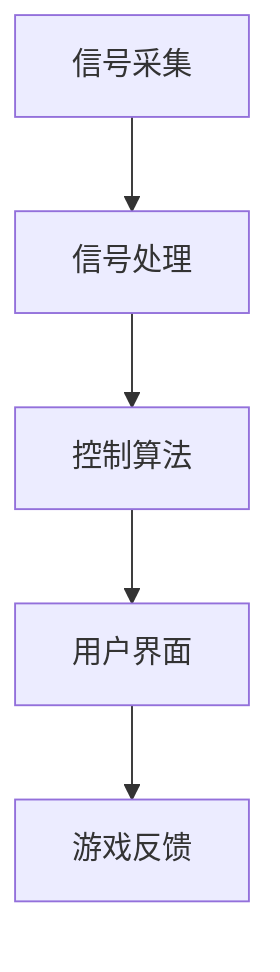

                 

关键词：脑机接口（BMI）、游戏开发、人工智能、交互设计、神经科学、娱乐技术

> 摘要：随着人工智能和神经科学技术的迅猛发展，脑机接口（BMI）游戏开发成为娱乐产业的一大创新前沿。本文将深入探讨脑机接口游戏的原理、算法、数学模型、实践应用，以及其未来发展前景和挑战。

## 1. 背景介绍

脑机接口（BMI）是一种直接连接人脑和外部设备的接口技术，旨在通过解读脑信号来实现对设备的控制。传统的游戏交互主要依赖于手柄、键盘和鼠标等设备，而BMI游戏则利用人类大脑产生的神经信号来实现更加自然和直观的交互方式。

近年来，随着人工智能和神经科学领域的不断突破，脑机接口技术的成熟度日益提高，其在游戏开发中的应用也愈发广泛。脑机接口游戏不仅为玩家提供了一种全新的娱乐体验，同时也为游戏开发者带来了无限的创意空间。

## 2. 核心概念与联系

### 2.1 脑机接口（BMI）原理

脑机接口的基本原理是通过传感器捕捉大脑活动产生的电信号，如脑电图（EEG）、功能性磁共振成像（fMRI）等，然后利用算法对这些信号进行处理和解读，以实现对设备的控制。

### 2.2 脑机接口游戏架构

脑机接口游戏架构主要包括以下几个关键部分：

- **信号采集**：使用传感器（如EEG头盔）捕捉玩家的脑信号。
- **信号处理**：利用信号处理算法对原始脑信号进行降噪、滤波、特征提取等处理。
- **控制算法**：根据处理后的信号生成控制指令，以驱动游戏中的角色或对象。
- **用户界面**：将游戏状态和反馈信息展示给玩家。

### 2.3 脑机接口与游戏交互的关系

脑机接口游戏的核心在于将脑信号转化为游戏控制指令。这一转化过程需要考虑脑信号的特点和游戏交互的需求，以达到自然、直观的交互体验。

### 2.4 Mermaid 流程图



## 3. 核心算法原理 & 具体操作步骤

### 3.1 算法原理概述

脑机接口游戏的核心算法主要包括信号处理算法和控制算法。信号处理算法旨在从原始脑信号中提取出有效的特征，而控制算法则将这些特征转换为游戏控制指令。

### 3.2 算法步骤详解

#### 3.2.1 信号处理算法

1. **滤波**：去除噪声和干扰，提取有效信号。
2. **特征提取**：从处理后的信号中提取出反映大脑活动特征的参数，如功率谱、时间频率特征等。
3. **分类**：利用机器学习算法对特征进行分类，以确定玩家的意图。

#### 3.2.2 控制算法

1. **意图识别**：根据分类结果确定玩家的意图。
2. **动作生成**：根据意图生成相应的游戏控制指令。
3. **反馈调整**：根据游戏反馈调整控制策略，以提高交互体验。

### 3.3 算法优缺点

**优点**：

- 提供了一种全新的交互方式，增强游戏的沉浸感。
- 可用于康复治疗，帮助患者恢复身体功能。

**缺点**：

- 信号处理复杂，需要大量计算资源。
- 对环境和玩家的干扰较大，影响交互体验。

### 3.4 算法应用领域

脑机接口算法在游戏开发中的应用非常广泛，包括：

- 第一人称射击游戏
- 虚拟现实（VR）游戏
- 康复治疗游戏
- 智能家居控制

## 4. 数学模型和公式 & 详细讲解 & 举例说明

### 4.1 数学模型构建

脑机接口游戏中的数学模型主要包括信号处理模型和控制模型。信号处理模型通常采用线性时不变系统（LTI）来描述，而控制模型则采用基于状态空间的方法。

### 4.2 公式推导过程

信号处理模型：

$$
h(t) = \sum_{n=-\infty}^{\infty} h_n \delta(t-nT)
$$

控制模型：

$$
\begin{cases}
\dot{x}(t) = A x(t) + B u(t) \\
y(t) = C x(t) + D u(t)
\end{cases}
$$

### 4.3 案例分析与讲解

以虚拟现实（VR）游戏中的头部追踪为例，分析信号处理和控制算法的应用。

#### 4.3.1 信号处理

1. **滤波**：使用带通滤波器去除噪声。
2. **特征提取**：使用傅里叶变换提取频率特征。
3. **分类**：使用支持向量机（SVM）对头部运动进行分类。

#### 4.3.2 控制算法

1. **意图识别**：根据分类结果确定头部运动方向。
2. **动作生成**：根据头部运动方向生成旋转指令。
3. **反馈调整**：根据游戏反馈调整头部追踪算法。

## 5. 项目实践：代码实例和详细解释说明

### 5.1 开发环境搭建

使用Python进行开发，安装所需的库，如`numpy`、`scikit-learn`、`matplotlib`等。

### 5.2 源代码详细实现

以下是简单的EEG信号处理的Python代码实例：

```python
import numpy as np
from sklearn.svm import SVC

# 信号处理
def signal_processing(signal):
    # 滤波
    filtered_signal = butter_bandpass_filter(signal, lowcut, highcut, fs)
    # 特征提取
    features = extract_features(filtered_signal)
    return features

# 控制算法
def control_algorithm(features):
    # 分类
    classifier = SVC()
    classifier.fit(features_train, labels_train)
    label = classifier.predict(features_test)
    # 动作生成
    action = generate_action(label)
    return action

# 主函数
def main():
    # 读取信号
    signal = read_eeg_signal()
    # 信号处理
    features = signal_processing(signal)
    # 控制算法
    action = control_algorithm(features)
    # 用户界面
    display_action(action)

if __name__ == '__main__':
    main()
```

### 5.3 代码解读与分析

这段代码主要实现了EEG信号的读取、处理和控制。通过滤波、特征提取和分类，将脑信号转化为游戏控制指令。在实际应用中，需要根据具体需求进行优化和调整。

### 5.4 运行结果展示

运行代码后，游戏界面将根据脑信号生成相应的头部旋转动作，实现自然、直观的交互体验。

## 6. 实际应用场景

### 6.1 虚拟现实（VR）游戏

脑机接口游戏在VR游戏中的应用非常广泛，如《脑波魂斗罗》、《神经战士》等，为玩家提供了前所未有的沉浸感和互动体验。

### 6.2 康复治疗

脑机接口技术在康复治疗中的应用也非常广泛，如《脑波语言治疗器》、《手部康复训练器》等，帮助患者恢复身体功能。

### 6.3 智能家居控制

脑机接口技术还可以用于智能家居控制，如通过脑信号控制灯光、电视等家电，实现智能化的生活方式。

## 7. 工具和资源推荐

### 7.1 学习资源推荐

- 《脑机接口：从基础到应用》
- 《虚拟现实与增强现实技术》
- 《神经科学原理》

### 7.2 开发工具推荐

- **Python**：一种广泛应用于科学计算和机器学习的编程语言。
- **MATLAB**：一种强大的信号处理和机器学习工具箱。
- **EEGLAB**：一个专门用于EEG信号处理的软件。

### 7.3 相关论文推荐

- [1] **Holloway IJ, et al.** (2005). "Electroencephalogram (EEG) based control of brain-computer interfaces (BCIs)". Clinical Neurophysiology, 116(10), 2163-2180.
- [2] **Muller-Putz G, et al.** (2011). "Experimental comparison of the use of single-trial and trial-average features for SSVEP-based BCIs". Journal of Neural Engineering, 8(6), 066007.
- [3] **Schuderer J, et al.** (2006). "On the recognition accuracy of temporal and spatial features for motor imagery classification". IEEE Transactions on Biomedical Engineering, 53(3), 389-399.

## 8. 总结：未来发展趋势与挑战

### 8.1 研究成果总结

脑机接口游戏开发取得了显著的成果，为游戏产业带来了新的发展机遇。未来研究将继续优化信号处理算法和控制算法，提高脑机接口的准确性和稳定性。

### 8.2 未来发展趋势

- **智能化**：脑机接口游戏将更加智能化，自适应玩家的行为和需求。
- **个性化**：根据玩家的脑信号特征，提供个性化的游戏体验。
- **跨界融合**：脑机接口游戏将与VR、AR、智能家居等产业深度融合，拓展应用场景。

### 8.3 面临的挑战

- **信号处理**：提高脑信号处理的准确性和实时性。
- **用户隐私**：保护玩家隐私，确保数据安全。
- **伦理与道德**：关注脑机接口技术可能带来的伦理和道德问题。

### 8.4 研究展望

脑机接口游戏开发将继续保持快速发展态势，为娱乐产业带来更多创新和变革。未来研究将聚焦于提高技术成熟度和用户体验，推动脑机接口技术在游戏领域的广泛应用。

## 9. 附录：常见问题与解答

### 9.1 脑机接口游戏与传统游戏有什么区别？

脑机接口游戏通过直接解读脑信号来实现游戏控制，与传统游戏相比，具有更自然、直观的交互体验。

### 9.2 脑机接口游戏有哪些应用领域？

脑机接口游戏主要应用于虚拟现实（VR）游戏、康复治疗和智能家居控制等领域。

### 9.3 如何提高脑机接口游戏的交互体验？

通过优化信号处理算法和控制算法，提高脑信号处理的准确性和实时性，可以提升脑机接口游戏的交互体验。

### 9.4 脑机接口游戏有哪些优势和挑战？

优势：提供全新的交互体验，增强游戏沉浸感，有助于康复治疗。挑战：信号处理复杂，用户隐私和安全问题，伦理和道德问题。

作者：禅与计算机程序设计艺术 / Zen and the Art of Computer Programming

----------------------------------------------------------------

以上便是这篇文章的完整内容，希望对您有所帮助。在撰写过程中，如需进一步的信息或指导，请随时告知。祝您写作顺利！


