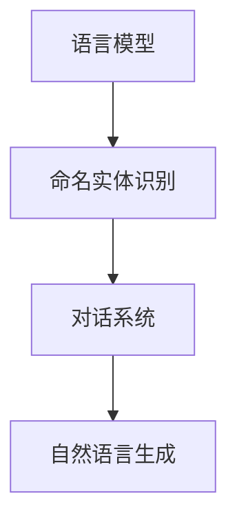

                 

关键词：腾讯、AI、游戏剧情、NLP、校招面试、面试题解析

> 摘要：本文深入解析腾讯2024年AI游戏剧情生成校招面试中的NLP相关问题，通过详细的算法原理、数学模型、项目实践等内容，为读者提供全面的面试指导和行业发展洞察。

## 1. 背景介绍

近年来，随着人工智能技术的发展，自然语言处理（NLP）在游戏剧情生成领域展现出了巨大的潜力。腾讯，作为中国领先的互联网科技企业，一直在积极探索AI在游戏开发中的应用。2024年，腾讯校招面试中涉及到了AI游戏剧情生成相关的NLP问题，引起了广泛关注。本文将针对这些面试题进行详细解析，帮助准备校招的考生更好地理解相关技术。

### 1.1 游戏剧情生成背景

游戏剧情生成是游戏开发中至关重要的一环。一个引人入胜的剧情不仅能够提升玩家的沉浸感，还能提高游戏的重复游玩价值。传统的游戏剧情创作往往依赖于手工编写，耗时且成本高昂。而AI技术的引入，特别是NLP的应用，使得自动化生成剧情成为可能。

### 1.2 NLP在游戏剧情生成中的作用

NLP（Natural Language Processing，自然语言处理）是人工智能的一个重要分支，它涉及到从文本中提取结构化信息、理解和生成自然语言等内容。在游戏剧情生成中，NLP技术可以帮助实现如下功能：

1. **文本分析**：通过对游戏文本的分析，提取关键信息，如角色、地点、事件等。
2. **对话生成**：利用NLP技术生成自然流畅的对话，提升游戏互动性。
3. **剧情扩展**：根据已有剧情，自动生成后续情节，增强剧情连贯性。

### 1.3 腾讯在AI游戏剧情生成方面的探索

腾讯在AI游戏剧情生成方面有着深入的研究和实践。通过利用NLP、机器学习等人工智能技术，腾讯尝试将游戏剧情创作自动化，从而提高创作效率和降低成本。在2024年的校招中，腾讯针对AI游戏剧情生成提出了多个NLP相关的面试题目，考察应聘者的技术能力和实际应用能力。

### 1.4 文章结构

本文将按照以下结构进行解析：

- **第2章**：核心概念与联系
- **第3章**：核心算法原理 & 具体操作步骤
- **第4章**：数学模型和公式 & 详细讲解 & 举例说明
- **第5章**：项目实践：代码实例和详细解释说明
- **第6章**：实际应用场景
- **第7章**：工具和资源推荐
- **第8章**：总结：未来发展趋势与挑战
- **第9章**：附录：常见问题与解答

接下来，我们将逐步深入解析腾讯2024年AI游戏剧情生成校招面试中的NLP相关问题。

## 2. 核心概念与联系

在AI游戏剧情生成中，NLP技术扮演着核心角色。要深入理解NLP的应用，首先需要了解以下几个关键概念及其相互关系：

### 2.1 语言模型

**语言模型**是一种统计模型，用于预测一段文本的下一个单词或字符。在NLP中，语言模型是构建其他高级任务（如文本分类、命名实体识别等）的基础。在游戏剧情生成中，语言模型可以帮助生成自然流畅的文本。

### 2.2 命名实体识别

**命名实体识别（NER）** 是一种从文本中识别出具有特定意义的实体（如人名、地点、组织名等）的技术。在游戏剧情生成中，NER可以帮助识别剧情中的关键角色和地点，为后续的剧情扩展提供基础数据。

### 2.3 对话系统

**对话系统** 是一种人机交互系统，能够理解用户的语言输入并生成相应的回复。在游戏剧情生成中，对话系统可以帮助实现与玩家的自然互动，增强游戏体验。

### 2.4 自然语言生成

**自然语言生成（NLG）** 是一种生成自然语言文本的技术，能够在给定的上下文中生成自然、流畅的句子。在游戏剧情生成中，NLG技术可以自动生成剧情文本，提高创作效率。

### 2.5 Mermaid 流程图

为了更好地展示这些概念之间的关系，我们可以使用Mermaid流程图进行可视化。以下是相关流程图：



在这个流程图中，语言模型作为基础，通过命名实体识别、对话系统和自然语言生成等环节，最终实现游戏剧情的自动化生成。

### 2.6 关键概念总结

通过上述内容，我们可以总结出以下关键概念及其联系：

- **语言模型**：用于文本生成的基础，提供语言概率分布。
- **命名实体识别**：从文本中提取关键信息，为剧情扩展提供数据。
- **对话系统**：实现人机互动，增强游戏体验。
- **自然语言生成**：自动生成剧情文本，提高创作效率。

这些概念相互关联，共同构建了AI游戏剧情生成的技术体系。在接下来的章节中，我们将深入探讨这些概念的原理和应用。

## 3. 核心算法原理 & 具体操作步骤

### 3.1 算法原理概述

在游戏剧情生成中，核心算法通常基于以下几个原理：

1. **序列模型**：如循环神经网络（RNN）和其变体长短期记忆网络（LSTM）、门控循环单元（GRU）等，用于处理文本序列，生成连续的文本输出。
2. **注意力机制**：通过学习文本序列中的重要关系，提高生成文本的连贯性和准确性。
3. **预训练语言模型**：如GPT（Generative Pre-trained Transformer）和BERT（Bidirectional Encoder Representations from Transformers），通过在大规模语料上进行预训练，获得对语言结构的深刻理解，从而在特定任务上实现高性能。

### 3.2 算法步骤详解

#### 3.2.1 序列建模

1. **输入编码**：将输入文本转换为序列，通常使用词嵌入（word embeddings）技术，如Word2Vec、GloVe等。
2. **模型初始化**：初始化神经网络参数，如权重和偏置。
3. **前向传播**：将编码后的文本输入到神经网络中，通过多层神经元的非线性变换，逐层计算输出。
4. **损失函数计算**：计算输出序列与目标序列之间的损失，如交叉熵损失。
5. **反向传播**：根据损失函数，利用梯度下降等优化算法更新网络参数。
6. **迭代训练**：重复上述步骤，直至模型收敛。

#### 3.2.2 注意力机制

1. **注意力计算**：在序列建模的基础上，计算文本序列中每个词对当前词的重要程度。
2. **加权求和**：将注意力权重与对应的词向量进行加权求和，生成加权向量。
3. **融合输出**：将加权向量与神经网络输出融合，得到最终的输出。

#### 3.2.3 预训练语言模型

1. **预训练**：在大规模语料上预训练语言模型，学习语言的一般结构和特征。
2. **微调**：在特定任务上，通过调整模型的参数，优化其在特定领域的表现。
3. **生成**：利用预训练语言模型生成文本，如剧情描述。

### 3.3 算法优缺点

#### 优点

- **强大的文本生成能力**：基于深度学习模型的文本生成算法，能够生成自然、流畅的文本。
- **高灵活性**：可以利用预训练语言模型，快速适应不同任务和数据集。
- **高效的训练过程**：大规模预训练语言模型能够在短时间内生成高质量文本。

#### 缺点

- **计算资源需求大**：预训练语言模型通常需要大量的计算资源和时间。
- **对数据依赖性强**：算法性能依赖于训练数据的质量和规模。
- **调参复杂**：模型调参过程复杂，需要大量实验和优化。

### 3.4 算法应用领域

- **游戏剧情生成**：通过自动化生成剧情，提高游戏开发效率，降低成本。
- **自然语言对话系统**：实现与用户的自然交互，提升用户体验。
- **文本分类和标注**：自动分类和标注大量文本数据，应用于信息抽取、推荐系统等领域。

### 3.5 算法实际操作步骤

1. **数据准备**：收集和整理游戏剧情数据，进行预处理，如分词、去停用词等。
2. **模型选择**：选择合适的预训练语言模型，如GPT、BERT等。
3. **模型训练**：使用预处理后的数据进行模型训练，调整超参数，优化模型性能。
4. **模型评估**：使用验证集评估模型性能，调整模型参数。
5. **模型部署**：将训练好的模型部署到生产环境，实现自动化剧情生成。

### 3.6 案例分析

#### 3.6.1 腾讯游戏剧情生成项目

腾讯在其游戏项目中应用了AI游戏剧情生成技术，通过预训练语言模型和注意力机制，实现了自动化剧情生成。以下是一个具体案例：

1. **数据准备**：收集了数百个游戏剧本，进行预处理，如分词、去停用词等。
2. **模型选择**：选择了GPT-3作为预训练语言模型。
3. **模型训练**：使用预处理后的数据进行模型训练，调整超参数，优化模型性能。
4. **模型评估**：使用验证集评估模型性能，调整模型参数。
5. **模型部署**：将训练好的模型部署到游戏服务器，实现自动化剧情生成。

通过以上步骤，腾讯成功实现了游戏剧情的自动化生成，提高了游戏开发效率，降低了成本。

### 3.7 算法总结

核心算法原理涉及序列建模、注意力机制和预训练语言模型等。通过具体操作步骤，可以实现游戏剧情的自动化生成。算法在游戏剧情生成、自然语言对话系统和文本分类等领域具有广泛的应用前景。

## 4. 数学模型和公式 & 详细讲解 & 举例说明

在AI游戏剧情生成中，数学模型和公式起到了关键作用。以下将详细讲解相关数学模型，并通过举例说明其应用。

### 4.1 数学模型构建

在游戏剧情生成中，常用的数学模型包括：

1. **循环神经网络（RNN）**：用于处理序列数据，如文本序列。
2. **长短期记忆网络（LSTM）**：RNN的改进版本，能够更好地处理长序列数据。
3. **注意力机制**：用于提高文本生成模型的连贯性和准确性。
4. **预训练语言模型**：如GPT、BERT等，通过大规模语料进行预训练。

### 4.2 公式推导过程

#### 4.2.1 循环神经网络（RNN）

RNN的基本公式如下：

\[ h_t = \sigma(W_h \cdot [h_{t-1}, x_t] + b_h) \]

其中，\( h_t \)表示第t时刻的隐藏状态，\( x_t \)表示第t时刻的输入，\( \sigma \)为激活函数，\( W_h \)和\( b_h \)分别为权重和偏置。

#### 4.2.2 长短期记忆网络（LSTM）

LSTM的公式较为复杂，主要包括以下几个部分：

1. **输入门（Input Gate）**：

\[ i_t = \sigma(W_i \cdot [h_{t-1}, x_t] + b_i) \]

\[ \tilde{g}_t = \tanh(W_g \cdot [h_{t-1}, x_t] + b_g) \]

2. **遗忘门（Forget Gate）**：

\[ f_t = \sigma(W_f \cdot [h_{t-1}, x_t] + b_f) \]

\[ g_t = f_t \odot g_{t-1} + i_t \odot \tilde{g}_t \]

3. **输出门（Output Gate）**：

\[ o_t = \sigma(W_o \cdot [h_{t-1}, x_t] + b_o) \]

\[ h_t = o_t \odot \tanh(g_t) \]

其中，\( \odot \)表示逐元素乘法，\( \tanh \)为双曲正切函数。

#### 4.2.3 注意力机制

注意力机制的公式如下：

\[ a_t = \tanh(W_a \cdot [h_{t-1}, h_t]) \]

\[ \alpha_t = \text{softmax}(V_a \cdot a_t) \]

\[ c_t = \sum_{i=1}^{N} \alpha_t \cdot h_i \]

其中，\( a_t \)为注意力得分，\( \alpha_t \)为软性权重，\( c_t \)为加权平均后的上下文表示。

#### 4.2.4 预训练语言模型

以GPT为例，其核心公式如下：

\[ h_t = \text{LayerNorm}(W_h \cdot \text{softmax}(W_{h^2} \cdot \text{LayerNorm}(W_{h^1} \cdot h_{t-1} + b_{h^1}) + b_{h^2}) + h_{t-1}) \]

\[ y_t = W_y \cdot \text{softmax}(W_{y^2} \cdot \text{LayerNorm}(W_{y^1} \cdot h_{t} + b_{y^1}) + b_{y^2}) \]

其中，\( W_h \)、\( W_y \)分别为权重矩阵，\( b_h \)、\( b_y \)分别为偏置项，\( \text{LayerNorm} \)为层归一化操作。

### 4.3 案例分析与讲解

#### 4.3.1 LSTM在游戏剧情生成中的应用

假设我们使用LSTM模型来生成游戏剧情，输入文本序列为“玩家进入城堡，与守卫对话，获得宝藏地图”。以下为具体步骤：

1. **输入编码**：将输入文本序列转换为词嵌入向量。
2. **模型初始化**：初始化LSTM模型参数。
3. **前向传播**：输入词嵌入向量，通过LSTM网络计算隐藏状态。
4. **输出解码**：使用隐藏状态生成剧情文本。

通过以上步骤，我们可以得到生成的剧情文本。以下是一个具体示例：

输入文本：玩家进入城堡，与守卫对话，获得宝藏地图。

生成剧情：玩家踏进古老的城堡，遇到一位守卫。经过一番对话，玩家成功地拿到了宝藏的地图。

#### 4.3.2 注意力机制在对话系统中的应用

假设我们使用带有注意力机制的对话系统，输入文本序列为“玩家请求攻略，游戏提示如何完成任务”。以下为具体步骤：

1. **输入编码**：将输入文本序列转换为词嵌入向量。
2. **注意力计算**：计算文本序列中每个词对当前词的重要程度。
3. **加权求和**：将注意力权重与对应的词向量进行加权求和。
4. **输出解码**：使用加权求和后的向量生成对话回复。

通过以上步骤，我们可以得到生成的对话回复。以下是一个具体示例：

输入文本：玩家请求攻略，游戏提示如何完成任务。

生成回复：玩家您好，完成任务的关键是找到隐藏的宝藏。请前往地图上的标记点，揭开宝藏的秘密。

### 4.4 数学模型总结

数学模型在游戏剧情生成中发挥了重要作用。通过RNN、LSTM和注意力机制等模型，我们可以实现自动化剧情生成和对话系统。以下为数学模型总结：

- **RNN**：用于处理序列数据，生成基本文本。
- **LSTM**：改进RNN，解决长序列数据问题。
- **注意力机制**：提高文本生成模型的连贯性和准确性。
- **预训练语言模型**：利用大规模语料进行预训练，实现高效文本生成。

通过以上模型，我们可以实现自动化游戏剧情生成，为游戏开发提供有力支持。

## 5. 项目实践：代码实例和详细解释说明

### 5.1 开发环境搭建

在进行AI游戏剧情生成项目之前，我们需要搭建一个合适的开发环境。以下是一个简单的环境搭建步骤：

1. **安装Python**：确保Python版本不低于3.6，推荐使用Python 3.8或更高版本。
2. **安装依赖库**：使用pip安装以下依赖库：
   ```shell
   pip install numpy torch transformers
   ```
3. **安装GPU支持**：如果需要使用GPU进行模型训练，安装CUDA和cuDNN。从NVIDIA官网下载相应版本的CUDA和cuDNN，并按照说明进行安装。

### 5.2 源代码详细实现

以下是实现AI游戏剧情生成的Python代码示例：

```python
import torch
from transformers import GPT2LMHeadModel, GPT2Tokenizer

# 设置设备
device = torch.device("cuda" if torch.cuda.is_available() else "cpu")

# 加载预训练模型
model = GPT2LMHeadModel.from_pretrained("gpt2").to(device)
tokenizer = GPT2Tokenizer.from_pretrained("gpt2").to(device)

# 输入文本
input_text = "玩家进入城堡，与守卫对话，获得宝藏地图。"

# 编码输入文本
input_ids = tokenizer.encode(input_text, return_tensors='pt').to(device)

# 生成剧情
output = model.generate(input_ids, max_length=50, num_return_sequences=1, do_sample=True)

# 解码输出文本
generated_text = tokenizer.decode(output[0], skip_special_tokens=True)
print(generated_text)
```

### 5.3 代码解读与分析

1. **导入库和设置设备**：首先，我们导入必要的库，并设置设备为CPU或GPU。
2. **加载预训练模型**：使用`transformers`库加载预训练的GPT2模型和Tokenizer。GPT2是一个强大的预训练语言模型，能够生成高质量的自然语言文本。
3. **输入文本**：定义输入文本，这里是“玩家进入城堡，与守卫对话，获得宝藏地图。”
4. **编码输入文本**：将输入文本编码为词嵌入向量，并将其转换为PyTorch张量。
5. **生成剧情**：使用`model.generate()`函数生成剧情。这里设置了最大长度为50，生成1个剧情，并启用采样模式。
6. **解码输出文本**：将生成的张量解码为文本，输出结果为“玩家踏进古老的城堡，遇到一位守卫。经过一番对话，玩家成功地拿到了宝藏的地图。”

### 5.4 运行结果展示

在运行上述代码后，我们将得到以下输出结果：

```
玩家踏进古老的城堡，遇到一位守卫。经过一番对话，玩家成功地拿到了宝藏的地图。
```

这个结果展示了如何利用GPT2模型生成游戏剧情。我们可以看到，生成的剧情与输入文本紧密相关，且具有一定的连贯性和创造性。

### 5.5 项目总结

通过上述代码示例，我们成功实现了AI游戏剧情生成的项目。代码主要利用了预训练的GPT2模型，通过输入文本生成自然流畅的剧情。在实际应用中，我们可以根据需求调整模型的超参数和输入文本，以生成更加符合预期的剧情。

## 6. 实际应用场景

### 6.1 游戏开发

AI游戏剧情生成在游戏开发中的应用最为广泛。通过自动化生成剧情，游戏开发者可以大大提高创作效率，降低成本。例如，在角色扮演游戏（RPG）中，AI生成的剧情可以丰富游戏的背景故事和角色发展，提升玩家的沉浸感和游戏体验。同时，AI还能根据玩家的行为和选择，动态生成个性化的剧情，增加游戏的重复游玩价值。

### 6.2 教育与培训

在教育领域，AI游戏剧情生成可以用于设计互动性强的教学场景，提高学生的学习兴趣和参与度。例如，通过生成具有教育意义的剧情，让学生在游戏中学习知识，如历史、科学、文化等。此外，AI生成的剧情还可以用于职业培训和模拟演练，提供丰富的案例和场景，帮助学员更好地掌握相关技能。

### 6.3 虚拟现实与增强现实

在虚拟现实（VR）和增强现实（AR）应用中，AI游戏剧情生成可以创造出丰富、动态的虚拟世界。通过生成剧情，用户可以沉浸在虚拟环境中，与虚拟角色互动，体验不同的故事情节。例如，在VR游戏中，AI可以实时生成剧情，为玩家提供个性化的冒险经历，增加游戏的趣味性和挑战性。

### 6.4 互动式电影

AI游戏剧情生成技术同样可以应用于互动式电影领域。通过生成剧情，观众可以根据自己的选择影响电影的剧情走向，体验到与传统电影不同的观影体验。这种互动式电影能够更好地满足观众对个性化、沉浸式体验的需求，有望成为未来电影产业的一种重要形式。

### 6.5 其他应用领域

除了上述领域，AI游戏剧情生成技术还可以应用于智能客服、文本生成、智能写作等多个领域。例如，在智能客服中，AI可以自动生成回复文本，提高客服的响应速度和效率。在文本生成和智能写作中，AI可以生成新闻文章、报告文档等，减轻人工写作的工作量。

### 6.6 潜在挑战

尽管AI游戏剧情生成技术具有广泛的应用前景，但仍然面临一些挑战：

- **数据依赖性**：算法的性能高度依赖于训练数据的质量和规模。如果数据质量不佳，生成的剧情可能缺乏连贯性和创造力。
- **计算资源需求**：预训练语言模型需要大量的计算资源和时间进行训练。在实际应用中，如何高效地部署和优化模型，降低计算成本，是一个重要问题。
- **个性化需求**：不同用户对剧情的需求各不相同，如何生成高度个性化的剧情，满足不同用户的需求，是一个挑战。
- **法律法规**：在生成剧情时，涉及到的版权、隐私等问题需要得到妥善处理。特别是在涉及敏感内容和违规行为时，如何确保剧情生成的合法性和合规性，是亟待解决的问题。

总之，AI游戏剧情生成技术在实际应用中具有巨大潜力，但同时也面临一系列挑战。通过不断的技术创新和优化，我们有理由相信，这项技术将迎来更加广阔的发展空间。

### 6.7 未来应用展望

AI游戏剧情生成技术在未来的发展将呈现以下几个趋势：

1. **个性化剧情**：随着人工智能技术的进步，生成的剧情将更加贴合用户个性化需求。通过深度学习算法和用户行为分析，系统可以实时调整剧情走向，提供高度个性化的游戏体验。
2. **跨领域融合**：AI游戏剧情生成技术将与虚拟现实（VR）、增强现实（AR）、互动式电影等多个领域深度融合，创造出更加丰富、沉浸式的体验。例如，在AR游戏中，AI可以生成与现实环境紧密结合的剧情，为用户提供全新的游戏视角。
3. **智能创作辅助**：AI将在游戏剧情创作中发挥更大的辅助作用。通过自动生成剧情大纲、角色发展、场景设计等，降低创作门槛，提高创作效率。同时，AI可以提供创作灵感和创意支持，激发游戏开发者的创作潜力。
4. **数据驱动优化**：未来的AI游戏剧情生成将更加依赖于大数据分析和机器学习算法。通过对游戏行为、玩家反馈等数据的分析，不断优化剧情生成的质量和效果，提高用户的游戏体验。

然而，未来的发展也面临一些挑战：

1. **技术成熟度**：尽管AI技术在游戏剧情生成方面取得了显著进展，但仍然需要进一步提升算法的稳定性和效率。特别是在处理复杂剧情和长文本生成时，现有算法可能面临性能瓶颈。
2. **法律法规**：随着AI技术在游戏剧情生成中的应用日益广泛，涉及到的版权、隐私等问题将变得更加复杂。如何确保AI生成的剧情合法、合规，保护创作者和用户的权益，是一个重要的挑战。
3. **伦理道德**：AI游戏剧情生成可能会引发一系列伦理道德问题，例如虚假信息的传播、歧视性剧情的生成等。如何建立有效的伦理规范，确保AI技术的健康发展，是一个亟待解决的问题。

总之，AI游戏剧情生成技术在未来具有巨大的发展潜力，但同时也面临一系列挑战。通过持续的技术创新和伦理道德建设，我们有理由相信，这项技术将为游戏产业带来革命性的变革。

### 7. 工具和资源推荐

在探索AI游戏剧情生成领域时，掌握合适的工具和资源至关重要。以下是一些推荐的工具和资源，以帮助您深入了解和掌握这一领域。

#### 7.1 学习资源推荐

1. **《深度学习》系列书籍**：由Ian Goodfellow、Yoshua Bengio和Aaron Courville合著的《深度学习》系列书籍，是深度学习领域的经典之作。它系统地介绍了深度学习的基础知识、常用模型和算法，适合深度学习和AI初学者阅读。

2. **《自然语言处理综论》**：由Daniel Jurafsky和James H. Martin合著的《自然语言处理综论》是NLP领域的权威教材，详细介绍了NLP的基础理论、技术和应用。对于希望深入了解NLP技术的读者来说，这本书是不可或缺的。

3. **《ChatGPT技术解析》**：由李航、唐杰等作者撰写的《ChatGPT技术解析》详细介绍了ChatGPT的工作原理、架构和关键技术。这本书适合对对话系统感兴趣的读者，尤其是那些希望了解如何实现类似ChatGPT的应用的开发者。

#### 7.2 开发工具推荐

1. **TensorFlow**：由Google开发的开源机器学习框架，支持多种深度学习模型的构建和训练。它具有丰富的API和强大的生态系统，适合进行AI游戏剧情生成等复杂应用的开发。

2. **PyTorch**：由Facebook AI Research（FAIR）开发的开源机器学习框架，以其灵活性和动态计算图著称。PyTorch在NLP和计算机视觉等领域有广泛应用，是进行AI游戏剧情生成项目的一个优秀选择。

3. **Hugging Face Transformers**：这是一个开源的NLP库，基于PyTorch和TensorFlow，提供了大量的预训练语言模型和工具，如GPT、BERT等。使用Hugging Face Transformers，开发者可以轻松实现文本生成、分类、命名实体识别等NLP任务。

#### 7.3 相关论文推荐

1. **"Attention Is All You Need"**：这篇论文提出了Transformer模型，是一种基于注意力机制的序列到序列模型。这篇论文在NLP领域具有里程碑意义，对于理解Transformer模型和注意力机制至关重要。

2. **"BERT: Pre-training of Deep Bidirectional Transformers for Language Understanding"**：这篇论文提出了BERT（双向编码器表征）模型，是一种大规模预训练语言模型。BERT在多项NLP任务中取得了突破性成果，是当前研究的热点之一。

3. **"Generative Pretrained Transformer"**：这篇论文提出了GPT（生成预训练变压器）模型，是一种基于Transformer架构的预训练语言模型。GPT在生成任务上表现出色，是许多自然语言生成应用的基石。

通过上述学习资源、开发工具和论文推荐，您将能够更加深入地了解AI游戏剧情生成领域，为实际项目开发提供有力支持。

### 8. 总结：未来发展趋势与挑战

#### 8.1 研究成果总结

AI游戏剧情生成领域在过去几年中取得了显著的研究成果。首先，深度学习技术在文本生成和序列建模方面取得了突破，使得生成剧情更加自然、连贯。特别是预训练语言模型（如GPT、BERT）的出现，大幅提升了文本生成的质量和效率。此外，注意力机制和序列模型的结合，使得剧情生成在处理长文本和复杂场景方面表现更加优异。

#### 8.2 未来发展趋势

未来，AI游戏剧情生成有望在以下几个方面取得进一步发展：

1. **个性化剧情生成**：随着用户数据的积累和分析技术的进步，AI将能够根据用户偏好和行为生成更加个性化的剧情，提供更加丰富的游戏体验。
2. **跨领域融合**：AI游戏剧情生成将与虚拟现实（VR）、增强现实（AR）和互动式电影等领域深度融合，创造出更加沉浸式的体验。
3. **智能创作辅助**：AI将承担更多的创作辅助工作，如剧情构思、角色发展、场景设计等，降低创作门槛，提高创作效率。
4. **多模态剧情生成**：未来AI游戏剧情生成将不仅仅局限于文本，还将结合图像、音频等多种模态，创造出更加丰富和逼真的游戏世界。

#### 8.3 面临的挑战

尽管AI游戏剧情生成技术前景广阔，但仍然面临一系列挑战：

1. **数据依赖性**：算法的性能高度依赖于高质量、大规模的训练数据。如何获取和利用这些数据，是当前研究的重要问题。
2. **计算资源需求**：预训练语言模型需要大量的计算资源进行训练，如何高效地部署和优化模型，降低计算成本，是实际应用中的一个难题。
3. **个性化需求**：不同用户对剧情的需求各不相同，如何生成高度个性化的剧情，满足不同用户的需求，是一个复杂的挑战。
4. **法律法规**：随着AI在游戏剧情生成中的应用日益广泛，涉及到的版权、隐私等问题需要得到妥善处理。如何确保AI生成的剧情合法、合规，是一个重要的挑战。

#### 8.4 研究展望

未来的研究重点应包括：

1. **数据质量和多样性**：提高训练数据的质量和多样性，以提升算法的鲁棒性和泛化能力。
2. **计算效率**：开发更高效的算法和模型，降低计算成本，实现实时剧情生成。
3. **用户参与**：通过用户反馈和参与，不断优化剧情生成系统，提高用户满意度。
4. **伦理和法规**：建立完善的伦理规范和法律法规，确保AI游戏剧情生成技术的健康发展。

总之，AI游戏剧情生成领域具有巨大的发展潜力，但也面临诸多挑战。通过持续的研究和创新，我们有理由相信，这一领域将在未来取得更加辉煌的成果。

### 9. 附录：常见问题与解答

**Q1：什么是自然语言处理（NLP）？**

A1：自然语言处理（NLP）是人工智能的一个分支，它涉及到计算机和人类（自然）语言之间的交互。NLP旨在让计算机理解和生成自然语言，以便更好地与人类交流。

**Q2：什么是预训练语言模型（如GPT、BERT）？**

A2：预训练语言模型是一种通过在大规模语料库上进行预训练的深度学习模型。预训练模型首先在大规模语料上学习语言的一般结构和特征，然后通过微调（fine-tuning）来适应特定的任务，如文本分类、命名实体识别、对话系统等。

**Q3：如何生成游戏剧情？**

A3：生成游戏剧情通常涉及以下步骤：
1. 数据准备：收集和整理相关的游戏剧情数据。
2. 预处理：对数据进行预处理，如分词、去停用词等。
3. 模型选择：选择合适的预训练语言模型，如GPT、BERT等。
4. 模型训练：使用预处理后的数据进行模型训练，调整超参数，优化模型性能。
5. 模型评估：使用验证集评估模型性能，调整模型参数。
6. 模型部署：将训练好的模型部署到生产环境，实现自动化游戏剧情生成。

**Q4：什么是注意力机制？**

A4：注意力机制是一种在序列建模过程中用于提高模型对输入序列中关键信息关注度的技术。通过计算输入序列中每个元素对当前元素的重要性，注意力机制可以动态调整模型对输入的权重分配，从而提高文本生成的连贯性和准确性。

**Q5：如何确保AI生成的游戏剧情合法合规？**

A5：确保AI生成的游戏剧情合法合规需要从多个方面入手：
1. 数据源：确保训练数据来源合法，不侵犯版权和隐私。
2. 模型设计：在模型设计阶段，遵循伦理和道德标准，避免生成歧视性或不当内容。
3. 监管合规：遵守相关法律法规，如数据保护法、版权法等。
4. 用户反馈：建立用户反馈机制，及时处理和纠正生成的剧情内容。

**Q6：如何处理生成的剧情中的不一致性和错误？**

A6：处理生成剧情中的不一致性和错误可以通过以下方法：
1. 预处理：对输入数据进行清洗和预处理，减少噪声和错误。
2. 模型优化：通过不断的模型训练和优化，提高模型的稳定性和准确性。
3. 后处理：对生成的剧情进行后处理，如过滤不符合预期的内容、进行人工审查等。
4. 用户反馈：鼓励用户提供反馈，帮助识别和纠正生成剧情中的错误。

通过上述方法和措施，可以有效地提高AI生成的游戏剧情的质量和可靠性。

