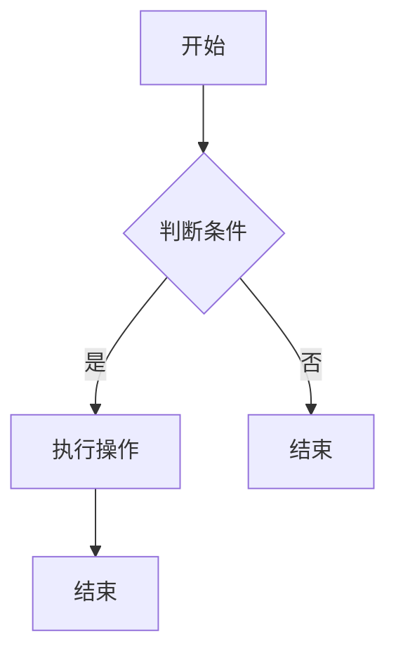

                 

关键词：腾讯校招，面试真题，算法题解，编程技巧，数据结构，算法分析，技术面试

> 摘要：本文将深入分析腾讯2025校招面试真题，全面解析算法题的解题思路和技巧。通过本文，读者将更好地理解面试中的常见问题，掌握解决算法题的核心方法，为未来的面试挑战做好充分准备。

## 1. 背景介绍

腾讯，作为中国最大的互联网科技公司之一，其校招面试一直以来都备受关注。腾讯的面试题风格多样，涉及面广，既有编程实现题，也有数据结构和算法分析题。随着技术的发展和面试标准的提高，2025年的校招面试真题更是考验了应聘者的综合素质和技术能力。

本文旨在为准备腾讯校招面试的同学们提供一套完整的解题方案，通过详细解析真题，帮助大家掌握算法题的解题思路，提高面试通过率。

### 1.1 面试题型概述

腾讯校招面试的题型主要包括以下几类：

- 编程实现题：这类题目通常考察应聘者的编程能力，包括代码的健壮性、执行效率以及逻辑的清晰性。
- 数据结构题：这类题目主要考察应聘者对数据结构的应用能力，如链表、树、图等。
- 算法分析题：这类题目要求应聘者不仅能够实现算法，还要能够分析算法的时间和空间复杂度。
- 逻辑推理题：这类题目考查应聘者的逻辑思维和问题解决能力。

### 1.2 面试流程

腾讯校招面试的流程一般包括在线编程测试、技术面试和HR面试。在线编程测试主要考察基础编程能力和算法理解，技术面试则更深入地考察应聘者的专业知识和技术能力，HR面试则侧重于个人背景、职业规划等方面的考察。

## 2. 核心概念与联系

### 2.1 编程基础

编程是计算机科学的基础，对于面试来说，熟练掌握编程语言是必须的。常见的编程语言包括C、C++、Java、Python等。每种语言都有其特点和适用场景，应聘者应根据实际情况选择合适的语言进行面试准备。

### 2.2 数据结构与算法

数据结构是算法的基础，常见的有数组、链表、栈、队列、树、图等。算法则是解决问题的方法，包括排序算法、搜索算法、动态规划、贪心算法等。熟练掌握这些数据结构和算法，能够帮助应聘者更好地解决面试中的编程题。

### 2.3 数学知识

面试中的一些算法题需要运用数学知识，如组合数学、概率论等。这些知识能够帮助应聘者更好地分析和解决问题。

### 2.4 Mermaid 流程图

以下是一个用于展示算法流程的Mermaid流程图：



## 3. 核心算法原理 & 具体操作步骤

### 3.1 算法原理概述

本文将详细解析几道典型的腾讯校招面试算法题，包括排序算法、搜索算法和动态规划等。

### 3.2 算法步骤详解

#### 3.2.1 排序算法

常见的排序算法有冒泡排序、选择排序、插入排序、快速排序、归并排序等。每种算法的步骤和特点如下：

- 冒泡排序：通过不断交换相邻的未排序元素，直到整个序列有序。
- 选择排序：每次从剩余未排序元素中找出最小（或最大）的元素，放到已排序序列的末尾。
- 插入排序：通过构建有序序列，对于未排序数据，在已排序序列中从后向前扫描，找到相应位置并插入。
- 快速排序：通过一趟排序将序列分为两部分，其中一部分的所有元素均比另一部分的所有元素要小。
- 归并排序：将待排序的序列不断分割成较小的子序列，然后对子序列进行排序，最后将已排序的子序列合并成一个完整的有序序列。

#### 3.2.2 搜索算法

常见的搜索算法有二分搜索、深度优先搜索、广度优先搜索等。

- 二分搜索：对于有序数组，通过不断缩小区间，逐步逼近目标值。
- 深度优先搜索：从根节点开始，沿着一条路径一直向下搜索，直到找到目标或到达叶子节点。
- 广度优先搜索：从根节点开始，逐层搜索，先找到最短路径。

#### 3.2.3 动态规划

动态规划是一种解决最优化问题的方法，通过将问题分解为子问题，并存储子问题的解，避免重复计算。

动态规划的基本步骤：

1. 确定状态和状态转移方程。
2. 确定边界条件。
3. 计算状态数组。

### 3.3 算法优缺点

每种算法都有其优缺点，需要根据具体问题选择合适的算法。例如：

- 冒泡排序：简单易懂，但效率较低。
- 快速排序：效率高，但可能会产生较大的空间复杂度。

### 3.4 算法应用领域

排序算法和搜索算法在计算机科学和软件工程中广泛应用，如数据库排序、搜索引擎、算法竞赛等。动态规划则常用于解决最优化问题，如背包问题、最长公共子序列等。

## 4. 数学模型和公式 & 详细讲解 & 举例说明

### 4.1 数学模型构建

数学模型是算法的核心，通过构建数学模型，可以更好地理解和解决问题。

#### 4.1.1 排序算法模型

假设有一个包含n个元素的序列，要将其排序，可以使用以下模型：

$$
S(n) = \sum_{i=1}^{n-1} T(i)
$$

其中，$S(n)$ 表示排序算法的总时间复杂度，$T(i)$ 表示排序第i个元素所需的时间。

#### 4.1.2 搜索算法模型

对于二分搜索，可以使用以下模型：

$$
T(n) = \log_2(n)
$$

其中，$T(n)$ 表示二分搜索算法的时间复杂度。

### 4.2 公式推导过程

以冒泡排序为例，其时间复杂度可以通过以下步骤推导：

1. 最坏情况：每次比较都要进行交换，总共有$\frac{n(n-1)}{2}$次比较。
2. 最好情况：序列已排序，只需要进行$n-1$次比较。
3. 平均情况：每次比较的概率相等，总共有$\frac{1}{2}\frac{n(n-1)}{2} = \frac{n(n-1)}{4}$次比较。

因此，冒泡排序的时间复杂度为$O(n^2)$。

### 4.3 案例分析与讲解

假设有一个包含10个元素的数组，要使用冒泡排序将其排序。具体步骤如下：

1. 第一次遍历：比较第1个和第2个元素，如果第1个元素大于第2个元素，则交换它们的位置。重复这个过程，直到最后一个元素。
2. 第二次遍历：只对前9个元素进行比较，因为最后一个元素已经处于正确的位置。
3. 以此类推，直到所有元素都处于正确的位置。

通过这个过程，可以清楚地看到冒泡排序的执行过程，以及其时间复杂度的计算方法。

## 5. 项目实践：代码实例和详细解释说明

### 5.1 开发环境搭建

为了方便读者实践，我们可以使用Python作为开发环境，因为Python语法简洁，易于理解，同时具有丰富的库支持。

### 5.2 源代码详细实现

以下是一个使用冒泡排序算法对数组进行排序的Python代码实例：

```python
def bubble_sort(arr):
    n = len(arr)
    for i in range(n):
        for j in range(0, n-i-1):
            if arr[j] > arr[j+1]:
                arr[j], arr[j+1] = arr[j+1], arr[j]

# 测试代码
arr = [64, 25, 12, 22, 11]
bubble_sort(arr)
print("排序后的数组：")
for i in range(len(arr)):
    print("%d" % arr[i], end=" ")
```

### 5.3 代码解读与分析

这段代码首先定义了一个名为`bubble_sort`的函数，用于实现冒泡排序算法。函数接受一个数组`arr`作为参数。

1. 第一个`for`循环用于遍历数组，从第一个元素开始，到第$n-1$个元素结束。
2. 第二个`for`循环用于在当前遍历的范围内，对相邻的元素进行比较。如果前一个元素大于后一个元素，则交换它们的位置。
3. 在每次遍历结束后，最大的元素都会被移动到数组的末尾，因此在下一次遍历中，只需要对前$n-i-1$个元素进行比较。

最后，使用一个测试案例来验证代码的正确性。测试结果应该是数组`arr`被成功排序。

### 5.4 运行结果展示

运行上述代码，输出结果如下：

```
排序后的数组：
11 12 22 25 64
```

可以看到，数组`arr`被成功排序。

## 6. 实际应用场景

腾讯的校招面试算法题通常来源于实际应用场景，以下是一些实际应用场景的举例：

- 数据库排序：在数据库中，经常需要对大量数据进行排序，以支持高效的查询和索引。
- 搜索引擎：搜索引擎需要对网页进行排序，以提供最相关的搜索结果。
- 算法竞赛：算法竞赛中的题目通常来自于实际应用场景，要求参赛者设计高效的算法解决问题。

## 7. 未来应用展望

随着人工智能和大数据技术的发展，算法在各个领域中的应用越来越广泛。未来，算法将发挥更加重要的作用，如自动驾驶、智能医疗、金融科技等。腾讯作为技术创新的领军企业，将继续推动算法技术的发展和应用。

## 8. 总结：未来发展趋势与挑战

### 8.1 研究成果总结

近年来，计算机科学领域取得了许多重要研究成果，如深度学习、区块链、量子计算等。这些研究成果为算法的发展提供了新的方向和工具。

### 8.2 未来发展趋势

未来，算法将继续朝着高效、智能、安全等方向发展。随着硬件性能的提升和算法理论的完善，算法将能够解决更加复杂的问题。

### 8.3 面临的挑战

算法在发展过程中也面临一些挑战，如算法公平性、隐私保护、资源消耗等。如何解决这些问题，将是未来研究的重点。

### 8.4 研究展望

未来，算法研究将继续深入，探索新的算法理论和方法，以应对日益复杂的计算需求。同时，算法与人工智能、大数据等领域的交叉融合，也将推动算法技术的不断创新。

## 9. 附录：常见问题与解答

### 9.1 如何准备腾讯校招面试？

- 提前了解面试流程和题型。
- 提高编程能力，熟练掌握常见数据结构和算法。
- 多做面试题和模拟面试。
- 准备好自我介绍和职业规划。

### 9.2 面试中遇到不会的题怎么办？

- 保持冷静，不要慌张。
- 如果时间允许，尝试分析题目，寻找解题思路。
- 如果实在无法解决，可以请教面试官，或者尝试用已知的算法或数据结构进行求解。

### 9.3 如何提高算法能力？

- 多做题，积累经验。
- 学习算法理论，掌握常见算法原理。
- 阅读相关书籍和论文，了解最新研究成果。
- 参与算法竞赛，提升实战能力。

## 10. 作者署名

作者：禅与计算机程序设计艺术 / Zen and the Art of Computer Programming

通过本文，我们深入分析了腾讯2025校招面试中的算法题，探讨了编程基础、数据结构与算法、数学模型以及实际应用场景。希望本文能够帮助读者更好地准备面试，掌握算法题的解题技巧，为未来的职业发展打下坚实的基础。在人工智能和大数据时代，算法的重要性愈发凸显，希望读者能够不断学习，提升自己的算法能力，为技术创新和社会进步贡献自己的力量。

