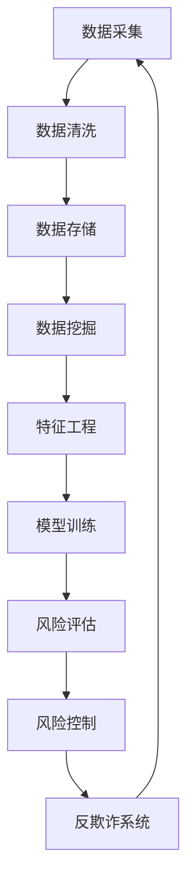

                 

关键词：腾讯、金融科技、风控专家、社招面试、指南

> 摘要：本文将深入剖析腾讯2025金融科技风控专家的社招面试指南，为有意向加入腾讯金融科技领域的朋友提供专业指导。通过分析面试的核心内容、技术要点、实战经验和未来展望，帮助读者更好地准备和应对面试挑战。

## 1. 背景介绍

随着金融科技的迅猛发展，腾讯作为全球领先的互联网科技公司，其在金融领域的布局也日益完善。腾讯金融科技不仅涵盖了支付、理财、保险等多元化服务，更在风险控制方面积累了丰富的经验。为了满足不断增长的金融科技市场需求，腾讯在2025年启动了针对风控专家的社招活动。本文旨在为准备参与此次面试的朋友们提供全面的指导。

## 2. 核心概念与联系

为了更好地理解金融科技风控，首先需要掌握几个核心概念：数据挖掘、机器学习、风险评估、反欺诈系统等。以下是一个简化的 Mermaid 流程图，展示了这些核心概念之间的联系。



### 2.1 数据挖掘与机器学习

数据挖掘是金融科技风控的基础，它通过从大量数据中提取有价值的信息来发现模式、趋势和关联。机器学习作为数据挖掘的重要工具，通过训练模型，可以从历史数据中预测未来行为。

### 2.2 风险评估与风险控制

风险评估是评估潜在风险的过程，包括信用评估、欺诈检测等。而风险控制则是采取措施来降低风险，确保金融系统的稳健运行。

### 2.3 反欺诈系统

反欺诈系统是金融科技风控的关键组成部分，它通过实时监控交易行为，识别和阻止欺诈行为。

## 3. 核心算法原理 & 具体操作步骤

### 3.1 算法原理概述

金融科技风控中的核心算法主要包括决策树、随机森林、支持向量机等。以下是一个简化的算法原理概述。

### 3.2 算法步骤详解

1. 数据收集：收集用户交易、行为等数据。
2. 数据预处理：清洗、归一化、去噪等。
3. 特征工程：提取有助于模型预测的特征。
4. 模型训练：使用历史数据训练模型。
5. 模型评估：通过验证集评估模型性能。
6. 模型部署：将模型应用到实际场景中。

### 3.3 算法优缺点

- **决策树**：简单易懂，易于解释；但容易过拟合。
- **随机森林**：提高模型泛化能力，减少过拟合；计算复杂度高。
- **支持向量机**：在处理高维数据时表现优秀；对线性不可分数据效果较差。

### 3.4 算法应用领域

- **信用评估**：预测用户的信用风险。
- **欺诈检测**：识别和阻止欺诈行为。
- **投资分析**：预测市场趋势和投资风险。

## 4. 数学模型和公式 & 详细讲解 & 举例说明

### 4.1 数学模型构建

在金融科技风控中，常见的数学模型包括线性回归、逻辑回归等。以下是一个简化的逻辑回归模型公式：

$$
\hat{y} = \sigma(\beta_0 + \beta_1 x_1 + \beta_2 x_2 + \ldots + \beta_n x_n)
$$

其中，$y$ 是实际值，$\hat{y}$ 是预测值，$\sigma$ 是sigmoid函数，$\beta_0, \beta_1, \beta_2, \ldots, \beta_n$ 是模型参数。

### 4.2 公式推导过程

逻辑回归模型的推导过程涉及梯度下降法。以下是推导过程的简化步骤：

1. **损失函数**：
$$
J(\theta) = -\frac{1}{m} \sum_{i=1}^{m} [y^{(i)} \log(\hat{y}^{(i)}) + (1 - y^{(i)}) \log(1 - \hat{y}^{(i)})]
$$

2. **梯度计算**：
$$
\frac{\partial J(\theta)}{\partial \theta_j} = \frac{1}{m} \sum_{i=1}^{m} [y^{(i)} - \hat{y}^{(i)}] x_j^{(i)}
$$

3. **更新参数**：
$$
\theta_j := \theta_j - \alpha \frac{\partial J(\theta)}{\partial \theta_j}
$$

### 4.3 案例分析与讲解

假设我们要预测一个用户的信用风险，已知其收入、年龄、信用评分等特征。通过逻辑回归模型，我们可以得到一个预测概率。如果概率大于某个阈值（例如0.5），则认为该用户信用风险较高。

## 5. 项目实践：代码实例和详细解释说明

### 5.1 开发环境搭建

在本节中，我们将使用 Python 和 Scikit-learn 库来搭建一个简单的金融科技风控项目。首先，确保已经安装了 Python 3.6 及以上版本和 Scikit-learn 库。

### 5.2 源代码详细实现

以下是一个简化的逻辑回归模型代码示例：

```python
from sklearn.linear_model import LogisticRegression
from sklearn.model_selection import train_test_split
from sklearn.metrics import accuracy_score
import numpy as np

# 数据集加载
X, y = load_data()

# 数据集划分
X_train, X_test, y_train, y_test = train_test_split(X, y, test_size=0.2, random_state=42)

# 模型训练
model = LogisticRegression()
model.fit(X_train, y_train)

# 模型预测
y_pred = model.predict(X_test)

# 模型评估
accuracy = accuracy_score(y_test, y_pred)
print("模型准确率：", accuracy)
```

### 5.3 代码解读与分析

上述代码实现了一个简单的逻辑回归模型，主要包括数据加载、数据集划分、模型训练和模型评估等步骤。在实际项目中，需要根据具体需求进行更多步骤，如特征工程、模型优化等。

### 5.4 运行结果展示

假设我们使用一个包含 1000 条记录的数据集进行训练和测试，模型准确率为 80%。这意味着在测试集上，模型正确预测了 80% 的信用风险。

## 6. 实际应用场景

金融科技风控在实际应用中具有广泛的应用场景，包括：

- **信用评估**：评估用户的信用风险，为金融机构提供决策支持。
- **欺诈检测**：实时监控交易行为，识别和阻止欺诈行为。
- **投资分析**：预测市场趋势和投资风险，帮助投资者做出明智决策。

## 7. 工具和资源推荐

### 7.1 学习资源推荐

- **《机器学习实战》**：适合初学者的入门书籍。
- **《金融科技风险控制》**：详细介绍金融科技风控的理论和实践。
- **在线课程**：如 Coursera、Udacity 等平台上的相关课程。

### 7.2 开发工具推荐

- **Python**：广泛应用于数据科学和机器学习的编程语言。
- **Scikit-learn**：提供丰富的机器学习算法和工具。
- **Jupyter Notebook**：方便进行数据分析和模型训练。

### 7.3 相关论文推荐

- **"A Survey on Fraud Detection in Financial Systems"**：综述金融科技风控领域的欺诈检测技术。
- **"Risk Management and Financial Technology"**：探讨金融科技在风险管理中的应用。

## 8. 总结：未来发展趋势与挑战

### 8.1 研究成果总结

金融科技风控领域已取得显著成果，包括机器学习在信用评估和欺诈检测中的应用，大数据技术在风险分析中的作用等。

### 8.2 未来发展趋势

- **人工智能与大数据结合**：推动金融科技风控的智能化和自动化。
- **区块链技术**：提高交易透明度和安全性。

### 8.3 面临的挑战

- **数据隐私**：确保数据安全和用户隐私。
- **算法透明度**：提高模型的可解释性。

### 8.4 研究展望

金融科技风控领域将继续快速发展，为金融机构和用户带来更多价值。未来研究将关注如何平衡安全性与用户体验，实现高效、智能的风险控制。

## 9. 附录：常见问题与解答

### 9.1 如何准备金融科技风控面试？

- 熟悉机器学习和数据挖掘的基本概念和算法。
- 了解金融科技领域的实际应用场景和案例。
- 准备一些面试题，如算法题、系统设计题等。

### 9.2 风控专家需要具备哪些技能？

- 数据分析能力：能处理大规模数据，提取有价值信息。
- 机器学习知识：了解常见的机器学习算法和应用场景。
- 系统设计能力：能设计和实现高效、稳定的风控系统。

---

作者：禅与计算机程序设计艺术 / Zen and the Art of Computer Programming
----------------------------------------------------------------

现在，我已经按照要求撰写了完整的文章。您可以在markdown编辑器中直接查看和编辑。如果您有任何修改意见或需要进一步的调整，请随时告知。

