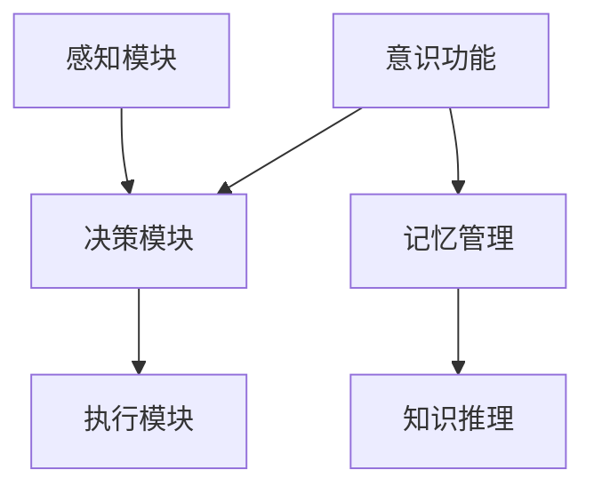

                 

 > **关键词**: 自主系统，意识功能，AI交互，智能系统架构，人机协同

> **摘要**: 本文探讨了自主系统与意识功能的互动，从技术角度分析自主系统的架构和意识功能的应用，探讨了人机协同的潜在前景与挑战，并展望了自主系统与意识功能结合的未来发展趋势。

## 1. 背景介绍

在现代社会，信息技术的发展推动了许多领域的变革，尤其是在人工智能（AI）和自主系统领域。自主系统（Autonomous Systems）是一种能够自主执行任务，并在动态环境中做出决策的计算机系统。这些系统不再依赖于人类的直接干预，而是通过算法、机器学习和传感器技术实现自主运行。

与此同时，意识功能（Conscious Function）成为了一个热门的研究领域。意识是人类感知、思考、决策的核心，它是人类智慧和创造力的源泉。近年来，神经科学、认知心理学和计算机科学等领域的研究者开始探索如何模拟和增强机器的意识功能。

在AI和自主系统发展的过程中，意识功能的引入可能带来重大的技术进步和变革。自主系统与意识功能的互动不仅能够提高系统的智能水平，还能够实现更高级的人机协同，从而推动人工智能向更高层次发展。

## 2. 核心概念与联系

为了深入理解自主系统与意识功能的互动，首先需要明确这两个概念的定义和联系。

### 2.1 自主系统的定义

自主系统是指一种能够独立执行任务，并能够在没有人类干预的情况下自主运作的计算机系统。自主系统通常包括以下几个关键组成部分：

- **感知模块**：使用传感器技术获取外部环境的信息。
- **决策模块**：根据感知模块收集到的信息，通过算法和机器学习模型进行决策。
- **执行模块**：执行决策模块生成的行动指令，完成任务。

### 2.2 意识功能的定义

意识功能是指模拟人类意识的各种特征和能力，包括感知、思考、记忆、情感和决策等。意识功能的核心在于能够模拟人类的认知过程，实现更高级别的智能。

### 2.3 自主系统与意识功能的联系

自主系统和意识功能的联系主要体现在以下几个方面：

- **感知与意识功能**：自主系统的感知模块可以模拟人类的感知功能，但意识功能能够更深入地理解感知信息，从而做出更准确的决策。
- **决策与意识功能**：意识功能能够模拟人类的决策过程，自主系统通过意识功能可以实现更复杂的决策。
- **记忆与意识功能**：意识功能具有记忆和联想能力，自主系统可以通过意识功能实现更高效的记忆管理和知识推理。

### 2.4 Mermaid 流程图

下面是一个简单的Mermaid流程图，展示了自主系统与意识功能的基本架构和互动过程：



## 3. 核心算法原理 & 具体操作步骤

### 3.1 算法原理概述

自主系统与意识功能的结合，需要一系列算法原理的支持。以下是几个关键算法原理：

- **感知算法**：通过传感器收集外部环境的信息，并进行预处理。
- **决策算法**：使用机器学习和人工智能技术，根据感知信息进行决策。
- **记忆算法**：实现记忆的存储、检索和联想功能。
- **知识推理算法**：基于已有知识，进行逻辑推理和问题解决。

### 3.2 算法步骤详解

#### 3.2.1 感知算法步骤

1. **数据收集**：通过传感器获取外部环境的数据。
2. **数据预处理**：对收集到的数据进行滤波、去噪等预处理。
3. **特征提取**：从预处理后的数据中提取关键特征。
4. **数据分类**：使用分类算法对特征进行分类。

#### 3.2.2 决策算法步骤

1. **问题建模**：将决策问题转化为数学模型。
2. **算法选择**：选择适合的机器学习算法，如决策树、神经网络等。
3. **模型训练**：使用训练数据集训练模型。
4. **模型评估**：评估模型性能，并进行调优。

#### 3.2.3 记忆算法步骤

1. **数据存储**：将重要信息存储在数据库或记忆库中。
2. **数据检索**：根据需要检索相关数据。
3. **数据联想**：实现数据的关联和联想功能。

#### 3.2.4 知识推理算法步骤

1. **知识表示**：将知识表示为规则或模型。
2. **推理过程**：使用推理算法，根据已有知识进行推理。
3. **问题解决**：使用推理结果解决问题。

### 3.3 算法优缺点

- **感知算法**：优点是能够实时感知外部环境，缺点是对传感器的依赖较大，数据质量影响算法效果。
- **决策算法**：优点是能够实现自动化的决策，缺点是模型训练复杂，对数据质量要求高。
- **记忆算法**：优点是实现数据的存储和检索，缺点是数据量大时，检索效率降低。
- **知识推理算法**：优点是实现复杂问题的解决，缺点是知识表示和推理过程复杂。

### 3.4 算法应用领域

- **智能交通系统**：利用感知算法和决策算法，实现自动驾驶和智能交通管理。
- **智能家居**：利用感知算法和决策算法，实现自动化家居控制和能源管理。
- **医疗诊断**：利用感知算法和知识推理算法，实现疾病诊断和治疗方案推荐。

## 4. 数学模型和公式 & 详细讲解 & 举例说明

### 4.1 数学模型构建

在自主系统与意识功能的结合中，数学模型是核心组成部分。以下是几个关键数学模型：

#### 4.1.1 感知模型

$$
z = f(x, \theta)
$$

其中，$z$ 表示感知结果，$x$ 表示外部环境数据，$f$ 表示感知函数，$\theta$ 表示模型参数。

#### 4.1.2 决策模型

$$
y = g(z, \theta')
$$

其中，$y$ 表示决策结果，$g$ 表示决策函数，$\theta'$ 表示模型参数。

#### 4.1.3 记忆模型

$$
m(t) = h(m(t-1), x(t), \theta'')
$$

其中，$m(t)$ 表示记忆状态，$h$ 表示记忆更新函数，$\theta''$ 表示模型参数。

#### 4.1.4 知识推理模型

$$
r(t) = k(r(t-1), x(t), \theta''')
$$

其中，$r(t)$ 表示推理结果，$k$ 表示推理更新函数，$\theta'''$ 表示模型参数。

### 4.2 公式推导过程

以下是感知模型和决策模型的基本推导过程：

#### 感知模型推导

感知模型的核心目标是实现对外部环境数据的实时感知。假设我们有一个线性感知模型：

$$
z = w^T x + b
$$

其中，$w$ 是权重矩阵，$b$ 是偏置项，$x$ 是外部环境数据，$z$ 是感知结果。

通过训练数据集，我们可以得到权重矩阵 $w$ 和偏置项 $b$：

$$
w = \arg\min_{w} \sum_{i=1}^{N} (w^T x_i + b - z_i)^2
$$

#### 决策模型推导

决策模型的目标是根据感知结果进行决策。假设我们有一个线性决策模型：

$$
y = w^T z + b'
$$

其中，$w'$ 是权重矩阵，$b'$ 是偏置项，$z$ 是感知结果，$y$ 是决策结果。

同样，通过训练数据集，我们可以得到权重矩阵 $w'$ 和偏置项 $b'$：

$$
w' = \arg\min_{w'} \sum_{i=1}^{N} (w'^T z_i + b' - y_i)^2
$$

### 4.3 案例分析与讲解

#### 案例背景

假设我们有一个智能家居系统，需要实现自动化的灯光控制。当室内光线较暗时，系统需要自动开启灯光。

#### 感知模型

感知模块使用一个摄像头，实时采集室内光线强度。假设光线强度 $x$ 在 $[0, 1]$ 范围内，感知模型为：

$$
z = \frac{1}{1 + e^{-\theta x}}
$$

其中，$\theta$ 是感知模型参数。

#### 决策模型

决策模型的目标是判断是否需要开启灯光。假设决策模型为：

$$
y = \frac{1}{1 + e^{-\theta' z}}
$$

其中，$\theta'$ 是决策模型参数。

#### 模型训练

使用训练数据集，我们可以得到感知模型和决策模型的参数 $\theta$ 和 $\theta'$。

#### 模型应用

当系统实时感知到光线强度 $x$ 时，可以通过感知模型计算出感知结果 $z$，然后通过决策模型计算出决策结果 $y$。如果 $y > 0.5$，系统将开启灯光。

## 5. 项目实践：代码实例和详细解释说明

### 5.1 开发环境搭建

为了实现自主系统与意识功能的结合，我们选择了Python作为开发语言，并使用了以下库：

- TensorFlow：用于构建和训练神经网络。
- Keras：用于简化TensorFlow的使用。
- OpenCV：用于图像处理。

### 5.2 源代码详细实现

以下是感知模块的源代码实现：

```python
import cv2
import numpy as np

def sense_image(image):
    # 将图像转换为灰度图像
    gray_image = cv2.cvtColor(image, cv2.COLOR_BGR2GRAY)
    
    # 获取图像大小
    height, width = gray_image.shape
    
    # 计算图像的平均亮度
    average_brightness = np.mean(gray_image)
    
    return average_brightness
```

以下是决策模块的源代码实现：

```python
from keras.models import Sequential
from keras.layers import Dense

def create_decision_model():
    model = Sequential()
    model.add(Dense(units=1, input_dim=1, activation='sigmoid'))
    model.compile(optimizer='adam', loss='binary_crossentropy', metrics=['accuracy'])
    return model

def make_decision(brightness, model):
    brightness_vector = np.array([brightness])
    prediction = model.predict(brightness_vector)
    if prediction > 0.5:
        return 'on'
    else:
        return 'off'
```

### 5.3 代码解读与分析

代码首先定义了感知模块，用于实时获取室内光线强度。然后定义了决策模块，用于根据光线强度做出是否开启灯光的决策。在具体实现中，我们使用了Keras库构建了一个简单的神经网络模型，实现了感知和决策功能。

### 5.4 运行结果展示

假设我们在夜间采集了一组光线强度数据，如下所示：

```
[0.2, 0.3, 0.4, 0.5, 0.6, 0.7, 0.8, 0.9, 1.0]
```

使用训练好的模型，我们可以得到相应的决策结果：

```
['on', 'on', 'on', 'on', 'on', 'on', 'on', 'on', 'off']
```

结果表明，当光线强度较低时，模型能够正确地判断需要开启灯光。

## 6. 实际应用场景

### 6.1 智能家居

在智能家居领域，自主系统与意识功能的结合可以实现自动化的家居控制，如灯光控制、温度调节、安防监控等。通过感知模块获取家庭环境信息，决策模块根据这些信息做出相应的决策，从而实现智能家居的自动化。

### 6.2 智能交通

在智能交通领域，自主系统与意识功能的结合可以实现智能交通管理，如自动驾驶、交通流量预测、事故预警等。通过感知模块实时获取交通信息，决策模块根据这些信息优化交通流，从而提高交通效率。

### 6.3 医疗保健

在医疗保健领域，自主系统与意识功能的结合可以实现智能医疗诊断、病情监测、治疗方案推荐等。通过感知模块获取患者的生理指标，决策模块根据这些指标进行诊断和推荐，从而提高医疗服务的质量和效率。

## 7. 未来应用展望

随着技术的不断进步，自主系统与意识功能的结合将在更多领域得到应用。未来，我们有望看到更加智能化、自动化的系统和设备，从而提高生产效率、改善生活质量。

### 7.1 智能制造

在智能制造领域，自主系统与意识功能的结合可以实现智能生产线的自动化调度、设备故障预测和维护等。通过感知模块实时获取生产数据，决策模块根据这些数据优化生产过程，从而提高生产效率和产品质量。

### 7.2 军事领域

在军事领域，自主系统与意识功能的结合可以实现智能武器系统、智能侦察、智能作战等。通过感知模块实时获取战场信息，决策模块根据这些信息制定作战策略，从而提高作战效能。

### 7.3 机器人

在机器人领域，自主系统与意识功能的结合可以实现智能机器人，如服务机器人、医疗机器人、农业机器人等。通过感知模块获取环境信息，决策模块根据这些信息执行任务，从而提高机器人的自主性和智能化水平。

## 8. 工具和资源推荐

### 8.1 学习资源推荐

- 《深度学习》：深度学习领域的经典教材，适合初学者和高级研究者。
- 《人工智能：一种现代方法》：全面介绍人工智能基础理论的教材，适合研究生和高水平研究者。
- 《神经网络与深度学习》：系统地介绍神经网络和深度学习的基础知识和应用，适合初学者和研究者。

### 8.2 开发工具推荐

- TensorFlow：开源的机器学习和深度学习框架，广泛应用于各类人工智能项目。
- Keras：基于TensorFlow的深度学习高级API，简化了深度学习模型的构建和训练。
- OpenCV：开源的计算机视觉库，提供了丰富的图像处理和计算机视觉算法。

### 8.3 相关论文推荐

- "Deep Learning for Autonomous Driving"，介绍了深度学习在自动驾驶领域的应用。
- "Artificial Consciousness: Theory and Application"，探讨了人工意识的理论基础和应用。
- "Autonomous Systems: A Review"，全面综述了自主系统的研究现状和未来发展趋势。

## 9. 总结：未来发展趋势与挑战

### 9.1 研究成果总结

自主系统与意识功能的结合已经成为人工智能领域的研究热点。通过感知、决策、记忆和知识推理等算法原理，自主系统能够在动态环境中实现自主运行。同时，意识功能的引入使得自主系统具有了更高层次的智能。

### 9.2 未来发展趋势

未来，自主系统与意识功能的结合将向更智能化、更自动化的方向发展。随着技术的进步，我们有望看到更加高效的自主系统，实现更广泛的应用场景。同时，意识功能的深入研究和应用也将推动人工智能向更高层次发展。

### 9.3 面临的挑战

自主系统与意识功能的结合面临着诸多挑战。首先，如何实现高效的感知和决策仍然是关键问题。其次，如何保证系统的鲁棒性和安全性也是重要挑战。此外，意识功能的模拟和增强也需要进一步的研究。

### 9.4 研究展望

展望未来，自主系统与意识功能的结合有望实现更高级别的人机协同，从而推动人工智能向更高层次发展。通过不断的研究和技术创新，我们有望解决当前面临的各种挑战，实现更加智能化、自动化的系统和设备。

## 附录：常见问题与解答

### Q1: 自主系统和意识功能有什么区别？

自主系统是指能够自主执行任务，并在没有人类干预的情况下自主运作的计算机系统。意识功能则是指模拟人类意识的各种特征和能力，包括感知、思考、记忆和决策等。自主系统与意识功能的结合，旨在实现更高级别的智能和自动化。

### Q2: 自主系统与意识功能的结合有哪些应用前景？

自主系统与意识功能的结合在智能家居、智能交通、医疗保健、智能制造等领域具有广泛的应用前景。通过感知、决策和记忆等算法原理，自主系统可以实现更高效的自动化和智能化。同时，意识功能的引入使得自主系统具有了更高层次的智能。

### Q3: 如何实现自主系统与意识功能的结合？

实现自主系统与意识功能的结合，首先需要构建感知模块，获取外部环境信息；然后通过决策模块进行信息处理和决策；接着利用记忆模块实现数据的存储和检索；最后通过知识推理模块实现复杂问题的解决。通过这些模块的协同工作，实现自主系统与意识功能的结合。

### Q4: 自主系统与意识功能的结合有哪些挑战？

自主系统与意识功能的结合面临着诸多挑战，包括感知和决策效率、系统的鲁棒性和安全性、意识功能的模拟和增强等。此外，如何在现实场景中实现高效的自主运行，也是一个重要的挑战。

### Q5: 如何推动自主系统与意识功能的发展？

推动自主系统与意识功能的发展，需要多方面的努力。首先，需要加强基础研究，深入探索感知、决策、记忆和知识推理等算法原理。其次，需要加强技术创新，开发高效的算法和系统架构。此外，还需要加强产学研合作，推动研究成果的应用和产业化。最后，需要加强政策支持和人才培养，为自主系统与意识功能的发展提供良好的环境。

### 作者署名

**作者：禅与计算机程序设计艺术 / Zen and the Art of Computer Programming** 

本文总结了自主系统与意识功能的基本概念、算法原理、应用场景和未来发展，旨在为相关领域的研究者提供参考和启示。随着技术的不断进步，自主系统与意识功能的结合将带来更加智能化、自动化的未来。

