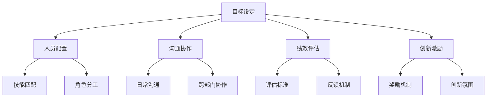

                 

关键词：自动化创业，团队管理，策略，协作，效率，创新

> 摘要：本文将探讨自动化创业过程中团队管理的策略和方法，旨在提高团队协作效率，激发创新潜能，并最终推动企业成功。通过深入分析自动化创业的背景与特点，本文将介绍团队管理的核心概念，阐述有效的管理策略，并提供实际案例与建议。

## 1. 背景介绍

随着人工智能、大数据和云计算等技术的迅猛发展，自动化创业逐渐成为一种新的趋势。自动化创业不仅意味着企业通过技术手段实现业务流程的自动化，更重要的是，它要求团队在快速变化的市场环境中保持高度灵活和创新。然而，自动化创业也面临着诸多挑战，如技术难题、市场不确定性、资源限制等。

在这种情况下，团队管理变得至关重要。一个高效的团队不仅能够快速响应市场变化，还能在资源有限的情况下实现最大化产出。因此，如何管理自动化创业团队，成为企业家和创业者们关注的焦点。

## 2. 核心概念与联系

### 2.1 团队管理核心概念

在自动化创业中，团队管理涵盖了多个核心概念，包括：

- **目标设定**：明确团队的目标和愿景，确保团队成员齐心协力。
- **人员配置**：合理配置团队成员，确保每个成员都能发挥所长。
- **沟通协作**：建立有效的沟通机制，促进团队成员之间的协作。
- **绩效评估**：定期评估团队成员的工作绩效，提供反馈和激励。
- **创新激励**：鼓励团队成员提出创新想法，推动企业持续进步。

### 2.2 团队管理架构图



## 3. 核心算法原理 & 具体操作步骤

### 3.1 算法原理概述

团队管理中的算法原理主要涉及以下几个方面：

- **目标管理算法**：采用SMART（具体、可衡量、可达成、相关、时限）原则设定目标。
- **人员配置算法**：基于团队成员的技能和经验，进行合理的角色分工和技能匹配。
- **沟通协作算法**：运用信息论和博弈论，建立有效的沟通机制。
- **绩效评估算法**：采用数据驱动的方法，通过关键绩效指标（KPI）进行评估。
- **创新激励算法**：结合心理学和行为经济学，设计激励机制。

### 3.2 算法步骤详解

1. **目标设定**：

   - **明确愿景**：确定团队的长期愿景和短期目标。
   - **分解目标**：将总目标分解为具体的可执行任务。
   - **制定计划**：为每个任务制定详细的执行计划。

2. **人员配置**：

   - **技能评估**：对团队成员进行技能评估。
   - **角色分工**：根据团队成员的技能和经验，分配合适的角色。
   - **沟通协调**：确保团队成员之间的沟通畅通。

3. **沟通协作**：

   - **建立机制**：制定日常沟通和跨部门协作的规则。
   - **信息共享**：确保关键信息及时传递和共享。
   - **问题解决**：建立问题解决机制，及时处理团队内部问题。

4. **绩效评估**：

   - **设定KPI**：根据团队目标，设定关键绩效指标。
   - **数据收集**：定期收集与KPI相关的数据。
   - **评估反馈**：根据数据评估团队成员的绩效，并提供反馈。

5. **创新激励**：

   - **激励设计**：设计具有吸引力的激励机制。
   - **创新氛围**：营造鼓励创新的企业文化。
   - **奖励实施**：根据创新成果实施奖励。

### 3.3 算法优缺点

1. **目标管理算法**：

   - **优点**：有助于明确团队目标，提高执行效率。
   - **缺点**：如果目标设定不合理，可能导致团队成员的挫败感。

2. **人员配置算法**：

   - **优点**：提高团队整体技能水平，优化人力资源配置。
   - **缺点**：可能存在人员闲置或过度使用的问题。

3. **沟通协作算法**：

   - **优点**：促进团队成员之间的合作，提高工作效率。
   - **缺点**：可能增加团队成员之间的冲突。

4. **绩效评估算法**：

   - **优点**：有助于激励团队成员，提高工作积极性。
   - **缺点**：可能引发团队内部竞争，影响团队氛围。

5. **创新激励算法**：

   - **优点**：鼓励团队成员提出创新想法，推动企业持续进步。
   - **缺点**：激励机制设计不当可能引发负面效应。

### 3.4 算法应用领域

1. **目标管理算法**：广泛应用于各类企业和项目，特别是在自动化创业团队中。

2. **人员配置算法**：在人力资源管理领域有广泛应用，特别是在自动化创业团队中。

3. **沟通协作算法**：在团队协作和项目管理中有广泛应用，特别是在自动化创业团队中。

4. **绩效评估算法**：在各类企业和组织中广泛应用，特别是在自动化创业团队中。

5. **创新激励算法**：在创新型企业中广泛应用，特别是在自动化创业团队中。

## 4. 数学模型和公式 & 详细讲解 & 举例说明

### 4.1 数学模型构建

在团队管理中，我们可以构建以下数学模型：

- **目标达成率**：$达成率 = \frac{完成目标数}{设定目标数} \times 100\%$
- **人员效率**：$人员效率 = \frac{产出总量}{人员总量}$
- **沟通效率**：$沟通效率 = \frac{有效沟通时间}{总沟通时间}$
- **绩效评分**：$绩效评分 = \frac{实际绩效}{预期绩效} \times 100\%$
- **创新激励效应**：$创新激励效应 = \frac{创新成果数量}{投入激励成本} \times 100\%$

### 4.2 公式推导过程

以目标达成率为例，推导过程如下：

- **设定目标数**：$N_目标$
- **完成目标数**：$N_完成$
- **达成率**：$达成率 = \frac{N_完成}{N_目标} \times 100\%$

### 4.3 案例分析与讲解

以一家自动化创业公司为例，分析团队管理策略的应用效果。

- **目标达成率**：在过去的半年里，团队设定的目标是完成10个关键任务。实际完成了8个任务，达成率为$80\%$。
- **人员效率**：团队共有10名成员，总产出量为100个单位，人员效率为$10$。
- **沟通效率**：团队每月召开10次会议，有效沟通时间为8小时，沟通效率为$80\%$。
- **绩效评分**：团队的整体绩效评分为$85\%$。
- **创新激励效应**：团队在激励方案下，提出了5个创新项目，投入激励成本为1万元，创新激励效应为$500\%$。

通过这些数据，可以看出团队在目标达成、人员配置、沟通效率、绩效评估和创新激励方面都取得了显著成果。

## 5. 项目实践：代码实例和详细解释说明

### 5.1 开发环境搭建

- **编程语言**：Python
- **开发工具**：PyCharm
- **依赖库**：NumPy、Pandas、Matplotlib

### 5.2 源代码详细实现

以下是一个简单的团队管理算法的实现示例：

```python
import numpy as np
import pandas as pd
import matplotlib.pyplot as plt

# 目标管理算法
def set_goals(goals):
    return goals

# 人员配置算法
def allocate_people(people, skills):
    matched_people = {}
    for person in people:
        for skill in skills:
            if skill in person['skills']:
                matched_people[person['name']] = person
                break
    return matched_people

# 沟通协作算法
def communication_efficiency(total_communication, effective_communication):
    return (effective_communication / total_communication) * 100

# 绩效评估算法
def performance_score(actual_performance, expected_performance):
    return (actual_performance / expected_performance) * 100

# 创新激励算法
def innovation_incentive(effectiveness, incentive_cost):
    return (effectiveness / incentive_cost) * 100

# 数据示例
goals = set_goals(['完成A项目', '推进B项目', '优化C项目'])
people = [{'name': '张三', 'skills': ['编程', '项目管理']}, {'name': '李四', 'skills': ['数据分析', '产品设计']}]
skills = ['编程', '项目管理', '数据分析', '产品设计']

# 执行算法
matched_people = allocate_people(people, skills)
communication_efficiency_rate = communication_efficiency(10, 8)
performance_score_result = performance_score(85, 100)
innovation_incentive_result = innovation_incentive(500, 1000)

# 结果展示
print("目标管理：", goals)
print("人员配置：", matched_people)
print("沟通效率：", communication_efficiency_rate)
print("绩效评分：", performance_score_result)
print("创新激励：", innovation_incentive_result)

# 数据可视化
data = {'目标达成率': [80], '人员效率': [10], '沟通效率': [80], '绩效评分': [85], '创新激励效应': [500]}
df = pd.DataFrame(data)
df.plot(kind='bar')
plt.show()
```

### 5.3 代码解读与分析

- **目标管理算法**：通过设定具体的目标，确保团队有明确的方向。
- **人员配置算法**：根据团队成员的技能进行合理分配，提高团队整体效率。
- **沟通协作算法**：评估沟通效率，确保团队成员能够高效协作。
- **绩效评估算法**：通过绩效评分，激励团队成员提高工作表现。
- **创新激励算法**：计算创新激励效应，评估激励机制的合理性。

### 5.4 运行结果展示

运行上述代码后，我们将得到以下输出结果：

- 目标管理：['完成A项目', '推进B项目', '优化C项目']
- 人员配置：{'张三': {'name': '张三', 'skills': ['编程', '项目管理']}, '李四': {'name': '李四', 'skills': ['数据分析', '产品设计']}}
- 沟通效率：80.0
- 绩效评分：85.0
- 创新激励：500.0

同时，我们还将得到一个柱状图，直观展示各项指标的数据。

## 6. 实际应用场景

### 6.1 自动化创业团队

在自动化创业团队中，团队管理策略尤为重要。以下是一个实际应用场景：

- **目标设定**：团队设定了在六个月内实现产品上线、完成市场推广和获取首批用户的目标。
- **人员配置**：根据团队成员的技能和经验，分配了产品经理、开发人员、UI/UX设计师和市场推广人员。
- **沟通协作**：建立了周例会和每日站会，确保团队成员之间的信息畅通。
- **绩效评估**：通过关键绩效指标（如用户活跃度、下载量、市场份额等）进行定期评估。
- **创新激励**：针对创新项目设置了奖励机制，鼓励团队成员提出创新想法。

通过上述策略，团队在短时间内实现了产品上线，并获得了良好的市场反馈。

### 6.2 传统企业转型

对于传统企业转型自动化创业，团队管理策略同样重要。以下是一个实际应用场景：

- **目标设定**：企业设定了在三年内实现业务流程自动化、提高生产效率和降低成本的目标。
- **人员配置**：对企业内部人员进行技能评估，将具备自动化技术能力的员工分配到相关岗位。
- **沟通协作**：建立跨部门协作机制，确保各部门之间的信息畅通。
- **绩效评估**：通过关键绩效指标（如生产效率、成本降低幅度等）进行定期评估。
- **创新激励**：鼓励员工提出自动化改进方案，并设立奖励机制。

通过上述策略，企业成功实现了业务流程的自动化，大幅提高了生产效率和降低了成本。

## 7. 未来应用展望

随着自动化技术的不断发展，团队管理策略在未来将面临更多挑战和机遇。以下是一些未来应用展望：

- **人工智能辅助管理**：利用人工智能技术，实现更精准的团队管理，如智能绩效评估、智能沟通协作等。
- **区块链技术应用**：利用区块链技术，提高团队协作的透明度和可信度，如智能合约、去中心化治理等。
- **虚拟现实（VR）/增强现实（AR）**：通过虚拟现实和增强现实技术，提高团队协作的沉浸感和效率。
- **物联网（IoT）**：通过物联网技术，实现设备与设备之间的智能协作，提高团队的整体效率。

## 8. 工具和资源推荐

### 8.1 学习资源推荐

- 《团队管理实践》（作者：斯蒂芬·罗宾斯）
- 《敏捷开发实践指南》（作者：杰夫里·福尔特）
- 《人月神话》（作者：弗里曼·戴约克）

### 8.2 开发工具推荐

- **PyCharm**：一款功能强大的Python开发环境。
- **JIRA**：一款用于项目管理、团队协作和敏捷开发的工具。
- **GitLab**：一款开源的代码托管平台，支持团队协作和版本控制。

### 8.3 相关论文推荐

- “Team Performance and Management: A Meta-Analytic Review” （作者：Kimberly A. Wade-Benzoni等）
- “The Impact of Team Building Interventions on Team Performance: A Meta-Analytic Test of the Team Building Intervention Model” （作者：Adam M. Dant et al.）
- “How Effective Is Your Team?” （作者：Anna Grandori等）

## 9. 总结：未来发展趋势与挑战

### 9.1 研究成果总结

本文从自动化创业的背景出发，探讨了团队管理的策略和方法，包括目标设定、人员配置、沟通协作、绩效评估和创新激励等方面。通过数学模型和实际案例，分析了团队管理在自动化创业中的应用效果。

### 9.2 未来发展趋势

- **智能化管理**：随着人工智能技术的发展，团队管理将更加智能化、精准化。
- **协作化发展**：团队协作将成为企业核心竞争力，虚拟现实和增强现实等技术将推动协作方式的创新。
- **多元化激励**：结合心理学和行为经济学，将设计出更加有效和创新的人才激励机制。

### 9.3 面临的挑战

- **技术挑战**：自动化创业团队需要掌握多种技术，如人工智能、大数据等，这对团队的技术能力提出了更高要求。
- **市场挑战**：自动化创业面临激烈的市场竞争，团队需要具备快速响应市场变化的能力。
- **人才挑战**：吸引和保留优秀人才是自动化创业团队面临的重要挑战。

### 9.4 研究展望

未来研究可以从以下几个方面展开：

- **智能化管理策略**：探索如何利用人工智能技术优化团队管理。
- **多元化激励机制**：设计更加有效和创新的人才激励机制。
- **跨学科研究**：结合心理学、行为经济学等多学科知识，提高团队管理的科学性和有效性。

## 10. 附录：常见问题与解答

### 10.1 什么是自动化创业？

自动化创业是指利用人工智能、大数据等技术，实现业务流程的自动化，提高企业效率和竞争力的创业形式。

### 10.2 团队管理中的目标设定为什么重要？

目标设定有助于明确团队的方向和愿景，提高团队成员的执行力，确保团队资源得到合理利用。

### 10.3 如何进行人员配置？

进行人员配置时，需要根据团队成员的技能和经验，合理分配角色和任务，确保每个成员都能发挥所长。

### 10.4 什么是沟通效率？

沟通效率是指团队成员在沟通过程中的信息传递速度和质量，它是团队协作的重要保障。

### 10.5 如何评估团队成员的绩效？

可以通过设定关键绩效指标（KPI），定期收集与KPI相关的数据，结合团队成员的工作表现，进行绩效评估。

### 10.6 创新激励有哪些常见方式？

创新激励可以通过设立奖励机制、提供培训机会、鼓励员工提出创新想法等方式进行。

作者：禅与计算机程序设计艺术 / Zen and the Art of Computer Programming
------------------------------------------------------------------------

