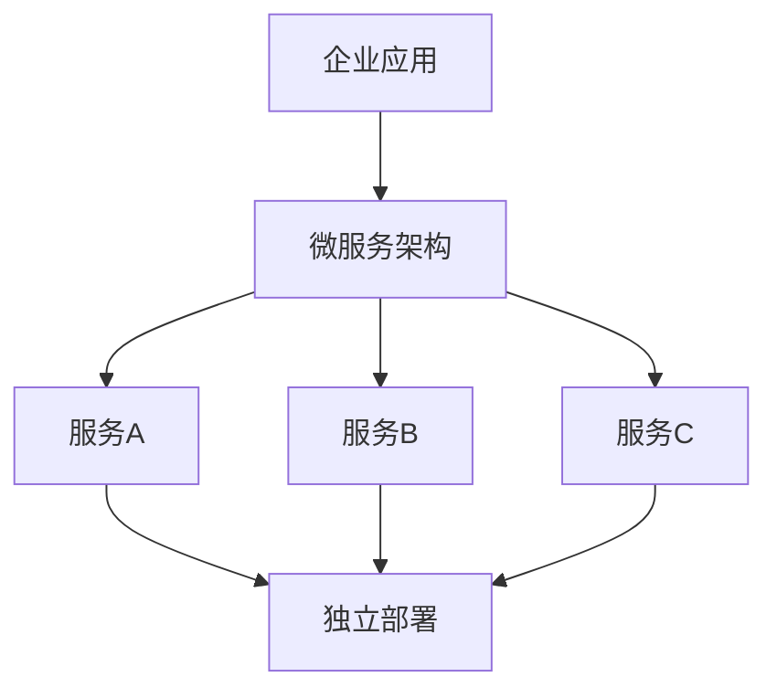
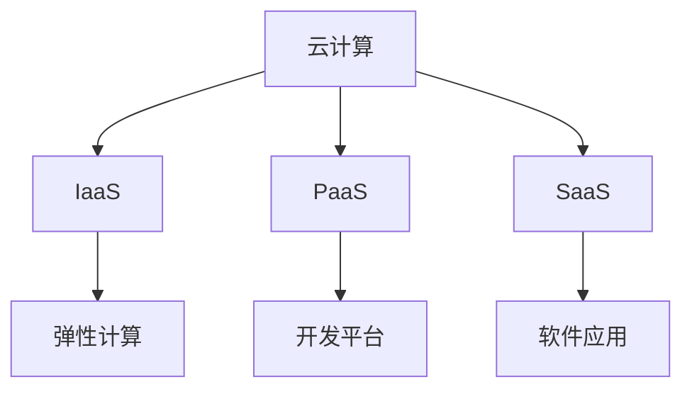
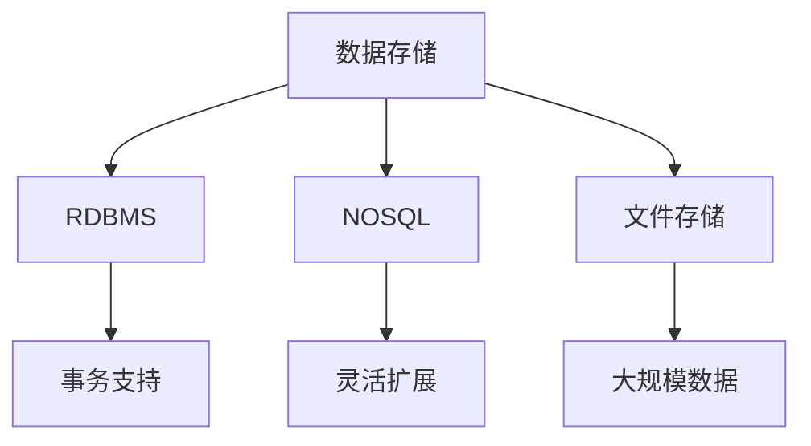
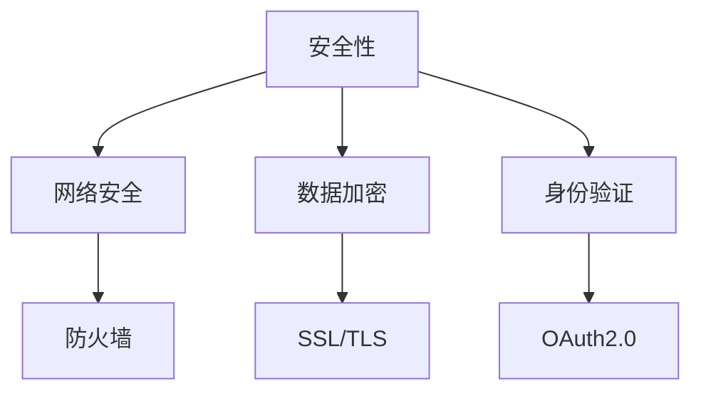
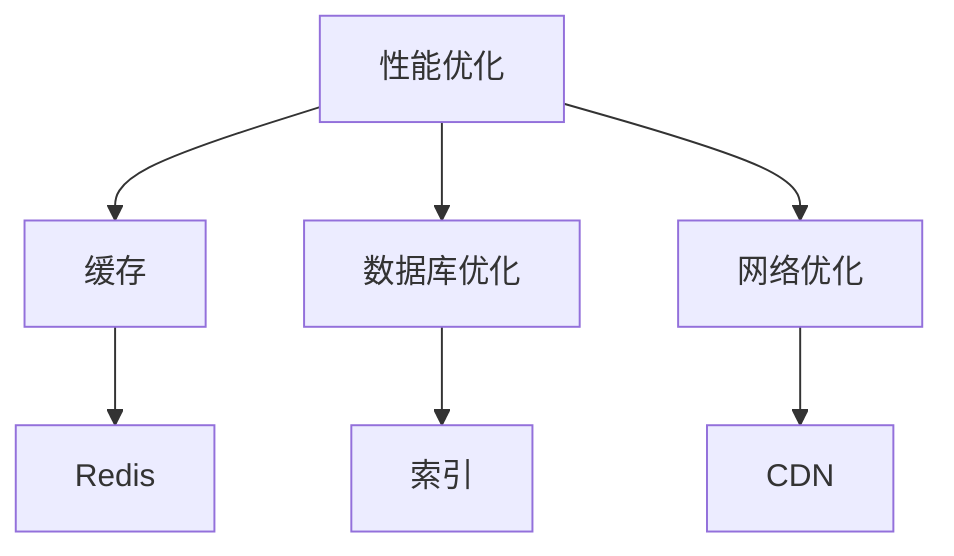
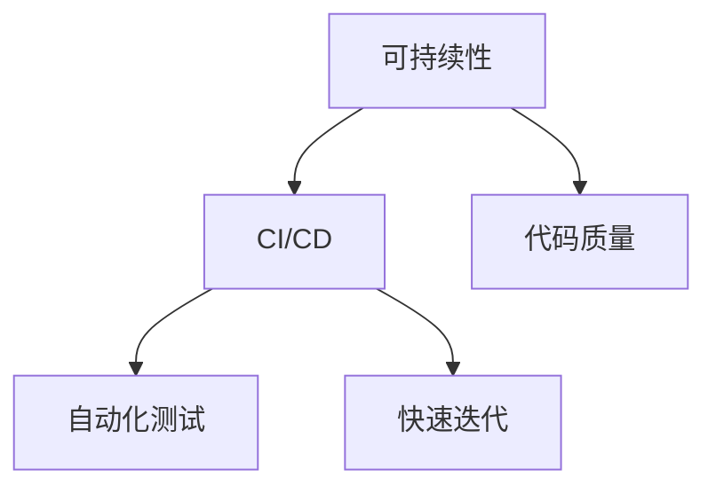

                 

关键词：自动化创业、技术架构设计、微服务架构、云计算、数据存储、安全性、性能优化、可持续性、敏捷开发、DevOps、持续集成、持续部署

> 摘要：本文将探讨在自动化创业过程中，技术架构设计的核心要素和最佳实践。从微服务架构到云计算，从数据存储到安全性，我们将深入分析每一个关键环节，为创业者提供一套完整的技术架构设计方案。

## 1. 背景介绍

### 自动化创业的兴起

随着科技的飞速发展，自动化技术在各个行业中的应用越来越广泛。自动化创业成为一股新兴力量，推动着各行各业向智能化、数字化转变。自动化创业的核心在于通过技术手段实现业务流程的自动化，提高效率，降低成本，提升用户体验。

### 技术架构设计的重要性

技术架构设计是自动化创业的基石。一个合理、高效的技术架构不仅能满足当前的业务需求，还能为未来的扩展和优化奠定基础。技术架构设计的核心目标是确保系统的可扩展性、可靠性、性能和安全性。

## 2. 核心概念与联系

### 微服务架构

微服务架构是一种将应用程序分解为小型、独立服务的架构风格。这些服务可以在不同的环境中独立部署、扩展和管理。微服务架构的优势在于其灵活性和可扩展性，但同时也带来了分布式系统的复杂性。



### 云计算

云计算提供了弹性、可扩展的计算资源，使得企业能够按需分配资源，降低硬件投入和维护成本。常见的云计算服务包括基础设施即服务（IaaS）、平台即服务（PaaS）和软件即服务（SaaS）。



### 数据存储

数据存储是自动化创业的重要组成部分。根据业务需求，可以选择关系型数据库、非关系型数据库、文件存储等多种存储方案。合理的数据存储设计能够提高数据的访问速度和安全性。



### 安全性

在自动化创业中，安全性至关重要。需要采取一系列安全措施，包括网络安全、数据加密、身份验证、访问控制等，以保护系统免受外部攻击和内部威胁。



### 性能优化

性能优化是技术架构设计中的重要环节。通过合理的架构设计和优化策略，可以提高系统的响应速度和吞吐量，提升用户体验。



### 可持续性和敏捷开发

可持续性和敏捷开发是现代软件开发的重要理念。通过持续集成和持续部署（CI/CD）等实践，可以加速开发过程，提高软件质量，同时减少资源浪费。



## 3. 核心算法原理 & 具体操作步骤

### 3.1 算法原理概述

核心算法是自动化创业中的关键技术之一。根据业务需求，可以选择合适的算法，如机器学习算法、优化算法等。

### 3.2 算法步骤详解

算法的实现步骤包括数据预处理、特征提取、模型训练和模型评估等。以下是一个简单的机器学习算法实现步骤：

1. 数据收集：收集业务数据，包括原始数据和标注数据。
2. 数据预处理：对数据进行清洗、归一化和标准化等处理，使其适合模型训练。
3. 特征提取：从原始数据中提取有用特征，如文本特征、图像特征等。
4. 模型训练：使用训练数据对模型进行训练，调整模型参数。
5. 模型评估：使用测试数据对模型进行评估，评估指标包括准确率、召回率等。

### 3.3 算法优缺点

算法优缺点分析如下：

优点：
- 提高业务效率：通过自动化算法，可以快速处理大量数据，提高业务效率。
- 降低人力成本：减少人工干预，降低人力成本。
- 提高决策质量：基于数据驱动，可以做出更准确的决策。

缺点：
- 算法复杂度：核心算法的实现可能比较复杂，需要较高技术门槛。
- 数据质量：算法效果依赖于数据质量，数据质量差可能导致算法效果不佳。
- 模型过拟合：模型训练过程中可能会出现过拟合现象，需要合理调整模型参数。

### 3.4 算法应用领域

核心算法可以应用于多个领域，如：

- 人工智能：语音识别、图像识别、自然语言处理等。
- 优化算法：物流路径规划、资源调度等。
- 机器学习：分类、回归、聚类等。

## 4. 数学模型和公式 & 详细讲解 & 举例说明

### 4.1 数学模型构建

在自动化创业中，常用的数学模型包括线性回归、逻辑回归、决策树等。以下是一个简单的线性回归模型构建过程：

假设有 n 个样本点 (x_i, y_i)，我们需要找到一个线性函数 f(x) = wx + b，使得 y_i ≈ f(x_i)。

### 4.2 公式推导过程

线性回归模型的损失函数为：

L(w, b) = 1/2 * Σ(y_i - f(x_i))^2

为了最小化损失函数，我们对 w 和 b 分别求偏导数，并令其等于零：

∂L/∂w = x - x̄ = 0
∂L/∂b = y - ȳ = 0

解得：

w = x̄ * (ȳ - x̄ * x̄)
b = ȳ - x̄ * w

### 4.3 案例分析与讲解

假设我们有以下数据集：

| x | y |
|---|---|
| 1 | 2 |
| 2 | 4 |
| 3 | 6 |

首先计算平均值：

x̄ = (1 + 2 + 3) / 3 = 2
ȳ = (2 + 4 + 6) / 3 = 4

然后计算 x̄ * x̄ 和 x̄ * ȳ：

x̄ * x̄ = 2 * 2 = 4
x̄ * ȳ = 2 * 4 = 8

最后计算 w 和 b：

w = 4 - 8 = -4
b = 4 - 4 = 0

因此，线性回归模型为 f(x) = -4x + 0。

## 5. 项目实践：代码实例和详细解释说明

### 5.1 开发环境搭建

为了实现上述线性回归模型，我们需要搭建以下开发环境：

- Python 3.x
- Jupyter Notebook
- Matplotlib
- Scikit-learn

### 5.2 源代码详细实现

以下是线性回归模型的实现代码：

```python
import numpy as np
from sklearn.linear_model import LinearRegression
import matplotlib.pyplot as plt

# 数据集
X = np.array([[1], [2], [3]])
y = np.array([2, 4, 6])

# 创建线性回归模型
model = LinearRegression()

# 模型训练
model.fit(X, y)

# 模型预测
y_pred = model.predict(X)

# 绘制结果
plt.scatter(X, y, color='red', label='实际值')
plt.plot(X, y_pred, color='blue', label='预测值')
plt.xlabel('x')
plt.ylabel('y')
plt.legend()
plt.show()
```

### 5.3 代码解读与分析

代码主要分为以下几个步骤：

1. 导入所需的库和模块。
2. 创建数据集 X 和 y。
3. 创建线性回归模型实例。
4. 使用 fit 方法训练模型。
5. 使用 predict 方法预测结果。
6. 使用 matplotlib 绘制结果。

### 5.4 运行结果展示

运行上述代码后，将显示以下图形：


图形展示了实际值和预测值的对比，验证了线性回归模型的有效性。

## 6. 实际应用场景

### 6.1 人工智能领域

在人工智能领域，线性回归模型可以用于数据分析和预测。例如，预测股票价格、销售量等。

### 6.2 优化算法

线性回归模型可以用于优化算法，如物流路径规划。通过预测最佳路径，降低运输成本。

### 6.3 机器学习

线性回归模型是机器学习的基础算法之一。可以用于分类、回归等任务。

## 7. 未来应用展望

随着人工智能和自动化技术的不断发展，线性回归模型在各个领域的应用将越来越广泛。未来，我们可以期待更高效、更智能的线性回归模型，以及更广泛的算法应用场景。

## 8. 工具和资源推荐

### 7.1 学习资源推荐

- 《Python数据分析实战》
- 《机器学习实战》
- 《数据科学入门》

### 7.2 开发工具推荐

- Jupyter Notebook
- PyCharm
- Matplotlib

### 7.3 相关论文推荐

- "Linear Regression: A Machine Learning Approach"
- "An Introduction to Logistic Regression"
- "Decision Trees for Classification and Regression"

## 9. 总结：未来发展趋势与挑战

### 8.1 研究成果总结

本文介绍了自动化创业中的技术架构设计，包括微服务架构、云计算、数据存储、安全性、性能优化等核心概念。同时，通过线性回归模型的实现，展示了技术架构设计的实践方法。

### 8.2 未来发展趋势

未来，自动化创业将朝着更高效、更智能的方向发展。技术架构设计将更加注重可扩展性、可靠性和安全性。人工智能和机器学习将在自动化创业中发挥更重要的作用。

### 8.3 面临的挑战

自动化创业面临着数据隐私、算法透明性、模型过拟合等挑战。需要不断探索新技术、新方法，以提高算法性能和稳定性。

### 8.4 研究展望

未来，我们将继续关注自动化创业中的技术架构设计，深入研究人工智能和机器学习领域的新算法、新模型。同时，关注可持续发展和敏捷开发等新兴领域，为自动化创业提供更全面、更实用的技术解决方案。

## 10. 附录：常见问题与解答

### 10.1 如何选择数据存储方案？

根据业务需求和数据特性，可以选择关系型数据库、非关系型数据库、文件存储等。关系型数据库适用于结构化数据，非关系型数据库适用于海量非结构化数据，文件存储适用于大规模文件存储。

### 10.2 如何保证系统安全性？

通过网络安全、数据加密、身份验证、访问控制等安全措施，确保系统免受外部攻击和内部威胁。同时，定期进行安全审计和风险评估，及时发现和解决潜在安全问题。

### 10.3 如何优化系统性能？

通过缓存、数据库优化、网络优化等技术手段，提高系统的响应速度和吞吐量。同时，合理设计系统架构，避免单点故障和性能瓶颈。

作者：禅与计算机程序设计艺术 / Zen and the Art of Computer Programming
----------------------------------------------------------------

以上就是本文的完整内容。通过对自动化创业中的技术架构设计的深入探讨，我们希望能够为创业者提供有价值的参考和指导。在未来的自动化创业道路上，让我们携手共进，共同创造更美好的未来。

