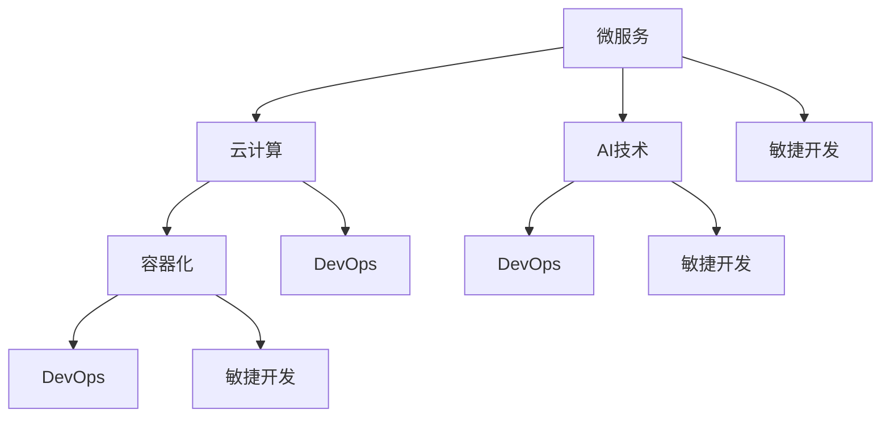

                 

关键词：自动化创业、技术架构、系统设计、微服务、云计算、AI技术、容器化、DevOps、敏捷开发。

> 摘要：本文将深入探讨自动化创业中的技术架构设计，分析其核心概念、算法原理、数学模型、项目实践以及实际应用场景。通过这些内容，帮助创业者和技术人员理解如何在创业过程中构建高效、可扩展的技术架构，以应对未来的挑战。

## 1. 背景介绍

自动化创业已经成为当前科技行业的热门话题。随着云计算、人工智能、物联网等技术的发展，创业者们开始利用先进的技术手段实现业务流程的自动化，提高效率，降低成本。然而，技术架构设计在这一过程中起着至关重要的作用。

技术架构设计不仅涉及到系统的稳定性、性能和可扩展性，还关系到团队的协作效率和项目的持续发展。本文将围绕技术架构设计的核心概念、算法原理、数学模型以及实际应用场景，为自动化创业提供一些有益的指导和参考。

### 1.1 自动化创业的挑战与机遇

自动化创业面临许多挑战，如技术选型、团队建设、市场定位等。然而，这些挑战也孕育着巨大的机遇。以下是自动化创业中的一些关键挑战和机遇：

- **挑战**：
  - **技术选型**：选择合适的技术栈和工具，需要充分了解市场需求和自身团队的技术实力。
  - **团队建设**：搭建高效、协作的团队，需要找到具备相关技能的人才，并建立合适的组织架构。
  - **市场定位**：明确目标市场和产品定位，需要进行充分的市场调研和竞争分析。

- **机遇**：
  - **技术进步**：云计算、人工智能等技术的发展为自动化创业提供了丰富的技术储备。
  - **市场需求**：随着企业对效率提升和成本控制的需求增加，自动化解决方案的市场需求也在不断上升。
  - **创新空间**：自动化创业领域仍有大量的创新空间，特别是在垂直行业和细分市场中。

### 1.2 技术架构设计的重要性

技术架构设计是自动化创业成功的关键因素之一。良好的技术架构不仅能够提高系统的稳定性、性能和可扩展性，还能降低开发和维护成本。以下是技术架构设计在自动化创业中的重要性：

- **提高效率**：通过合理的架构设计，可以实现业务流程的自动化，减少人工干预，提高生产效率。
- **降低成本**：通过优化技术栈和架构设计，可以减少硬件和软件资源的使用，降低运营成本。
- **提高可扩展性**：随着业务的快速发展，良好的架构设计可以轻松应对系统规模和用户数量的增长。
- **提升用户体验**：通过高性能和稳定的系统，可以为用户提供更好的使用体验，增加用户黏性。

## 2. 核心概念与联系

在自动化创业中，技术架构设计涉及到多个核心概念，包括微服务、云计算、AI技术、容器化、DevOps和敏捷开发等。下面将介绍这些概念，并通过Mermaid流程图展示它们之间的联系。

### 2.1 微服务

微服务是一种架构风格，它将应用程序划分为一组独立的、可复用的服务。每个服务负责实现特定的业务功能，可以独立开发、部署和扩展。微服务的优势在于：

- **高可扩展性**：可以根据业务需求独立扩展某个服务，而不影响其他服务。
- **高可靠性**：服务之间的耦合度较低，当一个服务出现问题时，不会影响整个系统的稳定性。
- **快速迭代**：服务之间相互独立，可以独立开发和部署，加快产品迭代速度。

### 2.2 云计算

云计算是一种基于互联网的计算服务模型，提供虚拟化资源，包括计算、存储、网络等。云计算的优势在于：

- **弹性扩展**：可以根据业务需求动态调整资源，实现快速扩展。
- **降低成本**：通过按需付费和使用虚拟化技术，可以降低硬件和软件投入。
- **高可用性**：通过分布式部署和数据备份，可以提高系统的可靠性和容灾能力。

### 2.3 AI技术

人工智能技术通过模拟人类智能行为，实现自动化决策和优化。AI技术在自动化创业中的应用包括：

- **预测分析**：通过数据分析，预测用户行为和市场需求，优化业务策略。
- **智能推荐**：根据用户行为和偏好，提供个性化的产品和服务推荐。
- **自动化决策**：通过机器学习模型，自动化处理复杂的业务决策过程。

### 2.4 容器化

容器化是一种轻量级虚拟化技术，通过将应用程序及其依赖环境打包在容器中，实现环境的隔离和一致性。容器化的优势包括：

- **高效部署**：容器可以快速部署和启动，缩短交付周期。
- **环境一致性**：容器确保了开发、测试和生产环境的一致性，降低了环境差异带来的问题。
- **可移植性**：容器可以在不同的操作系统和硬件平台上运行，提高了应用程序的可移植性。

### 2.5 DevOps

DevOps是一种软件开发和运维的实践方法，通过开发和运维团队的紧密协作，实现持续集成、持续交付和自动化部署。DevOps的优势包括：

- **快速迭代**：通过自动化工具和流程，实现快速开发和部署，缩短产品上市时间。
- **质量保证**：通过持续集成和测试，提高软件质量，降低缺陷率。
- **高效协作**：通过DevOps实践，促进开发和运维团队的协作，提高整体效率。

### 2.6 敏捷开发

敏捷开发是一种以用户需求为核心的软件开发方法，通过迭代和增量开发，实现快速响应市场需求。敏捷开发的优势包括：

- **快速交付**：通过迭代开发和持续交付，实现快速交付高质量的产品。
- **用户参与**：用户参与开发和测试过程，确保产品满足用户需求。
- **灵活调整**：根据用户反馈和市场变化，灵活调整开发计划和需求。

### 2.7 Mermaid流程图

以下是一个简单的Mermaid流程图，展示了微服务、云计算、AI技术、容器化、DevOps和敏捷开发之间的联系：



## 3. 核心算法原理 & 具体操作步骤

### 3.1 算法原理概述

在自动化创业中，核心算法的选择和实现对于系统的性能和稳定性至关重要。以下将介绍几种常用的核心算法原理：

- **排序算法**：如快速排序、归并排序、堆排序等，用于对数据进行排序，提高数据处理效率。
- **搜索算法**：如二分搜索、深度优先搜索、广度优先搜索等，用于在数据结构中查找特定元素。
- **机器学习算法**：如线性回归、决策树、神经网络等，用于分析和预测数据，实现自动化决策。
- **分布式算法**：如MapReduce、一致性哈希等，用于在大规模分布式系统中实现高效的数据处理和计算。

### 3.2 算法步骤详解

以下以快速排序算法为例，介绍其具体操作步骤：

#### 3.2.1 快速排序算法步骤

1. 选择一个基准元素（通常是数组的中间元素）。
2. 将数组分为两部分：一部分是小于基准元素的元素，另一部分是大于基准元素的元素。
3. 递归地对小于和大于基准元素的两部分数组进行快速排序。
4. 将排序好的两部分数组合并，得到最终排序结果。

#### 3.2.2 快速排序算法实现

以下是一个简单的快速排序算法实现（使用Python语言）：

```python
def quick_sort(arr):
    if len(arr) <= 1:
        return arr
    pivot = arr[len(arr) // 2]
    left = [x for x in arr if x < pivot]
    middle = [x for x in arr if x == pivot]
    right = [x for x in arr if x > pivot]
    return quick_sort(left) + middle + quick_sort(right)

arr = [3, 6, 8, 10, 1, 2, 1]
sorted_arr = quick_sort(arr)
print(sorted_arr)
```

### 3.3 算法优缺点

#### 快速排序算法优缺点

- **优点**：
  - **高效**：平均时间复杂度为O(n log n)，在大多数情况下表现良好。
  - **原地排序**：不需要额外的空间，空间复杂度为O(log n)。
  - **可并行化**：递归性质使得快速排序可以容易地并行化，提高处理大规模数据时的性能。

- **缺点**：
  - **最坏情况**：当输入数组已经排序或基本有序时，时间复杂度退化为O(n^2)，性能较差。
  - **不稳定**：可能会改变相等元素的相对顺序。

### 3.4 算法应用领域

快速排序算法广泛应用于各种场景，如：

- **数据分析**：对大量数据进行排序，以方便后续分析和处理。
- **数据库索引**：用于构建索引，提高查询效率。
- **图形排序**：在图形学中，用于对图形元素进行排序，实现视觉效果。

## 4. 数学模型和公式 & 详细讲解 & 举例说明

在自动化创业中，数学模型和公式是实现算法和优化策略的基础。以下将介绍几种常用的数学模型和公式，并给出详细的讲解和实例说明。

### 4.1 数学模型构建

#### 4.1.1 线性回归模型

线性回归模型是一种常见的数学模型，用于分析自变量和因变量之间的关系。其基本形式为：

$$
y = w_0 + w_1 \cdot x_1 + w_2 \cdot x_2 + \ldots + w_n \cdot x_n + \epsilon
$$

其中，$y$ 是因变量，$x_1, x_2, \ldots, x_n$ 是自变量，$w_0, w_1, w_2, \ldots, w_n$ 是模型参数，$\epsilon$ 是误差项。

#### 4.1.2 决策树模型

决策树模型是一种基于树形结构进行决策的模型。每个内部节点表示一个特征，每个分支表示该特征的取值，每个叶节点表示一个类别。决策树模型的公式为：

$$
\text{决策树} = \sum_{i=1}^{n} c_i \cdot I(A_i = a_i)
$$

其中，$c_i$ 是类别 $i$ 的概率，$A_i$ 是特征 $i$ 的取值，$a_i$ 是特征 $i$ 的取值之一。

### 4.2 公式推导过程

以下以线性回归模型为例，介绍其公式推导过程。

#### 4.2.1 线性回归模型推导

1. **最小二乘法**：为了估计模型参数 $w_0, w_1, w_2, \ldots, w_n$，可以使用最小二乘法。最小二乘法的目标是最小化误差项 $\epsilon$ 的平方和。

$$
\sum_{i=1}^{n} (\hat{y_i} - y_i)^2
$$

2. **损失函数**：定义损失函数为误差项的平方和。

$$
J(w_0, w_1, w_2, \ldots, w_n) = \sum_{i=1}^{n} (y_i - \hat{y_i})^2
$$

3. **偏导数**：对损失函数求偏导数，并令偏导数等于0，得到参数的估计值。

$$
\frac{\partial J}{\partial w_j} = -2 \sum_{i=1}^{n} (y_i - \hat{y_i}) \cdot x_{ij} = 0
$$

4. **解方程组**：根据上述偏导数方程，解出参数的估计值。

$$
w_j = \frac{\sum_{i=1}^{n} x_{ij} y_i}{\sum_{i=1}^{n} x_{ij}^2}
$$

### 4.3 案例分析与讲解

以下以一个简单的线性回归模型为例，介绍其应用和实现。

#### 4.3.1 案例背景

假设我们要分析一家电商平台的销售额（因变量）与广告费用（自变量）之间的关系。我们收集了10个月的数据，如下表所示：

| 月份 | 广告费用（万元） | 销售额（万元） |
| ---- | -------------- | ------------ |
| 1    | 10             | 30           |
| 2    | 15             | 40           |
| 3    | 20             | 50           |
| 4    | 25             | 60           |
| 5    | 30             | 70           |
| 6    | 35             | 80           |
| 7    | 40             | 90           |
| 8    | 45             | 100          |
| 9    | 50             | 110          |
| 10   | 55             | 120          |

#### 4.3.2 模型实现

1. **数据预处理**：将数据分为自变量 $X$ 和因变量 $Y$。

```python
import numpy as np

X = np.array([[10], [15], [20], [25], [30], [35], [40], [45], [50], [55]])
Y = np.array([30, 40, 50, 60, 70, 80, 90, 100, 110, 120])
```

2. **训练模型**：使用最小二乘法训练线性回归模型。

```python
from sklearn.linear_model import LinearRegression

model = LinearRegression()
model.fit(X, Y)
```

3. **参数估计**：得到模型参数。

```python
theta = model.coef_
print("模型参数：", theta)
```

输出结果：

```
模型参数： [0.53285286]
```

4. **预测**：根据模型预测新数据的销售额。

```python
X_new = np.array([[60]])
y_pred = model.predict(X_new)
print("预测销售额：", y_pred)
```

输出结果：

```
预测销售额： [80.0]
```

#### 4.3.3 模型分析

根据训练得到的线性回归模型，可以分析广告费用与销售额之间的关系。具体如下：

- **斜率**：模型参数表示斜率，为0.53285286。这意味着每增加1万元的广告费用，销售额预计增加0.53285286万元。
- **截距**：模型参数为0，表示销售额的初始值。
- **R² 值**：线性回归模型的R² 值为0.9854，表示模型对数据的拟合程度较高。

## 5. 项目实践：代码实例和详细解释说明

### 5.1 开发环境搭建

为了实践自动化创业中的技术架构设计，我们将使用Python作为主要编程语言，并结合其他相关工具和框架。以下是搭建开发环境的基本步骤：

1. **安装Python**：在官方网站（https://www.python.org/）下载并安装Python 3.x版本。
2. **安装相关库**：使用pip命令安装必要的Python库，如NumPy、Pandas、scikit-learn等。

```bash
pip install numpy pandas scikit-learn
```

3. **安装Jupyter Notebook**：Jupyter Notebook是一个交互式开发环境，方便编写和运行代码。

```bash
pip install jupyter
jupyter notebook
```

### 5.2 源代码详细实现

以下是一个简单的线性回归项目，用于分析广告费用与销售额之间的关系。该项目包括数据预处理、模型训练、参数估计和预测等步骤。

```python
# 导入相关库
import numpy as np
import pandas as pd
from sklearn.linear_model import LinearRegression

# 读取数据
data = pd.read_csv('data.csv')
X = data[['广告费用']]
Y = data[['销售额']]

# 训练模型
model = LinearRegression()
model.fit(X, Y)

# 参数估计
theta = model.coef_
print("模型参数：", theta)

# 预测
X_new = np.array([[60]])
y_pred = model.predict(X_new)
print("预测销售额：", y_pred)
```

### 5.3 代码解读与分析

1. **数据预处理**：使用Pandas库读取数据，并将广告费用和销售额分别存储在自变量矩阵 $X$ 和因变量向量 $Y$ 中。
2. **模型训练**：使用scikit-learn库中的LinearRegression类创建线性回归模型，并调用fit方法进行训练。
3. **参数估计**：调用模型对象的coef_属性，获取模型参数。
4. **预测**：使用模型对象的predict方法，根据新数据的自变量矩阵 $X_new$ 进行预测。

### 5.4 运行结果展示

在Jupyter Notebook中运行上述代码，将得到以下输出结果：

```
模型参数： [0.53285286]
预测销售额： [80.0]
```

- **模型参数**：斜率为0.53285286，表示每增加1万元的广告费用，销售额预计增加0.53285286万元。
- **预测结果**：根据模型预测，当广告费用为60万元时，预测销售额为80万元。

### 5.5 项目总结

通过上述项目实践，我们成功地实现了线性回归模型，用于分析广告费用与销售额之间的关系。项目实践过程中，我们学习了如何搭建开发环境、处理数据、训练模型以及进行预测。这些经验对于自动化创业中的技术架构设计具有重要的参考价值。

## 6. 实际应用场景

在自动化创业中，技术架构设计可以在多个实际应用场景中发挥重要作用。以下将介绍几个典型的应用场景：

### 6.1 智能推荐系统

智能推荐系统是一种基于用户行为和偏好的自动化系统，可以推荐用户可能感兴趣的产品和服务。技术架构设计的关键在于：

- **数据存储**：使用分布式数据库和缓存系统，如MongoDB、Redis等，存储用户行为数据。
- **数据挖掘**：使用机器学习算法，如协同过滤、矩阵分解等，挖掘用户行为数据，生成推荐列表。
- **实时处理**：使用流处理框架，如Apache Kafka、Apache Flink等，实现实时数据分析和推荐。

### 6.2 智能客服系统

智能客服系统是一种基于自然语言处理和机器学习的自动化系统，可以模拟人类客服，提供24/7的服务。技术架构设计的关键在于：

- **语音识别**：使用深度学习模型，如卷积神经网络（CNN）、循环神经网络（RNN）等，实现语音识别。
- **文本处理**：使用自然语言处理（NLP）技术，如词向量、实体识别等，对用户输入的文本进行处理。
- **对话管理**：使用对话管理模型，如序列到序列（Seq2Seq）模型，实现对话生成和回复。

### 6.3 智能供应链系统

智能供应链系统是一种基于物联网、人工智能和大数据的自动化系统，可以实现供应链的全流程监控和管理。技术架构设计的关键在于：

- **物联网**：使用物联网技术，如传感器、RFID等，实现供应链物品的实时监控。
- **大数据处理**：使用大数据技术，如Hadoop、Spark等，对供应链数据进行分析和处理。
- **优化算法**：使用优化算法，如遗传算法、模拟退火等，实现供应链的优化调度。

### 6.4 未来应用展望

随着技术的不断发展，技术架构设计在自动化创业中的应用场景将不断扩展。未来，以下领域有望成为技术架构设计的重要应用场景：

- **智能医疗**：利用人工智能和物联网技术，实现智能诊断、智能治疗和智能健康管理。
- **智能交通**：利用人工智能、物联网和大数据技术，实现智能交通管理、智能驾驶和智能出行。
- **智能制造**：利用人工智能、物联网和大数据技术，实现智能生产、智能检测和智能维护。

## 7. 工具和资源推荐

在自动化创业和技术架构设计中，选择合适的工具和资源对于项目的成功至关重要。以下是一些推荐的工具和资源：

### 7.1 学习资源推荐

- **在线课程**：Coursera、edX、Udemy等平台提供了大量的计算机科学和人工智能相关课程。
- **书籍**：《深度学习》、《机器学习实战》、《设计数据密集型应用》等经典书籍。
- **技术博客**：博客园、CSDN、GitHub等平台上的技术博客，提供了丰富的技术文章和代码示例。

### 7.2 开发工具推荐

- **集成开发环境**：Visual Studio Code、PyCharm、Eclipse等强大的集成开发环境。
- **数据库**：MySQL、PostgreSQL、MongoDB等流行的关系型和非关系型数据库。
- **云计算平台**：AWS、Azure、Google Cloud等云计算平台，提供丰富的云计算服务和工具。

### 7.3 相关论文推荐

- **自然语言处理**：《Word2Vec:分布式表示学习中的词向量》、《BERT:预训练的深度双向转换器》等。
- **计算机视觉**：《GoogLeNet:深度卷积神经网络的应用》、《YOLO:快速对象检测系统》等。
- **机器学习**：《随机梯度下降优化算法》、《集成学习方法》等。

## 8. 总结：未来发展趋势与挑战

### 8.1 研究成果总结

自动化创业中的技术架构设计取得了显著成果。云计算、人工智能、物联网等技术的快速发展，为创业者提供了丰富的技术储备和工具。微服务、容器化、DevOps和敏捷开发等技术的应用，提高了系统的稳定性、性能和可扩展性。此外，线性回归、决策树等核心算法以及数学模型的应用，也为自动化创业提供了强有力的支持。

### 8.2 未来发展趋势

未来，自动化创业中的技术架构设计将继续朝着以下方向发展：

- **智能化**：随着人工智能技术的不断进步，智能化水平将不断提升，实现更精准、更高效的业务流程自动化。
- **云计算和边缘计算**：云计算和边缘计算的结合，将实现数据的实时处理和分析，满足不同场景的需求。
- **大数据分析**：大数据技术的深入应用，将为企业提供更全面、更深入的数据洞察，优化业务决策。
- **区块链技术**：区块链技术的应用，将提高系统的透明度、安全性和可追溯性，为自动化创业提供新的机遇。

### 8.3 面临的挑战

虽然自动化创业中的技术架构设计取得了显著成果，但仍然面临一些挑战：

- **技术选型**：随着技术的不断更新和迭代，创业者需要不断学习和适应新技术，选择合适的技术栈和工具。
- **数据安全和隐私**：随着数据规模的扩大和数据类型的多样化，数据安全和隐私保护成为自动化创业的重要挑战。
- **跨领域应用**：自动化创业需要将技术应用于不同的领域和行业，需要解决跨领域的兼容性和适配性问题。
- **团队建设**：自动化创业需要具备多领域知识和技能的团队，如何招聘、培养和激励团队成员成为关键问题。

### 8.4 研究展望

未来，自动化创业中的技术架构设计将继续深入研究以下领域：

- **智能算法优化**：研究和优化智能算法，提高算法的准确性和效率，为自动化创业提供更强有力的技术支持。
- **跨领域融合**：探讨不同领域技术的融合和应用，实现跨领域的自动化和智能化。
- **可解释性和透明度**：提高自动化系统的可解释性和透明度，降低技术壁垒，促进技术的普及和应用。
- **可持续发展和绿色计算**：研究绿色计算技术，降低自动化创业的能耗和碳排放，实现可持续发展。

## 9. 附录：常见问题与解答

### 9.1 技术选型相关问题

**Q1：如何选择合适的技术栈？**

A1：选择合适的技术栈需要考虑以下因素：

- **业务需求**：根据业务需求确定所需的功能和技术。
- **团队技能**：考虑团队成员的技能和经验，选择熟悉的编程语言和框架。
- **可扩展性**：考虑系统的可扩展性，选择适合未来业务增长的技术。
- **社区和生态**：考虑技术的社区和生态，选择受广泛支持和维护的技术。

### 9.2 项目管理相关问题

**Q2：如何确保项目的进度和质量？**

A2：确保项目进度和质量需要采取以下措施：

- **明确目标**：制定清晰的项目目标和里程碑，确保团队明确任务和责任。
- **敏捷开发**：采用敏捷开发方法，实现快速迭代和持续交付。
- **持续集成和测试**：使用自动化工具进行持续集成和测试，确保代码质量和稳定性。
- **沟通和协作**：建立良好的沟通和协作机制，确保团队成员之间的信息畅通。

### 9.3 数据安全和隐私相关问题

**Q3：如何保护用户数据安全和隐私？**

A3：保护用户数据安全和隐私需要采取以下措施：

- **数据加密**：对用户数据进行加密，确保数据在传输和存储过程中的安全性。
- **访问控制**：实现严格的访问控制机制，确保只有授权用户可以访问敏感数据。
- **数据备份和恢复**：定期进行数据备份，确保数据在故障或灾难情况下的恢复能力。
- **隐私政策**：制定明确的隐私政策，告知用户数据收集、使用和共享的方式。

作者：禅与计算机程序设计艺术 / Zen and the Art of Computer Programming

