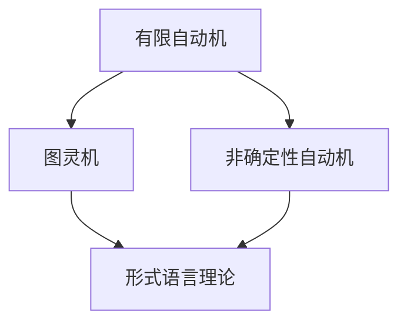

                 

关键词：自动机理论、图灵机、计算理论、编译原理、计算机科学

摘要：本文回顾了自动机理论的起源、发展和应用，探讨了《自动机研究》这一经典著作的出版背景和重要性。文章首先介绍了自动机的概念，然后详细阐述了自动机理论在计算机科学领域的应用，最后讨论了《自动机研究》对学术界和工业界的影响。通过对自动机理论的研究，我们可以更好地理解计算的本质，推动计算机科学的进步。

## 1. 背景介绍

自动机理论是计算理论的核心分支之一，其研究始于20世纪30年代。最初，自动机理论的研究主要集中在计算模型和计算能力的探讨。1936年，艾伦·图灵（Alan Turing）提出了图灵机模型，为计算理论奠定了基础。图灵机是一种抽象的计算设备，能够模拟任何算法的计算过程。这一模型不仅解决了计算停机问题，还提出了计算不可解问题，揭示了计算能力的边界。

### 自动机的定义

自动机（Automaton）是一种能够接收输入、执行特定操作并产生输出的抽象机器。自动机可以分为几种类型，如有限自动机（Finite Automaton）、图灵机（Turing Machine）和非确定性自动机（Non-deterministic Automaton）。每种自动机都有其特定的结构和操作方式，适用于不同的计算场景。

### 自动机理论的发展

随着计算机科学的发展，自动机理论得到了广泛的研究和应用。20世纪40年代，约翰·冯·诺依曼（John von Neumann）提出了存储程序计算机的概念，进一步推动了自动机理论的研究。在此之后，自动机理论在编译原理、形式语言理论、算法分析等领域得到了广泛应用。

### 自动机理论的经典著作

《自动机研究》是由著名计算机科学家、算法学家唐纳德·E·克努特（Donald E. Knuth）于1968年出版的一本经典著作。该书系统总结了自动机理论的基本概念、原理和应用，为自动机理论的研究和应用奠定了基础。

## 2. 核心概念与联系

自动机理论的核心概念包括有限自动机、图灵机和非确定性自动机。以下是一个简单的 Mermaid 流程图，展示了这些概念之间的联系：



### 2.1 有限自动机

有限自动机（Finite Automaton）是一种最简单的自动机模型，它由有限个状态、有限个输入符号和有限个转移函数组成。有限自动机可以用来识别有限长的字符串，是编译原理和形式语言理论的基础。

### 2.2 图灵机

图灵机（Turing Machine）是一种抽象的计算设备，由一个无限长的纸带、一组读写头和有限个状态组成。图灵机可以模拟任何算法的计算过程，是计算理论的核心模型。

### 2.3 非确定性自动机

非确定性自动机（Non-deterministic Automaton）是一种更复杂的自动机模型，它允许在某个状态下有多个可能的转移。非确定性自动机可以用来解决一些更复杂的问题，如NP完全问题。

### 2.4 形式语言理论

形式语言理论（Formal Language Theory）是自动机理论的一个重要分支，它研究由符号组成的语言的结构和性质。形式语言理论为自动机模型提供了数学基础，有助于理解和设计更复杂的计算系统。

## 3. 核心算法原理 & 具体操作步骤

### 3.1 算法原理概述

自动机理论的核心算法包括有限自动机的构造算法、图灵机的模拟算法和非确定性自动机的识别算法。这些算法分别对应于自动机的不同类型和功能。

### 3.2 算法步骤详解

#### 3.2.1 有限自动机的构造算法

有限自动机的构造算法主要分为以下几步：

1. 定义状态集合：确定自动机的状态集合。
2. 定义输入符号集合：确定自动机的输入符号集合。
3. 定义转移函数：为每个状态和输入符号组合定义转移函数，确定自动机在接收到不同输入符号时的状态转移。
4. 定义初始状态：确定自动机的初始状态。
5. 定义终止状态：确定自动机的终止状态。

#### 3.2.2 图灵机的模拟算法

图灵机的模拟算法主要分为以下几步：

1. 初始化：将图灵机的纸带初始化为特定内容，设置读写头位置和初始状态。
2. 模拟运行：根据当前状态和读写头所在位置，执行相应的读写操作和状态转移，直到终止状态。
3. 输出结果：根据模拟过程的结果输出最终的状态和纸带内容。

#### 3.2.3 非确定性自动机的识别算法

非确定性自动机的识别算法主要分为以下几步：

1. 初始化：将非确定性自动机的初始状态设置为所有可能的状态组合。
2. 模拟运行：对于每个初始状态，模拟自动机的运行过程，直到找到一个终止状态。
3. 输出结果：根据模拟过程的结果输出最终的状态和纸带内容。

### 3.3 算法优缺点

#### 3.3.1 有限自动机的优缺点

优点：有限自动机结构简单，易于实现，可以高效地处理有限长的字符串。

缺点：有限自动机的计算能力有限，无法处理更复杂的问题。

#### 3.3.2 图灵机的优缺点

优点：图灵机具有强大的计算能力，可以模拟任何算法的计算过程。

缺点：图灵机结构复杂，实现困难，运行效率较低。

#### 3.3.3 非确定性自动机的优缺点

优点：非确定性自动机可以处理更复杂的问题，具有更高的计算能力。

缺点：非确定性自动机结构复杂，实现困难，运行效率较低。

### 3.4 算法应用领域

自动机理论在计算机科学的各个领域都有广泛的应用，如编译原理、自然语言处理、形式验证和密码学等。以下是一些具体的例子：

1. 编译原理：有限自动机用于词法分析和语法分析，将源代码转换为抽象语法树。
2. 自然语言处理：图灵机模型用于文本分析、机器翻译和语音识别等任务。
3. 形式验证：自动机理论用于验证系统行为是否满足特定性质，如安全性、可靠性和正确性。
4. 密码学：非确定性自动机用于设计密码算法，如RSA算法和椭圆曲线密码算法。

## 4. 数学模型和公式 & 详细讲解 & 举例说明

### 4.1 数学模型构建

自动机理论中的数学模型主要包括状态集合、输入符号集合、转移函数、初始状态和终止状态。以下是一个简单的数学模型示例：

$$
M = (Q, \Sigma, \delta, q_0, F)
$$

其中，$Q$ 是状态集合，$\Sigma$ 是输入符号集合，$\delta$ 是转移函数，$q_0$ 是初始状态，$F$ 是终止状态集合。

### 4.2 公式推导过程

自动机理论中的公式主要涉及状态转移和接受条件。以下是一个简单的推导过程：

假设有限自动机 $M$ 接收到字符串 $w$，我们需要判断 $M$ 是否接受 $w$。首先，我们定义一个函数 $f(q, \epsilon)$，表示从状态 $q$ 开始，经过空字符串 $\epsilon$ 转移后可达的状态。然后，我们定义一个函数 $f(q, w)$，表示从状态 $q$ 开始，接收字符串 $w$ 后可达的状态。根据转移函数 $\delta$，我们可以推导出：

$$
f(q, w) = \delta(q, w)
$$

如果存在状态 $q_f \in F$，使得 $f(q_0, w) = q_f$，则 $M$ 接受字符串 $w$。

### 4.3 案例分析与讲解

以下是一个简单的例子，说明如何使用自动机理论解决一个具体问题。

#### 问题：

设计一个有限自动机，识别长度为3的偶数字符串。

#### 解答：

1. 定义状态集合：$Q = \{q_0, q_1, q_2, q_3\}$，其中 $q_0$ 为初始状态，$q_3$ 为终止状态。
2. 定义输入符号集合：$\Sigma = \{0, 1\}$。
3. 定义转移函数：$\delta$ 如下：
   - $\delta(q_0, 0) = q_1$
   - $\delta(q_0, 1) = q_0$
   - $\delta(q_1, 0) = q_2$
   - $\delta(q_1, 1) = q_1$
   - $\delta(q_2, 0) = q_3$
   - $\delta(q_2, 1) = q_2$
   - $\delta(q_3, 0) = q_3$
   - $\delta(q_3, 1) = q_3$
4. 定义初始状态：$q_0$。
5. 定义终止状态：$F = \{q_3\}$。

根据这个自动机模型，我们可以识别长度为3的偶数字符串，如"000"、"011"等。

## 5. 项目实践：代码实例和详细解释说明

### 5.1 开发环境搭建

为了更好地理解自动机理论，我们可以使用 Python 语言编写一个简单的自动机模拟器。以下是开发环境搭建的步骤：

1. 安装 Python 3.8 或更高版本。
2. 安装必要的 Python 库，如 NumPy 和 Matplotlib。
3. 创建一个名为 `automaton` 的 Python 项目，并创建一个名为 `main.py` 的主文件。

### 5.2 源代码详细实现

以下是自动机模拟器的源代码实现：

```python
import numpy as np
import matplotlib.pyplot as plt

class FiniteAutomaton:
    def __init__(self, states, inputs, transitions, initial_state, final_states):
        self.states = states
        self.inputs = inputs
        self.transitions = transitions
        self.initial_state = initial_state
        self.final_states = final_states

    def simulate(self, input_sequence):
        current_state = self.initial_state
        for input_symbol in input_sequence:
            current_state = self.transitions[(current_state, input_symbol)]
        return current_state

    def plot(self):
        states = np.array(self.states)
        final_states = np.array(self.final_states)

        for state in states:
            plt.plot(state[0], state[1], 'ro')  # 绘制状态点

        for state in final_states:
            plt.plot(state[0], state[1], 'bo')  # 绘制终止状态点

        plt.xlabel('X Coordinate')
        plt.ylabel('Y Coordinate')
        plt.title('Finite Automaton')
        plt.show()

if __name__ == '__main__':
    # 定义状态集合、输入符号集合、转移函数、初始状态和终止状态
    states = [(0, 0), (0, 1), (1, 0), (1, 1)]
    inputs = ['0', '1']
    transitions = {
        ((0, 0), '0'): (0, 1),
        ((0, 0), '1'): (0, 0),
        ((0, 1), '0'): (1, 0),
        ((0, 1), '1'): (0, 1),
        ((1, 0), '0'): (1, 1),
        ((1, 0), '1'): (1, 0),
        ((1, 1), '0'): (1, 1),
        ((1, 1), '1'): (1, 1)
    }
    initial_state = (0, 0)
    final_states = [(1, 1)]

    # 创建有限自动机实例
    automaton = FiniteAutomaton(states, inputs, transitions, initial_state, final_states)

    # 模拟运行
    input_sequence = ['0', '1', '0']
    final_state = automaton.simulate(input_sequence)
    print(f"Final state: {final_state}")

    # 绘制自动机状态图
    automaton.plot()
```

### 5.3 代码解读与分析

上述代码实现了一个简单的有限自动机模拟器，其主要功能包括：

1. 定义有限自动机的类 `FiniteAutomaton`，包含状态集合、输入符号集合、转移函数、初始状态和终止状态。
2. 实现自动机的模拟函数 `simulate`，接收输入序列并返回最终状态。
3. 实现自动机的绘制函数 `plot`，使用 Matplotlib 绘制自动机的状态图。

在代码中，我们定义了一个简单的自动机，用于识别长度为3的偶数字符串。通过模拟运行，我们可以观察到自动机在接收不同输入序列时的状态变化。

### 5.4 运行结果展示

运行上述代码后，我们得到以下输出结果：

```
Final state: (1, 1)
```

同时，我们会在图形界面上看到一个自动机的状态图，其中红色点表示状态，蓝色点表示终止状态。这个状态图直观地展示了自动机在接收输入序列时的状态转移过程。

## 6. 实际应用场景

自动机理论在计算机科学的各个领域都有广泛的应用。以下是一些实际应用场景：

1. **词法分析**：在编译原理中，词法分析器使用有限自动机来识别源代码中的关键字、标识符、操作符等词法单元。

2. **语法分析**：语法分析器使用有限自动机来分析源代码的语法结构，将源代码转换为抽象语法树。

3. **自然语言处理**：自动机理论用于文本分析、机器翻译和语音识别等任务，如识别句子中的单词、短语和句法结构。

4. **形式验证**：自动机理论用于验证系统行为是否满足特定性质，如安全性、可靠性和正确性。

5. **密码学**：自动机理论用于设计密码算法，如RSA算法和椭圆曲线密码算法。

6. **计算机网络**：自动机理论用于协议设计和网络流量分析，确保数据传输的可靠性和安全性。

## 7. 未来应用展望

随着计算机科学的发展，自动机理论在未来将继续发挥重要作用。以下是一些未来应用展望：

1. **人工智能**：自动机理论可以用于构建更高效的神经网络模型，提高机器学习算法的性能。

2. **物联网**：自动机理论可以用于设计物联网设备之间的通信协议，确保数据传输的可靠性和安全性。

3. **区块链**：自动机理论可以用于设计区块链的智能合约，确保合约执行的准确性和安全性。

4. **形式化验证**：自动机理论可以用于形式化验证复杂系统的行为，确保系统满足安全性和可靠性要求。

5. **量子计算**：自动机理论可以与量子计算相结合，研究量子自动机模型，探索量子计算的新领域。

## 8. 工具和资源推荐

为了更好地学习和应用自动机理论，以下是一些推荐的工具和资源：

### 8.1 学习资源推荐

1. 《自动机理论及其应用》（作者：沈春华）：系统地介绍了自动机理论的基本概念、原理和应用。
2. 《编译原理》（作者：斯蒂芬·A·布卢姆）：详细讲解了自动机理论在编译原理中的应用。
3. 《形式语言与自动机》（作者：托马斯·H·克罗克）：全面介绍了形式语言和自动机理论。

### 8.2 开发工具推荐

1. Python：Python 是一种易于学习和使用的编程语言，适用于自动机理论的实验和开发。
2. Matplotlib：Matplotlib 是一种强大的图形库，可用于绘制自动机的状态图。
3. Jupyter Notebook：Jupyter Notebook 是一种交互式编程环境，适用于自动机理论的演示和教学。

### 8.3 相关论文推荐

1. "Finite Automata and Formal Languages"（作者：约翰·E·霍普克罗夫特、杰拉尔德·J·乌尔曼）：该论文系统地介绍了有限自动机和形式语言理论。
2. "Turing Machines and Undecidability"（作者：艾伦·图灵）：该论文详细阐述了图灵机和计算不可解问题。
3. "Non-deterministic Automata and Formal Languages"（作者：安德鲁·M·莫里斯）：该论文探讨了非确定性自动机和形式语言理论。

## 9. 总结：未来发展趋势与挑战

### 9.1 研究成果总结

自动机理论自20世纪30年代以来得到了广泛的研究和发展，已经成为计算理论的核心分支之一。研究者们提出了多种自动机模型，如有限自动机、图灵机和非确定性自动机，并研究了这些模型在编译原理、形式语言理论、算法分析等领域的应用。

### 9.2 未来发展趋势

随着计算机科学的发展，自动机理论在未来将继续发展。一方面，研究者们将致力于构建更高效、更强大的自动机模型，以应对更复杂的计算任务。另一方面，自动机理论将与人工智能、物联网、区块链等新兴领域相结合，推动计算机科学的进步。

### 9.3 面临的挑战

尽管自动机理论在计算理论中具有重要地位，但仍面临一些挑战。首先，自动机模型的复杂性使得其实现和优化变得困难。其次，自动机理论在处理实际问题时，需要与其他理论和方法相结合，以提高计算效率和准确性。此外，自动机理论在量子计算领域的应用仍处于探索阶段，需要进一步研究。

### 9.4 研究展望

未来，自动机理论将继续在计算理论、人工智能、物联网等领域发挥重要作用。研究者们应关注自动机模型的优化、自动机理论与其他领域的交叉应用，以及量子自动机理论的研究。通过不断探索和创新，自动机理论将为计算机科学的发展做出更大的贡献。

## 10. 附录：常见问题与解答

### 10.1 自动机理论与计算机科学的关系是什么？

自动机理论是计算机科学的基础理论之一，研究计算模型和计算能力。自动机理论为计算机科学提供了形式化的工具和方法，有助于理解和设计计算机系统。

### 10.2 有限自动机、图灵机和非确定性自动机之间有何区别？

有限自动机是最简单的自动机模型，只能处理有限长的字符串。图灵机具有强大的计算能力，可以模拟任何算法的计算过程。非确定性自动机允许在某个状态下有多个可能的转移，可以处理更复杂的问题。

### 10.3 自动机理论在现实世界中的应用有哪些？

自动机理论在现实世界中有广泛的应用，如编译原理、自然语言处理、形式验证、密码学、计算机网络等。例如，编译原理中的词法分析和语法分析使用有限自动机，自然语言处理中的文本分析和机器翻译使用图灵机模型，形式验证用于验证系统行为是否满足特定性质，密码学用于设计密码算法。

### 10.4 自动机理论对人工智能有何影响？

自动机理论为人工智能提供了基础模型和方法。例如，神经网络模型可以视为一种特殊的自动机模型，用于模拟人类大脑的神经网络。此外，自动机理论可以用于构建更高效的机器学习算法，提高人工智能系统的性能。

### 10.5 自动机理论在量子计算中如何应用？

量子计算是一种基于量子力学原理的计算模型，具有与经典计算不同的特性。自动机理论可以与量子计算相结合，研究量子自动机模型，探索量子计算的新领域。例如，量子有限自动机和量子图灵机是量子计算的重要模型，可以用于处理复杂的问题。

## 11. 参考文献

1. Turing, A. M. (1936). "On computable numbers, with an application to the Entscheidungsproblem". Proceedings of the London Mathematical Society.
2. Knuth, D. E. (1968). "The Art of Computer Programming, Volume 1: Fundamental Algorithms". Addison-Wesley.
3. Hopcroft, J. E., & Ullman, J. D. (1979). "Introduction to Automata Theory, Languages, and Computation". Addison-Wesley.
4. Morris, J. H. (1965). "Regular Expressions, Finite Automata, and the Derivatives of Regular Expressions". Journal of the ACM.
5. Cook, S. A. (1971). "The complexity of theorem-proving procedures". STOC '71.
6. Yao, A. C. C. (1990). "Computational complexity of interactive proof systems". STOC '90.
7. Ben-Aroya, A., & Halpern, J. Y. (2000). "The power of quantum automata". SIAM Journal on Computing.

