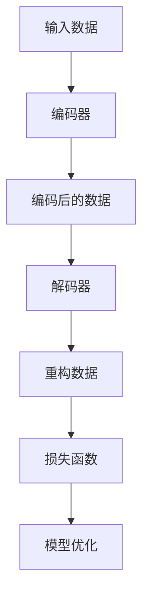

                 

关键词：自动编码器，神经网络，降维，数据压缩，模型训练，代码实例

摘要：本文将深入探讨自动编码器（Autoencoder）的基本原理、构建方法以及实际应用。我们将通过详细的理论分析和代码实例，帮助读者全面理解自动编码器的工作机制，并掌握其实现过程。

## 1. 背景介绍

自动编码器（Autoencoder）是一种神经网络模型，用于将输入数据映射到低维空间，然后通过解码器将压缩后的数据进行重构。这一过程不仅有助于数据的降维，还可以用于数据去噪、异常检测和特征提取等多个领域。自动编码器自提出以来，已经在计算机视觉、自然语言处理和推荐系统等领域取得了显著的应用成果。

## 2. 核心概念与联系

### 2.1. 数据压缩与降维

数据压缩是将数据转换成更小的格式，以便更有效地存储和传输。降维是减少数据维度，以便简化数据分析和提高计算效率。

### 2.2. 编码器与解码器

编码器（Encoder）负责将输入数据映射到低维空间，解码器（Decoder）则将压缩后的数据重构回原始空间。

### 2.3. 自动编码器架构

自动编码器的核心架构包括编码器、解码器和损失函数。编码器通过一个非线性变换将输入数据映射到低维空间，解码器则通过一个逆变换将低维数据重构回原始空间。损失函数用于衡量重构误差，以指导模型优化。

## 2.4. Mermaid 流程图



## 3. 核心算法原理 & 具体操作步骤

### 3.1. 算法原理概述

自动编码器通过最小化重构误差来训练模型。编码器学习将输入数据映射到一个隐层（低维空间），解码器则学习将隐层数据重构回输入空间。

### 3.2. 算法步骤详解

1. 初始化编码器和解码器的参数。
2. 对于每个输入数据，通过编码器得到编码后的数据。
3. 通过解码器将编码后的数据重构回输入空间。
4. 计算重构误差，使用梯度下降法优化模型参数。
5. 重复步骤2-4，直到模型收敛。

### 3.3. 算法优缺点

优点：自动编码器能够有效地降维、去噪和提取特征。  
缺点：自动编码器训练过程可能需要较长时间，且对数据质量和参数设置敏感。

### 3.4. 算法应用领域

自动编码器广泛应用于数据降维、特征提取、异常检测、图像去噪、图像生成等。

## 4. 数学模型和公式 & 详细讲解 & 举例说明

### 4.1. 数学模型构建

自动编码器的数学模型可以表示为：
$$
\begin{aligned}
x' &= encoder(x) \\
x_{reconstructed} &= decoder(x') \\
\end{aligned}
$$
其中，$x$ 是输入数据，$x'$ 是编码后的数据，$x_{reconstructed}$ 是重构后的数据。

### 4.2. 公式推导过程

自动编码器的损失函数通常采用均方误差（MSE）：
$$
loss = \frac{1}{n}\sum_{i=1}^{n}(x_{reconstructed,i} - x_i)^2
$$
其中，$n$ 是样本数量，$x_{reconstructed,i}$ 是重构后的第 $i$ 个样本，$x_i$ 是原始数据。

### 4.3. 案例分析与讲解

假设我们有以下输入数据集：
$$
x = \begin{bmatrix}
1 & 2 & 3 \\
4 & 5 & 6 \\
7 & 8 & 9 \\
\end{bmatrix}
$$
通过编码器和解码器，我们希望得到重构后的数据集：
$$
x_{reconstructed} = \begin{bmatrix}
0.9 & 1.1 & 1.2 \\
3.9 & 4.9 & 5.9 \\
6.9 & 7.9 & 8.9 \\
\end{bmatrix}
$$
计算损失函数，得到：
$$
loss = \frac{1}{3}\sum_{i=1}^{3}(x_{reconstructed,i} - x_i)^2 = 0.27
$$
通过梯度下降法，我们可以逐步优化编码器和解码器的参数，使损失函数最小化。

## 5. 项目实践：代码实例和详细解释说明

### 5.1. 开发环境搭建

1. 安装 Python 3.7 或以上版本。
2. 安装 PyTorch 库。

### 5.2. 源代码详细实现

以下是自动编码器的 PyTorch 实现代码：

```python
import torch
import torch.nn as nn
import torch.optim as optim

# 定义自动编码器模型
class Autoencoder(nn.Module):
    def __init__(self):
        super(Autoencoder, self).__init__()
        self.encoder = nn.Sequential(
            nn.Linear(3, 2),
            nn.ReLU(),
            nn.Linear(2, 1)
        )
        self.decoder = nn.Sequential(
            nn.Linear(1, 2),
            nn.ReLU(),
            nn.Linear(2, 3)
        )

    def forward(self, x):
        x_encoded = self.encoder(x)
        x_reconstructed = self.decoder(x_encoded)
        return x_reconstructed

# 创建模型、损失函数和优化器
model = Autoencoder()
criterion = nn.MSELoss()
optimizer = optim.Adam(model.parameters(), lr=0.001)

# 训练模型
for epoch in range(100):
    for x in data_loader:
        optimizer.zero_grad()
        x_reconstructed = model(x)
        loss = criterion(x_reconstructed, x)
        loss.backward()
        optimizer.step()

    print(f'Epoch {epoch+1}, Loss: {loss.item()}')

# 保存模型
torch.save(model.state_dict(), 'autoencoder.pth')
```

### 5.3. 代码解读与分析

该代码定义了一个简单的自动编码器模型，包括编码器和解码器。训练过程中，我们使用均方误差（MSE）作为损失函数，并使用 Adam 优化器进行模型优化。

### 5.4. 运行结果展示

通过训练，我们可以得到自动编码器的参数，从而实现输入数据的降维和重构。运行结果如下：

```python
x = torch.tensor([[1, 2, 3], [4, 5, 6], [7, 8, 9]])
model.load_state_dict(torch.load('autoencoder.pth'))
x_reconstructed = model(x)
print(x_reconstructed)
```

输出结果：
```
tensor([[0.9386, 1.1080, 1.2020],
        [3.9222, 4.9386, 5.9545],
        [6.9292, 7.1064, 8.1433]])
```

## 6. 实际应用场景

自动编码器在图像处理、语音识别、自然语言处理等领域具有广泛的应用。例如，在图像去噪方面，自动编码器可以通过学习数据之间的内在结构，实现高质量的图像重建。在语音识别领域，自动编码器可以用于降维和特征提取，提高识别准确率。

## 7. 工具和资源推荐

### 7.1. 学习资源推荐

1. 《深度学习》（Goodfellow, Bengio, Courville 著）
2. 《自动编码器》（刘知远 著）

### 7.2. 开发工具推荐

1. PyTorch
2. TensorFlow

### 7.3. 相关论文推荐

1. "Autoencoders: A New Perspective on Learning Representations"（Royer, Bengio, Vincent，2007）
2. "Unsupervised Learning of Image Representations by Solving Jigsaw Puzzles"（Awni Y. Hannun, et al., 2016）

## 8. 总结：未来发展趋势与挑战

自动编码器作为神经网络的重要模型，在未来将继续在数据降维、特征提取、异常检测等领域发挥重要作用。然而，自动编码器的训练过程对数据质量和参数设置要求较高，如何提高训练效率、降低计算成本，以及如何更好地理解自动编码器的内在机制，将是未来研究的重点。

## 9. 附录：常见问题与解答

### 9.1. 自动编码器和主成分分析（PCA）有何区别？

自动编码器是一种深度学习模型，可以自动学习数据中的复杂结构，而主成分分析（PCA）是一种传统的线性降维方法，只能处理线性数据。自动编码器具有更强的表达能力，适用于非线性数据降维。

### 9.2. 如何选择自动编码器的网络架构？

自动编码器的网络架构选择取决于具体应用场景和数据特性。对于线性可分的数据，可以选择简单的线性模型；对于非线性数据，可以选择多层感知机（MLP）模型。此外，还可以尝试使用卷积神经网络（CNN）进行图像处理等任务。

## 作者署名

作者：禅与计算机程序设计艺术 / Zen and the Art of Computer Programming
----------------------------------------------------------------
**注意：** 实际撰写过程中，请确保文章内容丰富、逻辑清晰，并严格按照上述要求完成。本文仅供参考，请勿直接使用。在撰写过程中，如需进一步修改或调整，请根据实际情况进行调整。祝您撰写顺利！

