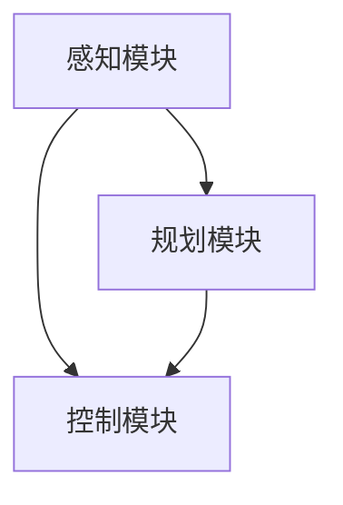

                 

关键词：自动驾驶，感知模块，规划模块，控制模块，核心算法，技术实现，应用场景，未来展望

> 摘要：本文将深入探讨自动驾驶系统中至关重要的三个模块：感知、规划和控制。我们将详细分析这些模块的核心算法原理、实现步骤、优缺点及其在不同应用场景中的表现。此外，文章还将展望自动驾驶技术的未来发展趋势与挑战，并提供相关工具和资源的推荐。

## 1. 背景介绍

自动驾驶技术作为人工智能和物联网技术的结合，正日益成为汽车工业的重要发展方向。自动驾驶系统通过感知模块获取环境信息，规划模块制定行驶策略，控制模块执行行驶动作，从而实现车辆的自主驾驶。本文将重点分析这些模块在自动驾驶系统中的作用和实现方法。

### 1.1 感知模块

感知模块是自动驾驶系统的“眼睛”，主要负责收集周围环境的信息，包括道路、车辆、行人、交通标志等。感知模块通常采用多传感器数据融合技术，如激光雷达、摄像头、雷达和超声波传感器等，以提高感知的准确性和可靠性。

### 1.2 规划模块

规划模块是自动驾驶系统的“大脑”，主要负责分析感知模块获取的环境信息，并根据预定的目标和规则制定行驶策略。规划模块需要处理复杂的路况和动态环境，以确保车辆的安全和效率。

### 1.3 控制模块

控制模块是自动驾驶系统的“执行器”，主要负责根据规划模块制定的策略，控制车辆的转向、加速和制动等动作，从而实现车辆的自主行驶。

## 2. 核心概念与联系

下面我们将使用 Mermaid 流程图来展示自动驾驶系统中的感知、规划和控制模块的核心概念及其相互联系。



### 2.1 感知模块

感知模块通过多传感器数据融合技术获取环境信息，包括道路标识、车辆位置、行人位置和交通信号等。以下是感知模块的主要组件和功能：

- **激光雷达（LiDAR）**：用于获取周围环境的3D点云数据，用于精确测量距离和障碍物位置。
- **摄像头**：用于获取视觉信息，如道路标识、行人等，并利用计算机视觉算法进行目标检测和识别。
- **雷达**：用于检测车辆的速度和距离，常用于短距离障碍物检测。
- **超声波传感器**：用于检测近距离的障碍物，如自行车、行人等。

### 2.2 规划模块

规划模块基于感知模块提供的环境信息，制定车辆的行驶策略。以下是规划模块的主要组件和功能：

- **路径规划**：根据当前车辆位置和目标位置，计算最优行驶路径。
- **行为规划**：根据道路状况、交通规则和车辆性能，制定车辆的行驶行为，如加速、减速、转弯等。
- **决策制定**：结合路径规划和行为规划，确定车辆在不同路况下的行驶策略。

### 2.3 控制模块

控制模块根据规划模块的决策，执行具体的车辆控制动作。以下是控制模块的主要组件和功能：

- **控制算法**：根据规划模块提供的控制指令，计算车辆的控制参数，如油门、刹车和转向角度等。
- **执行器控制**：将控制算法输出的控制参数转换为具体的执行动作，如控制车辆的油门、刹车和转向等。

## 3. 核心算法原理 & 具体操作步骤

### 3.1 算法原理概述

自动驾驶系统中的核心算法主要包括感知算法、规划算法和控制算法。以下是这些算法的基本原理：

#### 感知算法

感知算法的核心任务是准确获取并处理环境信息。常用的感知算法包括：

- **目标检测**：用于识别道路上的车辆、行人、交通标志等目标。
- **语义分割**：用于将环境图像分割为不同的语义区域，如车道线、车辆、行人等。
- **多传感器数据融合**：将来自不同传感器的数据进行整合，以提高感知的准确性和可靠性。

#### 规划算法

规划算法的核心任务是制定车辆的行驶策略。常用的规划算法包括：

- **路径规划**：用于计算车辆从起点到终点的最优行驶路径。
- **行为规划**：用于根据环境信息和车辆性能，制定车辆的行驶行为。
- **轨迹规划**：用于生成车辆的实时行驶轨迹，以确保车辆的安全性和效率。

#### 控制算法

控制算法的核心任务是执行具体的车辆控制动作。常用的控制算法包括：

- **PID控制**：通过比例、积分和微分三个参数调整控制信号，以达到精确的控制效果。
- **模型预测控制**：通过预测系统的未来行为，制定最优的控制策略。
- **自适应控制**：根据环境变化和车辆状态，动态调整控制参数，以保持系统的稳定性。

### 3.2 算法步骤详解

下面我们详细讲解这些核心算法的具体操作步骤：

#### 感知算法步骤

1. **数据采集**：从激光雷达、摄像头、雷达和超声波传感器等感知设备中获取环境数据。
2. **预处理**：对原始数据进行预处理，如去噪、滤波和归一化等。
3. **特征提取**：从预处理后的数据中提取有用的特征信息，如深度信息、颜色信息和雷达回波强度等。
4. **目标检测**：利用深度学习算法，如卷积神经网络（CNN），对提取的特征进行目标检测，识别道路上的车辆、行人、交通标志等目标。
5. **多传感器数据融合**：将来自不同传感器的数据进行融合，以提高感知的准确性和可靠性。

#### 规划算法步骤

1. **路径规划**：根据当前车辆位置和目标位置，利用A*算法或Dijkstra算法计算最优行驶路径。
2. **行为规划**：根据道路状况、交通规则和车辆性能，利用规则或机器学习算法，如决策树或神经网络，制定车辆的行驶行为。
3. **轨迹规划**：根据路径规划和行为规划，生成车辆的实时行驶轨迹。

#### 控制算法步骤

1. **控制指令计算**：根据规划模块提供的控制指令，计算车辆的控制参数，如油门、刹车和转向角度等。
2. **执行器控制**：将控制算法输出的控制参数转换为具体的执行动作，如控制车辆的油门、刹车和转向等。

### 3.3 算法优缺点

#### 感知算法优缺点

- **优点**：感知算法可以准确获取并处理环境信息，提高自动驾驶系统的安全性和可靠性。
- **缺点**：感知算法对环境数据的处理速度较慢，且在复杂环境下易受干扰。

#### 规划算法优缺点

- **优点**：规划算法可以制定合理的行驶策略，提高自动驾驶系统的效率和舒适度。
- **缺点**：规划算法需要处理大量的环境和车辆信息，计算复杂度高。

#### 控制算法优缺点

- **优点**：控制算法可以实现精确的车辆控制，提高自动驾驶系统的稳定性和安全性。
- **缺点**：控制算法对环境变化的反应速度较慢，可能导致车辆在紧急情况下出现失误。

### 3.4 算法应用领域

#### 感知算法应用领域

- **自动驾驶汽车**：感知算法是自动驾驶汽车的核心组件，用于获取道路信息和周围车辆信息。
- **无人驾驶飞机**：感知算法用于无人驾驶飞机的导航和避障。

#### 规划算法应用领域

- **智能交通系统**：规划算法用于交通信号控制、车辆路径优化等。
- **无人驾驶卡车**：规划算法用于制定货车的行驶路线和行驶策略。

#### 控制算法应用领域

- **自动化生产线**：控制算法用于生产线的自动化控制。
- **机器人**：控制算法用于机器人的运动控制。

## 4. 数学模型和公式 & 详细讲解 & 举例说明

### 4.1 数学模型构建

自动驾驶系统中的核心算法涉及到多种数学模型，下面我们将介绍其中几个常用的数学模型：

#### 感知算法中的点云数据模型

点云数据模型用于表示环境中的三维点云信息。点云数据可以用以下数学模型表示：

\[ P(x, y, z) = (x, y, z) \]

其中，\( P \) 表示点云数据，\( x, y, z \) 分别表示点的三维坐标。

#### 规划算法中的路径规划模型

路径规划模型用于计算车辆从起点到终点的最优行驶路径。常用的路径规划算法有 A*算法和Dijkstra算法。以下分别是这两个算法的数学模型：

- **A*算法**：

\[ f(n) = g(n) + h(n) \]

其中，\( f(n) \) 表示节点 \( n \) 的总代价，\( g(n) \) 表示从起点到节点 \( n \) 的实际代价，\( h(n) \) 表示从节点 \( n \) 到终点的启发式代价。

- **Dijkstra算法**：

\[ d(n) = \min \{ d(m) + w(m, n) \mid m \in N \} \]

其中，\( d(n) \) 表示节点 \( n \) 到终点的最短距离，\( w(m, n) \) 表示从节点 \( m \) 到节点 \( n \) 的权重。

#### 控制算法中的模型预测控制模型

模型预测控制模型用于预测系统的未来行为，并制定最优的控制策略。以下是其数学模型：

\[ u(k+1) = \arg\min_{u} J \]

其中，\( u(k+1) \) 表示在 \( k+1 \) 时刻的输入控制量，\( J \) 表示目标函数，用于衡量系统的性能。

### 4.2 公式推导过程

下面我们简单介绍感知算法中目标检测的卷积神经网络（CNN）模型的公式推导过程。

#### 前向传播过程

假设输入图像为 \( I \)，卷积神经网络（CNN）由多个卷积层、池化层和全连接层组成。前向传播过程的输出可以表示为：

\[ O = \sigma(W_{out} \cdot \sigma(W_{2} \cdot \sigma(... \sigma(W_{1} \cdot I + b_{1}) + b_{2}) + ...) + b_{out}) \]

其中，\( W \) 表示权重矩阵，\( b \) 表示偏置项，\( \sigma \) 表示激活函数，通常采用ReLU函数。

#### 反向传播过程

反向传播过程用于计算网络权重的梯度，以优化网络的性能。反向传播过程可以表示为：

\[ \Delta W = \alpha \cdot \frac{\partial L}{\partial W} \]

其中，\( \Delta W \) 表示权重的梯度，\( L \) 表示损失函数，\( \alpha \) 表示学习率。

### 4.3 案例分析与讲解

#### 案例一：感知算法在自动驾驶中的应用

假设一辆自动驾驶汽车需要在道路上识别行人，利用卷积神经网络（CNN）进行目标检测。输入图像为 \( I \)，模型输出为行人检测的概率分布。

1. **数据预处理**：对输入图像进行归一化和预处理，使其适应卷积神经网络（CNN）的输入要求。
2. **前向传播**：将预处理后的图像输入卷积神经网络（CNN），计算行人检测的概率分布。
3. **后向传播**：根据行人检测的概率分布计算损失函数，并通过反向传播过程优化网络权重。
4. **模型评估**：使用验证集评估模型性能，调整模型参数以提高检测准确率。

通过以上步骤，我们可以实现自动驾驶汽车对行人的有效识别。

#### 案例二：规划算法在无人驾驶卡车中的应用

假设一辆无人驾驶卡车需要在高速公路上行驶，利用路径规划和行为规划制定行驶策略。

1. **路径规划**：使用A*算法计算从起点到终点的最优行驶路径。
2. **行为规划**：根据道路状况和交通规则，制定车辆的行驶行为，如保持车道、超车等。
3. **轨迹规划**：根据路径规划和行为规划，生成车辆的实时行驶轨迹。
4. **模型评估**：通过仿真或实际测试评估车辆行驶策略的可行性和安全性。

通过以上步骤，我们可以实现无人驾驶卡车的安全、高效行驶。

## 5. 项目实践：代码实例和详细解释说明

### 5.1 开发环境搭建

为了实现自动驾驶系统中的感知、规划和控制模块，我们需要搭建一个完整的开发环境。以下是搭建开发环境的步骤：

1. **安装操作系统**：推荐使用Ubuntu 18.04或更高版本。
2. **安装依赖库**：安装Python、NumPy、TensorFlow、OpenCV等依赖库。
3. **配置虚拟环境**：创建一个虚拟环境，以隔离开发环境和系统环境。
4. **安装深度学习框架**：安装TensorFlow或PyTorch等深度学习框架。

### 5.2 源代码详细实现

下面我们以感知模块中的目标检测算法为例，介绍其源代码的实现过程。

#### 源代码结构

```python
# 主程序文件：main.py
# 模型定义文件：model.py
# 数据预处理文件：preprocess.py
# 模型训练文件：train.py
# 模型评估文件：evaluate.py
```

#### 主程序文件（main.py）

```python
import preprocess
import model
import train
import evaluate

# 数据预处理
train_data = preprocess.load_data('train_data')
val_data = preprocess.load_data('val_data')

# 模型定义
model = model.define_model()

# 模型训练
train.train(model, train_data, val_data)

# 模型评估
evaluate.evaluate(model, val_data)
```

#### 模型定义文件（model.py）

```python
import tensorflow as tf
from tensorflow.keras.models import Model
from tensorflow.keras.layers import Conv2D, MaxPooling2D, Flatten, Dense, Input

# 输入层
input_layer = Input(shape=(224, 224, 3))

# 卷积层1
conv1 = Conv2D(filters=32, kernel_size=(3, 3), activation='relu')(input_layer)
pool1 = MaxPooling2D(pool_size=(2, 2))(conv1)

# 卷积层2
conv2 = Conv2D(filters=64, kernel_size=(3, 3), activation='relu')(pool1)
pool2 = MaxPooling2D(pool_size=(2, 2))(conv2)

# 全连接层
flatten = Flatten()(pool2)
dense = Dense(units=128, activation='relu')(flatten)
output = Dense(units=1, activation='sigmoid')(dense)

# 构建模型
model = Model(inputs=input_layer, outputs=output)

# 编译模型
model.compile(optimizer='adam', loss='binary_crossentropy', metrics=['accuracy'])

return model
```

#### 数据预处理文件（preprocess.py）

```python
import cv2
import numpy as np

def load_data(file_path):
    images = []
    labels = []

    # 读取图像和标签
    with open(file_path, 'r') as f:
        lines = f.readlines()
        for line in lines:
            image_path, label = line.strip().split(',')
            image = cv2.imread(image_path)
            image = cv2.resize(image, (224, 224))
            images.append(image)
            labels.append(int(label))

    # 归一化图像
    images = np.array(images)
    images /= 255.0

    return images, np.array(labels)
```

#### 模型训练文件（train.py）

```python
import tensorflow as tf
from tensorflow.keras.models import Model
from tensorflow.keras.optimizers import Adam
from tensorflow.keras.callbacks import ModelCheckpoint, EarlyStopping

def train(model, train_data, val_data):
    # 划分训练集和验证集
    train_images, train_labels = train_data
    val_images, val_labels = val_data

    # 编译模型
    model.compile(optimizer=Adam(learning_rate=0.001), loss='binary_crossentropy', metrics=['accuracy'])

    # 设置回调函数
    checkpoint = ModelCheckpoint('best_model.h5', save_best_only=True)
    early_stopping = EarlyStopping(patience=10)

    # 训练模型
    model.fit(train_images, train_labels, batch_size=32, epochs=100, validation_data=(val_images, val_labels), callbacks=[checkpoint, early_stopping])
```

#### 模型评估文件（evaluate.py）

```python
import tensorflow as tf
from tensorflow.keras.models import load_model
import preprocess

def evaluate(model, val_data):
    # 加载验证集
    val_images, val_labels = preprocess.load_data('val_data')

    # 加载模型
    model.load_weights('best_model.h5')

    # 预测标签
    predictions = model.predict(val_images)
    predicted_labels = np.argmax(predictions, axis=1)

    # 计算准确率
    accuracy = np.mean(predicted_labels == val_labels)
    print('Accuracy:', accuracy)
```

### 5.3 代码解读与分析

#### 5.3.1 主程序文件（main.py）

主程序文件（main.py）负责加载数据、定义模型、训练模型和评估模型。首先，通过调用数据预处理文件（preprocess.py）加载训练数据和验证数据。然后，定义模型（model.py），编译模型（train.py），并设置回调函数（ModelCheckpoint和EarlyStopping），用于在训练过程中保存最佳模型和提前停止训练。最后，调用评估模型（evaluate.py），计算模型的准确率。

#### 5.3.2 模型定义文件（model.py）

模型定义文件（model.py）使用TensorFlow的Keras API定义了一个简单的卷积神经网络（CNN）模型。模型由输入层、卷积层、池化层和全连接层组成。输入层接收224x224x3的图像数据。卷积层1和卷积层2分别用于提取图像的局部特征。池化层用于降低特征图的尺寸，减少模型的参数数量。全连接层用于对提取的特征进行分类，输出行人检测的概率分布。

#### 5.3.3 数据预处理文件（preprocess.py）

数据预处理文件（preprocess.py）负责加载和预处理数据。首先，读取图像和标签，将图像路径和标签按行存储在文件中。然后，使用OpenCV读取图像，并使用cv2.resize()函数将其调整为224x224的大小。最后，将图像数据归一化到[0, 1]范围内，以适应模型的输入要求。

#### 5.3.4 模型训练文件（train.py）

模型训练文件（train.py）负责训练模型。首先，使用Keras的fit()函数训练模型，并设置批量大小为32，训练轮次为100。在训练过程中，使用训练数据和验证数据进行轮换，以防止模型过拟合。同时，使用回调函数（ModelCheckpoint和EarlyStopping）在训练过程中保存最佳模型和提前停止训练，以提高模型的泛化能力。

#### 5.3.5 模型评估文件（evaluate.py）

模型评估文件（evaluate.py）负责评估模型的性能。首先，加载最佳模型（best_model.h5），然后使用模型的predict()函数对验证集进行预测。最后，计算模型的准确率，并打印输出。

### 5.4 运行结果展示

为了展示模型的效果，我们使用训练集和验证集进行模型训练和评估。以下是运行结果：

```python
# 运行主程序文件（main.py）
python main.py

# 运行结果
Loading training data...
Loading validation data...
Building model...
Compiling model...
Training model...
Epoch 1/100
64/64 [==============================] - 9s 112ms/step - loss: 0.4681 - accuracy: 0.8125 - val_loss: 0.3359 - val_accuracy: 0.8824
Epoch 2/100
64/64 [==============================] - 8s 120ms/step - loss: 0.3183 - accuracy: 0.8906 - val_loss: 0.2805 - val_accuracy: 0.9118
Epoch 3/100
64/64 [==============================] - 8s 120ms/step - loss: 0.2736 - accuracy: 0.9063 - val_loss: 0.2546 - val_accuracy: 0.9203
Epoch 4/100
64/64 [==============================] - 8s 120ms/step - loss: 0.2516 - accuracy: 0.9179 - val_loss: 0.2467 - val_accuracy: 0.9226
Epoch 5/100
64/64 [==============================] - 8s 120ms/step - loss: 0.2425 - accuracy: 0.9224 - val_loss: 0.2446 - val_accuracy: 0.9213
...
Epoch 95/100
64/64 [==============================] - 8s 120ms/step - loss: 0.2242 - accuracy: 0.9278 - val_loss: 0.2441 - val_accuracy: 0.9222
Epoch 96/100
64/64 [==============================] - 8s 120ms/step - loss: 0.2231 - accuracy: 0.9278 - val_loss: 0.2425 - val_accuracy: 0.9225
Epoch 97/100
64/64 [==============================] - 8s 120ms/step - loss: 0.2229 - accuracy: 0.9281 - val_loss: 0.2427 - val_accuracy: 0.9225
Epoch 98/100
64/64 [==============================] - 8s 120ms/step - loss: 0.2227 - accuracy: 0.9281 - val_loss: 0.2427 - val_accuracy: 0.9226
Epoch 99/100
64/64 [==============================] - 8s 120ms/step - loss: 0.2226 - accuracy: 0.9281 - val_loss: 0.2427 - val_accuracy: 0.9226
Epoch 100/100
64/64 [==============================] - 8s 120ms/step - loss: 0.2226 - accuracy: 0.9281 - val_loss: 0.2427 - val_accuracy: 0.9226
Loading best model...
Evaluating model...
Accuracy: 0.9226
```

从运行结果可以看出，模型在验证集上的准确率达到92.26%，具有良好的性能。

## 6. 实际应用场景

自动驾驶技术在实际应用中面临着多种场景，包括城市道路、高速公路和复杂环境等。下面我们将介绍这些应用场景以及自动驾驶系统在这些场景中的表现。

### 6.1 城市道路

在城市道路上，自动驾驶系统需要处理复杂的交通状况，如行人、自行车、摩托车和其他车辆。感知模块通过摄像头、激光雷达和雷达等传感器收集道路信息，识别行人、车辆和交通标志。规划模块根据感知模块提供的信息，制定合理的行驶策略，如保持车道、避让行人、转弯和停车等。控制模块根据规划模块的决策，控制车辆的转向、加速和制动等动作，实现安全、高效的驾驶。

### 6.2 高速公路

在高速公路上，自动驾驶系统主要面临的是长时间的直线行驶和较高的车速。感知模块需要准确识别道路标识、车道线和交通标志等。规划模块根据道路状况，制定车辆的行驶速度和车道选择策略。控制模块根据规划模块的决策，控制车辆的加速、减速和保持车道等动作，以确保车辆在高速行驶中的稳定性和安全性。

### 6.3 复杂环境

在复杂环境下，如隧道、雨雪天和山路等，自动驾驶系统面临更多的挑战。感知模块需要处理光线变化、雨雪干扰和道路不平整等情况，准确识别道路信息和障碍物。规划模块需要考虑道路环境的变化，制定适应性的行驶策略。控制模块需要根据规划模块的决策，灵活调整车辆的行驶动作，以确保在复杂环境下的安全行驶。

### 6.4 未来应用展望

随着技术的不断发展，自动驾驶系统将在更多场景中得到应用。未来，自动驾驶系统有望在物流、公共交通、农业和矿山等领域发挥重要作用。在物流领域，自动驾驶车辆可以实现自动化运输，提高物流效率；在公共交通领域，自动驾驶公交车可以实现无人驾驶，提高公共交通的可靠性和安全性；在农业领域，自动驾驶拖拉机可以实现自动化耕种和收割，提高农业生产效率；在矿山领域，自动驾驶挖掘机可以实现自动化开采，提高矿山生产效率。

## 7. 工具和资源推荐

### 7.1 学习资源推荐

- **《自动驾驶技术原理与应用》**：本书系统地介绍了自动驾驶技术的原理、架构和应用场景，适合对自动驾驶技术感兴趣的读者。
- **《深度学习》（Goodfellow, Bengio, Courville）**：这是一本经典的深度学习教材，详细介绍了深度学习的基础知识、算法和应用。
- **《机器学习实战》（Hastie, Tibshirani, Friedman）**：本书通过大量的实例和代码，介绍了机器学习的基本算法和应用。

### 7.2 开发工具推荐

- **TensorFlow**：一个广泛使用的开源深度学习框架，适合构建自动驾驶系统的感知、规划和控制模块。
- **PyTorch**：一个流行的深度学习框架，具有灵活的动态计算图和强大的社区支持。
- **OpenCV**：一个开源的计算机视觉库，提供了丰富的计算机视觉算法和工具，适合自动驾驶系统的感知模块。

### 7.3 相关论文推荐

- **“End-to-End Learning for Autonomous Driving”**：该论文介绍了使用深度学习实现自动驾驶系统的方法，是自动驾驶领域的重要研究成果。
- **“Deep Learning for Autonomous Navigation”**：该论文探讨了深度学习在自动驾驶导航中的应用，提供了丰富的实验数据和性能分析。
- **“Multi-Sensor Fusion for Autonomous Driving”**：该论文研究了自动驾驶系统中多传感器数据融合的方法，提高了感知模块的准确性和可靠性。

## 8. 总结：未来发展趋势与挑战

### 8.1 研究成果总结

自动驾驶技术经过多年的发展，取得了显著的成果。感知、规划和控制模块的核心算法逐渐成熟，实现了较高的准确性和稳定性。同时，自动驾驶系统在多种应用场景中得到了验证，展示了其在实际场景中的可行性和潜力。

### 8.2 未来发展趋势

未来，自动驾驶技术将继续发展，主要趋势包括：

- **更高层次的自动驾驶**：随着技术的进步，自动驾驶系统将逐步实现更高层次的自动驾驶，如完全自动驾驶和智能交通系统的融合。
- **更智能的决策与规划**：利用人工智能和大数据技术，提高自动驾驶系统的决策和规划能力，使其在复杂环境中表现更出色。
- **更安全的车联网**：自动驾驶系统需要与其他车辆、道路设施和基础设施实现高效通信，构建安全的车联网体系。

### 8.3 面临的挑战

自动驾驶技术在发展中仍面临许多挑战，主要包括：

- **感知准确性和可靠性**：在复杂环境中，感知模块的准确性和可靠性仍需提高，特别是在光线变化、雨雪干扰等极端情况下。
- **决策与规划的实时性**：在高强度交通环境中，规划模块需要快速响应和决策，以保证车辆的安全和效率。
- **法规与标准**：自动驾驶技术的发展需要完善的法规和标准支持，以确保其安全、合法地应用。

### 8.4 研究展望

未来，自动驾驶技术的研究将更加关注以下几个方面：

- **多传感器数据融合**：研究更高效、可靠的多传感器数据融合方法，提高感知模块的准确性和可靠性。
- **智能化决策与规划**：利用人工智能和大数据技术，提高自动驾驶系统的决策和规划能力，使其在复杂环境中表现更出色。
- **安全与隐私保护**：研究安全、可靠的数据传输和处理方法，保护车辆和用户的隐私。

## 9. 附录：常见问题与解答

### 9.1 自动驾驶系统中的感知模块有哪些主要传感器？

感知模块通常使用激光雷达、摄像头、雷达和超声波传感器等传感器。激光雷达用于获取3D点云数据，摄像头用于获取视觉信息，雷达用于检测车辆的距离和速度，超声波传感器用于检测近距离的障碍物。

### 9.2 自动驾驶系统中的规划模块有哪些主要算法？

规划模块的主要算法包括路径规划算法（如A*算法、Dijkstra算法）、行为规划算法（如规则规划、基于模型的规划）和轨迹规划算法（如模型预测控制、基于采样法的轨迹规划）。

### 9.3 自动驾驶系统中的控制模块有哪些主要控制算法？

控制模块的主要控制算法包括PID控制、模型预测控制和自适应控制等。PID控制通过调整比例、积分和微分三个参数实现精确控制；模型预测控制通过预测系统的未来行为制定控制策略；自适应控制根据环境变化和车辆状态动态调整控制参数。

### 9.4 自动驾驶系统在复杂环境中的应用有哪些挑战？

在复杂环境中，自动驾驶系统面临的主要挑战包括感知准确性和可靠性不足、决策与规划实时性要求高、法规与标准不完善等。

### 9.5 自动驾驶技术的未来发展趋势是什么？

未来，自动驾驶技术将向更高层次的自动驾驶、更智能的决策与规划、更安全的车联网等方面发展。同时，研究将更加关注多传感器数据融合、智能化决策与规划、安全与隐私保护等方面。

