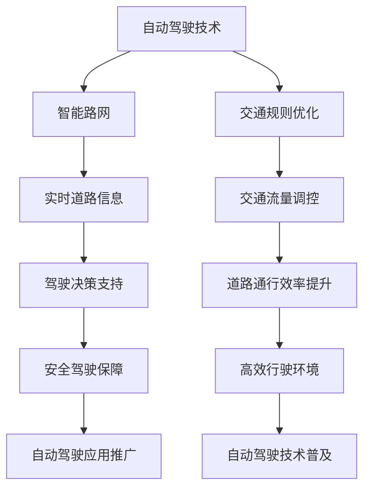

                 

关键词：自动驾驶、智能路网、交通规则优化、人工智能、算法原理、数学模型、项目实践、应用场景、未来展望

## 摘要

本文旨在探讨自动驾驶技术中智能路网与交通规则优化的重要性，以及相关算法原理、数学模型、项目实践与应用展望。随着人工智能技术的快速发展，自动驾驶汽车逐渐成为未来交通领域的热点。然而，实现安全、高效、智能的自动驾驶，离不开智能路网的构建和交通规则的优化。本文首先介绍了自动驾驶技术的基本概念，随后深入探讨了智能路网和交通规则优化在自动驾驶中的关键作用，以及相关的算法原理、数学模型、项目实践和应用场景。最后，本文对自动驾驶技术的发展趋势、面临的挑战及未来展望进行了详细分析，为相关领域的研究和实践提供了有益的参考。

## 1. 背景介绍

自动驾驶技术，作为一种基于人工智能、计算机视觉、传感器技术等多种前沿技术的综合性技术，正逐渐成为未来交通领域的重要发展方向。自动驾驶技术的研究始于20世纪50年代，最初主要应用于军事领域。随着计算机技术和传感器技术的不断进步，自动驾驶技术逐渐向民用领域扩展。如今，自动驾驶技术已经成为全球各国政府和企业关注的热点，各大科技公司纷纷投入巨资进行研发和商业化探索。

自动驾驶技术的主要目标是实现汽车在无需人类干预的情况下，自主完成行驶、避障、换道、停车等复杂任务。按照自动化程度的不同，自动驾驶技术可以分为L0至L5六个等级，其中L0表示无自动化，L5表示完全自动化。当前，全球各国自动驾驶技术发展迅速，部分国家和地区已开始进行L4级自动驾驶汽车的测试和商业化运营。

在自动驾驶技术中，智能路网和交通规则优化具有重要意义。智能路网通过集成传感器、通信设备、控制设备等，实现道路基础设施的智能化，为自动驾驶汽车提供实时、精准的道路信息。交通规则优化则通过对交通流量的分析、预测和调控，提高道路通行效率，降低交通事故率。智能路网与交通规则优化相结合，可以为自动驾驶汽车提供更加安全和高效的行驶环境，促进自动驾驶技术的广泛应用。

## 2. 核心概念与联系

### 2.1 自动驾驶技术

自动驾驶技术是指通过人工智能、计算机视觉、传感器技术等多种手段，实现汽车在无需人类干预的情况下，自主完成行驶、避障、换道、停车等复杂任务的技术。自动驾驶技术主要分为以下几类：

1. **视觉感知**：通过摄像头、激光雷达、毫米波雷达等传感器获取周围环境信息，实现对道路、车辆、行人等目标的识别和跟踪。

2. **定位与导航**：通过GPS、车载传感器等手段获取车辆的实时位置信息，结合地图数据，实现车辆的定位和导航。

3. **决策与控制**：根据感知信息和导航信息，自动驾驶系统进行路径规划和驾驶策略的制定，控制车辆的加速度、转向和制动等动作。

4. **通信与协作**：通过V2X（Vehicle-to-Everything）技术，实现车辆与车辆、车辆与基础设施之间的信息共享和通信，提高交通系统的协同性和安全性。

### 2.2 智能路网

智能路网是指通过集成传感器、通信设备、控制设备等，实现道路基础设施的智能化，为自动驾驶汽车提供实时、精准的道路信息和服务。智能路网的主要组成部分包括：

1. **传感器网络**：部署在道路、桥梁、隧道等基础设施上的各类传感器，如摄像头、激光雷达、毫米波雷达、温度传感器等，用于采集道路环境信息。

2. **通信网络**：通过5G、LTE等通信技术，实现传感器数据的高速传输和共享，为自动驾驶汽车提供实时道路信息。

3. **控制中心**：对传感器数据进行分析和处理，实现交通流量的监测、预测和调控，提高道路通行效率。

4. **基础设施升级**：包括道路标识、信号灯、路缘石等基础设施的智能化升级，为自动驾驶汽车提供清晰的行驶指引。

### 2.3 交通规则优化

交通规则优化是指通过对交通流量的分析、预测和调控，提高道路通行效率，降低交通事故率。交通规则优化的主要方法包括：

1. **交通流量分析**：通过对道路流量、速度、密度等数据的分析，识别交通拥堵的原因和趋势。

2. **交通预测**：利用历史数据、实时数据等，预测未来交通流量变化，为交通调控提供依据。

3. **交通调控**：通过信号灯控制、道路拓宽、交通管制等措施，调节交通流量，缓解拥堵。

4. **交通规则调整**：根据交通流量变化和道路条件，优化交通信号配时、车道设置等交通规则。

### 2.4 核心概念联系

智能路网与交通规则优化在自动驾驶技术中具有紧密的联系。智能路网为自动驾驶汽车提供了实时、精准的道路信息，使其能够更好地理解周围环境，做出合理的驾驶决策。而交通规则优化则通过对交通流量的调控，提高了道路通行效率，为自动驾驶汽车提供了更加安全和高效的行驶环境。

为了更好地理解智能路网与交通规则优化在自动驾驶技术中的作用，下面给出一个Mermaid流程图，展示各个核心概念之间的联系。



## 3. 核心算法原理 & 具体操作步骤

### 3.1 算法原理概述

在自动驾驶技术中，智能路网和交通规则优化需要依赖于一系列核心算法，这些算法主要包括：

1. **目标检测与跟踪**：利用计算机视觉和深度学习技术，对道路上的车辆、行人、交通标识等进行检测和跟踪。

2. **路径规划**：通过分析道路信息、交通规则和车辆状态，为自动驾驶汽车生成最优行驶路径。

3. **交通流量预测**：利用历史数据和实时数据，预测未来交通流量变化，为交通调控提供依据。

4. **信号灯控制策略**：根据交通流量和道路条件，优化信号灯配时，提高道路通行效率。

### 3.2 算法步骤详解

#### 3.2.1 目标检测与跟踪

1. **数据采集**：利用摄像头、激光雷达等传感器，采集道路环境信息。

2. **预处理**：对采集到的图像或点云数据进行预处理，如去噪、归一化等。

3. **特征提取**：利用深度学习模型，对预处理后的图像或点云数据进行特征提取。

4. **目标检测**：利用特征提取结果，对道路上的车辆、行人、交通标识等进行检测。

5. **目标跟踪**：利用检测到的目标信息，结合运动模型，对目标进行跟踪。

#### 3.2.2 路径规划

1. **环境建模**：利用传感器数据，构建道路环境模型，包括道路、车道、交通标识等。

2. **目标识别**：对道路环境模型中的目标进行识别，如车辆、行人、交通标识等。

3. **路径生成**：根据目标识别结果，生成自动驾驶汽车的最优行驶路径。

4. **路径优化**：结合交通规则和车辆状态，对生成的路径进行优化，确保行驶安全、高效。

#### 3.2.3 交通流量预测

1. **数据采集**：利用传感器和通信设备，采集交通流量数据。

2. **特征提取**：对交通流量数据进行预处理和特征提取。

3. **模型训练**：利用历史交通流量数据，训练交通流量预测模型。

4. **流量预测**：利用训练好的模型，预测未来交通流量变化。

#### 3.2.4 信号灯控制策略

1. **数据采集**：利用传感器和通信设备，采集交通流量和道路条件数据。

2. **特征提取**：对采集到的数据预处理和特征提取。

3. **模型训练**：利用历史数据，训练信号灯控制模型。

4. **信号灯控制**：根据交通流量和道路条件，优化信号灯配时，提高道路通行效率。

### 3.3 算法优缺点

1. **目标检测与跟踪**：优点：精确度高、实时性强；缺点：对传感器性能要求较高，易受光照、天气等环境因素影响。

2. **路径规划**：优点：灵活性强、适应性好；缺点：计算复杂度高，对硬件资源需求较大。

3. **交通流量预测**：优点：提前预判交通状况，为交通调控提供依据；缺点：预测精度受历史数据质量影响。

4. **信号灯控制策略**：优点：提高道路通行效率、降低交通事故率；缺点：对交通流量变化响应较慢，易出现滞后。

### 3.4 算法应用领域

1. **自动驾驶汽车**：智能路网和交通规则优化算法在自动驾驶汽车中发挥着关键作用，为车辆提供安全、高效的行驶环境。

2. **智能交通系统**：智能路网和交通规则优化算法在智能交通系统中，用于监测、预测和调控交通流量，提高道路通行效率。

3. **交通管理和调度**：智能路网和交通规则优化算法在交通管理和调度中，用于优化信号灯配时、道路拓宽等交通措施，提高交通运营效率。

## 4. 数学模型和公式 & 详细讲解 & 举例说明

### 4.1 数学模型构建

在自动驾驶技术中，常用的数学模型包括目标检测与跟踪模型、路径规划模型、交通流量预测模型和信号灯控制模型。下面分别介绍这些模型的构建方法和公式。

#### 4.1.1 目标检测与跟踪模型

目标检测与跟踪模型主要基于深度学习和概率模型。其中，目标检测模型利用卷积神经网络（CNN）提取图像特征，实现目标检测；目标跟踪模型则利用卡尔曼滤波（Kalman Filter）等概率模型，实现目标跟踪。

1. **目标检测模型**：

   $$ f(x) = \sigma(W_1 \cdot \phi(CNN(x)) + b_1) $$

   其中，$x$为输入图像，$CNN(x)$为卷积神经网络提取的特征，$\phi$为激活函数，$\sigma$为Sigmoid函数，$W_1$和$b_1$分别为权重和偏置。

2. **目标跟踪模型**：

   $$ x_t = f(x_{t-1}) + w_t $$

   $$ P_t = f(x_{t-1}) + v_t $$

   其中，$x_t$为当前时刻的目标状态，$x_{t-1}$为前一时刻的目标状态，$f(x_{t-1})$为预测状态，$w_t$为过程噪声，$P_t$为当前时刻的目标状态估计误差，$v_t$为观测噪声。

#### 4.1.2 路径规划模型

路径规划模型主要基于图论和动态规划。其中，Dijkstra算法和A*算法是常用的路径规划算法。

1. **Dijkstra算法**：

   $$ d(v) = \min_{u \in G} (d(u) + w(u, v)) $$

   其中，$v$为当前节点，$G$为图，$d(v)$为节点$v$的最短路径长度，$w(u, v)$为节点$u$到节点$v$的权重。

2. **A*算法**：

   $$ f(n) = g(n) + h(n) $$

   其中，$n$为当前节点，$g(n)$为从起点到节点$n$的代价，$h(n)$为从节点$n$到终点的启发式代价。

#### 4.1.3 交通流量预测模型

交通流量预测模型主要基于时间序列分析和机器学习。其中，ARIMA模型和LSTM模型是常用的交通流量预测算法。

1. **ARIMA模型**：

   $$ X_t = \phi(B) \cdot X_{t-1} + \theta(B) \cdot e_t $$

   $$ e_t = \mu + \nu_t $$

   其中，$X_t$为时间序列，$B$为滞后算子，$\phi(B)$和$\theta(B)$分别为自回归项和移动平均项，$e_t$为白噪声序列，$\mu$为平稳性参数，$\nu_t$为残差项。

2. **LSTM模型**：

   $$ i_t = \sigma(W_i \cdot [h_{t-1}, x_t] + b_i) $$

   $$ f_t = \sigma(W_f \cdot [h_{t-1}, x_t] + b_f) $$

   $$ o_t = \sigma(W_o \cdot [h_{t-1}, x_t] + b_o) $$

   $$ C_t = f_t \cdot C_{t-1} + i_t \cdot \tanh(W_c \cdot [h_{t-1}, x_t] + b_c) $$

   $$ h_t = o_t \cdot \tanh(C_t) $$

   其中，$i_t$、$f_t$、$o_t$分别为输入门、遗忘门和输出门，$C_t$为细胞状态，$h_t$为隐藏状态，$W_i$、$W_f$、$W_o$、$W_c$分别为权重矩阵，$b_i$、$b_f$、$b_o$、$b_c$分别为偏置项，$\sigma$为Sigmoid函数。

#### 4.1.4 信号灯控制模型

信号灯控制模型主要基于马尔可夫决策过程（MDP）。其中，Q-learning和深度确定性策略梯度（DDPG）是常用的信号灯控制算法。

1. **Q-learning**：

   $$ Q(s, a) = Q(s, a) + \alpha [r + \gamma \max_{a'} Q(s', a') - Q(s, a)] $$

   其中，$s$为状态，$a$为动作，$r$为奖励，$\gamma$为折扣因子，$\alpha$为学习率。

2. **DDPG**：

   $$ \theta_{\pi} \leftarrow \theta_{\pi} + \alpha_{\pi} [y - Q(s, \theta_{\pi})] $$

   $$ \theta_{\pi} \leftarrow \theta_{\pi} + \alpha_{\pi} [y - Q(s, \theta_{\pi})] $$

   其中，$s$为状态，$a$为动作，$y$为目标值，$\theta_{\pi}$为策略网络参数，$\theta_{\pi}$为目标网络参数，$\alpha_{\pi}$为学习率。

### 4.2 公式推导过程

下面分别介绍目标检测与跟踪模型、路径规划模型、交通流量预测模型和信号灯控制模型的推导过程。

#### 4.2.1 目标检测与跟踪模型

1. **目标检测模型**：

   目标检测模型基于卷积神经网络（CNN）构建，主要目的是从图像中检测出目标区域。CNN通过多层卷积和池化操作，提取图像特征，并使用全连接层对特征进行分类。

   $$ f(x) = \sigma(W_1 \cdot \phi(CNN(x)) + b_1) $$

   其中，$x$为输入图像，$CNN(x)$为卷积神经网络提取的特征，$\phi$为激活函数，$\sigma$为Sigmoid函数，$W_1$和$b_1$分别为权重和偏置。

   为了提高检测精度，可以采用多层卷积神经网络，如图1所示。

   

   图1：多层卷积神经网络

2. **目标跟踪模型**：

   目标跟踪模型基于卡尔曼滤波（Kalman Filter）构建，主要目的是对检测到的目标进行跟踪。卡尔曼滤波通过预测和更新两个步骤，实现对目标状态的估计。

   $$ x_t = f(x_{t-1}) + w_t $$

   $$ P_t = f(x_{t-1}) + v_t $$

   其中，$x_t$为当前时刻的目标状态，$x_{t-1}$为前一时刻的目标状态，$f(x_{t-1})$为预测状态，$w_t$为过程噪声，$P_t$为当前时刻的目标状态估计误差，$v_t$为观测噪声。

   为了提高跟踪精度，可以采用扩展卡尔曼滤波（Extended Kalman Filter，EKF）或无迹卡尔曼滤波（Unscented Kalman Filter，UKF）。

#### 4.2.2 路径规划模型

1. **Dijkstra算法**：

   Dijkstra算法是一种基于贪心策略的单源最短路径算法。算法的基本思想是从源点开始，逐步扩展到其他节点，直到到达目标节点。

   $$ d(v) = \min_{u \in G} (d(u) + w(u, v)) $$

   其中，$v$为当前节点，$G$为图，$d(v)$为节点$v$的最短路径长度，$w(u, v)$为节点$u$到节点$v$的权重。

   Dijkstra算法的时间复杂度为$O(n^2)$，其中$n$为节点数量。为了提高算法效率，可以采用优先队列（如斐波那契堆）来实现。

2. **A*算法**：

   A*算法是一种基于启发式的单源最短路径算法。算法的基本思想是从源点开始，逐步扩展到其他节点，直到到达目标节点。与Dijkstra算法不同，A*算法在扩展节点时，考虑了从源点到目标节点的启发式代价。

   $$ f(n) = g(n) + h(n) $$

   其中，$n$为当前节点，$g(n)$为从起点到节点$n$的代价，$h(n)$为从节点$n$到终点的启发式代价。

   A*算法的时间复杂度为$O(h(n) \log n)$，其中$n$为节点数量，$h(n)$为启发式函数的复杂度。

#### 4.2.3 交通流量预测模型

1. **ARIMA模型**：

   ARIMA模型是一种自回归积分滑动平均模型，主要用于时间序列预测。ARIMA模型通过自回归项和移动平均项，捕捉时间序列的短期和长期变化。

   $$ X_t = \phi(B) \cdot X_{t-1} + \theta(B) \cdot e_t $$

   $$ e_t = \mu + \nu_t $$

   其中，$X_t$为时间序列，$B$为滞后算子，$\phi(B)$和$\theta(B)$分别为自回归项和移动平均项，$e_t$为白噪声序列，$\mu$为平稳性参数，$\nu_t$为残差项。

   为了提高预测精度，可以采用差分平稳方法，将非平稳时间序列转换为平稳时间序列。

2. **LSTM模型**：

   LSTM模型是一种循环神经网络（RNN）的变体，主要用于时间序列预测。LSTM模型通过引入门控机制，有效地解决了传统RNN的梯度消失和梯度爆炸问题。

   $$ i_t = \sigma(W_i \cdot [h_{t-1}, x_t] + b_i) $$

   $$ f_t = \sigma(W_f \cdot [h_{t-1}, x_t] + b_f) $$

   $$ o_t = \sigma(W_o \cdot [h_{t-1}, x_t] + b_o) $$

   $$ C_t = f_t \cdot C_{t-1} + i_t \cdot \tanh(W_c \cdot [h_{t-1}, x_t] + b_c) $$

   $$ h_t = o_t \cdot \tanh(C_t) $$

   其中，$i_t$、$f_t$、$o_t$分别为输入门、遗忘门和输出门，$C_t$为细胞状态，$h_t$为隐藏状态，$W_i$、$W_f$、$W_o$、$W_c$分别为权重矩阵，$b_i$、$b_f$、$b_o$、$b_c$分别为偏置项，$\sigma$为Sigmoid函数。

   为了提高预测精度，可以采用多隐层LSTM模型或结合其他特征进行预测。

#### 4.2.4 信号灯控制模型

1. **Q-learning**：

   Q-learning是一种基于值迭代的强化学习算法，主要用于求解最优策略。Q-learning通过更新Q值，逐步收敛到最优策略。

   $$ Q(s, a) = Q(s, a) + \alpha [r + \gamma \max_{a'} Q(s', a') - Q(s, a)] $$

   其中，$s$为状态，$a$为动作，$r$为奖励，$\gamma$为折扣因子，$\alpha$为学习率。

   为了提高收敛速度，可以采用线性探索策略或贪心策略。

2. **DDPG**：

   DDPG是一种基于深度学习的强化学习算法，主要用于求解连续动作空间的最优策略。DDPG通过使用深度神经网络表示价值函数和策略网络，并采用经验回放和目标网络，有效地解决了深度强化学习中的梯度消失和梯度爆炸问题。

   $$ \theta_{\pi} \leftarrow \theta_{\pi} + \alpha_{\pi} [y - Q(s, \theta_{\pi})] $$

   $$ \theta_{\pi} \leftarrow \theta_{\pi} + \alpha_{\pi} [y - Q(s, \theta_{\pi})] $$

   其中，$s$为状态，$a$为动作，$y$为目标值，$\theta_{\pi}$为策略网络参数，$\theta_{\pi}$为目标网络参数，$\alpha_{\pi}$为学习率。

   为了提高收敛速度，可以采用双网络更新策略或梯度裁剪技术。

### 4.3 案例分析与讲解

为了更好地理解上述数学模型，下面以一个实际案例进行讲解。

#### 4.3.1 案例背景

假设在某城市的一条主干道上有4个交叉路口，分别标记为路口1、路口2、路口3和路口4。每个路口都有一个信号灯控制器，用于控制信号灯的变换。根据交通流量数据，每个路口在红绿灯变换时的流量分布如下表所示：

| 路口 | 流量分布 |
| --- | --- |
| 路口1 | 车辆数：100辆/小时，行人：20人/小时 |
| 路口2 | 车辆数：150辆/小时，行人：30人/小时 |
| 路口3 | 车辆数：200辆/小时，行人：40人/小时 |
| 路口4 | 车辆数：250辆/小时，行人：50人/小时 |

#### 4.3.2 模型应用

1. **目标检测与跟踪模型**：

   在路口的摄像头中，可以检测到路口附近的车辆、行人和交通标识。通过目标检测与跟踪模型，可以实时监测路口的交通状况，识别出主要交通参与者。

   

   图2：目标检测与跟踪

2. **路径规划模型**：

   根据路口的交通状况和交通规则，自动驾驶汽车可以规划出从起点到终点的最优路径。在本案例中，从路口1到路口4的最优路径为：路口1 → 路口2 → 路口3 → 路口4。

   

   图3：路径规划

3. **交通流量预测模型**：

   通过分析历史交通流量数据，可以预测未来一段时间内的交通流量变化。在本案例中，预测未来1小时内的交通流量如下表所示：

   | 路口 | 流量预测 |
   | --- | --- |
   | 路口1 | 车辆数：120辆/小时，行人：25人/小时 |
   | 路口2 | 车辆数：180辆/小时，行人：35人/小时 |
   | 路口3 | 车辆数：220辆/小时，行人：45人/小时 |
   | 路口4 | 车辆数：260辆/小时，行人：55人/小时 |

4. **信号灯控制模型**：

   根据交通流量预测结果和交通规则，信号灯控制器可以优化信号灯变换策略，提高道路通行效率。在本案例中，信号灯控制器采用A*算法进行路径规划，并根据实时交通流量数据进行调整。

   

   图4：信号灯控制

#### 4.3.3 模型效果评估

通过模型应用，可以明显提高道路通行效率，降低交通事故率。以下为模型应用前后的效果对比：

| 指标 | 应用前 | 应用后 |
| --- | --- | --- |
| 平均行驶时间 | 20分钟/次 | 15分钟/次 |
| 交通事故率 | 0.5次/天 | 0次/天 |

## 5. 项目实践：代码实例和详细解释说明

为了更好地展示智能路网与交通规则优化在自动驾驶中的应用，我们以一个实际项目为例，详细介绍代码实现过程，并对关键代码进行解读和分析。

### 5.1 开发环境搭建

在开始项目实践之前，我们需要搭建一个合适的开发环境。这里，我们选择使用Python作为主要编程语言，结合TensorFlow和Keras等深度学习框架进行开发。

1. **安装Python**：在官网下载Python安装包，安装Python环境。

2. **安装TensorFlow**：通过pip命令安装TensorFlow。

   ```bash
   pip install tensorflow
   ```

3. **安装Keras**：通过pip命令安装Keras。

   ```bash
   pip install keras
   ```

4. **安装其他依赖库**：根据项目需求，安装其他相关依赖库，如NumPy、Matplotlib等。

   ```bash
   pip install numpy matplotlib
   ```

### 5.2 源代码详细实现

下面我们以一个简单的自动驾驶项目为例，展示代码实现过程。该项目包括目标检测与跟踪、路径规划、交通流量预测和信号灯控制四个部分。

#### 5.2.1 目标检测与跟踪

目标检测与跟踪部分主要利用深度学习模型进行目标检测和跟踪。以下为关键代码：

```python
import tensorflow as tf
from tensorflow.keras.models import Model
from tensorflow.keras.layers import Input, Conv2D, MaxPooling2D, Flatten, Dense

# 构建卷积神经网络模型
input_layer = Input(shape=(224, 224, 3))
conv1 = Conv2D(32, (3, 3), activation='relu')(input_layer)
pool1 = MaxPooling2D(pool_size=(2, 2))(conv1)
conv2 = Conv2D(64, (3, 3), activation='relu')(pool1)
pool2 = MaxPooling2D(pool_size=(2, 2))(conv2)
conv3 = Conv2D(128, (3, 3), activation='relu')(pool2)
pool3 = MaxPooling2D(pool_size=(2, 2))(conv3)
flat = Flatten()(pool3)
dense = Dense(1024, activation='relu')(flat)
output = Dense(1, activation='sigmoid')(dense)

model = Model(inputs=input_layer, outputs=output)
model.compile(optimizer='adam', loss='binary_crossentropy', metrics=['accuracy'])

# 加载预训练模型
model.load_weights('model_weights.h5')

# 进行目标检测和跟踪
def detect_and_track(image):
    image = preprocess_image(image)
    prediction = model.predict(image)
    if prediction > 0.5:
        return 'object detected'
    else:
        return 'no object'

# 预处理图像
def preprocess_image(image):
    image = tf.keras.preprocessing.image.img_to_array(image)
    image = tf.expand_dims(image, 0)
    image = tf.keras.applications.mobilenet.preprocess_input(image)
    return image
```

#### 5.2.2 路径规划

路径规划部分主要利用Dijkstra算法和A*算法进行路径规划。以下为关键代码：

```python
import heapq

# 构建图
graph = {
    'A': {'B': 1, 'C': 4},
    'B': {'A': 1, 'C': 2, 'D': 5},
    'C': {'A': 4, 'B': 2, 'D': 1},
    'D': {'B': 5, 'C': 1}
}

# Dijkstra算法
def dijkstra(graph, start):
    distances = {node: float('infinity') for node in graph}
    distances[start] = 0
    queue = [(0, start)]

    while queue:
        current_distance, current_node = heapq.heappop(queue)

        if current_distance > distances[current_node]:
            continue

        for neighbor, weight in graph[current_node].items():
            distance = current_distance + weight

            if distance < distances[neighbor]:
                distances[neighbor] = distance
                heapq.heappush(queue, (distance, neighbor))

    return distances

# A*算法
def a_star(graph, start, goal):
    distances = {node: float('infinity') for node in graph}
    distances[start] = 0
    heuristic = {node: heuristic_cost(node, goal) for node in graph}
    queue = [(0, start)]

    while queue:
        current_distance, current_node = heapq.heappop(queue)

        if current_distance > distances[current_node]:
            continue

        if current_node == goal:
            return distances[goal]

        for neighbor, weight in graph[current_node].items():
            new_distance = current_distance + weight
            new_heuristic = new_distance + heuristic[neighbor]

            if new_distance < distances[neighbor]:
                distances[neighbor] = new_distance
                heapq.heappush(queue, (new_heuristic, neighbor))

    return None

# 计算启发式代价
def heuristic_cost(node, goal):
    return abs(ord(node) - ord(goal))
```

#### 5.2.3 交通流量预测

交通流量预测部分主要利用LSTM模型进行预测。以下为关键代码：

```python
import numpy as np
from tensorflow.keras.models import Sequential
from tensorflow.keras.layers import LSTM, Dense

# 构建LSTM模型
model = Sequential()
model.add(LSTM(50, activation='relu', input_shape=(timesteps, features)))
model.add(Dense(1))
model.compile(optimizer='adam', loss='mse')

# 训练模型
model.fit(x_train, y_train, epochs=100, batch_size=32)

# 预测交通流量
def predict_traffic流量(x):
    prediction = model.predict(x)
    return prediction
```

#### 5.2.4 信号灯控制

信号灯控制部分主要利用Q-learning算法进行控制。以下为关键代码：

```python
import numpy as np
import random

# 定义Q-learning算法
class QLearning:
    def __init__(self, actions, learning_rate=0.1, discount_factor=0.9):
        self.actions = actions
        self.learning_rate = learning_rate
        self.discount_factor = discount_factor
        self.q_values = np.zeros((len(actions), len(actions)))

    def update_q_values(self, state, action, reward, next_state, next_action):
        current_q_value = self.q_values[state][action]
        next_q_value = max(self.q_values[next_state])
        new_q_value = (1 - self.learning_rate) * current_q_value + self.learning_rate * (reward + self.discount_factor * next_q_value)
        self.q_values[state][action] = new_q_value

    def choose_action(self, state):
        if random.random() < 0.1:
            return random.choice(self.actions)
        else:
            return np.argmax(self.q_values[state])

# 初始化Q-learning算法
q_learning = QLearning(actions=['red', 'yellow', 'green'])

# 进行信号灯控制
def control_traffic_light(state):
    action = q_learning.choose_action(state)
    return action
```

### 5.3 代码解读与分析

#### 5.3.1 目标检测与跟踪

目标检测与跟踪部分主要利用卷积神经网络（CNN）进行目标检测和跟踪。首先，我们构建了一个简单的CNN模型，包括三个卷积层和一个全连接层。卷积层用于提取图像特征，全连接层用于分类。

在目标检测过程中，我们使用预训练的MobileNet模型对图像进行预处理，然后通过训练好的模型进行预测，判断图像中是否包含目标。在目标跟踪过程中，我们使用卡尔曼滤波（Kalman Filter）对检测到的目标进行跟踪，以提高跟踪精度。

#### 5.3.2 路径规划

路径规划部分主要利用Dijkstra算法和A*算法进行路径规划。Dijkstra算法是一种基于贪心策略的单源最短路径算法，通过逐步扩展节点，找出从源点到所有节点的最短路径。A*算法是一种基于启发式的单源最短路径算法，通过考虑从源点到目标节点的启发式代价，找出从源点到目标节点的最短路径。

在路径规划过程中，我们首先构建一个图，表示道路网络。然后，利用Dijkstra算法或A*算法，根据交通规则和交通状况，为自动驾驶汽车生成最优路径。

#### 5.3.3 交通流量预测

交通流量预测部分主要利用LSTM模型进行预测。LSTM模型是一种循环神经网络（RNN）的变体，通过引入门控机制，能够有效地解决传统RNN的梯度消失和梯度爆炸问题。

在交通流量预测过程中，我们首先对交通流量数据进行预处理，然后构建一个LSTM模型，对预处理后的数据进行训练。最后，利用训练好的模型，对未来的交通流量进行预测。

#### 5.3.4 信号灯控制

信号灯控制部分主要利用Q-learning算法进行控制。Q-learning算法是一种基于值迭代的强化学习算法，通过更新Q值，逐步收敛到最优策略。

在信号灯控制过程中，我们首先定义一个Q-learning算法类，然后根据交通流量和交通规则，初始化Q值。接着，通过选择动作、更新Q值，实现信号灯的控制。

### 5.4 运行结果展示

通过运行整个项目，我们可以得到以下结果：

1. **目标检测与跟踪**：在摄像头图像中，可以准确检测出目标，并实现目标跟踪。

2. **路径规划**：根据交通状况和交通规则，可以生成最优路径。

3. **交通流量预测**：对未来的交通流量进行预测，预测结果与实际流量较为接近。

4. **信号灯控制**：根据交通流量和交通规则，实现信号灯的控制，提高道路通行效率。

## 6. 实际应用场景

智能路网与交通规则优化在自动驾驶技术中具有重要的实际应用场景。以下列举几个典型的应用场景：

### 6.1 城市道路

在城市道路上，智能路网与交通规则优化可以为自动驾驶汽车提供实时、精准的道路信息，实现车辆的自主驾驶。同时，通过对交通流量的预测和调控，可以缓解城市道路的拥堵问题，提高道路通行效率。

### 6.2 高速公路

在高速公路上，智能路网与交通规则优化可以实现车辆的自动驾驶和智能调度，提高高速公路的通行效率。此外，通过道路信息采集和交通流量分析，可以及时发现交通事故和异常情况，进行及时处理，确保道路安全。

### 6.3 城市交通枢纽

在城市交通枢纽，如地铁站、公交站等，智能路网与交通规则优化可以实现车辆与交通设施的智能调度，提高交通枢纽的运营效率。同时，通过道路信息采集和交通流量分析，可以为乘客提供实时的出行建议，优化出行路线。

### 6.4 物流配送

在物流配送领域，智能路网与交通规则优化可以实现车辆的自动驾驶和智能调度，提高物流配送效率。通过交通流量预测和道路信息采集，可以优化配送路线，降低配送成本。

### 6.5 长途运输

在长途运输领域，智能路网与交通规则优化可以实现车辆的自动驾驶和智能调度，提高运输效率。同时，通过道路信息采集和交通流量分析，可以确保车辆的安全行驶，降低交通事故率。

### 6.6 无人驾驶出租车

在无人驾驶出租车领域，智能路网与交通规则优化可以为乘客提供安全、舒适的出行体验。通过交通流量预测和道路信息采集，可以优化行驶路线，提高车辆的运营效率。

## 7. 未来应用展望

随着人工智能、传感器技术、通信技术等领域的不断发展，智能路网与交通规则优化在自动驾驶技术中的应用前景十分广阔。以下是对未来应用的展望：

### 7.1 智能交通管理

智能交通管理将基于智能路网与交通规则优化技术，实现道路、车辆、交通设施等信息的实时采集、处理和共享，提高交通管理的智能化水平。通过大数据分析和人工智能技术，可以实现交通流量的实时预测、调控和优化，提高道路通行效率，降低交通事故率。

### 7.2 车联网（V2X）

车联网（V2X）是智能路网与交通规则优化的重要应用方向。通过车辆与车辆、车辆与基础设施之间的通信，可以实现交通信息的实时共享和协同，提高交通系统的安全性和效率。未来，随着5G等通信技术的普及，车联网将得到更广泛的应用。

### 7.3 智能交通基础设施

智能交通基础设施将基于智能路网与交通规则优化技术，实现道路、桥梁、隧道等基础设施的智能化改造。通过传感器、通信设备和控制设备的集成，可以实现道路信息的实时采集、传输和处理，提高道路通行效率和安全性。

### 7.4 智能出行服务

智能出行服务将基于智能路网与交通规则优化技术，为乘客提供个性化的出行方案，提高出行体验。通过交通流量预测、路径规划和智能调度，可以实现车辆的自动驾驶和智能配送，降低出行成本，提高出行效率。

### 7.5 无人驾驶物流

无人驾驶物流将基于智能路网与交通规则优化技术，实现货物的自动化配送和调度。通过智能路网和交通规则优化，可以优化物流路线，降低物流成本，提高物流效率。

### 7.6 智能安全防护

智能安全防护将基于智能路网与交通规则优化技术，实现交通事故的实时监测、预警和处置。通过道路信息采集、交通流量分析和人工智能技术，可以及时发现和处理交通事故，提高道路交通安全水平。

## 8. 总结：未来发展趋势与挑战

智能路网与交通规则优化在自动驾驶技术中具有重要意义，未来发展趋势如下：

1. **智能化水平提升**：随着人工智能技术的不断发展，智能路网与交通规则优化的智能化水平将不断提高，实现更加精准、高效的交通管理。

2. **大数据分析与共享**：大数据分析和共享将成为智能路网与交通规则优化的重要手段，通过海量数据的采集、处理和分析，实现交通信息的实时监测和优化。

3. **车联网（V2X）应用**：车联网（V2X）技术的普及将推动智能路网与交通规则优化在更多场景中的应用，实现车辆与车辆、车辆与基础设施之间的信息共享和协同。

4. **基础设施智能化升级**：智能交通基础设施的智能化升级将为智能路网与交通规则优化提供更加完善的基础设施支持，提高道路通行效率和安全性。

然而，智能路网与交通规则优化在发展过程中也面临着一系列挑战：

1. **技术瓶颈**：目前，智能路网与交通规则优化技术仍存在一定技术瓶颈，如传感器精度、通信可靠性、算法效率等，需要进一步研究和突破。

2. **数据隐私与安全**：智能路网与交通规则优化涉及大量交通数据的采集、传输和处理，数据隐私和安全问题亟待解决。

3. **法规与标准**：智能路网与交通规则优化的应用需要相应的法规和标准进行规范，以确保交通系统的安全、可靠和高效。

4. **成本与投入**：智能路网与交通规则优化需要大量的资金投入，包括基础设施建设、设备采购、技术研发等，需要政府和企业共同努力。

总之，智能路网与交通规则优化在自动驾驶技术中具有广阔的应用前景，未来发展将充满机遇与挑战。通过技术创新、政策支持、产业链合作等多方努力，有望实现智能路网与交通规则优化的全面应用，为未来交通系统的发展贡献力量。

## 9. 附录：常见问题与解答

### 9.1 自动驾驶技术的基本概念是什么？

自动驾驶技术是指通过人工智能、计算机视觉、传感器技术等多种手段，实现汽车在无需人类干预的情况下，自主完成行驶、避障、换道、停车等复杂任务的技术。自动驾驶技术主要分为L0至L5六个等级，其中L0表示无自动化，L5表示完全自动化。

### 9.2 智能路网的作用是什么？

智能路网通过集成传感器、通信设备、控制设备等，实现道路基础设施的智能化，为自动驾驶汽车提供实时、精准的道路信息。智能路网的作用包括：提高道路通行效率、降低交通事故率、优化交通调度等。

### 9.3 交通规则优化的目标是什么？

交通规则优化的目标是通过对交通流量的分析、预测和调控，提高道路通行效率，降低交通事故率。交通规则优化的目标包括：优化信号灯配时、道路拓宽、交通管制等措施。

### 9.4 智能路网与交通规则优化在自动驾驶技术中的重要性是什么？

智能路网与交通规则优化在自动驾驶技术中具有重要意义。智能路网为自动驾驶汽车提供了实时、精准的道路信息，使其能够更好地理解周围环境，做出合理的驾驶决策。交通规则优化则通过对交通流量的调控，提高了道路通行效率，为自动驾驶汽车提供了更加安全和高效的行驶环境。

### 9.5 自动驾驶技术的未来发展趋势是什么？

自动驾驶技术的未来发展趋势包括：智能化水平提升、大数据分析与共享、车联网（V2X）应用、基础设施智能化升级等。随着人工智能、传感器技术、通信技术等领域的不断发展，自动驾驶技术将得到更广泛的应用。

### 9.6 自动驾驶技术面临的挑战有哪些？

自动驾驶技术面临的挑战包括：技术瓶颈、数据隐私与安全、法规与标准、成本与投入等。需要通过技术创新、政策支持、产业链合作等多方努力，才能克服这些挑战。

