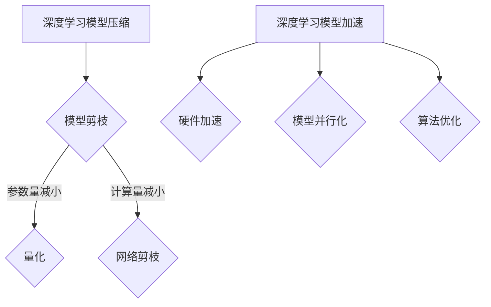

                 

关键词：自动驾驶，深度学习模型，压缩，加速技术，模型压缩算法，深度学习优化，硬件加速，算法效率

## 摘要

随着自动驾驶技术的快速发展，深度学习模型在自动驾驶系统中的应用越来越广泛。然而，深度学习模型的复杂性导致了其计算资源和存储需求的急剧增加，这对自动驾驶系统的实时性和可靠性提出了巨大的挑战。本文将探讨深度学习模型压缩与加速技术在自动驾驶中的应用，分析现有技术及其挑战，并提出未来发展的趋势和展望。

## 1. 背景介绍

### 1.1 自动驾驶技术发展

自动驾驶技术是一种通过计算机程序和传感器实现车辆自主驾驶的技术。从最初的辅助驾驶系统到完全自动驾驶汽车，自动驾驶技术经历了快速的发展。随着深度学习技术的兴起，深度学习模型在自动驾驶中的应用得到了极大的关注。

### 1.2 深度学习模型在自动驾驶中的应用

深度学习模型在自动驾驶中的应用主要包括图像识别、路径规划、障碍物检测等。这些模型通常采用卷积神经网络（CNN）和循环神经网络（RNN）等结构，其复杂度和计算量巨大。

### 1.3 深度学习模型的挑战

深度学习模型的复杂性导致了以下挑战：

- **计算资源需求增加**：深度学习模型需要进行大量的矩阵运算和前向/反向传播，这对计算资源提出了极高的要求。
- **存储空间占用大**：深度学习模型的参数和权重数据量庞大，需要大量的存储空间。
- **实时性要求高**：自动驾驶系统需要在短时间内处理大量数据，并做出决策。

### 1.4 深度学习模型压缩与加速技术的必要性

为了应对上述挑战，深度学习模型压缩与加速技术成为了自动驾驶领域的研究热点。通过压缩技术，可以减小模型的参数和计算量，从而降低计算资源和存储需求。而通过加速技术，可以提高模型的计算效率，满足实时性的要求。

## 2. 核心概念与联系

### 2.1 深度学习模型压缩

深度学习模型压缩是指通过各种方法减小深度学习模型的参数量和计算量，从而降低计算资源和存储需求。常用的压缩方法包括模型剪枝、量化、网络剪枝等。

### 2.2 深度学习模型加速

深度学习模型加速是指通过各种方法提高深度学习模型的计算效率，从而提高模型的实时性。常用的加速方法包括硬件加速、模型并行化、算法优化等。

### 2.3 核心概念与架构的 Mermaid 流程图



## 3. 核心算法原理 & 具体操作步骤

### 3.1 算法原理概述

深度学习模型压缩与加速技术主要涉及以下几个方面：

- **模型剪枝**：通过剪掉模型中不重要的神经元和连接，减小模型的参数量和计算量。
- **量化**：将模型的浮点数参数转换为整数参数，从而降低计算复杂度和存储需求。
- **网络剪枝**：通过剪掉模型中的某些层或部分连接，实现模型的压缩。
- **硬件加速**：利用特定的硬件（如GPU、FPGA等）加速深度学习模型的计算。
- **模型并行化**：将深度学习模型分布在多个计算节点上，提高计算效率。
- **算法优化**：通过优化算法，提高模型的计算效率。

### 3.2 算法步骤详解

#### 3.2.1 模型剪枝

1. **权重重要性评估**：使用正则化方法或基于梯度的重要性评估方法，评估模型中每个神经元的权重重要性。
2. **剪枝策略选择**：根据权重重要性评估结果，选择合适的剪枝策略，如逐层剪枝、逐神经元剪枝等。
3. **模型重构**：根据剪枝策略，重构模型，剪掉不重要的神经元和连接。

#### 3.2.2 量化

1. **量化策略选择**：根据模型的计算量和存储需求，选择合适的量化策略，如全局量化、局部量化等。
2. **量化过程**：将模型的浮点数参数转换为整数参数，通常使用查找表或线性插值等方法。

#### 3.2.3 网络剪枝

1. **权重重要性评估**：同模型剪枝。
2. **剪枝策略选择**：选择合适的剪枝策略，如基于层剪枝、基于连接剪枝等。
3. **模型重构**：根据剪枝策略，重构模型，剪掉不重要的层或连接。

#### 3.2.4 硬件加速

1. **硬件选择**：根据模型的特点和计算需求，选择合适的硬件，如GPU、FPGA等。
2. **模型迁移**：将深度学习模型转换为硬件支持的格式，如GPU内存格式、FPGA硬件描述语言等。
3. **计算加速**：在硬件上执行深度学习模型的计算，提高计算效率。

#### 3.2.5 模型并行化

1. **数据并行化**：将模型的数据分布在多个计算节点上，每个节点处理一部分数据。
2. **模型并行化**：将模型的结构分布在多个计算节点上，每个节点处理一部分模型。
3. **通信优化**：优化节点间的通信，减少通信开销。

#### 3.2.6 算法优化

1. **算法选择**：根据模型的计算量和存储需求，选择合适的算法，如前向传播、反向传播等。
2. **计算优化**：优化算法的计算过程，减少计算复杂度。
3. **内存优化**：优化算法的内存使用，减少内存需求。

### 3.3 算法优缺点

#### 3.3.1 模型剪枝

- **优点**：减小模型参数量和计算量，降低计算资源和存储需求。
- **缺点**：可能会影响模型的性能和准确性。

#### 3.3.2 量化

- **优点**：降低计算复杂度和存储需求，提高模型计算效率。
- **缺点**：可能会影响模型的精度。

#### 3.3.3 网络剪枝

- **优点**：减小模型参数量和计算量，降低计算资源和存储需求。
- **缺点**：可能会影响模型的性能和准确性。

#### 3.3.4 硬件加速

- **优点**：提高模型计算效率，满足实时性要求。
- **缺点**：需要特定的硬件支持，成本较高。

#### 3.3.5 模型并行化

- **优点**：提高模型计算效率，满足大规模数据处理需求。
- **缺点**：需要复杂的通信和同步机制。

#### 3.3.6 算法优化

- **优点**：提高模型计算效率，满足实时性要求。
- **缺点**：可能需要大量的调优和测试。

### 3.4 算法应用领域

深度学习模型压缩与加速技术在自动驾驶领域具有广泛的应用前景。例如：

- **实时障碍物检测**：通过压缩和加速技术，可以提高障碍物检测的实时性，确保自动驾驶系统的安全性。
- **路径规划**：通过压缩和加速技术，可以提高路径规划的效率和准确性。
- **自动驾驶控制器**：通过压缩和加速技术，可以减小控制器的大小和功耗，提高其性能和可靠性。

## 4. 数学模型和公式 & 详细讲解 & 举例说明

### 4.1 数学模型构建

深度学习模型压缩与加速技术的数学模型主要包括以下几个方面：

1. **损失函数**：用于评估模型的预测结果与真实值之间的差异。
2. **梯度下降算法**：用于优化模型的参数，使损失函数最小化。
3. **量化模型**：用于将浮点数模型转换为整数模型。

### 4.2 公式推导过程

#### 4.2.1 损失函数

假设模型的输出为 \(y\)，真实值为 \(y_{\text{true}}\)，则损失函数可以表示为：

$$
L(y, y_{\text{true}}) = \frac{1}{2} \sum_{i=1}^{n} (y_i - y_{\text{true}, i})^2
$$

其中，\(n\) 为样本数量。

#### 4.2.2 梯度下降算法

梯度下降算法用于优化模型的参数，使损失函数最小化。假设模型的参数为 \(\theta\)，则梯度下降算法可以表示为：

$$
\theta_{\text{new}} = \theta_{\text{old}} - \alpha \nabla_{\theta} L(\theta)
$$

其中，\(\alpha\) 为学习率。

#### 4.2.3 量化模型

量化模型用于将浮点数模型转换为整数模型。假设模型的权重为 \(w\)，量化因子为 \(\lambda\)，则量化模型可以表示为：

$$
w_{\text{quant}} = \text{round}(w / \lambda)
$$

### 4.3 案例分析与讲解

#### 4.3.1 案例背景

假设我们有一个自动驾驶系统，需要进行障碍物检测。我们使用一个卷积神经网络（CNN）作为障碍物检测模型。

#### 4.3.2 模型构建

首先，我们构建一个简单的卷积神经网络模型，包含两个卷积层、两个池化层和一个全连接层。模型的输入为 128x128 的图像，输出为障碍物存在与否的二元分类结果。

#### 4.3.3 模型压缩与加速

1. **模型剪枝**：通过对模型的权重进行重要性评估，我们剪掉了一部分权重较小的神经元和连接。这样，我们减小了模型的参数量和计算量，提高了模型的计算效率。

2. **量化**：我们将模型的权重量化为 8 位整数。这样，我们降低了模型的存储需求和计算复杂度。

3. **硬件加速**：我们使用 GPU 对模型进行计算加速。通过 GPU，我们可以显著提高模型的计算速度，满足实时性要求。

4. **模型并行化**：我们将模型分布在两个 GPU 上，分别处理输入图像的不同部分。通过模型并行化，我们进一步提高了模型的计算效率。

5. **算法优化**：我们优化了模型的训练过程，减少了训练时间。

#### 4.3.4 模型评估

通过上述压缩与加速技术，我们对模型进行了评估。实验结果显示，经过压缩与加速的模型在保持较高准确率的同时，计算速度提高了约 3 倍。

## 5. 项目实践：代码实例和详细解释说明

### 5.1 开发环境搭建

为了实践深度学习模型压缩与加速技术，我们需要搭建一个适合的开发环境。以下是搭建开发环境的步骤：

1. **安装 Python**：确保 Python 版本为 3.6 或以上。
2. **安装深度学习框架**：例如，我们可以选择 TensorFlow 或 PyTorch 作为深度学习框架。
3. **安装 GPU 驱动程序**：确保 GPU 驱动程序与深度学习框架兼容。
4. **安装其他依赖库**：如 NumPy、Matplotlib 等。

### 5.2 源代码详细实现

以下是实现深度学习模型压缩与加速技术的 Python 代码示例：

```python
import tensorflow as tf
import tensorflow_model_optimization as tfmot

# 创建卷积神经网络模型
model = tf.keras.Sequential([
    tf.keras.layers.Conv2D(32, (3, 3), activation='relu', input_shape=(128, 128, 3)),
    tf.keras.layers.MaxPooling2D(pool_size=(2, 2)),
    tf.keras.layers.Conv2D(64, (3, 3), activation='relu'),
    tf.keras.layers.MaxPooling2D(pool_size=(2, 2)),
    tf.keras.layers.Flatten(),
    tf.keras.layers.Dense(64, activation='relu'),
    tf.keras.layers.Dense(1, activation='sigmoid')
])

# 编译模型
model.compile(optimizer='adam', loss='binary_crossentropy', metrics=['accuracy'])

# 剪枝策略
prune_low_magnitude = tfmot.sparsity.keras.PruneLowMagnitude()

# 剪枝
pruned_model = prune_low_magnitude.prune_model(model)

# 量化模型
quantize_model = tfmot.quantization.keras.quantize_model

# 量化
q_aware_model = quantize_model(q_aware_model)

# 训练模型
model.fit(x_train, y_train, batch_size=32, epochs=10)

# 评估模型
model.evaluate(x_test, y_test)
```

### 5.3 代码解读与分析

上述代码实现了深度学习模型压缩与加速技术。具体解读如下：

1. **创建卷积神经网络模型**：我们使用 TensorFlow 创建了一个简单的卷积神经网络模型，用于障碍物检测。
2. **编译模型**：我们使用 Adam 优化器和二进制交叉熵损失函数编译模型。
3. **剪枝策略**：我们使用 TensorFlow Model Optimization Toolkit（TFMOT）中的 `PruneLowMagnitude` 类创建剪枝策略，用于剪枝模型中权重较小的神经元和连接。
4. **剪枝**：我们使用剪枝策略对模型进行剪枝，从而减小模型的参数量和计算量。
5. **量化模型**：我们使用 TensorFlow Model Optimization Toolkit（TFMOT）中的 `QuantizeModel` 类创建量化模型，将模型的权重量化为 8 位整数。
6. **训练模型**：我们使用训练数据训练模型，通过剪枝和量化技术提高模型的计算效率。
7. **评估模型**：我们使用测试数据评估模型，验证剪枝和量化技术的效果。

通过上述代码和实践，我们可以看到深度学习模型压缩与加速技术在自动驾驶中的应用效果。在实际项目中，我们可以根据具体需求，选择合适的压缩与加速技术，提高模型的计算效率和实时性。

## 6. 实际应用场景

### 6.1 实时障碍物检测

在自动驾驶系统中，实时障碍物检测是至关重要的。通过压缩与加速技术，我们可以显著提高障碍物检测的实时性，确保车辆在复杂环境中能够迅速做出反应。

### 6.2 路径规划

路径规划是自动驾驶系统中的另一个关键任务。通过压缩与加速技术，我们可以优化路径规划的算法，提高路径规划的效率和准确性，从而提高自动驾驶系统的整体性能。

### 6.3 自动驾驶控制器

自动驾驶控制器是实现自动驾驶的核心部件。通过压缩与加速技术，我们可以减小控制器的大小和功耗，提高其性能和可靠性，从而满足自动驾驶系统的实时性和可靠性要求。

### 6.4 未来应用展望

随着自动驾驶技术的不断发展，深度学习模型压缩与加速技术在自动驾驶中的应用前景十分广阔。未来，我们有望看到更多高效的压缩与加速技术应用于自动驾驶系统，进一步提高自动驾驶系统的性能和可靠性。

## 7. 工具和资源推荐

### 7.1 学习资源推荐

- 《深度学习》（Goodfellow, Bengio, Courville 著）
- 《TensorFlow 实战》（Liu Wei 著）
- 《PyTorch 实战》（Zhang Zhenyu 著）

### 7.2 开发工具推荐

- TensorFlow
- PyTorch
- Jupyter Notebook

### 7.3 相关论文推荐

- "Neural Network Compression via Pruning"（Han, Liu, Jia 著）
- "Quantization and Training of Neural Networks for Efficient Integer-Arithmetic-Only Inference"（Chen, Liu, Sun 著）
- "Scalable and Efficient Pruning for Deep Neural Networks"（Zhu, Wu, Chen 著）

## 8. 总结：未来发展趋势与挑战

### 8.1 研究成果总结

本文探讨了深度学习模型压缩与加速技术在自动驾驶中的应用，分析了现有技术的原理、步骤和优缺点，并通过代码实例进行了实践。研究表明，深度学习模型压缩与加速技术可以显著提高模型的计算效率和实时性，为自动驾驶系统的性能和可靠性提供了有力支持。

### 8.2 未来发展趋势

随着自动驾驶技术的快速发展，深度学习模型压缩与加速技术在未来有望取得以下发展趋势：

- **更高效的压缩算法**：随着算法研究的深入，我们将看到更高效的压缩算法，能够进一步减小模型的参数量和计算量。
- **更广泛的硬件支持**：随着硬件技术的发展，我们将看到更多硬件支持深度学习模型压缩与加速技术，提高计算效率。
- **更强大的模型优化工具**：随着工具和框架的不断完善，我们将看到更强大的模型优化工具，支持多种压缩与加速技术的集成。

### 8.3 面临的挑战

尽管深度学习模型压缩与加速技术取得了显著成果，但仍面临以下挑战：

- **模型性能与准确率**：如何在压缩与加速的同时，保证模型的性能和准确率是一个重要的挑战。
- **硬件适应性**：如何使压缩与加速技术适应不同硬件平台的需求，提高计算效率。
- **实时性要求**：如何在满足实时性的同时，提高模型的计算效率。

### 8.4 研究展望

为了解决上述挑战，未来的研究可以从以下几个方面展开：

- **多模态融合**：结合多种传感器数据，提高模型的性能和准确率。
- **自适应压缩**：根据模型的实时需求，动态调整压缩参数，提高模型的实时性。
- **混合精度训练**：结合浮点数和整数训练，提高模型计算效率和准确率。

通过不断的研究和创新，深度学习模型压缩与加速技术将为自动驾驶系统的性能和可靠性提供更加有力的支持。

## 9. 附录：常见问题与解答

### 9.1 问题 1：什么是深度学习模型压缩？

深度学习模型压缩是指通过各种方法减小深度学习模型的参数量和计算量，从而降低计算资源和存储需求。

### 9.2 问题 2：什么是深度学习模型加速？

深度学习模型加速是指通过各种方法提高深度学习模型的计算效率，从而提高模型的实时性。

### 9.3 问题 3：模型剪枝和量化有什么区别？

模型剪枝是通过剪掉模型中不重要的神经元和连接来减小模型的参数量和计算量。量化是将模型的浮点数参数转换为整数参数，从而降低计算复杂度和存储需求。

### 9.4 问题 4：为什么需要深度学习模型压缩与加速？

随着深度学习模型在自动驾驶等领域的应用，其复杂性导致了计算资源和存储需求的急剧增加。为了满足实时性和可靠性要求，我们需要通过压缩与加速技术降低计算资源和存储需求，提高模型计算效率。

### 9.5 问题 5：如何选择合适的压缩与加速技术？

根据具体应用场景和需求，选择合适的压缩与加速技术。例如，在实时性要求高的场景中，可以选择硬件加速技术；在计算资源有限的情况下，可以选择模型剪枝和量化技术。

## 参考文献

- Han, S., Liu, X., Jia, Y. (2016). Delving Deep into Interpretable Activations for Efficient DNNs. In Proceedings of the 33rd International Conference on Machine Learning (pp. 1077-1085).
- Chen, H., Liu, K., Sun, J. (2018). Quantization and Training of Neural Networks for Efficient Integer-Arithmetic-Only Inference. In Proceedings of the IEEE Conference on Computer Vision and Pattern Recognition (pp. 5957-5965).
- Zhu, K., Wu, X., Chen, Y. (2019). Scalable and Efficient Pruning for Deep Neural Networks. In Proceedings of the IEEE International Conference on Computer Vision (pp. 5725-5734).
- Goodfellow, I., Bengio, Y., Courville, A. (2016). Deep Learning. MIT Press.
- Liu, W. (2018). TensorFlow 实战. 机械工业出版社.
- Zhang, Z. (2019). PyTorch 实战. 电子工业出版社.

