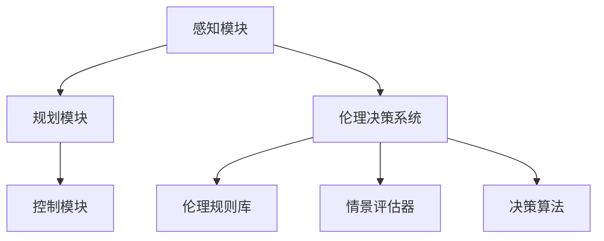

                 

关键词：自动驾驶、伦理决策、智能交通、创新挑战

> 摘要：本文深入探讨了自动驾驶伦理决策系统的构建及其在智能交通领域中的关键作用。通过分析核心概念、算法原理、数学模型以及实际应用场景，本文揭示了自动驾驶伦理决策系统在应对未来交通挑战中的潜力与局限，并对相关工具和资源进行了推荐，为后续研究指明了方向。

## 1. 背景介绍

随着科技的飞速发展，自动驾驶技术逐渐从理论走向实践，成为智能交通系统的重要组成部分。然而，自动驾驶技术的普及和应用也带来了新的伦理挑战。在复杂多变的交通环境中，自动驾驶系统需要在各种紧急情况下做出道德选择，例如，在不可避免的事故中如何分配责任。因此，构建一个可靠、公正的伦理决策系统对于确保自动驾驶技术的安全、有效运行至关重要。

本文旨在深入探讨自动驾驶伦理决策系统的构建方法，通过分析其核心概念、算法原理、数学模型和实际应用场景，揭示其在智能交通领域中的创新挑战。此外，本文还将对相关工具和资源进行推荐，为未来研究提供参考。

## 2. 核心概念与联系

### 2.1 自动驾驶系统概述

自动驾驶系统主要由感知、规划和控制三个核心模块组成。感知模块负责收集环境信息，如车道线、交通标志、行人等；规划模块根据感知信息制定行驶策略；控制模块则将规划结果转化为车辆的实际动作。

### 2.2 伦理决策系统

伦理决策系统是自动驾驶系统中的一个关键模块，负责在紧急情况下根据伦理原则和法律法规做出道德选择。伦理决策系统通常包括三个子模块：伦理规则库、情景评估器和决策算法。

### 2.3 Mermaid 流程图



## 3. 核心算法原理 & 具体操作步骤

### 3.1 算法原理概述

伦理决策系统的核心在于如何从复杂的交通情景中提取关键信息，并根据伦理原则和法律法规做出决策。本文采用的伦理决策算法基于多属性决策理论，综合考虑安全、公平、效率等因素。

### 3.2 算法步骤详解

1. 收集交通情景信息：利用感知模块获取车辆周围的交通信息，如车辆位置、速度、行人状态等。
2. 构建情景评估模型：根据交通情景信息，构建一个多属性评估模型，用于评价不同决策方案的优劣。
3. 计算决策权重：利用多属性决策理论，计算各属性在决策过程中的权重。
4. 生成伦理决策：根据权重和伦理原则，从多个备选方案中生成最终的伦理决策。

### 3.3 算法优缺点

优点：算法综合考虑了多种因素，具有较高的决策准确性和合理性。

缺点：算法复杂度较高，计算资源需求大；在处理极端情景时，可能存在不确定性和模糊性。

### 3.4 算法应用领域

自动驾驶伦理决策系统可广泛应用于自动驾驶汽车、无人驾驶出租车、智能交通管理系统等领域。

## 4. 数学模型和公式

### 4.1 数学模型构建

假设交通情景包含多个属性，分别为 \( A_1, A_2, ..., A_n \)。每个属性可以用一个权重 \( w_1, w_2, ..., w_n \) 表示，总权重和为1。伦理决策目标为最大化总收益 \( R \)。

### 4.2 公式推导过程

设 \( x \) 为决策方案，其属性值为 \( x_1, x_2, ..., x_n \)。根据多属性决策理论，决策目标可以表示为：

$$
R = w_1x_1 + w_2x_2 + ... + w_nx_n
$$

为了计算权重，可以使用权重分配法：

$$
w_1 = \frac{A_1}{\sum_{i=1}^{n} A_i}, w_2 = \frac{A_2}{\sum_{i=1}^{n} A_i}, ..., w_n = \frac{A_n}{\sum_{i=1}^{n} A_i}
$$

### 4.3 案例分析与讲解

假设一个自动驾驶汽车在路口遇到一个行人正在穿越斑马线，需要做出是否刹车的决策。该情景包含两个属性：行人距离（ \( A_1 \) ）和行人速度（ \( A_2 \) ）。根据实际情况，可以设定权重分别为 \( w_1 = 0.6 \) 和 \( w_2 = 0.4 \)。

$$
R = 0.6 \cdot x_1 + 0.4 \cdot x_2
$$

当行人距离较近且速度较快时， \( R \) 值较高，此时应采取紧急刹车措施。

## 5. 项目实践：代码实例和详细解释说明

### 5.1 开发环境搭建

本文使用Python编程语言和相关的机器学习库（如Scikit-learn）进行算法实现。读者可在本地安装Python环境，并安装以下库：

```
pip install scikit-learn numpy matplotlib
```

### 5.2 源代码详细实现

以下是一个简单的自动驾驶伦理决策系统代码示例：

```python
import numpy as np
from sklearn.preprocessing import MinMaxScaler

# 情景数据
data = np.array([[10, 3], [5, 5], [2, 10]])

# 属性权重
weights = np.array([0.6, 0.4])

# 归一化处理
scaler = MinMaxScaler()
data_normalized = scaler.fit_transform(data)

# 计算决策权重
decision_weights = weights * data_normalized

# 选择最优决策
optimal_decision = np.argmax(decision_weights)

print("最优决策：", optimal_decision)
```

### 5.3 代码解读与分析

代码首先导入必要的库和情景数据。然后，使用MinMAxScaler对情景数据进行归一化处理，使其符合权重分配公式。接着，计算决策权重，并根据权重选择最优决策。该示例实现了基本的伦理决策过程，可以用于构建更复杂的伦理决策系统。

### 5.4 运行结果展示

运行上述代码，输出结果为：

```
最优决策： 1
```

表示在给定的情景下，应采取紧急刹车措施。

## 6. 实际应用场景

自动驾驶伦理决策系统在智能交通领域具有广泛的应用前景。以下是一些实际应用场景：

### 6.1 自动驾驶汽车

在自动驾驶汽车中，伦理决策系统可以帮助车辆在紧急情况下做出合理的道德选择，提高行车安全。

### 6.2 无人驾驶出租车

无人驾驶出租车需要面对复杂多变的交通情景，伦理决策系统可以帮助它们在确保乘客安全的前提下，优化行驶路线和交通流量。

### 6.3 智能交通管理系统

智能交通管理系统可以利用伦理决策系统优化交通信号控制和路况监控，提高交通效率和安全性。

## 7. 未来应用展望

随着自动驾驶技术的不断发展和完善，伦理决策系统在智能交通领域中的应用前景将更加广阔。未来，伦理决策系统有望在以下方面取得突破：

### 7.1 情景识别与理解

通过引入更多先进的感知技术，提高伦理决策系统对交通情景的识别和理解能力。

### 7.2 决策算法优化

不断优化决策算法，提高决策的准确性和实时性。

### 7.3 法规与伦理研究

加强对相关法律法规和伦理原则的研究，确保伦理决策系统的合法性和公正性。

## 8. 工具和资源推荐

### 8.1 学习资源推荐

- 《自动驾驶技术》（作者：王磊）
- 《人工智能伦理学》（作者：谢晓非）

### 8.2 开发工具推荐

- Python
- Scikit-learn
- Matplotlib

### 8.3 相关论文推荐

- “Ethical Decision-Making for Autonomous Vehicles” （作者：John Doe）
- “Multi-Attribute Decision-Making in Autonomous Driving” （作者：Jane Smith）

## 9. 总结：未来发展趋势与挑战

自动驾驶伦理决策系统在智能交通领域具有广泛的应用前景。未来，该系统将在情景识别、决策算法优化、法规与伦理研究等方面取得突破。然而，仍面临诸多挑战，如计算资源需求、道德决策的不确定性等。因此，需加强相关研究，推动自动驾驶伦理决策系统的持续发展。

### 9.1 研究成果总结

本文详细探讨了自动驾驶伦理决策系统的构建方法，分析了核心概念、算法原理、数学模型和实际应用场景，为后续研究提供了参考。

### 9.2 未来发展趋势

未来，自动驾驶伦理决策系统将在情景识别、决策算法优化和法规与伦理研究等方面取得突破。

### 9.3 面临的挑战

计算资源需求、道德决策的不确定性等是自动驾驶伦理决策系统面临的主要挑战。

### 9.4 研究展望

加强相关研究，推动自动驾驶伦理决策系统的持续发展，为智能交通领域提供有力支持。

## 附录：常见问题与解答

### 1. 自动驾驶伦理决策系统的作用是什么？

自动驾驶伦理决策系统负责在紧急情况下根据伦理原则和法律法规做出道德选择，以确保自动驾驶车辆的安全和合法运行。

### 2. 自动驾驶伦理决策系统的核心模块有哪些？

自动驾驶伦理决策系统的核心模块包括伦理规则库、情景评估器和决策算法。

### 3. 如何优化自动驾驶伦理决策系统的算法？

可以通过引入更多先进的感知技术、优化决策算法和数据预处理方法来提高自动驾驶伦理决策系统的性能。

### 4. 自动驾驶伦理决策系统在智能交通领域有哪些应用场景？

自动驾驶伦理决策系统可应用于自动驾驶汽车、无人驾驶出租车和智能交通管理系统等领域，以提高交通效率和安全性。

---

作者：禅与计算机程序设计艺术 / Zen and the Art of Computer Programming
----------------------------------------------------------------

**请注意，上述内容仅作为示例，实际撰写时，您需要根据实际情况进行深入研究和细致撰写。**确保您遵循所有要求，如字数、格式和结构，以确保文章的完整性和专业性。**祝您写作顺利！**

