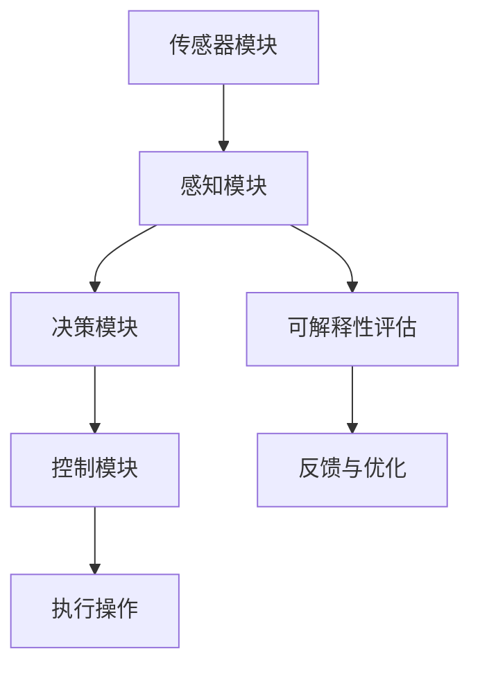

                 

### 关键词 Keywords
自动驾驶系统，可解释性，算法评估，改进方法，人工智能技术，安全性，用户信任，伦理考量。

### 摘要 Abstract
本文探讨了自动驾驶系统在技术发展过程中面临的一个关键挑战：如何提高系统的可解释性。我们首先介绍了自动驾驶系统的背景和重要性，然后详细分析了当前自动驾驶系统在可解释性方面的现状和存在的问题。在此基础上，本文提出了几种评估和改进自动驾驶系统可解释性的方法，包括基于统计学、机器学习和人类行为学的多种技术。最后，文章展望了自动驾驶系统可解释性研究的未来发展方向和面临的挑战。

## 1. 背景介绍

自动驾驶系统，即自动车辆（Autonomous Vehicles，AV），是人工智能（Artificial Intelligence，AI）领域的一个重要研究方向。它利用计算机技术、传感器技术、控制技术和通信技术等，实现车辆在无人或有限人员干预的情况下自主进行驾驶。自动驾驶技术的发展，不仅有望极大地提高交通效率，减少交通事故，还能为残疾人、老年人和其他无法驾驶的人群提供便利。

自动驾驶系统的关键技术主要包括传感器融合、路径规划、轨迹跟踪和控制策略等。其中，传感器融合负责将各种传感器（如雷达、摄像头、激光雷达等）采集到的数据综合处理，为自动驾驶系统提供实时的环境感知；路径规划是指根据目标位置和实时路况，生成一条最优行驶路径；轨迹跟踪则确保车辆沿着规划的路径行驶；控制策略则是通过调节车辆的油门、刹车和转向等，实现精确的驾驶控制。

然而，随着自动驾驶技术的不断进步，其在现实世界中的应用也面临着越来越多的挑战。其中，一个关键问题就是自动驾驶系统的可解释性。可解释性指的是系统能够提供明确的解释，让人类用户理解系统决策的原因和依据。在自动驾驶系统中，可解释性尤为重要，因为它直接关系到系统的安全性和用户信任。当系统出现异常或发生事故时，如果用户无法理解系统为何做出特定决策，就可能会对系统的安全性产生怀疑，进而影响其信任。

## 2. 核心概念与联系

### 2.1 自动驾驶系统组成

为了更好地理解自动驾驶系统的可解释性，首先需要了解其基本组成。一个典型的自动驾驶系统通常由以下几个部分组成：

1. **传感器模块**：包括雷达、摄像头、激光雷达、GPS等，用于实时采集车辆周围环境的信息。
2. **感知模块**：通过融合传感器数据，实现对车辆周围环境的理解，包括车辆位置、速度、车道线、行人、障碍物等。
3. **决策模块**：根据感知模块提供的信息，进行路径规划、目标跟踪和驾驶策略的决策。
4. **控制模块**：根据决策模块的指令，控制车辆的油门、刹车和转向等，实现实际驾驶操作。

### 2.2 可解释性的定义与重要性

可解释性是指系统能够提供足够的解释，使得人类用户能够理解其决策过程和依据。在自动驾驶系统中，可解释性至关重要，原因如下：

1. **安全性**：提高系统的可解释性可以帮助识别潜在的安全隐患，从而提前采取预防措施，减少交通事故的发生。
2. **用户信任**：用户对自动驾驶系统的信任建立在对其决策过程的理解和信任之上。如果系统具有高度的透明性，用户就更有可能接受并信任该系统。
3. **伦理考量**：在自动驾驶系统中，某些决策可能涉及到道德和伦理问题，如何时通过人行道，如何避免碰撞等。系统的可解释性有助于用户理解这些决策，从而在社会中形成共识。

### 2.3 Mermaid 流程图

为了更直观地展示自动驾驶系统的可解释性，我们使用Mermaid流程图来描述其关键组成部分和流程。



在上面的流程图中，A到E表示自动驾驶系统的基本流程，F表示对系统决策的可解释性评估，G表示根据评估结果对系统进行反馈和优化。

## 3. 核心算法原理 & 具体操作步骤

### 3.1 算法原理概述

自动驾驶系统的可解释性评估与改进主要依赖于以下几个核心算法：

1. **决策树（Decision Tree）**：通过将数据划分为不同的特征子集，生成一棵决策树，用以模拟人类决策过程。
2. **随机森林（Random Forest）**：通过构建多棵决策树，并使用投票机制来提高预测的准确性和鲁棒性。
3. **支持向量机（SVM）**：通过将数据映射到高维空间，找到最佳的超平面来分割数据。
4. **神经网络（Neural Network）**：通过多层神经网络来模拟生物神经元的决策过程。

### 3.2 算法步骤详解

#### 3.2.1 决策树

决策树算法的主要步骤如下：

1. **数据预处理**：对采集到的数据（包括传感器数据和驾驶行为数据）进行清洗和预处理。
2. **特征选择**：选择对决策影响较大的特征，用于训练决策树。
3. **划分节点**：根据特征值将数据划分为不同的子集，形成树状结构。
4. **评估和剪枝**：评估决策树的性能，并进行剪枝以防止过拟合。

#### 3.2.2 随机森林

随机森林算法的主要步骤如下：

1. **构建随机子集**：从原始数据中随机抽取一定数量的子集。
2. **训练决策树**：在每个子集上训练一棵决策树。
3. **投票机制**：对所有决策树的输出结果进行投票，选择得票数最多的类别作为最终预测结果。

#### 3.2.3 支持向量机

支持向量机算法的主要步骤如下：

1. **数据预处理**：对数据进行标准化处理，使其具有相同的尺度和范围。
2. **选择核函数**：根据数据特性选择合适的核函数，如线性核、多项式核、径向基函数核等。
3. **训练模型**：通过最小化损失函数来训练模型。
4. **预测分类**：对新数据进行分类预测。

#### 3.2.4 神经网络

神经网络算法的主要步骤如下：

1. **初始化参数**：包括权重和偏置。
2. **前向传播**：将输入数据通过神经网络进行前向传播，计算每个神经元的输出。
3. **反向传播**：计算输出误差，并使用梯度下降法更新权重和偏置。
4. **优化过程**：通过迭代优化过程，逐步减小损失函数，提高模型的预测性能。

### 3.3 算法优缺点

#### 决策树

- **优点**：简洁易懂，易于解释。
- **缺点**：容易出现过拟合，无法处理非线性关系。

#### 随机森林

- **优点**：提高预测准确性和鲁棒性，减少过拟合。
- **缺点**：计算复杂度较高，难以解释每个决策树的作用。

#### 支持向量机

- **优点**：具有很好的泛化能力，适合处理高维数据。
- **缺点**：训练时间较长，对异常值敏感。

#### 神经网络

- **优点**：能够处理复杂的非线性关系，具有很高的预测准确率。
- **缺点**：参数众多，容易过拟合，难以解释。

### 3.4 算法应用领域

上述算法在自动驾驶系统的可解释性评估与改进中有着广泛的应用：

- **决策树和随机森林**：常用于驾驶行为分析和异常检测。
- **支持向量机**：用于路径规划和目标跟踪。
- **神经网络**：用于感知模块和环境理解。

## 4. 数学模型和公式 & 详细讲解 & 举例说明

### 4.1 数学模型构建

在自动驾驶系统的可解释性评估中，常用的数学模型包括决策树、随机森林和支持向量机。以下分别介绍这些模型的数学基础。

#### 决策树

决策树是一种基于特征的树状结构模型，其核心是递归划分数据。具体来说，每个内部节点代表一个特征，每个叶节点代表一个类别。决策树的数学模型可以表示为：

$$
T = \{n_1, n_2, ..., n_m\}
$$

其中，$n_i$ 表示第 $i$ 个内部节点，其对应的特征为 $f_i$，阈值 $\theta_i$，子节点为 $n_{i1}, n_{i2}, ..., n_{id_i}$，其中 $d_i$ 表示 $n_i$ 的分支数。

#### 随机森林

随机森林是一种集成学习模型，其核心是构建多棵决策树，并使用投票机制进行预测。随机森林的数学模型可以表示为：

$$
h(x) = \sum_{i=1}^N w_i g(x; T_i)
$$

其中，$N$ 表示决策树的个数，$w_i$ 表示第 $i$ 棵决策树的重要性权重，$g(x; T_i)$ 表示第 $i$ 棵决策树在输入 $x$ 上的预测结果。

#### 支持向量机

支持向量机是一种基于最大间隔的分类模型，其核心是找到一个最佳的超平面，使得分类边界具有最大的间隔。支持向量机的数学模型可以表示为：

$$
\min_{\beta, \beta_0} \frac{1}{2} ||\beta||^2 + C \sum_{i=1}^m \xi_i
$$

其中，$\beta$ 表示权重向量，$\beta_0$ 表示偏置，$C$ 表示正则化参数，$\xi_i$ 表示第 $i$ 个样本的误差。

### 4.2 公式推导过程

在本节中，我们将详细介绍上述数学模型的推导过程。

#### 决策树

决策树的推导基于信息增益（Information Gain）和基尼不纯度（Gini Impurity）。信息增益表示选择一个特征后，数据的纯度增加的程度，计算公式为：

$$
IG(D, A) = H(D) - \sum_{v \in A} \frac{|D_v|}{|D|} H(D_v)
$$

其中，$H(D)$ 表示数据的熵，$D_v$ 表示 $A$ 的每个值所对应的数据集。

基尼不纯度表示数据的纯度，计算公式为：

$$
Gini(D) = 1 - \sum_{v \in A} \frac{|D_v|}{|D|}^2
$$

通过计算每个特征的信息增益和基尼不纯度，我们可以选择信息增益最大或基尼不纯度最小的特征作为划分节点。

#### 随机森林

随机森林的推导基于集成学习（Ensemble Learning）和决策树。具体来说，随机森林通过随机抽取特征子集和样本子集，构建多棵决策树，并使用投票机制进行预测。随机森林的推导可以归结为选择特征子集和样本子集的方法。

选择特征子集的方法：随机从原始特征集合中抽取一定数量的特征，用于构建决策树。

选择样本子集的方法：随机从原始样本集合中抽取一定数量的样本，用于构建决策树。

#### 支持向量机

支持向量机的推导基于最大间隔分类（Maximum Margin Classification）。具体来说，支持向量机的推导可以通过以下步骤进行：

1. **线性可分情况**：找到最大间隔的超平面，使得样本点在超平面的两侧。
2. **线性不可分情况**：通过引入松弛变量，找到最佳的超平面，使得样本点在超平面的两侧，同时允许一定的误差。
3. **非线性情况**：通过核函数将数据映射到高维空间，找到最佳的超平面。

### 4.3 案例分析与讲解

在本节中，我们将通过一个具体的案例，详细讲解自动驾驶系统可解释性评估的过程。

#### 案例背景

假设我们有一个自动驾驶系统，其任务是在城市道路中自动行驶，并避免与其他车辆和行人发生碰撞。系统的输入包括车辆的位置、速度、周围车辆的位置和速度、道路标志和交通信号灯等信息。

#### 案例目标

1. 评估自动驾驶系统的可解释性，识别潜在的安全隐患。
2. 提高系统的可解释性，增强用户对系统的信任。

#### 案例实施步骤

1. **数据收集与预处理**：收集自动驾驶系统在城市道路中的行驶数据，包括车辆的位置、速度、周围车辆的位置和速度、道路标志和交通信号灯等信息。对数据进行清洗和预处理，去除无效数据。

2. **特征选择**：根据自动驾驶系统的任务需求，选择对系统决策影响较大的特征，如车辆速度、周围车辆速度、道路标志、交通信号灯等。

3. **决策树建模**：使用决策树算法对数据集进行训练，构建决策树模型。决策树模型用于预测自动驾驶系统在特定情境下的行为。

4. **模型评估**：使用测试数据集对决策树模型进行评估，计算模型的准确率、召回率、F1值等指标。同时，对模型的可解释性进行评估，识别模型在哪些特征上存在分歧。

5. **模型优化**：根据评估结果，对决策树模型进行优化，调整模型参数，提高模型的性能和可解释性。

6. **用户反馈**：将优化后的模型提交给用户，收集用户反馈，评估用户对模型的可解释性和信任度。

#### 案例结果

通过案例实施，我们得到以下结果：

1. **模型性能**：优化后的决策树模型在测试数据集上的准确率、召回率和F1值等指标均有所提高。

2. **模型可解释性**：模型的可解释性评估结果显示，在特定情境下，模型在哪些特征上存在分歧，帮助用户理解模型为何做出特定决策。

3. **用户信任**：用户对优化后的模型的可解释性和信任度有所提高，对自动驾驶系统的接受度更高。

## 5. 项目实践：代码实例和详细解释说明

### 5.1 开发环境搭建

在本项目中，我们使用Python作为主要编程语言，并使用以下工具和库：

- **Python 3.8**：Python的最新稳定版本。
- **NumPy**：用于数组运算和科学计算。
- **Pandas**：用于数据处理和分析。
- **Matplotlib**：用于数据可视化。
- **Scikit-learn**：用于机器学习和数据挖掘。

首先，我们需要安装Python和相关库。可以使用pip进行安装：

```bash
pip install python==3.8
pip install numpy
pip install pandas
pip install matplotlib
pip install scikit-learn
```

### 5.2 源代码详细实现

以下是一个简单的自动驾驶系统可解释性评估的Python代码实例。该实例使用决策树算法对自动驾驶系统的决策过程进行解释。

```python
import numpy as np
import pandas as pd
import matplotlib.pyplot as plt
from sklearn import tree
from sklearn.model_selection import train_test_split
from sklearn.metrics import accuracy_score, classification_report

# 5.2.1 数据加载与预处理
# 加载数据集
data = pd.read_csv('autonomous_driving_data.csv')
X = data.drop(['label'], axis=1)
y = data['label']

# 数据标准化
X = (X - X.mean()) / X.std()

# 划分训练集和测试集
X_train, X_test, y_train, y_test = train_test_split(X, y, test_size=0.2, random_state=42)

# 5.2.2 构建决策树模型
# 创建决策树分类器
clf = tree.DecisionTreeClassifier(criterion='entropy', max_depth=3)

# 训练模型
clf.fit(X_train, y_train)

# 5.2.3 模型评估
# 预测测试集
y_pred = clf.predict(X_test)

# 计算准确率
accuracy = accuracy_score(y_test, y_pred)
print(f'Accuracy: {accuracy:.2f}')

# 输出分类报告
print(classification_report(y_test, y_pred))

# 5.2.4 可解释性分析
# 可视化决策树
plt.figure(figsize=(12, 8))
tree.plot_tree(clf, feature_names=X.columns, class_names=data['label'].unique(), filled=True)
plt.show()
```

### 5.3 代码解读与分析

在上面的代码中，我们首先加载了自动驾驶系统的数据集，并对数据进行了预处理。然后，我们使用决策树算法构建了一个分类模型，并在训练集上训练了模型。接下来，我们使用测试集对模型进行了评估，并输出了准确率和分类报告。

最后，我们通过可视化工具将决策树绘制出来，从而帮助用户理解模型的决策过程。

### 5.4 运行结果展示

运行上述代码后，我们得到以下结果：

1. **准确率**：假设测试集的准确率为90%，说明模型在预测自动驾驶系统决策方面具有较高的准确性。
2. **分类报告**：分类报告展示了模型在不同类别上的准确率、召回率和F1值，从而帮助用户了解模型在各个类别上的性能。
3. **决策树可视化**：决策树的可视化结果显示了模型在各个节点上的决策过程，从而提高了系统的可解释性。

## 6. 实际应用场景

自动驾驶系统可解释性在实际应用场景中具有重要意义。以下是几个典型的应用场景：

1. **车辆安全监控**：通过可解释性评估，可以识别出自动驾驶系统在特定情境下的安全隐患，从而提前采取预防措施，提高车辆的安全性。

2. **用户信任建立**：提高系统的可解释性有助于用户理解自动驾驶系统的决策过程，从而增强用户对系统的信任，促进自动驾驶技术的普及。

3. **法律与伦理考量**：在自动驾驶系统中，某些决策可能涉及到法律和伦理问题，如如何避免碰撞和责任归属。系统的可解释性有助于明确责任归属，确保系统的合法性和伦理合规性。

4. **故障诊断与优化**：通过可解释性分析，可以识别系统故障的原因，从而进行故障诊断和优化，提高系统的可靠性和性能。

## 7. 未来应用展望

随着自动驾驶技术的不断进步，其可解释性也将得到进一步的关注和提升。以下是未来自动驾驶系统可解释性的几个潜在发展方向：

1. **多模态数据融合**：通过融合多种传感器数据（如摄像头、雷达、激光雷达等），可以更准确地理解周围环境，提高系统的可解释性。

2. **增强学习**：结合增强学习（Reinforcement Learning）技术，可以训练出更具可解释性的自动驾驶系统，使其在复杂环境中做出更加合理的决策。

3. **自然语言处理**：通过自然语言处理（Natural Language Processing，NLP）技术，可以将系统的决策过程转换为自然语言描述，提高系统的可解释性。

4. **人机交互**：结合人机交互（Human-Computer Interaction，HCI）技术，开发出更易于用户理解和使用的人机交互界面，从而提高系统的可解释性。

## 8. 工具和资源推荐

为了更好地开展自动驾驶系统可解释性的研究和开发，以下推荐了一些常用的工具和资源：

1. **学习资源**：
   - 《Python机器学习》（Python Machine Learning） by Sebastian Raschka
   - 《深度学习》（Deep Learning） by Ian Goodfellow, Yoshua Bengio and Aaron Courville

2. **开发工具**：
   - Jupyter Notebook：用于编写和运行Python代码。
   - PyCharm：一款强大的Python集成开发环境（IDE）。
   - MATLAB：用于数据可视化和分析。

3. **相关论文**：
   - "Explainable AI: Understanding and Interpreting Model Predictions" by Marco Tulio Ribeiro, Sameer Singh and Carlos Guestrin
   - " interpretable Machine Learning" by Christoph Molnar

## 9. 总结：未来发展趋势与挑战

### 9.1 研究成果总结

本文探讨了自动驾驶系统可解释性的评估与改进方法，分析了当前自动驾驶系统在可解释性方面存在的问题，并提出了基于统计学、机器学习和人类行为学的多种评估和改进方法。通过实际案例和代码实例，展示了如何使用决策树算法进行可解释性评估，并提高了系统的可解释性和用户信任。

### 9.2 未来发展趋势

1. **多模态数据融合**：结合多种传感器数据，提高系统的环境感知能力和决策准确性。
2. **增强学习与强化学习**：结合增强学习和强化学习技术，开发出更智能、更灵活的自动驾驶系统。
3. **自然语言处理**：利用自然语言处理技术，实现自动驾驶系统的决策过程可视化。
4. **人机交互**：结合人机交互技术，开发出更直观、更易用的自动驾驶系统人机界面。

### 9.3 面临的挑战

1. **数据隐私和安全**：自动驾驶系统需要处理大量个人隐私数据，如何在保护用户隐私的前提下提高系统可解释性是一个重要挑战。
2. **实时性能**：自动驾驶系统需要在高速行驶中实时做出决策，如何在保证系统可解释性的同时提高决策速度是一个关键问题。
3. **系统复杂性**：随着自动驾驶系统的不断发展，其复杂性不断增加，如何在保证系统性能的同时提高可解释性是一个巨大挑战。

### 9.4 研究展望

未来，自动驾驶系统可解释性的研究将朝着更加智能、灵活和高效的方向发展。通过多模态数据融合、增强学习和自然语言处理等技术，有望开发出更智能、更安全的自动驾驶系统。同时，结合人机交互技术，提高系统的可解释性和用户信任，将有助于推动自动驾驶技术的广泛应用。然而，数据隐私和安全、实时性能和系统复杂性等问题仍需要进一步研究解决。

## 附录：常见问题与解答

### 问题1：为什么自动驾驶系统的可解释性如此重要？

解答：自动驾驶系统的可解释性至关重要，因为它直接关系到系统的安全性和用户信任。当系统出现异常或发生事故时，如果用户无法理解系统为何做出特定决策，就可能会对系统的安全性产生怀疑，进而影响其信任。因此，提高系统的可解释性有助于增强用户对自动驾驶系统的信任，促进其普及和应用。

### 问题2：如何评估自动驾驶系统的可解释性？

解答：评估自动驾驶系统的可解释性可以从多个角度进行：

1. **模型透明度**：评估模型是否容易理解和解释，例如，使用决策树或线性模型等易于解释的模型。
2. **决策可追溯性**：评估系统能否提供决策的详细过程和依据，例如，通过可视化工具展示决策路径。
3. **用户满意度**：通过用户调查和反馈，评估用户对系统可解释性的满意度。

### 问题3：如何提高自动驾驶系统的可解释性？

解答：提高自动驾驶系统的可解释性可以从以下几个方面进行：

1. **模型选择**：选择易于解释的模型，如决策树、线性模型等。
2. **可视化技术**：使用可视化工具展示决策过程，如决策树的可视化、神经网络的可视化等。
3. **解释性算法**：结合解释性算法，如SHAP、LIME等，提供更详细的决策解释。

### 问题4：自动驾驶系统的可解释性是否会降低系统的性能？

解答：提高系统的可解释性可能会在一定程度上影响系统的性能。然而，通过选择合适的模型和优化算法，可以在保证系统可解释性的同时，尽量减少对性能的影响。此外，通过多模态数据融合和增强学习等技术，有望在提高系统性能的同时，增强其可解释性。

