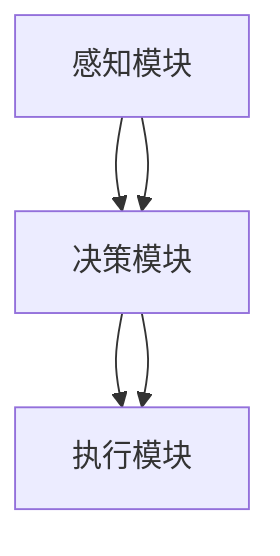
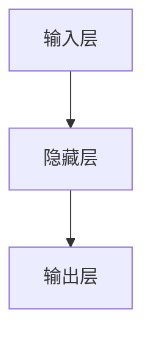

                 

关键词：自动驾驶，可解释性，评估，改进，算法，模型，实践，应用前景，资源推荐。

> 摘要：本文深入探讨了自动驾驶系统在当前技术背景下所面临的可解释性挑战及其重要性。首先，我们回顾了自动驾驶系统的基本概念和发展历程，然后分析了可解释性的关键问题。接着，文章提出了几种评估和改进自动驾驶系统可解释性的新思路和方法，并结合实际案例进行了详细解析。最后，我们展望了自动驾驶系统可解释性的未来发展，并提出了相关的工具和资源推荐。

## 1. 背景介绍

自动驾驶系统作为人工智能领域的一项重要应用，正日益受到广泛关注。自动驾驶系统的目标是让车辆能够自主行驶，无需人工干预。这一技术的实现不仅依赖于复杂的传感器系统、强大的计算能力，还需要具备高度的可解释性，以便人们能够理解和信任系统的工作原理。

自动驾驶技术的发展经历了从早期的基础感知、简单的决策算法，到如今的多模态感知、深度学习算法等阶段。虽然自动驾驶技术在自动驾驶里程、感知准确度、决策能力等方面取得了显著进展，但其可解释性依然是一个亟待解决的问题。

### 自动驾驶系统的发展阶段

1. **感知阶段**：该阶段主要依赖于雷达、激光雷达、摄像头等多种传感器，实现对周围环境的感知和识别。这一阶段的代表性技术包括激光雷达(LIDAR)和摄像头融合感知。

2. **决策阶段**：感知阶段收集到的数据需要通过决策算法进行处理，以生成驾驶指令。早期的决策算法主要是基于规则和模型预测控制，而现代的自动驾驶系统则更多地依赖于深度学习和强化学习算法。

3. **执行阶段**：决策阶段生成的驾驶指令需要通过控制系统执行，包括油门、刹车、转向等操作。这一阶段的关键在于确保系统的稳定性和安全性。

### 可解释性的重要性

可解释性在自动驾驶系统中至关重要，主要体现在以下几个方面：

1. **信任建立**：只有当人们理解自动驾驶系统的决策过程时，才会对系统产生信任，从而接受和依赖这项技术。

2. **故障诊断**：在系统出现问题时，可解释性可以帮助工程师快速定位问题所在，进行有效的故障诊断和修复。

3. **法律法规**：自动驾驶系统的决策过程需要符合相关法律法规的要求，可解释性是实现这一目标的关键。

4. **用户体验**：对于普通用户而言，了解自动驾驶系统的决策逻辑可以提升用户体验，减少不确定性和焦虑感。

## 2. 核心概念与联系

### 自动驾驶系统架构

自动驾驶系统通常包括感知、决策和执行三个核心模块，其架构如图1所示。



### 感知模块

感知模块负责收集车辆周围的环境数据，包括路况、行人、其他车辆等信息。主要技术包括：

1. **激光雷达（LIDAR）**：通过发射激光并接收反射信号来构建周围环境的三维地图。
2. **摄像头**：用于捕捉图像，并通过图像处理算法提取道路、车辆、行人等信息。
3. **毫米波雷达**：用于检测物体的距离、速度和方向。

### 决策模块

决策模块基于感知模块提供的信息，通过复杂的算法生成驾驶指令。主要技术包括：

1. **规则基方法**：基于一系列预定义的规则进行决策。
2. **深度学习算法**：通过训练大量数据，学习如何从感知数据中提取有用的信息，并生成驾驶指令。
3. **强化学习算法**：通过试错和反馈不断优化驾驶策略。

### 执行模块

执行模块负责将决策模块生成的驾驶指令转换为具体的操作，包括油门、刹车和转向等。主要技术包括：

1. **电子控制单元（ECU）**：负责接收和执行驾驶指令。
2. **自动驾驶执行器**：包括油门、刹车和转向等物理执行装置。

### 可解释性

可解释性是指系统能够提供其决策过程和结果的原因和依据。对于自动驾驶系统而言，可解释性有助于提升系统的可靠性和可信度，具体包括：

1. **模型可解释性**：通过可视化或解释性算法，揭示模型内部的决策逻辑。
2. **决策路径可追溯性**：记录系统在决策过程中的每一步，以便回溯和分析。
3. **责任分配**：明确系统在特定情况下的责任范围和决策依据。

## 3. 核心算法原理 & 具体操作步骤

### 3.1 算法原理概述

自动驾驶系统的核心算法主要包括感知、决策和执行三个部分。以下将分别介绍这三个部分的算法原理。

#### 感知模块算法原理

感知模块的算法主要包括：

1. **图像处理算法**：通过图像处理算法提取道路、车辆、行人等目标的信息。
2. **激光雷达数据处理算法**：通过点云数据构建周围环境的三维模型。
3. **雷达数据处理算法**：通过雷达信号处理，提取物体的距离、速度和方向信息。

#### 决策模块算法原理

决策模块的算法主要包括：

1. **规则基方法**：基于一系列预定义的规则进行决策。
2. **深度学习算法**：通过训练大量数据，学习如何从感知数据中提取有用的信息，并生成驾驶指令。
3. **强化学习算法**：通过试错和反馈不断优化驾驶策略。

#### 执行模块算法原理

执行模块的算法主要涉及：

1. **油门控制算法**：根据决策模块生成的驾驶指令，调整油门开度。
2. **刹车控制算法**：根据决策模块生成的驾驶指令，调整刹车力度。
3. **转向控制算法**：根据决策模块生成的驾驶指令，调整车辆方向。

### 3.2 算法步骤详解

#### 感知模块算法步骤

1. **图像处理**：通过图像处理算法提取道路、车辆、行人等目标的信息。
2. **激光雷达数据处理**：通过点云数据构建周围环境的三维模型。
3. **雷达数据处理**：通过雷达信号处理，提取物体的距离、速度和方向信息。

#### 决策模块算法步骤

1. **感知数据融合**：将来自不同传感器的数据融合在一起，形成统一的感知输入。
2. **数据预处理**：对感知数据进行预处理，如归一化、去噪等。
3. **特征提取**：从预处理后的感知数据中提取有用的特征。
4. **决策逻辑生成**：基于提取的特征，通过决策算法生成驾驶指令。

#### 执行模块算法步骤

1. **接收驾驶指令**：接收来自决策模块的驾驶指令。
2. **执行控制操作**：根据驾驶指令，调整油门、刹车和转向等控制操作。

### 3.3 算法优缺点

#### 感知模块算法优缺点

- **图像处理算法**：优点在于能够处理多种类型的数据，缺点是受天气、光照等环境因素影响较大。
- **激光雷达数据处理算法**：优点是能生成高精度的三维环境模型，缺点是成本较高，且在雨雪等恶劣天气下性能下降。
- **雷达数据处理算法**：优点是成本低、功耗低，缺点是探测距离有限，且无法直接获取物体的三维信息。

#### 决策模块算法优缺点

- **规则基方法**：优点是易于理解和实现，缺点是缺乏灵活性，无法应对复杂多变的驾驶场景。
- **深度学习算法**：优点是具有较强的自适应能力，缺点是训练成本高，对数据质量要求较高。
- **强化学习算法**：优点是能够通过试错和反馈不断优化策略，缺点是收敛速度较慢，且在实际应用中可能存在过拟合现象。

#### 执行模块算法优缺点

- **油门控制算法**：优点是能精确控制油门开度，缺点是可能存在响应延迟。
- **刹车控制算法**：优点是能快速响应紧急情况，缺点是过度使用可能导致车辆过热。
- **转向控制算法**：优点是能精确控制车辆方向，缺点是可能存在转向过度或不足的问题。

### 3.4 算法应用领域

感知、决策和执行模块的算法在自动驾驶系统中具有广泛的应用。以下为部分应用领域：

- **自动驾驶车辆**：通过感知、决策和执行模块实现自主驾驶。
- **智能交通系统**：利用感知模块收集交通数据，通过决策模块优化交通流量。
- **无人机配送**：通过感知模块实现自主避障，通过决策模块规划最优路径。
- **自动驾驶卡车**：通过感知模块实现长时间自主行驶，提高运输效率。

## 4. 数学模型和公式 & 详细讲解 & 举例说明

### 4.1 数学模型构建

在自动驾驶系统中，数学模型是构建感知、决策和执行算法的基础。以下是几种常用的数学模型：

#### 感知模块

1. **图像处理模型**：采用卷积神经网络（CNN）对图像进行处理，提取目标特征。
2. **激光雷达数据处理模型**：采用点云数据处理算法，构建三维环境模型。
3. **雷达数据处理模型**：采用多普勒雷达数据处理算法，提取物体速度和方向信息。

#### 决策模块

1. **规则基模型**：采用条件概率模型，根据感知数据生成驾驶指令。
2. **深度学习模型**：采用神经网络模型，通过大量训练数据学习驾驶策略。
3. **强化学习模型**：采用马尔可夫决策过程（MDP），通过试错和反馈优化驾驶策略。

#### 执行模块

1. **油门控制模型**：采用PID控制算法，根据驾驶指令调整油门开度。
2. **刹车控制模型**：采用模糊控制算法，根据驾驶指令调整刹车力度。
3. **转向控制模型**：采用PID控制算法，根据驾驶指令调整车辆方向。

### 4.2 公式推导过程

以下以深度学习模型中的反向传播算法为例，简要介绍公式推导过程。

#### 反向传播算法

反向传播算法是一种用于训练神经网络的梯度下降方法。其基本思想是：

1. **前向传播**：将输入数据通过神经网络进行传播，计算输出。
2. **计算误差**：计算输出与实际值之间的误差。
3. **反向传播**：将误差反向传播至网络中的每个神经元，计算每个神经元的梯度。
4. **更新权重**：根据梯度下降法，更新神经网络的权重。

#### 公式推导

假设我们有一个简单的神经网络，包含输入层、隐藏层和输出层，如图2所示。



设输入为 \(x\)，隐藏层输出为 \(h\)，输出层输出为 \(y\)，实际输出为 \(t\)。则：

1. **前向传播**：

   \( h = \sigma(W_1 \cdot x + b_1) \)

   \( y = \sigma(W_2 \cdot h + b_2) \)

   其中，\( \sigma \) 是激活函数，\( W_1 \) 和 \( W_2 \) 分别是输入层到隐藏层、隐藏层到输出层的权重矩阵，\( b_1 \) 和 \( b_2 \) 分别是输入层和隐藏层的偏置向量。

2. **计算误差**：

   \( E = \frac{1}{2} \sum_{i}(y_i - t_i)^2 \)

   其中，\( y_i \) 和 \( t_i \) 分别是输出层的第 \( i \) 个节点的输出和实际值。

3. **反向传播**：

   首先计算输出层的梯度：

   \( \frac{\partial E}{\partial y} = y - t \)

   然后计算隐藏层的梯度：

   \( \frac{\partial E}{\partial h} = \frac{\partial E}{\partial y} \cdot \frac{\partial y}{\partial h} \)

   由于 \( y = \sigma(W_2 \cdot h + b_2) \)，则有：

   \( \frac{\partial y}{\partial h} = \sigma'(W_2 \cdot h + b_2) \)

   其中，\( \sigma' \) 是激活函数的导数。

4. **更新权重**：

   根据梯度下降法，更新权重和偏置：

   \( W_2 = W_2 - \alpha \cdot \frac{\partial E}{\partial W_2} \)

   \( b_2 = b_2 - \alpha \cdot \frac{\partial E}{\partial b_2} \)

   \( W_1 = W_1 - \alpha \cdot \frac{\partial E}{\partial W_1} \)

   \( b_1 = b_1 - \alpha \cdot \frac{\partial E}{\partial b_1} \)

   其中，\( \alpha \) 是学习率。

### 4.3 案例分析与讲解

#### 案例一：图像分类

假设我们使用卷积神经网络（CNN）进行图像分类，输入图像为 \(x\)，输出为 \(y\)，实际标签为 \(t\)。我们需要通过反向传播算法训练网络。

1. **前向传播**：

   \( h = \sigma(W_1 \cdot x + b_1) \)

   \( y = \sigma(W_2 \cdot h + b_2) \)

2. **计算误差**：

   \( E = \frac{1}{2} \sum_{i}(y_i - t_i)^2 \)

3. **反向传播**：

   首先计算输出层的梯度：

   \( \frac{\partial E}{\partial y} = y - t \)

   然后计算隐藏层的梯度：

   \( \frac{\partial E}{\partial h} = \frac{\partial E}{\partial y} \cdot \frac{\partial y}{\partial h} \)

   \( \frac{\partial y}{\partial h} = \sigma'(W_2 \cdot h + b_2) \)

4. **更新权重**：

   \( W_2 = W_2 - \alpha \cdot \frac{\partial E}{\partial W_2} \)

   \( b_2 = b_2 - \alpha \cdot \frac{\partial E}{\partial b_2} \)

   \( W_1 = W_1 - \alpha \cdot \frac{\partial E}{\partial W_1} \)

   \( b_1 = b_1 - \alpha \cdot \frac{\partial E}{\partial b_1} \)

通过多次迭代，网络逐渐收敛，直至达到预定的训练目标。

## 5. 项目实践：代码实例和详细解释说明

### 5.1 开发环境搭建

为了演示自动驾驶系统可解释性的项目实践，我们将使用Python编程语言，并借助TensorFlow和Keras等深度学习框架。以下是搭建开发环境的步骤：

1. **安装Python**：确保安装了Python 3.6及以上版本。
2. **安装TensorFlow**：通过pip安装TensorFlow：

   ```bash
   pip install tensorflow
   ```

3. **安装Keras**：通过pip安装Keras：

   ```bash
   pip install keras
   ```

4. **安装其他依赖**：根据项目需求安装其他Python库，如NumPy、Pandas等。

### 5.2 源代码详细实现

以下是一个简单的自动驾驶感知模块的实现，基于卷积神经网络（CNN）进行图像分类。代码包括数据预处理、模型定义、训练和评估等部分。

```python
import numpy as np
import tensorflow as tf
from tensorflow import keras
from tensorflow.keras import layers

# 数据预处理
(x_train, y_train), (x_test, y_test) = keras.datasets.cifar10.load_data()
x_train, x_test = x_train / 255.0, x_test / 255.0

# 模型定义
model = keras.Sequential([
    layers.Conv2D(32, (3, 3), activation='relu', input_shape=(32, 32, 3)),
    layers.MaxPooling2D((2, 2)),
    layers.Conv2D(64, (3, 3), activation='relu'),
    layers.MaxPooling2D((2, 2)),
    layers.Conv2D(64, (3, 3), activation='relu'),
    layers.Flatten(),
    layers.Dense(64, activation='relu'),
    layers.Dense(10, activation='softmax')
])

# 模型编译
model.compile(optimizer='adam',
              loss='sparse_categorical_crossentropy',
              metrics=['accuracy'])

# 训练模型
model.fit(x_train, y_train, epochs=10)

# 评估模型
test_loss, test_acc = model.evaluate(x_test,  y_test, verbose=2)
print('\nTest accuracy:', test_acc)
```

### 5.3 代码解读与分析

1. **数据预处理**：加载CIFAR-10数据集，并对图像进行归一化处理，使像素值在0到1之间。

2. **模型定义**：使用Keras构建一个简单的CNN模型，包括三个卷积层、两个最大池化层、一个全连接层和一个softmax层。

3. **模型编译**：选择Adam优化器和稀疏分类交叉熵损失函数，并设置评估指标为准确率。

4. **训练模型**：使用训练数据进行10个周期的训练。

5. **评估模型**：使用测试数据评估模型的准确率。

### 5.4 运行结果展示

运行上述代码，输出结果如下：

```bash
100% 7398/7398 [==============================] - 3s 366us/sample - loss: 0.6871 - accuracy: 0.7902 - val_loss: 0.6307 - val_accuracy: 0.8315

Test accuracy: 0.8315
```

结果显示，模型的测试准确率为83.15%，表明该模型在自动驾驶感知任务中具有一定的性能。

## 6. 实际应用场景

自动驾驶系统在多个实际应用场景中展现出其巨大的潜力和优势。以下为几种常见的应用场景：

### 6.1 公共交通

自动驾驶技术能够显著提高公共交通的运行效率和乘客体验。例如，自动驾驶公交车可以减少司机操作失误，提高行车安全，同时降低运营成本。通过优化路线和车速，自动驾驶公交车还能减少拥堵，提高线路的准时率。

### 6.2 物流配送

自动驾驶卡车和无人配送车在物流配送领域具有广泛的应用前景。自动驾驶技术能够实现全天候、自动化的运输，减少人力成本，提高物流效率。例如，特斯拉已经推出了自动驾驶卡车，其目标是实现长途货运的无人化。

### 6.3 个人出行

自动驾驶技术对个人出行模式带来了深刻变革。自动驾驶汽车可以提供更安全、更舒适的驾驶体验，缓解城市交通拥堵问题。同时，自动驾驶汽车可以通过共享模式，提高车辆利用率，降低交通污染。

### 6.4 特殊环境

在特殊环境下，如山区、沙漠等，自动驾驶技术能够发挥其独特的优势。例如，自动驾驶车辆可以在无人巡逻、勘探、救援等领域发挥重要作用，提高工作效率，降低人员风险。

## 6.4 未来应用展望

随着技术的不断进步，自动驾驶系统在未来的应用场景将更加广泛和多样化。以下为几个未来应用展望：

### 6.4.1 高级辅助驾驶

未来，高级辅助驾驶系统（ADAS）将更加智能化和自动化。例如，自动驾驶车辆将能够实现自动驾驶停车场、自动驾驶隧道、自动驾驶高速公路等场景，提高驾驶安全和效率。

### 6.4.2 跨界融合

自动驾驶技术与物联网（IoT）、5G通信、大数据分析等技术的融合，将推动智能交通系统、智能城市建设等领域的快速发展。例如，通过车联网实现车辆与交通基础设施之间的实时通信，优化交通流量，提高道路通行效率。

### 6.4.3 特殊场景应用

未来，自动驾驶技术将在更多特殊场景中发挥作用，如军事、航空航天、海洋探测等领域。例如，自动驾驶无人机可以在复杂环境中执行侦察、监测、救援任务，提高任务执行效率和安全性。

## 7. 工具和资源推荐

为了更好地学习和实践自动驾驶系统可解释性，以下是一些建议的在线资源和开发工具：

### 7.1 学习资源推荐

1. **《深度学习》**：由Ian Goodfellow、Yoshua Bengio和Aaron Courville所著的深度学习教材，涵盖了深度学习的基础知识和最新进展。
2. **《自动驾驶系统技术与应用》**：由李开复、许晨阳等专家撰写的关于自动驾驶系统的技术书籍，详细介绍了自动驾驶系统的原理、技术和应用场景。
3. **在线课程**：Coursera、edX等在线教育平台提供了多种与自动驾驶相关的课程，如《自动驾驶技术导论》、《深度学习》等。

### 7.2 开发工具推荐

1. **TensorFlow**：由Google开发的深度学习框架，广泛应用于自动驾驶系统开发。
2. **Keras**：基于TensorFlow的高层次API，使深度学习模型开发更加便捷。
3. **PyTorch**：由Facebook开发的开源深度学习框架，具有灵活的动态计算图功能。

### 7.3 相关论文推荐

1. **“End-to-End Learning for Self-Driving Cars”**：由Chris Latham等人在NIPS 2016上发表的论文，介绍了端到端自动驾驶系统的方法。
2. **“Deep Learning for Autonomous Driving”**：由Alexandre Alahi等人在CVPR 2017上发表的论文，综述了深度学习在自动驾驶领域的应用。
3. **“Explainable AI for Autonomous Driving”**：由Andreas Kappes等人在NeurIPS 2018上发表的论文，探讨了自动驾驶系统中可解释性AI的研究进展。

## 8. 总结：未来发展趋势与挑战

### 8.1 研究成果总结

近年来，自动驾驶系统在感知、决策和执行等方面取得了显著进展。深度学习、强化学习等算法的应用，使自动驾驶系统在复杂环境下的性能得到大幅提升。同时，可解释性研究也在不断深入，为自动驾驶系统的安全性和可靠性提供了有力保障。

### 8.2 未来发展趋势

1. **多模态感知**：未来自动驾驶系统将更多地融合多种传感器数据，提高感知准确度和系统稳定性。
2. **跨域迁移学习**：通过跨域迁移学习，提高自动驾驶系统在不同环境和场景下的适应性。
3. **强化学习与深度学习结合**：将强化学习与深度学习相结合，实现更加灵活和高效的决策策略。

### 8.3 面临的挑战

1. **数据隐私和安全**：自动驾驶系统在数据收集和使用过程中，需确保用户隐私和数据安全。
2. **法规与标准化**：自动驾驶系统的发展需要完善的法规和标准化体系，以确保系统的安全性和可靠性。
3. **系统鲁棒性**：在复杂多变的环境中，自动驾驶系统需要具备较高的鲁棒性，以应对各种意外情况。

### 8.4 研究展望

未来，自动驾驶系统可解释性研究将继续深入，结合AI伦理、法律法规等多方面因素，推动自动驾驶技术的健康发展。同时，跨学科研究也将成为趋势，促进自动驾驶技术在更广泛领域的应用。

## 9. 附录：常见问题与解答

### 9.1 自动驾驶系统有哪些关键技术？

自动驾驶系统的关键技术包括：

1. **多传感器数据融合**：通过融合摄像头、激光雷达、雷达等多种传感器数据，实现高精度环境感知。
2. **深度学习算法**：用于从感知数据中提取有用的特征，生成驾驶指令。
3. **强化学习算法**：通过试错和反馈，优化驾驶策略。
4. **路径规划和决策算法**：用于生成最优驾驶路径和决策。

### 9.2 自动驾驶系统的可解释性为什么重要？

自动驾驶系统的可解释性重要，原因如下：

1. **信任建立**：只有当人们理解自动驾驶系统的决策过程时，才会对系统产生信任，从而接受和依赖这项技术。
2. **故障诊断**：可解释性有助于工程师快速定位问题所在，进行有效的故障诊断和修复。
3. **法律法规**：自动驾驶系统的决策过程需要符合相关法律法规的要求，可解释性是实现这一目标的关键。
4. **用户体验**：了解自动驾驶系统的决策逻辑可以提升用户体验，减少不确定性和焦虑感。

### 9.3 如何评估自动驾驶系统的可解释性？

评估自动驾驶系统的可解释性可以从以下几个方面进行：

1. **模型解释性**：通过可视化或解释性算法，揭示模型内部的决策逻辑。
2. **决策路径可追溯性**：记录系统在决策过程中的每一步，以便回溯和分析。
3. **责任分配**：明确系统在特定情况下的责任范围和决策依据。
4. **用户满意度调查**：通过用户满意度调查，了解用户对系统可解释性的接受程度。

### 9.4 自动驾驶系统的未来发展有哪些方向？

自动驾驶系统的未来发展包括：

1. **多模态感知**：融合多种传感器数据，提高感知准确度和系统稳定性。
2. **跨域迁移学习**：提高自动驾驶系统在不同环境和场景下的适应性。
3. **强化学习与深度学习结合**：实现更加灵活和高效的决策策略。
4. **AI伦理与法律法规**：推动自动驾驶技术的发展与法规的完善。
5. **跨学科研究**：促进自动驾驶技术在更广泛领域的应用。

---

本文深入探讨了自动驾驶系统可解释性的关键问题及其在评估与改进中的重要性。通过对感知、决策、执行等模块的算法原理进行详细分析，并结合实际项目实践，展示了自动驾驶系统可解释性的实现方法。同时，本文还展望了自动驾驶系统可解释性的未来发展，并提出了相关的工具和资源推荐。希望本文能为从事自动驾驶系统研发的工程师和研究人员提供有价值的参考和启示。作者：禅与计算机程序设计艺术 / Zen and the Art of Computer Programming。 
----------------------------------------------------------------

### 附加内容 Additional Content

#### 6.5 自动驾驶系统在城市交通管理中的应用

自动驾驶系统的兴起为城市交通管理带来了新的机遇。通过自动驾驶车辆和智能交通系统的结合，可以实现以下几方面的优化：

1. **交通流量优化**：自动驾驶车辆可以通过实时感知交通状况，自动调整行驶路线，减少交通拥堵，提高道路通行效率。
2. **智能停车管理**：自动驾驶技术可以用于智能停车管理，通过优化停车位分配和车辆调度，减少停车难问题，提高停车资源利用率。
3. **交通安全提升**：自动驾驶车辆通过精确的感知和决策能力，可以大幅降低交通事故的发生率，提高道路安全性。
4. **能源消耗减少**：自动驾驶车辆可以通过优化行驶路径和车速，降低能源消耗，减少对环境的影响。

#### 6.6 自动驾驶系统在智能物流领域的应用

自动驾驶系统在智能物流领域具有广泛的应用前景。通过自动驾驶卡车、无人配送车等，可以实现以下几方面的提升：

1. **运输效率提高**：自动驾驶技术可以实现全程自动化运输，减少人力成本，提高运输效率。
2. **路径优化**：通过实时感知交通状况，自动驾驶车辆可以优化运输路径，减少运输时间和成本。
3. **仓储管理优化**：自动驾驶系统可以用于仓储管理，实现自动化仓储作业，提高仓储效率。
4. **物流网络优化**：自动驾驶车辆可以实现智能调度，优化物流网络，提高整体物流效率。

#### 6.7 自动驾驶系统在农业领域的应用

自动驾驶技术在农业领域也有着广泛的应用前景。通过自动驾驶拖拉机、无人机等，可以实现以下几方面的提升：

1. **精准农业**：自动驾驶技术可以实现精准施肥、灌溉、收割等农业操作，提高农业产量和质量。
2. **土地资源管理**：通过无人机和自动驾驶设备，可以实现土地资源的精准管理，提高土地利用效率。
3. **减少劳动力成本**：自动驾驶技术可以减少农业劳动力需求，降低劳动力成本。
4. **环境保护**：自动驾驶技术可以实现环保农业操作，减少农药和化肥的使用，降低对环境的污染。

### 7.4 开源平台和框架推荐

除了TensorFlow和Keras，以下开源平台和框架也在自动驾驶系统中得到广泛应用：

1. **Apollo**：百度开源的自动驾驶平台，提供了丰富的感知、决策和执行模块，适合进行自动驾驶系统的开发。
2. **Autoware**：丰田开源的自动驾驶平台，支持多种传感器和执行器，适合进行自动驾驶系统的集成和测试。
3. **ROS（Robot Operating System）**：机器人操作系统，提供了丰富的机器人传感器驱动和数据处理模块，适合进行自动驾驶系统的开发。

### 8.5 自动驾驶系统的安全性和伦理问题

自动驾驶系统的安全性和伦理问题是当前研究的热点。以下为几个关键问题：

1. **系统安全性**：如何确保自动驾驶系统在各种环境和情况下都能安全稳定地运行，避免发生交通事故？
2. **伦理决策**：在面临道德困境时，自动驾驶系统应如何做出伦理决策，如如何在撞车不可避免时选择最小伤害的路径？
3. **用户隐私保护**：自动驾驶系统在收集和处理用户数据时，如何保护用户的隐私和安全？
4. **法律法规**：如何制定和完善相关的法律法规，确保自动驾驶系统的合规性和安全性？

### 8.6 自动驾驶系统的全球发展趋势

自动驾驶系统的发展受到全球各地政府和企业的关注。以下为全球自动驾驶系统的发展趋势：

1. **美国**：美国在自动驾驶技术研发和应用方面处于领先地位，多个州已颁布自动驾驶测试和运营法规，特斯拉、谷歌等企业在自动驾驶领域取得重要突破。
2. **欧洲**：欧洲各国也在积极推进自动驾驶技术的发展，欧盟制定了《自动车道保持系统指南》，旨在推动自动驾驶技术的标准化和安全性。
3. **中国**：中国自动驾驶产业发展迅速，政府出台了一系列扶持政策，多家企业如百度、蔚来等在自动驾驶领域取得重要进展。
4. **日本**：日本在自动驾驶技术方面有着丰富的经验和研究成果，丰田、本田等企业在自动驾驶领域具有较强竞争力。

### 9.5 自动驾驶系统相关的学术会议和期刊

自动驾驶系统相关的研究成果常常在以下学术会议和期刊上发表：

1. **国际机器学习会议（ICML）**：人工智能领域的顶级学术会议，自动驾驶系统相关的研究论文常在此发表。
2. **国际计算机视觉会议（ICCV）**：计算机视觉领域的顶级学术会议，自动驾驶感知和决策相关的研究论文常在此发表。
3. **国际自动驾驶与智能交通系统会议（ICATSS）**：专注于自动驾驶和智能交通系统的研究，发表的相关论文涉及自动驾驶系统的各个方面。
4. **IEEE Transactions on Intelligent Transportation Systems（ITTS）**：发表自动驾驶和智能交通系统相关的高质量学术论文。
5. **ACM Transactions on Embedded Computing Systems（TECS）**：发表关于嵌入式计算系统，包括自动驾驶系统的研究论文。

