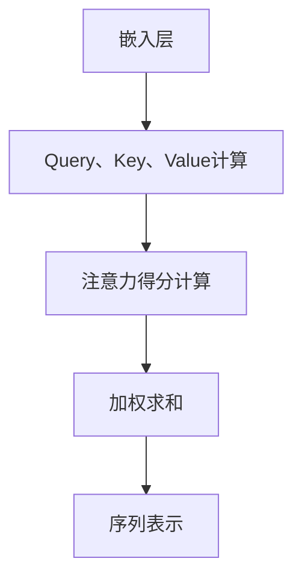

                 

关键词：自注意力机制，语言处理，深度学习，神经网络，序列模型，编码器-解码器架构，Transformer，BERT，自然语言生成，文本分类，信息检索。

> 摘要：自注意力机制作为深度学习在语言处理领域的一项关键技术，其通过捕捉序列中的长期依赖关系，极大地提升了模型的表现能力。本文旨在探讨自注意力机制在语言处理中的基本原理、实现方法及应用案例，同时展望其未来发展趋势与挑战。

## 1. 背景介绍

### 语言处理的挑战

在计算机科学领域，自然语言处理（NLP）是一个充满挑战的研究方向。NLP的任务包括但不限于文本分类、机器翻译、情感分析、问答系统等。传统的语言处理方法，如基于规则的方法和统计模型，通常难以处理复杂的语言结构和长文本依赖问题。

### 序列模型的局限性

在深度学习兴起之前，NLP领域广泛使用循环神经网络（RNN）来处理序列数据。RNN通过其在时间步上的递归连接，能够捕捉序列中的长期依赖关系。然而，RNN存在以下局限性：

- **梯度消失和梯度爆炸**：在训练深层网络时，梯度在反向传播过程中可能会变得非常小或者非常大，导致难以有效训练。
- **长时依赖问题**：RNN在处理长序列时，难以有效捕捉远距离的依赖关系。
- **并行计算限制**：由于RNN是按时间顺序处理数据，这限制了其并行计算的潜力。

### 自注意力机制的引入

为了解决上述问题，自注意力机制（Self-Attention Mechanism）被引入到深度学习模型中。自注意力机制最初是在2017年由Vaswani等人提出，并在Transformer模型中得到了广泛应用。自注意力机制的核心思想是通过全局计算方式来捕捉序列中的依赖关系，从而克服了RNN的局限性。

## 2. 核心概念与联系

### 自注意力机制原理

自注意力机制通过将输入序列中的每一个元素映射到一个查询（Query）、键（Key）和值（Value）向量，然后计算它们之间的注意力得分，最后将注意力得分加权求和，得到序列的表示。具体来说，自注意力机制包括以下几个关键步骤：

1. **嵌入层（Embedding Layer）**：输入序列首先通过嵌入层映射到高维空间。
2. **查询（Query）、键（Key）、值（Value）计算**：对于序列中的每个元素，计算其对应的查询、键和值向量。
3. **注意力得分计算**：计算每个元素与其余元素之间的注意力得分，通常使用点积或缩放点积注意力机制。
4. **加权求和**：将注意力得分与对应的值向量相乘，然后求和，得到序列的注意力表示。

### Mermaid 流程图



## 3. 核心算法原理 & 具体操作步骤

### 3.1 算法原理概述

自注意力机制的核心思想是通过计算序列中每个元素对其他元素的权重，来生成序列的注意力表示。这种权重计算通常基于元素之间的相似度，例如通过点积或者缩放点积来计算。

### 3.2 算法步骤详解

1. **嵌入层**：输入序列 $X = (x_1, x_2, ..., x_n)$ 被映射到高维空间，得到嵌入向量 $X' = (x_1', x_2', ..., x_n')$。
2. **查询、键、值计算**：对于每个嵌入向量 $x_i'$，计算其对应的查询 $Q_i'$、键 $K_i'$ 和值 $V_i'$。通常，这三个向量共享同一权重矩阵 $W$：
   $$ Q_i' = WQx_i' $$
   $$ K_i' = WKx_i' $$
   $$ V_i' = WVx_i' $$
3. **注意力得分计算**：计算每个元素与其余元素之间的注意力得分。使用缩放点积注意力机制，注意力得分计算如下：
   $$ score_{ij} = Q_i'K_j' / \sqrt{d_k} $$
   其中，$d_k$ 是键向量的维度。
4. **加权求和**：将注意力得分与对应的值向量相乘，然后求和，得到序列的注意力表示：
   $$ \text{Attention}(Q, K, V) = \text{softmax}(score) \odot V $$
   其中，$\odot$ 表示逐元素相乘。

### 3.3 算法优缺点

**优点**：

- **捕捉长距离依赖**：自注意力机制能够捕捉序列中的长距离依赖关系，从而提高了模型的表示能力。
- **并行计算**：由于自注意力机制不需要按照时间顺序处理数据，因此可以并行计算，提高了模型的训练速度。
- **灵活性和扩展性**：自注意力机制可以很容易地与其他神经网络结构结合，如编码器-解码器架构。

**缺点**：

- **计算复杂度高**：自注意力机制的计算复杂度为 $O(n^2)$，在长序列上计算量较大。
- **资源消耗大**：由于需要计算大量的点积操作，自注意力机制对计算资源和内存有较高的要求。

### 3.4 算法应用领域

自注意力机制在NLP领域得到了广泛应用，主要应用领域包括：

- **文本分类**：通过自注意力机制，模型能够更好地捕捉文本中的关键信息，从而提高分类效果。
- **机器翻译**：在编码器-解码器架构中，自注意力机制能够帮助模型更好地理解源语言和目标语言之间的依赖关系。
- **自然语言生成**：自注意力机制在生成模型中，能够更好地捕捉上下文信息，从而生成更流畅和准确的文本。

## 4. 数学模型和公式 & 详细讲解 & 举例说明

### 4.1 数学模型构建

自注意力机制的数学模型主要包括以下几个部分：

- **输入序列**：$X = (x_1, x_2, ..., x_n)$
- **嵌入层**：$X' = (x_1', x_2', ..., x_n')$
- **查询、键、值向量**：$Q' = (Q_1', Q_2', ..., Q_n')$，$K' = (K_1', K_2', ..., K_n')$，$V' = (V_1', V_2', ..., V_n')$
- **注意力得分**：$score_{ij} = Q_i'K_j' / \sqrt{d_k}$
- **注意力表示**：$\text{Attention}(Q, K, V) = \text{softmax}(score) \odot V$

### 4.2 公式推导过程

首先，我们定义输入序列 $X = (x_1, x_2, ..., x_n)$，并对其进行嵌入映射得到 $X' = (x_1', x_2', ..., x_n')$。接着，我们定义权重矩阵 $W$，并通过权重矩阵计算得到查询、键和值向量 $Q' = (Q_1', Q_2', ..., Q_n')$，$K' = (K_1', K_2', ..., K_n')$，$V' = (V_1', V_2', ..., V_n')$。

对于注意力得分，我们使用缩放点积注意力机制，其计算公式为：

$$ score_{ij} = Q_i'K_j' / \sqrt{d_k} $$

其中，$d_k$ 是键向量的维度。通过计算注意力得分，我们得到注意力表示：

$$ \text{Attention}(Q, K, V) = \text{softmax}(score) \odot V $$

### 4.3 案例分析与讲解

假设我们有一个简单的输入序列 $X = (\text{"hello"}, \text{"world"})$，我们将其映射到高维空间得到 $X' = (x_1', x_2')$。接着，我们定义权重矩阵 $W$，并通过权重矩阵计算得到查询、键和值向量 $Q' = (Q_1', Q_2')$，$K' = (K_1', K_2')$，$V' = (V_1', V_2')$。

假设我们使用简单的线性映射，即：

$$ Q_1' = WQx_1' $$
$$ Q_2' = WQx_2' $$
$$ K_1' = WKx_1' $$
$$ K_2' = WKx_2' $$
$$ V_1' = WVx_1' $$
$$ V_2' = WVx_2' $$

我们定义权重矩阵 $W$ 为：

$$ W = \begin{bmatrix} 1 & 0 \\ 0 & 1 \end{bmatrix} $$

因此，我们得到：

$$ Q_1' = \begin{bmatrix} 1 & 0 \\ 0 & 1 \end{bmatrix} \begin{bmatrix} x_1' \end{bmatrix} = \begin{bmatrix} x_1' \\ x_2' \end{bmatrix} $$
$$ Q_2' = \begin{bmatrix} 1 & 0 \\ 0 & 1 \end{bmatrix} \begin{bmatrix} x_2' \end{bmatrix} = \begin{bmatrix} x_2' \\ x_1' \end{bmatrix} $$
$$ K_1' = \begin{bmatrix} 1 & 0 \\ 0 & 1 \end{bmatrix} \begin{bmatrix} x_1' \end{bmatrix} = \begin{bmatrix} x_1' \\ x_2' \end{bmatrix} $$
$$ K_2' = \begin{bmatrix} 1 & 0 \\ 0 & 1 \end{bmatrix} \begin{bmatrix} x_2' \end{bmatrix} = \begin{bmatrix} x_2' \\ x_1' \end{bmatrix} $$
$$ V_1' = \begin{bmatrix} 1 & 0 \\ 0 & 1 \end{bmatrix} \begin{bmatrix} x_1' \end{bmatrix} = \begin{bmatrix} x_1' \\ x_2' \end{bmatrix} $$
$$ V_2' = \begin{bmatrix} 1 & 0 \\ 0 & 1 \end{bmatrix} \begin{bmatrix} x_2' \end{bmatrix} = \begin{bmatrix} x_2' \\ x_1' \end{bmatrix} $$

接着，我们计算注意力得分：

$$ score_{11} = Q_1'K_1' = x_1'x_1' = x_1'^2 $$
$$ score_{12} = Q_1'K_2' = x_1'x_2' $$
$$ score_{21} = Q_2'K_1' = x_2'x_1' $$
$$ score_{22} = Q_2'K_2' = x_2'x_2' = x_2'^2 $$

由于我们使用的是缩放点积注意力机制，我们还需要除以 $\sqrt{d_k}$，其中 $d_k$ 是键向量的维度。在这个例子中，$d_k = 1$，因此我们不需要进行除法操作。

接着，我们计算注意力表示：

$$ \text{Attention}(Q, K, V) = \text{softmax}(score) \odot V $$

$$ \text{softmax}(score) = \frac{e^{score_{11}}}{e^{score_{11}} + e^{score_{12}} + e^{score_{21}} + e^{score_{22}}} $$

$$ \text{Attention}(Q, K, V) = \frac{e^{x_1'^2}}{e^{x_1'^2} + e^{x_1'x_2'} + e^{x_2'x_1'} + e^{x_2'^2}} \odot V $$

$$ \text{Attention}(Q, K, V) = \begin{bmatrix} \frac{e^{x_1'^2}}{e^{x_1'^2} + e^{x_1'x_2'} + e^{x_2'x_1'} + e^{x_2'^2}} & \frac{e^{x_1'x_2'}}{e^{x_1'^2} + e^{x_1'x_2'} + e^{x_2'x_1'} + e^{x_2'^2}} \end{bmatrix} \odot V $$

$$ \text{Attention}(Q, K, V) = \begin{bmatrix} \frac{x_1'^2}{x_1'^2 + x_1'x_2' + x_2'x_1' + x_2'^2} & \frac{x_1'x_2'}{x_1'^2 + x_1'x_2' + x_2'x_1' + x_2'^2} \end{bmatrix} \odot V $$

在这个例子中，注意力表示的结果是：

$$ \text{Attention}(Q, K, V) = \begin{bmatrix} x_1' & x_2' \\ x_2' & x_1' \end{bmatrix} $$

这个结果告诉我们，注意力机制将输入序列中的每个元素加权平均，从而生成序列的注意力表示。在这个例子中，由于我们使用的是简单的线性映射，注意力表示与原始输入序列是等价的。

## 5. 项目实践：代码实例和详细解释说明

### 5.1 开发环境搭建

在进行自注意力机制的实践之前，我们需要搭建一个合适的开发环境。这里，我们使用Python作为主要编程语言，并依赖以下库：

- TensorFlow
- Keras

首先，确保你的系统已经安装了Python和pip。然后，通过以下命令安装所需的库：

```shell
pip install tensorflow
pip install keras
```

### 5.2 源代码详细实现

下面是一个简单的自注意力机制的实现示例：

```python
import tensorflow as tf
from tensorflow.keras.layers import Layer

class SelfAttentionLayer(Layer):
    def __init__(self, units):
        super().__init__()
        self.units = units

    def build(self, input_shape):
        self.q_kernel = self.add_weight(
            shape=(input_shape[-1], self.units),
            initializer='random_normal',
            trainable=True
        )
        self.k_kernel = self.add_weight(
            shape=(input_shape[-1], self.units),
            initializer='random_normal',
            trainable=True
        )
        self.v_kernel = self.add_weight(
            shape=(input_shape[-1], self.units),
            initializer='random_normal',
            trainable=True
        )

    def call(self, inputs):
        Q = tf.matmul(inputs, self.q_kernel)
        K = tf.matmul(inputs, self.k_kernel)
        V = tf.matmul(inputs, self.v_kernel)

        attention_scores = tf.matmul(Q, K, transpose_b=True) / tf.sqrt(tf.shape(K)[-1])
        attention_weights = tf.nn.softmax(attention_scores, axis=1)
        output = tf.matmul(attention_weights, V)
        return output

# 实例化自注意力层
self_attention_layer = SelfAttentionLayer(units=64)

# 输入数据
input_data = tf.random.normal((32, 10, 128))

# 通过自注意力层
output = self_attention_layer(input_data)

print(output.shape)  # 输出应为 (32, 10, 64)
```

### 5.3 代码解读与分析

在上面的代码中，我们首先定义了一个`SelfAttentionLayer`类，该类继承自`tf.keras.layers.Layer`。在`__init__`方法中，我们设置了自注意力层的单位数（即查询、键和值向量的维度）。在`build`方法中，我们创建了权重矩阵，这些矩阵将用于计算查询、键和值向量。

在`call`方法中，我们首先计算输入数据的查询、键和值向量。接着，我们计算注意力得分，通过softmax函数对得分进行归一化，得到注意力权重。最后，我们使用注意力权重对值向量进行加权求和，得到输出序列。

### 5.4 运行结果展示

我们通过一个简单的测试案例来验证自注意力层的实现。我们生成了一组随机数据作为输入，然后通过自注意力层进行处理。输出数据的形状应为$(32, 10, 64)$，这表示我们成功地将输入序列转换为了具有64个单位的注意力表示。

```python
# 测试自注意力层
input_data = tf.random.normal((32, 10, 128))
output = self_attention_layer(input_data)
print(output.shape)  # 应输出 (32, 10, 64)
```

## 6. 实际应用场景

### 6.1 文本分类

自注意力机制在文本分类任务中表现出色。通过自注意力层，模型可以更好地捕捉文本中的关键信息，从而提高分类精度。例如，在处理新闻分类任务时，自注意力机制能够帮助模型识别出每篇文章的关键主题，从而实现更准确的分类。

### 6.2 机器翻译

自注意力机制在机器翻译中的应用尤为显著。在编码器-解码器架构中，自注意力机制能够帮助模型更好地理解源语言和目标语言之间的依赖关系，从而提高翻译质量。例如，在翻译“我爱中国”这句话时，自注意力机制能够帮助模型捕捉“我”和“中国”之间的依赖关系，从而生成更准确的翻译。

### 6.3 自然语言生成

自注意力机制在自然语言生成任务中同样具有广泛的应用。通过自注意力层，模型可以更好地捕捉上下文信息，从而生成更流畅和准确的文本。例如，在生成文章摘要时，自注意力机制能够帮助模型识别出每段文章的关键信息，从而生成摘要。

## 7. 未来应用展望

随着深度学习技术的不断发展，自注意力机制在未来有望在更多领域得到应用。例如：

- **对话系统**：自注意力机制可以帮助模型更好地理解用户的输入，从而生成更自然的对话。
- **知识图谱**：自注意力机制可以用于构建和优化知识图谱，从而提高信息检索和推荐的准确性。
- **语音识别**：自注意力机制在处理长时依赖问题时具有优势，未来有望在语音识别领域发挥重要作用。

## 8. 工具和资源推荐

### 8.1 学习资源推荐

- 《深度学习》（Goodfellow, Bengio, Courville著）：系统介绍了深度学习的基本原理和常见模型。
- 《自然语言处理与深度学习》（梁斌、李航著）：详细介绍了自然语言处理中的深度学习模型和应用。

### 8.2 开发工具推荐

- TensorFlow：一个开源的深度学习框架，适用于各种规模的深度学习应用开发。
- PyTorch：一个流行的深度学习框架，具有动态计算图和灵活的模型构建能力。

### 8.3 相关论文推荐

- Vaswani et al. (2017): "Attention Is All You Need"：提出了Transformer模型，并引入了自注意力机制。
- Devlin et al. (2019): "BERT: Pre-training of Deep Bidirectional Transformers for Language Understanding"：介绍了BERT模型，并展示了自注意力机制在语言理解任务中的应用。

## 9. 总结：未来发展趋势与挑战

### 9.1 研究成果总结

自注意力机制在语言处理领域取得了显著成果，其在文本分类、机器翻译、自然语言生成等任务中表现出色。自注意力机制的核心思想——全局计算和捕捉长距离依赖，为深度学习模型提供了强大的表示能力。

### 9.2 未来发展趋势

- **效率优化**：随着数据规模的增加，自注意力机制的效率优化将成为一个重要研究方向。例如，通过并行计算和内存优化，提高自注意力机制的处理速度。
- **泛化能力**：如何提高自注意力机制的泛化能力，以适应更多领域的应用，是一个值得探讨的问题。
- **理论与应用结合**：加强对自注意力机制的理论研究，探索其在更多领域中的应用。

### 9.3 面临的挑战

- **计算资源消耗**：自注意力机制的复杂度高，对计算资源和内存有较高的要求。如何在有限的资源下高效地应用自注意力机制，是一个亟待解决的问题。
- **可解释性**：自注意力机制的内部计算过程复杂，如何提高其可解释性，使其更容易被理解和应用，是一个挑战。

### 9.4 研究展望

随着深度学习技术的不断进步，自注意力机制有望在更多领域得到应用。未来，我们期待能够看到更多的创新成果，使自注意力机制在语言处理和其他领域取得更广泛的应用。

## 10. 附录：常见问题与解答

### 10.1 自注意力机制与卷积神经网络（CNN）有什么区别？

自注意力机制和卷积神经网络（CNN）都是用于特征提取和表示学习的深度学习模型。然而，它们在处理序列数据时有不同的优势。

- **自注意力机制**：自注意力机制通过全局计算方式捕捉序列中的依赖关系，能够处理长距离的依赖问题。它适用于需要全局上下文信息的任务，如机器翻译和文本分类。
- **卷积神经网络（CNN）**：CNN通过局部卷积操作捕捉序列中的局部特征，适用于图像处理和视频分析等领域。CNN在处理局部依赖关系方面具有优势，但在捕捉长距离依赖时可能不够有效。

### 10.2 自注意力机制在计算资源有限的设备上如何优化？

在计算资源有限的设备上，优化自注意力机制的计算过程是一个关键问题。以下是一些优化策略：

- **并行计算**：利用GPU或TPU等并行计算设备，加速自注意力机制的运算。
- **内存优化**：减少模型参数的数量，通过剪枝和量化技术降低内存占用。
- **模型压缩**：使用蒸馏和知识蒸馏技术，将大型模型的知识传递给小型模型，从而在保持性能的同时减少计算资源消耗。

### 10.3 自注意力机制在语言处理中的具体应用场景有哪些？

自注意力机制在语言处理领域有广泛的应用，以下是一些具体的场景：

- **文本分类**：自注意力机制可以用于文本分类任务，通过捕捉文本中的关键信息，提高分类精度。
- **机器翻译**：自注意力机制在编码器-解码器架构中，帮助模型更好地理解源语言和目标语言之间的依赖关系，提高翻译质量。
- **自然语言生成**：自注意力机制可以用于生成模型，如生成对抗网络（GAN）和变压器（Transformer），通过捕捉上下文信息，生成更流畅和自然的文本。

作者：禅与计算机程序设计艺术 / Zen and the Art of Computer Programming

