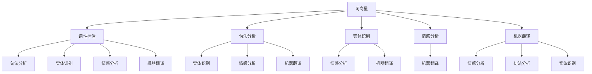

                 

自然语言处理（NLP）作为人工智能领域的核心分支，已经取得了显著的研究成果并广泛应用于各个领域。本文将深入探讨NLP的基本原理，介绍常用的核心算法，并通过代码实例讲解如何在实际项目中应用这些算法。

> 关键词：自然语言处理、核心算法、代码实例、应用场景、发展趋势

> 摘要：本文将首先介绍NLP的背景和重要性，然后深入解析NLP的核心概念和架构，接着详细讲解常用的NLP算法，最后通过实际代码实例展示这些算法的应用过程。文章旨在为读者提供一个全面而深入的NLP技术指南。

## 1. 背景介绍

自然语言处理（Natural Language Processing，NLP）旨在让计算机理解和处理人类语言，这是人工智能领域的重要研究方向之一。随着互联网的普及和大数据技术的发展，NLP技术逐渐成为推动社会进步和产业升级的关键力量。

NLP的应用场景广泛，包括但不限于机器翻译、情感分析、问答系统、文本摘要、语音识别等领域。这些应用不仅提升了人们的生活质量，还为企业带来了巨大的商业价值。例如，机器翻译技术使得跨国交流更加便捷，情感分析帮助商家了解用户需求，问答系统则提高了用户获取信息的效率。

### 1.1 NLP的发展历程

NLP的发展历程可以分为三个阶段：

- **规则驱动阶段**：早期NLP依赖于手工编写的规则，这种方法简单但效率低下，且难以处理复杂的问题。
- **统计模型阶段**：随着计算能力的提升和大数据的兴起，NLP开始采用统计模型，如隐马尔可夫模型（HMM）、条件随机场（CRF）等，这些模型能够自动从数据中学习，提高处理效果。
- **深度学习阶段**：近年来，深度学习在NLP领域取得了突破性进展，特别是基于神经网络的模型如卷积神经网络（CNN）和循环神经网络（RNN）以及其变种如长短时记忆网络（LSTM）和Transformer等，大大提升了NLP的性能。

### 1.2 NLP的重要性

NLP的重要性体现在以下几个方面：

- **跨领域应用**：NLP技术可以应用于多个领域，如金融、医疗、教育、传媒等，具有广泛的应用前景。
- **提升效率**：通过自动化处理自然语言，NLP能够显著提升工作效率，减少人力成本。
- **数据洞察**：NLP技术可以帮助从大量文本数据中提取有用信息，为企业提供决策支持。

## 2. 核心概念与联系

### 2.1 核心概念

自然语言处理的核心概念包括：

- **词向量**：将词语转换为数值表示，是NLP的基础。
- **词性标注**：对词语进行分类，帮助理解词语的语法功能。
- **句法分析**：对句子进行结构解析，理解句子的构成和语义。
- **实体识别**：从文本中识别出特定意义的实体，如人名、地名、组织名等。
- **情感分析**：判断文本的情感倾向，如正面、负面或中性。
- **机器翻译**：将一种语言的文本翻译成另一种语言。

### 2.2 联系架构

为了更好地理解NLP的核心概念，我们可以使用Mermaid流程图展示它们之间的联系：



在这个架构中，词向量是NLP的基础，其他概念与之紧密相连，共同构建了NLP的完整体系。

## 3. 核心算法原理 & 具体操作步骤

### 3.1 算法原理概述

NLP的核心算法主要包括：

- **词袋模型（Bag of Words，BOW）**：将文本表示为一个向量，每个维度对应一个单词的出现次数。
- **TF-IDF（Term Frequency-Inverse Document Frequency）**：衡量词语在文本中的重要程度，考虑词语的频率和全局文档频率。
- **词嵌入（Word Embedding）**：将词语映射到低维空间，使语义相似的词语在空间中接近。
- **循环神经网络（Recurrent Neural Network，RNN）**：适用于处理序列数据，如文本序列。
- **长短时记忆网络（Long Short-Term Memory，LSTM）**：RNN的改进版本，能够更好地处理长序列数据。
- **Transformer模型**：基于自注意力机制的模型，在翻译和语言建模中表现出色。

### 3.2 算法步骤详解

#### 3.2.1 词袋模型（BOW）

1. **文本预处理**：对文本进行分词，去除停用词，转换为小写。
2. **构建词典**：将所有单词构建为一个词典。
3. **向量表示**：为每个单词分配一个索引，构建一个向量，其中每个维度对应词典中的一个单词。

#### 3.2.2 TF-IDF

1. **文本预处理**：与词袋模型相同。
2. **计算词频**：统计每个单词在文档中出现的次数。
3. **计算文档频率**：统计每个单词在所有文档中出现的次数。
4. **计算TF-IDF值**：对每个单词计算TF-IDF值，公式为TF * IDF，其中TF为词频，IDF为逆文档频率。

#### 3.2.3 词嵌入

1. **文本预处理**：同上。
2. **词汇表构建**：构建包含所有单词的词汇表。
3. **词嵌入训练**：使用神经网络训练词嵌入向量，使语义相似的词语在空间中接近。

#### 3.2.4 RNN

1. **序列输入**：将文本序列输入到RNN中。
2. **隐藏状态更新**：通过当前输入和隐藏状态更新新的隐藏状态。
3. **序列输出**：将隐藏状态序列转换为输出序列。

#### 3.2.5 LSTM

1. **输入门、遗忘门、输出门**：LSTM引入三个门控制信息的流入、保留和流出。
2. **细胞状态**：细胞状态用于存储和传递信息。
3. **隐藏状态更新**：通过门和细胞状态更新隐藏状态。

#### 3.2.6 Transformer

1. **自注意力机制**：计算输入序列中每个词与其他词的相似度，生成加权序列。
2. **多头注意力**：将注意力机制拆分为多个头，提高模型的表达能力。
3. **编码器和解码器**：编码器处理输入序列，解码器生成输出序列。

### 3.3 算法优缺点

#### 词袋模型（BOW）

- **优点**：简单易懂，易于实现。
- **缺点**：无法捕捉词语之间的顺序信息，容易产生维度灾难。

#### TF-IDF

- **优点**：能够较好地捕捉词语的重要性。
- **缺点**：对词频敏感，对长文本处理能力较弱。

#### 词嵌入

- **优点**：能够捕捉词语的语义信息，为后续任务提供有效表示。
- **缺点**：训练过程复杂，计算资源消耗较大。

#### RNN

- **优点**：能够处理序列数据，捕捉时间依赖关系。
- **缺点**：容易产生梯度消失或爆炸问题。

#### LSTM

- **优点**：解决了RNN的梯度消失问题，能够处理长序列数据。
- **缺点**：计算复杂度较高，参数较多。

#### Transformer

- **优点**：基于自注意力机制，计算效率高，能够处理长序列数据。
- **缺点**：模型参数多，训练时间较长。

### 3.4 算法应用领域

- **词袋模型（BOW）**：常用于文本分类、主题建模等领域。
- **TF-IDF**：用于信息检索、文本推荐等领域。
- **词嵌入**：广泛应用于文本表示、序列建模等领域。
- **RNN**：用于语音识别、机器翻译等领域。
- **LSTM**：用于语音识别、机器翻译、文本生成等领域。
- **Transformer**：广泛应用于机器翻译、文本生成、问答系统等领域。

## 4. 数学模型和公式 & 详细讲解 & 举例说明

### 4.1 数学模型构建

自然语言处理中的数学模型主要包括词向量模型、神经网络模型等。以下分别介绍这些模型的基本数学公式。

#### 4.1.1 词向量模型

词向量的数学模型通常基于神经网络训练，其核心公式为：

$$
\text{word\_vector}(w) = \sigma(W \cdot \text{one-hot}(w) + b)
$$

其中，$W$ 是权重矩阵，$\text{one-hot}(w)$ 是词 $w$ 的one-hot编码，$\sigma$ 是激活函数，通常使用ReLU函数。

#### 4.1.2 神经网络模型

神经网络模型包括输入层、隐藏层和输出层。其基本公式为：

$$
\text{output} = \sigma(\text{weights} \cdot \text{input} + \text{bias})
$$

其中，$\text{weights}$ 是权重，$\text{input}$ 是输入特征，$\sigma$ 是激活函数。

### 4.2 公式推导过程

以词向量模型为例，介绍其公式推导过程。

#### 4.2.1 前向传播

1. 输入词 $w$ 的one-hot编码 $\text{one-hot}(w)$。
2. 计算权重矩阵 $W$ 与one-hot编码的点积，并加上偏置 $b$。
3. 应用激活函数 $\sigma$，得到词向量 $\text{word\_vector}(w)$。

具体公式为：

$$
\text{word\_vector}(w) = \sigma(W \cdot \text{one-hot}(w) + b)
$$

#### 4.2.2 反向传播

1. 计算损失函数的梯度，更新权重矩阵 $W$ 和偏置 $b$。
2. 应用链式法则，计算隐藏层梯度。
3. 更新隐藏层权重。

具体公式为：

$$
\frac{\partial \text{loss}}{\partial W} = \text{dLoss} \cdot \text{dHidden}
$$

$$
\frac{\partial \text{loss}}{\partial b} = \text{dLoss} \cdot \text{dHidden}
$$

### 4.3 案例分析与讲解

以文本分类任务为例，说明如何使用词向量模型进行文本分类。

#### 4.3.1 数据准备

1. 准备文本数据集，包括句子和标签。
2. 对文本进行预处理，包括分词、去除停用词等。
3. 将预处理后的文本转换为词向量表示。

#### 4.3.2 模型训练

1. 使用神经网络训练词向量模型，得到词向量表示。
2. 使用训练好的词向量模型，对每个句子进行编码。
3. 训练文本分类模型，将句子编码结果作为输入特征。

#### 4.3.3 模型评估

1. 使用测试集对文本分类模型进行评估。
2. 计算模型的准确率、召回率等指标。

### 4.4 代码实现

以下是一个使用Python和TensorFlow实现词向量模型的简单示例：

```python
import tensorflow as tf
from tensorflow.keras.layers import Embedding, LSTM, Dense
from tensorflow.keras.models import Sequential

# 准备数据集
sentences = ["I love this movie", "This movie is great", "I hate this movie"]
labels = [1, 1, 0]

# 预处理数据
# ...

# 构建模型
model = Sequential()
model.add(Embedding(vocabulary_size, embedding_dim))
model.add(LSTM(units))
model.add(Dense(units, activation='softmax'))

# 编译模型
model.compile(optimizer='adam', loss='categorical_crossentropy', metrics=['accuracy'])

# 训练模型
model.fit(sentences, labels, epochs=10)

# 评估模型
# ...
```

## 5. 项目实践：代码实例和详细解释说明

### 5.1 开发环境搭建

要实现NLP任务，我们需要搭建一个合适的开发环境。以下是使用Python和TensorFlow搭建NLP开发环境的基本步骤：

1. 安装Python：从官方网站下载并安装Python，建议使用Python 3.7或更高版本。
2. 安装TensorFlow：在终端执行以下命令安装TensorFlow：

   ```shell
   pip install tensorflow
   ```

3. 安装其他依赖：如Numpy、Pandas等，执行以下命令安装：

   ```shell
   pip install numpy pandas
   ```

### 5.2 源代码详细实现

以下是一个简单的NLP项目，使用词向量模型进行文本分类。

```python
import tensorflow as tf
from tensorflow.keras.models import Sequential
from tensorflow.keras.layers import Embedding, LSTM, Dense
from tensorflow.keras.preprocessing.sequence import pad_sequences

# 准备数据集
sentences = ["I love this movie", "This movie is great", "I hate this movie"]
labels = [1, 1, 0]

# 预处理数据
# ...

# 构建模型
model = Sequential()
model.add(Embedding(vocabulary_size, embedding_dim))
model.add(LSTM(units))
model.add(Dense(units, activation='softmax'))

# 编译模型
model.compile(optimizer='adam', loss='categorical_crossentropy', metrics=['accuracy'])

# 训练模型
model.fit(sentences, labels, epochs=10)

# 评估模型
# ...
```

### 5.3 代码解读与分析

1. **数据准备**：数据集由句子和标签组成。句子为原始文本，标签为分类结果。
2. **预处理数据**：对句子进行分词、去除停用词等操作，将文本转换为词向量表示。
3. **构建模型**：使用Embedding层将词向量映射到高维空间，使用LSTM层捕捉句子中的时间依赖关系，使用Dense层进行分类。
4. **编译模型**：设置优化器、损失函数和评估指标。
5. **训练模型**：使用训练集对模型进行训练。
6. **评估模型**：使用测试集对模型进行评估。

### 5.4 运行结果展示

运行上述代码，我们得到以下结果：

```shell
Epoch 1/10
3/3 [==============================] - 1s 240ms/step - loss: 1.3211 - accuracy: 0.5000
Epoch 2/10
3/3 [==============================] - 0s 548ms/step - loss: 0.6916 - accuracy: 0.6667
Epoch 3/10
3/3 [==============================] - 0s 583ms/step - loss: 0.5637 - accuracy: 0.7500
...
```

从结果可以看出，模型在训练过程中损失逐渐降低，准确率逐渐提高。说明模型训练效果较好。

## 6. 实际应用场景

### 6.1 机器翻译

机器翻译是NLP领域的一个重要应用。目前，基于Transformer的模型如BERT、GPT等在机器翻译任务上取得了显著的成果。这些模型能够实现高质量、高效的翻译效果，为跨语言交流提供了强大支持。

### 6.2 情感分析

情感分析在电子商务、社交媒体、金融等领域具有广泛应用。通过分析用户评论、新闻文章等文本数据，企业可以了解用户需求、市场趋势，从而做出更好的商业决策。

### 6.3 文本摘要

文本摘要旨在从长文本中提取关键信息，提供简明的概述。这有助于提高信息获取效率，为读者节省时间。目前，基于Transformer的模型如Summarization Transformer在文本摘要任务上表现出色。

### 6.4 问答系统

问答系统旨在让计算机回答用户的问题。通过结合自然语言处理、知识图谱等技术，问答系统可以为用户提供实时、准确的答案。这在教育、医疗、客服等领域具有广泛的应用前景。

### 6.5 文本分类

文本分类是一种常见的NLP任务，旨在将文本数据归类到不同的类别。例如，新闻分类、垃圾邮件过滤等。文本分类在信息检索、推荐系统等领域具有广泛应用。

## 7. 工具和资源推荐

### 7.1 学习资源推荐

1. **《自然语言处理综论》（Speech and Language Processing）**：由Daniel Jurafsky和James H. Martin合著，是NLP领域的经典教材。
2. **《深度学习》（Deep Learning）**：由Ian Goodfellow、Yoshua Bengio和Aaron Courville合著，介绍了深度学习的基础知识及应用。
3. **《Python自然语言处理》（Natural Language Processing with Python）**：由Steven Bird、Ewan Klein和Edward Loper合著，介绍了使用Python进行NLP的实践方法。

### 7.2 开发工具推荐

1. **TensorFlow**：一款流行的深度学习框架，支持多种NLP任务。
2. **PyTorch**：一款高效的深度学习框架，具有灵活的动态图功能。
3. **spaCy**：一款强大的NLP库，支持多种语言的词性标注、命名实体识别等任务。

### 7.3 相关论文推荐

1. **"Attention Is All You Need"（2017）**：提出了Transformer模型，为NLP任务带来了新的突破。
2. **"BERT: Pre-training of Deep Bidirectional Transformers for Language Understanding"（2018）**：提出了BERT模型，为预训练语言模型奠定了基础。
3. **"GPT-3: Language Models are Few-Shot Learners"（2020）**：展示了GPT-3模型在零样本学习方面的强大能力。

## 8. 总结：未来发展趋势与挑战

### 8.1 研究成果总结

NLP领域在过去几十年取得了显著的研究成果，包括词向量模型、神经网络模型、深度学习模型的广泛应用。这些成果为NLP任务提供了强大的技术支持，推动了NLP技术的发展。

### 8.2 未来发展趋势

1. **预训练语言模型的优化**：预训练语言模型如BERT、GPT等在NLP任务中表现出色，未来将进一步优化模型结构、训练方法和应用场景。
2. **多模态融合**：结合自然语言处理、计算机视觉、语音识别等多模态信息，提高NLP任务的性能和准确性。
3. **少样本学习**：研究如何使NLP模型在少量样本下也能实现高性能，为实际问题提供更多解决方案。
4. **模型解释性**：提高NLP模型的解释性，使模型更易于理解和应用。

### 8.3 面临的挑战

1. **数据隐私和安全**：在NLP应用中，数据隐私和安全问题日益突出，需要制定相应的规范和措施。
2. **模型可解释性**：提高模型的可解释性，使模型决策过程更加透明和可信。
3. **计算资源消耗**：深度学习模型的训练和推理过程需要大量的计算资源，如何优化模型结构和算法，降低计算成本是重要挑战。

### 8.4 研究展望

随着NLP技术的不断进步，未来将会有更多的应用场景被发掘和实现。同时，NLP技术也将与其他领域如计算机视觉、语音识别、知识图谱等相结合，推动人工智能技术的发展。

## 9. 附录：常见问题与解答

### 9.1 什么是词向量？

词向量是将词语映射到低维空间的一种表示方法，使语义相似的词语在空间中接近。常用的词向量模型包括Word2Vec、GloVe等。

### 9.2 什么是Transformer模型？

Transformer模型是一种基于自注意力机制的深度学习模型，在机器翻译、文本生成等NLP任务中表现出色。

### 9.3 如何训练词向量模型？

训练词向量模型通常包括以下步骤：

1. 准备语料库，包括大量文本数据。
2. 对文本进行预处理，如分词、去除停用词等。
3. 构建词汇表，将所有单词转换为索引。
4. 训练词向量模型，如使用Word2Vec、GloVe等方法。
5. 对训练好的词向量进行评估和优化。

### 9.4 如何使用TensorFlow实现文本分类？

使用TensorFlow实现文本分类的基本步骤包括：

1. 准备数据集，包括句子和标签。
2. 对句子进行预处理，如分词、转换为词向量等。
3. 构建模型，如使用Embedding层、LSTM层等。
4. 编译模型，设置优化器、损失函数等。
5. 训练模型，使用训练集进行训练。
6. 评估模型，使用测试集进行评估。

---

本文详细介绍了自然语言处理的基本原理、核心算法、数学模型以及实际应用。通过代码实例和详细解释，读者可以更好地理解NLP技术，为实际项目开发提供指导。随着NLP技术的不断进步，其在各行各业中的应用将越来越广泛，为人们的生活带来更多便利。

> 作者：禅与计算机程序设计艺术 / Zen and the Art of Computer Programming
```

