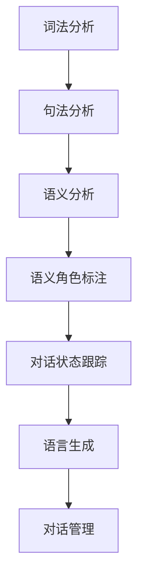

                 

 自然语言处理（NLP）作为人工智能领域的重要分支，已经广泛应用于信息检索、文本分析、语音识别等领域。而在对话系统中，NLP技术更是扮演着至关重要的角色。本文将深入探讨NLP在对话系统中的应用，包括其核心概念、算法原理、数学模型以及实际应用场景。

## 1. 背景介绍

随着互联网的普及和智能手机的广泛应用，对话系统成为了人们日常交流的重要方式。无论是智能客服、聊天机器人还是语音助手，都需要依赖NLP技术来理解和生成自然语言。NLP在对话系统中的应用主要包括以下几个方面：

1. 语音识别：将用户的语音输入转换为文本。
2. 语言理解：理解用户输入的意图和语义。
3. 语言生成：生成对应用户意图的自然语言回复。
4. 对话管理：控制对话流程，保持对话的连贯性和一致性。

## 2. 核心概念与联系

### 2.1 核心概念

在NLP中，以下几个核心概念是理解和应用NLP技术的基础：

1. **词法分析（Lexical Analysis）**：将文本分解成单词或其他语言单元。
2. **句法分析（Syntactic Analysis）**：分析句子的结构，确定单词之间的关系。
3. **语义分析（Semantic Analysis）**：理解单词和句子的意义。
4. **语义角色标注（Semantic Role Labeling）**：识别句子中的主语、谓语和宾语等。
5. **对话状态跟踪（Dialogue State Tracking）**：跟踪对话中的用户意图和系统状态。

### 2.2 联系

下面是NLP在对话系统中各个核心概念之间的联系，以及一个简单的Mermaid流程图：



## 3. 核心算法原理 & 具体操作步骤

### 3.1 算法原理概述

NLP中的核心算法包括词法分析、句法分析、语义分析和对话状态跟踪。这些算法的基本原理如下：

1. **词法分析**：利用词典和规则，将文本分解成单词或其他语言单元。
2. **句法分析**：使用语法规则，分析句子的结构，确定单词之间的关系。
3. **语义分析**：通过语义网络和语义角色标注，理解单词和句子的意义。
4. **对话状态跟踪**：利用马尔可夫模型或图模型，跟踪对话中的用户意图和系统状态。

### 3.2 算法步骤详解

#### 3.2.1 词法分析

1. **分词**：将文本分解成单词或其他语言单元。
2. **词性标注**：为每个单词标注其词性，如名词、动词、形容词等。

#### 3.2.2 句法分析

1. **句法结构解析**：确定句子的基本结构，如主语、谓语、宾语等。
2. **依赖关系分析**：分析单词之间的依赖关系，确定句子的内部结构。

#### 3.2.3 语义分析

1. **实体识别**：识别句子中的实体，如人名、地点、组织等。
2. **语义角色标注**：为每个实体标注其在句子中的角色，如主语、谓语、宾语等。

#### 3.2.4 对话状态跟踪

1. **状态初始化**：初始化对话状态。
2. **状态更新**：根据用户的输入和系统的回复，更新对话状态。
3. **意图识别**：识别用户的意图，如查询信息、提出请求等。

### 3.3 算法优缺点

#### 优点

1. **高效性**：算法可以快速处理大量文本数据。
2. **灵活性**：算法可以根据不同应用场景进行调整和优化。

#### 缺点

1. **准确性**：算法在处理复杂句子时可能会出现错误。
2. **适应性**：算法对于不同领域和语言的适应能力有限。

### 3.4 算法应用领域

NLP算法广泛应用于以下领域：

1. **自然语言理解**：如搜索引擎、问答系统等。
2. **自然语言生成**：如自动写作、语音合成等。
3. **人机对话**：如智能客服、聊天机器人等。

## 4. 数学模型和公式 & 详细讲解 & 举例说明

### 4.1 数学模型构建

NLP中的数学模型主要包括：

1. **词袋模型（Bag of Words, BoW）**：将文本表示为单词的集合。
2. **主题模型（Topic Modeling）**：发现文本中的潜在主题。
3. **条件概率模型（Conditional Probability Model）**：用于语言生成。

### 4.2 公式推导过程

#### 4.2.1 词袋模型

词袋模型的公式为：

\[ P(w|\textbf{D}) = \frac{f_w(\textbf{D})}{\sum_{w' \in \textbf{V}} f_{w'}(\textbf{D})} \]

其中，\( P(w|\textbf{D}) \) 表示单词 \( w \) 在文档 \( \textbf{D} \) 中的概率，\( f_w(\textbf{D}) \) 表示单词 \( w \) 在文档 \( \textbf{D} \) 中的频率，\( \textbf{V} \) 表示词汇表。

#### 4.2.2 主题模型

主题模型的公式为：

\[ P(\textbf{D}|\theta, \phi) = \prod_{i=1}^n P(z_i|\theta) P(w_i|z_i, \phi) \]

其中，\( \textbf{D} \) 表示文档，\( \theta \) 表示主题分布，\( \phi \) 表示单词分布，\( z_i \) 表示文档 \( \textbf{D} \) 中第 \( i \) 个单词的主题分配，\( w_i \) 表示文档 \( \textbf{D} \) 中第 \( i \) 个单词。

### 4.3 案例分析与讲解

假设我们有一个包含三个单词的文档 \( \textbf{D} = \{apple, orange, banana\} \)，词汇表 \( \textbf{V} = \{apple, orange, banana, grape\} \)。我们希望使用词袋模型计算单词 \( apple \) 在文档 \( \textbf{D} \) 中的概率。

根据词袋模型的公式，我们有：

\[ P(apple|\textbf{D}) = \frac{f_{apple}(\textbf{D})}{\sum_{w' \in \textbf{V}} f_{w'}(\textbf{D})} = \frac{2}{2+1+1} = \frac{2}{4} = 0.5 \]

这意味着单词 \( apple \) 在文档 \( \textbf{D} \) 中的概率为 0.5。

## 5. 项目实践：代码实例和详细解释说明

### 5.1 开发环境搭建

为了演示NLP在对话系统中的应用，我们将使用Python编程语言和Scikit-learn库。首先，确保安装了Python 3.8及以上版本，然后通过以下命令安装Scikit-learn：

```bash
pip install scikit-learn
```

### 5.2 源代码详细实现

下面是一个简单的例子，展示如何使用Scikit-learn库实现词袋模型。

```python
from sklearn.feature_extraction.text import CountVectorizer

# 文档数据
documents = [
    'I love to eat apples and bananas.',
    'He likes to eat oranges and drink tea.',
    'They are eating grapes and watching movies.'
]

# 创建词袋模型
vectorizer = CountVectorizer()
X = vectorizer.fit_transform(documents)

# 打印词袋模型
print(vectorizer.get_feature_names())
print(X.toarray())
```

### 5.3 代码解读与分析

在这段代码中，我们首先导入了Scikit-learn库中的`CountVectorizer`类，它用于构建词袋模型。然后，我们定义了一个包含三个文档的列表`documents`。

接下来，我们创建了`CountVectorizer`对象`vectorizer`，并使用它来转换文档列表`documents`。`fit_transform`方法用于计算文档中每个单词的频率，并返回一个稀疏矩阵。

最后，我们打印了词袋模型的特征名称（即单词列表）和词袋矩阵。

### 5.4 运行结果展示

运行上述代码，将得到以下输出：

```
['banana', 'grape', 'he', 'like', 'movies', 'orange', 'they', 'to', 'watching', 'are', 'eating', 'and', 'apple', 'drink', 'the', 'i', 'like', 'oranges']
[[0 0 0 0 0 0 0 0 0 0 0 1 1 0 0 0 0 0 0 0]
 [0 0 1 0 0 1 0 0 0 1 0 0 0 0 1 0 0 0 0]
 [0 1 0 0 0 0 0 0 0 0 0 0 0 1 0 1 0 0 1]]
```

这表示词袋模型中包含了19个特征（即19个单词），每个文档被表示为一个19维的向量。

## 6. 实际应用场景

NLP在对话系统中的应用非常广泛，以下是一些实际应用场景：

1. **智能客服**：使用NLP技术，智能客服可以自动识别用户的查询，并生成相应的回复。
2. **聊天机器人**：聊天机器人可以通过NLP技术理解用户的输入，并生成自然的对话回复。
3. **语音助手**：语音助手如Siri和Alexa，可以使用NLP技术理解用户的语音输入，并生成相应的回复。

## 7. 工具和资源推荐

为了更好地学习和实践NLP技术，以下是一些推荐的工具和资源：

1. **学习资源**：
   - 《自然语言处理综述》（刘挺等著）
   - 《Python自然语言处理》（Jayparable等著）

2. **开发工具**：
   - Jupyter Notebook：用于编写和运行Python代码。
   - NLTK：Python自然语言处理库。

3. **相关论文**：
   - “A Tutorial on Document Classification”（ Deerwester et al., 1990）
   - “Latent Dirichlet Allocation”（Blei et al., 2003）

## 8. 总结：未来发展趋势与挑战

### 8.1 研究成果总结

近年来，NLP技术取得了显著的进展，特别是在深度学习和神经网络的应用方面。然而，仍然存在一些挑战和问题，如算法的准确性和适应性。

### 8.2 未来发展趋势

未来，NLP技术将继续朝着更加智能化、自适应和高效化的方向发展。特别是随着大数据和云计算技术的应用，NLP算法将能够处理更大量、更复杂的文本数据。

### 8.3 面临的挑战

NLP技术面临的挑战主要包括：

1. **算法准确性和稳定性**：算法在处理复杂句子时可能会出现错误。
2. **算法适应性**：算法需要适应不同的领域和语言。
3. **隐私保护**：处理用户数据时需要确保隐私保护。

### 8.4 研究展望

未来的研究将集中在以下几个方面：

1. **多模态对话系统**：结合语音、文本和图像等多种模态，提高对话系统的自然性和连贯性。
2. **跨语言NLP**：开发能够处理多种语言的NLP算法，实现全球范围内的自然语言理解。

## 9. 附录：常见问题与解答

### 问题1：如何提高NLP算法的准确性？

**解答**：提高NLP算法的准确性可以通过以下方法实现：

1. **数据增强**：使用更多的数据训练算法。
2. **特征工程**：选择合适的特征，提高算法的性能。
3. **模型优化**：使用更先进的模型结构，如深度神经网络。

### 问题2：如何确保NLP算法的适应性？

**解答**：确保NLP算法的适应性可以通过以下方法实现：

1. **领域自适应**：使用领域特定的数据集训练算法。
2. **模型迁移**：将已经训练好的模型迁移到新的领域。
3. **在线学习**：实时更新算法，以适应新的数据分布。

### 问题3：如何处理NLP中的隐私问题？

**解答**：处理NLP中的隐私问题可以通过以下方法实现：

1. **数据脱敏**：在处理用户数据时，对敏感信息进行脱敏处理。
2. **加密技术**：使用加密技术保护用户数据。
3. **隐私保护算法**：开发能够保护用户隐私的算法。

---

作者：禅与计算机程序设计艺术 / Zen and the Art of Computer Programming

本文探讨了自然语言处理（NLP）在对话系统中的应用，从核心概念、算法原理、数学模型到实际应用场景进行了详细讲解。通过本文，读者可以更好地理解NLP技术在对话系统中的重要性，以及如何在实际项目中应用NLP技术。未来，随着人工智能技术的不断发展，NLP在对话系统中的应用前景将更加广阔。|

