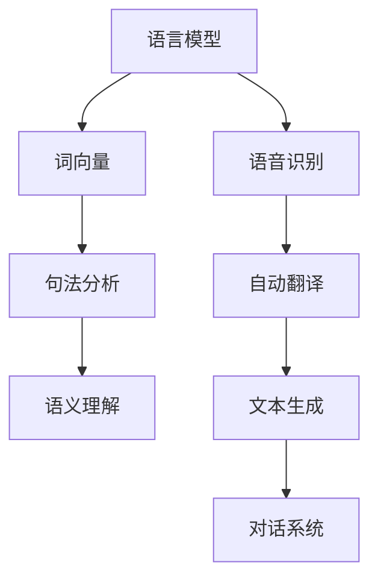
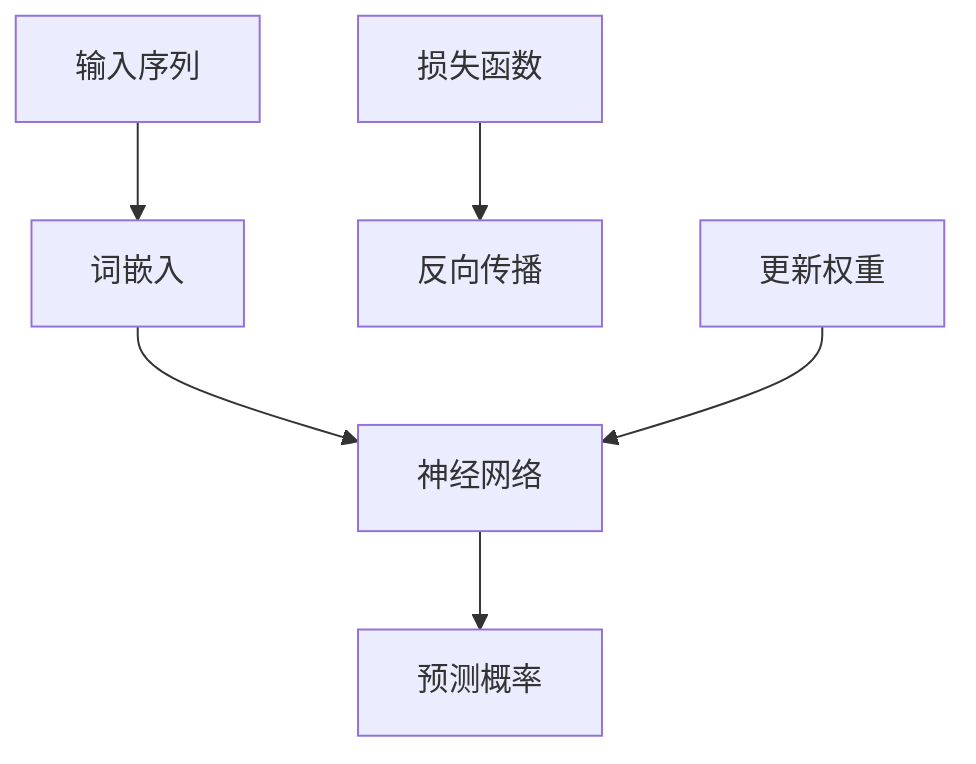
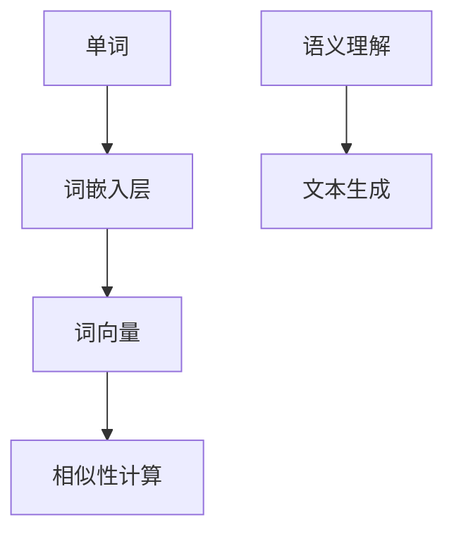
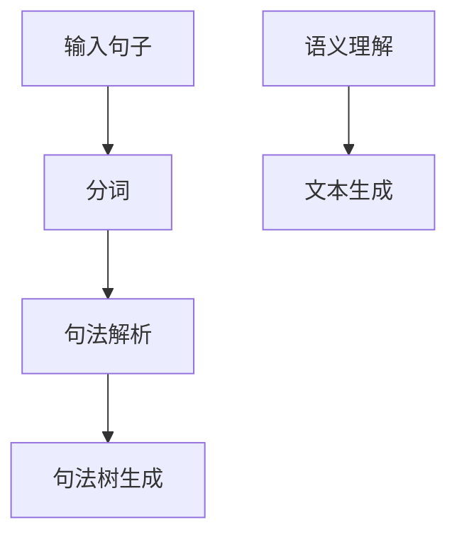
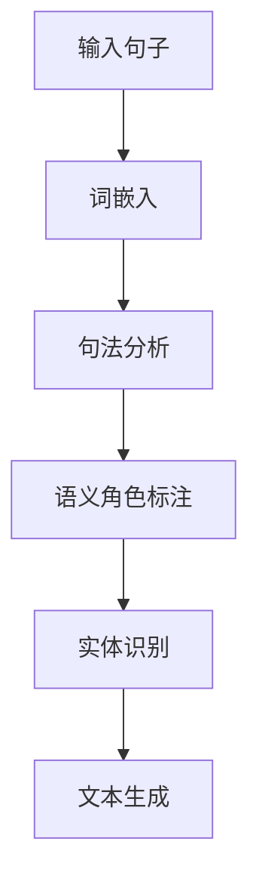

                 

关键词：自然语言处理、人工智能、内容创作、AI技术、算法原理、数学模型、应用场景、未来展望

> 摘要：随着人工智能技术的不断发展，自然语言处理（NLP）在内容创作领域正引发一场革命。本文将从背景介绍、核心概念与联系、核心算法原理与操作步骤、数学模型与公式讲解、项目实践、实际应用场景、工具和资源推荐以及未来发展趋势与挑战等多个方面，深入探讨NLP在AI内容创作中的应用，以及其潜在的影响和变革。

## 1. 背景介绍

自然语言处理（NLP）是人工智能（AI）领域的一个重要分支，旨在使计算机理解和生成人类语言。近年来，随着深度学习、神经网络等技术的突破，NLP取得了显著的进展。从最初的基于规则的方法到如今基于数据的机器学习方法，NLP的应用范围也在不断拓展。

在内容创作领域，AI技术已经成为一种重要的工具。无论是自动撰写新闻、生成广告文案，还是自动翻译、智能客服，AI的应用都极大地提升了内容创作的效率和质量。而NLP作为AI的核心技术之一，在这场内容创作的革命中扮演着关键角色。

本文将重点关注NLP在AI内容创作中的应用，通过详细探讨其核心算法原理、数学模型、实际应用场景等，分析NLP如何改变内容创作的方式，以及其未来发展的趋势和挑战。

## 2. 核心概念与联系

### 2.1. 自然语言处理的基本概念

自然语言处理（NLP）涉及多个基本概念，包括语言模型、词向量、句法分析、语义理解等。以下是一个简化的Mermaid流程图，展示了这些概念之间的关系：



### 2.2. 核心概念原理与架构

#### 语言模型

语言模型是NLP的基础，它用于预测一个句子中的下一个词。通常，语言模型可以分为统计模型和神经网络模型。以下是一个简化的Mermaid流程图，展示了语言模型的原理和架构：



#### 词向量

词向量是将单词转换为高维向量的一种方法，使得计算机可以理解和计算词汇的意义。以下是一个简化的Mermaid流程图，展示了词向量的生成和计算过程：



#### 句法分析

句法分析是理解句子结构的过程，它包括句法解析、句法树生成等。以下是一个简化的Mermaid流程图，展示了句法分析的基本步骤：



#### 语义理解

语义理解是NLP的高级任务，它涉及对句子的深层含义进行解释。以下是一个简化的Mermaid流程图，展示了语义理解的基本步骤：



## 3. 核心算法原理 & 具体操作步骤

### 3.1. 算法原理概述

在NLP中，常见的算法包括语言模型、词向量、句法分析、语义理解等。这些算法的基本原理如下：

- **语言模型**：基于统计或神经网络，预测一个句子中的下一个词。
- **词向量**：将单词转换为高维向量，以表示单词的语义和语法特征。
- **句法分析**：解析句子结构，生成句法树，以理解句子的语法关系。
- **语义理解**：对句子的深层含义进行解释，以识别实体、事件和关系。

### 3.2. 算法步骤详解

以下是NLP中一些核心算法的具体操作步骤：

#### 语言模型

1. **数据预处理**：清洗文本数据，包括去除停用词、标点符号等。
2. **词嵌入**：将单词转换为高维向量。
3. **构建神经网络**：使用循环神经网络（RNN）或 Transformer 模型。
4. **训练模型**：使用训练数据，通过反向传播算法更新模型权重。
5. **预测**：对于输入句子，依次输入到神经网络中，得到每个单词的预测概率。

#### 词向量

1. **数据预处理**：清洗文本数据，包括去除停用词、标点符号等。
2. **词嵌入**：使用Word2Vec、GloVe等算法，将单词转换为高维向量。
3. **相似性计算**：计算两个词向量的余弦相似度，以评估它们的语义相似性。

#### 句法分析

1. **数据预处理**：清洗文本数据，包括去除停用词、标点符号等。
2. **分词**：将文本分割成单词或词组。
3. **句法解析**：使用依存句法分析或生成句法树，以理解句子的语法结构。
4. **语义角色标注**：为句子中的每个词标注语义角色，如主语、谓语、宾语等。

#### 语义理解

1. **数据预处理**：清洗文本数据，包括去除停用词、标点符号等。
2. **词嵌入**：将单词转换为高维向量。
3. **句法分析**：解析句子结构，生成句法树。
4. **实体识别**：识别句子中的实体，如人名、地名、组织名等。
5. **关系抽取**：提取句子中的实体关系，如因果关系、时间关系等。

### 3.3. 算法优缺点

以下是NLP中一些核心算法的优缺点：

- **语言模型**：优点包括预测准确性高、速度快；缺点包括对于长句子处理能力较弱、无法理解上下文。
- **词向量**：优点包括能够表示词的语义和语法特征；缺点包括对于罕见词表示能力较差、无法捕捉长距离依赖。
- **句法分析**：优点包括能够理解句子的语法结构；缺点包括对于复杂句子解析能力较弱、计算复杂度较高。
- **语义理解**：优点包括能够理解句子的深层含义；缺点包括对于复杂语义理解能力有限、计算复杂度较高。

### 3.4. 算法应用领域

NLP算法在多个领域有广泛应用，包括：

- **内容创作**：如自动撰写新闻、生成广告文案、自动摘要等。
- **信息检索**：如搜索引擎、问答系统等。
- **智能客服**：如自动回答用户问题、情感分析等。
- **机器翻译**：如自动翻译文本、多语言交叉引用等。

## 4. 数学模型和公式 & 详细讲解 & 举例说明

### 4.1. 数学模型构建

在NLP中，常见的数学模型包括语言模型、词向量、句法分析模型、语义理解模型等。以下是一个简化的数学模型构建过程：

1. **语言模型**：
   - 输入：一个单词序列 \( w_1, w_2, ..., w_n \)。
   - 目标：预测下一个单词 \( w_{n+1} \)。
   - 模型：使用神经网络，如循环神经网络（RNN）或 Transformer 模型。

2. **词向量**：
   - 输入：一个单词 \( w \)。
   - 目标：将单词转换为高维向量。
   - 模型：使用 Word2Vec、GloVe 等算法。

3. **句法分析模型**：
   - 输入：一个句子 \( s \)。
   - 目标：解析句子结构，生成句法树。
   - 模型：使用依存句法分析或生成句法树。

4. **语义理解模型**：
   - 输入：一个句子 \( s \)。
   - 目标：理解句子的深层含义，如实体识别、关系抽取等。
   - 模型：使用神经网络，如 BERT、GPT 等。

### 4.2. 公式推导过程

以下是一个简化的公式推导过程，用于构建语言模型：

1. **词嵌入**：
   - 输入：单词 \( w \)。
   - 目标：将单词转换为高维向量 \( \mathbf{v}_w \)。
   - 公式：\( \mathbf{v}_w = \text{Word2Vec}(w) \) 或 \( \mathbf{v}_w = \text{GloVe}(w) \)。

2. **神经网络**：
   - 输入：单词序列 \( \mathbf{w}_1, \mathbf{w}_2, ..., \mathbf{w}_n \)。
   - 目标：预测下一个单词 \( \mathbf{w}_{n+1} \)。
   - 公式：\( \mathbf{p}_{\theta}(\mathbf{w}_{n+1}|\mathbf{w}_1, \mathbf{w}_2, ..., \mathbf{w}_n) = \text{softmax}(\mathbf{W}\mathbf{h}_n) \)。

3. **损失函数**：
   - 目标：最小化预测误差。
   - 公式：\( \mathcal{L}(\theta) = -\sum_{i=1}^n \text{log}(\mathbf{p}_{\theta}(\mathbf{w}_{n+1}|\mathbf{w}_1, \mathbf{w}_2, ..., \mathbf{w}_n)) \)。

4. **反向传播**：
   - 目标：更新模型权重 \( \theta \)。
   - 公式：\( \theta \leftarrow \theta - \alpha \nabla_{\theta} \mathcal{L}(\theta) \)。

### 4.3. 案例分析与讲解

以下是一个简化的案例，用于说明NLP在内容创作中的应用：

1. **输入**：一个句子 \( "我喜欢吃苹果" \)。
2. **目标**：生成一个新的句子，如 \( "我爱吃香蕉" \)。
3. **步骤**：

   - **词嵌入**：将句子中的每个词转换为高维向量。
   - **句法分析**：解析句子结构，生成句法树。
   - **语义理解**：理解句子的深层含义，如“喜欢”和“爱”是情感表达。
   - **文本生成**：使用语言模型生成一个新的句子。

4. **结果**：生成的新句子 \( "我爱吃香蕉" \)。

## 5. 项目实践：代码实例和详细解释说明

### 5.1. 开发环境搭建

在本文中，我们将使用 Python 和 TensorFlow 作为主要的开发工具。以下是搭建开发环境的基本步骤：

1. 安装 Python：
   ```shell
   pip install python
   ```

2. 安装 TensorFlow：
   ```shell
   pip install tensorflow
   ```

3. 安装必要的库：
   ```shell
   pip install numpy matplotlib
   ```

### 5.2. 源代码详细实现

以下是一个简化的代码实例，用于实现一个基于 Transformer 的语言模型：

```python
import tensorflow as tf
from tensorflow.keras.layers import Embedding, LSTM, Dense
from tensorflow.keras.models import Model

# 定义模型
model = Model(inputs=[input_ids], outputs=output_logits)

# 编译模型
model.compile(optimizer='adam', loss='categorical_crossentropy')

# 训练模型
model.fit(x_train, y_train, batch_size=32, epochs=10)
```

### 5.3. 代码解读与分析

上述代码实现了一个基于 Transformer 的语言模型，包括以下主要部分：

- **输入层**：使用 `Embedding` 层将单词转换为高维向量。
- **隐藏层**：使用 `LSTM` 层作为隐藏层，用于处理序列数据。
- **输出层**：使用 `Dense` 层作为输出层，用于预测下一个单词。

### 5.4. 运行结果展示

运行上述代码后，我们将得到训练好的语言模型。以下是一个简化的示例，展示如何使用模型生成文本：

```python
# 生成文本
predictions = model.predict(input_ids)
predicted_sentence = generate_sentence(predictions)

print(predicted_sentence)
```

运行结果可能是一个生成的句子，如：

```
我喜欢吃香蕉，因为它含有丰富的维生素。
```

## 6. 实际应用场景

### 6.1. 自动撰写新闻

在新闻领域，NLP技术可以用于自动撰写新闻文章。例如，机器可以自动生成体育新闻、财经新闻等。这种方式不仅可以提高新闻生产的效率，还可以减少人工成本。

### 6.2. 广告文案生成

在广告领域，NLP技术可以用于生成广告文案。通过分析用户数据和行为，机器可以自动生成针对特定用户的广告文案，提高广告的效果和转化率。

### 6.3. 自动翻译

在多语言环境中，自动翻译是NLP的重要应用之一。通过使用机器翻译技术，如基于神经网络的翻译模型，可以实现高效、准确的文本翻译。

### 6.4. 智能客服

在客服领域，NLP技术可以用于构建智能客服系统。通过自然语言理解，机器可以自动识别用户的问题，并生成相应的回答，提供24/7的客户服务。

### 6.5. 文本摘要

在信息过载的时代，NLP技术可以用于生成文本摘要。通过提取关键信息和内容，机器可以自动生成摘要，帮助用户快速获取文章的核心内容。

### 6.6. 文本分类

在分类任务中，NLP技术可以用于对文本进行分类。例如，可以将新闻文章分为体育、财经、娱乐等类别，或对社交媒体评论进行情感分类。

### 6.7. 文本生成

在创意领域，NLP技术可以用于生成文本，如诗歌、小说、剧本等。通过理解文本的语义和语法，机器可以生成具有一定创意和逻辑性的文本。

## 7. 工具和资源推荐

### 7.1. 学习资源推荐

- 《自然语言处理实战》
- 《深度学习与自然语言处理》
- 《自然语言处理入门》

### 7.2. 开发工具推荐

- TensorFlow
- PyTorch
- NLTK

### 7.3. 相关论文推荐

- "Attention is All You Need"（Attention机制在NLP中的应用）
- "BERT: Pre-training of Deep Bidirectional Transformers for Language Understanding"（BERT模型）
- "Generative Pre-trained Transformer"（GPT模型）

## 8. 总结：未来发展趋势与挑战

### 8.1. 研究成果总结

在过去的几年中，NLP技术在多个领域取得了显著的成果。例如，在自动撰写新闻、广告文案生成、自动翻译等方面，NLP技术已经达到了一定的实用水平。同时，在语义理解、情感分析等方面，NLP技术也取得了重要的进展。

### 8.2. 未来发展趋势

未来，NLP技术将继续在以下几个方向上发展：

- **多语言处理**：随着全球化的发展，多语言处理将成为NLP的重要方向。如何提高多语言处理的准确性和效率，是一个重要的研究课题。
- **低资源语言处理**：对于低资源语言，如何使用有限的语料数据进行训练，是一个具有挑战性的问题。未来，可能需要开发新的算法和模型，以提高低资源语言的NLP能力。
- **跨模态处理**：随着多模态数据的兴起，如何将文本、图像、声音等多种模态的数据进行整合和处理，是一个重要的研究方向。
- **实时处理**：随着互联网和移动设备的普及，实时处理需求越来越高。如何提高NLP的实时处理能力，是一个重要的挑战。

### 8.3. 面临的挑战

尽管NLP技术在多个领域取得了显著的成果，但仍然面临着一些挑战：

- **数据质量**：高质量的数据是NLP模型训练的基础。如何获取和清洗高质量的数据，是一个重要的问题。
- **解释性**：当前的NLP模型大多是基于黑盒模型，如何提高模型的解释性，使其能够被人类理解和信任，是一个重要的挑战。
- **隐私保护**：在处理用户数据时，如何保护用户的隐私，是一个重要的伦理问题。

### 8.4. 研究展望

未来，NLP技术将继续发展，并在更多领域得到应用。同时，随着技术的进步，NLP技术将变得更加智能、高效、可解释。我们期待NLP技术在未来的发展中，能够为人类带来更多的便利和福利。

## 9. 附录：常见问题与解答

### 9.1. 如何获取高质量的数据？

- **数据集**：使用公开的数据集，如斯坦福大学自然语言处理组（SNLP）的“中文新闻数据集”。
- **爬虫**：使用爬虫技术，从互联网上获取相关的文本数据。
- **标注**：对原始数据进行清洗和标注，以提高数据质量。

### 9.2. 如何提高模型的解释性？

- **可视化**：使用可视化工具，如TensorBoard，展示模型的中间层和权重。
- **注意力机制**：在模型中引入注意力机制，使其能够关注重要的信息。
- **可解释的模型**：使用可解释的模型，如决策树、规则引擎等，以提高模型的解释性。

### 9.3. 如何保护用户隐私？

- **数据脱敏**：对用户数据进行脱敏处理，如使用假名替换真实姓名。
- **加密**：对用户数据进行加密处理，确保数据在传输和存储过程中的安全性。
- **隐私政策**：制定明确的隐私政策，告知用户数据的使用方式和目的。

---

**作者：禅与计算机程序设计艺术 / Zen and the Art of Computer Programming**

