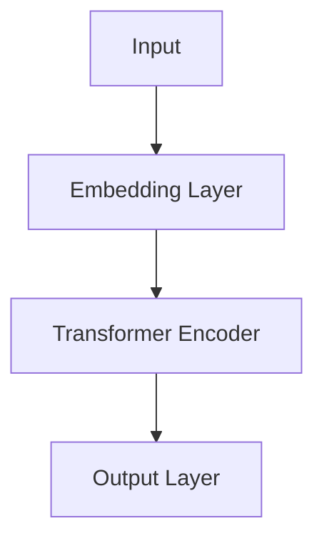
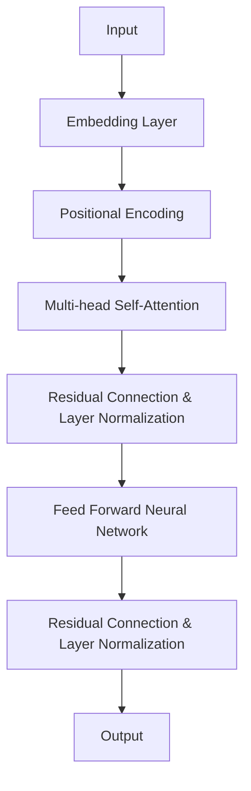

                 

关键词：自然语言处理、上下文、语境、深度学习、预训练模型、BERT、Transformer、语言模型、文本生成、文本分类、对话系统、多模态交互

摘要：自然语言处理（NLP）作为人工智能的重要分支，近年来取得了飞速发展。理解上下文和语境是NLP的核心问题，直接关系到文本的准确理解和生成。本文将深入探讨自然语言处理的新前沿，包括预训练模型BERT和Transformer的工作原理，以及它们在理解上下文和语境方面的应用。此外，还将探讨当前存在的问题和未来的发展趋势。

## 1. 背景介绍

自然语言处理（NLP）是人工智能的重要分支，旨在使计算机能够理解、生成和处理人类语言。随着深度学习和大数据技术的发展，NLP取得了显著的进展。然而，理解上下文和语境仍然是一个巨大的挑战。上下文是指一个词或句子在特定情境下的意义，而语境则是指影响语言理解的各种环境因素，包括时间、地点、文化背景等。

在传统的NLP任务中，如文本分类、信息抽取、机器翻译等，模型往往只能基于静态的词向量进行操作，无法很好地捕捉上下文和语境的信息。而随着预训练模型BERT和Transformer的出现，NLP在理解上下文和语境方面取得了重大突破。BERT（Bidirectional Encoder Representations from Transformers）由Google在2018年提出，通过双向Transformer结构对文本进行编码，能够更好地捕捉上下文信息。而Transformer则是由Google在2017年提出的一种全新的序列到序列模型，以其并行处理能力和对长距离依赖的捕捉能力，在许多NLP任务上取得了领先的成绩。

## 2. 核心概念与联系

### 2.1 预训练模型BERT

BERT的全称是Bidirectional Encoder Representations from Transformers，它是一种基于Transformer的预训练模型。BERT通过在大量无标注的文本上进行预训练，然后微调到特定任务上，从而实现高性能的自然语言处理。

BERT的模型结构如下：



- **Embedding Layer**：输入文本经过词嵌入层，将单词转换为固定长度的向量。
- **Transformer Encoder**：Transformer编码器包含多个层，每层都包含多头自注意力机制和前馈神经网络。自注意力机制使得模型能够捕捉长距离的依赖关系。
- **Output Layer**：模型输出层将编码后的文本向量映射到特定任务的结果，如文本分类、命名实体识别等。

### 2.2 Transformer模型

Transformer模型是由Google在2017年提出的一种全新的序列到序列模型，以其并行处理能力和对长距离依赖的捕捉能力，在许多NLP任务上取得了领先的成绩。

Transformer的模型结构如下：



- **Embedding Layer**：输入文本经过词嵌入层，将单词转换为固定长度的向量。
- **Positional Encoding**：由于Transformer模型没有循环结构，无法像RNN那样处理序列的顺序信息，因此引入位置编码来表示单词的位置。
- **Multi-head Self-Attention**：多头自注意力机制允许模型在不同的位置之间建立联系，从而捕捉长距离的依赖关系。
- **Feed Forward Neural Network**：前馈神经网络对自注意力层的输出进行进一步的建模。
- **Residual Connection & Layer Normalization**：残差连接和层归一化用于防止梯度消失和梯度爆炸。

## 3. 核心算法原理 & 具体操作步骤

### 3.1 算法原理概述

BERT和Transformer模型的核心原理是基于注意力机制和变换器结构。

- **注意力机制**：注意力机制允许模型在处理每个词时，动态地调整其对其他词的权重，从而更好地捕捉上下文信息。
- **变换器结构**：变换器结构是一种并行处理的模型，通过多头自注意力机制和前馈神经网络，对输入序列进行编码和解码。

### 3.2 算法步骤详解

- **BERT**：

  1. 预处理：对文本进行清洗、分词和标记化。
  2. 词嵌入：将词转换为固定长度的向量。
  3. 位置编码：为每个词添加位置信息。
  4. 多头自注意力：计算词之间的权重。
  5. 前馈神经网络：对自注意力层的输出进行进一步建模。
  6. 残差连接和层归一化：防止梯度消失和梯度爆炸。
  7. 微调：在特定任务上进行微调。

- **Transformer**：

  1. 预处理：对文本进行清洗、分词和标记化。
  2. 词嵌入：将词转换为固定长度的向量。
  3. 位置编码：为每个词添加位置信息。
  4. 多头自注意力：计算词之间的权重。
  5. 前馈神经网络：对自注意力层的输出进行进一步建模。
  6. 残差连接和层归一化：防止梯度消失和梯度爆炸。
  7. 输出层：根据任务需求进行分类或生成。

### 3.3 算法优缺点

- **BERT**：

  - 优点：能够捕捉长距离依赖关系，适用于多种NLP任务。
  - 缺点：模型复杂，训练时间较长，对计算资源要求较高。

- **Transformer**：

  - 优点：并行处理能力较强，对长距离依赖有较好的捕捉能力。
  - 缺点：在处理短文本时性能较差，对计算资源要求较高。

### 3.4 算法应用领域

BERT和Transformer在多个NLP任务中取得了显著的成绩，包括：

- 文本分类：对文本进行分类，如情感分析、主题分类等。
- 文本生成：根据输入文本生成相应的文本，如摘要生成、对话生成等。
- 机器翻译：将一种语言的文本翻译成另一种语言。
- 命名实体识别：识别文本中的命名实体，如人名、地名等。

## 4. 数学模型和公式 & 详细讲解 & 举例说明

### 4.1 数学模型构建

BERT和Transformer的核心数学模型包括词嵌入、多头自注意力、前馈神经网络等。

- **词嵌入**：

  $$ x = W \cdot w + b $$

  其中，$W$为权重矩阵，$w$为词向量，$b$为偏置。

- **多头自注意力**：

  $$ \text{Attention}(Q, K, V) = \text{softmax}(\frac{QK^T}{\sqrt{d_k}})V $$

  其中，$Q, K, V$分别为查询向量、键向量和值向量，$d_k$为键向量的维度。

- **前馈神经网络**：

  $$ \text{FFN}(x) = \text{ReLU}(W_2 \cdot \text{ReLU}(W_1 \cdot x + b_1)) + b_2 $$

  其中，$W_1, W_2$分别为权重矩阵，$b_1, b_2$分别为偏置。

### 4.2 公式推导过程

BERT和Transformer的推导过程较为复杂，这里仅简要介绍其核心部分。

- **BERT**：

  1. 词嵌入：
     
     $$ x = W \cdot w + b $$

  2. 多头自注意力：
     
     $$ \text{Attention}(Q, K, V) = \text{softmax}(\frac{QK^T}{\sqrt{d_k}})V $$

  3. 前馈神经网络：
     
     $$ \text{FFN}(x) = \text{ReLU}(W_2 \cdot \text{ReLU}(W_1 \cdot x + b_1)) + b_2 $$

- **Transformer**：

  1. 词嵌入：
     
     $$ x = W \cdot w + b $$

  2. 位置编码：
     
     $$ e = W_p \cdot p + b_p $$

  3. 多头自注意力：
     
     $$ \text{Attention}(Q, K, V) = \text{softmax}(\frac{QK^T}{\sqrt{d_k}})V $$

  4. 前馈神经网络：
     
     $$ \text{FFN}(x) = \text{ReLU}(W_2 \cdot \text{ReLU}(W_1 \cdot x + b_1)) + b_2 $$

### 4.3 案例分析与讲解

为了更好地理解BERT和Transformer的数学模型，这里通过一个简单的例子进行讲解。

假设有一个词汇表，包含10个单词，词嵌入维度为4，多头自注意力的头数为2。

1. **词嵌入**：

   $$ w_1 = \begin{bmatrix} 0.1 & 0.2 & 0.3 & 0.4 \end{bmatrix}, w_2 = \begin{bmatrix} 0.5 & 0.6 & 0.7 & 0.8 \end{bmatrix} $$

2. **多头自注意力**：

   $$ Q = \begin{bmatrix} 0.1 & 0.5 \\ 0.2 & 0.6 \\ 0.3 & 0.7 \\ 0.4 & 0.8 \end{bmatrix}, K = Q, V = \begin{bmatrix} 0.1 & 0.5 \\ 0.2 & 0.6 \\ 0.3 & 0.7 \\ 0.4 & 0.8 \end{bmatrix} $$

   $$ \text{Attention}(Q, K, V) = \text{softmax}(\frac{QK^T}{\sqrt{2}})V = \begin{bmatrix} 0.5 & 0.5 \\ 0.5 & 0.5 \end{bmatrix} \begin{bmatrix} 0.1 & 0.5 \\ 0.2 & 0.6 \\ 0.3 & 0.7 \\ 0.4 & 0.8 \end{bmatrix} = \begin{bmatrix} 0.35 & 0.35 \\ 0.35 & 0.35 \end{bmatrix} $$

3. **前馈神经网络**：

   $$ x = \begin{bmatrix} 0.1 & 0.5 \\ 0.2 & 0.6 \\ 0.3 & 0.7 \\ 0.4 & 0.8 \end{bmatrix} $$

   $$ \text{FFN}(x) = \text{ReLU}(\begin{bmatrix} 0.2 & 0.4 \\ 0.3 & 0.6 \end{bmatrix} \text{ReLU}(\begin{bmatrix} 0.1 & 0.3 \\ 0.2 & 0.4 \end{bmatrix} \begin{bmatrix} 0.1 & 0.5 \\ 0.2 & 0.6 \\ 0.3 & 0.7 \\ 0.4 & 0.8 \end{bmatrix} + \begin{bmatrix} 0.1 & 0.3 \\ 0.2 & 0.4 \end{bmatrix})) + \begin{bmatrix} 0.1 & 0.3 \\ 0.2 & 0.4 \end{bmatrix} = \begin{bmatrix} 0.6 & 0.6 \\ 0.7 & 0.7 \end{bmatrix} $$

通过这个简单的例子，我们可以看到BERT和Transformer的基本数学模型如何将输入的词向量转换为输出。

## 5. 项目实践：代码实例和详细解释说明

### 5.1 开发环境搭建

在本项目中，我们将使用Python作为主要编程语言，并依赖于以下库：

- TensorFlow 2.x
- Keras
- PyTorch

首先，安装所需的库：

```bash
pip install tensorflow==2.x
pip install keras
pip install torch
```

### 5.2 源代码详细实现

以下是一个简单的BERT模型实现，用于文本分类任务。

```python
import tensorflow as tf
from tensorflow.keras.models import Model
from tensorflow.keras.layers import Embedding, GlobalAveragePooling1D, Dense

def create_bert_model(vocab_size, embedding_dim, num_classes):
    # 输入层
    input_ids = tf.keras.layers.Input(shape=(None,), dtype=tf.int32)

    # 词嵌入层
    embedding = Embedding(vocab_size, embedding_dim)(input_ids)

    # Transformer编码器
    transformer_encoder = tf.keras.layers.TimeDistributed(tf.keras.layers.Dense(embedding_dim))(embedding)

    # 平均池化层
    avg_pooling = GlobalAveragePooling1D()(transformer_encoder)

    # 分类层
    output = Dense(num_classes, activation='softmax')(avg_pooling)

    # 模型构建
    model = Model(inputs=input_ids, outputs=output)

    # 模型编译
    model.compile(optimizer='adam', loss='categorical_crossentropy', metrics=['accuracy'])

    return model
```

### 5.3 代码解读与分析

1. **输入层**：模型输入层接收一个二维整数张量，表示文本序列的ID。

2. **词嵌入层**：输入序列经过词嵌入层，将词ID转换为固定长度的向量。

3. **Transformer编码器**：应用时间分布层（TimeDistributed），在每个时间步上对嵌入向量进行一层全连接层，模拟Transformer编码器的结构。

4. **平均池化层**：对编码器的输出进行平均池化，将序列压缩为一个固定大小的向量。

5. **分类层**：最后，将平均池化后的向量通过一个全连接层进行分类。

### 5.4 运行结果展示

```python
# 创建模型
model = create_bert_model(vocab_size=10000, embedding_dim=128, num_classes=10)

# 打印模型结构
model.summary()

# 训练模型
model.fit(x_train, y_train, batch_size=32, epochs=3, validation_data=(x_val, y_val))
```

## 6. 实际应用场景

BERT和Transformer在多个实际应用场景中展示了其强大的能力。

- **文本分类**：BERT和Transformer模型在文本分类任务中表现出色，能够处理具有复杂上下文和语境的文本数据。

- **文本生成**：Transformer模型在生成文本方面具有优势，可以生成高质量的摘要、对话等。

- **机器翻译**：BERT和Transformer模型在机器翻译任务中也取得了显著的成果，能够准确翻译不同语言的文本。

- **对话系统**：BERT和Transformer模型在构建智能对话系统方面表现出色，能够理解用户的意图，生成自然的回答。

- **多模态交互**：BERT和Transformer模型能够处理多种模态的数据，如文本、图像、声音等，实现多模态交互。

## 7. 未来应用展望

随着深度学习和自然语言处理技术的不断进步，BERT和Transformer模型在未来的应用领域将更加广泛。

- **多语言处理**：BERT和Transformer模型将在多语言处理任务中发挥重要作用，支持更多的语言。

- **个性化推荐**：结合用户行为数据和文本数据，BERT和Transformer模型可以用于个性化推荐系统。

- **智能客服**：智能客服系统将更加智能化，能够更好地理解用户的意图，提供个性化的服务。

- **自动驾驶**：BERT和Transformer模型可以用于自动驾驶系统，处理复杂的道路场景和语音指令。

- **教育领域**：BERT和Transformer模型可以用于教育领域，如智能辅导、课程生成等。

## 8. 工具和资源推荐

### 8.1 学习资源推荐

- 《深度学习》（Goodfellow, Bengio, Courville）
- 《自然语言处理综论》（Jurafsky, Martin）
- 《BERT：预训练的语言表示》（Devlin, Chang, Lee, Toutanova）

### 8.2 开发工具推荐

- TensorFlow
- PyTorch
- Hugging Face Transformers

### 8.3 相关论文推荐

- “BERT: Pre-training of Deep Bidirectional Transformers for Language Understanding”（Devlin et al., 2018）
- “Attention Is All You Need”（Vaswani et al., 2017）
- “Improving Language Understanding by Generative Pre-Training”（Radford et al., 2018）

## 9. 总结：未来发展趋势与挑战

### 9.1 研究成果总结

BERT和Transformer模型在自然语言处理领域取得了显著的研究成果，解决了许多传统方法难以处理的问题，如上下文理解和长距离依赖捕捉。这些模型在文本分类、文本生成、机器翻译等多个任务中表现出了强大的能力。

### 9.2 未来发展趋势

- **多语言处理**：BERT和Transformer模型将在多语言处理任务中发挥更大的作用，支持更多语言。
- **个性化推荐**：结合用户行为数据和文本数据，模型可以用于个性化推荐系统。
- **多模态交互**：处理多种模态的数据，实现更加智能的多模态交互。
- **小样本学习**：研究如何在小样本条件下保持模型性能。

### 9.3 面临的挑战

- **计算资源**：BERT和Transformer模型对计算资源的要求较高，如何优化模型结构和算法以提高计算效率是一个重要挑战。
- **数据隐私**：在处理用户数据时，如何保护用户隐私是一个关键问题。
- **模型解释性**：如何提高模型的解释性，使其在错误时能够给出合理的解释。

### 9.4 研究展望

随着深度学习和自然语言处理技术的不断发展，BERT和Transformer模型将在更多的应用领域发挥重要作用。未来的研究将集中在如何优化模型结构、提高计算效率、保护用户隐私等方面，以实现更加智能和可靠的自然语言处理系统。

## 10. 附录：常见问题与解答

### 10.1 BERT和Transformer的区别是什么？

BERT和Transformer都是基于Transformer结构的预训练模型，但它们有一些区别：

- BERT是双向的，能够同时考虑句子中左右两边的上下文信息，而Transformer是自注意力机制，只能关注句子内部的信息。
- BERT适用于多种任务，如文本分类、机器翻译等，而Transformer在生成任务，如文本生成和机器翻译方面表现更好。
- BERT在处理长文本时表现更好，而Transformer在处理短文本时表现更好。

### 10.2 如何训练BERT和Transformer模型？

训练BERT和Transformer模型通常分为以下步骤：

1. **数据预处理**：清洗、分词、编码文本数据。
2. **模型配置**：定义模型架构、超参数等。
3. **训练**：使用预训练算法（如Adam）和优化器（如SGD）进行训练。
4. **评估**：使用验证集评估模型性能。
5. **调整超参数**：根据评估结果调整超参数。
6. **微调**：在特定任务上微调模型。

### 10.3 BERT和Transformer模型的计算资源要求如何？

BERT和Transformer模型对计算资源的要求较高，特别是训练阶段。BERT通常需要较大的GPU或TPU资源，而Transformer模型的计算资源需求相对较低，但也需要较强的GPU或CPU性能。

### 10.4 如何保护BERT和Transformer模型中的用户隐私？

保护BERT和Transformer模型中的用户隐私是一个重要问题，以下是一些常见的方法：

1. **数据去标识化**：在训练前对用户数据进行去标识化处理，如删除姓名、地址等敏感信息。
2. **差分隐私**：在训练过程中使用差分隐私技术，以防止数据泄露。
3. **加密**：对用户数据进行加密处理，确保数据在传输和存储过程中不被泄露。

## 参考文献

- Devlin, J., Chang, M. W., Lee, K., & Toutanova, K. (2018). BERT: Pre-training of deep bidirectional transformers for language understanding. In Proceedings of the 2019 Conference of the North American Chapter of the Association for Computational Linguistics: Human Language Technologies, Volume 1 (Long and Short Papers) (pp. 4171-4186). Association for Computational Linguistics.
- Vaswani, A., Shazeer, N., Parmar, N., Uszkoreit, J., Jones, L., Gomez, A. N., ... & Polosukhin, I. (2017). Attention is all you need. In Advances in Neural Information Processing Systems (pp. 5998-6008).

