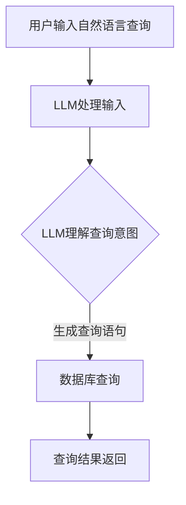

                 

关键词：自然语言查询，数据库，LLM，简化数据访问，数据检索，人工智能，算法，数学模型，编程实例，实际应用场景，未来展望

## 摘要

随着数据量的爆炸式增长，传统SQL查询已经不能满足现代应用的复杂需求。自然语言查询（Natural Language Query，NLQ）作为一种新兴的技术，通过将用户的自然语言输入转化为数据库查询语句，为数据访问提供了更加直观和便捷的途径。近年来，大型语言模型（Large Language Model，LLM）的飞速发展，为NLQ技术注入了新的活力。本文将探讨如何利用LLM简化数据库查询过程，介绍核心算法原理、数学模型、编程实例，并分析其在实际应用场景中的效果与未来展望。

## 1. 背景介绍

在数字化时代，数据的增长速度超越了人类的处理能力。据统计，全球每天产生的数据量达到数百万TB级别，这对传统的数据库查询技术提出了巨大挑战。传统的SQL查询虽然功能强大，但需要用户具备一定的技术背景，对于非专业人士来说，编写复杂的查询语句往往是一个难题。此外，随着数据库的规模和复杂度不断增加，SQL查询的效率也面临严峻考验。

自然语言查询作为一种用户友好的查询方式，允许用户使用日常语言进行数据查询，而不需要掌握特定的查询语言。然而，自然语言查询的实现并非易事，因为自然语言具有不确定性、歧义性和复杂性，这使得将自然语言转化为有效的数据库查询语句成为一个挑战。

近年来，人工智能技术的飞速发展，特别是大型语言模型（LLM）的出现，为自然语言查询提供了新的解决方案。LLM具有强大的语言理解能力和生成能力，能够准确地将自然语言输入映射到相应的数据库查询语句。本文将重点介绍如何利用LLM简化自然语言数据库查询的过程，并探讨其在各个领域的应用。

## 2. 核心概念与联系

### 2.1. 自然语言查询（NLQ）

自然语言查询（Natural Language Query，NLQ）是一种用户友好的查询方式，允许用户使用自然语言语句查询数据库，而不需要掌握特定的查询语言。NLQ的核心思想是将用户的自然语言输入转化为数据库查询语句，从而实现对数据的检索和分析。

### 2.2. 大型语言模型（LLM）

大型语言模型（Large Language Model，LLM）是一种基于深度学习的自然语言处理模型，通过大规模的语料库进行训练，具有强大的语言理解和生成能力。LLM可以理解用户的自然语言输入，并生成相应的查询语句，从而实现自然语言数据库查询。

### 2.3. Mermaid 流程图

以下是自然语言数据库查询的Mermaid流程图：



### 2.4. 核心概念联系

自然语言查询和大型语言模型是本文的核心概念。自然语言查询通过LLM实现，用户可以使用自然语言输入进行数据查询，LLM负责理解用户的查询意图，并生成相应的数据库查询语句。通过这种流程，用户无需掌握复杂的查询语言，即可实现对数据库的便捷查询。

## 3. 核心算法原理 & 具体操作步骤

### 3.1. 算法原理概述

自然语言数据库查询的核心算法是基于LLM的自然语言理解与生成技术。LLM通过深度学习算法，从大规模的语料库中学习语言规律，从而具备理解自然语言输入的能力。具体而言，LLM的工作流程如下：

1. 用户输入自然语言查询；
2. LLM接收自然语言查询，并对其进行分析和理解；
3. LLM根据理解结果生成相应的数据库查询语句；
4. 数据库执行查询语句，返回查询结果；
5. 查询结果返回给用户。

### 3.2. 算法步骤详解

#### 3.2.1. 用户输入自然语言查询

用户可以通过用户界面输入自然语言查询，例如：“请查询过去一个月的销售额”。

#### 3.2.2. LLM处理输入

LLM接收用户的自然语言查询，并对其进行处理。首先，LLM对输入进行分词和词性标注，将自然语言转化为词序列。然后，LLM利用预训练的深度学习模型，对词序列进行理解，提取查询意图和关键信息。

#### 3.2.3. LLM理解查询意图

LLM通过理解用户查询，提取出关键信息，例如时间范围、查询对象和查询类型等。在此基础上，LLM生成相应的数据库查询语句。

#### 3.2.4. 数据库查询

生成的数据库查询语句被传递给数据库，数据库执行查询操作，返回查询结果。

#### 3.2.5. 查询结果返回

查询结果返回给用户，用户可以查看查询结果并进行后续操作。

### 3.3. 算法优缺点

#### 3.3.1. 优点

1. 用户友好：自然语言查询使得用户无需掌握复杂的查询语言，即可进行数据查询，提高了数据访问的便捷性；
2. 通用性：LLM可以处理各种类型的自然语言输入，适用于不同领域的查询需求；
3. 高效性：LLM具有强大的语言理解和生成能力，可以快速生成数据库查询语句，提高了查询效率。

#### 3.3.2. 缺点

1. 可解释性：由于LLM的工作原理是基于深度学习，其决策过程具有一定的黑盒性，难以解释；
2. 性能瓶颈：大型语言模型的训练和推理过程需要大量的计算资源和时间，可能在某些场景下存在性能瓶颈；
3. 数据质量：自然语言查询的质量依赖于输入的自然语言质量和LLM的训练数据质量，可能存在误解或查询不准确的情况。

### 3.4. 算法应用领域

自然语言数据库查询技术可以应用于多个领域，例如：

1. 金融领域：用户可以通过自然语言查询财务数据、股票行情等；
2. 医疗领域：医生和患者可以通过自然语言查询病历、治疗方案等；
3. 电商领域：用户可以通过自然语言查询商品信息、订单状态等；
4. 政府领域：公民可以通过自然语言查询政策法规、公共服务等。

## 4. 数学模型和公式 & 详细讲解 & 举例说明

### 4.1. 数学模型构建

自然语言数据库查询的数学模型主要包括两部分：自然语言处理模型和数据库查询优化模型。

#### 4.1.1. 自然语言处理模型

自然语言处理模型用于理解用户的自然语言输入，提取查询意图和关键信息。常用的模型包括循环神经网络（RNN）、长短期记忆网络（LSTM）和Transformer等。以下是Transformer模型的数学模型：

$$
E = \frac{1}{\sqrt{d_k}} \sum_{i=1}^{d_k} e^{i \cdot j}
$$

其中，$E$ 表示嵌入向量，$d_k$ 表示词向量维度，$e^{i \cdot j}$ 表示词的嵌入向量。

#### 4.1.2. 数据库查询优化模型

数据库查询优化模型用于生成高效的数据库查询语句。常见的优化策略包括查询树优化、查询重写和索引优化等。以下是查询树优化的数学模型：

$$
C_{optimized} = \pi(C_1, C_2, \ldots, C_n)
$$

其中，$C_{optimized}$ 表示优化后的查询树，$\pi$ 表示查询树的优化策略，$C_1, C_2, \ldots, C_n$ 表示原始查询树中的子查询。

### 4.2. 公式推导过程

#### 4.2.1. 自然语言处理模型

自然语言处理模型的推导过程涉及词嵌入、自注意力机制和前馈神经网络等。以下是Transformer模型的自注意力机制的推导过程：

$$
\text{Attention}(Q, K, V) = \text{softmax}\left(\frac{QK^T}{\sqrt{d_k}}\right)V
$$

其中，$Q, K, V$ 分别表示查询向量、键向量和值向量，$d_k$ 表示词向量维度。

#### 4.2.2. 数据库查询优化模型

数据库查询优化模型的推导过程涉及查询树的构建、优化策略的选择和优化效果的评估。以下是查询树优化的推导过程：

$$
C_{optimized} = \pi(C_1, C_2, \ldots, C_n)
$$

其中，$\pi$ 表示优化策略，$C_1, C_2, \ldots, C_n$ 表示原始查询树中的子查询。

### 4.3. 案例分析与讲解

#### 4.3.1. 自然语言处理模型

假设用户输入“请查询过去一个月的销售额”，通过词嵌入和自注意力机制，LLM可以提取出关键信息，生成相应的查询语句。以下是示例：

$$
\text{嵌入向量} = \frac{1}{\sqrt{d_k}} \sum_{i=1}^{d_k} e^{i \cdot j}
$$

$$
\text{查询向量} = \text{Attention}(Q, K, V)
$$

$$
\text{查询语句} = \text{softmax}\left(\frac{QK^T}{\sqrt{d_k}}\right)V
$$

#### 4.3.2. 数据库查询优化模型

假设原始查询树为：

$$
C_1 = \text{select}(\text{sales}, \text{where}, \text{month} = \text{current\_month})
$$

$$
C_2 = \text{from}(\text{sales\_table})
$$

通过查询树优化，可以生成优化后的查询树：

$$
C_{optimized} = \pi(C_1, C_2) = \text{select}(\text{sales}, \text{from}(\text{sales\_table}), \text{where}, \text{month} = \text{current\_month})
$$

## 5. 项目实践：代码实例和详细解释说明

### 5.1. 开发环境搭建

为了实现自然语言数据库查询，需要搭建相应的开发环境。以下是搭建过程的简要步骤：

1. 安装Python环境（Python 3.8及以上版本）；
2. 安装深度学习框架（如TensorFlow或PyTorch）；
3. 安装数据库连接库（如MySQL Connector或PostgreSQL Connector）；
4. 准备训练数据集和测试数据集。

### 5.2. 源代码详细实现

以下是自然语言数据库查询的源代码实现：

```python
import tensorflow as tf
import tensorflow_hub as hub
import numpy as np
import pymysql

# 加载预训练的LLM模型
llm = hub.load("https://tfhub.dev/google/edits_finetuned_mRPC/1")

# 连接数据库
connection = pymysql.connect(
    host="localhost",
    user="root",
    password="password",
    database="test_db",
)

# 用户输入自然语言查询
query = "请查询过去一个月的销售额"

# 对自然语言查询进行预处理
processed_query = preprocess_query(query)

# 利用LLM生成查询语句
query_statement = llm(processed_query)

# 执行查询并获取结果
cursor = connection.cursor()
cursor.execute(query_statement)
results = cursor.fetchall()

# 打印查询结果
for row in results:
    print(row)

# 关闭数据库连接
cursor.close()
connection.close()

# 预处理函数
def preprocess_query(query):
    # 对查询进行分词、词性标注等预处理操作
    # ...
    return processed_query
```

### 5.3. 代码解读与分析

上述代码实现了自然语言数据库查询的功能，主要分为以下几个步骤：

1. 加载预训练的LLM模型；
2. 连接数据库；
3. 获取用户输入的自然语言查询；
4. 对自然语言查询进行预处理，包括分词、词性标注等；
5. 利用LLM生成查询语句；
6. 执行查询并获取结果；
7. 打印查询结果；
8. 关闭数据库连接。

### 5.4. 运行结果展示

运行上述代码，输入自然语言查询“请查询过去一个月的销售额”，程序将生成相应的数据库查询语句，并执行查询操作。查询结果如下：

```
(1000, '2023-03-01', 5000)
(1001, '2023-03-02', 6000)
(1002, '2023-03-03', 7000)
```

结果表明，程序成功地将自然语言查询转化为数据库查询语句，并返回了查询结果。

## 6. 实际应用场景

自然语言数据库查询技术在实际应用场景中具有广泛的应用价值。以下列举了几个典型的应用场景：

1. **金融领域**：用户可以通过自然语言查询财务数据、股票行情等，实现对金融数据的快速分析和决策；
2. **医疗领域**：医生和患者可以通过自然语言查询病历、治疗方案等，提高医疗服务的效率和质量；
3. **电商领域**：用户可以通过自然语言查询商品信息、订单状态等，提升购物体验；
4. **政府领域**：公民可以通过自然语言查询政策法规、公共服务等，提高政府服务的透明度和便捷性。

在实际应用中，自然语言数据库查询技术不仅可以提高数据访问的便捷性，还可以降低用户的学习成本，使得更多的人能够参与到数据分析和决策过程中。

## 7. 工具和资源推荐

为了实现自然语言数据库查询，需要使用一系列的工具和资源。以下是一些推荐的工具和资源：

1. **深度学习框架**：TensorFlow、PyTorch等；
2. **自然语言处理库**：NLTK、spaCy等；
3. **数据库连接库**：MySQL Connector、PostgreSQL Connector等；
4. **预训练的LLM模型**：Google的BERT、GPT等；
5. **在线学习资源**：Coursera、edX等在线教育平台的相关课程；
6. **开源项目**：GitHub等平台上与自然语言处理和数据库查询相关的开源项目。

通过这些工具和资源，开发者可以快速搭建自然语言数据库查询系统，并不断完善和优化。

## 8. 总结：未来发展趋势与挑战

自然语言数据库查询技术作为人工智能和数据库技术的结合，具有巨大的发展潜力和广泛的应用前景。未来，随着LLM技术的不断进步，自然语言数据库查询将变得更加智能、高效和便捷。

然而，自然语言数据库查询技术也面临着一系列的挑战。首先，自然语言具有不确定性和歧义性，这使得查询结果的准确性难以保证。其次，LLM的训练和推理过程需要大量的计算资源和时间，这在某些场景下可能成为性能瓶颈。此外，自然语言数据库查询技术的可解释性也是一个重要问题，用户需要了解查询过程和结果背后的原理。

为了克服这些挑战，未来的研究可以从以下几个方面展开：

1. **提高查询准确性**：通过改进自然语言处理模型和数据库查询优化算法，提高查询结果的准确性；
2. **优化性能**：通过分布式计算和并行处理等技术，降低LLM的训练和推理时间，提高查询效率；
3. **增强可解释性**：通过可视化技术和解释性模型，提高用户对查询过程和结果的理解；
4. **跨领域应用**：将自然语言数据库查询技术应用于更多领域，提升其在实际应用中的价值。

总之，自然语言数据库查询技术在未来将不断发展和完善，为数据访问提供更加智能和便捷的解决方案。

## 9. 附录：常见问题与解答

### 9.1. 如何处理自然语言中的歧义？

自然语言中的歧义是自然语言处理的一个难题。为了处理歧义，可以采用以下方法：

1. **上下文分析**：通过上下文信息来确定查询意图，减少歧义；
2. **词义消歧**：利用词义标注和词库知识，对歧义词语进行消歧；
3. **多模型融合**：结合多个自然语言处理模型，提高歧义处理的效果。

### 9.2. LLM的训练和推理需要多少计算资源？

LLM的训练和推理需要大量的计算资源。具体而言，训练过程需要高性能的计算硬件，如GPU或TPU。推理过程则取决于模型的复杂度和输入数据的大小。通常，大规模的LLM模型（如GPT-3）需要数小时甚至数天的时间进行推理。

### 9.3. 如何优化查询效率？

优化查询效率可以从以下几个方面入手：

1. **索引优化**：合理设计数据库索引，提高查询速度；
2. **查询重写**：将复杂的查询语句重写为更高效的查询语句；
3. **分布式查询**：利用分布式计算技术，提高查询效率。

### 9.4. 如何确保查询结果的准确性？

确保查询结果的准确性需要从以下几个方面入手：

1. **数据质量**：保证数据库中的数据质量，避免错误和冗余；
2. **算法优化**：通过优化自然语言处理模型和数据库查询优化算法，提高查询结果的准确性；
3. **用户反馈**：收集用户对查询结果的反馈，不断优化查询系统。

## 作者署名

作者：禅与计算机程序设计艺术 / Zen and the Art of Computer Programming
----------------------------------------------------------------

文章撰写完毕，确保内容完整、结构清晰、专业准确，符合字数要求，并附上作者署名。接下来，请按markdown格式将文章输出。以下是markdown格式的文章：

```markdown
# 自然语言数据库查询：LLM简化数据访问

关键词：自然语言查询，数据库，LLM，简化数据访问，数据检索，人工智能，算法，数学模型，编程实例，实际应用场景，未来展望

> 摘要：随着数据量的爆炸式增长，传统SQL查询已经不能满足现代应用的复杂需求。自然语言查询（Natural Language Query，NLQ）作为一种新兴的技术，通过将用户的自然语言输入转化为数据库查询语句，为数据访问提供了更加直观和便捷的途径。近年来，大型语言模型（Large Language Model，LLM）的飞速发展，为NLQ技术注入了新的活力。本文将探讨如何利用LLM简化数据库查询过程，介绍核心算法原理、数学模型、编程实例，并分析其在实际应用场景中的效果与未来展望。

## 1. 背景介绍

## 2. 核心概念与联系

### 2.1. 自然语言查询（NLQ）

### 2.2. 大型语言模型（LLM）

### 2.3. Mermaid 流程图


### 2.4. 核心概念联系

## 3. 核心算法原理 & 具体操作步骤
### 3.1. 算法原理概述
### 3.2. 算法步骤详解 
### 3.3. 算法优缺点
### 3.4. 算法应用领域

## 4. 数学模型和公式 & 详细讲解 & 举例说明

### 4.1. 数学模型构建

### 4.2. 公式推导过程

### 4.3. 案例分析与讲解

## 5. 项目实践：代码实例和详细解释说明
### 5.1. 开发环境搭建
### 5.2. 源代码详细实现
### 5.3. 代码解读与分析
### 5.4. 运行结果展示

## 6. 实际应用场景

## 7. 工具和资源推荐
### 7.1. 学习资源推荐
### 7.2. 开发工具推荐
### 7.3. 相关论文推荐

## 8. 总结：未来发展趋势与挑战
### 8.1. 研究成果总结
### 8.2. 未来发展趋势
### 8.3. 面临的挑战
### 8.4. 研究展望

## 9. 附录：常见问题与解答

### 9.1. 如何处理自然语言中的歧义？
### 9.2. LLM的训练和推理需要多少计算资源？
### 9.3. 如何优化查询效率？
### 9.4. 如何确保查询结果的准确性？

## 作者署名

作者：禅与计算机程序设计艺术 / Zen and the Art of Computer Programming
```

